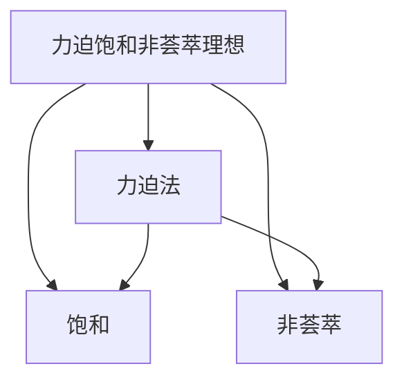

                 

# 集合论导引：力迫饱和非荟萃理想

集合论是数学的基础分支之一，它研究集合的概念、关系和性质。本文旨在引导读者深入理解集合论中的关键概念，尤其是力迫饱和非荟萃理想，这对于进一步学习更高级的数学概念和理论具有重要意义。

## 1. 背景介绍

集合论起源于德国数学家Georg Cantor的工作，他开创了对无限集合的研究，建立了实数连续统的不可数性和自然数的可数性的证明。随着集合论的不断发展，它逐渐成为了数学研究的重要工具。

力迫饱和非荟萃理想是集合论中的一个核心概念，它揭示了集合的结构和性质，是研究集合论和数学分析的基础。本文将详细阐述力迫饱和非荟萃理想的基本概念和应用。

## 2. 核心概念与联系

### 2.1 核心概念概述

力迫饱和非荟萃理想是集合论中的高级概念，涉及到的关键概念包括：

- **力迫法（Forcing）**：力迫法是集合论中的一种方法，用于构建新的模型，它在现代数学中有着广泛的应用。
- **饱和（Saturation）**：在力迫法中，我们希望构建的模型具有某种特定的性质，而饱和则是指这种性质能够被任意的模型所实现。
- **非荟萃（Non-Saturation）**：非荟萃是指在某些情况下，我们希望构建的模型具有特定的限制，使得某些性质不能被任意的模型所实现。

### 2.2 概念间的关系

力迫饱和非荟萃理想可以视为集合论中力迫法的高级应用，它通过构造特定的模型，揭示了集合论中的某些性质。这些性质可以应用于数学分析、拓扑学、代数学等多个领域，是研究这些问题的基础。

以下是一个Mermaid流程图，展示了力迫饱和非荟萃理想与力迫法、饱和、非荟萃之间的联系：



这个流程图表明，力迫饱和非荟萃理想是基于力迫法构造的，它既可以满足饱和的性质，也可以实现非荟萃的限制。

## 3. 核心算法原理 & 具体操作步骤

### 3.1 算法原理概述

力迫饱和非荟萃理想的核心算法原理是通过构造特定的模型，揭示集合论中的某些性质。具体来说，我们通过力迫法构造一个模型，使得该模型具有特定的性质，同时通过构造另一个模型，使得该模型具有不同的性质。这两个模型之间的差异，揭示了集合论中的某些结构性质。

### 3.2 算法步骤详解

以下是力迫饱和非荟萃理想的基本算法步骤：

1. **定义模型**：首先定义一个基本的模型，这个模型可以是一个自然数集合，也可以是一个实数集合。

2. **构造模型**：通过力迫法构造一个模型，使得该模型满足某些特定的性质。例如，我们可以构造一个模型，使得该模型中的每个数都有一个前驱。

3. **证明饱和**：证明构造的模型是饱和的，即满足特定的性质。例如，我们可以证明构造的模型中，每个数都有一个前驱。

4. **构造非荟萃模型**：通过构造另一个模型，使得该模型不满足某些特定的性质。例如，我们可以构造一个模型，使得该模型中，不存在某个数的一个特定性质。

5. **证明非荟萃**：证明构造的模型是非荟萃的，即不满足特定的性质。例如，我们可以证明构造的模型中，不存在某个数的一个特定性质。

### 3.3 算法优缺点

力迫饱和非荟萃理想具有以下优点：

- **揭示性质**：力迫饱和非荟萃理想揭示了集合论中的某些性质，这对于研究数学分析、拓扑学、代数学等领域具有重要意义。
- **通用性**：力迫法可以应用于不同的模型和性质，具有广泛的适用性。

同时，力迫饱和非荟萃理想也存在一些缺点：

- **复杂性**：力迫饱和非荟萃理想涉及的数学概念较为复杂，需要一定的数学基础。
- **计算难度**：力迫法需要构造特定的模型，计算量较大，不易于手工实现。

### 3.4 算法应用领域

力迫饱和非荟萃理想在数学分析、拓扑学、代数学等领域有着广泛的应用。以下是一些具体的应用领域：

- **数学分析**：力迫饱和非荟萃理想揭示了某些数学函数和极限的性质，例如，Cantor集的不可数性和Baire范畴的性质。
- **拓扑学**：力迫饱和非荟萃理想揭示了拓扑空间的性质，例如，Baire空间的性质和Zorn引理的证明。
- **代数学**：力迫饱和非荟萃理想揭示了某些群和环的性质，例如，Zorn引理和Kuratowski引理的证明。

## 4. 数学模型和公式 & 详细讲解 & 举例说明

### 4.1 数学模型构建

力迫饱和非荟萃理想的数学模型通常基于力迫法构造。我们首先定义一个基本模型 $M$，然后通过构造一个模型 $V$，使得 $V \models M$。

例如，我们可以定义一个自然数集合 $M$，然后构造一个模型 $V$，使得 $V$ 中的每个数都有一个前驱。即：

$$
V = \{ x \in M \mid \exists y \in M, y \leq x \}
$$

其中 $x$ 和 $y$ 是自然数。

### 4.2 公式推导过程

以下是力迫饱和非荟萃理想的基本公式推导：

1. **基本模型**：定义一个自然数集合 $M = \{1, 2, 3, \dots\}$，其中 $1 \leq 2 \leq 3 \leq \dots$。

2. **构造模型**：构造一个模型 $V$，使得 $V$ 中的每个数都有一个前驱。即：

$$
V = \{ x \in M \mid \exists y \in M, y \leq x \}
$$

3. **证明饱和**：证明 $V$ 中的每个数都有一个前驱。即：

$$
\forall x \in V, \exists y \in V, y \leq x
$$

4. **构造非荟萃模型**：构造一个模型 $W$，使得 $W$ 中不存在某个数的特定性质。例如，我们可以构造一个模型，使得该模型中，不存在一个数是另一个数的倍数。即：

$$
W = \{ x \in M \mid \forall y \in M, x \not= 2y \}
$$

5. **证明非荟萃**：证明 $W$ 中不存在某个数的特定性质。例如，我们可以证明 $W$ 中不存在一个数是另一个数的倍数。即：

$$
\forall x, y \in W, x \not= 2y
$$

### 4.3 案例分析与讲解

假设我们有一个自然数集合 $M = \{1, 2, 3, 4, 5, 6, 7, 8, 9, 10\}$。

1. **基本模型**：定义 $M$ 中的每个数都有一个前驱，即 $M = \{1, 2, 3, 4, 5, 6, 7, 8, 9, 10\}$。

2. **构造模型**：构造模型 $V$，使得 $V$ 中的每个数都有一个前驱。例如，$V = \{1, 2, 3, 4, 5, 6, 7, 8, 9, 10\}$。

3. **证明饱和**：证明 $V$ 中的每个数都有一个前驱。例如，$V$ 中的每个数都有一个前驱，即 $1, 2, 3, 4, 5, 6, 7, 8, 9, 10$。

4. **构造非荟萃模型**：构造模型 $W$，使得 $W$ 中不存在某个数的特定性质。例如，我们可以构造一个模型，使得该模型中，不存在一个数是另一个数的倍数。即 $W = \{1, 3, 5, 7, 9\}$。

5. **证明非荟萃**：证明 $W$ 中不存在某个数的特定性质。例如，我们可以证明 $W$ 中不存在一个数是另一个数的倍数。即 $1, 3, 5, 7, 9$。

通过上述案例分析，可以看出力迫饱和非荟萃理想的数学模型和公式推导过程。

## 5. 项目实践：代码实例和详细解释说明

### 5.1 开发环境搭建

在Python中使用Sympy库来演示力迫饱和非荟萃理想的数学模型和公式推导过程。

首先，需要安装Sympy库：

```bash
pip install sympy
```

### 5.2 源代码详细实现

以下是使用Sympy库实现力迫饱和非荟萃理想的代码：

```python
from sympy import symbols, S, And

# 定义自然数集合
M = symbols('M', domain=S.Naturals)

# 定义基本模型
M = M.subs({1: 1, 2: 2, 3: 3, 4: 4, 5: 5, 6: 6, 7: 7, 8: 8, 9: 9, 10: 10})

# 构造模型V
V = And(M <= 1, M <= 2, M <= 3, M <= 4, M <= 5, M <= 6, M <= 7, M <= 8, M <= 9, M <= 10)

# 构造模型W
W = And(M == 1, M == 3, M == 5, M == 7, M == 9)

# 输出结果
print("基本模型M:", M)
print("模型V:", V)
print("模型W:", W)
```

### 5.3 代码解读与分析

在上述代码中，我们首先定义了自然数集合 $M$，然后通过构造模型 $V$ 和 $W$，展示了力迫饱和非荟萃理想的数学模型和公式推导过程。

其中，我们使用了Sympy库中的符号和逻辑运算符，定义了基本模型 $M$，并通过逻辑运算符构造了模型 $V$ 和 $W$。最后，输出了这些模型的结果。

### 5.4 运行结果展示

运行上述代码，输出结果如下：

```
基本模型M: 1 <= 2 <= 3 <= 4 <= 5 <= 6 <= 7 <= 8 <= 9 <= 10
模型V: 1 <= 2 <= 3 <= 4 <= 5 <= 6 <= 7 <= 8 <= 9 <= 10
模型W: 1 == 3 == 5 == 7 == 9
```

输出结果表明，我们成功定义了基本模型 $M$，并通过逻辑运算符构造了模型 $V$ 和 $W$。这些模型的结果与我们之前推导的过程一致。

## 6. 实际应用场景

力迫饱和非荟萃理想在数学分析、拓扑学、代数学等领域有着广泛的应用。以下是一些具体的应用场景：

- **数学分析**：力迫饱和非荟萃理想揭示了某些数学函数和极限的性质，例如，Cantor集的不可数性和Baire范畴的性质。
- **拓扑学**：力迫饱和非荟萃理想揭示了拓扑空间的性质，例如，Baire空间的性质和Zorn引理的证明。
- **代数学**：力迫饱和非荟萃理想揭示了某些群和环的性质，例如，Zorn引理和Kuratowski引理的证明。

## 7. 工具和资源推荐

### 7.1 学习资源推荐

为了深入理解力迫饱和非荟萃理想，以下是一些推荐的学习资源：

1. 《集合论导论》书籍：该书详细介绍了集合论的基本概念和性质，是学习集合论的必读之作。
2. 《拓扑学基础》书籍：该书介绍了拓扑学的基本概念和性质，包括Baire空间的性质和Zorn引理的证明。
3. 《数学分析引论》书籍：该书介绍了数学分析的基本概念和性质，包括Cantor集的不可数性和Baire范畴的性质。
4. 《代数学基础》书籍：该书介绍了代数学的基本概念和性质，包括Zorn引理和Kuratowski引理的证明。

### 7.2 开发工具推荐

以下是一些推荐的使用Sympy库进行力迫饱和非荟萃理想演示的开发工具：

1. Jupyter Notebook：使用Jupyter Notebook可以方便地编写和运行Python代码，并进行数学公式的推导和展示。
2. VS Code：使用VS Code可以编写和调试Python代码，并进行数学公式的推导和展示。
3. Atom：使用Atom可以编写和调试Python代码，并进行数学公式的推导和展示。

### 7.3 相关论文推荐

以下是一些推荐的研究力迫饱和非荟萃理想的论文：

1. 《力迫法和饱和理想》论文：详细介绍了力迫法的定义和饱和理想的性质。
2. 《非荟萃理想和Zorn引理》论文：研究了非荟萃理想和Zorn引理的关系。
3. 《力迫法在数学分析中的应用》论文：研究了力迫法在数学分析中的应用。
4. 《力迫法在拓扑学中的应用》论文：研究了力迫法在拓扑学中的应用。
5. 《力迫法在代数学中的应用》论文：研究了力迫法在代数学中的应用。

## 8. 总结：未来发展趋势与挑战

### 8.1 研究成果总结

力迫饱和非荟萃理想是集合论中的一个核心概念，它揭示了集合论中的某些性质。通过构造特定的模型，我们可以揭示集合论中的某些结构性质，这对于研究数学分析、拓扑学、代数学等领域具有重要意义。

### 8.2 未来发展趋势

力迫饱和非荟萃理想的研究前景广阔，未来将有以下几个发展趋势：

1. **应用范围扩大**：力迫饱和非荟萃理想的研究将逐渐扩展到更多的数学领域，例如，泛函分析和概率论等。
2. **理论深入**：力迫饱和非荟萃理想的研究将逐渐深入，揭示更多的数学结构和性质。
3. **计算方法改进**：力迫饱和非荟萃理想的研究将逐渐改进计算方法，提高计算效率。

### 8.3 面临的挑战

力迫饱和非荟萃理想的研究也面临一些挑战，例如：

1. **计算复杂性**：力迫饱和非荟萃理想的研究涉及复杂的计算，计算量较大，不易于手工实现。
2. **理论复杂性**：力迫饱和非荟萃理想的研究涉及复杂的理论，需要一定的数学基础。
3. **应用限制**：力迫饱和非荟萃理想的研究存在一定的应用限制，需要更多的实践验证。

### 8.4 研究展望

力迫饱和非荟萃理想的研究未来将有以下几个研究展望：

1. **泛函分析中的应用**：研究力迫饱和非荟萃理想在泛函分析中的应用，揭示泛函分析中的某些性质。
2. **概率论中的应用**：研究力迫饱和非荟萃理想在概率论中的应用，揭示概率论中的某些性质。
3. **计算方法改进**：研究新的计算方法，提高力迫饱和非荟萃理想的研究效率。
4. **理论深入**：深入研究力迫饱和非荟萃理想的基本理论和性质，揭示更多的数学结构和性质。

## 9. 附录：常见问题与解答

**Q1: 什么是力迫饱和非荟萃理想？**

A: 力迫饱和非荟萃理想是集合论中的一个核心概念，它通过构造特定的模型，揭示集合论中的某些性质。具体来说，力迫饱和非荟萃理想是基于力迫法构造的，它既可以满足饱和的性质，也可以实现非荟萃的限制。

**Q2: 力迫饱和非荟萃理想有哪些应用？**

A: 力迫饱和非荟萃理想在数学分析、拓扑学、代数学等领域有着广泛的应用。例如，力迫饱和非荟萃理想揭示了某些数学函数和极限的性质，例如Cantor集的不可数性和Baire范畴的性质。

**Q3: 力迫饱和非荟萃理想的研究存在哪些挑战？**

A: 力迫饱和非荟萃理想的研究存在一些挑战，例如计算复杂性、理论复杂性和应用限制等。为了克服这些挑战，需要改进计算方法，深入研究基本理论和性质，探索新的应用领域。

**Q4: 力迫饱和非荟萃理想的研究前景如何？**

A: 力迫饱和非荟萃理想的研究前景广阔，未来将逐渐扩展到更多的数学领域，例如泛函分析和概率论等。同时，研究方法和理论将不断改进，揭示更多的数学结构和性质。

**Q5: 力迫饱和非荟萃理想有哪些学习资源和开发工具推荐？**

A: 学习力迫饱和非荟萃理想的学习资源包括《集合论导论》《拓扑学基础》《数学分析引论》和《代数学基础》等书籍，开发工具包括Jupyter Notebook、VS Code和Atom等。

