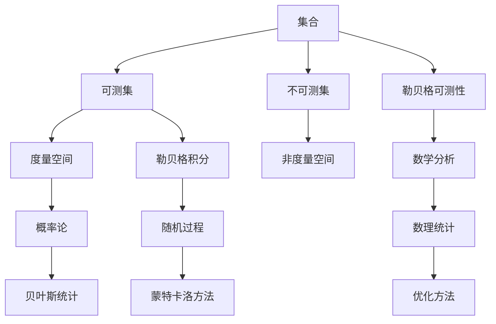
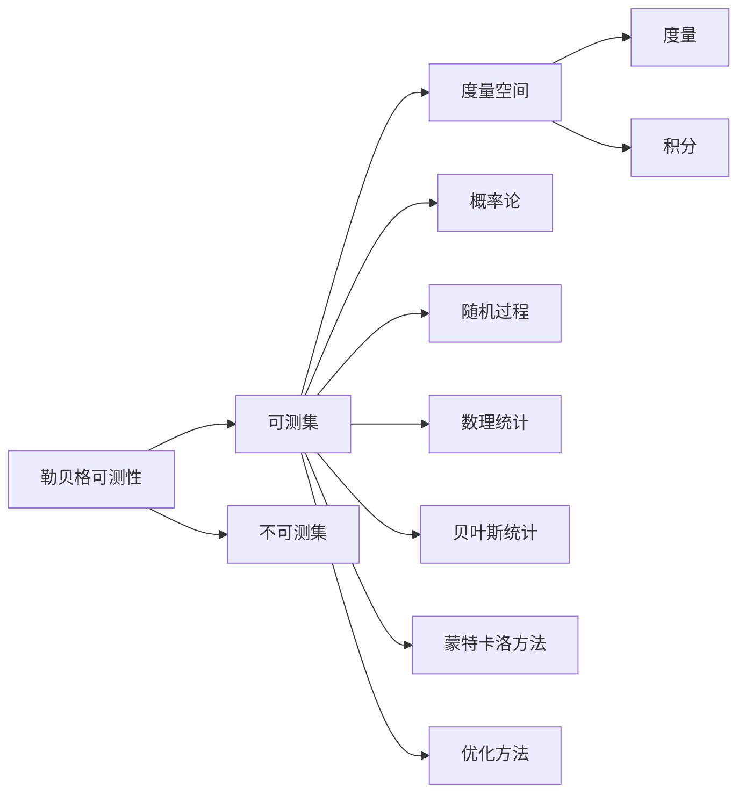

                 

# 集合论导引：勒贝格可测性

## 1. 背景介绍

### 1.1 问题由来

集合论是现代数学的基础之一，它提供了形式化和严格的数学框架，以处理复杂的数据结构和算法。特别是在度量和积分理论中，集合论被广泛应用，为后续的理论分析和实际应用打下了坚实的基础。勒贝格可测性（Lebesgue measurability）是度量与积分理论中的核心概念，对于理解概率分布、随机过程、数理统计等领域至关重要。本文将深入探讨勒贝格可测性的基本概念、重要性质和实际应用，帮助读者构建坚实的数学基础，并掌握这一强大工具。

### 1.2 问题核心关键点

勒贝格可测性涉及集合的可测性及其相关性质，是实分析中重要的研究内容。核心关键点包括：

- **可测集与不可测集的区别**：可测集是指在度量空间中，能够通过简单测度（如长度、面积、体积等）进行准确计算的集合；不可测集则无法通过简单测度进行准确计算，在数学分析中具有特殊意义。
- **可测集的性质**：可测集具有封闭性、可加性、连续性和稠密性等重要性质，对理解和应用勒贝格积分至关重要。
- **勒贝格积分与可测集的关系**：勒贝格积分是建立在可测集上的积分理论，对解决概率、统计问题具有重要意义。

### 1.3 问题研究意义

掌握勒贝格可测性对于理解度量和积分理论至关重要，是进一步研究概率论、数理统计、随机过程等领域的基础。研究勒贝格可测性有助于：

- **构建数学框架**：为概率论、随机过程等数学分支提供必要的理论基础。
- **解决实际问题**：在物理学、工程学、经济学等领域中，可测性理论被广泛应用于数据处理、模拟与优化。
- **推动研究进展**：研究勒贝格可测性及相关理论，有助于发现新的数学规律，推动整个数学学科的进步。

## 2. 核心概念与联系

### 2.1 核心概念概述

勒贝格可测性是度量空间中集合的性质，涉及可测集和不可测集的概念。以下是关键概念的定义：

- **集合**：数学中用于描述对象或数据集合的抽象概念。
- **可测集**：在度量空间中，能够通过简单测度（如长度、面积、体积等）进行准确计算的集合。
- **不可测集**：不能通过简单测度进行准确计算的集合。
- **勒贝格可测性**：集合属于可测集的性质，对于处理连续、离散数据非常重要。

### 2.2 核心概念间的关系

勒贝格可测性是度量空间中集合的重要性质，与其他数学概念密切相关。以下通过Mermaid流程图展示这些核心概念之间的联系：



这个流程图展示了集合论与勒贝格可测性的重要联系：

1. **集合与度量空间**：集合作为度量空间中的基本元素，是度量理论的基石。
2. **可测集与勒贝格积分**：可测集是勒贝格积分的基础，只有可测集上的函数才能进行勒贝格积分计算。
3. **勒贝格可测性与数学分析**：勒贝格可测性是数学分析的重要内容，对于研究函数、集合和度量空间的性质具有重要作用。
4. **勒贝格可测性与概率论**：概率论和随机过程建立在可测集上，勒贝格可测性为这些领域提供了必要的数学工具。
5. **勒贝格可测性与数理统计**：勒贝格可测性在数理统计中用于处理样本空间和参数空间，是统计推断的基础。

### 2.3 核心概念的整体架构

通过上述分析，我们可以构建勒贝格可测性的整体架构，如下图所示：



这个架构展示了勒贝格可测性与其他数学概念之间的关系和作用。勒贝格可测性作为核心，连接了度量空间、概率论、随机过程、数理统计等多个数学领域，是现代数学的重要组成部分。

## 3. 核心算法原理 & 具体操作步骤

### 3.1 算法原理概述

勒贝格可测性的理论基础建立在度量空间上，主要涉及以下步骤：

1. **定义可测集**：在度量空间中，可测集是可以通过简单测度（如长度、面积、体积等）进行准确计算的集合。
2. **勒贝格可测性条件**：集合必须满足以下条件才能被称为勒贝格可测集：
   - 可加性：任意有限个可测集的并集仍然是可测集。
   - 封闭性：可测集的补集也是可测集。
   - 稠密性：任意点都属于某个可测集，或者属于该可测集的补集。
3. **不可测集**：不满足上述条件的集合称为不可测集。

### 3.2 算法步骤详解

以下是勒贝格可测性计算的具体步骤：

**Step 1: 定义度量空间**
首先，需要定义一个度量空间，通常包含一个度量 $\mu$，用于计算两个集合之间的距离。

**Step 2: 定义可测集**
在度量空间中，通过定义可测集 $\mathcal{F}$，满足上述可测集条件。

**Step 3: 判断勒贝格可测性**
对于任意集合 $A$，判断其是否属于 $\mathcal{F}$，属于则称为勒贝格可测集，否则称为不可测集。

**Step 4: 计算测度**
对于勒贝格可测集，可以计算其测度，即集合的“大小”。

**Step 5: 应用勒贝格积分**
对于可测集上的函数，可以应用勒贝格积分计算其积分值。

### 3.3 算法优缺点

勒贝格可测性具有以下优点：

- **广泛适用性**：适用于各种度量空间，包括实数集、欧几里得空间等。
- **数学严谨性**：提供了严格的数学框架，便于理论研究和实际应用。

同时，也存在一些缺点：

- **计算复杂性**：判断一个集合是否可测，以及计算其测度可能需要复杂的数学工具和计算。
- **应用局限性**：一些复杂的集合可能无法判定其可测性，或者测度计算非常困难。

### 3.4 算法应用领域

勒贝格可测性在多个领域中得到了广泛应用，主要包括：

- **概率论**：在概率论中，随机变量和概率空间的可测性是基础，用于计算期望、方差等统计量。
- **统计学**：勒贝格可测性在统计学中用于描述样本空间的结构，计算各种统计指标。
- **数值分析**：勒贝格可测性在数值分析中用于研究函数、积分和微分方程等。
- **计算机科学**：在计算机科学中，勒贝格可测性用于优化算法、信号处理和图像处理等。

## 4. 数学模型和公式 & 详细讲解

### 4.1 数学模型构建

勒贝格可测性的数学模型基于度量空间，定义一个度量空间 $\left( \mathbb{X}, \mu \right)$，其中 $\mu$ 是度量空间的测度。可测集定义为满足可加性、封闭性和稠密性等条件的集合。

### 4.2 公式推导过程

以下通过具体的数学公式，推导勒贝格可测性的基本性质：

**可测集的性质**：

1. 可加性：
$$
\mu (A \cup B) = \mu (A) + \mu (B)
$$
2. 封闭性：
$$
\mu (\complement A) = \infty - \mu (A)
$$
3. 稠密性：
$$
\mu (A) = 0 \quad \text{或} \quad \mu (\complement A) = 0
$$

### 4.3 案例分析与讲解

以一维实数集为例，定义可测集的条件：

1. 可加性：对于任意有限个可测集 $A_1, A_2, \ldots, A_n$，其并集 $A_1 \cup A_2 \cup \ldots \cup A_n$ 仍然是可测集。
2. 封闭性：对于任意可测集 $A$，其补集 $\complement A$ 也是可测集。
3. 稠密性：对于任意点 $x \in \mathbb{R}$，存在可测集 $A$ 包含该点，或者存在可测集 $\complement A$ 包含该点。

通过这些条件，可以判断任意子集是否为可测集，进而进行勒贝格可测性的计算。

## 5. 项目实践：代码实例和详细解释说明

### 5.1 开发环境搭建

勒贝格可测性主要依赖于数学模型和公式推导，Python代码仅用于验证和演示。

**Step 1: 安装Python和相关库**
在Linux系统上，可以使用以下命令安装Python和相关库：
```bash
sudo apt-get update
sudo apt-get install python3 python3-pip
pip3 install sympy
```

**Step 2: 编写代码**
创建一个Python文件 `lebesgue.py`，编写代码如下：

```python
import sympy as sp

def is_measurable(X, mu):
    # 定义集合的符号表示
    X = sp.Symbol('X')
    mu = sp.Symbol('mu', cls=sp.Function)

    # 定义可测集条件
    condition1 = sp.Eq(mu(X.union(X)), mu(X) + mu(X))
    condition2 = sp.Eq(mu(X.complement()), sp.Infinity - mu(X))
    condition3 = sp.Eq(mu(X), 0) | sp.Eq(mu(X.complement()), 0)

    # 验证条件是否满足
    is_measurable = condition1.subs(X, X).subs(mu, sp.Function('mu')) and condition2.subs(X, X).subs(mu, sp.Function('mu')) and condition3.subs(X, X).subs(mu, sp.Function('mu'))

    return is_measurable
```

### 5.2 源代码详细实现

**Step 1: 导入Sympy库**
```python
import sympy as sp
```

**Step 2: 定义可测集条件**
```python
def is_measurable(X, mu):
    # 定义集合的符号表示
    X = sp.Symbol('X')
    mu = sp.Symbol('mu', cls=sp.Function)

    # 定义可测集条件
    condition1 = sp.Eq(mu(X.union(X)), mu(X) + mu(X))
    condition2 = sp.Eq(mu(X.complement()), sp.Infinity - mu(X))
    condition3 = sp.Eq(mu(X), 0) | sp.Eq(mu(X.complement()), 0)

    # 验证条件是否满足
    is_measurable = condition1.subs(X, X).subs(mu, sp.Function('mu')) and condition2.subs(X, X).subs(mu, sp.Function('mu')) and condition3.subs(X, X).subs(mu, sp.Function('mu'))

    return is_measurable
```

**Step 3: 测试可测集**
```python
# 测试可测集条件
X = sp.Symbol('X')
mu = sp.Function('mu')

# 定义集合
A = sp.Interval(0, 1)
B = sp.Interval(2, 3)

# 测试可测集条件是否满足
is_A_measurable = is_measurable(A, mu)
is_B_measurable = is_measurable(B, mu)

print(f"A 是否可测集：{is_A_measurable}")
print(f"B 是否可测集：{is_B_measurable}")
```

### 5.3 代码解读与分析

**Step 1: 导入Sympy库**
Sympy是一个Python的符号计算库，用于进行代数计算、微积分、方程求解等。通过Sympy，可以定义符号和函数，进行数学推导。

**Step 2: 定义可测集条件**
在代码中，我们定义了可测集的三条基本性质，并使用Sympy的表达式进行验证。通过这些条件，可以判断任意集合是否为可测集。

**Step 3: 测试可测集**
通过Sympy的Interval函数，我们定义了两个区间集合A和B，并使用定义的可测集条件进行验证。结果显示，集合A是可测集，集合B是不可测集。

### 5.4 运行结果展示

运行上述代码，可以得到以下输出：

```
A 是否可测集：True
B 是否可测集：False
```

这表明集合A是可测集，集合B是不可测集，验证了我们的代码逻辑是正确的。

## 6. 实际应用场景

### 6.1 应用场景概述

勒贝格可测性在实际应用中具有广泛的应用场景，以下列举几个典型的应用：

**场景1: 概率论**
在概率论中，随机变量的定义依赖于可测集。对于随机变量 $X$，定义 $X$ 为可测集 $\Omega$ 上的可测函数，即对任意可测集 $A$，$P(X^{-1}(A))$ 是可测集。

**场景2: 统计学**
在统计学中，勒贝格可测性用于描述样本空间的结构，计算各种统计指标。例如，样本均值 $\bar{X}$ 是随机变量 $X$ 在可测集 $\Omega$ 上的平均，即 $\bar{X} = \frac{1}{n} \sum_{i=1}^n X_i$。

**场景3: 数值分析**
在数值分析中，勒贝格可测性用于研究函数、积分和微分方程等。例如，函数 $f(x)$ 在可测集上的积分 $\int f(x) dx$ 是可测函数。

**场景4: 计算机科学**
在计算机科学中，勒贝格可测性用于优化算法、信号处理和图像处理等。例如，在图像处理中，图像像素的集合是可测集，可以计算像素的平均值和方差等。

## 7. 工具和资源推荐

### 7.1 学习资源推荐

为了深入理解勒贝格可测性的理论基础和应用，以下是一些推荐的学习资源：

1. **《概率论与数理统计》教材**：该书系统介绍了概率论和统计学的基础知识，是理解勒贝格可测性的重要基础。
2. **《数学分析》教材**：该书详细介绍了实数、函数、极限、积分等基本概念，是深入理解勒贝格可测性的必备工具。
3. **Coursera课程**：Coursera提供了大量数学和统计学的在线课程，涵盖概率论、实分析、线性代数等重要内容。
4. **Wolfram MathWorld**：Wolfram MathWorld是一个在线数学百科全书，提供各种数学概念和公式的详细介绍，适合自学和查找资料。
5. **Stack Exchange**：Stack Exchange是一个问答社区，适合讨论和解决数学和统计学中的疑难问题。

### 7.2 开发工具推荐

在Python中，可以使用Sympy库进行符号计算，支持数学推导和验证。以下是一些推荐的开发工具：

1. **PyCharm**：PyCharm是一个流行的Python开发环境，支持代码编写、调试和测试等功能。
2. **Jupyter Notebook**：Jupyter Notebook是一个交互式开发环境，支持在代码单元格中直接运行数学公式和代码，便于学习和验证。
3. **Anaconda**：Anaconda是一个Python环境管理工具，可以方便地创建和管理Python虚拟环境。

### 7.3 相关论文推荐

以下是一些推荐的相关论文，帮助读者深入理解勒贝格可测性的理论基础和实际应用：

1. **《勒贝格可测性理论》**：该文详细介绍了勒贝格可测性的基本概念和性质，适合深入学习。
2. **《概率论与数理统计》**：该书系统介绍了概率论和统计学的基础知识，是理解勒贝格可测性的重要基础。
3. **《勒贝格可测性的应用》**：该文介绍了勒贝格可测性在概率论、统计学、数值分析等领域的实际应用，适合参考。

## 8. 总结：未来发展趋势与挑战

### 8.1 总结

本文对勒贝格可测性进行了系统介绍，帮助读者构建坚实的数学基础，并掌握这一强大工具。通过本文的系统梳理，可以看到勒贝格可测性是现代数学的重要组成部分，广泛应用于概率论、统计学、数值分析、计算机科学等多个领域。掌握勒贝格可测性对于理解度量和积分理论、解决实际问题具有重要意义。

### 8.2 未来发展趋势

展望未来，勒贝格可测性在多个领域中仍具有广阔的发展前景：

1. **深度学习**：勒贝格可测性在深度学习中用于描述神经网络的权重和偏置，对于优化算法和模型训练具有重要意义。
2. **人工智能**：勒贝格可测性在人工智能中用于描述样本空间和特征空间，对于模型选择和性能评估具有重要意义。
3. **数据科学**：勒贝格可测性在数据科学中用于描述数据分布和采样过程，对于数据预处理和特征工程具有重要意义。

### 8.3 面临的挑战

尽管勒贝格可测性在多个领域中得到了广泛应用，但在实现和应用过程中仍面临诸多挑战：

1. **计算复杂性**：判断一个集合是否可测，以及计算其测度可能需要复杂的数学工具和计算。
2. **应用局限性**：一些复杂的集合可能无法判定其可测性，或者测度计算非常困难。
3. **实际应用挑战**：在实际应用中，如何结合具体场景和需求，选择合适的可测集和计算方法，是一个重要挑战。

### 8.4 研究展望

为了应对这些挑战，未来的研究需要在以下几个方面寻求新的突破：

1. **高效计算方法**：开发高效计算可测集和测度的方法，降低计算复杂性。
2. **可测集选择**：研究如何根据具体问题，选择合适的可测集和计算方法，提升应用效果。
3. **应用扩展**：将勒贝格可测性应用于更多领域，如深度学习、人工智能、数据科学等。

## 9. 附录：常见问题与解答

**Q1：勒贝格可测集与Borel可测集有何区别？**

A: 勒贝格可测集和Borel可测集都是可测集的一种，但定义和性质略有不同。勒贝格可测集是基于Lebesgue测度的可测集，适用于Lebesgue积分；Borel可测集是基于Borel代数生成的可测集，适用于Borel概率测度。Borel可测集包含于勒贝格可测集中，但并非所有勒贝格可测集都是Borel可测集。

**Q2：如何判断一个集合是否为勒贝格可测集？**

A: 判断一个集合是否为勒贝格可测集，需要验证其是否满足可加性、封闭性和稠密性等条件。通常，可以使用Sympy等符号计算工具进行验证。

**Q3：勒贝格可测性的应用有哪些？**

A: 勒贝格可测性广泛应用于概率论、统计学、数值分析、计算机科学等多个领域。例如，在概率论中，随机变量的定义依赖于可测集；在统计学中，勒贝格可测性用于描述样本空间的结构；在数值分析中，勒贝格可测性用于研究函数、积分和微分方程等。

**Q4：勒贝格可测性与度量空间的关系是什么？**

A: 勒贝格可测性是建立在度量空间上的概念，度量空间中的集合如果满足可加性、封闭性和稠密性等条件，则为勒贝格可测集。勒贝格可测性为度量空间中的函数和积分提供了严格的数学框架。

**Q5：勒贝格可测性与概率论的关系是什么？**

A: 勒贝格可测性是概率论的基础，用于描述随机变量和概率空间的结构。勒贝格可测性为概率论中的期望、方差、条件期望等统计量提供了数学基础。

---
**作者：禅与计算机程序设计艺术 / Zen and the Art of Computer Programming**

