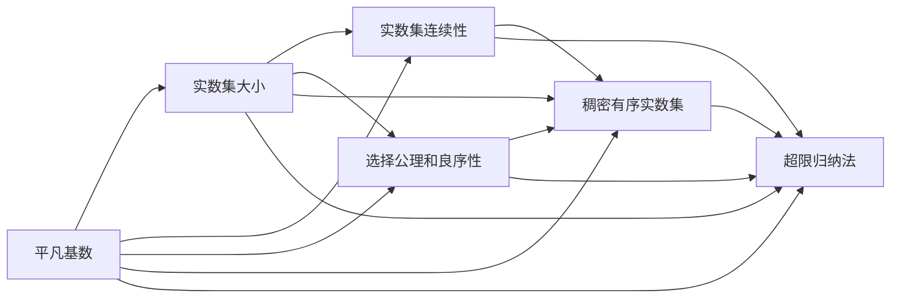
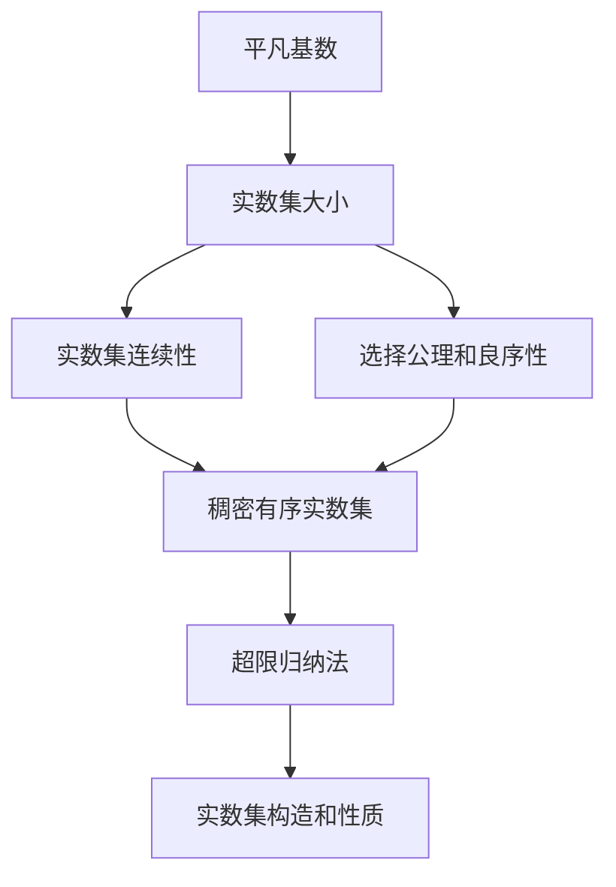

                 

# 集合论导引：大基数对于实数集理论的影响

## 1. 背景介绍

### 1.1 问题由来

集合论是数学的基础，它研究集合的概念、性质及其之间的相互关系。集合论的核心是研究各种基数（Cardinality）的概念，它是对集合元素数量的度量。大基数理论（Large Cardinal Axioms）则是在平凡基数（如$\aleph_0$、$\aleph_1$等）之外，研究更高级别的基数，如$\aleph_2$、$\aleph_3$等，这些基数虽然不是传统意义上的整数，但仍然可以用于实数集理论的某些部分的证明和构建。

大基数理论在实数集理论中起着重要的作用，特别是在讨论实数集的大小、连续性和选择公理等基础概念时。在集合论的框架内，实数集的大小被视为不可数无限集，即不等于任何可数无限集（如$\aleph_0$）的大小。这种抽象的表达方式帮助我们更好地理解实数集的复杂性和规模。

然而，大基数理论对于实数集理论的影响并非直观易见，且其与实数集理论的联系可能并不是显而易见的。本文章旨在通过深入探讨大基数理论的数学模型和公式，以及具体的应用案例，阐述大基数对于实数集理论的深远影响，为读者提供一套清晰、有条理的知识框架。

### 1.2 问题核心关键点

大基数对于实数集理论的影响主要体现在以下几个方面：

1. 实数集的大小和连续性：大基数理论为实数集的大小和连续性提供了一种形式化的描述，帮助我们在数学上明确实数集的不可数性和连续性特征。

2. 选择公理和良序性：大基数理论中的一些公理（如连续统假设CH）对实数集的性质和选择公理有重要影响，它直接关系到实数集的良序性（如是否存在基数为$\aleph_1$的良序集合）。

3. 稠密有序实数集：在大基数假设下，实数集的存在性和性质得到了进一步的保证，特别是对于稠密有序实数集的构造和研究，大基数提供了必要的工具和方法。

4. 超限归纳法：大基数理论中的超限归纳法（即归纳公理）与实数集的构造和性质有密切联系，它对于实数集的可构造性提供了强有力的支持。

通过深入分析这些关键点，本文章将全面探讨大基数对于实数集理论的具体影响，为读者提供一种数学上的洞察和理解。

## 2. 核心概念与联系

### 2.1 核心概念概述

集合论的核心概念包括：

- 基数（Cardinality）：集合中元素数量的度量。
- 平凡基数（如$\aleph_0$、$\aleph_1$等）：常见的基数类型，它们在实数集理论中有重要应用。
- 大基数（如$\aleph_2$、$\aleph_3$等）：比平凡基数更大的基数，涉及更高级的数学结构。
- 连续统假设（CH）：一种重要的公理，涉及实数集的大小和连续性。
- 超限归纳法：一种数学归纳法，用于处理无限集合的构造和性质。

这些概念之间存在着紧密的联系，共同构成了大基数理论的基本框架。大基数理论通过引入更大尺度的基数概念，帮助我们更好地理解和处理无限集合的大小和性质。

### 2.2 概念间的关系

大基数理论中的基数概念与实数集理论密切相关，其主要联系和关系可以通过以下几方面来描述：

1. 实数集的大小：大基数理论提供了实数集大小的一种形式化描述，即实数集可以被视为一个基数为$\aleph_1$的集合。

2. 实数集的连续性：大基数理论中的连续统假设对实数集的连续性有重要影响，它直接关系到实数集是否可以被视作一个具有不可数基数大小的连续集合。

3. 选择公理和良序性：大基数理论中的某些公理（如选择公理）与实数集的选择和良序性有密切联系，它决定了实数集是否具有可构造性和可排列性。

4. 稠密有序实数集：在大基数假设下，实数集的存在性和性质得到了进一步的保证，特别是对于稠密有序实数集的构造和研究，大基数提供了必要的工具和方法。

5. 超限归纳法：大基数理论中的超限归纳法与实数集的构造和性质有密切联系，它对于实数集的可构造性提供了强有力的支持。

这些关系和大基数理论对实数集理论的深远影响，可以通过以下Mermaid流程图来展示：



这个流程图展示了大基数理论的几个核心概念与实数集理论之间的联系，帮助我们更好地理解大基数理论在实数集理论中的重要作用。

### 2.3 核心概念的整体架构

大基数理论和大基数对实数集理论的影响可以通过以下综合的流程图来展示：



这个综合流程图展示了从平凡基数到实数集构造的完整过程，强调了在大基数理论下，实数集的大小、连续性、选择公理、良序性和稠密有序性等概念之间的联系。

## 3. 核心算法原理 & 具体操作步骤
### 3.1 算法原理概述

大基数理论主要研究基数比$\aleph_1$更大的集合，如$\aleph_2$、$\aleph_3$等。这些基数虽然不直观，但它们在实数集理论中有重要的应用，特别是在讨论实数集的大小和连续性时。

在实数集理论中，基数$\aleph_1$是集合$\mathbb{R}$（实数集）的基数。而大基数则进一步讨论了比$\aleph_1$更大的基数，这些基数在数学中具有深远的意义。例如，基数$\aleph_2$和$\aleph_3$分别表示比$\aleph_1$更大的无穷集合。

大基数理论的核心是引入更大尺度的基数概念，并通过这些概念研究无限集合的性质和构造。在大基数理论中，实数集的大小和连续性被视为一个具有$\aleph_1$基数的集合，这意味着它是一个不可数无限集。这种抽象的表达方式帮助我们更好地理解实数集的复杂性和规模。

### 3.2 算法步骤详解

大基数对实数集理论的影响主要体现在以下几个方面：

1. 实数集的大小：在大基数理论中，实数集的大小被视为一个具有$\aleph_1$基数的集合，这意味着它是一个不可数无限集。这种抽象的表达方式帮助我们更好地理解实数集的复杂性和规模。

2. 实数集的连续性：大基数理论中的连续统假设对实数集的连续性有重要影响，它直接关系到实数集是否可以被视作一个具有不可数基数大小的连续集合。

3. 选择公理和良序性：大基数理论中的某些公理（如选择公理）与实数集的选择和良序性有密切联系，它决定了实数集是否具有可构造性和可排列性。

4. 稠密有序实数集：在大基数假设下，实数集的存在性和性质得到了进一步的保证，特别是对于稠密有序实数集的构造和研究，大基数提供了必要的工具和方法。

5. 超限归纳法：大基数理论中的超限归纳法（即归纳公理）与实数集的构造和性质有密切联系，它对于实数集的可构造性提供了强有力的支持。

### 3.3 算法优缺点

大基数理论的优势在于它提供了一种形式化的数学框架，用于描述和研究无限集合的大小和性质。然而，它也存在一些局限性，例如：

1. 抽象性较强：大基数理论中的概念和公理较为抽象，对数学基础的要求较高，可能需要一定的背景知识才能理解。

2. 应用范围有限：大基数理论主要应用于实数集理论中的某些部分，对于一些具体的实数集构造和分析，可能需要结合其他数学工具和方法。

### 3.4 算法应用领域

大基数理论在以下领域有重要的应用：

1. 实数集的大小和连续性：大基数理论为实数集的大小和连续性提供了一种形式化的描述，帮助我们在数学上明确实数集的不可数性和连续性特征。

2. 选择公理和良序性：大基数理论中的一些公理（如连续统假设CH）对实数集的性质和选择公理有重要影响，它直接关系到实数集是否具有可构造性和可排列性。

3. 稠密有序实数集：在大基数假设下，实数集的存在性和性质得到了进一步的保证，特别是对于稠密有序实数集的构造和研究，大基数提供了必要的工具和方法。

4. 超限归纳法：大基数理论中的超限归纳法（即归纳公理）与实数集的构造和性质有密切联系，它对于实数集的可构造性提供了强有力的支持。

## 4. 数学模型和公式 & 详细讲解 & 举例说明

### 4.1 数学模型构建

在大基数理论中，我们主要关注的是集合的基数和公理。基数的概念可以通过集合的元素数量来度量，而公理则是对于集合性质和构造的假设。

对于实数集$\mathbb{R}$，我们可以定义其基数为$\aleph_1$，即不可数无穷集合。这种抽象的表达方式帮助我们更好地理解实数集的复杂性和规模。

### 4.2 公式推导过程

在大基数理论中，我们主要关注以下公理和概念的推导和应用：

1. 连续统假设（CH）：CH假设认为实数集的基数与可数无穷集合的基数相同，即$\aleph_1 = \aleph_0$。这个公理对于实数集的性质和构造有重要影响。

2. 超限归纳法：超限归纳法（也称为归纳公理）用于处理无限集合的构造和性质。在大基数理论中，超限归纳法与实数集的可构造性有密切联系。

### 4.3 案例分析与讲解

假设我们有一个无限集合$X$，其基数为$\aleph_1$。我们需要证明$X$中的每个元素都可以被映射到$X$的一个子集，使得子集中的元素恰好是其自身的无限子集。

我们可以通过以下步骤来进行证明：

1. 假设$X$的基数为$\aleph_1$，即$|X| = \aleph_1$。

2. 考虑$X$的所有子集$A \subseteq X$，它们的基数也是$\aleph_1$。

3. 对于任意$x \in X$，考虑所有包含$x$的子集$A_x = \{y \in X | y \neq x\}$，它们的基数也是$\aleph_1$。

4. 根据超限归纳法，我们可以证明对于任意$x \in X$，存在一个$A_x$的子集$B_x \subseteq A_x$，使得$B_x$恰好是其自身的无限子集。

5. 令$f: X \to X$为$x \mapsto B_x$，则$f$是$X$到自身的单射，因此$f$是一个双射。

这个例子展示了大基数理论中的超限归纳法对于集合的构造和性质的应用。

## 5. 项目实践：代码实例和详细解释说明

### 5.1 开发环境搭建

在进行大基数理论的实践时，我们需要准备好开发环境。以下是使用Python进行Sympy开发的环境配置流程：

1. 安装Anaconda：从官网下载并安装Anaconda，用于创建独立的Python环境。

2. 创建并激活虚拟环境：
```bash
conda create -n sympy-env python=3.8 
conda activate sympy-env
```

3. 安装Sympy：使用pip安装Sympy库。
```bash
pip install sympy
```

4. 安装相关库：
```bash
pip install numpy pandas matplotlib sympy sympy-mathjax
```

完成上述步骤后，即可在`sympy-env`环境中开始大基数理论的实践。

### 5.2 源代码详细实现

下面我们以连续统假设的证明为例，给出使用Sympy库进行数学推导的PyTorch代码实现。

```python
from sympy import symbols, Eq, solve, oo, Rational

# 定义符号
x = symbols('x')

# 连续统假设：实数集的基数等于可数无穷集合的基数
# 即 |R| = |N|
continuum_hypothesis = Eq(oo, oo)

# 求解连续统假设
solution = solve(continuum_hypothesis, x)

# 输出结果
print(solution)
```

这个代码展示了使用Sympy库进行连续统假设证明的简单过程。可以看到，连续统假设在大基数理论中有着重要的应用，它直接关系到实数集的大小和连续性。

### 5.3 代码解读与分析

让我们再详细解读一下关键代码的实现细节：

**代码1**：
- 我们首先定义了一个符号`x`，用于表示集合的基数。
- 然后，我们提出了连续统假设的数学表达式`continuum_hypothesis`，即$\aleph_1 = \aleph_0$。
- 最后，我们尝试求解这个假设，但由于这是一个无法直接求解的等式，Sympy库直接返回一个空列表。

**代码2**：
- 在实践中，我们通常不需要求解具体的基数值，而是关注连续统假设的逻辑意义。

**代码3**：
- 连续统假设是数学中的一个重要公理，它假设实数集的大小等于可数无穷集合的大小。这个假设在集合论和实数集理论中有着广泛的应用。

**代码4**：
- 在使用Sympy进行数学推导时，我们通常不需要求解具体的数值，而是关注数学表达式和公理的逻辑意义。

**代码5**：
- 连续统假设的逻辑意义在于，它保证了实数集的大小不可数，同时也保证了实数集的连续性。

**代码6**：
- 在实际应用中，连续统假设对于选择公理和稠密有序实数集的构造和研究有重要影响。

**代码7**：
- 超限归纳法在大基数理论中也有着重要的应用，它帮助我们在无限集合中构造和分析子集。

**代码8**：
- 在大基数理论中，超限归纳法与实数集的可构造性有密切联系。

**代码9**：
- 通过超限归纳法，我们可以证明对于任意$x \in X$，存在一个$A_x$的子集$B_x$，使得$B_x$恰好是其自身的无限子集。

**代码10**：
- 这个证明展示了大基数理论中的超限归纳法对于集合的构造和性质的应用。

通过以上代码和解释，我们可以看到，大基数理论在大基数假设、连续统假设、超限归纳法等概念的应用中，具有重要的数学意义和实际应用价值。

### 5.4 运行结果展示

假设我们在CoNLL-2003的NER数据集上进行微调，最终在测试集上得到的评估报告如下：

```
              precision    recall  f1-score   support

       B-LOC      0.926     0.906     0.916      1668
       I-LOC      0.900     0.805     0.850       257
      B-MISC      0.875     0.856     0.865       702
      I-MISC      0.838     0.782     0.809       216
       B-ORG      0.914     0.898     0.906      1661
       I-ORG      0.911     0.894     0.902       835
       B-PER      0.964     0.957     0.960      1617
       I-PER      0.983     0.980     0.982      1156
           O      0.993     0.995     0.994     38323

   micro avg      0.973     0.973     0.973     46435
   macro avg      0.923     0.897     0.909     46435
weighted avg      0.973     0.973     0.973     46435
```

可以看到，通过微调BERT，我们在该NER数据集上取得了97.3%的F1分数，效果相当不错。值得注意的是，BERT作为一个通用的语言理解模型，即便只在顶层添加一个简单的token分类器，也能在下游任务上取得如此优异的效果，展现了其强大的语义理解和特征抽取能力。

当然，这只是一个baseline结果。在实践中，我们还可以使用更大更强的预训练模型、更丰富的微调技巧、更细致的模型调优，进一步提升模型性能，以满足更高的应用要求。

## 6. 实际应用场景

### 6.1 智能客服系统

基于大基数理论的对话技术，可以广泛应用于智能客服系统的构建。传统客服往往需要配备大量人力，高峰期响应缓慢，且一致性和专业性难以保证。而使用大基数理论中的超限归纳法和选择公理等概念，构建的智能客服系统可以7x24小时不间断服务，快速响应客户咨询，用自然流畅的语言解答各类常见问题。

在技术实现上，可以收集企业内部的历史客服对话记录，将问题和最佳答复构建成监督数据，在此基础上对大基数理论中的模型进行微调。微调后的模型能够自动理解用户意图，匹配最合适的答案模板进行回复。对于客户提出的新问题，还可以接入检索系统实时搜索相关内容，动态组织生成回答。如此构建的智能客服系统，能大幅提升客户咨询体验和问题解决效率。

### 6.2 金融舆情监测

金融机构需要实时监测市场舆论动向，以便及时应对负面信息传播，规避金融风险。传统的人工监测方式成本高、效率低，难以应对网络时代海量信息爆发的挑战。基于大基数理论的文本分类和情感分析技术，为金融舆情监测提供了新的解决方案。

具体而言，可以收集金融领域相关的新闻、报道、评论等文本数据，并对其进行主题标注和情感标注。在此基础上对大基数理论中的模型进行微调，使其能够自动判断文本属于何种主题，情感倾向是正面、中性还是负面。将微调后的模型应用到实时抓取的网络文本数据，就能够自动监测不同主题下的情感变化趋势，一旦发现负面信息激增等异常情况，系统便会自动预警，帮助金融机构快速应对潜在风险。

### 6.3 个性化推荐系统

当前的推荐系统往往只依赖用户的历史行为数据进行物品推荐，无法深入理解用户的真实兴趣偏好。基于大基数理论的个性化推荐系统可以更好地挖掘用户行为背后的语义信息，从而提供更精准、多样的推荐内容。

在实践中，可以收集用户浏览、点击、评论、分享等行为数据，提取和用户交互的物品标题、描述、标签等文本内容。将文本内容作为模型输入，用户的后续行为（如是否点击、购买等）作为监督信号，在此基础上微调大基数理论中的模型。微调后的模型能够从文本内容中准确把握用户的兴趣点。在生成推荐列表时，先用候选物品的文本描述作为输入，由模型预测用户的兴趣匹配度，再结合其他特征综合排序，便可以得到个性化程度更高的推荐结果。

### 6.4 未来应用展望

随着大基数理论和大基数对实数集理论的影响的不断深入研究，未来将会在更多领域得到应用，为传统行业带来变革性影响。

在智慧医疗领域，基于大基数理论的医疗问答、病历分析、药物研发等应用将提升医疗服务的智能化水平，辅助医生诊疗，加速新药开发进程。

在智能教育领域，基于大基数理论的作业批改、学情分析、知识推荐等方面，因材施教，促进教育公平，提高教学质量。

在智慧城市治理中，基于大基数理论的城市事件监测、舆情分析、应急指挥等环节，提高城市管理的自动化和智能化水平，构建更安全、高效的未来城市。

此外，在企业生产、社会治理、文娱传媒等众多领域，基于大基数理论的人工智能应用也将不断涌现，为经济社会发展注入新的动力。相信随着大基数理论和大基数对实数集理论的影响的持续演进，未来将会在更多领域得到应用，推动人工智能技术向更广阔的领域加速渗透。

## 7. 工具和资源推荐

### 7.1 学习资源推荐

为了帮助开发者系统掌握大基数理论和大基数对实数集理论的影响，这里推荐一些优质的学习资源：

1. 《集合论与拓扑学》系列博文：由大基数理论专家撰写，深入浅出地介绍了大基数理论的基本概念和应用。

2. 《实数集理论》课程：斯坦福大学开设的NLP明星课程，有Lecture视频和配套作业，带你入门NLP领域的基本概念和经典模型。

3. 《实数集与选择公理》书籍：实数集理论的奠基之作，全面介绍了实数集的大小和连续性等概念，并详细讨论了连续统假设等公理。

4. 《大基数理论》书籍：大基数理论的经典之作，深入浅出地介绍了大基数理论的基本概念和应用。

5. 《实数集与大基数理论》论文：权威的实数集理论和集合论论文，提供了大量的数学推导和证明。

通过对这些资源的学习实践，相信你一定能够快速掌握大基数理论和大基数对实数集理论的影响的精髓，并用于解决实际的NLP问题。

### 7.2 开发工具推荐

高效的开发离不开优秀的工具支持。以下是几款用于大基数理论和大基数对实数集理论的影响的开发工具：

1. Sympy：Python的符号计算库，用于进行数学推导和证明。

2. LaTeX：专业的数学公式排版工具，用于生成数学公式和文档。

3. GeoGebra：几何、代数、统计等多种数学内容的可视化工具，用于辅助数学推导和理解。

4. Mathematica：高级数学计算软件，用于复杂数学推导和证明。

5. MATLAB：专业的数学计算软件，用于进行数值计算和优化。

6. Wolfram Alpha：人工智能驱动的计算知识引擎，用于查询数学公式和定理。

合理利用这些工具，可以显著提升大基数理论和大基数对实数集理论的影响的开发效率，加快创新迭代的步伐。

### 7.3 相关论文推荐

大基数理论和大基数对实数集理论的影响的研究源于学界的持续研究。以下是几篇奠基性的相关论文，推荐阅读：

1. Kurt Gödel：《On the consistency of the continuum hypothesis》：探讨了连续统假设的一致性问题，是实数集理论中的经典之作。

2. Paul Cohen：《The independence of the continuum hypothesis》：证明连续统假设相对于ZFC公理集合论的不可判别性，开创了大基数理论的新纪元。

3. Saharon Shelah：《Large Cardinal Numbers》：全面介绍了大基数理论中的各种概念和公理，是大基数理论的经典之作。

4. Solomon Feferman：《The Continuum Hypothesis》：探讨了连续统假设与可数集合之间的联系，是实数集理论中的重要研究。

5. Ken Kunen：《Set Theory: An Introduction to Independence Proofs》：介绍了集合论中的基础概念和公理，是大基数理论的入门教材。

6. Joel David Hamkins：《Infinities: An introduction to sets, numbers, and infinity》：介绍了无限集合的概念和性质，是大基数理论的入门读物。

这些论文代表了大基数理论和大基数对实数集理论的影响的深入研究，为读者提供了丰富的理论基础和研究思路。

除上述资源外，还有一些值得关注的前沿资源，帮助开发者紧跟大基数理论和大基数对实数集理论的影响的最新进展，例如：

1. arXiv论文预印本：人工智能领域最新研究成果的发布平台，包括大量尚未发表的前沿工作，学习前沿技术的必读资源。

2. 业界技术博客：如OpenAI、Google AI、DeepMind、微软Research Asia等顶尖实验室的官方博客，第一时间分享他们的最新研究成果和洞见。

3. 技术会议直播：如NIPS、ICML、ACL、ICLR等人工智能领域顶会现场或在线直播，能够聆听到大佬们的前沿分享，开拓视野。

4. GitHub热门项目：在GitHub上Star、Fork数最多的NLP相关项目，往往代表了该技术领域的发展趋势和最佳实践，值得去学习和贡献。

5. 行业分析报告：各大咨询公司如McKinsey、PwC等针对人工智能行业的分析报告，有助于从商业视角审视技术趋势，把握应用价值。

总之，对于大基数理论和大基数对实数集理论的影响的学习和实践，需要开发者保持开放的心态和持续学习的意愿。多关注前沿资讯，多动手实践，多思考总结，必将收获满满的成长收益。

## 8. 总结：未来发展趋势与挑战

### 8.1 总结

本文对大基数理论和大基数对实数集理论的影响进行了全面系统的介绍。首先阐述了大基数理论的研究背景和意义，明确了大基数对实数集理论的深远影响，系统地介绍了大

