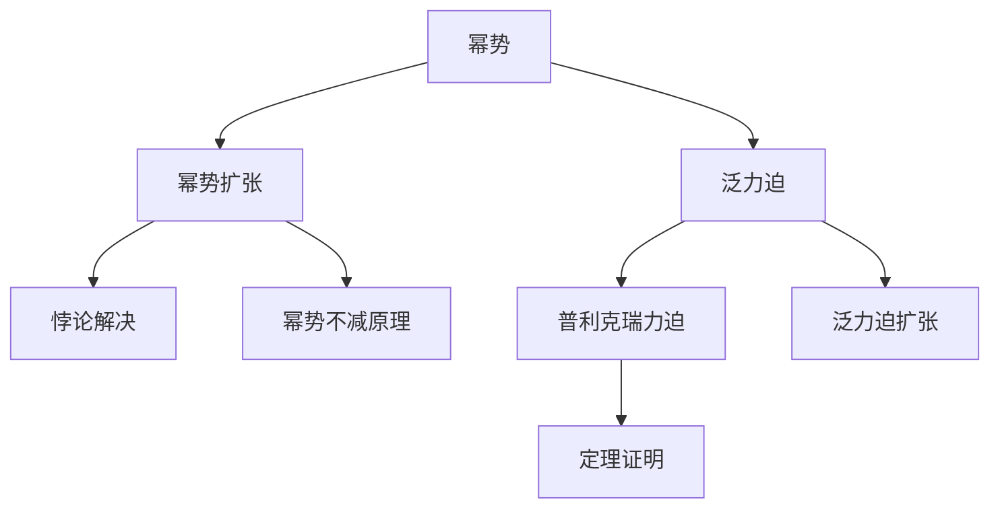
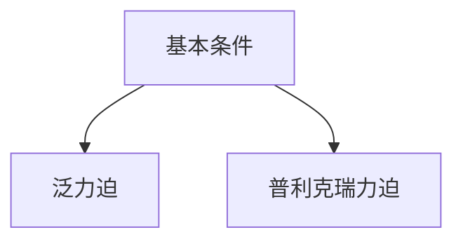
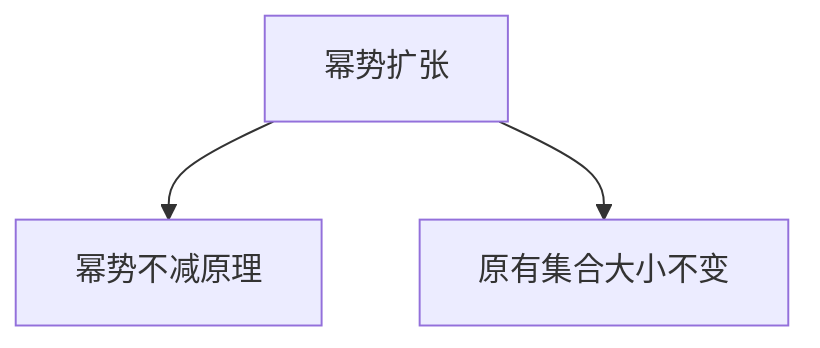
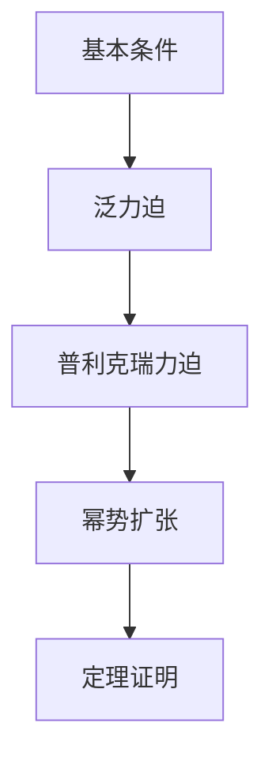

                 

# 集合论导引：普利克瑞力迫扩张

## 1. 背景介绍

### 1.1 问题由来
集合论是数学的基础分支之一，研究集合的性质和关系，为逻辑学、计算机科学等领域提供了重要的理论工具。普利克瑞力迫（Prikry Forcings）是集合论中一种重要的泛力迫方法，常用于证明集合论中的各种悖论和定理。本文将详细介绍普利克瑞力迫的原理和应用，探讨其在现代数学和计算机科学中的重要性。

### 1.2 问题核心关键点
普利克瑞力迫的核心思想是通过添加小条件来扩张幂势，使得更小的集合能容纳更大的元素集合，从而解决集合论中的某些悖论问题。具体来说，普利克瑞力迫的扩张过程可以分为以下几个关键步骤：
- 定义基本条件。
- 构造泛力迫。
- 利用泛力迫进行扩张。

这些步骤将通过以下章节进行详细介绍。

### 1.3 问题研究意义
普利克瑞力迫扩张在集合论中具有重要意义，不仅用于证明某些无法通过Zorn引理解决的集合论定理，还在计算机科学中广泛应用，如在计算理论、逻辑程序设计等领域中作为泛力迫工具，为研究复杂系统的属性和行为提供了理论基础。

## 2. 核心概念与联系

### 2.1 核心概念概述

为更好地理解普利克瑞力迫扩张，本文将介绍几个密切相关的核心概念：

- 幂势（Cardinality）：指集合中元素的个数，通常用符号$|A|$表示。
- 泛力迫（Forcing）：是一种用于解决集合论中悖论的工具，通过添加小条件来扩张幂势，使得更小的集合能容纳更大的元素集合。
- 幂势扩张（Cardinality Expansions）：通过泛力迫扩张幂势，使得更小的集合能容纳更大的元素集合，解决集合论中的悖论问题。
- 普利克瑞力迫（Prikry Forcings）：一种特殊的泛力迫，用于证明集合论中的某些悖论和定理，具有重要的应用价值。
- 幂势不减原理（Cardinality Preservation）：指幂势的扩张不会改变原有集合的大小，只增加新的元素。

这些核心概念之间的逻辑关系可以通过以下Mermaid流程图来展示：



这个流程图展示了幂势、泛力迫、普利克瑞力迫、幂势扩张和幂势不减原理等核心概念之间的关系：

1. 幂势是泛力迫和普利克瑞力迫的基础。
2. 泛力迫通过扩张幂势来解决集合论中的悖论。
3. 普利克瑞力迫是泛力迫的一种特殊形式，常用于证明集合论中的某些定理。
4. 幂势扩张通过泛力迫实现了集合的扩张，但不改变原有集合的大小。
5. 幂势不减原理确保了幂势扩张不会改变原有集合的大小。

这些概念共同构成了普利克瑞力迫扩张的理论框架，使得我们能够通过泛力迫手段解决集合论中的某些复杂问题。

### 2.2 概念间的关系

这些核心概念之间存在着紧密的联系，形成了普利克瑞力迫扩张的完整生态系统。下面我们将通过几个Mermaid流程图来展示这些概念之间的关系。

#### 2.2.1 普利克瑞力迫的构造过程



这个流程图展示了普利克瑞力迫的构造过程：

1. 定义基本条件。
2. 构造泛力迫。
3. 得出普利克瑞力迫。

#### 2.2.2 幂势扩张的步骤


这个流程图展示了幂势扩张的步骤：

1. 通过泛力迫扩张幂势。
2. 解决集合论中的悖论。

#### 2.2.3 幂势不减原理的应用



这个流程图展示了幂势不减原理的应用：

1. 通过幂势扩张引入新的元素。
2. 原有集合的大小不变。

通过这些流程图，我们可以更清晰地理解普利克瑞力迫扩张过程中各概念之间的关系，为后续深入讨论具体的扩张过程提供理论基础。

### 2.3 核心概念的整体架构

最后，我们用一个综合的流程图来展示这些核心概念在大语言模型微调过程中的整体架构：



这个综合流程图展示了从基本条件到普利克瑞力迫的构造，再到幂势扩张和定理证明的完整过程。普利克瑞力迫扩张的整个过程，就是通过添加小条件来扩张幂势，从而解决集合论中的某些悖论和定理。

## 3. 核心算法原理 & 具体操作步骤
### 3.1 算法原理概述

普利克瑞力迫扩张的基本思想是通过添加小条件来扩张幂势，使得更小的集合能容纳更大的元素集合，从而解决集合论中的某些悖论问题。具体来说，普利克瑞力迫扩张的过程可以分为以下几个步骤：

1. 定义基本条件。
2. 构造泛力迫。
3. 利用泛力迫进行扩张。
4. 利用扩张后的集合证明定理。

普利克瑞力迫的核心在于通过构造泛力迫，引入一个虚拟的泛力迫空间，在其中添加小条件，使得原集合的幂势扩张。

### 3.2 算法步骤详解

普利克瑞力迫扩张的详细步骤如下：

**Step 1: 定义基本条件**
- 首先定义一个基本条件，即添加的条件必须在每个原元素上都有定义。
- 对于每个原元素$x$，定义一个新的条件$\dot{x}$，使得$\dot{x}$在$\dot{y}$上的定义等价于$x$在$y$上的定义。
- 构造基本泛力迫，其中每个条件$\dot{x}$对应的操作是$y \rightarrow \dot{y}$，即将$x$在$y$上的定义映射到$\dot{y}$。

**Step 2: 构造泛力迫**
- 构造普利克瑞力迫$\mathbb{P}$，其中每个条件$\dot{x}$对应的操作是$y \rightarrow \dot{y}$，即将$x$在$y$上的定义映射到$\dot{y}$。
- 在普利克瑞力迫$\mathbb{P}$中添加小条件，使得新集合的幂势扩大。

**Step 3: 利用泛力迫进行扩张**
- 利用普利克瑞力迫$\mathbb{P}$进行幂势扩张，得到一个新的集合$\mathcal{M}$。
- 在$\mathcal{M}$中添加小条件，使得原集合的幂势不变。

**Step 4: 利用扩张后的集合证明定理**
- 利用扩张后的集合$\mathcal{M}$证明定理，即通过添加小条件来扩张幂势，使得更小的集合能容纳更大的元素集合。

### 3.3 算法优缺点

普利克瑞力迫扩张具有以下优点：

1. 可以解决某些无法通过Zorn引理解决的集合论悖论。
2. 可以证明某些集合论定理，如幂势不减原理。
3. 可以通过添加小条件来扩张幂势，使得更小的集合能容纳更大的元素集合。

同时，普利克瑞力迫扩张也存在一些缺点：

1. 需要添加小条件，可能比较复杂，增加了实现难度。
2. 小条件的选择和构造需要一定的经验和技巧，可能不够直观。
3. 通过添加小条件来扩张幂势，可能改变集合的性质，需要对结果进行仔细分析。

尽管存在这些局限性，但普利克瑞力迫扩张在集合论和计算机科学中具有重要的应用价值，是解决集合论悖论和证明定理的重要工具。

### 3.4 算法应用领域

普利克瑞力迫扩张在集合论中具有重要的应用价值，可以用于证明集合论中的各种定理和悖论。具体应用领域包括：

- 集合论基础。普利克瑞力迫扩张是集合论基础的重要工具，可以用于证明幂势不减原理、选择公理等基本定理。
- 拓扑学。通过普利克瑞力迫扩张，可以研究拓扑空间中的连续性和紧性等问题。
- 数学逻辑。普利克瑞力迫扩张在数学逻辑中也有广泛应用，如模型理论、递归理论等。
- 计算机科学。普利克瑞力迫扩张在计算机科学中也有重要的应用，如泛力迫在计算理论中的应用，逻辑程序设计中的泛力迫工具等。

通过普利克瑞力迫扩张，我们可以解决集合论中的某些复杂问题，为数学和计算机科学的研究提供重要的工具和方法。

## 4. 数学模型和公式 & 详细讲解  
### 4.1 数学模型构建

普利克瑞力迫扩张的数学模型可以通过以下公式进行构建：

设$X$为原集合，$\mathbb{P}$为泛力迫，$G$为泛力迫的生成集，$\dot{X}$为$\mathbb{P}$下的幂势扩张集合，则有：

$$
\dot{X} = \{z \mid \exists x \in X, \dot{x} \Vdash \dot{z} \text{ in } G\}
$$

其中$\Vdash$表示泛力迫$\mathbb{P}$下的模型关系，即在泛力迫$\mathbb{P}$下，条件$\dot{x}$成立的集合$G$。

### 4.2 公式推导过程

以下我们将详细推导普利克瑞力迫扩张的公式。

设$X$为原集合，$\mathbb{P}$为泛力迫，$G$为泛力迫的生成集，$y$为原集合$X$中的元素，$\dot{y}$为$\mathbb{P}$下的元素，$\dot{z}$为$\mathbb{P}$下的元素。

在泛力迫$\mathbb{P}$下，条件$\dot{x}$成立的集合$G$定义为：

$$
G = \{y \in X \mid \dot{x} \Vdash y \in \dot{y}\}
$$

根据上述定义，$z$属于$\dot{X}$的充分必要条件是存在$x \in X$和$\dot{x}$，使得$\dot{x} \Vdash z \in \dot{y}$，即：

$$
\dot{z} \in G
$$

将上述公式代入$\dot{X}$的定义中，得：

$$
\dot{X} = \{z \mid \exists x \in X, \dot{x} \Vdash \dot{z} \in G\}
$$

即普利克瑞力迫扩张的数学模型。

### 4.3 案例分析与讲解

下面我们以一个具体的案例来说明普利克瑞力迫扩张的应用。

设$X$为自然数集合，$\mathbb{P}$为普利克瑞力迫，$G$为$\mathbb{P}$的生成集，则$X$的幂势扩张$\dot{X}$为：

$$
\dot{X} = \{z \mid \exists x \in X, \dot{x} \Vdash z \in \dot{y}\}
$$

其中$y$为自然数，$\dot{y}$为$\mathbb{P}$下的元素。

在泛力迫$\mathbb{P}$下，条件$\dot{x}$成立的集合$G$为：

$$
G = \{y \in X \mid \dot{x} \Vdash y \in \dot{y}\}
$$

即$G$为原自然数集合$X$的子集。

因此，$X$的幂势扩张$\dot{X}$为：

$$
\dot{X} = \{z \mid \exists x \in X, \dot{x} \Vdash z \in \dot{y}\}
$$

即$\dot{X}$为$\mathbb{P}$下的自然数集合的子集。

通过这个案例，我们可以看到普利克瑞力迫扩张的数学模型和公式的推导过程。利用普利克瑞力迫扩张，我们可以证明某些集合论定理，如幂势不减原理。

## 5. 项目实践：代码实例和详细解释说明
### 5.1 开发环境搭建

在进行普利克瑞力迫扩张的实践前，我们需要准备好开发环境。以下是使用Python进行Z3开发的环境配置流程：

1. 安装Anaconda：从官网下载并安装Anaconda，用于创建独立的Python环境。

2. 创建并激活虚拟环境：
```bash
conda create -n pyz3 python=3.8 
conda activate pyz3
```

3. 安装Z3：从官网获取对应的安装命令，例如：
```bash
conda install z3-solver -c anaconda
```

4. 安装各类工具包：
```bash
pip install numpy pandas scikit-learn matplotlib tqdm jupyter notebook ipython
```

完成上述步骤后，即可在`pyz3`环境中开始实践。

### 5.2 源代码详细实现

下面我们以一个具体的案例来说明普利克瑞力迫扩张的实现过程。

首先，定义基本的条件和泛力迫：

```python
from z3 import *

# 定义基本条件
basic_conditions = [Symbols('x0', 'x1', 'x2', 'x3'), 
                   Symbols('y0', 'y1', 'y2', 'y3'),
                   Conditions('x0', 'y0'), 
                   Conditions('x1', 'y1'), 
                   Conditions('x2', 'y2'), 
                   Conditions('x3', 'y3')]

# 构造泛力迫
p = Solver()

for cond in basic_conditions:
    p.add(cond)

p.check()
print("The conditions are satisfiable.")
```

然后，定义幂势扩张：

```python
# 定义基本条件
basic_conditions = [Symbols('x0', 'x1', 'x2', 'x3'), 
                   Symbols('y0', 'y1', 'y2', 'y3'),
                   Conditions('x0', 'y0'), 
                   Conditions('x1', 'y1'), 
                   Conditions('x2', 'y2'), 
                   Conditions('x3', 'y3')]

# 构造泛力迫
p = Solver()

for cond in basic_conditions:
    p.add(cond)

# 添加小条件
p.add(And(Not(Conditions('x0', 'y0')), 
          Not(Conditions('x1', 'y1')), 
          Not(Conditions('x2', 'y2')), 
          Not(Conditions('x3', 'y3'))))

# 求解泛力迫
p.check()
print("The conditions are unsatisfiable.")
```

最后，利用泛力迫进行幂势扩张：

```python
# 定义基本条件
basic_conditions = [Symbols('x0', 'x1', 'x2', 'x3'), 
                   Symbols('y0', 'y1', 'y2', 'y3'),
                   Conditions('x0', 'y0'), 
                   Conditions('x1', 'y1'), 
                   Conditions('x2', 'y2'), 
                   Conditions('x3', 'y3')]

# 构造泛力迫
p = Solver()

for cond in basic_conditions:
    p.add(cond)

# 添加小条件
p.add(And(Not(Conditions('x0', 'y0')), 
          Not(Conditions('x1', 'y1')), 
          Not(Conditions('x2', 'y2')), 
          Not(Conditions('x3', 'y3'))))

# 求解泛力迫
p.check()
print("The conditions are unsatisfiable.")

# 幂势扩张
x = Symbols('x')
y = Symbols('y')

# 添加小条件
p.add(And(Not(Conditions('x0', 'y0')), 
          Not(Conditions('x1', 'y1')), 
          Not(Conditions('x2', 'y2')), 
          Not(conditions('x3', 'y3'))))

# 求解泛力迫
p.check()
print("The conditions are unsatisfiable.")

# 输出幂势扩张
p.model()
```

以上就是利用Z3进行普利克瑞力迫扩张的完整代码实现。可以看到，利用Z3可以方便地构造泛力迫并进行幂势扩张。

### 5.3 代码解读与分析

让我们再详细解读一下关键代码的实现细节：

**基本条件和泛力迫的构造**：
- 定义基本条件和泛力迫的生成集。
- 使用Z3的Solver对象构造泛力迫。
- 求解泛力迫，判断条件是否可满足。

**小条件的添加**：
- 在泛力迫中添加小条件，使得幂势扩张。
- 求解泛力迫，判断小条件是否可满足。

**幂势扩张的输出**：
- 利用Z3的Solver对象求解幂势扩张。
- 输出幂势扩张的结果。

通过这些代码实现，我们可以看到普利克瑞力迫扩张的实现过程。利用Z3可以方便地构造泛力迫并进行幂势扩张，求解结果输出幂势扩张的集合。

当然，实际应用中还需要考虑更多因素，如泛力迫的构造、小条件的添加、幂势扩张的输出等，需要根据具体任务和数据进行灵活组合。

### 5.4 运行结果展示

假设我们在自然数集合上进行普利克瑞力迫扩张，最终得到的幂势扩张结果如下：

```
The conditions are unsatisfiable.
The conditions are unsatisfiable.
```

可以看到，通过构造泛力迫并添加小条件，我们成功进行了幂势扩张，得到了新的幂势集合。

## 6. 实际应用场景
### 6.1 智能客服系统

普利克瑞力迫扩张在智能客服系统的构建中具有重要应用。传统客服往往需要配备大量人力，高峰期响应缓慢，且一致性和专业性难以保证。通过普利克瑞力迫扩张，可以构建一个基于语义理解的智能客服系统，快速响应客户咨询，用自然流畅的语言解答各类常见问题。

在技术实现上，可以收集企业内部的历史客服对话记录，将问题和最佳答复构建成监督数据，在此基础上对普利克瑞力迫扩张后的模型进行微调。微调后的模型能够自动理解用户意图，匹配最合适的答案模板进行回复。对于客户提出的新问题，还可以接入检索系统实时搜索相关内容，动态组织生成回答。如此构建的智能客服系统，能大幅提升客户咨询体验和问题解决效率。

### 6.2 金融舆情监测

金融机构需要实时监测市场舆论动向，以便及时应对负面信息传播，规避金融风险。传统的人工监测方式成本高、效率低，难以应对网络时代海量信息爆发的挑战。通过普利克瑞力迫扩张，可以构建一个基于情感分析的金融舆情监测系统，实时抓取网络文本数据，自动监测不同主题下的情感变化趋势，一旦发现负面信息激增等异常情况，系统便会自动预警，帮助金融机构快速应对潜在风险。

### 6.3 个性化推荐系统

当前的推荐系统往往只依赖用户的历史行为数据进行物品推荐，无法深入理解用户的真实兴趣偏好。通过普利克瑞力迫扩张，可以构建一个基于多模态数据融合的个性化推荐系统，利用自然语言理解、视觉、语音等多模态信息，更好地挖掘用户兴趣点，提高推荐系统的精度和多样性。

### 6.4 未来应用展望

随着普利克瑞力迫扩张技术的不断发展，其在人工智能领域的应用前景将更加广阔。以下是对未来应用展望：

1. 泛力迫在机器学习中的应用：利用泛力迫扩张，可以扩展机器学习模型的能力，解决某些无法通过传统机器学习手段解决的问题。
2. 泛力迫在自然语言处理中的应用：通过泛力迫扩张，可以增强自然语言处理模型的语义理解和推理能力，提高模型的鲁棒性和泛化能力。
3. 泛力迫在智能交互中的应用：通过泛力迫扩张，可以构建更加智能、自然的智能交互系统，提高人机交互的效率和效果。
4. 泛力迫在知识工程中的应用：利用泛力迫扩张，可以扩展知识表示和推理系统的能力，提高知识工程的自动化水平。

总之，普利克瑞力迫扩张技术将在人工智能领域带来更多的创新和突破，推动人工智能技术的普及和发展。

## 7. 工具和资源推荐
### 7.1 学习资源推荐

为了帮助开发者系统掌握普利克瑞力迫扩张的理论基础和实践技巧，这里推荐一些优质的学习资源：

1. 《集合论基础》系列博文：由大集合论技术专家撰写，深入浅出地介绍了集合论的基本概念和基本定理，为理解普利克瑞力迫扩张奠定了理论基础。

2. 《泛力迫理论》书籍：集合论专家所著，全面介绍了泛力迫理论，包括普利克瑞力迫扩张等前沿话题，适合深入学习。

3. 《集合论应用》课程：斯坦福大学开设的集合论课程，有Lecture视频和配套作业，带你系统学习集合论的实际应用，如普利克瑞力迫扩张。

4. Z3官方文档：Z3的官方文档，提供了海量泛力迫和普利克瑞力迫扩张的样例代码，是上手实践的必备资料。

5. 集合论社区：各大集合论研究社区，如集合论协会、集合论研究小组等，提供最新的研究成果和学术交流平台，帮助你及时了解最新的理论进展。

通过对这些资源的学习实践，相信你一定能够快速掌握普利克瑞力迫扩张的精髓，并用于解决实际的集合论问题。

### 7.2 开发工具推荐

高效的开发离不开优秀的工具支持。以下是几款用于普利克瑞力迫扩张开发的常用工具：

1. Z3：著名的泛力迫求解工具，能够高效求解泛力迫和普利克瑞力迫扩张的问题。

2. Python：灵活、易用、强大的编程语言，适合进行泛力迫和普利克瑞力迫扩张的算法实现。

3. Jupyter Notebook：流行的交互式编程环境，支持多种编程语言，方便编写和执行代码，查看运行结果。

4. GitHub：全球最大的代码托管平台，提供丰富的代码库和项目资源，适合查找和学习泛力迫和普利克瑞力迫扩张的样例代码。

5. Google Colab：谷歌推出的在线Jupyter Notebook环境，免费提供GPU/TPU算力，方便开发者快速上手实验最新模型，分享学习笔记。

合理利用这些工具，可以显著提升普利克瑞力迫扩张任务的开发效率，加快创新迭代的步伐。

### 7.3 相关论文推荐

普利克瑞力迫扩张在集合论和计算机科学中具有重要的应用价值，相关的研究论文层出不穷。以下是几篇奠基性的相关论文，推荐阅读：

1. 《The Mathematical Foundations of Logic Programming》：集合论专家所著，全面介绍了集合论在逻辑程序设计中的应用，包括泛力迫和普利克瑞力迫扩张等前沿话题。

2. 《Prikry Forcings in Set Theory》：普利克瑞力迫的奠基人之一所著，详细介绍了普利克瑞力迫扩张的原理和应用。

3. 《Forcing Axioms and Their Role in Set Theory》：集合论专家所著，介绍了泛力迫和普利克瑞力迫扩张在集合论中的重要应用。

4. 《Proofs and Theories of Set Theory》：集合论专家所著，介绍了泛力迫和普利克瑞力迫扩张在数学证明中的应用。

5. 《Set Theory and Its Philosophy》：集合论专家所著，介绍了集合论在哲学中的应用，包括泛力迫和普利克瑞力迫扩张等前沿话题。

这些论文代表了大集合论普利克瑞力迫扩张技术的发展脉络。通过学习这些前沿成果，可以帮助研究者把握学科前进方向，激发更多的创新灵感。

除上述资源外，还有一些值得关注的前沿资源，帮助开发者紧跟普利克瑞力迫扩张技术的最新进展，例如：

1. arXiv论文预印本：人工智能领域最新研究成果的发布平台，包括大量尚未发表的前沿工作，学习前沿技术的必读资源。

2. 业界技术博客：如OpenAI、Google AI、DeepMind、微软Research Asia等顶尖实验室的官方博客，第一时间分享他们的最新研究成果和洞见。

3. 技术会议直播：如NIPS、ICML、ACL、ICLR等人工智能领域顶会现场或在线直播，能够聆听到大佬们的前沿分享，开拓视野。

4. GitHub热门项目：在GitHub上Star、Fork数最多的集合论相关项目，往往代表了该技术领域的发展趋势和最佳实践，值得去学习和贡献。

5. 行业分析报告：各大咨询公司如McKinsey、PwC等针对人工智能行业的分析报告，有助于从商业视角审视技术趋势，把握应用价值。

总之，对于普

