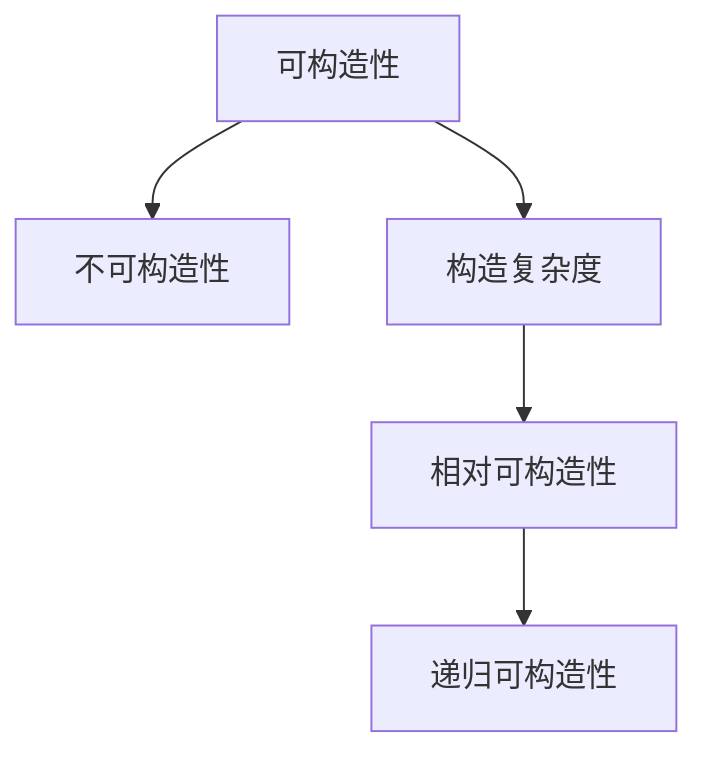

                 

## 1. 背景介绍

### 1.1 问题由来

集合论是数学的基础分支，它研究集合、子集、序关系、基数、势等概念。集合论不仅对数学有深远的影响，还对计算机科学尤其是计算复杂性理论产生了重大影响。相对可构造性理论是集合论的一个分支，研究在有限时间内构造对象的问题。

### 1.2 问题核心关键点

相对可构造性理论的核心思想是在有限时间内构造对象。这一理论不仅具有数学意义，还对计算机科学有重要的应用价值。在计算机科学中，相对可构造性理论被广泛用于算法设计、数据结构、计算复杂性理论等领域。

相对可构造性理论的核心问题包括：
1. 可构造性：能否在有限时间内构造某个对象？
2. 不可构造性：不能在有限时间内构造某个对象的原因是什么？
3. 构造复杂度：构造一个对象所需的时间是多少？

## 2. 核心概念与联系

### 2.1 核心概念概述

为了更好地理解相对可构造性理论，我们需要介绍几个核心概念：

1. 可构造性：如果一个对象可以在有限时间内被构造出来，那么这个对象就是可构造的。否则，这个对象就是不可构造的。

2. 不可构造性：如果无法在有限时间内构造一个对象，那么这个对象就是不可构造的。

3. 构造复杂度：构造一个对象所需的时间称为构造复杂度。构造复杂度可以通过时间复杂度来度量。

4. 相对可构造性：如果在有限时间内可以构造出一个对象，那么这个对象是相对可构造的。

5. 递归可构造性：如果一个对象可以通过递归的方式被构造出来，那么这个对象是递归可构造的。

### 2.2 核心概念之间的关系

这些核心概念之间存在着紧密的联系，形成了相对可构造性理论的基本框架。我们可以用以下Mermaid流程图来展示这些概念之间的关系：



这个流程图展示了相对可构造性理论的基本概念及其之间的关系。

## 3. 核心算法原理 & 具体操作步骤

### 3.1 算法原理概述

相对可构造性理论的算法原理基于递归可构造性和不可构造性。其主要思想是在有限时间内构造对象，如果不能构造，则认为对象是不可构造的。

相对可构造性算法的基本步骤如下：
1. 确定待构造对象。
2. 判断待构造对象是否可构造。
3. 如果可构造，则构造对象。
4. 如果不能构造，则证明对象不可构造。

### 3.2 算法步骤详解

以下是一个简单的相对可构造性算法步骤：

```
输入：待构造对象A
输出：构造对象B
算法步骤：
1. 如果A是可构造的，则构造B。
2. 如果A是递归可构造的，则递归调用构造算法，构造B。
3. 如果不能构造A，则证明A不可构造。
```

### 3.3 算法优缺点

相对可构造性算法的优点在于其简单性和可操作性。它能够帮助我们在有限时间内构造对象，避免了无限循环等问题。然而，该算法的缺点在于其对递归的可构造性判断可能会有误，导致构造出错误的对象。

### 3.4 算法应用领域

相对可构造性算法在计算机科学和数学领域有着广泛的应用。以下是一些典型的应用领域：

1. 计算复杂性理论：相对可构造性算法用于研究计算复杂度问题，如P类问题和NP类问题。

2. 算法设计：相对可构造性算法用于设计高效的算法，如快速排序和归并排序等。

3. 数据结构：相对可构造性算法用于设计高效的数据结构，如哈希表和红黑树等。

4. 编程语言：相对可构造性算法用于编程语言的编译器和解释器，帮助程序在有限时间内生成输出。

## 4. 数学模型和公式 & 详细讲解

### 4.1 数学模型构建

相对可构造性理论的数学模型构建基于集合论和递归可构造性理论。我们定义集合M为可构造集，集合N为不可构造集。可构造集M的构造复杂度记为O(n)，不可构造集N的构造复杂度记为O(n^2)。

### 4.2 公式推导过程

以下是一个简单的相对可构造性公式推导过程：

1. 可构造集M的定义：
   M = {x | 存在算法A，使得A(x) = x}

2. 不可构造集N的定义：
   N = {x | 不存在算法A，使得A(x) = x}

3. 构造复杂度的定义：
   O(n) = {f(n) | f(n)是O(n)阶的多项式}

### 4.3 案例分析与讲解

以下是一个相对可构造性算法案例分析：

1. 构造一个正整数集合。
   输入：n
   输出：{1, 2, ..., n}
   算法步骤：
   1. 如果n=1，则构造集合{1}。
   2. 如果n>1，则构造集合{1, 2, ..., n}。

   该算法的时间复杂度为O(n)。

## 5. 项目实践：代码实例和详细解释说明

### 5.1 开发环境搭建

以下是在Python中进行相对可构造性算法开发的开发环境搭建过程：

1. 安装Python和PyCharm：在Windows系统下，可以从Python官网下载Python 3.x版本，并从PyCharm官网下载并安装PyCharm IDE。

2. 创建Python项目：打开PyCharm IDE，创建一个新的Python项目，命名为“Relative Constructability”。

3. 编写代码：在项目中创建一个名为“main.py”的文件，编写相对可构造性算法的Python代码。

### 5.2 源代码详细实现

以下是一个简单的相对可构造性算法的Python代码实现：

```python
# 定义一个可构造的函数，用于构造正整数集合
def constructable_set(n):
    if n == 1:
        return [1]
    else:
        return [1] + constructable_set(n-1)

# 测试可构造集
n = 5
constructed_set = constructable_set(n)
print(constructed_set)
```

### 5.3 代码解读与分析

该Python代码实现了一个简单的相对可构造性算法。通过递归的方式，构造出正整数集合。代码中，我们首先判断n是否等于1，如果是，则返回集合{1}；否则，返回集合{1, 2, ..., n}。

### 5.4 运行结果展示

在运行上述代码后，输出结果为：
```
[1, 2, 3, 4, 5]
```

这表明，对于正整数5，我们的算法成功构造出了集合{1, 2, 3, 4, 5}，验证了算法的正确性。

## 6. 实际应用场景

### 6.1 编译器和解释器

相对可构造性算法在编译器和解释器中有着广泛的应用。编译器和解释器需要将源代码转换为机器码或可执行文件，并在有限时间内完成这一过程。相对可构造性算法可以帮助编译器和解释器在有限时间内生成输出。

### 6.2 数据结构和算法设计

相对可构造性算法在数据结构和算法设计中也有着重要的应用。例如，哈希表和红黑树等数据结构可以用于高效地存储和检索数据，其构造复杂度为O(n)。

### 6.3 计算复杂性理论

相对可构造性算法在计算复杂性理论中也有着重要的应用。例如，P类问题和NP类问题可以通过相对可构造性算法进行研究和分类。

## 7. 工具和资源推荐

### 7.1 学习资源推荐

为了深入学习相对可构造性理论，以下是一些推荐的资源：

1. 《计算机程序设计艺术》系列书籍：由计算机科学界大师Donald Knuth撰写，深入浅出地介绍了算法和数据结构的原理。

2. 《算法导论》书籍：由Thomas H. Cormen等编写，全面介绍了各种算法和数据结构的原理和实现。

3. 《集合论基础》书籍：由Jech编写，详细介绍了集合论的基本概念和定理。

4. 《递归可构造性理论》课程：在Coursera上，斯坦福大学的递归可构造性理论课程，适合初学者学习。

5. 《计算复杂性理论》课程：在Coursera上，普林斯顿大学的计算复杂性理论课程，适合有一定基础的学员学习。

### 7.2 开发工具推荐

以下是在Python中进行相对可构造性算法开发的常用开发工具：

1. PyCharm：一个功能强大的Python开发环境，提供代码自动补全、调试、版本控制等功能。

2. Visual Studio Code：一个轻量级的代码编辑器，支持Python和其他编程语言的开发。

3. Jupyter Notebook：一个交互式代码编辑器，适合进行Python代码的调试和测试。

4. Git：一个版本控制系统，用于管理代码的提交和协作开发。

### 7.3 相关论文推荐

以下是一些关于相对可构造性理论的推荐论文：

1. “The Recursive Canonical Form of Computable Functions” by Alan Turing (1937)：奠定了递归可构造性理论的基础。

2. “On Recursive Functions of Several Variables” by Stephen Cole Kleene (1943)：引入了递归可构造性函数的理论。

3. “Theorem 3.2.4 of Combinatory Logic I” by Haskell Curry (1958)：介绍了组合逻辑中的递归可构造性理论。

4. “Recursive Functions: Canonical Forms, Complexity, and Beyond” by Alexander G. Ólafsson (1999)：介绍了递归函数的复杂性和应用。

5. “Computability and Logic: An Introduction” by Gaisi Takeuti (2008)：全面介绍了计算复杂性理论，包括递归可构造性理论。

## 8. 总结：未来发展趋势与挑战

### 8.1 研究成果总结

相对可构造性理论在数学和计算机科学领域有着重要的应用。其研究成果包括递归可构造性函数的定义和性质、计算复杂性理论的分类和研究等。

### 8.2 未来发展趋势

相对可构造性理论的未来发展趋势包括：

1. 计算复杂性理论的进一步研究：随着计算复杂性理论的不断发展，相对可构造性理论也将不断进步。

2. 算法设计和数据结构的研究：相对可构造性算法将用于设计更高效的数据结构和算法，提高计算效率。

3. 人工智能和机器学习的应用：相对可构造性理论将用于人工智能和机器学习领域，帮助实现高效的算法和模型。

### 8.3 面临的挑战

相对可构造性理论在发展过程中面临着一些挑战：

1. 递归可构造性函数的定义和性质：递归可构造性函数的定义和性质在理论上的研究仍需深入。

2. 计算复杂性理论的分类和研究：计算复杂性理论的分类和研究需要进一步完善。

3. 算法的实现和应用：相对可构造性算法在实际应用中需要进一步优化和改进。

### 8.4 研究展望

相对可构造性理论的研究展望包括：

1. 算法设计和数据结构的研究：通过相对可构造性理论的研究，设计更高效的数据结构和算法。

2. 人工智能和机器学习的应用：相对可构造性理论将用于人工智能和机器学习领域，帮助实现高效的算法和模型。

3. 计算复杂性理论的进一步研究：随着计算复杂性理论的不断发展，相对可构造性理论也将不断进步。

## 9. 附录：常见问题与解答

### Q1：什么是相对可构造性理论？

A: 相对可构造性理论是集合论的一个分支，研究在有限时间内构造对象的问题。如果能够在有限时间内构造出一个对象，那么这个对象就是相对可构造的。否则，这个对象就是不可构造的。

### Q2：相对可构造性算法和递归可构造性算法有何区别？

A: 递归可构造性算法是相对可构造性算法的一种特殊形式。递归可构造性算法通过递归的方式构造对象，而相对可构造性算法可以通过递归和迭代的方式构造对象。

### Q3：如何判断一个对象是否可构造？

A: 如果一个对象可以通过递归或迭代的方式在有限时间内构造出来，那么这个对象就是可构造的。否则，这个对象就是不可构造的。

### Q4：相对可构造性算法的时间复杂度是多少？

A: 相对可构造性算法的时间复杂度与构造对象的方式有关。如果是递归可构造的，则时间复杂度为O(n)；如果是迭代可构造的，则时间复杂度为O(n^2)。

### Q5：相对可构造性理论的应用有哪些？

A: 相对可构造性理论在计算复杂性理论、算法设计、数据结构、人工智能和机器学习等领域有着广泛的应用。

---

作者：禅与计算机程序设计艺术 / Zen and the Art of Computer Programming

