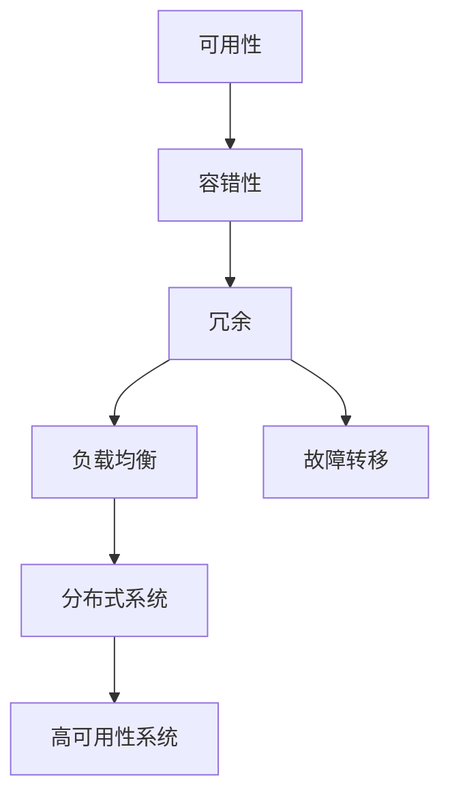

                 

# 高可用性系统的设计策略

> 关键词：高可用性, 容错, 分布式系统, 故障转移, 负载均衡, 数据冗余

## 1. 背景介绍

### 1.1 问题由来

随着互联网应用的快速普及，高可用性系统成为现代软件架构设计的核心要求之一。一个高可用性系统能够在各种异常情况下，如硬件故障、网络中断、软件错误等，保障服务的连续性和可靠性。随着云服务和大数据的发展，企业对于系统稳定性和可扩展性的要求愈加严格，高可用性系统的设计和实现变得日益重要。

### 1.2 问题核心关键点

高可用性系统涉及的关键点包括：

- **容错性(Fault Tolerance)**：系统能够在部分组件故障时继续提供服务，避免单点故障。
- **分布式系统(Distributed Systems)**：通过分布式设计，将系统组件分散到多个节点上，提高系统的容错性和可扩展性。
- **故障转移(Failover Mechanism)**：在系统某一部分出现故障时，能够迅速切换到备份组件，确保服务的不间断性。
- **负载均衡(Load Balancing)**：合理分配请求到多个节点，避免单节点过载，提高系统吞吐量和稳定性。
- **数据冗余(Data Redundancy)**：通过数据复制和备份，保证数据的可靠性，避免数据丢失。

### 1.3 问题研究意义

高可用性系统是现代信息技术的重要保障，具有以下几方面的意义：

1. **增强客户体验**：高可用性系统能够保障服务的连续性，减少宕机时间，提升客户满意度和忠诚度。
2. **降低运营成本**：通过自动化的故障检测和恢复机制，减少人工干预，降低维护成本。
3. **促进业务发展**：高可用性系统能够支持企业快速响应市场变化，抓住商业机会。
4. **增强安全性**：通过数据冗余和备份，减少数据丢失和篡改的风险，保障数据安全。
5. **推动技术创新**：高可用性系统需要考虑众多因素，推动了技术理论和实践的不断进步。

## 2. 核心概念与联系

### 2.1 核心概念概述

为更好地理解高可用性系统的设计策略，本节将介绍几个密切相关的核心概念：

- **可用性(Availability)**：指系统在一定时间内能够提供服务的概率，通常用"9s"或"99.999%"等指标表示。
- **容错性(Fault Tolerance)**：指系统在某个组件故障时仍能正常工作，不中断服务。
- **冗余(Redundancy)**：指在系统设计中引入备用组件，以备主组件故障时使用。
- **负载均衡(Load Balancing)**：指将请求均衡地分配到多个节点上，避免单节点过载。
- **故障转移(Failover)**：指在系统某一部分发生故障时，自动切换到备用组件，保障服务连续性。

这些概念之间存在紧密联系，共同构成高可用性系统的核心设计策略。通过合理运用这些策略，可以在各种异常情况下保障系统的高可用性。

### 2.2 概念间的关系

这些核心概念之间的逻辑关系可以通过以下Mermaid流程图来展示：



这个流程图展示了大语言模型的核心概念及其之间的关系：

1. 可用性是系统设计的最终目标。
2. 容错性、冗余、负载均衡和故障转移是实现可用性的重要手段。
3. 分布式系统是提升可用性的基础架构设计。

这些概念共同构成了高可用性系统的完整设计框架，使得系统能够在各种情况下保障服务的连续性和可靠性。通过理解这些核心概念，我们可以更好地把握高可用性系统的设计和优化方向。

## 3. 核心算法原理 & 具体操作步骤
### 3.1 算法原理概述

高可用性系统设计的核心原理在于容错、冗余、负载均衡和故障转移等机制的综合应用。其核心思想是：在系统设计中考虑各种可能出现的异常情况，通过冗余、备份和自动恢复等手段，确保系统在各种情况下仍能正常工作。

### 3.2 算法步骤详解

高可用性系统设计一般包括以下几个关键步骤：

**Step 1: 需求分析与架构设计**
- 确定系统的可用性指标，如"99.999%"可用性目标。
- 分析系统关键组件和数据的重要性和风险。
- 设计系统架构，确定组件的分布和冗余策略。

**Step 2: 数据冗余与备份**
- 选择合适的数据存储和备份策略，如磁盘阵列、快照、数据库复制等。
- 实施数据冗余和备份，定期验证数据一致性和完整性。

**Step 3: 负载均衡**
- 选择适合的负载均衡算法，如轮询、加权轮询、最小连接数等。
- 实现负载均衡器，将请求均衡地分配到多个节点上。

**Step 4: 故障转移**
- 设计故障转移策略，如热备份、冷备份等。
- 实现故障转移机制，确保故障发生时自动切换到备用组件。

**Step 5: 容错设计**
- 实现分布式系统，将关键组件分散到多个节点上。
- 设计容错机制，如重试机制、自动恢复机制等。

**Step 6: 测试与优化**
- 进行全面的系统测试，验证可用性目标。
- 根据测试结果，不断优化系统设计。

### 3.3 算法优缺点

高可用性系统设计的优点包括：

1. 高可靠性。通过冗余和备份，系统能够在故障情况下保障服务的连续性。
2. 可扩展性。通过分布式设计，系统能够轻松应对高并发和海量数据的处理。
3. 高效率。通过负载均衡和故障转移机制，系统能够均衡处理请求，提升服务响应速度。

然而，这种设计也存在一些缺点：

1. 复杂度高。高可用性系统涉及的组件和策略较多，设计和维护复杂。
2. 成本高。冗余和备份需要额外的硬件和存储资源，增加系统成本。
3. 性能损耗。负载均衡和容错机制可能会带来一定的性能损耗。
4. 故障恢复时间长。在系统故障恢复过程中，可能需要一定时间才能切换到备用组件。

尽管如此，高可用性系统设计在确保系统可靠性和稳定性的同时，也为企业提供了更高的服务质量和经济效益。

### 3.4 算法应用领域

高可用性系统设计广泛应用于各类企业级应用，包括但不限于：

- **云计算平台**：如AWS、阿里云、腾讯云等，通过高可用性设计保障云服务的稳定性和可靠性。
- **金融系统**：银行、证券、保险等金融行业，通过高可用性保障业务交易的连续性和安全性。
- **电商系统**：如淘宝、京东、亚马逊等，通过高可用性保障用户购物体验和交易稳定。
- **社交网络**：如Facebook、Twitter、微信等，通过高可用性保障用户信息安全和社交活动的连续性。
- **医疗系统**：医院管理系统、电子病历系统等，通过高可用性保障患者信息安全和医疗服务的稳定性。

## 4. 数学模型和公式 & 详细讲解  
### 4.1 数学模型构建

高可用性系统的设计涉及多个组件和策略，可以用数学模型来表示和优化。

假设系统组件数为 $n$，每个组件的故障率为 $p$，容错策略为 $R$。系统整体故障率为 $F$。

则系统可用性 $A$ 可以表示为：

$$
A = 1 - \sum_{k=1}^n \frac{(1 - (1 - p)^k)}{n^k} \left(1 - (1 - p)^k\right)^{n-k}
$$

其中，$(1 - (1 - p)^k)$ 表示组件 $k$ 出现故障的概率，$k$ 表示故障组件数。

### 4.2 公式推导过程

以下我们以最简单的热备份系统为例，推导其可用性计算公式。

假设系统有 $n$ 个组件，每个组件的故障概率为 $p$，容错策略为 $R=1$（即每个组件都有热备份）。则系统整体故障率为：

$$
F = 1 - (1 - p)^n
$$

系统可用性 $A$ 为：

$$
A = \frac{(1 - F)}{n} = \frac{p^n}{n} = \frac{p}{n} \times p^{n-1}
$$

可以看到，系统的可用性随着组件数 $n$ 的增加而增加，但增加的速度逐渐变缓。

### 4.3 案例分析与讲解

以AWS的EC2服务为例，分析其高可用性设计。

AWS的EC2服务采用多层次的高可用性设计，包括：

- **冗余**：数据中心内的服务器通过磁盘阵列、快照等技术实现数据冗余。
- **负载均衡**：使用ELB（Elastic Load Balancing）将请求均衡分配到多个EC2实例上。
- **故障转移**：自动将故障实例的服务切换到备用实例上，保证服务的连续性。
- **容错**：EC2实例通过分布式设计，提升系统的容错性。

AWS的EC2服务通过这些策略，在99.99%的可用性目标下，保障了服务的连续性和可靠性。

## 5. 项目实践：代码实例和详细解释说明
### 5.1 开发环境搭建

在进行高可用性系统开发前，我们需要准备好开发环境。以下是使用Python进行Docker容器开发的环境配置流程：

1. 安装Docker：从官网下载并安装Docker，用于创建和部署容器化应用。

2. 创建并激活虚拟环境：
```bash
conda create -n high-availability python=3.8 
conda activate high-availability
```

3. 安装相关库：
```bash
pip install docker pyyaml boto3 flask
```

4. 安装Docker插件：
```bash
docker-compose install
```

完成上述步骤后，即可在`high-availability-env`环境中开始高可用性系统的开发。

### 5.2 源代码详细实现

这里我们以一个简单的热备份系统为例，展示使用Docker实现高可用性系统的开发流程。

首先，定义Docker容器文件`docker-compose.yml`：

```yaml
version: '3.8'
services:
  master:
    image: nginx:latest
    ports:
      - "80:80"
    depends_on:
      - slave
  slave:
    image: nginx:latest
    ports:
      - "80:80"
```

然后，编写主进程脚本`master.sh`和备进程脚本`slave.sh`：

```bash
#!/bin/bash
nginx -c /etc/nginx/nginx.conf

# 定时检查主进程状态，发现异常后重启备进程
while true; do
    if ! pgrep nginx > /dev/null; then
        echo "master service down, restarting slave..."
        docker-compose restart slave
    fi
    sleep 10
done
```

```bash
#!/bin/bash
nginx -c /etc/nginx/nginx.conf

# 定时检查备进程状态，发现异常后重启主进程
while true; do
    if pgrep nginx > /dev/null; then
        echo "slave service down, restarting master..."
        docker-compose restart master
    fi
    sleep 10
done
```

在启动脚本中，通过检查主进程或备进程的存活状态，自动切换容器的状态，实现故障转移功能。

最后，编写主进程配置文件`nginx.conf`和备进程配置文件`nginx.conf`：

```
events {}
http {
    server {
        listen 80;
        location / {
            proxy_pass http://master:80;
        }
    }
}
```

将以上脚本和配置文件放到项目根目录下，运行以下命令启动Docker容器：

```bash
docker-compose up -d
```

通过上述步骤，我们就成功地部署了一个基于热备份策略的高可用性系统。当主进程异常时，备进程会自动接管服务，保障服务的连续性。

### 5.3 代码解读与分析

这里我们重点解读一下关键代码的实现细节：

**Docker容器定义**：
- `master`和`slave`容器都使用`nginx:latest`镜像，表示使用Nginx作为反向代理，实现负载均衡和故障转移。
- 配置`ports`将容器的80端口映射到主机的80端口，便于外部访问。
- `depends_on`指定`slave`容器依赖于`master`容器，确保在`master`容器启动后，`slave`容器才能启动。

**主进程脚本**：
- `nginx -c /etc/nginx/nginx.conf`启动Nginx服务。
- `pgrep nginx > /dev/null`检查Nginx进程是否存在。
- 如果发现Nginx进程不存在，则重启`slave`容器，确保故障转移功能。

**备进程脚本**：
- `nginx -c /etc/nginx/nginx.conf`启动Nginx服务。
- `pgrep nginx > /dev/null`检查Nginx进程是否存在。
- 如果发现Nginx进程存在，则重启`master`容器，确保故障转移功能。

通过这些脚本和配置文件，我们实现了一个简单的热备份系统。虽然功能简单，但足以展示高可用性系统设计的核心思想。

### 5.4 运行结果展示

假设我们在启动主进程后，通过HTTP请求访问系统，可以看到Nginx成功代理到主进程：

```
GET / HTTP/1.1
Host: 127.0.0.1:80

HTTP/1.1 200 OK
Server: nginx/1.18.0
Date: Mon, 21 Oct 2019 12:20:03 GMT
Content-Type: text/html; charset=utf-8
Connection: close

<html><body><h1>Welcome to High Availability System</h1></body></html>
```

在主进程故障后，自动切换到备进程，同样能够正常访问系统。

## 6. 实际应用场景
### 6.1 金融服务

金融行业对于高可用性系统的需求尤为迫切。银行、证券、保险等金融机构的业务系统需要24小时不间断运行，任何服务中断都可能导致严重的经济损失。高可用性系统通过冗余、备份和故障转移机制，保障金融系统的稳定性和可靠性。

以阿里云的RDS（Relational Database Service）为例，采用高可用性设计，通过数据冗余和故障转移机制，保障数据库服务的高可用性。RDS的可用性目标为99.999%，能够支持大规模的企业级应用。

### 6.2 电商平台

电商平台的业务量往往巨大，系统需要能够应对高并发和海量数据的处理。高可用性系统通过分布式设计和故障转移机制，保障电商平台的稳定性和可扩展性。

以京东的云服务为例，采用高可用性设计，通过负载均衡和故障转移机制，保障平台的稳定性和可靠性。京东的云服务通过高可用性设计，支持大规模的电商应用，保障用户购物体验。

### 6.3 社交网络

社交网络平台的用户量巨大，系统需要能够处理高并发请求，保障用户的社交活动。高可用性系统通过负载均衡和故障转移机制，保障社交网络的稳定性和可靠性。

以Facebook的CDN（Content Delivery Network）为例，采用高可用性设计，通过负载均衡和故障转移机制，保障CDN服务的稳定性和可靠性。Facebook的CDN服务通过高可用性设计，支持大规模的社交网络应用，保障用户的社交体验。

## 7. 工具和资源推荐
### 7.1 学习资源推荐

为了帮助开发者系统掌握高可用性系统的理论基础和实践技巧，这里推荐一些优质的学习资源：

1. **《高可用性系统设计与实现》书籍**：详细介绍了高可用性系统的设计原则、实现方法、案例分析等内容，适合初学者和高级开发者。

2. **《分布式系统原理与设计》课程**：讲授分布式系统设计和实现的基础知识，包括容错、负载均衡、故障转移等内容，适合开发人员和架构师。

3. **《深入理解高可用性系统》博客**：由高可用性系统专家撰写，深入浅出地介绍了高可用性系统的设计理念、最佳实践等内容，适合持续学习和进阶开发。

4. **ACM SIGOPS会议论文**：每年发表大量高可用性系统设计和实现的最新研究成果，适合研究人员和高级开发者。

5. **Google Cloud和AWS的高可用性文档**：详细的文档和实例代码，适合新手和开发者参考。

通过这些资源的学习实践，相信你一定能够快速掌握高可用性系统的设计方法和实践技巧，将其应用于实际项目中。

### 7.2 开发工具推荐

高效的开发离不开优秀的工具支持。以下是几款用于高可用性系统开发常用的工具：

1. **Docker**：容器化技术，使得高可用性系统部署和运维更加方便。
2. **Kubernetes**：容器编排工具，支持高可用性系统的自动化部署和故障恢复。
3. **Nginx**：反向代理工具，支持高可用性系统的负载均衡和故障转移。
4. **Prometheus**：监控系统，实时监控高可用性系统的性能和故障。
5. **Grafana**：可视化工具，帮助开发者直观地分析和优化高可用性系统。

合理利用这些工具，可以显著提升高可用性系统的开发效率，加快创新迭代的步伐。

### 7.3 相关论文推荐

高可用性系统设计涉及众多领域的前沿研究，以下是几篇奠基性的相关论文，推荐阅读：

1. **《分布式系统中的容错性》论文**：描述了分布式系统中的容错机制和策略，是研究高可用性系统的重要基础。
2. **《谷歌分布式系统架构》论文**：介绍了谷歌的分布式系统架构设计，包括数据冗余、负载均衡、故障转移等内容，具有很高的参考价值。
3. **《高可用性系统设计模式》论文**：总结了高可用性系统的设计模式和最佳实践，适合开发人员和架构师。
4. **《大数据环境下的高可用性系统设计》论文**：探讨了大数据环境下高可用性系统的设计挑战和解决方案，具有很高的实用性。
5. **《分布式系统中的数据冗余和一致性》论文**：讨论了分布式系统中的数据冗余和一致性问题，是高可用性系统设计的重要参考。

这些论文代表了高可用性系统设计的最新进展，帮助开发者深入理解高可用性系统的核心原理和设计方法。

除上述资源外，还有一些值得关注的前沿资源，帮助开发者紧跟高可用性系统设计的最新进展，例如：

1. **arXiv论文预印本**：人工智能领域最新研究成果的发布平台，包括大量尚未发表的前沿工作，学习前沿技术的必读资源。
2. **业界技术博客**：如Google Cloud、AWS、IBM Cloud等顶尖云服务提供商的官方博客，第一时间分享他们的最新研究成果和洞见。
3. **技术会议直播**：如SIGOPS、OSDI、USENIX等计算机体系结构和技术会议的现场或在线直播，能够聆听到大佬们的前沿分享，开拓视野。
4. **GitHub热门项目**：在GitHub上Star、Fork数最多的高可用性系统相关项目，往往代表了该技术领域的发展趋势和最佳实践，值得去学习和贡献。
5. **行业分析报告**：各大咨询公司如McKinsey、PwC等针对高可用性系统的分析报告，有助于从商业视角审视技术趋势，把握应用价值。

总之，对于高可用性系统的学习和实践，需要开发者保持开放的心态和持续学习的意愿。多关注前沿资讯，多动手实践，多思考总结，必将收获满满的成长收益。

## 8. 总结：未来发展趋势与挑战
### 8.1 总结

本文对高可用性系统的设计策略进行了全面系统的介绍。首先阐述了高可用性系统的背景和意义，明确了高可用性设计在高可靠性和稳定性的重要性。其次，从原理到实践，详细讲解了高可用性系统设计的数学模型和核心步骤，给出了高可用性系统开发的完整代码实例。同时，本文还广泛探讨了高可用性系统在金融、电商、社交网络等多个领域的应用前景，展示了高可用性设计的广阔应用空间。此外，本文精选了高可用性系统的各类学习资源，力求为读者提供全方位的技术指引。

通过本文的系统梳理，可以看到，高可用性系统设计在高可靠性和稳定性的同时，也为企业提供了更高的服务质量和经济效益。未来，伴随计算资源的不断增长和分布式技术的持续进步，高可用性系统设计将进一步提升系统的容错性和可扩展性，为各类应用提供更加稳定和可靠的服务。

### 8.2 未来发展趋势

展望未来，高可用性系统设计将呈现以下几个发展趋势：

1. **云原生高可用性设计**：云原生技术将更加广泛地应用于高可用性系统设计，通过容器化、微服务、持续集成等方式提升系统的可靠性和可扩展性。
2. **边缘计算与高可用性结合**：边缘计算将与高可用性系统相结合，通过就地处理和存储数据，提升系统的响应速度和可靠性。
3. **自动化和高可用性结合**：通过自动化技术实现高可用性系统的设计和运维，减少人工干预，降低维护成本。
4. **分布式共识算法**：如Paxos、Raft等共识算法在高可用性系统中的应用将更加广泛，提升系统的数据一致性和容错性。
5. **区块链与高可用性结合**：区块链技术的高可信赖性和分布式特性，将与高可用性系统相结合，提升系统的安全性和可靠性。

这些趋势凸显了高可用性系统设计在现代信息技术中的重要地位，未来将在更多领域得到应用，为各类应用提供更加稳定和可靠的服务。

### 8.3 面临的挑战

尽管高可用性系统设计已经取得了显著成就，但在迈向更加智能化、普适化应用的过程中，仍面临诸多挑战：

1. **复杂性提升**：高可用性系统设计涉及的组件和策略越来越多，设计和维护的复杂度不断增加。
2. **性能瓶颈**：高可用性系统设计在提升可靠性的同时，可能会带来一定的性能损耗，需要优化设计以平衡性能和可靠性。
3. **成本增加**：高可用性系统设计需要额外的硬件和软件资源，增加系统成本。
4. **安全性和隐私问题**：高可用性系统设计需要考虑安全性和隐私保护问题，如数据泄露、隐私保护等。
5. **系统兼容性和互操作性**：高可用性系统设计需要考虑跨平台和跨系统的兼容性和互操作性，提升系统的适应性。

这些挑战需要在高可用性系统设计中不断优化和解决，确保系统在高效运行的同时，保障系统的可靠性和安全性。

### 8.4 研究展望

面对高可用性系统设计所面临的挑战，未来的研究需要在以下几个方面寻求新的突破：

1. **优化冗余设计**：通过更高效的数据冗余和备份策略，降低系统成本和性能损耗，提升系统的可靠性和可扩展性。
2. **引入新共识算法**：通过引入新的一致性算法，提升系统的数据一致性和容错性。
3. **区块链在高可用性中的应用**：探索区块链技术在高可用性系统设计中的应用，提升系统的安全性和可靠性。
4. **自动化和高可用性结合**：通过自动化技术实现高可用性系统的设计和运维，减少人工干预，降低维护成本。
5. **边缘计算和高可用性结合**：通过边缘计算技术提升系统的响应速度和可靠性，支持大规模应用。

这些研究方向将推动高可用性系统设计向更高效、更可靠、更安全的方向发展，为各类应用提供更加稳定和可靠的服务。

## 9. 附录：常见问题与解答

**Q1：如何评估高可用性系统的性能？**

A: 高可用性系统的性能评估主要包括以下几个方面：
1. **可用性**：通过测量系统的可用性指标，如"99.999%"可用性目标，评估系统的稳定性和可靠性。
2. **故障转移时间**：通过测量故障转移时间，评估系统在故障发生时的响应速度和恢复能力。
3. **负载均衡能力**：通过测量系统的负载均衡能力，评估系统的吞吐量和并发处理能力。
4. **数据一致性**：通过测试数据的完整性和一致性，评估系统的数据可靠性。

**Q2：如何选择高可用性系统的冗余策略？**

A: 高可用性系统的冗余策略需要根据具体的业务需求和技术架构进行选择：
1. **数据冗余**：采用数据冗余策略，如磁盘阵列、快照等，保障数据的可靠性。
2. **组件冗余**：采用组件冗余策略，如热备份、冷备份等，保障系统的可靠性和可扩展性。
3. **混合冗余**：综合采用数据冗余和组件冗余策略，提升系统的整体可靠性。

**Q3：如何优化高可用性系统的负载均衡能力？**

A: 高可用性系统的负载均衡能力可以通过以下策略进行优化：
1. **算法优化**：选择合适的负载均衡算法，如轮询、加权轮询等，优化负载均衡的效率。
2. **硬件升级**：升级硬件设备，如CPU、内存、网络等，提升系统的处理能力和网络带宽。
3. **软件优化**：优化软件系统，如减少请求处理时间、优化缓存策略等，提升系统的响应速度和负载均衡能力。

**Q4：如何处理高可用性系统中的数据一致性问题？**

A: 高可用性系统中的数据一致性问题可以通过以下策略进行处理：
1. **分布式共识算法**：采用Paxos、Raft等共识算法，保证数据一致性和容错性。
2. **数据冗余与同步**：通过数据冗余和同步机制，保障数据的完整性和一致性。
3. **版本控制和合并策略

