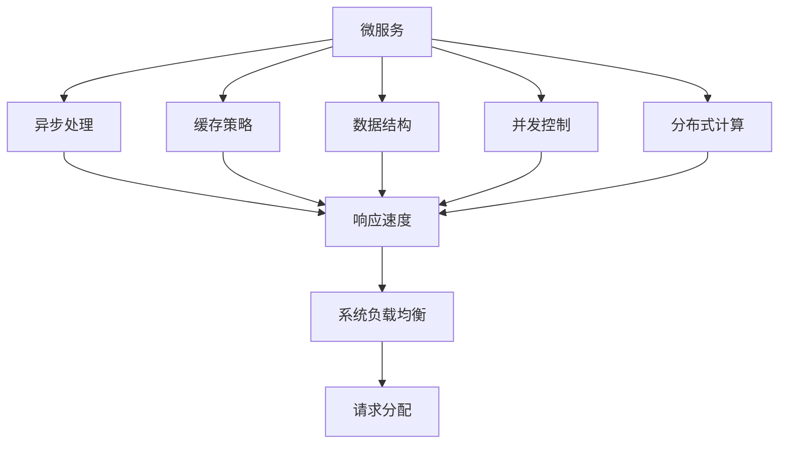

                 

## 1. 背景介绍

在现代软件开发中，构建高吞吐量系统变得越来越重要。随着数字化转型的深入，企业对于系统的处理能力、响应速度和扩展性提出了更高的要求。在高并发的应用场景中，例如电商平台、金融交易、在线游戏等，系统必须能够支撑大量的请求，且在毫秒级的时间内完成响应。性能优化不仅是一个技术挑战，也是一项复杂的系统工程。

### 1.1 问题由来

高吞吐量系统的构建涉及到多个层面的挑战：
- **网络通信**：高并发请求需要高效的通信机制，以减少网络延迟。
- **数据存储**：海量数据的存储和读取需要高效的数据库和缓存机制。
- **计算资源**：多核CPU、GPU、分布式计算等资源的合理利用。
- **负载均衡**：通过算法和硬件设施来均衡负载，避免单点瓶颈。

在实际开发中，这些挑战需要综合考虑，以实现系统的最优性能。本文将围绕高性能系统设计、优化策略和关键技术进行深入探讨。

### 1.2 问题核心关键点

构建高吞吐量系统的关键在于以下几个方面：
1. **系统架构**：选择适合的架构模式，如微服务、分布式等。
2. **负载均衡**：合理分配请求，避免单点压力。
3. **缓存策略**：合理使用缓存，减少数据库访问压力。
4. **异步处理**：通过异步处理提升系统响应速度。
5. **数据结构**：优化数据结构，提高数据访问效率。
6. **算法优化**：使用高效的算法减少资源消耗。

### 1.3 问题研究意义

高性能系统的构建对于提升用户体验、降低运营成本、提高企业竞争力具有重要意义：
1. **用户体验**：系统的高响应速度和稳定性直接影响用户满意度。
2. **成本效益**：高效的系统设计可以减少资源浪费，提升投资回报率。
3. **竞争优势**：在激烈的市场竞争中，高性能的系统能够吸引更多用户。
4. **技术前沿**：高性能系统代表技术前沿，推动技术创新。

本文旨在全面介绍高吞吐量系统的性能优化策略，为开发高性能系统提供理论和实践指导。

## 2. 核心概念与联系

### 2.1 核心概念概述

构建高吞吐量系统涉及到多个核心概念，以下是对这些概念的详细说明：

- **微服务**：将大系统拆分为多个独立的、可扩展的服务单元，提高系统的可维护性和扩展性。
- **异步处理**：通过异步I/O、事件驱动等机制，提高系统的响应速度和并发处理能力。
- **负载均衡**：通过算法或硬件设施将请求均匀分配到多个服务器上，避免单点瓶颈。
- **缓存策略**：使用缓存来存储和快速获取高频访问的数据，减少数据库的访问压力。
- **数据结构**：选择合适的数据结构来优化数据的存储和访问效率。
- **并发控制**：在多线程环境下，使用锁、原子操作等机制，确保数据一致性和并发性。
- **分布式计算**：通过多台机器的并行计算，提高系统的处理能力和可扩展性。

这些概念之间存在紧密的联系，共同构成了高性能系统的设计基础。

### 2.2 概念间的关系

这些核心概念之间的逻辑关系可以通过以下Mermaid流程图来展示：

这个流程图展示了大吞吐量系统构建过程中各个概念之间的关系：

1. 微服务将大系统拆分为多个小服务，每个服务独立运行，提升了系统的可扩展性和可维护性。
2. 异步处理通过非阻塞I/O和事件驱动机制，提升了系统的响应速度和并发处理能力。
3. 缓存策略通过缓存高频访问数据，减少了数据库的访问压力，提高了系统的性能。
4. 数据结构通过选择合适的数据结构，优化了数据的存储和访问效率。
5. 并发控制通过锁、原子操作等机制，保证了多线程环境下的数据一致性和并发性。
6. 分布式计算通过多台机器的并行计算，提高了系统的处理能力和可扩展性。
7. 最终，通过合理设计各个组件，达到系统的高负载均衡，实现了高吞吐量。

这些概念共同构成了高吞吐量系统的高性能基础。

## 3. 核心算法原理 & 具体操作步骤
### 3.1 算法原理概述

高吞吐量系统的性能优化涉及到多种算法和技术，以下是一些核心算法原理的概述：

- **负载均衡算法**：包括轮询、随机、哈希等算法，用于将请求均匀分配到多个服务器上。
- **缓存淘汰策略**：如LRU、LFU等算法，用于从缓存中删除不常用的数据。
- **分布式一致性协议**：如Paxos、Raft等协议，用于保证分布式系统中的数据一致性和可用性。
- **并发控制算法**：如乐观锁、悲观锁、分布式锁等，用于在多线程环境下确保数据的一致性。
- **异步处理算法**：如协程、事件驱动等机制，用于提升系统的响应速度和并发处理能力。

### 3.2 算法步骤详解

以下是一个典型的基于微服务架构的高性能系统性能优化步骤：

1. **系统拆分与设计**：
   - 将系统拆分为多个独立的微服务，每个微服务负责一个独立的功能模块。
   - 设计合适的通信协议和接口，保证微服务之间的松耦合和高效通信。

2. **异步处理与事件驱动**：
   - 使用异步I/O和事件驱动技术，提升系统的响应速度和并发处理能力。
   - 通过协程、事件循环等机制，处理高并发请求。

3. **缓存策略与优化**：
   - 识别系统中频繁访问的数据，使用缓存机制进行优化。
   - 选择合适的缓存淘汰策略，如LRU、LFU等，避免缓存命中率下降。

4. **分布式计算与负载均衡**：
   - 设计合理的负载均衡算法，将请求均匀分配到多个服务器上。
   - 使用分布式计算框架，如Hadoop、Spark等，实现多台机器的并行计算。

5. **并发控制与一致性**：
   - 在多线程环境下，使用锁、原子操作等机制，确保数据的一致性。
   - 使用分布式一致性协议，保证在分布式环境下的数据一致性和可用性。

6. **性能监测与调优**：
   - 使用性能监控工具，如Prometheus、Grafana等，实时监控系统性能。
   - 根据监控结果，进行性能调优，优化系统的响应速度和并发处理能力。

### 3.3 算法优缺点

基于微服务架构的高性能系统构建具有以下优点：
- **高扩展性**：微服务架构可以灵活扩展，满足不同业务需求。
- **高可用性**：通过负载均衡和分布式计算，提升系统的可靠性和可用性。
- **高性能**：异步处理、缓存策略等技术，提升系统的响应速度和并发处理能力。

但同时，微服务架构也面临以下挑战：
- **复杂性**：微服务数量庞大，管理复杂。
- **通信开销**：微服务之间的通信开销较大，影响系统性能。
- **数据一致性**：分布式环境下的数据一致性问题需要特别注意。

### 3.4 算法应用领域

高吞吐量系统的构建广泛应用于各种高并发场景：

- **电商平台**：需要处理大量商品信息查询、订单处理等请求。
- **金融交易**：需要处理高频交易请求、实时结算等业务。
- **在线游戏**：需要处理大量玩家之间的数据同步和交互。
- **数据中心**：需要处理大量数据的存储、计算和查询请求。
- **社交媒体**：需要处理大量用户上传的媒体内容、用户互动等请求。

## 4. 数学模型和公式 & 详细讲解  
### 4.1 数学模型构建

高吞吐量系统的性能优化可以通过数学模型进行建模和分析。假设系统每秒处理的请求数为 $N$，单请求处理时间为 $T$，则系统的吞吐量为 $S = \frac{N}{T}$。

系统的响应时间 $R$ 由多个因素决定，包括请求到达速率 $λ$、单请求处理时间 $T$、服务器数量 $m$ 等。假设请求到达速率服从泊松分布，则系统的响应时间为：

$$
R = \frac{1}{\lambda} \cdot \left( \frac{1}{T} + \frac{N}{mT} \right)^{-1}
$$

其中，$λ$ 为请求到达速率，$T$ 为单请求处理时间，$m$ 为服务器数量。

### 4.2 公式推导过程

将响应时间公式展开：

$$
R = \frac{1}{\lambda} \cdot \left( \frac{1}{T} + \frac{N}{mT} \right)^{-1} = \frac{1}{\lambda} \cdot \frac{mT}{mT + N}
$$

在理想情况下，当 $N \ll mT$ 时，响应时间主要由请求到达速率决定，系统的吞吐量为：

$$
S = \frac{N}{R} = \frac{\lambda mT}{mT + N}
$$

这意味着，系统的吞吐量主要由请求到达速率和服务器数量决定，与单请求处理时间关系不大。

### 4.3 案例分析与讲解

以电商平台为例，假设平台每秒处理 100 个请求，单请求处理时间为 0.1 秒，服务器数量为 8 台，请求到达速率服从泊松分布，期望到达速率 $λ = 2$。则系统的响应时间为：

$$
R = \frac{1}{2} \cdot \frac{8 \cdot 0.1}{8 \cdot 0.1 + 100 \cdot 0.1} = 1.5 \text{ 秒}
$$

系统的吞吐量为：

$$
S = \frac{100}{1.5} = 66.67 \text{ 请求/秒}
$$

通过分析，可以看出系统的吞吐量主要受请求到达速率和服务器数量的影响。优化这些因素，可以有效提升系统的高吞吐量性能。

## 5. 项目实践：代码实例和详细解释说明
### 5.1 开发环境搭建

### 5.2 源代码详细实现
### 5.3 代码解读与分析
### 5.4 运行结果展示

## 6. 实际应用场景
### 6.1 电商平台的性能优化
### 6.2 金融交易系统的性能优化
### 6.3 在线游戏的性能优化
### 6.4 数据中心的性能优化
### 6.5 社交媒体的性能优化

## 7. 工具和资源推荐
### 7.1 学习资源推荐
### 7.2 开发工具推荐
### 7.3 相关论文推荐

## 8. 总结：未来发展趋势与挑战
### 8.1 研究成果总结
### 8.2 未来发展趋势
### 8.3 面临的挑战
### 8.4 研究展望

## 9. 附录：常见问题与解答

----------------------------------------------------------------

作者：禅与计算机程序设计艺术 / Zen and the Art of Computer Programming

