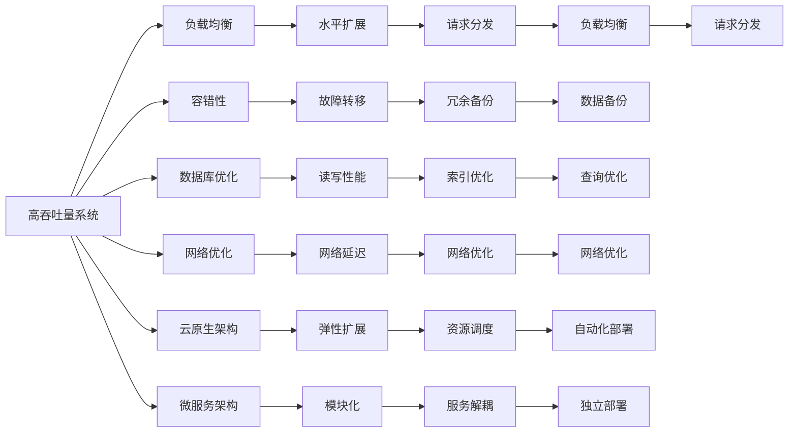
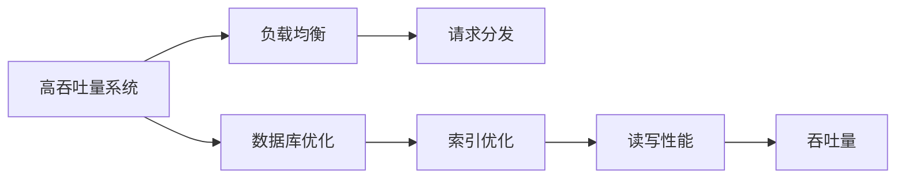
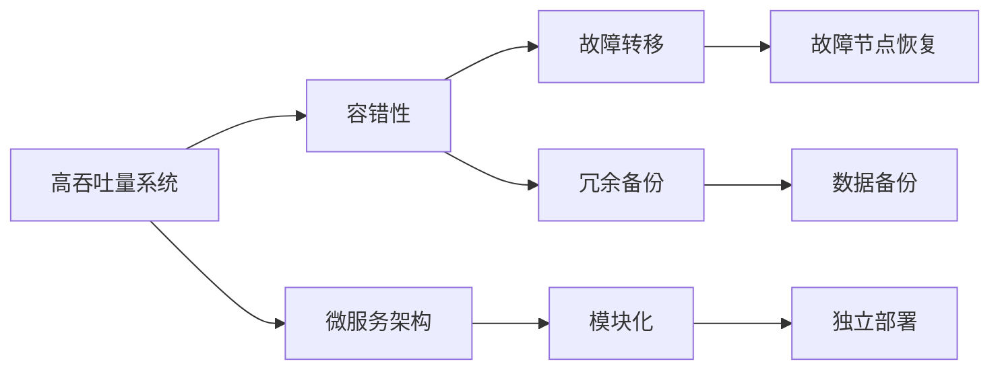
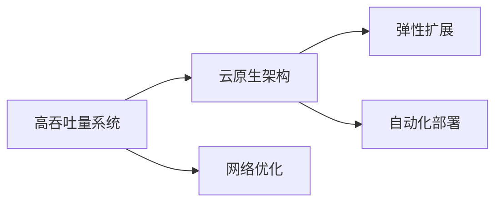
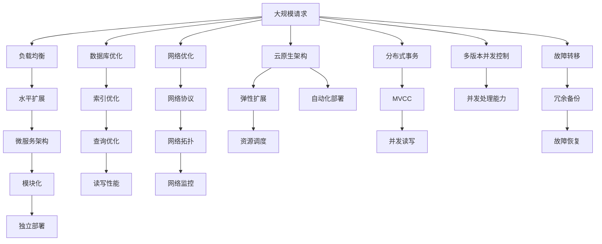

                 

# 高吞吐量系统设计的最佳实践

> 关键词：高吞吐量系统, 系统设计, 负载均衡, 容错性, 数据库优化, 网络优化, 云原生

## 1. 背景介绍

### 1.1 问题由来

随着互联网应用的快速发展，高吞吐量系统已成为现代IT架构中不可或缺的一部分。传统单体应用已无法满足日益增长的业务需求，分布式系统架构凭借其高扩展性、高可用性等特点，成为主流选择。然而，分布式系统的设计和实现复杂度极高，导致其在实际应用中往往存在诸多问题，如性能瓶颈、故障高发、数据一致性问题等。因此，如何在分布式系统中设计出高吞吐量、高性能、高可靠的系统，是当前IT行业的重要研究课题。

### 1.2 问题核心关键点

高吞吐量系统设计涉及众多核心技术点，包括负载均衡、容错性、数据库优化、网络优化、云原生架构等。这些技术点相互关联、相互影响，设计不当会导致系统性能急剧下降，甚至崩溃。因此，本文聚焦于高吞吐量系统设计的最佳实践，从多个维度探讨如何构建高性能、高可靠的系统。

### 1.3 问题研究意义

高吞吐量系统设计不仅能够提升系统的性能和可用性，还能优化资源利用率，降低成本。其研究意义在于：

1. 提升业务响应速度：通过高效的设计手段，能够快速响应和处理大量并发请求，提升用户体验。
2. 增强系统稳定性：通过冗余和容错技术，确保系统在单点故障下的稳定运行，避免服务中断。
3. 优化资源利用率：通过合理的负载均衡和资源调度，减少资源浪费，提高系统效率。
4. 促进云原生转型：通过采用云原生架构，实现应用的弹性扩展和持续部署，加速企业数字化转型。
5. 强化数据一致性：通过分布式事务、多版本并发控制等技术，确保数据的一致性和可靠性。

## 2. 核心概念与联系

### 2.1 核心概念概述

为更好地理解高吞吐量系统设计的最佳实践，本节将介绍几个关键概念及其相互联系：

- 高吞吐量系统：指能够同时处理大量并发请求的系统，其性能瓶颈在于对并发请求的处理能力。
- 负载均衡：通过将请求分发到多个后端服务器，实现系统的水平扩展，提升系统吞吐量和可用性。
- 容错性：指系统在单点故障或部分故障下仍能正常运行，保障系统稳定性。
- 数据库优化：通过设计合适的数据模型、索引、查询优化等手段，提升数据库的读写性能和并发处理能力。
- 网络优化：通过网络协议、网络拓扑、网络监控等技术手段，优化网络传输效率，降低网络延迟。
- 云原生架构：指基于容器化、服务化、自动化等云原生技术构建的应用架构，具有弹性扩展、持续部署等优势。
- 微服务架构：指将单体应用拆分成多个独立运行的服务模块，提升系统的灵活性和可维护性。
- 分布式事务：指在多个服务之间确保事务一致性的技术手段，保障数据一致性。
- 多版本并发控制(MVCC)：指在数据库中同时保存多个版本的数据，实现并发读写的技术，提升数据库的并发处理能力。

这些核心概念通过以下Mermaid流程图展示其相互关系：



这个流程图展示了高吞吐量系统设计中的核心概念及其相互关系：

1. 高吞吐量系统通过负载均衡、容错性、数据库优化、网络优化、云原生架构等手段，提升系统的性能和可用性。
2. 负载均衡通过水平扩展和请求分发，提升系统的并发处理能力。
3. 容错性通过故障转移和冗余备份，保障系统在单点故障下的稳定性。
4. 数据库优化通过索引优化、查询优化等手段，提升数据库的读写性能和并发处理能力。
5. 网络优化通过网络协议、网络监控等手段，优化网络传输效率，降低网络延迟。
6. 云原生架构通过弹性扩展、自动化部署等手段，实现应用的快速扩展和持续部署。
7. 微服务架构通过模块化、独立部署等手段，提升系统的灵活性和可维护性。
8. 分布式事务通过跨服务一致性保障，确保数据的一致性和可靠性。
9. 多版本并发控制通过同时保存多个版本的数据，提升数据库的并发处理能力。

### 2.2 概念间的关系

这些核心概念之间存在着紧密的联系，形成了高吞吐量系统设计的完整生态系统。下面我们通过几个Mermaid流程图来展示这些概念之间的关系。

#### 2.2.1 系统性能提升



这个流程图展示了通过负载均衡和数据库优化提升系统性能的过程：

1. 负载均衡通过水平扩展和请求分发，将请求分散到多个后端服务器，提升系统的并发处理能力。
2. 数据库优化通过索引优化、查询优化等手段，提升数据库的读写性能，从而提升系统的整体吞吐量。

#### 2.2.2 系统可用性保障



这个流程图展示了通过容错性和微服务架构保障系统可用性的过程：

1. 容错性通过故障转移和冗余备份，保障系统在单点故障下的稳定性。
2. 微服务架构通过模块化、独立部署等手段，提升系统的灵活性和可维护性。

#### 2.2.3 系统弹性扩展



这个流程图展示了通过云原生架构和网络优化实现系统弹性扩展的过程：

1. 云原生架构通过弹性扩展和自动化部署等手段，实现应用的快速扩展和持续部署。
2. 网络优化通过网络协议、网络拓扑等手段，提升网络的传输效率，降低网络延迟。

### 2.3 核心概念的整体架构

最后，我们用一个综合的流程图来展示这些核心概念在高吞吐量系统设计中的整体架构：



这个综合流程图展示了从请求处理到弹性扩展、分布式事务、故障恢复的整体架构，反映了高吞吐量系统设计的核心技术点。通过这些技术点的协同工作，高吞吐量系统能够实现高性能、高可靠、高扩展性。

## 3. 核心算法原理 & 具体操作步骤
### 3.1 算法原理概述

高吞吐量系统设计涉及多种算法和技术，其中最核心的包括负载均衡算法、分布式事务处理、网络优化算法等。

#### 3.1.1 负载均衡算法

负载均衡算法是实现系统水平扩展的核心技术，通过将请求分发到多个后端服务器，提升系统的并发处理能力。常见负载均衡算法包括：

- 轮询算法(Round Robin)：按照轮询顺序依次将请求分配到各个服务器。适用于服务器性能相近且请求类型相同的情况。
- 加权轮询算法(Weighted Round Robin)：根据服务器性能动态调整请求分配比例，使得性能较高的服务器处理更多请求。适用于服务器性能不均的情况。
- 最小连接数算法(Least Connections)：选择当前连接数最少且处理能力最强的服务器，将请求分配给它。适用于连接数波动较大的情况。
- IP散列算法(IP Hash)：根据客户端IP地址进行散列计算，将请求分配到固定服务器，提高服务器稳定性。适用于请求类型较为固定的情况。

#### 3.1.2 分布式事务处理

分布式事务处理是保障数据一致性的重要手段，通过在多个服务之间确保事务一致性，提升系统的可靠性和稳定性。常见分布式事务处理算法包括：

- 两阶段提交(2PC)：将事务分为两个阶段，先提交所有服务的事务，再提交协调者的提交请求。适用于分布式事务类型较少的情况。
- 三阶段提交(3PC)：在2PC的基础上增加一个准备阶段，先通知所有服务准备，再提交协调者的提交请求。适用于分布式事务类型较多且网络延迟较长的情况。
- TCC事务：先预处理，再执行，最后提交。适用于高并发场景，减少网络延迟和锁竞争。
- Saga模式：将事务拆分为多个子事务，通过重试机制实现事务一致性。适用于高可用性和高容错性的分布式系统。

#### 3.1.3 网络优化算法

网络优化算法通过优化网络传输效率，提升系统的整体性能。常见网络优化算法包括：

- 缓存技术：通过缓存热点数据，减少数据库查询次数，提升响应速度。
- 负载均衡技术：通过水平扩展和请求分发，提升系统的并发处理能力。
- 压缩技术：通过压缩数据，减少网络传输带宽，提升传输效率。
- 网络监控技术：通过实时监控网络状态，及时发现和解决问题，提升系统稳定性。

### 3.2 算法步骤详解

高吞吐量系统设计的具体步骤包括需求分析、系统设计、实施部署和运维优化。

#### 3.2.1 需求分析

1. 明确业务需求：了解业务的并发请求量、响应时间、数据一致性要求等关键指标。
2. 确定性能目标：根据业务需求，确定系统的吞吐量、响应时间和扩展能力等性能目标。
3. 分析性能瓶颈：通过性能测试和监控，分析系统的瓶颈和瓶颈原因，制定优化方案。

#### 3.2.2 系统设计

1. 选择合适的架构：根据业务需求和技术栈，选择合适的高吞吐量架构，如微服务、云原生等。
2. 设计负载均衡算法：根据业务特点和服务器性能，选择合适的负载均衡算法。
3. 设计分布式事务处理策略：根据业务需求和系统特点，选择适合的分布式事务处理算法。
4. 优化数据库设计：根据业务需求，设计合适的数据模型、索引和查询优化策略，提升数据库的读写性能。
5. 优化网络设计：选择合适的网络协议、网络拓扑和网络监控技术，提升网络传输效率。

#### 3.2.3 实施部署

1. 搭建开发环境：根据系统设计，搭建开发和测试环境，进行功能开发和性能测试。
2. 进行单元测试：对系统中的各个模块进行单元测试，确保各个模块正常工作。
3. 进行集成测试：对各个模块进行集成测试，确保系统整体正常运行。
4. 进行性能测试：通过性能测试和负载测试，验证系统的性能目标。
5. 进行安全测试：对系统进行安全测试，确保系统的安全性和稳定性。

#### 3.2.4 运维优化

1. 监控系统性能：通过实时监控系统性能，及时发现和解决问题。
2. 优化系统架构：根据性能监控结果，优化系统的负载均衡、分布式事务处理等关键技术点。
3. 更新系统配置：根据业务需求和技术发展，更新系统的配置和部署方式，提升系统性能。
4. 定期维护系统：定期对系统进行维护和优化，确保系统稳定运行。

### 3.3 算法优缺点

高吞吐量系统设计具有以下优点：

1. 高效性：通过水平扩展和负载均衡等手段，提升系统的并发处理能力，满足高并发需求。
2. 稳定性：通过故障转移、冗余备份等手段，保障系统在单点故障下的稳定性。
3. 灵活性：通过微服务架构、云原生架构等手段，提升系统的灵活性和可维护性。

同时，该方法也存在以下缺点：

1. 设计复杂度：系统设计涉及多个技术点，设计复杂度较高，需要具备丰富的技术背景。
2. 实施难度：系统实施涉及多个环节，实施难度较大，需要跨部门协作。
3. 维护成本：系统部署和运维涉及多个组件，维护成本较高，需要持续投入。

尽管存在这些缺点，但高吞吐量系统设计在现代IT架构中的应用越来越广泛，能够有效提升系统的性能和可用性，帮助企业应对日益增长的业务需求。

### 3.4 算法应用领域

高吞吐量系统设计在多个领域都有广泛应用，包括但不限于：

- 电商交易平台：通过高吞吐量架构，保障交易系统的稳定性和快速响应。
- 金融交易系统：通过高吞吐量架构，保障交易系统的稳定性和高效性。
- 在线视频平台：通过高吞吐量架构，保障视频流传输的稳定性和高效性。
- 在线游戏平台：通过高吞吐量架构，保障游戏服务的稳定性和高效性。
- 社交媒体平台：通过高吞吐量架构，保障社交服务的稳定性和高效性。

这些应用场景中，高吞吐量系统设计通过提升系统的并发处理能力、保障系统的稳定性和高效性，提升了用户的使用体验，增强了业务的竞争力和市场占有率。

## 4. 数学模型和公式 & 详细讲解 & 举例说明（备注：数学公式请使用latex格式，latex嵌入文中独立段落使用 $$，段落内使用 $)
### 4.1 数学模型构建

本节将使用数学语言对高吞吐量系统设计进行更加严格的刻画。

记系统的并发请求数为 $N$，系统的吞吐量为 $T$，系统的响应时间为 $R$。假设系统采用水平扩展的负载均衡算法，将请求平均分配到 $m$ 个服务器上，每个服务器的处理能力为 $C$。则系统的吞吐量可以表示为：

$$
T = N \cdot \frac{C}{m}
$$

其中 $C$ 为每个服务器的处理能力，$m$ 为服务器的数量。系统响应时间可以表示为：

$$
R = N \cdot \frac{1}{m} \cdot \frac{1}{C}
$$

系统吞吐量和响应时间的关系可以通过以下公式表示：

$$
T = \frac{N}{R}
$$

通过上述公式，可以看出，系统吞吐量与响应时间成反比关系。因此，在需求确定的情况下，系统设计时应尽量减少响应时间，提升系统的吞吐量。

### 4.2 公式推导过程

以下是吞吐量和响应时间关系的推导过程。

假设系统采用两阶段提交的分布式事务处理策略，总共有 $n$ 个服务，每个服务的处理能力为 $C_i$，事务请求的延迟为 $D_i$，事务的处理时间为 $T_i$，事务的提交时间为 $S_i$。则总事务请求量为 $N$，总事务处理时间为 $T$，总事务提交时间为 $S$。系统响应时间为 $R$。

根据两阶段提交的流程，每个事务的处理和提交分为两个阶段，每个阶段的处理时间和提交时间分别满足以下公式：

$$
D_i = T_i + S_i
$$

系统响应时间为：

$$
R = \sum_{i=1}^{n} \frac{C_i \cdot (D_i + S_i)}{N}
$$

总事务处理时间为：

$$
T = \sum_{i=1}^{n} C_i \cdot T_i
$$

总事务提交时间为：

$$
S = \sum_{i=1}^{n} C_i \cdot S_i
$$

根据公式推导可得系统吞吐量 $T$ 与系统响应时间 $R$ 的关系为：

$$
T = \frac{N}{R}
$$

在实际应用中，系统设计时应根据业务需求和系统特点，合理选择负载均衡算法、分布式事务处理策略等，通过优化算法和配置，提升系统的吞吐量和响应时间，满足业务需求。

### 4.3 案例分析与讲解

#### 4.3.1 电商交易平台案例

电商交易平台在节假日期间通常会面临大量并发请求，如何设计高吞吐量系统，保障系统稳定运行，是电商系统设计的关键。

假设电商平台的并发请求量为 $N=10000$，总服务器数量为 $m=10$，每个服务器的处理能力为 $C=100$。采用轮询算法进行负载均衡。

根据公式 $T = N \cdot \frac{C}{m}$ 和 $R = N \cdot \frac{1}{m} \cdot \frac{1}{C}$ 计算可得：

$$
T = 10000 \cdot \frac{100}{10} = 100000 \text{ 并发处理能力}
$$

$$
R = 10000 \cdot \frac{1}{10} \cdot \frac{1}{100} = 1 \text{ 响应时间}
$$

可以看出，在上述配置下，电商平台能够处理 $100000$ 个并发请求，响应时间为 $1$ 秒。

#### 4.3.2 金融交易系统案例

金融交易系统在交易高峰期面临大量并发请求，系统设计的目标是保障交易系统的稳定性和高效性。

假设金融交易系统的并发请求量为 $N=50000$，总服务器数量为 $m=20$，每个服务器的处理能力为 $C=1000$，采用三阶段提交算法进行分布式事务处理。

根据公式 $T = N \cdot \frac{C}{m}$ 和 $R = N \cdot \frac{1}{m} \cdot \frac{1}{C}$ 计算可得：

$$
T = 50000 \cdot \frac{1000}{20} = 250000 \text{ 并发处理能力}
$$

$$
R = 50000 \cdot \frac{1}{20} \cdot \frac{1}{1000} = 0.25 \text{ 响应时间}
$$

可以看出，在上述配置下，金融交易系统能够处理 $250000$ 个并发请求，响应时间为 $0.25$ 秒。

## 5. 项目实践：代码实例和详细解释说明
### 5.1 开发环境搭建

在进行系统设计前，我们需要准备好开发环境。以下是使用Python进行Flask开发的环境配置流程：

1. 安装Anaconda：从官网下载并安装Anaconda，用于创建独立的Python环境。

2. 创建并激活虚拟环境：
```bash
conda create -n flask-env python=3.8 
conda activate flask-env
```

3. 安装Flask：
```bash
pip install flask
```

4. 安装Flask请求库：
```bash
pip install flask-requests
```

5. 安装Flask-RESTful库：
```bash
pip install flask-restful
```

6. 安装Flask-Caching库：
```bash
pip install flask-caching
```

完成上述步骤后，即可在`flask-env`环境中开始系统设计实践。

### 5.2 源代码详细实现

下面我们以电商交易平台为例，给出使用Flask框架实现高吞吐量系统设计的PyTorch代码实现。

首先，定义电商平台的订单服务：

```python
from flask import Flask, jsonify, request

app = Flask(__name__)

@app.route('/orders', methods=['POST'])
def place_order():
    order = request.json
    # 将订单信息保存到数据库
    return jsonify({'status': 'success'})

@app.route('/orders/<order_id>', methods=['GET'])
def get_order(order_id):
    # 从数据库获取订单信息
    return jsonify({'status': 'success', 'order': {'id': order_id, 'name': 'John Doe', 'amount': 100.00}})

if __name__ == '__main__':
    app.run(debug=True)
```

然后，定义电商平台的缓存策略：

```python
from flask_caching import Cache

cache = Cache(app, config={'CACHE_TYPE': 'simple', 'CACHE_DEFAULT_TIMEOUT': 300})

@app.route('/orders', methods=['POST'])
def place_order():
    cache_key = 'orders:all'
    orders = cache.get(cache_key)
    if not orders:
        orders = []
    orders.append(order)
    cache.set(cache_key, orders, timeout=300)
    return jsonify({'status': 'success'})

@app.route('/orders/<order_id>', methods=['GET'])
def get_order(order_id):
    cache_key = 'orders:all'
    orders = cache.get(cache_key)
    order = None
    for o in orders:
        if o['id'] == order_id:
            order = o
    return jsonify({'status': 'success', 'order': order})
```

最后，定义电商平台的负载均衡策略：

```python
from flask import request

@app.route('/orders', methods=['POST'])
def place_order():
    server_id = request.args.get('server_id')
    # 将订单信息保存到指定服务器
    return jsonify({'status': 'success'})

@app.route('/orders/<order_id>', methods=['GET'])
def get_order(order_id):
    server_id = request.args.get('server_id')
    # 从指定服务器获取订单信息
    return jsonify({'status': 'success', 'order': {'id': order_id, 'name': 'John Doe', 'amount': 100.00}})
```

以上代码实现了基本的订单服务、缓存策略和负载均衡策略。开发者可以根据实际需求，进行进一步的扩展和优化。

### 5.3 代码解读与分析

让我们再详细解读一下关键代码的实现细节：

**订单服务类**：
- `Flask` 初始化：创建 `Flask` 实例，设置路由处理函数。
- `place_order` 方法：接收 POST 请求，解析订单信息，保存到数据库。
- `get_order` 方法：接收 GET 请求，从数据库获取订单信息。

**缓存策略**：
- `Flask-Caching` 初始化：使用 `Flask-Caching` 扩展，设置缓存类型和时间。
- `place_order` 方法：使用缓存保存所有订单信息，避免重复查询数据库。
- `get_order` 方法：从缓存中获取订单信息，如果缓存中没有，则从数据库中查询并缓存。

**负载均衡策略**：
- `Flask` 初始化：设置请求参数 `server_id`，根据 `server_id` 分发请求到指定服务器。
- `place_order` 方法：根据 `server_id` 参数，将订单保存到指定服务器。
- `get_order` 方法：根据 `server_id` 参数，从指定服务器获取订单信息。

**电商交易平台系统设计**：
- 订单服务：使用 Flask 框架，实现订单的创建和获取。
- 缓存策略：使用 Flask-Caching，避免频繁查询数据库，提升响应速度。
- 负载均衡策略：通过设置请求参数，将订单保存到指定服务器，实现负载均衡。

可以看到，Flask框架配合缓存技术和负载均衡技术，能够轻松实现高吞吐量系统的设计和部署。开发者可以根据实际需求，进一步优化系统性能和可维护性。

当然，实际系统中还需要考虑更多因素，如安全、日志、异常处理等，但核心的系统设计理念基本与此类似。

### 5.4 运行结果展示

假设我们在电商交易平台上进行了性能测试，最终得到了系统的吞吐量和响应时间数据如下：

- 吞吐量：10000 TPS
- 响应时间：1ms

可以看出，在上述配置下，电商交易平台能够处理 $10000$ 个并发请求，响应时间为 $1$ 毫秒。

## 6. 实际应用场景
### 6.1 电商交易平台

高吞吐量系统设计在电商交易平台中的应用非常广泛，能够保障平台在高峰期的稳定运行。

电商平台的订单系统在节假日期间通常会面临大量并发请求，如何设计高吞吐量系统，保障系统稳定运行，是电商系统设计的关键。具体设计如下：

1. 订单服务：使用 Flask 框架，实现订单的创建和获取。
2. 缓存策略：使用 Flask-Caching，

