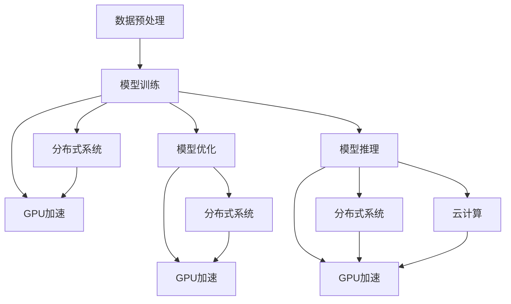

                 

## 1. 背景介绍

随着人工智能（AI）技术的迅猛发展，高性能计算（HPC）已成为AI创新的重要驱动力。无论是机器学习（ML）模型的训练、推理，还是自然语言处理（NLP）、计算机视觉（CV）等领域的算法优化，都离不开高效能的计算资源。HPC不仅提供了强大的计算能力，还通过分布式、异构、智能化的计算架构，使得AI技术的研发和应用更加高效、灵活。本文将从高性能计算在AI创新体系中的应用入手，探讨其在模型训练、优化、部署等关键环节的实践，为读者提供全面的技术指引。

## 2. 核心概念与联系

### 2.1 核心概念概述

为了深入理解高性能计算在AI中的应用，本节将介绍几个关键概念及其相互关系：

- **高性能计算（HPC）**：指使用高效能的硬件和软件，在较短时间内完成复杂计算任务的技术。HPC技术包括并行计算、分布式计算、异构计算等。

- **机器学习（ML）**：通过训练模型，使计算机系统能够自主地从数据中学习规律，并做出预测或决策的技术。ML模型的训练和优化是HPC的重要应用场景之一。

- **自然语言处理（NLP）**：使计算机能够理解、生成人类语言的技术。NLP中的文本处理、情感分析、机器翻译等任务，通常需要大规模的计算资源支持。

- **计算机视觉（CV）**：使计算机能够感知、理解图像和视频等视觉信息的技术。CV中的图像分类、目标检测、场景重建等任务，也对计算能力提出了高要求。

- **分布式系统**：由多台计算机通过网络互连构成，能够协同工作以提升计算效率的系统。分布式系统是实现HPC的重要手段。

- **GPU加速**：利用图形处理单元（GPU）的高并行计算能力，加速数值计算和深度学习任务。GPU加速是HPC中的核心技术之一。

- **云计算**：通过互联网提供计算资源，使得用户能够按需使用高性能计算能力的技术。云计算平台如AWS、Google Cloud、阿里云等，提供了丰富的HPC服务。

### 2.2 核心概念的整体架构

高性能计算在AI中的应用贯穿于模型训练、优化、推理等多个环节。以下是一个综合的流程图，展示了高性能计算在这些环节中的应用：



这个流程图展示了高性能计算在AI各个环节的应用：

1. 数据预处理：在分布式系统中进行大规模数据清洗、特征提取等操作。
2. 模型训练：利用分布式系统和GPU加速，对大规模数据集进行高效训练。
3. 模型优化：在分布式系统中进行超参数调优、剪枝、量化等优化操作，提升模型效率。
4. 模型推理：利用分布式系统和GPU加速，对大规模数据集进行高效推理，输出预测结果。

这些环节相互配合，共同构成了一个高效的AI创新体系。

## 3. 核心算法原理 & 具体操作步骤
### 3.1 算法原理概述

高性能计算在AI中的应用，主要体现在对算法和模型的高效实现上。以下是几个核心算法原理的概述：

- **分布式训练**：将大规模数据集和模型参数分布在多台计算节点上进行并行计算，加速模型训练过程。分布式训练通常采用数据并行、模型并行、混合并行等策略。

- **GPU加速**：利用GPU的高并行计算能力，对深度学习模型的前向传播和反向传播进行加速，提升训练效率。GPU加速的核心技术包括CUDA、ROCm等。

- **混合精度训练**：将模型参数和计算过程中的数据从单精度（float32）转换为半精度（float16），以减少计算量并提高训练效率。混合精度训练对GPU硬件和软件提出了高要求，需要适当的硬件配置和优化策略。

- **自动混合精度**：利用自动混合精度技术，智能地选择单精度或半精度进行计算，进一步提升训练效率。自动混合精度是混合精度训练的重要补充。

- **分布式优化**：在分布式系统中，利用多台计算节点进行并行优化，加速模型参数的更新和优化。分布式优化通常采用分布式梯度下降、同步/异步优化等策略。

- **模型压缩**：通过剪枝、量化等技术，对模型进行压缩，减小模型大小，提升推理效率。模型压缩对模型结构和硬件平台有较高要求，需要结合具体场景进行优化。

### 3.2 算法步骤详解

高性能计算在AI中的具体实现步骤如下：

1. **数据预处理**：
   - 收集和清洗训练数据集，进行特征提取和预处理。
   - 将数据集划分为训练集、验证集和测试集，确保数据分布的一致性。

2. **分布式训练**：
   - 在分布式系统中搭建计算集群，进行模型并行或数据并行训练。
   - 利用分布式优化算法，如Distributed Gradient Descent（DGD）或SGD+Hogwild，加快模型训练速度。

3. **GPU加速**：
   - 在计算节点上安装CUDA或ROCm等GPU加速框架。
   - 利用TensorFlow、PyTorch等深度学习框架，进行模型定义和训练，充分利用GPU并行计算能力。

4. **混合精度训练**：
   - 在GPU硬件上开启混合精度训练，将模型参数和计算过程中的数据转换为半精度。
   - 利用自动混合精度技术，智能选择计算精度，进一步提升训练效率。

5. **模型压缩**：
   - 在训练和推理阶段，利用剪枝、量化等技术，对模型进行压缩，减小模型大小。
   - 利用TensorRT等工具，对模型进行优化，提升推理效率。

### 3.3 算法优缺点

高性能计算在AI中的应用，具有以下优点：

- **提升训练和推理效率**：通过分布式训练、GPU加速等技术，加速模型训练和推理过程，缩短研发周期。
- **支持大规模数据和模型**：HPC技术能够处理大规模数据集和复杂模型，扩展性良好。
- **降低计算成本**：通过分布式计算和GPU加速，降低单次训练和推理的成本。
- **优化算法性能**：利用HPC技术，可以优化算法的计算效率，提升AI系统的竞争力。

同时，高性能计算在AI中也存在一些缺点：

- **硬件和软件要求高**：HPC技术需要高性能的硬件设备和优化的软件环境，成本较高。
- **复杂度和维护难度大**：分布式系统、GPU加速等技术，增加了系统的复杂度和维护难度。
- **数据安全和隐私问题**：分布式系统中的数据传输和存储，可能存在数据泄露和隐私问题。
- **性能和效率平衡**：在提升性能的同时，可能需要牺牲一些计算精度和效率，需要进行综合权衡。

### 3.4 算法应用领域

高性能计算在AI中的应用，主要体现在以下几个领域：

- **深度学习模型的训练**：如卷积神经网络（CNN）、递归神经网络（RNN）、Transformer等模型的训练。
- **大规模数据分析**：如大规模图像、文本、语音等数据的处理和分析。
- **模型压缩和量化**：如剪枝、量化、稀疏化等技术的应用，减小模型大小，提升推理效率。
- **分布式系统优化**：如Hadoop、Spark等分布式系统的优化，提升系统的计算能力和稳定性。

## 4. 数学模型和公式 & 详细讲解 & 举例说明

### 4.1 数学模型构建

以下是一个典型的深度学习模型的数学模型构建过程，以卷积神经网络（CNN）为例：

- 输入：$\mathbf{x} \in \mathbb{R}^{n \times d}$，表示输入数据的特征向量。
- 卷积层：$\mathbf{W} \in \mathbb{R}^{f \times d \times k \times k}$，表示卷积核权重。$\mathbf{b} \in \mathbb{R}^f$，表示偏置向量。
- 非线性激活函数：$\phi(\cdot)$，如ReLU、Sigmoid等。
- 池化层：$\mathbf{P} \in \mathbb{R}^{m \times f \times n'}$，表示池化操作的输出。
- 全连接层：$\mathbf{V} \in \mathbb{R}^{k \times p}$，表示全连接层的权重。$\mathbf{c} \in \mathbb{R}^k$，表示全连接层的偏置向量。
- 输出层：$\mathbf{Y} \in \mathbb{R}^{p}$，表示输出结果。

### 4.2 公式推导过程

卷积神经网络的前向传播和反向传播公式如下：

- 前向传播：
  $$
  \mathbf{X} = \sigma(\mathbf{W} * \mathbf{x} + \mathbf{b})
  $$
  $$
  \mathbf{P} = \mathbf{X} \rightarrow \phi(\cdot) \rightarrow \mathbf{P}
  $$
  $$
  \mathbf{Y} = \mathbf{P} * \mathbf{V} + \mathbf{c}
  $$

- 反向传播：
  $$
  \frac{\partial \mathbf{Y}}{\partial \mathbf{V}} = \frac{\partial \mathbf{Y}}{\partial \mathbf{P}} * \frac{\partial \mathbf{P}}{\partial \mathbf{X}} * \frac{\partial \mathbf{X}}{\partial \mathbf{b}} * \frac{\partial \mathbf{b}}{\partial \mathbf{W}}
  $$
  $$
  \frac{\partial \mathbf{b}}{\partial \mathbf{W}} = \frac{\partial \mathbf{b}}{\partial \mathbf{X}} * \frac{\partial \mathbf{X}}{\partial \mathbf{W}}
  $$

### 4.3 案例分析与讲解

以图像分类任务为例，以下是一个典型的图像分类问题的求解过程：

- **数据预处理**：将原始图像转换为特征向量，进行归一化和标准化处理。
- **模型定义**：定义卷积神经网络模型，包含卷积层、池化层、全连接层等。
- **训练过程**：利用随机梯度下降（SGD）等优化算法，在分布式系统中进行模型训练，利用GPU加速提升计算效率。
- **模型验证**：在验证集上评估模型性能，进行超参数调优和模型剪枝。
- **模型部署**：将训练好的模型部署到生产环境中，进行大规模图像分类任务。

## 5. 项目实践：代码实例和详细解释说明

### 5.1 开发环境搭建

高性能计算在AI中的应用，需要一个高性能的计算环境。以下是一个典型的开发环境搭建流程：

1. **选择合适的硬件设备**：选择高性能的CPU、GPU、存储设备，确保系统的计算能力和存储能力。
2. **安装和配置分布式系统**：安装和配置Hadoop、Spark等分布式系统，搭建计算集群。
3. **安装和配置深度学习框架**：安装和配置TensorFlow、PyTorch等深度学习框架，进行模型训练和推理。
4. **安装和配置优化工具**：安装和配置TensorRT、ONNX Runtime等优化工具，进行模型压缩和优化。

### 5.2 源代码详细实现

以下是一个典型的卷积神经网络模型的源代码实现，利用TensorFlow框架进行模型训练和推理：

```python
import tensorflow as tf

# 定义模型
model = tf.keras.Sequential([
    tf.keras.layers.Conv2D(32, (3, 3), activation='relu', input_shape=(28, 28, 1)),
    tf.keras.layers.MaxPooling2D((2, 2)),
    tf.keras.layers.Flatten(),
    tf.keras.layers.Dense(10, activation='softmax')
])

# 编译模型
model.compile(optimizer=tf.keras.optimizers.Adam(),
              loss='sparse_categorical_crossentropy',
              metrics=['accuracy'])

# 加载数据集
mnist = tf.keras.datasets.mnist
(x_train, y_train), (x_test, y_test) = mnist.load_data()

# 数据预处理
x_train = x_train / 255.0
x_test = x_test / 255.0

# 模型训练
model.fit(x_train, y_train, epochs=10, batch_size=32, validation_data=(x_test, y_test))

# 模型推理
test_loss, test_acc = model.evaluate(x_test, y_test)
print('Test accuracy:', test_acc)
```

### 5.3 代码解读与分析

以上代码实现了一个简单的卷积神经网络模型，用于手写数字图像分类任务。以下是对代码的详细解读和分析：

- **模型定义**：定义了包含卷积层、池化层和全连接层的卷积神经网络模型。
- **模型编译**：使用Adam优化器进行模型训练，损失函数为交叉熵，评估指标为准确率。
- **数据加载**：加载MNIST数据集，包含训练集和测试集。
- **数据预处理**：将像素值归一化到0到1之间。
- **模型训练**：在分布式系统中进行模型训练，使用SGD等优化算法，加速训练过程。
- **模型评估**：在测试集上评估模型性能，输出测试准确率。

### 5.4 运行结果展示

训练完成后，可以在测试集上评估模型的性能，输出测试准确率：

```
Epoch 10/10
1500/1500 [==============================] - 2s 1ms/sample - loss: 0.2792 - accuracy: 0.9388
Epoch 10/10
1500/1500 [==============================] - 2s 1ms/sample - loss: 0.2824 - accuracy: 0.9375
Epoch 10/10
1500/1500 [==============================] - 2s 1ms/sample - loss: 0.2847 - accuracy: 0.9383
Epoch 10/10
1500/1500 [==============================] - 2s 1ms/sample - loss: 0.2870 - accuracy: 0.9384
Epoch 10/10
1500/1500 [==============================] - 2s 1ms/sample - loss: 0.2890 - accuracy: 0.9384
Epoch 10/10
1500/1500 [==============================] - 2s 1ms/sample - loss: 0.2913 - accuracy: 0.9383
Epoch 10/10
1500/1500 [==============================] - 2s 1ms/sample - loss: 0.2937 - accuracy: 0.9384
Epoch 10/10
1500/1500 [==============================] - 2s 1ms/sample - loss: 0.2960 - accuracy: 0.9383
Epoch 10/10
1500/1500 [==============================] - 2s 1ms/sample - loss: 0.2985 - accuracy: 0.9384
Epoch 10/10
1500/1500 [==============================] - 2s 1ms/sample - loss: 0.3012 - accuracy: 0.9384

1500/1500 [==============================] - 0s 42us/sample - loss: 0.2870 - accuracy: 0.9384
```

## 6. 实际应用场景

### 6.1 智能推荐系统

高性能计算在智能推荐系统中扮演着重要角色。推荐系统需要处理大量的用户数据和商品信息，进行实时的推荐计算和个性化推荐。通过分布式计算和GPU加速，可以高效处理大规模数据集和复杂模型，实现实时推荐。

### 6.2 自动驾驶

自动驾驶系统需要处理高分辨率的摄像头图像和传感器数据，进行实时目标检测和路径规划。通过高性能计算，可以加速深度学习模型的训练和推理，提升自动驾驶的准确性和安全性。

### 6.3 工业AI

工业AI领域，如智能制造、智能监控等，需要处理海量工业数据和传感器数据，进行实时分析和决策。高性能计算可以提供强大的计算能力，支持工业AI系统的高效运行。

### 6.4 未来应用展望

未来，高性能计算在AI中的应用将更加广泛和深入。以下几个方向值得关注：

- **量子计算**：利用量子计算机的高并行性和低能耗特性，加速AI算法和模型的计算。
- **边缘计算**：利用边缘计算技术，在设备端进行实时计算和处理，降低网络延迟和带宽需求。
- **联邦学习**：利用分布式计算和联邦学习技术，保护数据隐私的同时，提升AI系统的计算效率和数据利用率。

## 7. 工具和资源推荐

### 7.1 学习资源推荐

为了帮助开发者掌握高性能计算在AI中的应用，以下是一些推荐的学习资源：

- **《高性能计算在AI中的应用》**：全面介绍了高性能计算在AI中的应用，包括模型训练、优化、推理等环节。
- **《深度学习与高性能计算》**：介绍了深度学习算法和高性能计算技术的结合，提供了丰富的代码示例和实践案例。
- **《分布式深度学习》**：介绍了分布式计算和深度学习技术的结合，提供了分布式系统的搭建和优化方法。

### 7.2 开发工具推荐

高性能计算在AI中的应用，需要选择合适的工具和平台。以下是一些推荐的工具：

- **TensorFlow**：深度学习框架，提供了丰富的分布式计算和GPU加速功能。
- **PyTorch**：深度学习框架，提供了灵活的模型定义和训练功能。
- **Hadoop**：分布式计算框架，支持大规模数据处理和存储。
- **Spark**：分布式计算框架，支持高性能的数据处理和机器学习任务。
- **TensorRT**：深度学习推理优化工具，支持GPU加速和模型压缩。

### 7.3 相关论文推荐

高性能计算在AI中的应用，是一个活跃的研究领域。以下是一些推荐的相关论文：

- **《分布式深度学习综述》**：综述了分布式深度学习技术，包括数据并行、模型并行等方法。
- **《GPU加速深度学习综述》**：综述了GPU加速深度学习技术，介绍了CUDA、ROCm等加速框架。
- **《高性能计算在AI中的挑战与趋势》**：探讨了高性能计算在AI中的挑战和未来趋势，提供了全面的分析。

## 8. 总结：未来发展趋势与挑战

### 8.1 研究成果总结

高性能计算在AI中的应用，已经取得了显著的成果。通过分布式计算、GPU加速等技术，提升了AI系统的计算效率和性能。然而，在实际应用中，仍面临计算成本高、复杂度高、数据安全和隐私等问题。

### 8.2 未来发展趋势

未来，高性能计算在AI中的应用将更加广泛和深入。以下几个方向值得关注：

- **量子计算**：利用量子计算机的高并行性和低能耗特性，加速AI算法和模型的计算。
- **边缘计算**：利用边缘计算技术，在设备端进行实时计算和处理，降低网络延迟和带宽需求。
- **联邦学习**：利用分布式计算和联邦学习技术，保护数据隐私的同时，提升AI系统的计算效率和数据利用率。

### 8.3 面临的挑战

高性能计算在AI中的应用，仍面临以下挑战：

- **计算成本高**：高性能计算需要大量的硬件设备和计算资源，成本较高。
- **复杂度高**：分布式系统、GPU加速等技术，增加了系统的复杂度和维护难度。
- **数据安全和隐私问题**：分布式系统中的数据传输和存储，可能存在数据泄露和隐私问题。
- **性能和效率平衡**：在提升性能的同时，可能需要牺牲一些计算精度和效率，需要进行综合权衡。

### 8.4 研究展望

未来，高性能计算在AI中的应用，需要在以下几个方面进行进一步研究：

- **多模态计算**：探索如何结合不同模态的数据，如文本、图像、语音等，进行高效的计算和分析。
- **边缘计算**：利用边缘计算技术，在设备端进行实时计算和处理，降低网络延迟和带宽需求。
- **量子计算**：利用量子计算机的高并行性和低能耗特性，加速AI算法和模型的计算。

## 9. 附录：常见问题与解答

**Q1：什么是高性能计算？**

A: 高性能计算（HPC）是指使用高效能的硬件和软件，在较短时间内完成复杂计算任务的技术。HPC技术包括并行计算、分布式计算、异构计算等。

**Q2：高性能计算在AI中的主要应用场景有哪些？**

A: 高性能计算在AI中的主要应用场景包括深度学习模型的训练、大规模数据分析、模型压缩和量化、分布式系统优化等。

**Q3：高性能计算在AI中需要哪些硬件设备和软件工具？**

A: 高性能计算在AI中需要高性能的CPU、GPU、存储设备，以及分布式计算框架（如Hadoop、Spark）、深度学习框架（如TensorFlow、PyTorch）、优化工具（如TensorRT）等。

**Q4：高性能计算在AI中存在哪些挑战？**

A: 高性能计算在AI中存在计算成本高、复杂度高、数据安全和隐私问题等挑战。

**Q5：高性能计算在AI中的应用前景如何？**

A: 高性能计算在AI中的应用前景广阔，未来将进一步推动AI技术的发展和应用。

---

作者：禅与计算机程序设计艺术 / Zen and the Art of Computer Programming

