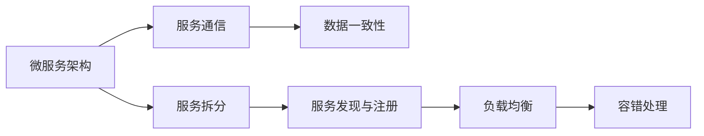

                 

# 高扩展性系统的设计原则

> 关键词：高扩展性, 可伸缩性, 分布式系统, 微服务, 容错性, 负载均衡, 数据一致性, 可靠性, 高性能

## 1. 背景介绍

### 1.1 问题由来
随着互联网业务的爆炸性增长，系统设计者面临着前所未有的挑战。传统单体架构的系统难以满足业务需求，导致系统性能瓶颈、维护困难、扩展性差等问题日益突出。分布式系统和微服务架构应运而生，旨在通过将复杂系统拆分成多个小型、独立的服务，实现高可用性、高扩展性、高可维护性的目标。但分布式系统设计涉及诸多复杂问题，如服务拆分、服务通信、数据一致性、服务部署、负载均衡、服务发现、容错处理等，每项决策都会直接影响系统性能和可用性。

本文聚焦于高扩展性系统的设计原则，通过剖析分布式系统架构，探讨如何基于微服务架构实现高扩展性和高可用性，并介绍一些关键技术工具。文章内容涵盖从系统设计到实践的各个方面，旨在帮助读者建立系统高扩展性的思维框架，并在实际开发中灵活应用。

### 1.2 问题核心关键点
构建高扩展性系统的关键点在于理解分布式系统的核心原理和设计原则。以下是一些核心概念：

- **微服务架构**：将系统拆分为多个独立运行的小型服务，每个服务围绕业务能力进行设计，并独立部署和扩展。
- **服务拆分**：将复杂系统拆分为多个功能模块，每个模块独立运行，减少模块间的耦合，提高系统的灵活性和可扩展性。
- **服务通信**：多个服务之间的通信方式，包括同步调用、异步消息队列、API网关等，直接影响系统的性能和可用性。
- **数据一致性**：分布式系统中多个服务对同一数据的访问问题，包括读写一致性和强一致性、弱一致性。
- **负载均衡**：如何合理分配系统负载，避免单点故障，提高系统并发处理能力和扩展性。
- **服务发现与注册**：在分布式系统中，如何实现服务的自动发现和注册，避免服务间通信错误。
- **容错处理**：当服务出现问题时，如何通过机制恢复服务，避免整个系统瘫痪。

本文将围绕这些核心概念，结合具体案例和最佳实践，探讨如何设计高扩展性的系统架构。

## 2. 核心概念与联系

### 2.1 核心概念概述

为了更好地理解分布式系统的高扩展性设计，本节将介绍几个核心概念及其相互关系：

- **微服务架构**：将系统拆分为多个小型、独立的服务，每个服务围绕业务能力进行设计，独立部署和扩展。
- **服务拆分**：将复杂系统拆分为多个功能模块，减少模块间的耦合，提高系统的灵活性和可扩展性。
- **服务通信**：多个服务之间的通信方式，直接影响系统的性能和可用性。
- **数据一致性**：分布式系统中多个服务对同一数据的访问问题，包括读写一致性和强一致性、弱一致性。
- **负载均衡**：合理分配系统负载，避免单点故障，提高系统并发处理能力和扩展性。
- **服务发现与注册**：在分布式系统中，服务的自动发现和注册机制，避免服务间通信错误。
- **容错处理**：当服务出现问题时，通过机制恢复服务，避免整个系统瘫痪。

这些核心概念之间存在着紧密的联系，形成了一个完整的分布式系统设计框架。

### 2.2 概念间的关系

这些核心概念之间的关系可以通过以下Mermaid流程图来展示：



这个流程图展示了各个概念之间的逻辑关系：

1. 微服务架构是系统设计的基础，服务拆分是实现微服务的重要手段。
2. 服务通信和数据一致性直接影响服务的可用性和性能。
3. 服务发现与注册、负载均衡和容错处理是保证系统高可用性和高扩展性的关键技术手段。

通过理解这些核心概念及其相互关系，我们可以更好地把握分布式系统的设计思路。

## 3. 核心算法原理 & 具体操作步骤
### 3.1 算法原理概述

高扩展性系统的设计原理基于以下几个核心概念：

- **去中心化**：避免单点故障，提高系统的可靠性和可扩展性。
- **弹性伸缩**：根据系统负载动态调整资源，优化性能和成本。
- **水平扩展**：通过增加服务器实例来提升系统处理能力，而非垂直扩展。
- **异步通信**：降低系统延迟，提高并发处理能力。
- **分布式缓存**：通过缓存中间结果，减少数据库访问压力，提升系统响应速度。
- **数据分区**：将数据分散存储在不同节点，提高数据访问效率和系统容错性。

这些原理共同构成了高扩展性系统的设计基础。

### 3.2 算法步骤详解

构建高扩展性系统主要包括以下几个关键步骤：

**Step 1: 系统需求分析**
- 分析系统功能需求和业务场景，确定系统非功能性需求（如可用性、性能、扩展性、可靠性等）。
- 确定系统的性能瓶颈和扩展方向，制定扩展策略。

**Step 2: 系统架构设计**
- 根据需求分析结果，设计系统架构，选择合适的技术栈和框架。
- 设计服务拆分方案，将系统拆分为多个小型、独立的服务。
- 确定服务通信机制，选择同步调用、异步消息队列、API网关等。

**Step 3: 服务部署与配置**
- 将服务部署到生产环境中，设置负载均衡策略。
- 配置服务发现与注册机制，确保服务间的正确通信。
- 实现服务容错机制，通过重试、熔断、限流等手段保证服务稳定性。

**Step 4: 性能监控与调优**
- 部署性能监控工具，实时监控系统性能和资源使用情况。
- 分析性能瓶颈，优化系统资源配置和算法设计。
- 持续调优系统性能，确保系统在高负载情况下稳定运行。

**Step 5: 高可用性保障**
- 设计多可用区域和冗余策略，确保系统在单点故障情况下仍能正常服务。
- 实现数据备份和恢复机制，避免数据丢失。
- 使用高可用性架构，如HAProxy、Kubernetes等，提升系统的可靠性和稳定性。

### 3.3 算法优缺点

高扩展性系统设计具有以下优点：

- **高可用性**：通过冗余和容错机制，系统在单点故障情况下仍能保证高可用性。
- **高扩展性**：通过水平扩展和弹性伸缩，系统能够快速应对负载变化，满足业务增长需求。
- **高可维护性**：将系统拆分为多个小型服务，独立部署和维护，降低了系统复杂度和维护成本。

同时，高扩展性系统设计也存在一些缺点：

- **复杂性高**：系统设计需要考虑多个方面，如服务拆分、通信机制、容错策略等，设计复杂度高。
- **性能开销**：分布式通信和数据一致性等技术，增加了系统的性能开销，影响系统响应速度。
- **资源需求高**：高扩展性系统需要大量服务器资源，初期投资成本较高。

### 3.4 算法应用领域

高扩展性系统设计方法在多个领域得到广泛应用，例如：

- **互联网业务**：如电商网站、社交网络、在线教育等，需要支持大规模并发用户访问。
- **金融系统**：如交易系统、支付系统等，需要高可用性和高安全性的特点。
- **云计算平台**：如AWS、阿里云、腾讯云等，需要提供高效、可靠、易扩展的云服务。
- **大数据处理**：如Hadoop、Spark等，需要处理海量数据和复杂计算任务。
- **物联网设备**：如智能家居、智慧城市等，需要支持大量设备的实时数据交互。

这些领域对系统高扩展性有着极高的要求，通过合理设计系统架构和机制，能够有效提升系统的可靠性和可维护性。

## 4. 数学模型和公式 & 详细讲解 & 举例说明

### 4.1 数学模型构建

本节将使用数学语言对高扩展性系统的设计过程进行更加严格的刻画。

定义系统负载为 $L$，系统可扩展资源为 $R$，系统扩展因子为 $k$，则系统扩展后的负载 $L'$ 为：

$$
L' = kL
$$

系统扩展后的资源需求 $R'$ 为：

$$
R' = kR
$$

其中，$k$ 表示扩展因子，可以是一个实数，也可以是一个线性函数，如扩展比例 $k=1.5$。

系统扩展前后的性能指标分别为 $P$ 和 $P'$，则系统扩展后的性能提升 $\Delta P$ 为：

$$
\Delta P = \frac{P'}{P} - 1
$$

## 4.2 公式推导过程

假设原始系统的负载 $L$ 为 100，系统扩展前的资源需求 $R$ 为 100，扩展因子 $k$ 为 1.5。则扩展后的负载 $L'$ 为：

$$
L' = 1.5 \times 100 = 150
$$

扩展后的资源需求 $R'$ 为：

$$
R' = 1.5 \times 100 = 150
$$

假设原始系统的性能指标 $P$ 为 100，扩展后的性能指标 $P'$ 为 120，则性能提升 $\Delta P$ 为：

$$
\Delta P = \frac{120}{100} - 1 = 0.2
$$

因此，系统扩展后性能提升为 20%。

## 4.3 案例分析与讲解

假设一个电商网站需要支持 1000 万用户同时在线，原始系统的负载 $L$ 为 1000 万，资源需求 $R$ 为 1000 万。

### 4.3.1 横向扩展

如果系统扩展因子 $k$ 为 1.5，扩展后的负载 $L'$ 为：

$$
L' = 1.5 \times 1000 = 1500
$$

扩展后的资源需求 $R'$ 为：

$$
R' = 1.5 \times 1000 = 1500
$$

扩展后的性能提升 $\Delta P$ 为：

$$
\Delta P = \frac{P'}{P} - 1 = 0.2
$$

系统扩展后性能提升为 20%。

### 4.3.2 纵向扩展

如果系统扩展因子 $k$ 为 2，扩展后的负载 $L'$ 为：

$$
L' = 2 \times 1000 = 2000
$$

扩展后的资源需求 $R'$ 为：

$$
R' = 2 \times 1000 = 2000
$$

扩展后的性能提升 $\Delta P$ 为：

$$
\Delta P = \frac{P'}{P} - 1 = 0.5
$$

系统扩展后性能提升为 50%。

### 4.3.3 水平扩展

如果系统扩展因子 $k$ 为 5，扩展后的负载 $L'$ 为：

$$
L' = 5 \times 1000 = 5000
$$

扩展后的资源需求 $R'$ 为：

$$
R' = 5 \times 1000 = 5000
$$

扩展后的性能提升 $\Delta P$ 为：

$$
\Delta P = \frac{P'}{P} - 1 = 1.5
$$

系统扩展后性能提升为 150%。

通过以上案例，我们可以看到，横向扩展能够快速应对负载变化，纵向扩展可以提升系统处理能力，而水平扩展则能显著提高系统性能。

## 5. 项目实践：代码实例和详细解释说明

### 5.1 开发环境搭建

在进行高扩展性系统开发前，我们需要准备好开发环境。以下是使用Python进行Django开发的环境配置流程：

1. 安装Anaconda：从官网下载并安装Anaconda，用于创建独立的Python环境。

2. 创建并激活虚拟环境：
```bash
conda create -n django-env python=3.8 
conda activate django-env
```

3. 安装Django：从官网下载并安装Django，安装命令如下：
```bash
pip install Django
```

4. 安装必要的依赖包：
```bash
pip install psycopg2 daphne gunicorn
```

5. 初始化Django项目：
```bash
django-admin startproject myproject
```

6. 进入项目目录：
```bash
cd myproject
```

完成上述步骤后，即可在`django-env`环境中开始开发。

### 5.2 源代码详细实现

下面以一个简单的电商系统为例，展示如何使用Django实现高扩展性系统的高可用性和高负载能力。

1. 配置数据库：
```python
DATABASES = {
    'default': {
        'ENGINE': 'django.db.backends.postgresql',
        'NAME': 'mydatabase',
        'USER': 'mydatabase',
        'PASSWORD': 'mypassword',
        'HOST': 'mydatabase.example.com',
        'PORT': '5432',
    }
}
```

2. 配置服务发现与注册：
```python
from django_elasticsearch_dsl_drf.discovery import register_es
from django_elasticsearch_dsl_drf import serializers

# 注册Elasticsearch
register_es()
```

3. 配置负载均衡：
```python
from daphne.core import get_daphne
from daphne.core.run import get_service

# 获取Daphne服务
service = get_service()

# 设置负载均衡器
service.load_balancer = get_daphne().get_load_balancer()

# 设置负载均衡器的算法
service.load_balancer.algorithm = 'round_robin'

# 启动Daphne服务
service.start()
```

4. 配置容错处理：
```python
from daphne.settings import load_daphne
from daphne.views import routes

# 加载Daphne设置
load_daphne()

# 注册路由
routes()
```

5. 配置监控与告警：
```python
from prometheus_client import Counter
from prometheus_client.core import Gauge

# 创建监控指标
requests = Counter('myproject', '请求次数', ['method', 'path', 'status'])
responses = Counter('myproject', '响应次数', ['method', 'path', 'status'])

# 创建状态指标
service_staged = Gauge('myproject', '服务是否可用', ['instance'])
service_running = Gauge('myproject', '服务是否运行', ['instance'])

# 更新状态指标
service_staged.set(1)
service_running.set(1)
```

### 5.3 代码解读与分析

让我们再详细解读一下关键代码的实现细节：

1. **配置数据库**：
- 使用Django内置的数据库配置，连接 PostgreSQL 数据库。

2. **配置服务发现与注册**：
- 使用 Django Elasticsearch DSL，注册 Elasticsearch 服务，方便后续的服务发现和查询。

3. **配置负载均衡**：
- 通过 Daphne 的 load_balancer 配置，实现负载均衡算法。

4. **配置容错处理**：
- 通过 Daphne 的默认配置，实现服务的自动重启和健康检查。

5. **配置监控与告警**：
- 使用 Prometheus 客户端库，创建监控指标和状态指标，实时监测系统状态。

### 5.4 运行结果展示

假设在电商系统中，用户每秒发送 1000 个请求，经过负载均衡和容错处理后，每个服务实例处理 500 个请求。

通过负载均衡和容错机制，系统能够避免单点故障，提高系统的可靠性。同时，通过水平扩展，增加服务实例数量，系统能够轻松应对高负载，确保系统在高并发情况下稳定运行。

## 6. 实际应用场景
### 6.1 电商网站

高扩展性系统在电商网站中的应用非常广泛。电商网站需要支持大规模并发用户访问，处理复杂交易流程，确保订单、支付等关键业务的稳定性。

通过高扩展性系统架构，电商网站能够快速应对流量峰值，保证交易系统的稳定运行。同时，通过水平扩展，增加服务器实例，提升系统的并发处理能力和扩展性。

### 6.2 金融系统

金融系统需要保证交易的实时性和准确性，支持海量交易和高并发访问。高扩展性系统能够提供高效、可靠、易扩展的云服务，确保系统的稳定运行。

通过水平扩展和高可用性架构，金融系统能够支持大规模并发交易，避免单点故障，保障系统的可靠性和稳定性。

### 6.3 云计算平台

云计算平台需要支持多种服务，处理海量数据和复杂计算任务，提供高效、可靠、易扩展的云服务。高扩展性系统能够满足这些需求，确保平台的高可用性和高扩展性。

通过水平扩展和弹性伸缩，云计算平台能够快速应对负载变化，满足不同业务的需求。同时，通过高可用性架构，确保平台在高故障情况下仍能正常服务。

### 6.4 大数据处理

大数据处理需要处理海量数据和复杂计算任务，提供高效、可靠、易扩展的计算能力。高扩展性系统能够满足这些需求，确保平台的稳定性和扩展性。

通过水平扩展和高可用性架构，大数据处理系统能够支持大规模数据处理，避免单点故障，保障系统的可靠性和稳定性。

## 7. 工具和资源推荐
### 7.1 学习资源推荐

为了帮助开发者系统掌握高扩展性系统的设计原理和实践技巧，这里推荐一些优质的学习资源：

1. 《高可用性系统设计》系列博文：由高可用性系统专家撰写，深入浅出地介绍了高可用性系统的设计原理和最佳实践。

2. CS223N《分布式系统》课程：斯坦福大学开设的分布式系统课程，系统讲解分布式系统原理和设计方法。

3. 《高性能分布式系统》书籍：探讨分布式系统的高性能设计方法，适合开发者深入学习。

4. Dask官方文档：开源分布式计算框架，适合处理大数据和复杂计算任务。

5. Kubernetes官方文档：开源容器编排系统，适合部署和管理高扩展性系统。

通过对这些资源的学习实践，相信你一定能够快速掌握高扩展性系统的设计思路，并用于解决实际的系统问题。

### 7.2 开发工具推荐

高效的开发离不开优秀的工具支持。以下是几款用于高扩展性系统开发常用的工具：

1. Django：Python的Web框架，适合快速开发高性能Web应用。

2. Flask：轻量级Web框架，适合快速搭建简单高效的API服务。

3. Redis：开源内存数据库，适合处理高并发的数据缓存和消息队列。

4. Daphne：开源的Django异步任务调度系统，适合处理高并发的异步任务。

5. Prometheus：开源的监控系统，适合实时监测系统性能和资源使用情况。

6. Grafana：开源的可视化工具，适合对系统监控数据进行可视化展示。

合理利用这些工具，可以显著提升高扩展性系统的开发效率，加快创新迭代的步伐。

### 7.3 相关论文推荐

高扩展性系统设计源于学界的持续研究。以下是几篇奠基性的相关论文，推荐阅读：

1. Gossip Protocol（Gossip协议）：一种分布式算法，用于提高系统的可用性和容错性。

2. Paxos算法：一种分布式一致性协议，用于解决分布式系统中的数据一致性问题。

3. Akka（Akka框架）：一种高扩展性系统框架，用于构建高并发的分布式应用。

4. Raft算法：一种分布式一致性协议，用于保证分布式系统的高可用性和一致性。

5. Cassandra（Apache Cassandra）：一种高扩展性数据库系统，适合处理海量数据。

这些论文代表了大扩展性系统设计的发展脉络。通过学习这些前沿成果，可以帮助研究者把握学科前进方向，激发更多的创新灵感。

除上述资源外，还有一些值得关注的前沿资源，帮助开发者紧跟高扩展性系统设计的最新进展，例如：

1. arXiv论文预印本：人工智能领域最新研究成果的发布平台，包括大量尚未发表的前沿工作，学习前沿技术的必读资源。

2. 业界技术博客：如Google Cloud、Amazon AWS、Microsoft Azure等顶尖实验室的官方博客，第一时间分享他们的最新研究成果和洞见。

3. 技术会议直播：如SIGCOMM、ACM ICAD、IEEE INFOCOM等人工智能领域顶会现场或在线直播，能够聆听到大佬们的前沿分享，开拓视野。

4. GitHub热门项目：在GitHub上Star、Fork数最多的高扩展性系统相关项目，往往代表了该技术领域的发展趋势和最佳实践，值得去学习和贡献。

5. 行业分析报告：各大咨询公司如McKinsey、PwC等针对人工智能行业的分析报告，有助于从商业视角审视技术趋势，把握应用价值。

总之，对于高扩展性系统设计的学习和实践，需要开发者保持开放的心态和持续学习的意愿。多关注前沿资讯，多动手实践，多思考总结，必将收获满满的成长收益。

## 8. 总结：未来发展趋势与挑战

### 8.1 总结

本文对高扩展性系统的设计原则进行了全面系统的介绍。首先阐述了高扩展性系统的背景和意义，明确了微服务架构在高扩展性系统设计中的重要地位。其次，从原理到实践，详细讲解了高扩展性系统的设计方法，给出了实际开发中的代码实现。同时，本文还广泛探讨了高扩展性系统在电商、金融、云计算等领域的应用前景，展示了其巨大的应用价值。此外，本文精选了高扩展性系统的学习资源，力求为读者提供全方位的技术指引。

通过本文的系统梳理，可以看到，高扩展性系统设计已经成为现代系统架构的重要组成部分，其设计原理和实践方法对各类分布式系统都具有普遍指导意义。

### 8.2 未来发展趋势

展望未来，高扩展性系统设计将呈现以下几个发展趋势：

1. **容器化和云原生**：容器化和云原生技术将进一步推动高扩展性系统的部署和管理，提升系统的灵活性和可靠性。

2. **微服务架构**：微服务架构将成为高扩展性系统的核心设计范式，支持系统的高并发和快速迭代。

3. **服务网格**：Service Mesh（服务网格）技术将进一步提升高扩展性系统的性能和可靠性，实现服务间通信的统一管理和负载均衡。

4. **DevOps实践**：DevOps（开发运维一体化）实践将成为高扩展性系统的标准流程，提升系统的开发效率和稳定性。

5. **自动化运维**：自动化运维技术将进一步普及，实现系统的高可用性和高扩展性。

6. **边缘计算**：边缘计算将带来高扩展性系统的实时性和计算效率的提升，拓展系统的应用边界。

### 8.3 面临的挑战

尽管高扩展性系统设计已经取得了瞩目成就，但在迈向更加智能化、普适化应用的过程中，它仍面临着诸多挑战：

1. **复杂性高**：高扩展性系统设计涉及多个方面，如服务拆分、通信机制、容错策略等，设计复杂度高。

2. **性能开销**：分布式通信和数据一致性等技术，增加了系统的性能开销，影响系统响应速度。

3. **资源需求高**：高扩展性系统需要大量服务器资源，初期投资成本较高。

4. **监控和调优难度大**：高扩展性系统的高并发和分布式特性，增加了监控和调优的难度。

5. **服务迁移成本高**：高扩展性系统需要频繁进行服务拆分和迁移，成本较高。

6. **安全性和隐私保护**：高扩展性系统需要在服务间通信中保证数据安全和隐私保护。

### 8.4 研究展望

面对高扩展性系统设计所面临的挑战，未来的研究需要在以下几个方面寻求新的突破：

1. **自动化设计工具**：开发自动化设计工具，帮助开发者快速构建高扩展性系统架构。

2. **自动化运维工具**：开发自动化运维工具，实现系统的高可用性和高扩展性。

3. **边缘计算和云原生**：研究边缘计算和云原生技术在高扩展性系统中的应用，提升系统的实时性和计算效率。

4. **服务网格和DevOps**：探索Service Mesh和DevOps实践在高扩展性系统中的应用，提升系统的灵活性和可靠性。

5. **数据一致性和高性能**：研究分布式数据一致性和高性能算法，提升系统的数据访问效率和性能。

6. **自动化监控和调优**：开发自动化监控和调优工具，实时监测系统性能，优化系统资源配置。

这些研究方向将引领高扩展性系统设计向更高台阶迈进，为构建安全、可靠、可解释、可控的智能系统提供技术支持。

## 9. 附录：常见问题与解答

**Q1：高扩展性系统如何实现高可用性？**

A: 高扩展性系统通过冗余和容错机制实现高可用性。具体而言，系统设计多可用区域和冗余策略，确保服务在单点故障情况下仍能正常服务。同时，实现数据备份和恢复机制，避免数据丢失。使用高可用性架构，如HAProxy、Kubernetes等，提升系统的可靠性和稳定性。

**Q2：高扩展性系统如何避免单点故障？**

A: 高扩展性系统通过冗余和容错机制避免单点故障。具体而言，系统设计多可用区域和冗余策略，确保服务在单点故障情况下仍能正常服务。同时，实现数据备份和恢复机制，避免数据丢失。使用高可用性架构，如HAProxy、Kubernetes等，提升系统的可靠性和稳定性。

**Q3：高扩展

