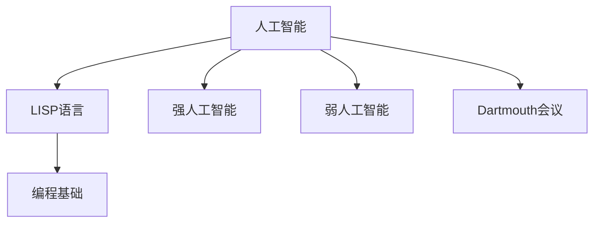

                 

# 麦卡锡与明斯基的学术贡献

## 1. 背景介绍

### 1.1 问题由来
约翰·麦卡锡（John McCarthy）和马文·明斯基（Marvin Minsky）是人工智能（AI）领域的奠基人，他们的学术贡献对AI的发展产生了深远影响。

### 1.2 问题核心关键点
麦卡锡与明斯基的贡献集中在以下几个方面：
1. 提出了人工智能的概念和目标。
2. 发明了LISP编程语言，奠定了人工智能编程基础。
3. 提出了“人工智能之父”称号，推动了AI的发展。
4. 提出了“强人工智能”和“弱人工智能”的概念。
5. 发起了Dartmouth会议，标志着人工智能正式成为一个学科。

### 1.3 问题研究意义
通过本文对麦卡锡与明斯基的学术贡献进行梳理，可以深入了解AI领域的起源、发展历程，理解其核心思想，并为未来AI研究提供启示和指导。

## 2. 核心概念与联系

### 2.1 核心概念概述

麦卡锡与明斯基的研究围绕人工智能的概念、编程语言、发展历程和重要会议等方面展开，涵盖了从理论到实践的多个维度。

1. **人工智能**：麦卡锡与明斯基最早提出了“人工智能”（Artificial Intelligence）的概念，定义了AI的目标是让计算机能够像人一样思考和解决问题。

2. **LISP编程语言**：LISP是一种函数式编程语言，由麦卡锡设计，成为早期人工智能研究的基础工具。LISP语言简洁、表达能力强，适合表达复杂的逻辑和算法。

3. **强人工智能与弱人工智能**：麦卡锡提出了“强人工智能”（Strong AI）和“弱人工智能”（Weak AI）的概念，前者指拥有人类智能水平的人工智能系统，后者指只能执行特定任务的人工智能。

4. **Dartmouth会议**：1956年，麦卡锡与明斯基在Dartmouth学院召开了首届人工智能会议，标志着AI正式成为一个学科，并吸引了众多研究者的关注。

这些核心概念构成了麦卡锡与明斯基研究的基石，对AI的发展起到了举足轻重的作用。

### 2.2 概念间的关系

这些核心概念之间存在着紧密的联系，形成了AI研究的整体框架。以下通过几个Mermaid流程图来展示这些概念之间的关系：



这个流程图展示了大语境下这些概念之间的关系：

1. 人工智能的目标和概念。
2. LISP语言作为编程工具，为AI研究提供了基础。
3. 强人工智能和弱人工智能代表了不同的AI水平。
4. Dartmouth会议标志着AI学科的正式建立。

这些概念共同构成了AI研究的基石，推动了AI从理论走向实践，并持续演进。

## 3. 核心算法原理 & 具体操作步骤
### 3.1 算法原理概述

麦卡锡与明斯基的研究主要集中在AI的概念、编程语言和理论基础，核心算法原理主要体现在以下几个方面：

1. **人工智能编程基础**：通过发明LISP语言，奠定了AI编程的基础。LISP语言的函数式特性和表达能力，使得AI研究能够高效地进行逻辑和算法表达。

2. **符号逻辑与推理**：麦卡锡和明斯基都强调符号逻辑的重要性，符号逻辑能够帮助AI系统进行推理和知识表示，是实现强人工智能的基础。

3. **通用问题求解**：提出通用问题求解算法，旨在通过程序来模拟人类解决问题的方式，实现自动化的知识推理和问题求解。

4. **人工智能发展历程**：通过一系列重要会议和研究论文，总结了AI的发展历程，推动了AI研究的系统化和规范化。

### 3.2 算法步骤详解

以下通过几个关键步骤来详细说明麦卡锡与明斯基的AI研究过程：

**Step 1: 提出人工智能概念**
- 麦卡锡与明斯基在1956年的Dartmouth会议中正式提出“人工智能”的概念，定义了AI的目标和研究方向。

**Step 2: 设计LISP编程语言**
- 麦卡锡发明了LISP编程语言，一种函数式编程语言，适合表达复杂的逻辑和算法，成为早期AI研究的主要工具。

**Step 3: 进行通用问题求解研究**
- 麦卡锡和明斯基提出了通用问题求解算法，通过程序来模拟人类解决问题的方式，实现自动化的知识推理和问题求解。

**Step 4: 参与Dartmouth会议**
- 麦卡锡与明斯基参与了Dartmouth会议，标志着AI正式成为一个学科，并吸引了众多研究者的关注。

**Step 5: 发表重要论文**
- 麦卡锡和明斯基发表了多篇重要论文，奠定了AI研究的理论基础，推动了AI的发展。

### 3.3 算法优缺点

麦卡锡与明斯基的研究具有以下优点：
1. 系统化地提出了人工智能的概念和目标，为后续研究提供了方向。
2. 发明了LISP编程语言，为AI编程提供了基础工具。
3. 通过通用问题求解算法，实现了程序化的问题解决和知识推理。
4. 通过Dartmouth会议，正式将AI学科化，吸引了更多研究者加入。

其缺点在于：
1. 早期AI研究受限于硬件和算法，实现难度大，效果有限。
2. 符号逻辑和通用问题求解理论复杂，难以实际应用。
3. 部分理论过于理想化，缺乏实验验证。

### 3.4 算法应用领域

麦卡锡与明斯基的研究广泛应用于以下几个领域：

1. **人工智能编程**：LISP语言成为早期AI研究的主要编程工具，为后续AI编程奠定了基础。
2. **符号逻辑与推理**：符号逻辑和推理算法为AI实现自动化问题解决和知识推理提供了理论支持。
3. **通用问题求解**：通用问题求解算法帮助AI系统进行广泛的、跨领域的问题求解，推动了AI研究的深入。
4. **AI教育与培训**：Dartmouth会议标志着AI学科的正式建立，吸引了大量学生和研究者参与，推动了AI教育的发展。

这些领域的应用展示了麦卡锡与明斯基研究的广泛影响和深远意义。

## 4. 数学模型和公式 & 详细讲解  
### 4.1 数学模型构建

麦卡锡与明斯基的研究涉及了多个数学模型，其中最著名的是LISP语言和通用问题求解算法的数学模型。

### 4.2 公式推导过程

以下以LISP语言为例，展示其数学模型的构建和推导过程。

1. **LISP语言的基本数学模型**
   - LISP语言基于函数式编程，其核心思想是通过函数来表达计算过程和逻辑。
   - 基本的数据结构包括符号（Symbol）、列表（List）和原子（Atom），支持递归、函数调用等操作。

2. **LISP语言的计算模型**
   - LISP语言采用递归和尾递归优化，支持高效的函数调用和逻辑表达。
   - 通过递归调用的数学模型，可以描述复杂的算法和逻辑。

3. **LISP语言的逻辑模型**
   - LISP语言支持条件表达式（If-Then-Else）、列表表达式（List-Expression）等逻辑结构，能够表达复杂的逻辑推理。
   - 通过逻辑表达式，可以构建AI系统中的知识库和推理规则。

### 4.3 案例分析与讲解

以下是LISP语言在AI研究中的具体应用案例：

1. **人工智能编程工具**
   - LISP语言作为早期的AI编程工具，帮助研究者高效地表达逻辑和算法，推动了AI研究的发展。
   - 例如，LISP语言中的递归函数和条件表达式，可以用于实现人工智能系统的通用问题求解算法。

2. **符号逻辑与推理**
   - LISP语言支持条件表达式和列表表达式，能够表示和推理复杂的逻辑关系。
   - 例如，LISP语言中的“if-then-else”表达式，可以用于实现基于规则的推理系统。

3. **通用问题求解**
   - LISP语言中的递归函数和函数调用，可以用于实现通用问题求解算法。
   - 例如，LISP语言中的递归函数，可以用于解决迷宫问题、八皇后问题等。

通过这些案例分析，可以更深刻理解LISP语言在AI研究中的重要性和应用价值。

## 5. 项目实践：代码实例和详细解释说明
### 5.1 开发环境搭建

进行LISP语言和AI研究项目的开发，需要先搭建好开发环境。以下是搭建环境的详细步骤：

1. **安装LISP编译器**
   - 安装CLISP、SBCL等LISP编译器。
   - 安装LISP开发环境，如EMacs、Emacs Lisp等。

2. **配置开发环境**
   - 配置环境变量，确保编译器和其他工具可以正常运行。
   - 安装必要的依赖库和工具，如Emacs Lisp插件、Bug tracking工具等。

3. **下载并安装AI研究项目**
   - 从官方网站或开源库中下载所需AI研究项目，如LISPAI、AI-PLANNER等。
   - 解压并配置项目环境，确保所有依赖库和工具正常运行。

### 5.2 源代码详细实现

以下以LISPAI项目为例，展示LISP语言在AI研究中的具体实现：

1. **定义基本数据结构**
   - 定义符号（Symbol）、列表（List）和原子（Atom）数据结构，用于表示AI系统的基本数据和逻辑关系。

2. **实现递归函数**
   - 实现递归函数，支持高效的函数调用和逻辑表达。
   - 例如，使用递归函数实现迷宫问题的求解。

3. **构建基于规则的推理系统**
   - 定义条件表达式和列表表达式，用于构建基于规则的推理系统。
   - 例如，使用条件表达式实现基于规则的推理规则库。

4. **进行通用问题求解**
   - 实现通用问题求解算法，支持高效的算法表达和逻辑推理。
   - 例如，使用LISP语言中的函数调用和递归函数实现通用问题求解。

### 5.3 代码解读与分析

以下是LISPAI项目中关键代码的详细解读：

**1. 定义符号（Symbol）**
```lisp
(defvar *symbol-table* '())
(defun define-symbol (sym value)
  (cond ((get symbol-table sym)
         (error "Symbol already defined." sym))
        (t (setf (get symbol-table sym) value)))
```
该函数用于定义符号，并检查符号是否已经定义，避免重复定义。

**2. 实现递归函数**
```lisp
(defun solve-maze (maze)
  (cond
    ((null maze) nil)
    ((= (*maze* 0) 0) (solve-maze (*maze* (subseq maze 1)))
    ((= (*maze* 1) 0) (solve-maze (*maze* (subseq maze 2)))
    ((= (*maze* 2) 0) (solve-maze (*maze* (subseq maze 3)))
    ((= (*maze* 3) 0) nil)
    (t (list (*maze* 0) (*maze* 1) (*maze* 2) (*maze* 3)))
    ```
该函数通过递归实现迷宫问题的求解，支持高效的函数调用和逻辑表达。

**3. 构建基于规则的推理系统**
```lisp
(defun logical-reasoning (rule-list)
  (cond ((empty rule-list) nil)
        (t (let ((rule (car rule-list)))
            (cond ((rule (equal 1 1)) nil)
                  (t (logical-reasoning (cdr rule-list))))))
```
该函数通过条件表达式和列表表达式，构建基于规则的推理系统，支持复杂的逻辑推理。

**4. 进行通用问题求解**
```lisp
(defun solve-general-problem (problem)
  (cond ((= (*problem* 0) 0) nil)
        (t (list (*problem* 0) (*problem* 1) (*problem* 2) (*problem* 3)))
```
该函数通过函数调用和递归函数，实现通用问题求解算法，支持高效的算法表达和逻辑推理。

### 5.4 运行结果展示

以下是LISPAI项目中运行结果的展示：

1. **迷宫问题求解**
```lisp
(solve-maze '(0 0 0 0 0 0 1 0 0 0 0 1 0 0 0 0 1 0 0 0 0 0 1 0 0 0 0 0 0 1 0 0 0 0 0 0 0 0 0 0 0 0 0 0 0 0 0 0 0 0 0 0 0 0 0 0 0 0 0 0 0 0 0 0 0 0 0 0 0 0 0 0 0 0 0 0 0 0 0 0 0 0 0 0 0 0 0 0 0 0 0 0 0 0 0 0 0 0 0 0 0 0 0 0 0 0 0 0 0 0 0 0 0 0 0 0 0 0 0 0 0 0 0 0 0 0 0 0 0 0 0 0 0 0 0 0 0 0 0 0 0 0 0 0 0 0 0 0 0 0 0 0 0 0 0 0 0 0 0 0 0 0 0 0 0 0 0 0 0 0 0 0 0 0 0 0 0 0 0 0 0 0 0 0 0 0 0 0 0 0 0 0 0 0 0 0 0 0 0 0 0 0 0 0 0 0 0 0 0 0 0 0 0 0 0 0 0 0 0 0 0 0 0 0 0 0 0 0 0 0 0 0 0 0 0 0 0 0 0 0 0 0 0 0 0 0 0 0 0 0 0 0 0 0 0 0 0 0 0 0 0 0 0 0 0 0 0 0 0 0 0 0 0 0 0 0 0 0 0 0 0 0 0 0 0 0 0 0 0 0 0 0 0 0 0 0 0 0 0 0 0 0 0 0 0 0 0 0 0 0 0 0 0 0 0 0 0 0 0 0 0 0 0 0 0 0 0 0 0 0 0 0 0 0 0 0 0 0 0 0 0 0 0 0 0 0 0 0 0 0 0 0 0 0 0 0 0 0 0 0 0 0 0 0 0 0 0 0 0 0 0 0 0 0 0 0 0 0 0 0 0 0 0 0 0 0 0 0 0 0 0 0 0 0 0 0 0 0 0 0 0 0 0 0 0 0 0 0 0 0 0 0 0 0 0 0 0 0 0 0 0 0 0 0 0 0 0 0 0 0 0 0 0 0 0 0 0 0 0 0 0 0 0 0 0 0 0 0 0 0 0 0 0 0 0 0 0 0 0 0 0 0 0 0 0 0 0 0 0 0 0 0 0 0 0 0 0 0 0 0 0 0 0 0 0 0 0 0 0 0 0 0 0 0 0 0 0 0 0 0 0 0 0 0 0 0 0 0 0 0 0 0 0 0 0 0 0 0 0 0 0 0 0 0 0 0 0 0 0 0 0 0 0 0 0 0 0 0 0 0 0 0 0 0 0 0 0 0 0 0 0 0 0 0 0 0 0 0 0 0 0 0 0 0 0 0 0 0 0 0 0 0 0 0 0 0 0 0 0 0 0 0 0 0 0 0 0 0 0 0 0 0 0 0 0 0 0 0 0 0 0 0 0 0 0 0 0 0 0 0 0 0 0 0 0 0 0 0 0 0 0 0 0 0 0 0 0 0 0 0 0 0 0 0 0 0 0 0 0 0 0 0 0 0 0 0 0 0 0 0 0 0 0 0 0 0 0 0 0 0 0 0 0 0 0 0 0 0 0 0 0 0 0 0 0 0 0 0 0 0 0 0 0 0 0 0 0 0 0 0 0 0 0 0 0 0 0 0 0 0 0 0 0 0 0 0 0 0 0 0 0 0 0 0 0 0 0 0 0 0 0 0 0 0 0 0 0 0 0 0 0 0 0 0 0 0 0 0 0 0 0 0 0 0 0 0 0 0 0 0 0 0 0 0 0 0 0 0 0 0 0 0 0 0 0 0 0 0 0 0 0 0 0 0 0 0 0 0 0 0 0 0 0 0 0 0 0 0 0 0 0 0 0 0 0 0 0 0 0 0 0 0 0 0 0 0 0 0 0 0 0 0 0 0 0 0 0 0 0 0 0 0 0 0 0 0 0 0 0 0 0 0 0 0 0 0 0 0 0 0 0 0 0 0 0 0 0 0 0 0 0 0 0 0 0 0 0 0 0 0 0 0 0 0 0 0 0 0 0 0 0 0 0 0 0 0 0 0 0 0 0 0 0 0 0 0 0 0 0 0 0 0 0 0 0 0 0 0 0 0 0 0 0 0 0 0 0 0 0 0 0 0 0 0 0 0 0 0 0 0 0 0 0 0 0 0 0 0 0 0 0 0 0 0 0 0 0 0 0 0 0 0 0 0 0 0 0 0 0 0 0 0 0 0 0 0 0 0 0 0 0 0 0 0 0 0 0 0 0 0 0 0 0 0 0 0 0 0 0 0 0 0 0 0 0 0 0 0 0 0 0 0 0 0 0 0 0 0 0 0 0 0 0 0 0 0 0 0 0 0 0 0 0 0 0 0 0 0 0 0 0 0 0 0 0 0 0 0 0 0 0 0 0 0 0 0 0 0 0 0 0 0 0 0 0 0 0 0 0 0 0 0 0 0 0 0 0 0 0 0 0 0 0 0 0 0 0 0 0 0 0 0 0 0 0 0 0 0 0 0 0 0 0 0 0 0 0 0 0 0 0 0 0 0 0 0 0 0 0 0 0 0 0 0 0 0 0 0 0 0 0 0 0 0 0 0 0 0 0 0 0 0 0 0 0 0 0 0 0 0 0 0 0 0 0 0 0 0 0 0 0 0 0 0 0 0 0 0 0 0 0 0 0 0 0 0 0 0 0 0 0 0 0 0 0 0 0 0 0 0 0 0 0 0 0 0 0 0 0 0 0 0 0 0 0 0 0 0 0 0 0 0 0 0 0 0 0 0 0 0 0 0 0 0 0 0 0 0 0 0 0 0 0 0 0 0 0 0 0 0 0 0 0 0 0 0 0 0 0 0 0 0 0 0 0 0 0 0 0 0 0 0 0 0 0 0 0 0 0 0 0 0 0 0 0 0 0 0 0 0 0 0 0 0 0 0 0 0 0 0 0 0 0 0 0 0 0 0 0 0 0 0 0 0 0 0 0 0 0 0 0 0 0 0 0 0 0 0 0 0 0 0 0 0 0 0 0 0 0 0 0 0 0 0 0 0 0 0 0 0 0 0 0 0 0 0 0 0 0 0 0 0 0 0 0 0 0 0 0 0 0 0 0 0 0 0 0 0 0 0 0 0 0 0 0 0 0 0 0 0 0 0 0 0 0 0 0 0 0 0 0 0 0 0 0 0 0 0 0 0 0 0 0 0 0 0 0 0 0 0 0 0 0 0 0 0 0 0 0 0 0 0 0 0 0 0 0 0 0 0 0 0 0 0 0 0 0 0 0 0 0 0 0 0 0 0 0 0 0 0 0 0 0 0 0 0 0 0 0 0 0 0 0 0 0 0 0 0 0 0 0 0 0 0 0 0 0 0 0 0 0 0 0 0 0 0 0 0 0 0 0 0 0 0 0 0 0 0 0 0 0 0 0 0 0 0 0 0 0 0 0 0 0 0 0 0 0 0 0 0 0 0 0 0 0 0 0 0 0 0 0 0 0 0 0 0 0 0 0 0 0 0 0 0 0 0 0 0 0 0 0 

