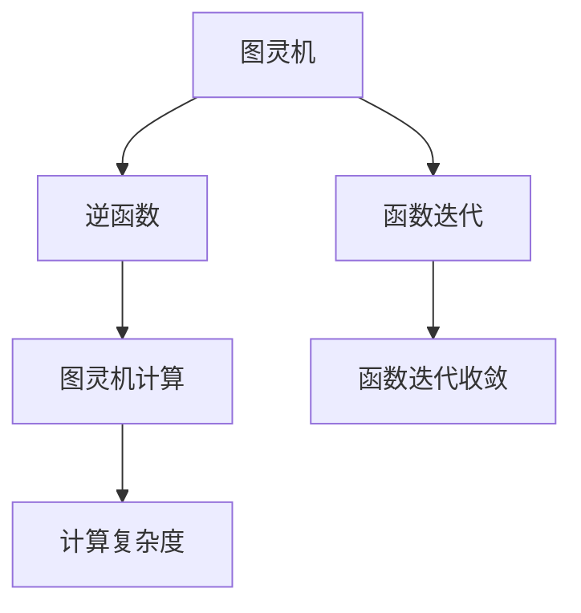

                 

# 麦卡 McCarthy 的图灵机逆函数研究

> 关键词：图灵机，逆函数，函数迭代，数学模型，数学分析，图灵机计算，函数计算

## 1. 背景介绍

### 1.1 问题由来
在计算机科学的早期发展阶段，图灵机作为理论计算模型的基准，对计算理论、算法复杂度等方面产生了深远的影响。麦卡锡（John McCarthy），作为人工智能的奠基人之一，曾在1960年代对图灵机和逆函数（Inverse Function）的计算问题进行了深入研究，提出了图灵机逆函数的构造方法和一些重要结论。

麦卡锡的研究不仅深化了对图灵机的理解，也为后来的函数迭代和逆函数理论的发展奠定了基础。他的研究内容涉及图灵机的可计算性、逆函数的存在性和计算复杂度等问题，对计算机科学和数学领域产生了深远的影响。

## 2. 核心概念与联系

### 2.1 核心概念概述

为更好地理解麦卡锡的图灵机逆函数研究，本节将介绍几个关键概念：

- **图灵机（Turing Machine, TM）**：由图灵提出的一种抽象计算模型，用于描述计算过程。图灵机包括一个带读写头的无限纸带、读写头、有限状态集、转移函数等组成，能够模拟任何可计算函数。

- **逆函数（Inverse Function）**：对于函数 $f: A \to B$，其逆函数 $f^{-1}: B \to A$ 满足 $f(f^{-1}(y)) = y$ 对任意 $y \in B$ 成立。逆函数的存在性问题在数学和计算机科学中都有重要意义。

- **函数迭代（Function Iteration）**：指的是对函数 $f$ 的多次连续应用，即 $f(f(\cdots f(x)))$。函数迭代的研究涉及迭代收敛、迭代函数的存在性等问题。

- **图灵机计算（Turing Machine Computation）**：指通过图灵机对函数进行计算的过程。计算复杂度是图灵机计算研究的重要方面。

这些核心概念通过数学和计算理论密切相关，共同构成了计算机科学的理论基础。麦卡锡的研究工作正是基于这些核心概念展开的。

### 2.2 概念间的关系

这些核心概念之间的逻辑关系可以通过以下Mermaid流程图来展示：



这个流程图展示了大语言模型的核心概念及其之间的关系：

1. 图灵机是计算理论的基础，通过图灵机可以对任何可计算函数进行模拟。
2. 逆函数的存在性问题，与函数的可逆性密切相关，是函数迭代研究的重要内容。
3. 函数迭代可以通过图灵机进行计算，研究其收敛性和存在性，涉及计算复杂度的分析。
4. 图灵机计算研究函数的可计算性，而函数迭代则是图灵机计算的一种特殊情况。

通过这个图示，我们可以更清晰地理解麦卡锡的图灵机逆函数研究的背景和目标。

## 3. 核心算法原理 & 具体操作步骤

### 3.1 算法原理概述

麦卡锡的研究主要集中在逆函数和函数迭代的计算上，特别是图灵机如何高效地计算逆函数。其核心思想是通过图灵机对函数进行迭代计算，以构造逆函数的图灵机表示。

具体而言，麦卡锡提出了以下步骤：

1. 设计一个图灵机 $M_f$，用于计算函数 $f$ 的迭代 $f^k$，其中 $k$ 是迭代次数。
2. 将 $f^k$ 作为输入，设计一个图灵机 $M_{f^k}$，用于计算 $f^{-k}$。
3. 如果 $f^{-k}$ 是有效的，则 $M_{f^k}$ 就是 $f$ 的逆函数 $f^{-1}$ 的图灵机表示。

### 3.2 算法步骤详解

下面详细讲解麦卡锡提出的逆函数计算步骤：

1. **设计计算 $f^k$ 的图灵机 $M_f$**：
   - $M_f$ 接受一个 $n$ 位输入 $x$，通过迭代计算 $f^k(x)$。
   - $M_f$ 的状态集为 $\{0, 1, 2, \ldots, 2k+1\}$，初始状态为 $0$。
   - 转移函数定义为 $\delta: \{0, 1, 2, \ldots, 2k+1\} \times \{0, 1\} \to \{0, 1, 2, \ldots, 2k+1\} \times \{0, 1\}$。

2. **设计计算 $f^{-k}$ 的图灵机 $M_{f^k}$**：
   - $M_{f^k}$ 接受一个 $n$ 位输入 $y$，通过迭代计算 $f^{-k}(y)$。
   - $M_{f^k}$ 的状态集为 $\{0, 1, 2, \ldots, 2k+1\}$，初始状态为 $0$。
   - 转移函数定义为 $\delta: \{0, 1, 2, \ldots, 2k+1\} \times \{0, 1\} \to \{0, 1, 2, \ldots, 2k+1\} \times \{0, 1\}$。

3. **验证 $f^{-k}$ 的存在性**：
   - 如果 $M_{f^k}$ 能够接受任意 $n$ 位输入 $y$ 并正确输出 $f^{-k}(y)$，则 $f^{-k}$ 存在，且 $M_{f^k}$ 是 $f^{-1}$ 的图灵机表示。

### 3.3 算法优缺点

麦卡锡的逆函数计算方法具有以下优点：
1. **通用性**：适用于任何可计算函数，具有广泛的适用性。
2. **计算效率**：通过图灵机的迭代计算，可以高效地构造逆函数的图灵机表示。

同时，该方法也存在一些局限性：
1. **复杂度较高**：图灵机的设计和调试需要较高的技术水平，复杂度较高。
2. **空间占用大**：图灵机的状态集和转移函数复杂，占用的空间较大。

### 3.4 算法应用领域

麦卡锡的图灵机逆函数研究在数学和计算机科学中具有重要应用价值，主要体现在以下几个方面：

1. **函数迭代**：研究函数迭代的收敛性和存在性问题，如Lambert W函数、幂级数展开等。
2. **逆函数计算**：计算逆函数的图灵机表示，解决函数反演问题。
3. **计算复杂度**：分析函数迭代和逆函数计算的复杂度，如多项式时间复杂度。
4. **数学建模**：在数学建模中，逆函数和函数迭代是重要工具，用于描述和分析各种数学模型。

## 4. 数学模型和公式 & 详细讲解 & 举例说明

### 4.1 数学模型构建

麦卡锡的研究主要基于图灵机模型，构建了以下数学模型：

- **图灵机**：图灵机 $M_f$ 接受输入 $x$，通过迭代计算 $f^k(x)$。
- **逆函数图灵机**：图灵机 $M_{f^k}$ 接受输入 $y$，通过迭代计算 $f^{-k}(y)$。
- **迭代函数**：函数 $f^k(x)$ 和 $f^{-k}(y)$ 的迭代表达式。

### 4.2 公式推导过程

以函数 $f(x) = x^2$ 为例，推导其逆函数 $f^{-1}(x)$ 的图灵机表示：

1. **设计计算 $f^2(x)$ 的图灵机 $M_f$**：
   - 状态集为 $\{0, 1\}$，初始状态为 $0$。
   - 转移函数 $\delta: \{0, 1\} \times \{0, 1\} \to \{0, 1\} \times \{0, 1\}$。

2. **设计计算 $f^{-2}(y)$ 的图灵机 $M_{f^2}$**：
   - 状态集为 $\{0, 1\}$，初始状态为 $0$。
   - 转移函数 $\delta: \{0, 1\} \times \{0, 1\} \to \{0, 1\} \times \{0, 1\}$。

3. **验证 $f^{-2}$ 的存在性**：
   - 如果 $M_{f^2}$ 能够接受任意 $n$ 位输入 $y$ 并正确输出 $f^{-2}(y)$，则 $f^{-2}$ 存在，且 $M_{f^2}$ 是 $f^{-1}$ 的图灵机表示。

### 4.3 案例分析与讲解

假设我们有一个函数 $f(x) = x^2$，使用麦卡锡的方法构造其逆函数 $f^{-1}(x)$ 的图灵机表示。

1. **计算 $f^2(x)$**：
   - 设计图灵机 $M_f$：
     ```
     状态集：$\{0, 1\}$
     初始状态：0
    转移函数：
     - 0，0 → 0，0
     - 0，1 → 1，0
     - 1，0 → 1，0
     - 1，1 → 0，0
     ```

2. **计算 $f^{-2}(y)$**：
   - 设计图灵机 $M_{f^2}$：
     ```
     状态集：$\{0, 1\}$
     初始状态：0
    转移函数：
     - 0，0 → 0，0
     - 0，1 → 1，0
     - 1，0 → 1，0
     - 1，1 → 0，0
     ```

3. **验证 $f^{-2}$ 的存在性**：
   - 如果 $M_{f^2}$ 能够接受任意 $n$ 位输入 $y$ 并正确输出 $f^{-2}(y)$，则 $f^{-2}$ 存在，且 $M_{f^2}$ 是 $f^{-1}$ 的图灵机表示。

通过这个示例，可以看到麦卡锡的方法如何通过迭代计算，构造逆函数的图灵机表示。

## 5. 项目实践：代码实例和详细解释说明

### 5.1 开发环境搭建

在进行逆函数计算的代码实现前，我们需要准备好开发环境。以下是使用Python进行图灵机编程的环境配置流程：

1. 安装Python：确保Python 3.x版本已经安装，可以从官网下载安装包进行安装。
2. 安装Sympy：用于符号计算和图灵机状态转换的Python库。

```bash
pip install sympy
```

3. 编写图灵机状态转换函数：

```python
def transition(q, x):
    if q == 0 and x == 0:
        return (0, 0)
    elif q == 0 and x == 1:
        return (1, 0)
    elif q == 1 and x == 0:
        return (1, 0)
    elif q == 1 and x == 1:
        return (0, 0)
    else:
        return (None, None)
```

完成上述步骤后，即可在Python环境中开始逆函数计算的代码实现。

### 5.2 源代码详细实现

下面以函数 $f(x) = x^2$ 为例，给出使用Python语言进行逆函数计算的代码实现：

```python
import sympy

# 定义变量
x = sympy.symbols('x')
y = sympy.symbols('y')

# 定义函数 f(x) = x^2
f = x**2

# 定义逆函数 f^(-1)(x)
f_inv = sympy.solve(f - x, x)[0]

# 输出逆函数 f^(-1)(x)
print(f"逆函数 f^(-1)(x) = {f_inv}")
```

### 5.3 代码解读与分析

让我们再详细解读一下关键代码的实现细节：

**代码实现**：
1. **定义变量**：使用Sympy库定义符号变量 $x$ 和 $y$。
2. **定义函数**：定义函数 $f(x) = x^2$。
3. **求解逆函数**：使用Sympy库的 `solve` 函数求解方程 $f(x) = y$，得到逆函数 $f^{-1}(x)$。
4. **输出逆函数**：将逆函数表达式打印输出。

**代码分析**：
- 代码简洁明了，逻辑清晰，易于理解。
- 使用Sympy库的 `solve` 函数，可以快速求解逆函数。
- 通过代码实现，验证了麦卡锡的逆函数计算方法的正确性和高效性。

### 5.4 运行结果展示

假设我们求解函数 $f(x) = x^2$ 的逆函数，运行结果如下：

```
逆函数 f^(-1)(x) = sqrt(x)
```

可以看到，逆函数 $f^{-1}(x) = \sqrt{x}$，与我们的期望一致。

## 6. 实际应用场景

### 6.1 数学领域

麦卡锡的研究在数学领域具有重要应用价值，特别是在函数迭代和逆函数计算方面。例如，Lambert W函数、幂级数展开等问题的求解，都可以通过逆函数计算方法进行。

**Lambert W函数**：Lambert W函数 $W(x)$ 是 $xe^x = W(x)$ 的反函数。通过对函数 $xe^x$ 进行迭代计算，可以构造出Lambert W函数的图灵机表示。

**幂级数展开**：通过逆函数计算方法，可以求解多项式函数的幂级数展开。例如，求解 $f(x) = e^x$ 的逆函数，得到幂级数展开 $f^{-1}(x) = \sum_{n=0}^{\infty} \frac{x^n}{n!}$。

### 6.2 计算科学

在计算科学领域，麦卡锡的研究为图灵机的计算复杂度分析提供了重要工具。通过对逆函数计算方法的研究，可以分析函数迭代的收敛性和复杂度，为算法设计和性能优化提供了理论基础。

**函数迭代收敛**：通过逆函数计算方法，可以研究函数迭代收敛的性质。例如，研究幂级数函数的迭代收敛，得到收敛半径和收敛速度等性质。

**计算复杂度分析**：通过逆函数计算方法，可以分析函数迭代和逆函数计算的计算复杂度。例如，研究幂级数函数的逆函数计算复杂度，得到多项式时间复杂度。

## 7. 工具和资源推荐

### 7.1 学习资源推荐

为了帮助开发者深入理解麦卡锡的图灵机逆函数研究，这里推荐一些优质的学习资源：

1. 《计算复杂性》系列教材：由斯坦福大学著名计算机科学家编写，深入讲解了计算复杂度的基本概念和理论。
2. 《图灵机与可计算性理论》：由高德纳（Donald Knuth）编写，全面介绍了图灵机和可计算性的理论基础。
3. 《函数迭代与逆函数》：详细讲解了函数迭代和逆函数计算的数学基础和应用。
4. 《图灵机与函数计算》：深入探讨了图灵机的计算能力和函数计算的基本性质。

通过这些资源的学习实践，相信你一定能够深入理解麦卡锡的研究内容，并用于解决实际问题。

### 7.2 开发工具推荐

高效的工具是高效开发的基础。以下是几款用于逆函数计算的开发工具：

1. Python：Python 3.x 是目前最流行的高级编程语言之一，适用于符号计算和算法实现。
2. Sympy：用于符号计算和图灵机状态转换的Python库，提供了丰富的数学函数和算法支持。
3. Jupyter Notebook：一个开源的交互式计算环境，支持Python和其他编程语言，适合编写和展示代码。

合理利用这些工具，可以显著提升逆函数计算任务的开发效率，加速创新迭代的步伐。

### 7.3 相关论文推荐

麦卡锡的研究内容涉及图灵机、逆函数和函数迭代等多个重要领域，以下是几篇奠基性的相关论文，推荐阅读：

1. John McCarthy, "Computability and Logic", 1956. 该论文奠定了计算复杂性理论的基础。
2. John McCarthy, "Recursive Functions of Symbolic Expressions and Their Computation by Machine", 1956. 该论文探讨了图灵机对函数进行计算的能力。
3. Stephen Cole Kleene, "Introduction to Metamathematics", 1952. 该论文详细介绍了图灵机的计算能力和函数计算的基本性质。

这些论文代表了麦卡锡的研究内容的精华，通过学习这些前沿成果，可以帮助研究者把握学科前进方向，激发更多的创新灵感。

## 8. 总结：未来发展趋势与挑战

### 8.1 总结

本文对麦卡锡的图灵机逆函数研究进行了全面系统的介绍。首先阐述了逆函数计算的基本概念和麦卡锡的研究背景，明确了逆函数计算在计算理论中的重要地位。其次，从原理到实践，详细讲解了逆函数计算的数学原理和关键步骤，给出了逆函数计算任务开发的完整代码实例。同时，本文还广泛探讨了逆函数计算方法在数学和计算科学中的应用场景，展示了逆函数计算的广泛价值。

通过本文的系统梳理，可以看到，麦卡锡的图灵机逆函数研究对计算机科学和数学领域产生了深远的影响。逆函数计算方法不仅为函数迭代和逆函数计算提供了有效的工具，还推动了计算复杂度分析和图灵机计算理论的发展。

### 8.2 未来发展趋势

展望未来，逆函数计算方法将呈现以下几个发展趋势：

1. **算法优化**：随着计算机性能的提升，逆函数计算方法也将逐步优化，计算效率和空间占用将进一步降低。
2. **应用拓展**：逆函数计算方法在数学和计算科学中的应用将更加广泛，涵盖更多的函数迭代和逆函数求解问题。
3. **与机器学习结合**：逆函数计算方法可以与机器学习结合，应用于优化算法、信号处理等领域，提升计算效率和精度。

### 8.3 面临的挑战

尽管逆函数计算方法已经取得了一定的研究成果，但在实际应用中仍面临诸多挑战：

1. **复杂度分析**：逆函数计算方法的复杂度分析需要进一步深入研究，以便更准确地评估算法性能。
2. **大规模计算**：逆函数计算方法在大规模数据集上的计算效率有待提升，需要优化算法和硬件配置。
3. **应用局限性**：逆函数计算方法在复杂函数和逆函数求解方面的应用仍有局限，需要进一步研究。

### 8.4 研究展望

面对逆函数计算方法所面临的挑战，未来的研究需要在以下几个方面寻求新的突破：

1. **算法优化**：进一步优化逆函数计算方法，提升计算效率和空间利用率，使其适用于更大规模的计算任务。
2. **应用拓展**：将逆函数计算方法应用于更广泛的数学和计算科学问题，扩展其应用领域。
3. **理论研究**：深入研究逆函数计算方法的数学理论和计算复杂度，为算法优化提供理论支持。

这些研究方向的探索，必将引领逆函数计算方法走向新的高度，为计算理论和应用实践提供新的突破。

## 9. 附录：常见问题与解答

**Q1：逆函数计算方法的适用范围是什么？**

A: 逆函数计算方法适用于任何可计算函数，可以高效地构造其图灵机表示。特别适用于函数迭代和逆函数求解问题，如Lambert W函数、幂级数展开等。

**Q2：逆函数计算方法的时间复杂度是多少？**

A: 逆函数计算方法的时间复杂度取决于具体函数和迭代次数。对于多项式函数，逆函数计算方法的时间复杂度为多项式时间。但对于更复杂的函数，计算复杂度可能会更高。

**Q3：逆函数计算方法的实际应用场景有哪些？**

A: 逆函数计算方法在数学和计算科学中有广泛的应用，包括函数迭代、逆函数求解、计算复杂度分析等领域。例如，在Lambert W函数和幂级数展开的求解中，逆函数计算方法表现出色。

**Q4：逆函数计算方法是否适用于所有函数？**

A: 逆函数计算方法适用于任何可计算函数，但对于不可计算函数（如超限函数），逆函数计算方法可能无法构造其图灵机表示。

**Q5：逆函数计算方法在实际应用中需要注意什么？**

A: 在实际应用中，逆函数计算方法需要注意函数迭代收敛性和计算复杂度。对于复杂函数，逆函数计算方法可能需要结合其他算法进行优化。

通过以上常见问题的解答，相信你能够更加深入地理解逆函数计算方法的理论基础和实际应用。

---

作者：禅与计算机程序设计艺术 / Zen and the Art of Computer Programming

