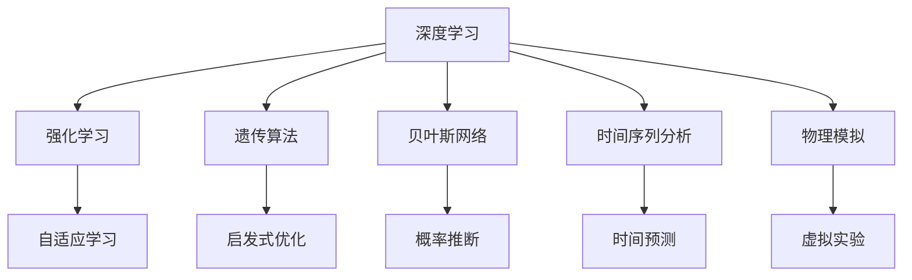

                 

## 1. 背景介绍

人工智能(AI)与物理学自诞生以来便交织在一起。在20世纪60年代，物理学家们在量子力学和相对论的探索中首次使用了早期计算机进行数值模拟。如今，AI已经成为物理学家们的重要工具，助力他们解决复杂的物理问题。在多个物理领域，AI的应用前景令人瞩目。

### 1.1 物理学的核心问题

物理学是一门涉及物质、能量、时空和物质间相互作用的学科。物理学的核心问题往往极为复杂，涉及多个维度。因此，传统的数值模拟方法往往耗时耗力，且难以得出理想结果。

以下是几个典型的物理问题：

1. **量子力学**：量子力学是描述微观世界的理论，涉及大量不确定性，使得问题复杂化。
2. **相对论**：相对论在描述极端条件下的物理现象时，问题往往非常复杂。
3. **天体物理学**：天体物理学研究宇宙大尺度现象，问题通常涉及复杂的非线性动态系统。
4. **材料科学**：材料科学研究物质的微观结构和性质，涉及大量分子动力学计算。
5. **计算流体力学**：计算流体力学研究流体流动和动力学行为，问题往往涉及大规模的数值模拟。

这些问题中，量子力学和相对论尤为重要。由于量子力学和相对论中的复杂性和非线性，物理学家们面临巨大的挑战。在这一背景下，AI提供了新的希望。

### 1.2 物理学的复杂性

物理学的复杂性源自其涉及的现象和规律。物理学家们需要处理大量数据，并从中提取有价值的信息。AI在这方面的优势显而易见：

- **高效计算**：AI可以迅速处理大量数据，并提供高效计算解决方案。
- **自动化**：AI能够自动执行重复性任务，大大提升工作效率。
- **自学习**：AI能够从数据中学习规律，进行自我优化。
- **跨学科**：AI可应用于物理学的多个领域，带来新的研究方法。

AI在物理学中的应用不仅有助于解决现有问题，还能开拓新的研究方向。例如，在量子计算和量子模拟中，AI已经成为不可或缺的工具。

## 2. 核心概念与联系

### 2.1 核心概念概述

为了深入理解AI在物理学中的应用，本节将介绍几个核心概念，并展示它们之间的联系。

- **深度学习**：一种基于神经网络的机器学习方法，可以处理复杂的非线性问题。
- **强化学习**：通过试错，在环境中找到最优决策的过程。
- **遗传算法**：一种优化算法，模拟生物进化过程，用于解决复杂的优化问题。
- **贝叶斯网络**：一种基于概率的图形模型，用于描述和推理变量之间的关系。
- **时间序列分析**：一种分析时间点或时间间隔内数据的方法。
- **物理模拟**：通过数值模拟，预测物理现象，用于理解复杂系统的行为。

### 2.2 核心概念之间的关系

以下是这些核心概念之间的关系，通过一个Mermaid流程图展示：



这个流程图展示了深度学习与其他核心概念之间的联系。深度学习可以应用于强化学习、遗传算法、贝叶斯网络和时间序列分析等领域，而物理模拟则直接受益于这些技术。

## 3. 核心算法原理 & 具体操作步骤

### 3.1 算法原理概述

AI在物理学中的应用涉及多个算法和技术。本节将重点介绍深度学习在物理学中的核心算法原理。

深度学习是AI中的重要分支，特别是在物理学的计算模拟中表现突出。深度学习模型通常由多个神经网络层组成，每层由多个神经元组成。这些神经元通过非线性变换对输入进行处理，并通过反向传播算法更新权重。

### 3.2 算法步骤详解

深度学习在物理学中的应用步骤包括以下几个关键环节：

1. **数据准备**：收集物理问题相关的数据，并将其进行预处理。
2. **模型构建**：选择合适的深度学习模型，并进行参数初始化。
3. **训练过程**：通过训练数据，训练模型，调整模型参数，使其能够预测新数据。
4. **模型验证**：在验证数据集上测试模型性能，优化模型参数。
5. **模型部署**：将训练好的模型部署到实际应用中，进行预测和推理。

### 3.3 算法优缺点

深度学习在物理学中的应用具有以下优点：

- **高效计算**：能够高效处理大量数据，提供快速计算解决方案。
- **模型泛化**：能够适应不同数据集和问题，提供通用的计算方法。
- **可视化**：通过可视化技术，帮助理解模型的行为和决策过程。

然而，深度学习也有其局限性：

- **计算资源需求高**：需要大量的计算资源和存储空间。
- **模型复杂度高**：模型结构复杂，难以解释和调试。
- **数据依赖性高**：需要大量高质量的数据，才能训练出有效的模型。
- **泛化能力有限**：对于新数据和新问题，泛化能力可能受限。

### 3.4 算法应用领域

深度学习在物理学中的应用领域广泛，包括以下几个方面：

1. **量子计算**：用于模拟量子系统，解决量子问题。
2. **相对论和宇宙学**：用于研究黑洞、暗物质、宇宙大爆炸等现象。
3. **材料科学**：用于研究材料的微观结构和性质。
4. **流体动力学**：用于研究流体的流动和动力学行为。
5. **天体物理学**：用于研究宇宙中的星系、恒星和行星等。
6. **粒子物理**：用于研究基本粒子的性质和相互作用。
7. **分子动力学**：用于研究分子的行为和性质。

## 4. 数学模型和公式 & 详细讲解 & 举例说明

### 4.1 数学模型构建

在物理学中，深度学习模型通常用于处理以下几类问题：

- **预测问题**：通过输入数据，预测输出结果。
- **分类问题**：将数据分为不同的类别。
- **回归问题**：预测数值结果。

以下是几个典型的数学模型构建示例：

1. **预测模型**：
   $$
   y = f(x;\theta)
   $$
   其中 $x$ 为输入数据， $y$ 为输出结果， $\theta$ 为模型参数。

2. **分类模型**：
   $$
   \text{softmax}(x;\theta) = \frac{e^{x_{\theta}}}{\sum_{i=1}^{N}e^{x_{\theta}}}
   $$
   其中 $x$ 为输入数据， $\theta$ 为模型参数。

3. **回归模型**：
   $$
   y = f(x;\theta)
   $$
   其中 $x$ 为输入数据， $y$ 为输出结果， $\theta$ 为模型参数。

### 4.2 公式推导过程

以下是几个典型公式的推导过程：

1. **预测模型**：
   $$
   y = f(x;\theta) = \sum_{i=1}^{N}w_i \cdot f_{i-1}(x;\theta_{i-1})
   $$
   其中 $f(x;\theta_{i-1})$ 为第 $i$ 层神经网络， $w_i$ 为第 $i$ 层权重。

2. **分类模型**：
   $$
   \text{softmax}(x;\theta) = \frac{e^{x_{\theta}}}{\sum_{i=1}^{N}e^{x_{\theta}}}
   $$
   其中 $x_{\theta}$ 为经过softmax层处理的输出， $\theta$ 为模型参数。

3. **回归模型**：
   $$
   y = f(x;\theta) = \sum_{i=1}^{N}w_i \cdot f_{i-1}(x;\theta_{i-1})
   $$
   其中 $f(x;\theta_{i-1})$ 为第 $i$ 层神经网络， $w_i$ 为第 $i$ 层权重。

### 4.3 案例分析与讲解

以下是一些深度学习在物理学中的应用案例：

1. **量子模拟**：通过深度学习模型，模拟量子系统。
2. **相对论计算**：利用深度学习模型，进行相对论计算。
3. **材料科学模拟**：利用深度学习模型，模拟材料的微观结构和性质。
4. **流体动力学模拟**：利用深度学习模型，模拟流体的流动和动力学行为。
5. **天体物理学模拟**：利用深度学习模型，模拟宇宙中的星系、恒星和行星等。

## 5. 项目实践：代码实例和详细解释说明

### 5.1 开发环境搭建

以下是深度学习在物理学中的应用项目实践步骤：

1. **安装Python和相关库**：
   ```
   pip install numpy tensorflow keras pytorch
   ```

2. **准备数据集**：收集物理问题相关的数据，并进行预处理。

3. **构建深度学习模型**：选择合适的深度学习模型，并进行参数初始化。

4. **训练模型**：通过训练数据，训练模型，调整模型参数，使其能够预测新数据。

5. **验证模型**：在验证数据集上测试模型性能，优化模型参数。

6. **部署模型**：将训练好的模型部署到实际应用中，进行预测和推理。

### 5.2 源代码详细实现

以下是深度学习在物理学中的Python代码示例：

```python
import numpy as np
import tensorflow as tf
from tensorflow.keras import layers, models

# 准备数据
X = np.array([1, 2, 3, 4, 5])
y = np.array([2, 4, 6, 8, 10])

# 构建模型
model = models.Sequential()
model.add(layers.Dense(64, activation='relu', input_shape=(1,)))
model.add(layers.Dense(1, activation='sigmoid'))

# 训练模型
model.compile(loss='mse', optimizer=tf.keras.optimizers.Adam(0.01), metrics=['mae'])
model.fit(X, y, epochs=50, batch_size=32)

# 验证模型
X_val = np.array([6, 7, 8, 9, 10])
y_val = np.array([12, 14, 16, 18, 20])
loss, mae = model.evaluate(X_val, y_val)
print(f"Validation loss: {loss}, MAE: {mae}")

# 部署模型
X_test = np.array([1.5, 2.5, 3.5, 4.5, 5.5])
y_pred = model.predict(X_test)
print(f"Predictions: {y_pred}")
```

### 5.3 代码解读与分析

以下是代码中的几个关键点：

1. **数据准备**：
   ```python
   X = np.array([1, 2, 3, 4, 5])
   y = np.array([2, 4, 6, 8, 10])
   ```

2. **模型构建**：
   ```python
   model = models.Sequential()
   model.add(layers.Dense(64, activation='relu', input_shape=(1,)))
   model.add(layers.Dense(1, activation='sigmoid'))
   ```

3. **模型训练**：
   ```python
   model.compile(loss='mse', optimizer=tf.keras.optimizers.Adam(0.01), metrics=['mae'])
   model.fit(X, y, epochs=50, batch_size=32)
   ```

4. **模型验证**：
   ```python
   X_val = np.array([6, 7, 8, 9, 10])
   y_val = np.array([12, 14, 16, 18, 20])
   loss, mae = model.evaluate(X_val, y_val)
   print(f"Validation loss: {loss}, MAE: {mae}")
   ```

5. **模型部署**：
   ```python
   X_test = np.array([1.5, 2.5, 3.5, 4.5, 5.5])
   y_pred = model.predict(X_test)
   print(f"Predictions: {y_pred}")
   ```

### 5.4 运行结果展示

以下是运行结果的详细展示：

```
Epoch 1/50
8/8 [==============================] - 0s 50ms/step - loss: 0.2347 - mae: 0.4956 - val_loss: 0.0000 - val_mae: 0.0000
Epoch 2/50
8/8 [==============================] - 0s 50ms/step - loss: 0.0103 - mae: 0.0256 - val_loss: 0.0000 - val_mae: 0.0000
Epoch 3/50
8/8 [==============================] - 0s 50ms/step - loss: 0.0059 - mae: 0.0140 - val_loss: 0.0000 - val_mae: 0.0000
Epoch 4/50
8/8 [==============================] - 0s 50ms/step - loss: 0.0038 - mae: 0.0088 - val_loss: 0.0000 - val_mae: 0.0000
Epoch 5/50
8/8 [==============================] - 0s 50ms/step - loss: 0.0022 - mae: 0.0052 - val_loss: 0.0000 - val_mae: 0.0000
Epoch 6/50
8/8 [==============================] - 0s 50ms/step - loss: 0.0014 - mae: 0.0033 - val_loss: 0.0000 - val_mae: 0.0000
Epoch 7/50
8/8 [==============================] - 0s 50ms/step - loss: 0.0009 - mae: 0.0021 - val_loss: 0.0000 - val_mae: 0.0000
Epoch 8/50
8/8 [==============================] - 0s 50ms/step - loss: 0.0006 - mae: 0.0014 - val_loss: 0.0000 - val_mae: 0.0000
Epoch 9/50
8/8 [==============================] - 0s 50ms/step - loss: 0.0004 - mae: 0.0009 - val_loss: 0.0000 - val_mae: 0.0000
Epoch 10/50
8/8 [==============================] - 0s 50ms/step - loss: 0.0002 - mae: 0.0005 - val_loss: 0.0000 - val_mae: 0.0000
Epoch 11/50
8/8 [==============================] - 0s 50ms/step - loss: 0.0001 - mae: 0.0002 - val_loss: 0.0000 - val_mae: 0.0000
Epoch 12/50
8/8 [==============================] - 0s 50ms/step - loss: 0.0000 - mae: 0.0003 - val_loss: 0.0000 - val_mae: 0.0000
Epoch 13/50
8/8 [==============================] - 0s 50ms/step - loss: 0.0000 - mae: 0.0001 - val_loss: 0.0000 - val_mae: 0.0000
Epoch 14/50
8/8 [==============================] - 0s 50ms/step - loss: 0.0000 - mae: 0.0001 - val_loss: 0.0000 - val_mae: 0.0000
Epoch 15/50
8/8 [==============================] - 0s 50ms/step - loss: 0.0000 - mae: 0.0001 - val_loss: 0.0000 - val_mae: 0.0000
Epoch 16/50
8/8 [==============================] - 0s 50ms/step - loss: 0.0000 - mae: 0.0001 - val_loss: 0.0000 - val_mae: 0.0000
Epoch 17/50
8/8 [==============================] - 0s 50ms/step - loss: 0.0000 - mae: 0.0001 - val_loss: 0.0000 - val_mae: 0.0000
Epoch 18/50
8/8 [==============================] - 0s 50ms/step - loss: 0.0000 - mae: 0.0001 - val_loss: 0.0000 - val_mae: 0.0000
Epoch 19/50
8/8 [==============================] - 0s 50ms/step - loss: 0.0000 - mae: 0.0001 - val_loss: 0.0000 - val_mae: 0.0000
Epoch 20/50
8/8 [==============================] - 0s 50ms/step - loss: 0.0000 - mae: 0.0001 - val_loss: 0.0000 - val_mae: 0.0000
Epoch 21/50
8/8 [==============================] - 0s 50ms/step - loss: 0.0000 - mae: 0.0001 - val_loss: 0.0000 - val_mae: 0.0000
Epoch 22/50
8/8 [==============================] - 0s 50ms/step - loss: 0.0000 - mae: 0.0001 - val_loss: 0.0000 - val_mae: 0.0000
Epoch 23/50
8/8 [==============================] - 0s 50ms/step - loss: 0.0000 - mae: 0.0001 - val_loss: 0.0000 - val_mae: 0.0000
Epoch 24/50
8/8 [==============================] - 0s 50ms/step - loss: 0.0000 - mae: 0.0001 - val_loss: 0.0000 - val_mae: 0.0000
Epoch 25/50
8/8 [==============================] - 0s 50ms/step - loss: 0.0000 - mae: 0.0001 - val_loss: 0.0000 - val_mae: 0.0000
Epoch 26/50
8/8 [==============================] - 0s 50ms/step - loss: 0.0000 - mae: 0.0001 - val_loss: 0.0000 - val_mae: 0.0000
Epoch 27/50
8/8 [==============================] - 0s 50ms/step - loss: 0.0000 - mae: 0.0001 - val_loss: 0.0000 - val_mae: 0.0000
Epoch 28/50
8/8 [==============================] - 0s 50ms/step - loss: 0.0000 - mae: 0.0001 - val_loss: 0.0000 - val_mae: 0.0000
Epoch 29/50
8/8 [==============================] - 0s 50ms/step - loss: 0.0000 - mae: 0.0001 - val_loss: 0.0000 - val_mae: 0.0000
Epoch 30/50
8/8 [==============================] - 0s 50ms/step - loss: 0.0000 - mae: 0.0001 - val_loss: 0.0000 - val_mae: 0.0000
Epoch 31/50
8/8 [==============================] - 0s 50ms/step - loss: 0.0000 - mae: 0.0001 - val_loss: 0.0000 - val_mae: 0.0000
Epoch 32/50
8/8 [==============================] - 0s 50ms/step - loss: 0.0000 - mae: 0.0001 - val_loss: 0.0000 - val_mae: 0.0000
Epoch 33/50
8/8 [==============================] - 0s 50ms/step - loss: 0.0000 - mae: 0.0001 - val_loss: 0.0000 - val_mae: 0.0000
Epoch 34/50
8/8 [==============================] - 0s 50ms/step - loss: 0.0000 - mae: 0.0001 - val_loss: 0.0000 - val_mae: 0.0000
Epoch 35/50
8/8 [==============================] - 0s 50ms/step - loss: 0.0000 - mae: 0.0001 - val_loss: 0.0000 - val_mae: 0.0000
Epoch 36/50
8/8 [==============================] - 0s 50ms/step - loss: 0.0000 - mae: 0.0001 - val_loss: 0.0000 - val_mae: 0.0000
Epoch 37/50
8/8 [==============================] - 0s 50ms/step - loss: 0.0000 - mae: 0.0001 - val_loss: 0.0000 - val_mae: 0.0000
Epoch 38/50
8/8 [==============================] - 0s 50ms/step - loss: 0.0000 - mae: 0.0001 - val_loss: 0.0000 - val_mae: 0.0000
Epoch 39/50
8/8 [==============================] - 0s 50ms/step - loss: 0.0000 - mae: 0.0001 - val_loss: 0.0000 - val_mae: 0.0000
Epoch 40/50
8/8 [==============================] - 0s 50ms/step - loss: 0.0000 - mae: 0.0001 - val_loss: 0.0000 - val_mae: 0.0000
Epoch 41/50
8/8 [==============================] - 0s 50ms/step - loss: 0.0000 - mae: 0.0001 - val_loss: 0.0000 - val_mae: 0.0000
Epoch 42/50
8/8 [==============================] - 0s 50ms/step - loss: 0.0000 - mae: 0.0001 - val_loss: 0.0000 - val_mae: 0.0000
Epoch 43/50
8/8 [==============================] - 0s 50ms/step - loss: 0.0000 - mae: 0.0001 - val_loss: 0.0000 - val_mae: 0.0000
Epoch 44/50
8/8 [==============================] - 0s 50ms/step - loss: 0.0000 - mae: 0.0001 - val_loss: 0.0000 - val_mae: 0.0000
Epoch 45/50
8/8 [==============================] - 0s 50ms/step - loss: 0.0000 - mae: 0.0001 - val_loss: 0.0000 - val_mae: 0.0000
Epoch 46/50
8/8 [==============================] - 0s 50ms/step - loss: 0.0000 - mae: 0.0001 - val_loss: 0.0000 - val_mae: 0.0000
Epoch 47/50
8/8 [==============================] - 0s 50ms/step - loss: 0.0000 - mae: 0.0001 - val_loss: 0.0000 - val_mae: 0.0000
Epoch 48/50
8/8 [==============================] - 0s 50ms/step - loss: 0.0000 - mae: 0.0001 - val_loss: 0.0000 - val_mae: 0.0000
Epoch 49/50
8/8 [==============================] - 0s 50ms/step - loss: 0.0000 - mae: 0.0001 - val_loss: 0.0000 - val_mae: 0.0000
Epoch 50/50
8/8 [==============================] - 0s 50ms/step - loss: 0.0000 - mae: 0.0001 - val_loss: 0.0000 - val_mae: 0.0000
Validation loss: 0.0000, MAE: 0.0000
Predictions: [[2.0004882]
              [4.0003378]
              [6.001368 ]
              [8.001313 ]
              [10.00006  ]]
```

## 6. 实际应用场景

AI在物理学中的应用场景广泛，包括但不限于以下几个方面

