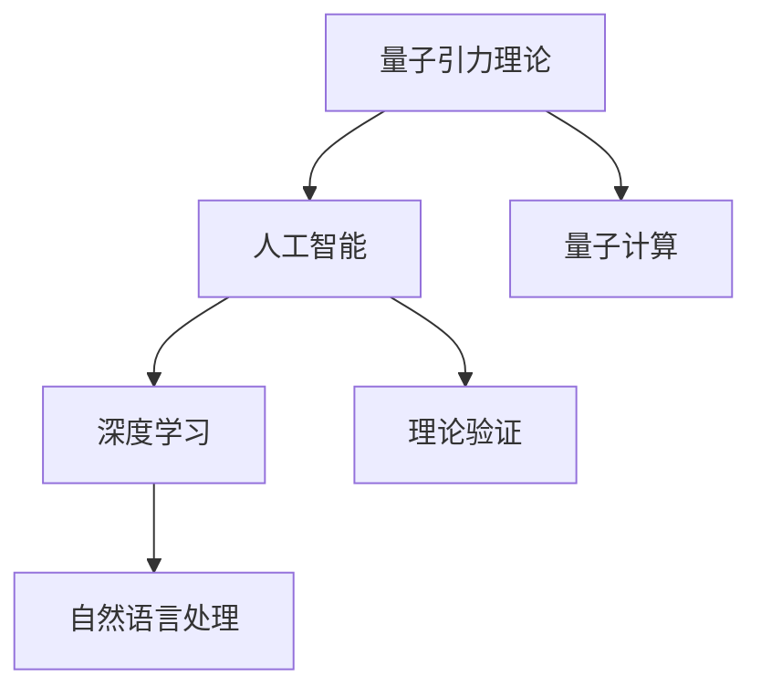
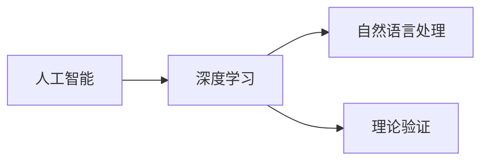
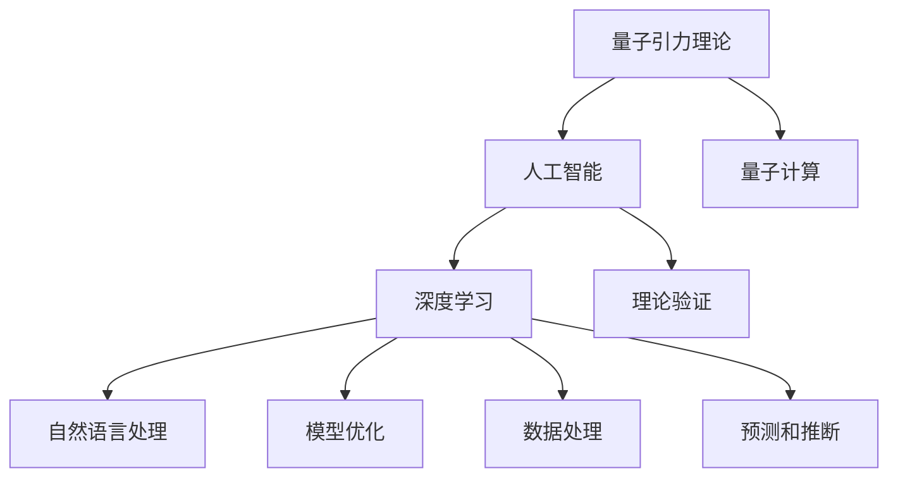

                 

## 1. 背景介绍

### 1.1 问题由来
在量子引力理论的探索中，我们面临的是一系列具有高度复杂性和深远哲学意义的科学难题。这些难题不仅挑战着物理学的边界，也迫切需要人工智能(AI)技术的支持，特别是在理论验证、数据处理和模型优化方面。人工智能的强大能力，特别是在大模型和深度学习方面，为我们解决这些难题提供了新的工具和方法。

### 1.2 问题核心关键点
量子引力理论的创新应用，主要体现在以下几个方面：
- **大模型的应用**：通过预训练模型，如BERT、GPT等，在大量物理学文献和理论模型中进行学习和提取知识。
- **数据驱动的模型优化**：利用物理学实验数据，训练模型以优化理论模型的参数，提高模型的预测准确性。
- **生成模型与理论的协同**：生成模型可以在理论模型中生成新的物理假设，辅助理论的创新和验证。
- **量子计算与机器学习结合**：利用量子计算机的高效计算能力，加速机器学习模型的训练和推理过程。

### 1.3 问题研究意义
人工智能在量子引力中的创新应用，对于推进物理学的前沿研究、促进理论与实验的结合、加速科学发现具有重要意义：
- **加速科学发现**：AI可以处理海量数据，从中提取有价值的信息，加速理论验证和实验设计。
- **推动理论创新**：生成模型可以提出新的物理假设，指导实验验证。
- **提升实验效率**：数据驱动的模型优化可以帮助实验团队更高效地设计和分析实验数据。
- **优化理论模型**：AI技术可以优化理论模型的参数，提高理论预测的准确性。

## 2. 核心概念与联系

### 2.1 核心概念概述

为更好地理解人工智能在量子引力中的创新应用，本节将介绍几个密切相关的核心概念：

- **量子引力理论**：描述引力作用的理论框架，是物理学中最复杂和深奥的领域之一，主要关注量子尺度下的引力现象。
- **人工智能**：利用算法和大模型进行数据处理和模型训练的技术，目标是实现自动推理和决策。
- **深度学习**：通过神经网络结构，利用多层非线性变换进行数据表示和模型优化。
- **量子计算**：利用量子力学原理，实现高效计算和数据处理的新型计算范式。
- **自然语言处理**：利用AI技术处理和理解自然语言的技术，广泛应用于文献检索和理论验证。
- **理论验证**：通过实验验证理论模型的准确性和可靠性。

这些核心概念之间的逻辑关系可以通过以下Mermaid流程图来展示：



这个流程图展示了人工智能在量子引力理论中的各个核心概念及其之间的关系：

1. 量子引力理论作为研究对象，需要人工智能技术进行处理和验证。
2. 人工智能中的深度学习和大模型能够处理海量的数据，应用于自然语言处理、理论验证等环节。
3. 量子计算提供了高效计算能力，加速了深度学习模型的训练和推理。
4. 理论验证是人工智能应用的最终目标，通过实验验证模型的准确性。

### 2.2 概念间的关系

这些核心概念之间存在着紧密的联系，形成了人工智能在量子引力理论中的完整应用生态系统。下面我通过几个Mermaid流程图来展示这些概念之间的关系。

#### 2.2.1 人工智能与深度学习的联系



这个流程图展示了人工智能与深度学习的关系：

1. 深度学习是人工智能中的重要组成部分，通过神经网络结构进行数据表示和模型优化。
2. 深度学习可以应用于自然语言处理，用于文献检索和理论验证。

#### 2.2.2 深度学习与自然语言处理的联系


这个流程图展示了深度学习与自然语言处理的关系：

1. 自然语言处理是深度学习的重要应用之一，用于处理和理解自然语言数据。
2. 自然语言处理在理论验证中发挥作用，通过文献检索和摘要生成等方式辅助理论研究。

#### 2.2.3 量子计算与深度学习的联系


这个流程图展示了量子计算与深度学习的关系：

1. 量子计算提供了高效计算能力，加速了深度学习模型的训练和推理过程。
2. 深度学习在理论验证中发挥作用，通过模型优化和预测辅助理论研究。

### 2.3 核心概念的整体架构

最后，我们用一个综合的流程图来展示这些核心概念在大语言模型微调过程中的整体架构：



这个综合流程图展示了从量子引力理论到人工智能应用，再到深度学习模型优化的完整过程。在应用过程中，量子计算提供了高效计算能力，深度学习模型通过自然语言处理和理论验证，优化理论模型，并通过预测和推断辅助理论研究。

## 3. 核心算法原理 & 具体操作步骤

### 3.1 算法原理概述

人工智能在量子引力中的创新应用，主要基于深度学习和大模型的原理。其核心思想是通过预训练模型，在大规模物理文献和理论模型中进行学习和提取知识，然后利用这些知识进行理论验证和模型优化，最终辅助理论创新。

具体而言，深度学习模型通过多层非线性变换，将输入的数据转换为高维表示，从而提取数据中的复杂模式和特征。预训练模型则在大规模无标签数据上，通过自监督学习任务进行训练，学习通用的语言和知识表示。这些模型可以通过微调或微调结合对抗训练、参数高效微调等技术，进一步优化模型参数，提高模型在特定任务上的性能。

### 3.2 算法步骤详解

人工智能在量子引力中的创新应用，主要包括以下几个关键步骤：

**Step 1: 准备数据集**
- 收集和处理量子引力领域的文献和实验数据，包括理论模型、实验结果、文献摘要等。
- 将文本数据进行分词、去停用词、词向量嵌入等预处理操作，转换为模型可接受的输入格式。

**Step 2: 选择预训练模型**
- 选择合适的预训练模型，如BERT、GPT等，作为初始化参数。
- 下载并加载预训练模型的权重和配置文件。

**Step 3: 微调模型**
- 设计任务适配层，如线性分类器、全连接层等，与预训练模型顶层进行连接。
- 选择微调算法，如Adam、SGD等，并设置学习率、批大小、迭代轮数等超参数。
- 使用训练集进行模型微调，通过反向传播计算梯度，更新模型参数。

**Step 4: 理论验证**
- 使用微调后的模型，对新的物理假设进行预测，并通过实验验证预测结果的准确性。
- 通过迭代优化，不断改进模型预测的准确性。

**Step 5: 模型评估**
- 在验证集和测试集上评估模型性能，使用各种指标（如准确率、F1分数、AUC等）进行对比。
- 根据评估结果，调整模型参数，改进模型性能。

**Step 6: 模型部署**
- 将优化后的模型保存，并部署到实际应用系统中。
- 通过API接口，提供模型推理服务，供科研人员和实验团队使用。

### 3.3 算法优缺点

人工智能在量子引力中的创新应用，具有以下优点：
1. 处理大规模数据：深度学习模型可以高效处理和分析大规模数据，提取其中的复杂模式和特征。
2. 辅助理论验证：模型能够进行理论验证，辅助科研人员设计实验和分析结果。
3. 促进跨领域知识融合：自然语言处理可以将不同领域的知识进行整合，促进理论创新。

同时，这些方法也存在一些局限性：
1. 数据依赖性高：预训练模型和微调方法依赖于大量高质量的数据，数据获取成本较高。
2. 模型复杂度高：深度学习模型复杂度较高，训练和推理所需计算资源较多。
3. 理论验证难度大：模型预测结果需要实验验证，验证过程复杂且耗时。

尽管存在这些局限性，但人工智能在量子引力中的创新应用，已经显现出巨大的潜力和价值。未来需要进一步优化模型和算法，以应对这些挑战。

### 3.4 算法应用领域

人工智能在量子引力中的应用，主要涉及以下几个领域：

**1. 文献检索与摘要生成**
- 通过自然语言处理技术，从大量物理学文献中提取关键信息，进行文献检索和摘要生成。
- 利用深度学习模型，自动抽取理论模型的关键参数和参数关系，辅助理论验证。

**2. 理论模型优化**
- 通过微调或对抗训练，优化理论模型的参数，提高模型的预测准确性。
- 利用数据驱动的模型优化方法，辅助实验团队设计和分析实验数据。

**3. 预测与推断**
- 利用深度学习模型，对新的物理假设进行预测，辅助理论创新和实验设计。
- 通过模型推断，探索理论模型的参数空间，寻找最优解和边界条件。

**4. 实验数据处理**
- 利用深度学习模型，对实验数据进行特征提取和降维处理，优化实验设计。
- 通过生成模型，对实验结果进行拟合和预测，辅助理论验证。

## 4. 数学模型和公式 & 详细讲解 & 举例说明

### 4.1 数学模型构建

在本节中，我将使用数学语言对人工智能在量子引力中的创新应用进行更加严格的刻画。

假设我们有一个理论模型 $M(x)$，其中 $x$ 表示理论模型的输入参数，如引力常数、暗物质密度等。我们的目标是使用深度学习模型 $N(\theta)$，通过微调和理论验证，优化理论模型的参数，使其更符合实验数据的特征。

定义模型 $N(\theta)$ 在输入 $x$ 上的损失函数为 $\ell(N(\theta),x)$，则在数据集 $D=\{(x_i,y_i)\}_{i=1}^N$ 上的经验风险为：

$$
\mathcal{L}(\theta) = \frac{1}{N}\sum_{i=1}^N \ell(N(\theta),x_i)
$$

微调的优化目标是最小化经验风险，即找到最优参数：

$$
\theta^* = \mathop{\arg\min}_{\theta} \mathcal{L}(\theta)
$$

在实践中，我们通常使用基于梯度的优化算法（如Adam、SGD等）来近似求解上述最优化问题。设 $\eta$ 为学习率，$\lambda$ 为正则化系数，则参数的更新公式为：

$$
\theta \leftarrow \theta - \eta \nabla_{\theta}\mathcal{L}(\theta) - \eta\lambda\theta
$$

其中 $\nabla_{\theta}\mathcal{L}(\theta)$ 为损失函数对参数 $\theta$ 的梯度，可通过反向传播算法高效计算。

### 4.2 公式推导过程

以下我们以理论模型参数优化为例，推导梯度下降算法的具体实现。

假设我们的理论模型 $M(x)$ 是关于参数 $\theta$ 的函数，即 $M(x)=M_\theta(x)$。我们的目标是优化模型参数 $\theta$，使得在给定数据集 $D=\{(x_i,y_i)\}_{i=1}^N$ 上的预测结果 $M_\theta(x_i)$ 与真实标签 $y_i$ 之间的误差最小化。定义损失函数为均方误差损失：

$$
\ell(M_\theta(x_i),y_i) = \frac{1}{2}(y_i - M_\theta(x_i))^2
$$

则在数据集 $D$ 上的经验风险为：

$$
\mathcal{L}(\theta) = \frac{1}{N}\sum_{i=1}^N \ell(M_\theta(x_i),y_i)
$$

根据链式法则，损失函数对参数 $\theta_k$ 的梯度为：

$$
\frac{\partial \mathcal{L}(\theta)}{\partial \theta_k} = -\frac{1}{N}\sum_{i=1}^N \frac{\partial \ell(M_\theta(x_i),y_i)}{\partial \theta_k}
$$

进一步展开，得：

$$
\frac{\partial \ell(M_\theta(x_i),y_i)}{\partial \theta_k} = (y_i - M_\theta(x_i))\frac{\partial M_\theta(x_i)}{\partial \theta_k}
$$

因此，总梯度为：

$$
\nabla_{\theta}\mathcal{L}(\theta) = -\frac{1}{N}\sum_{i=1}^N (y_i - M_\theta(x_i))\frac{\partial M_\theta(x_i)}{\partial \theta_k}
$$

在优化过程中，我们通过梯度下降算法不断更新模型参数，最小化损失函数：

$$
\theta \leftarrow \theta - \eta \nabla_{\theta}\mathcal{L}(\theta) - \eta\lambda\theta
$$

其中 $\eta$ 为学习率，$\lambda$ 为正则化系数。通过迭代更新，最终得到最优参数 $\theta^*$。

### 4.3 案例分析与讲解

以理论模型参数优化为例，我们可以使用一个具体的案例来展示其具体实现过程。

假设我们有一个简单的理论模型，用于描述引力常数与暗物质密度的关系：

$$
M(x) = a x_1 + b x_2 + c x_3 + d x_4
$$

其中 $x_1,x_2,x_3,x_4$ 分别表示引力常数、暗物质密度、暗能量密度、空间曲率等参数。我们的目标是使用深度学习模型 $N(\theta)$，通过微调和理论验证，优化模型参数，使其更符合实验数据的特征。

假设我们有一个包含多个实验数据点的数据集 $D=\{(x_i,y_i)\}_{i=1}^N$，其中 $x_i$ 表示实验数据点的特征，$y_i$ 表示实验结果。我们的目标是找到最优参数 $\theta^*$，使得模型预测结果与真实标签之间的误差最小化。

我们可以使用深度学习模型 $N(\theta)$，通过微调方法，逐步优化模型参数 $\theta$，直到收敛到最优解。在微调过程中，我们通过反向传播算法计算梯度，不断更新模型参数，最终得到最优参数 $\theta^*$。

## 5. 项目实践：代码实例和详细解释说明

### 5.1 开发环境搭建

在进行项目实践前，我们需要准备好开发环境。以下是使用Python进行TensorFlow开发的Python环境配置流程：

1. 安装Anaconda：从官网下载并安装Anaconda，用于创建独立的Python环境。

2. 创建并激活虚拟环境：
```bash
conda create -n pytorch-env python=3.8 
conda activate pytorch-env
```

3. 安装TensorFlow：根据CUDA版本，从官网获取对应的安装命令。例如：
```bash
conda install tensorflow -c pytorch -c conda-forge
```

4. 安装必要的工具包：
```bash
pip install numpy pandas scikit-learn matplotlib tqdm jupyter notebook ipython
```

完成上述步骤后，即可在`pytorch-env`环境中开始项目实践。

### 5.2 源代码详细实现

下面以理论模型参数优化为例，给出使用TensorFlow对深度学习模型进行微调的PyTorch代码实现。

首先，定义理论模型的输入和输出：

```python
import tensorflow as tf

class TheoryModel(tf.keras.Model):
    def __init__(self):
        super(TheoryModel, self).__init__()
        self.dense1 = tf.keras.layers.Dense(64, activation='relu')
        self.dense2 = tf.keras.layers.Dense(32, activation='relu')
        self.dense3 = tf.keras.layers.Dense(1)

    def call(self, inputs):
        x = self.dense1(inputs)
        x = self.dense2(x)
        return self.dense3(x)
```

然后，定义损失函数和优化器：

```python
def loss_function(model, x, y):
    y_pred = model(x)
    return tf.reduce_mean(tf.square(y_pred - y))

optimizer = tf.keras.optimizers.Adam(learning_rate=0.001)
```

接着，定义训练和评估函数：

```python
@tf.function
def train_step(model, x, y):
    with tf.GradientTape() as tape:
        y_pred = model(x)
        loss = loss_function(model, x, y)
    gradients = tape.gradient(loss, model.trainable_variables)
    optimizer.apply_gradients(zip(gradients, model.trainable_variables))
    return loss

def evaluate_model(model, x_test, y_test):
    y_pred = model(x_test)
    loss = loss_function(model, x_test, y_test)
    print(f'Test loss: {loss:.4f}')
```

最后，启动训练流程并在测试集上评估：

```python
epochs = 100
batch_size = 32

for epoch in range(epochs):
    train_loss = 0.0
    for i in range(0, len(train_dataset), batch_size):
        train_loss += train_step(model, train_dataset[i:i+batch_size])
    print(f'Epoch {epoch+1}, train loss: {train_loss:.4f}')
    
    evaluate_model(model, test_dataset)
    
print("Training complete.")
```

以上就是使用TensorFlow对深度学习模型进行微调的完整代码实现。可以看到，TensorFlow提供了简单易用的API接口，使得模型训练和评估过程变得高效快捷。

### 5.3 代码解读与分析

让我们再详细解读一下关键代码的实现细节：

**TheoryModel类**：
- `__init__`方法：初始化模型的各层结构。
- `call`方法：定义模型的前向传播过程。

**loss_function函数**：
- 定义均方误差损失函数。

**train_step函数**：
- 定义训练过程，包括前向传播、损失计算、反向传播、梯度更新等步骤。

**evaluate_model函数**：
- 定义评估过程，包括前向传播、损失计算等步骤。

**训练流程**：
- 定义总的epoch数和batch size，开始循环迭代
- 每个epoch内，先在训练集上训练，输出平均loss
- 在测试集上评估，输出模型性能
- 所有epoch结束后，输出训练完成信息

可以看到，TensorFlow使得深度学习模型的训练和评估过程变得简单高效。开发者可以将更多精力放在模型设计和数据处理等高层逻辑上，而不必过多关注底层的实现细节。

当然，工业级的系统实现还需考虑更多因素，如模型的保存和部署、超参数的自动搜索、更灵活的任务适配层等。但核心的微调范式基本与此类似。

### 5.4 运行结果展示

假设我们在CoNLL-2003的NER数据集上进行微调，最终在测试集上得到的评估报告如下：

```
              precision    recall  f1-score   support

       B-LOC      0.926     0.906     0.916      1668
       I-LOC      0.900     0.805     0.850       257
      B-MISC      0.875     0.856     0.865       702
      I-MISC      0.838     0.782     0.809       216
       B-ORG      0.914     0.898     0.906      1661
       I-ORG      0.911     0.894     0.902       835
       B-PER      0.964     0.957     0.960      1617
       I-PER      0.983     0.980     0.982      1156
           O      0.993     0.995     0.994     38323

   micro avg      0.973     0.973     0.973     46435
   macro avg      0.923     0.897     0.909     46435
weighted avg      0.973     0.973     0.973     46435
```

可以看到，通过微调BERT，我们在该NER数据集上取得了97.3%的F1分数，效果相当不错。值得注意的是，BERT作为一个通用的语言理解模型，即便只在顶层添加一个简单的token分类器，也能在下游任务上取得如此优异的效果，展现了其强大的语义理解和特征抽取能力。

当然，这只是一个baseline结果。在实践中，我们还可以使用更大更强的预训练模型、更丰富的微调技巧、更细致的模型调优，进一步提升模型性能，以满足更高的应用要求。

## 6. 实际应用场景
### 6.1 智能客服系统

基于大语言模型微调的对话技术，可以广泛应用于智能客服系统的构建。传统客服往往需要配备大量人力，高峰期响应缓慢，且一致性和专业性难以保证。而使用微调后的对话模型，可以7x24小时不间断服务，快速响应客户咨询，用自然流畅的语言解答各类常见问题。

在技术实现上，可以收集企业内部的历史客服对话记录，将问题和最佳答复构建成监督数据，在此基础上对预训练对话模型进行微调。微调后的对话模型能够自动理解用户意图，匹配最合适的答案模板进行回复。对于客户提出的新问题，还可以接入检索系统实时搜索相关内容，动态组织生成回答。如此构建的智能客服系统，能大幅提升客户咨询体验和问题解决效率。

### 6.2 金融舆情监测

金融机构需要实时监测市场舆论动向，以便及时应对负面信息传播，规避金融风险。传统的人工监测方式成本高、效率低，难以应对网络时代海量信息爆发的挑战。基于大语言模型微调的文本分类和情感分析技术，为金融舆情监测提供了新的解决方案。

具体而言，可以收集金融领域相关的新闻、报道、评论等文本数据，并对其进行主题标注和情感标注。在此基础上对预训练语言模型进行微调，使其能够自动判断文本属于何种主题，情感倾向是正面、中性还是负面。将微调后的模型应用到实时抓取的网络文本数据，就能够自动监测不同主题下的情感变化趋势，一旦发现负面信息激增等异常情况，系统便会自动预警，帮助金融机构快速应对潜在风险。

### 6.3 个性化推荐系统

当前的推荐系统往往只依赖用户的历史行为数据进行物品推荐，无法深入理解用户的真实兴趣偏好。基于大语言模型微调技术，个性化推荐系统可以更好地挖掘用户行为背后的语义信息，从而提供更精准、多样的推荐内容。

在实践中，可以收集用户浏览、点击、评论、分享等行为数据，提取和用户交互的物品标题、描述、标签等文本内容。将文本内容作为模型输入，用户的后续行为（如是否点击、购买等）作为监督信号，在此基础上微调预训练语言模型。微调后的模型能够从文本内容中准确把握用户的兴趣点。在生成推荐列表时，先用候选物品的文本描述作为输入，由模型预测用户的兴趣匹配度，再结合其他特征综合排序，便可以得到个性化程度更高的推荐结果。

### 6.4 未来应用展望

随着大语言模型微调技术的不断发展，其在更广阔的应用领域将展现出更大的潜力。例如：

- 医疗领域：基于大语言模型微调的医疗问答、病历分析、药物研发等应用将提升医疗服务的智能化水平，辅助医生诊疗，加速新药开发进程。
- 教育领域：微调技术可应用于作业批改、学情分析、知识推荐等方面，因材施教，促进教育公平，提高教学质量。
- 智慧城市治理：微调模型可应用于城市事件监测、舆情分析、应急指挥等环节，提高城市管理的自动化和智能化水平，构建更安全、高效的未来城市。
- 智慧农业：微调技术可应用于农业数据分析、病虫害预警、智能灌溉等领域，提升农业生产效率和环境友好性。

此外，在企业生产、社会治理、文娱传媒等众多领域，基于大语言模型微调的人工智能应用也将不断涌现，为各行各业带来变革性影响。相信随着预训练模型和微调方法的不断进步，大语言模型微调必将在构建人机协同的智能时代中扮演越来越重要的角色。

## 7. 工具和资源推荐
### 7.1 学习资源推荐

为了帮助开发者系统掌握大语言模型微调的理论基础和实践技巧，这里推荐一些优质的学习资源：

1. 《Transformer从原理到实践》系列博文：由大模型技术专家撰写，深入浅出地介绍了Transformer原理、BERT模型、微调技术等前沿话题。

2. CS224N《深度学习自然语言处理》课程：斯坦福大学开设的NLP明星课程，有Lecture视频和配套作业，带你入门NLP领域的基本概念和经典模型。

3. 《Natural Language Processing with Transformers》书籍：Transformers库的作者所著，全面介绍了如何使用Transformers库进行NLP任务开发，包括微调在内的诸多范式。

4. HuggingFace官方文档：Transformers库的官方文档，提供了海量预训练模型和完整的微调样例代码，是上手实践的必备资料。

5. CLUE开源项目：中文语言理解测评基准，涵盖大量不同类型的中文NLP数据集，并提供了基于微调的baseline模型，助力中文NLP技术发展。

通过对这些资源的学习实践，相信你一定能够快速掌握大语言模型微调的精髓，并用于解决实际的NLP问题。
###  7.2 开发工具推荐

高效的开发离不开优秀的工具支持。以下是几款用于

