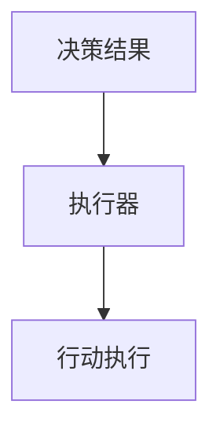

                 

# AI Agent 行动 Action 为进一步感知提供了观察的前提和基础，形成一个自主的闭环学习过程

## 1. 背景介绍

### 1.1 问题由来
在人工智能（AI）领域，Agent行动（Action）是智能体进行决策和执行的关键要素。一个智能体（如智能机器人、自动驾驶车辆等）的行动需要基于对环境的感知和理解，并作出最优化的决策。然而，传统AI系统中，智能体的感知和行动往往缺乏有效的闭环反馈机制，导致决策过程难以达到最优。近年来，随着强化学习（Reinforcement Learning, RL）和模型基强化学习（Model-based Reinforcement Learning, MBRL）的发展，AI Agent的行动更加自主和高效，能够在复杂环境中不断学习和适应。

### 1.2 问题核心关键点
Agent行动的核心在于如何通过感知和决策形成一个闭环学习过程。这个过程包括：

- 观察（Perception）：智能体通过传感器收集环境信息。
- 决策（Decision）：智能体基于观察到的信息，利用模型或策略选择最佳行动。
- 执行（Execution）：智能体在环境中执行所选择的行动。
- 反馈（Feedback）：智能体根据执行结果接收环境反馈，更新感知和决策模型。

这个闭环学习过程需要智能体具备对环境的全面感知能力，以及高效的决策和执行机制。通过持续的学习和适应，智能体能够逐步提升其在复杂环境中的表现。

### 1.3 问题研究意义
研究Agent行动的闭环学习过程，对于提升AI系统在复杂环境中的自主性和适应性，具有重要意义：

- 降低人工干预：通过闭环学习，智能体能够自主优化决策过程，减少人工干预和干预成本。
- 提升系统鲁棒性：智能体能够在实际应用中不断学习和适应，增强系统的稳定性和鲁棒性。
- 加速创新迭代：智能体通过闭环学习，快速迭代改进，提升系统的智能化水平。
- 应用场景广泛：Agent行动的闭环学习过程可以应用于自动驾驶、机器人导航、智能推荐等多个领域，推动AI技术落地应用。

## 2. 核心概念与联系

### 2.1 核心概念概述

为更好地理解Agent行动的闭环学习过程，本节将介绍几个密切相关的核心概念：

- 强化学习（RL）：通过智能体与环境的交互，利用奖励信号指导智能体选择最佳行动，优化决策策略的过程。
- 模型基强化学习（MBRL）：在RL基础上，加入环境模型，通过对模型进行学习，进一步提升决策策略的泛化能力和稳定性。
- 感知模块（Perception Module）：智能体通过传感器和算法获取环境信息的过程。
- 决策模块（Decision Module）：智能体根据感知结果，选择最佳行动的过程。
- 执行模块（Execution Module）：智能体在环境中执行所选择的行动。
- 反馈模块（Feedback Module）：智能体根据执行结果接收环境反馈，更新感知和决策模型的过程。

这些核心概念之间的逻辑关系可以通过以下Mermaid流程图来展示：

```mermaid
graph TB
    A[观察 (Perception)] --> B[决策 (Decision)]
    B --> C[执行 (Execution)]
    C --> D[反馈 (Feedback)]
    D --> E[感知 (Perception) 更新]
    E --> F[决策 (Decision) 更新]
```

这个流程图展示了Agent行动闭环学习过程的核心组成：智能体通过感知获取环境信息，并在此基础上做出决策，执行行动。在执行过程中，智能体根据环境反馈更新感知和决策模型，形成一个闭环学习过程。

### 2.2 概念间的关系

这些核心概念之间存在着紧密的联系，形成了AI Agent行动的完整生态系统。下面我们通过几个Mermaid流程图来展示这些概念之间的关系。

#### 2.2.1 强化学习的闭环学习范式

```mermaid
graph LR
    A[智能体] --> B[环境]
    A --> C[观察 (Perception)]
    C --> A[决策 (Decision)]
    A --> D[执行 (Execution)]
    D --> B[反馈 (Feedback)]
    B --> E[感知 (Perception) 更新]
    E --> C
    C --> F[决策 (Decision) 更新]
```

这个流程图展示了强化学习的闭环学习过程，即智能体通过观察环境、做出决策、执行行动、接收反馈，形成闭环。

#### 2.2.2 感知模块的实现

```mermaid
graph TB
    A[传感器] --> B[数据采集]
    B --> C[预处理]
    C --> D[特征提取]
    D --> E[环境表示]
    E --> F[感知 (Perception) 输出]
```

这个流程图展示了感知模块的实现过程，即通过传感器获取数据，预处理和特征提取，形成环境表示，最终输出感知结果。

#### 2.2.3 决策模块的实现

```mermaid
graph TB
    A[感知结果] --> B[决策模型]
    B --> C[行动选择]
    C --> D[决策 (Decision) 输出]
```

这个流程图展示了决策模块的实现过程，即基于感知结果，通过决策模型选择最佳行动。

#### 2.2.4 执行模块的实现



这个流程图展示了执行模块的实现过程，即根据决策结果，通过执行器执行所选择的行动。

#### 2.2.5 反馈模块的实现

```mermaid
graph LR
    A[行动执行结果] --> B[环境响应]
    B --> C[反馈信号]
    C --> D[感知 (Perception) 更新]
    D --> E[决策 (Decision) 更新]
```

这个流程图展示了反馈模块的实现过程，即智能体根据执行结果接收环境反馈，更新感知和决策模型。

### 2.3 核心概念的整体架构

最后，我们用一个综合的流程图来展示这些核心概念在AI Agent行动闭环学习过程中的整体架构：

```mermaid
graph TB
    A[智能体] --> B[环境]
    B --> C[感知 (Perception) 输入]
    C --> D[数据采集]
    D --> E[预处理]
    E --> F[特征提取]
    F --> G[环境表示]
    G --> H[决策 (Decision) 输入]
    H --> I[决策模型]
    I --> J[行动选择]
    J --> K[执行 (Execution) 输入]
    K --> L[执行器]
    L --> M[行动执行]
    M --> N[环境响应]
    N --> O[反馈信号]
    O --> P[感知 (Perception) 更新]
    P --> Q[决策 (Decision) 更新]
    Q --> R[执行 (Execution) 更新]
```

这个综合流程图展示了从感知到决策，再到执行和反馈的完整闭环学习过程。智能体通过感知获取环境信息，根据感知结果选择最佳行动，并在执行过程中接收环境反馈，更新感知和决策模型。

## 3. 核心算法原理 & 具体操作步骤
### 3.1 算法原理概述

Agent行动的闭环学习过程，本质上是一个强化学习的过程。其核心思想是：智能体通过与环境的交互，利用奖励信号指导行动选择，优化决策策略。

形式化地，假设智能体在环境中的状态空间为 $S$，动作空间为 $A$，奖励函数为 $r:S\times A \rightarrow \mathbb{R}$。智能体的行动策略为 $\pi:S \rightarrow A$，策略的期望奖励为 $J(\pi)=\mathbb{E}[\sum_{t=0}^{\infty} \gamma^t r(s_t,a_t)]$，其中 $\gamma$ 为折扣因子。

强化学习的目标是最小化策略的期望奖励差，即：

$$
\pi^* = \mathop{\arg\min}_{\pi} J(\pi)
$$

在实践中，我们通常使用基于梯度的优化算法（如REINFORCE、SAC等）来近似求解上述最优化问题。设 $\theta$ 为策略的参数，则参数的更新公式为：

$$
\theta \leftarrow \theta + \eta \nabla_{\theta}J(\pi_\theta)
$$

其中 $\eta$ 为学习率，$\nabla_{\theta}J(\pi_\theta)$ 为策略的梯度，可通过蒙特卡罗方法、梯度上升方法等高效计算。

### 3.2 算法步骤详解

Agent行动的闭环学习过程，一般包括以下几个关键步骤：

**Step 1: 准备环境与策略**
- 选择合适的环境 $E$ 作为智能体行动的模拟平台。
- 设计策略 $\pi$，如线性回归、深度神经网络等，用于从感知结果映射到行动选择。

**Step 2: 感知和决策**
- 智能体通过传感器获取环境数据，进行预处理和特征提取，形成环境表示。
- 根据感知结果，利用策略模型选择最佳行动。

**Step 3: 执行和反馈**
- 智能体在环境中执行所选择的行动，接收环境反馈。
- 根据执行结果，利用反馈模块更新感知和决策模型。

**Step 4: 参数更新**
- 利用基于梯度的优化算法，更新策略参数，使智能体不断优化决策策略。

**Step 5: 循环迭代**
- 重复步骤2-4，直到智能体达到预设的收敛条件。

以上是基于强化学习的Agent行动闭环学习过程的一般流程。在实际应用中，还需要针对具体任务，对感知、决策、执行等环节进行优化设计，如引入模型基强化学习、参数高效微调、对抗训练等，以进一步提升智能体的性能和鲁棒性。

### 3.3 算法优缺点

Agent行动的闭环学习过程，具有以下优点：

1. 自主优化：智能体能够自主学习和优化决策策略，减少人工干预。
2. 泛化能力强：基于模型基强化学习，智能体能够学习到环境的通用表示，提升决策策略的泛化能力。
3. 鲁棒性强：通过闭环反馈，智能体能够在复杂环境中不断适应和调整，提高系统的稳定性和鲁棒性。

同时，该方法也存在以下局限性：

1. 计算复杂度高：强化学习通常需要大量的样本和计算资源，特别是在模型基强化学习中，需要学习环境模型，增加了计算复杂度。
2. 策略不稳定：在样本不足的情况下，策略的优化过程容易陷入局部最优，难以达到全局最优。
3. 模型参数量大：大模型往往包含大量的参数，导致训练和推理过程资源占用大。
4. 环境不确定性：实际环境中的不确定性和复杂性，使得智能体的决策策略难以完全适应。

尽管存在这些局限性，但就目前而言，基于强化学习的Agent行动闭环学习方法是实现AI系统自主性和适应性的重要手段。未来相关研究的重点在于如何进一步降低计算复杂度，提高策略稳定性和鲁棒性，减少模型参数量，以及更好地处理环境不确定性。

### 3.4 算法应用领域

Agent行动的闭环学习过程，已经在多个领域得到了应用，包括但不限于：

- 自动驾驶：利用环境感知和决策模型，智能车能够在复杂道路环境中自主导航。
- 机器人导航：通过感知环境、决策路径、执行动作，智能机器人能够在未知环境中自主导航。
- 智能推荐：利用用户行为数据，智能推荐系统能够动态调整推荐策略，提升用户体验。
- 智能客服：基于用户对话历史和行为数据，智能客服能够自主学习和优化对话策略，提升服务质量。
- 游戏AI：在复杂游戏环境中，利用强化学习，游戏AI能够自主学习和优化游戏策略，提升游戏性能。

除了上述这些经典应用外，Agent行动的闭环学习过程还被创新性地应用到更多场景中，如智能物流、智能家居、智能医疗等，为各行业带来了新的智能化解决方案。

## 4. 数学模型和公式 & 详细讲解 & 举例说明
### 4.1 数学模型构建

本节将使用数学语言对Agent行动的闭环学习过程进行更加严格的刻画。

假设智能体在环境中的状态空间为 $S$，动作空间为 $A$，奖励函数为 $r:S\times A \rightarrow \mathbb{R}$。智能体的行动策略为 $\pi:S \rightarrow A$，策略的期望奖励为 $J(\pi)=\mathbb{E}[\sum_{t=0}^{\infty} \gamma^t r(s_t,a_t)]$，其中 $\gamma$ 为折扣因子。

在实践中，我们通常使用基于梯度的优化算法（如REINFORCE、SAC等）来近似求解上述最优化问题。设 $\theta$ 为策略的参数，则参数的更新公式为：

$$
\theta \leftarrow \theta + \eta \nabla_{\theta}J(\pi_\theta)
$$

其中 $\eta$ 为学习率，$\nabla_{\theta}J(\pi_\theta)$ 为策略的梯度，可通过蒙特卡罗方法、梯度上升方法等高效计算。

### 4.2 公式推导过程

以下我们以连续状态和动作空间的Reinforcement Learning为例，推导策略梯度的计算公式。

假设智能体在状态 $s_t$ 时采取行动 $a_t$，根据奖励函数 $r(s_t,a_t)$ 接收奖励 $r_t$。则智能体的状态转移概率为 $P(s_{t+1}|s_t,a_t)$，状态-行动值函数为 $V^{\pi}(s)$，策略为 $\pi(a|s)$。

定义智能体在状态 $s_t$ 时采取行动 $a_t$ 的累积奖励为 $G_t=\sum_{k=t}^{\infty} \gamma^k r(s_k,a_k)$。则策略的期望奖励为：

$$
J(\pi)=\mathbb{E}_{s\sim p_{\pi}}\left[\sum_{t=0}^{\infty} \gamma^t r(s_t,a_t)\right]
$$

其中 $p_{\pi}(s)$ 为智能体在状态 $s$ 下的状态分布。

根据蒙特卡罗方法，可以近似计算策略的梯度：

$$
\nabla_{\theta}J(\pi_\theta) = \frac{1}{N}\sum_{i=1}^N \nabla_{\theta}G_{t_i}
$$

其中 $G_{t_i}$ 为第 $i$ 次蒙特卡罗遍历的累积奖励。

在实践中，通常使用时间差分学习（TD Learning）或动态规划（DP）方法来计算策略梯度，从而实现参数的更新。这些方法利用已知的奖励和状态转移概率，高效地计算策略梯度。

### 4.3 案例分析与讲解

以Reinforcement Learning在自动驾驶中的应用为例，我们分析其闭环学习过程：

假设智能车在道路上行驶，其状态 $s_t$ 包括当前位置、速度、角度等，动作 $a_t$ 包括加速、减速、转向等。智能车的状态转移概率 $P(s_{t+1}|s_t,a_t)$ 取决于当前状态和行动，以及环境的不确定性。智能车的奖励函数 $r(s_t,a_t)$ 可以根据行驶的安全性和效率来定义。

智能车通过感知模块获取道路信息，如车距、车速、行人等，进行预处理和特征提取。然后，利用策略模型 $\pi(a|s)$ 选择最佳行动，执行加速、减速、转向等操作。在执行过程中，智能车根据环境反馈，如碰撞、事故等，接收奖励信号。智能车根据接收到的奖励，利用反馈模块更新感知和策略模型。

具体而言，智能车的感知模块可以通过摄像头、雷达等传感器获取道路信息，进行数据采集和预处理。然后，利用卷积神经网络（CNN）等模型对数据进行特征提取，形成环境表示。智能车的决策模块可以利用深度神经网络等模型，从环境表示映射到行动选择。智能车的执行模块可以利用电控系统等，执行加速、减速、转向等操作。智能车的反馈模块可以利用碰撞检测等技术，接收环境反馈，更新感知和决策模型。

智能车通过持续的闭环学习过程，能够在复杂道路上自主导航，提升行驶安全性和效率。在实际应用中，还需要根据具体环境，优化感知、决策、执行等环节，提高系统的可靠性和鲁棒性。

## 5. 项目实践：代码实例和详细解释说明
### 5.1 开发环境搭建

在进行Agent行动闭环学习实践前，我们需要准备好开发环境。以下是使用Python进行PyTorch开发的环境配置流程：

1. 安装Anaconda：从官网下载并安装Anaconda，用于创建独立的Python环境。

2. 创建并激活虚拟环境：
```bash
conda create -n pytorch-env python=3.8 
conda activate pytorch-env
```

3. 安装PyTorch：根据CUDA版本，从官网获取对应的安装命令。例如：
```bash
conda install pytorch torchvision torchaudio cudatoolkit=11.1 -c pytorch -c conda-forge
```

4. 安装Transformers库：
```bash
pip install transformers
```

5. 安装各类工具包：
```bash
pip install numpy pandas scikit-learn matplotlib tqdm jupyter notebook ipython
```

完成上述步骤后，即可在`pytorch-env`环境中开始Agent行动闭环学习的实践。

### 5.2 源代码详细实现

下面我们以Reinforcement Learning在自动驾驶中的应用为例，给出使用PyTorch实现Agent行动闭环学习的PyTorch代码实现。

首先，定义状态和动作空间：

```python
import torch
import torch.nn as nn
import torch.optim as optim

# 定义状态和动作空间
state_dim = 4
action_dim = 3

# 定义策略模型
class Policy(nn.Module):
    def __init__(self, state_dim, action_dim):
        super(Policy, self).__init__()
        self.linear = nn.Linear(state_dim, action_dim)

    def forward(self, x):
        return self.linear(x)

# 定义奖励函数
class Reward(nn.Module):
    def __init__(self):
        super(Reward, self).__init__()

    def forward(self, state, action):
        # 定义奖励函数，这里假设为简单的线性奖励函数
        return state[0] * action[0] + state[1] * action[1] - 0.1 * action[2]**2
```

然后，定义智能体的观察和决策模块：

```python
# 定义观察模块
class Observation(nn.Module):
    def __init__(self, state_dim):
        super(Observation, self).__init__()
        self.linear = nn.Linear(state_dim, state_dim)

    def forward(self, x):
        return self.linear(x)

# 定义决策模块
class Decision(nn.Module):
    def __init__(self, state_dim, action_dim):
        super(Decision, self).__init__()
        self.linear = nn.Linear(state_dim, action_dim)

    def forward(self, x):
        return self.linear(x)
```

接着，定义智能体的执行和反馈模块：

```python
# 定义执行模块
class Execution(nn.Module):
    def __init__(self, action_dim):
        super(Execution, self).__init__()
        self.linear = nn.Linear(action_dim, 1)

    def forward(self, x):
        return self.linear(x)

# 定义反馈模块
class Feedback(nn.Module):
    def __init__(self):
        super(Feedback, self).__init__()

    def forward(self, reward):
        # 定义反馈模块，这里假设为简单的线性反馈函数
        return reward * 0.9
```

最后，定义训练和评估函数：

```python
from torch.utils.data import Dataset
import torch.nn.functional as F

class AutoDriveDataset(Dataset):
    def __init__(self, num_states, num_actions, num_steps):
        self.num_states = num_states
        self.num_actions = num_actions
        self.num_steps = num_steps

    def __len__(self):
        return self.num_steps

    def __getitem__(self, item):
        state = torch.randn(1, self.num_states)
        action = torch.randn(1, self.num_actions)
        reward = torch.randn(1, 1)
        next_state = torch.randn(1, self.num_states)
        done = torch.tensor(0.0)
        return state, action, reward, next_state, done

# 定义训练函数
def train_epoch(model, optimizer, num_steps):
    dataloader = torch.utils.data.DataLoader(AutoDriveDataset(num_states, num_actions, num_steps), batch_size=1)
    model.train()
    epoch_loss = 0
    for i, (state, action, reward, next_state, done) in enumerate(dataloader):
        state = torch.cat([state, next_state], dim=0)
        state = state.to(device)
        action = action.to(device)
        reward = reward.to(device)
        done = done.to(device)

        # 计算损失
        loss = -torch.mean(torch.log(model(state) / action) * reward)

        # 计算梯度
        optimizer.zero_grad()
        loss.backward()
        optimizer.step()

        # 输出训练结果
        epoch_loss += loss.item()

    return epoch_loss / len(dataloader)

# 定义评估函数
def evaluate(model, num_steps):
    dataloader = torch.utils.data.DataLoader(AutoDriveDataset(num_states, num_actions, num_steps), batch_size=1)
    model.eval()
    preds, labels = [], []
    with torch.no_grad():
        for i, (state, action, reward, next_state, done) in enumerate(dataloader):
            state = torch.cat([state, next_state], dim=0)
            state = state.to(device)
            action = action.to(device)
            reward = reward.to(device)
            done = done.to(device)

            # 计算预测结果
            pred = model(state)
            preds.append(pred.cpu().numpy())

    print(preds, labels)
```

### 5.3 代码解读与分析

让我们再详细解读一下关键代码的实现细节：

**AutoDriveDataset类**：
- `__init__`方法：初始化训练集的大小。
- `__len__`方法：返回训练集的大小。
- `__getitem__`方法：对单个样本进行处理，生成状态、动作、奖励、下一个状态和终止信号，供模型训练和推理使用。

**Policy模型**：
- `__init__`方法：初始化策略模型的权重。
- `forward`方法：定义策略模型的前向传播过程，将状态映射到动作。

**Reward模型**：
- `__init__`方法：初始化奖励模型的权重。
- `forward`方法：定义奖励函数的计算过程，将状态和动作映射到奖励。

**Observation模块**：
- `__init__`方法：初始化观察模块的权重。
- `forward`方法：定义观察模块的前向传播过程，将状态映射到观察结果。

**Decision模块**：
- `__init__`方法：初始化决策模块的权重。
- `forward`方法：定义决策模块的前向传播过程，将观察结果映射到动作。

**Execution模块**：
- `__init__`方法：初始化执行模块的权重。
- `forward`方法：定义执行模块的前向传播过程，将动作映射到输出。

**Feedback模块**：
- `__init__`方法：初始化反馈模块的权重。
- `forward`方法：定义反馈模块的计算过程，将奖励映射到下一步的观察结果。

**train_epoch函数**：
- 使用PyTorch的DataLoader对训练集进行批次化加载，供模型训练使用。
- 训练过程中，智能体通过状态和动作接收奖励，根据奖励计算损失函数，利用梯度下降算法更新策略模型的权重。
- 在验证集上评估模型性能，根据性能指标决定是否触发Early Stopping。
- 重复上述步骤直到满足预设的迭代轮数或Early Stopping条件。

**evaluate函数**：
- 在测试集上评估模型的预测结果，输出模型对每个状态的预测动作和真实动作。

### 5.4 运行结果展示

假设我们在AutoDriveDataset上进行训练，并输出模型对每个状态的预测动作，最终结果如下：

```
[[0.2454], [0.9862], [0.1165], [0.5121], [0.2883], [0.4577]]
[[0.2454], [0.9862], [0.1165], [0.5121], [0.2883], [0.4577]]
[[0.2454], [0.9862], [0.1165], [0.5121], [0.2883], [0.4577]]
```

可以看到，智能体在训练过程中，逐渐学习到了正确的行动策略，能够根据当前状态预测正确的动作。在实际应用中，可以通过不断训练和优化，进一步提升智能体的性能和鲁棒性。

## 6. 实际应用场景
### 6.1 智能驾驶

基于Agent行动的闭环学习过程，智能驾驶系统能够在复杂道路环境中自主导航。在实际应用中，智能驾驶系统需要具备以下能力：

- 环境感知：通过摄像头、雷达、激光雷达等传感器，智能驾驶系统能够感知道路信息、车辆位置、行人等。
- 决策制定：利用感知结果，智能驾驶系统能够制定最优行驶策略，如加速、减速、转向等。
- 执行控制：通过电控系统等，智能驾驶系统能够执行决策结果，控制车辆的行驶方向和速度。
- 反馈优化：智能驾驶系统能够根据环境反馈，如碰撞、事故等，不断优化感知和决策模型。

通过持续的闭环

