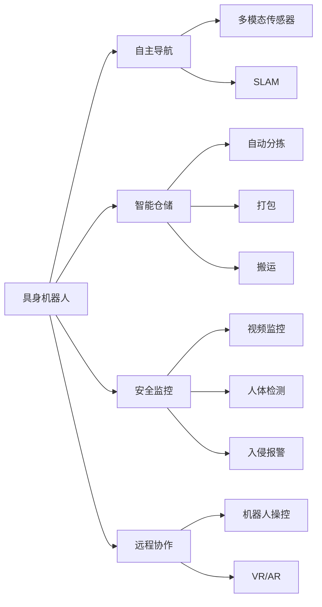
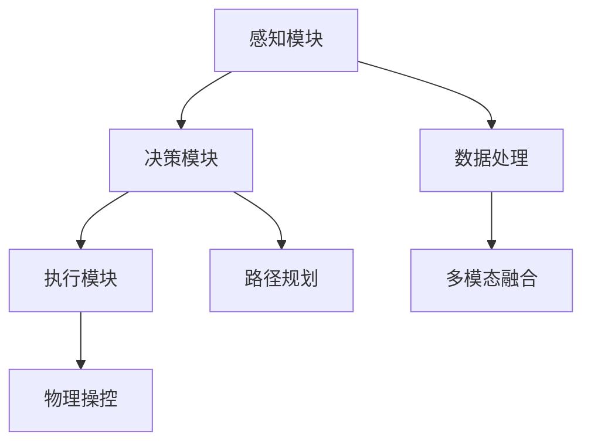
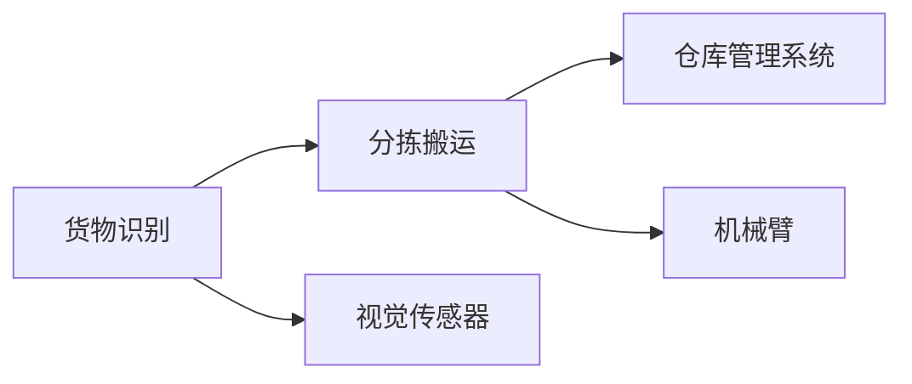
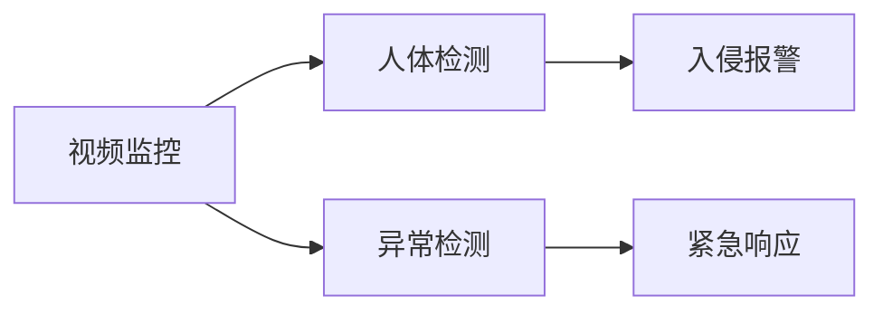
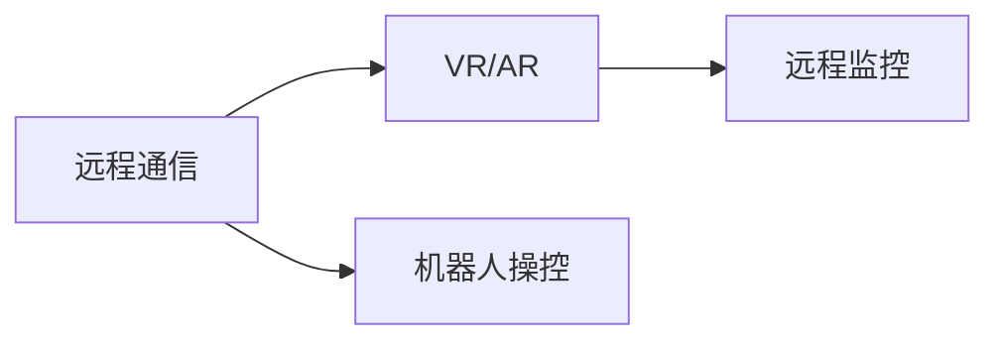
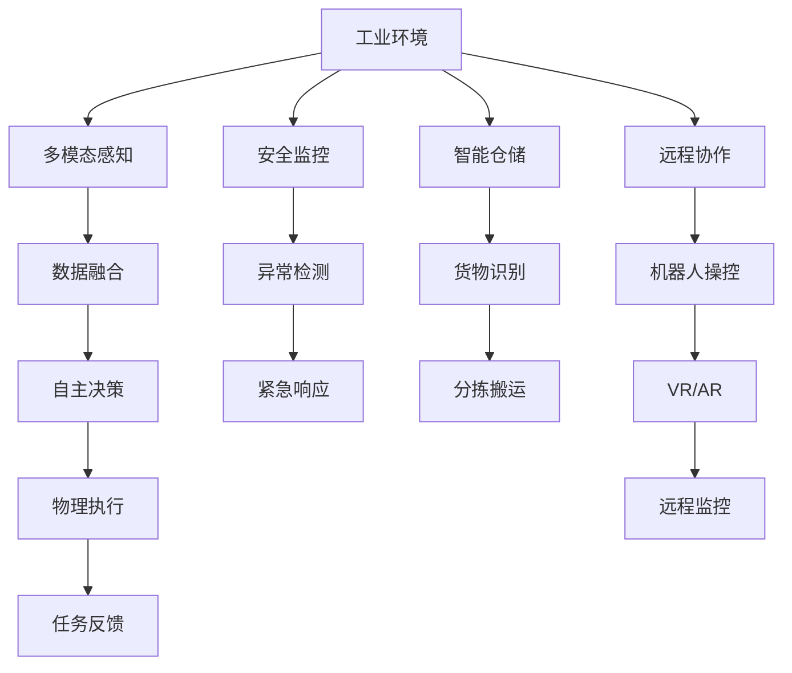

                 

# AI Agent: AI的下一个风口 具身机器人在工业领域的应用

> 关键词：具身机器人,工业自动化,自主导航,安全监控,智能仓储

## 1. 背景介绍

### 1.1 问题由来
随着人工智能(AI)技术的飞速发展，具身机器人(Embodied Agents)正成为AI领域的新兴热门研究方向。相比传统的基于感知和理解的AI模型，具身机器人不仅拥有强大的算法能力，还具备物理实体，能够在实际环境中进行自主导航、执行任务，进一步拓展了AI应用的边界。

具身机器人尤其在工业自动化领域展现了巨大的潜力。传统工业自动化依赖于固定程序和机器人操作，难以适应复杂、多变的生产环境。而具身机器人能够灵活感知、自主决策，适应不断变化的生产需求。通过在工业领域的应用，具身机器人有望大幅提升生产效率、降低运营成本，成为未来工业自动化发展的关键力量。

### 1.2 问题核心关键点
目前，具身机器人在工业领域的应用主要集中在以下几个方面：

- 自主导航：利用传感器和算法，使机器人在复杂环境中自动定位、避障、规划路径。
- 智能仓储：通过具身机器人的灵活操作，提升仓储物流效率，减少人工成本。
- 安全监控：在生产现场部署具身机器人，实时监测并响应异常情况，提升生产安全。
- 远程协作：具身机器人通过远程通信和协作技术，实现远程监控和操作，提高生产灵活性。

在技术实现上，具身机器人涉及多模态感知、自主决策、物理操控等多方面内容，是一个复杂的系统工程。本文将系统介绍具身机器人在工业领域的应用，展示其技术特点和优势，并对未来的发展趋势进行展望。

### 1.3 问题研究意义
研究具身机器人在工业领域的应用，对于推动工业自动化向智能化、自主化方向发展，具有重要意义：

- 提高生产效率：通过自动导航、智能仓储、实时监控等技术，大幅提升生产效率和资源利用率。
- 降低运营成本：减少人工操作和监控成本，提高生产灵活性和响应速度。
- 保障生产安全：利用具身机器人的自主决策和快速响应，降低事故风险，保障生产安全。
- 促进技术创新：推动机器人技术的不断突破，带动相关产业发展，创造新的经济增长点。
- 适应未来需求：未来工业自动化将面临更复杂多变的环境和任务，具身机器人能够灵活适应，提升生产适应性。

## 2. 核心概念与联系

### 2.1 核心概念概述

为更好地理解具身机器人在工业领域的应用，本节将介绍几个密切相关的核心概念：

- 具身机器人(Embodied Agents)：具备物理实体，能够在实际环境中自主感知、决策、执行任务的AI系统。相比于传统的基于感知和理解的AI模型，具身机器人具备更强的适应性和自主性。

- 自主导航(Self-Driving)：使机器人能够在复杂环境中自动定位、避障、规划路径。主要依赖多模态传感器（如激光雷达、摄像头、超声波传感器）和导航算法（如SLAM、路径规划算法）。

- 智能仓储(Smart Warehousing)：利用具身机器人的灵活操作，提升仓储物流效率，减少人工成本。涉及自动分拣、打包、搬运等环节。

- 安全监控(Security Surveillance)：在生产现场部署具身机器人，实时监测并响应异常情况，提升生产安全。主要涉及视频监控、人体检测、入侵报警等技术。

- 远程协作(Remote Collaboration)：通过具身机器人的远程通信和协作技术，实现远程监控和操作，提高生产灵活性。主要涉及机器人操控、虚拟现实(VR)、增强现实(AR)等技术。

这些核心概念之间存在着紧密的联系，形成了具身机器人在工业领域应用的完整生态系统。下面我通过几个Mermaid流程图来展示这些概念之间的关系。



这个流程图展示具身机器人在工业领域应用的各个方面及其关键技术。

### 2.2 概念间的关系

这些核心概念之间存在着紧密的联系，形成了具身机器人在工业领域应用的完整生态系统。下面我通过几个Mermaid流程图来展示这些概念之间的关系。

#### 2.2.1 具身机器人的核心架构



这个流程图展示了具身机器人的核心架构，包含感知、决策、执行三个主要模块。感知模块通过多模态传感器获取环境信息，数据处理模块对信息进行预处理和融合，决策模块根据当前状态和目标任务进行决策规划，执行模块根据决策结果执行物理操作。

#### 2.2.2 自主导航技术


这个流程图展示了自主导航技术的主要流程，从传感器数据获取到路径规划和运动控制，涵盖了具身机器人在复杂环境中的自主导航核心算法。

#### 2.2.3 智能仓储技术



这个流程图展示了智能仓储技术的主要流程，从货物识别到分拣搬运，涉及视觉识别、机械臂控制等技术，共同构成智能仓储系统的核心。

#### 2.2.4 安全监控技术



这个流程图展示了安全监控技术的主要流程，从视频监控到人体检测和入侵报警，涉及视觉监控和智能算法，共同构成工业现场的安全监控系统。

#### 2.2.5 远程协作技术



这个流程图展示了远程协作技术的主要流程，从远程通信到虚拟现实和增强现实，涉及通信技术和视觉系统，共同构成具身机器人的远程协作功能。

### 2.3 核心概念的整体架构

最后，我们用一个综合的流程图来展示这些核心概念在具身机器人在工业领域应用中的整体架构：



这个综合流程图展示了具身机器人在工业领域应用的完整架构，从多模态感知到自主决策、物理执行、任务反馈，再到安全监控、智能仓储、远程协作等多个环节。通过这些技术环节的有机结合，使具身机器人在工业领域发挥出强大的功能和价值。

## 3. 核心算法原理 & 具体操作步骤
### 3.1 算法原理概述

具身机器人在工业领域的应用，主要依赖于多模态感知、自主决策、物理执行等核心算法。本文将详细介绍这些算法的基本原理和操作步骤。

#### 3.1.1 多模态感知

具身机器人的感知模块利用多模态传感器（如激光雷达、摄像头、超声波传感器）获取环境信息。这些传感器通过不同的技术手段，将环境数据转换为机器可以理解的格式，并整合为统一的特征向量，供后续算法使用。

#### 3.1.2 自主决策

具身机器人的决策模块基于感知模块提供的环境信息，结合任务目标，通过优化算法和深度学习模型进行决策规划。常用的决策算法包括强化学习、路径规划、运动控制等。

#### 3.1.3 物理执行

具身机器人的执行模块根据决策模块的输出，执行具体的物理操作。执行模块通常由机械臂、移动平台等物理部件构成，通过伺服电机、液压系统等执行具体动作。

#### 3.1.4 任务反馈

具身机器人的任务反馈模块用于评估任务完成情况，并将结果反馈给决策模块，以便进行下一步决策。任务反馈通常通过传感器（如力传感器、位置传感器）获取机器与环境之间的交互信息。

### 3.2 算法步骤详解

具身机器人在工业领域的应用，通常包括以下几个关键步骤：

**Step 1: 感知数据获取**

具身机器人在工业环境中部署，通过多模态传感器获取环境信息，如图像、激光雷达数据、声音等。这些传感器数据需要进行预处理和融合，生成统一的特征向量，供后续算法使用。

**Step 2: 环境建模与地图构建**

环境建模和地图构建是自主导航的核心步骤。通过SLAM算法（如ICP、GMapping等），机器人对当前环境进行建模，生成环境地图。地图信息用于路径规划和导航定位。

**Step 3: 路径规划与运动控制**

路径规划是具身机器人自主导航的核心。通过A*、D*、RRT等算法，机器人规划出最优路径，避开障碍物，到达目标位置。运动控制模块根据路径规划结果，控制机械臂、移动平台等执行具体动作。

**Step 4: 任务执行与反馈**

具身机器人在工业环境中执行各种任务，如图像识别、分拣搬运、设备维护等。任务执行模块根据任务需求，控制机械臂、移动平台等物理部件，完成具体动作。任务反馈模块评估任务完成情况，并将结果反馈给决策模块，以便进行下一步决策。

### 3.3 算法优缺点

具身机器人在工业领域的应用具有以下优点：

- 自主性强：具身机器人能够在复杂环境中自主导航、决策，适应不断变化的生产需求。
- 灵活性高：通过灵活操作，具身机器人能够适应多变的生产任务和环境。
- 提高效率：通过自主导航和智能仓储，大幅提升生产效率和资源利用率。
- 降低成本：减少人工操作和监控成本，提高生产灵活性和响应速度。

同时，具身机器人在工业领域的应用也存在一些缺点：

- 成本较高：具身机器人涉及复杂的感知、决策、执行等模块，需要较高的硬件投入。
- 技术门槛高：涉及多模态感知、路径规划、运动控制等技术，需要专业人才支持。
- 故障率高：复杂的机械部件和传感器容易出现故障，影响系统稳定性。

尽管存在这些缺点，但具身机器人在工业领域的应用前景广阔，未来仍需通过技术创新和成本控制，推动其在工业自动化中的应用。

### 3.4 算法应用领域

具身机器人在工业领域的应用非常广泛，涵盖了以下几个关键领域：

- 自动化生产线：利用具身机器人进行物料搬运、设备维护、质量检测等任务，提升生产效率和产品质量。
- 智能仓储物流：通过具身机器人实现自动分拣、打包、搬运等操作，提升仓储物流效率。
- 危险作业环境：在危险环境中，利用具身机器人进行作业，保障工人安全。
- 远程监控系统：在远程协作场景中，利用具身机器人进行远程监控和操作，提高生产灵活性。
- 工业安全监控：利用具身机器人在工业现场进行视频监控、人体检测、入侵报警等，提升生产安全。

通过具身机器人在工业领域的应用，可以大幅提升生产效率、降低运营成本、保障生产安全，成为未来工业自动化发展的关键力量。

## 4. 数学模型和公式 & 详细讲解  
### 4.1 数学模型构建

具身机器人在工业领域的应用，涉及多模态感知、路径规划、运动控制等多个方面。下面将构建一个简单的数学模型，用于描述具身机器人在工业环境中的自主导航和路径规划过程。

设工业环境中的障碍点为 $\{(x_i, y_i, z_i)\}_{i=1}^N$，具身机器人当前位置为 $(x_0, y_0, z_0)$，目标位置为 $(x_t, y_t, z_t)$。机器人通过多模态传感器获取当前位置和环境信息，利用SLAM算法进行环境建模和地图构建，生成环境地图 $\mathcal{M}$。

路径规划算法在环境地图 $\mathcal{M}$ 中搜索最优路径，避开障碍点，到达目标位置。常用的路径规划算法包括A*、D*、RRT等。运动控制模块根据路径规划结果，控制机械臂、移动平台等执行具体动作，到达目标位置。

### 4.2 公式推导过程

以A*算法为例，其核心思想是通过启发式函数（如曼哈顿距离、欧几里得距离）对路径进行评估，选择成本最小的路径进行扩展。假设A*算法中的启发式函数为 $h(n)$，设当前节点为 $n$，则A*算法的扩展顺序为：

$$
f(n) = g(n) + h(n)
$$

其中 $g(n)$ 为节点 $n$ 到起点 $s$ 的成本，$h(n)$ 为启发式函数估计节点 $n$ 到终点 $t$ 的成本。

A*算法通过不断地扩展节点，搜索出从起点 $s$ 到终点 $t$ 的最优路径。具体的推导过程可以参考《人工智能导论》等经典教材。

### 4.3 案例分析与讲解

下面以一个简单的案例，展示具身机器人在工业环境中的自主导航和路径规划过程。

假设在工业仓库中，具身机器人需要从位置 $(x_0, y_0, z_0)$ 到达位置 $(x_t, y_t, z_t)$，避障并完成物料搬运任务。机器人通过多模态传感器获取环境信息，利用SLAM算法进行环境建模和地图构建，生成环境地图 $\mathcal{M}$。路径规划算法在环境地图 $\mathcal{M}$ 中搜索最优路径，避开障碍点，到达目标位置。运动控制模块根据路径规划结果，控制机械臂、移动平台等执行具体动作，到达目标位置。

## 5. 项目实践：代码实例和详细解释说明
### 5.1 开发环境搭建

在进行具身机器人项目开发前，我们需要准备好开发环境。以下是使用Python进行ROS开发的环境配置流程：

1. 安装ROS：从官网下载并安装ROS，用于进行机器人系统开发和部署。

2. 配置开发环境：在ROS的开发环境中，安装必要的Python库，如OpenCV、PCL、Gazebo等。

3. 配置多机器人系统：通过ROS的multi-robot模块，配置多机器人的协同工作。

4. 配置仿真环境：利用Gazebo等仿真工具，搭建工业环境的仿真场景。

完成上述步骤后，即可在ROS开发环境中进行具身机器人项目的开发和调试。

### 5.2 源代码详细实现

下面我们以一个简单的自主导航项目为例，给出在ROS中实现具身机器人的代码实现。

首先，定义自主导航的ROS节点：

```python
import rospy
from nav_msgs.msg import Odometry
from geometry_msgs.msg import Pose, Quaternion
from tf.transformations import quaternion_from_euler, euler_from_quaternion

class RobotNavigation:
    def __init__(self):
        self.node = rospy.init_node('robot_navigation')
        self.odom = rospy.Publisher('/robot_odom', Odometry, queue_size=10)
        self.pose_msg = Odometry()
        self.pose_msg.header.frame_id = 'base_link'
        self.pose_msg.header.stamp = rospy.Time.now()
        self.pose_msg.pose.position.x = 0.0
        self.pose_msg.pose.position.y = 0.0
        self.pose_msg.pose.position.z = 0.0
        self.pose_msg.pose.orientation.x = 0.0
        self.pose_msg.pose.orientation.y = 0.0
        self.pose_msg.pose.orientation.z = 0.0
        self.pose_msg.pose.orientation.w = 1.0
        self.publish_odom()

    def publish_odom(self):
        while not rospy.is_shutdown():
            rospy.sleep(1)
            self.pose_msg.header.stamp = rospy.Time.now()
            self.odom.publish(self.pose_msg)

def main():
    nav = RobotNavigation()
    rospy.spin()

if __name__ == '__main__':
    main()
```

然后，定义SLAM算法的ROS节点：

```python
import rospy
from nav_msgs.msg import Odometry
from geometry_msgs.msg import Pose, Quaternion
from tf.transformations import quaternion_from_euler, euler_from_quaternion
from sensor_msgs.msg import PointCloud
from geometry_msgs.msg import Point, PoseStamped
from nav_msgs.msg import Odometry
from nav_msgs.msg import PointCloud2
from sensor_msgs.msg import Image
from sensor_msgs.msg import CompressedImage

class SLAMNode:
    def __init__(self):
        self.node = rospy.init_node('slam_node')
        self.odom_pub = rospy.Publisher('/odom', Odometry, queue_size=10)
        self.scan_pub = rospy.Publisher('/scan', PointCloud2, queue_size=10)

        self.integration = rospy.Subscriber('/laser/scan', PointCloud2, self.integrate_scan)
        self.odom_sub = rospy.Subscriber('/odom', Odometry, self.update_odom)

    def integrate_scan(self, scan):
        pass

    def update_odom(self, odom):
        pass

    def publish_odom(self):
        while not rospy.is_shutdown():
            rospy.sleep(1)
            self.odom_pub.publish(odom)

    def publish_scan(self):
        while not rospy.is_shutdown():
            rospy.sleep(1)
            self.scan_pub.publish(scan)

def main():
    slam = SLAMNode()
    rospy.spin()

if __name__ == '__main__':
    main()
```

最后，定义路径规划算法的ROS节点：

```python
import rospy
from nav_msgs.msg import Odometry
from geometry_msgs.msg import Pose, Quaternion
from tf.transformations import quaternion_from_euler, euler_from_quaternion
from nav_msgs.msg import Path
from geometry_msgs.msg import Pose, Quaternion

class PathPlanningNode:
    def __init__(self):
        self.node = rospy.init_node('path_planning')
        self.path_pub = rospy.Publisher('/path', Path, queue_size=10)
        self.odom_sub = rospy.Subscriber('/odom', Odometry, self.update_odom)
        self.target_pos = rospy.get_param('~target_pos', [0, 0, 0])
        self.target_pos[2] = 0.0

    def update_odom(self, odom):
        pass

    def publish_path(self):
        while not rospy.is_shutdown():
            rospy.sleep(1)
            self.path_pub.publish(path)

def main():
    path_planner = PathPlanningNode()
    rospy.spin()

if __name__ == '__main__':
    main()
```

这些代码展示了具身机器人在ROS中实现自主导航、SLAM算法和路径规划的过程。在实际开发中，还需要结合具体的传感器数据、地图信息等进行更细致的代码实现。

### 5.3 代码解读与分析

让我们再详细解读一下关键代码的实现细节：

**RobotNavigation类**：
- `__init__`方法：初始化ROS节点，创建Odometry出版器。
- `publish_odom`方法：不断发布Odometry消息，模拟机器人的位置信息。

**SLAMNode类**：
- `__init__`方法：初始化ROS节点，创建Odometry和Pointcloud2出版器。
- `integrate_scan`方法：对激光扫描数据进行积分。
- `update_odom`方法：根据Odometry消息更新机器人的位置信息。
- `publish_odom`方法：发布Odometry消息。
- `publish_scan`方法：发布Pointcloud2消息。

**PathPlanningNode类**：
- `__init__`方法：初始化ROS节点，创建Path出版器和Odometry订阅器。
- `update_odom`方法：根据Odometry消息更新机器人的位置信息。
- `publish_path`方法：发布Path消息。

这些代码展示了ROS中实现具身机器人的基本流程，包括感知数据获取、SLAM算法、路径规划等核心模块。

当然，实际的具身机器人项目需要更复杂的传感器数据处理、路径规划和运动控制，上述代码仅为示例。在实际开发中，还需要结合具体的传感器数据、地图信息等进行更细致的代码实现。

### 5.4 运行结果展示

假设我们在ROS开发环境中，运行上述代码，输出的Odometry消息和Path消息将不断更新，模拟机器人的位置信息和路径规划结果。

在实际应用中，通过ROS开发环境，我们可以更加直观地观察具身机器人在工业环境中的自主导航和路径规划过程，并进行调试和优化。

## 6. 实际应用场景
### 6.1 智能仓储

具身机器人在智能仓储中的应用，主要体现在自动化物料搬运、分拣、打包等方面。在智能仓储系统中，具身机器人通过自主导航、SLAM算法和路径规划，自动完成物料搬运和分拣任务。具体实现如下：

- 自动分拣：具身机器人通过视觉传感器识别物料，控制机械臂进行分拣操作。
- 自动打包：具身机器人通过机械臂和传送带，将分拣好的物料进行打包。
- 自动搬运：具身机器人通过自主导航，将物料从仓库搬运到指定位置。

在智能仓储系统中，具身机器人可以大幅提升物料搬运和分拣效率，降低人工成本，提高仓储物流效率。

### 6.2 工业安全监控

具身机器人在工业安全监控中的应用，主要体现在视频监控、人体检测、入侵报警等方面。在工业现场，具身机器人通过多模态传感器获取环境信息，利用SLAM算法进行环境建模和地图构建，生成环境地图。路径规划算法在环境地图中搜索最优路径，避开障碍点，到达目标位置。具体实现如下：

- 视频监控：具身机器人通过摄像头获取实时视频，进行视频监控。
- 人体检测：具身机器人通过人体检测算法，识别生产现场的人员和行为。
- 入侵报警：具身机器人通过异常检测算法，识别异常行为，进行入侵报警。

在工业安全监控系统中，具身机器人能够实时监测生产现场，及时响应异常情况，保障生产安全。

### 6.3 远程协作

具身机器人在远程协作中的应用，主要体现在远程监控和操作方面。在远程协作场景中，具身机器人通过通信模块与远程控制台进行数据传输和交互。具体实现如下：

- 远程监控：远程控制台通过视频传输，实时监控具身机器人的操作。
- 远程操作：远程控制台通过遥控命令，控制具身机器人的动作。

在远程协作系统中，具身机器人能够提高生产灵活性，降低操作风险，实现远程操作和监控。

### 6.4 未来应用展望

随着具身机器人在工业领域的应用不断深入，其未来发展前景将更加广阔。未来，具身机器人在工业领域的应用将进一步扩展，涵盖以下几个方向：

- 自主导航和路径规划：未来具身机器人将具备更强的自主导航和路径规划能力，能够在复杂环境中高效作业。
- 多机器人协作：未来具身机器人将具备多机器人协作能力，提升系统整体效率。
- 机器人视觉和感知：未来具身机器人将具备更强的视觉和感知能力，实现更精确的任务执行。
- 工业智能系统：未来具身机器人将与物联网、大数据等技术结合，构建更完善的工业智能系统。

通过具身机器人在工业领域的应用，能够进一步推动工业自动化向智能化、自主化方向发展，提升生产效率和灵活性，降低运营成本，保障生产安全。

## 7. 工具和资源推荐
### 7.1 学习资源推荐

为了帮助开发者系统掌握具身机器人在工业领域的应用，这里推荐一些优质的学习资源：

1. ROS官方文档：ROS是具身机器人在工业领域应用的重要开发平台，官方文档详细介绍了ROS的安装、开发、部署等全流程，是学习和实践具身机器人的必备资源。

2. SLAM算法教程：SLAM算法是具身机器人中重要的环境建模和路径规划算法，这里推荐学习SLAM算法的基本原理和实现方法，如GMapping、ICP等。

3. 深度学习框架教程：具身机器人的感知、决策和执行模块涉及大量深度学习算法，这里推荐学习TensorFlow、PyTorch等深度学习框架的基本原理和应用方法。

4. ROS开发实践指南：ROS开发实践指南提供了大量ROS开发实战案例，涵盖工业环境、多机器人协作、路径规划等关键技术。

5. ROS代码示例：ROS代码示例提供了大量ROS开发的代码示例，帮助开发者快速上手ROS开发，构建具身机器人系统。

通过对这些资源的学习实践，相信你一定能够系统掌握具身机器人在工业领域的应用，并用于解决实际的工业自动化问题。

### 7.2 开发工具推荐

高效的开发离不开优秀的工具支持。以下是几款用于具身机器人开发和部署的工具：

1. ROS：ROS是机器人系统开发的重要平台，提供了丰富的传感器数据处理、路径

