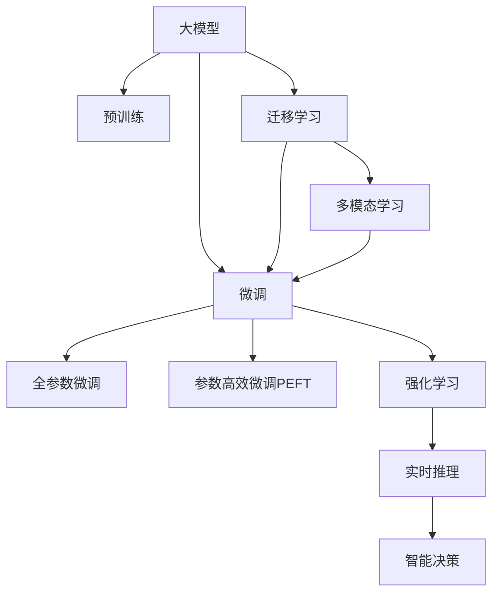
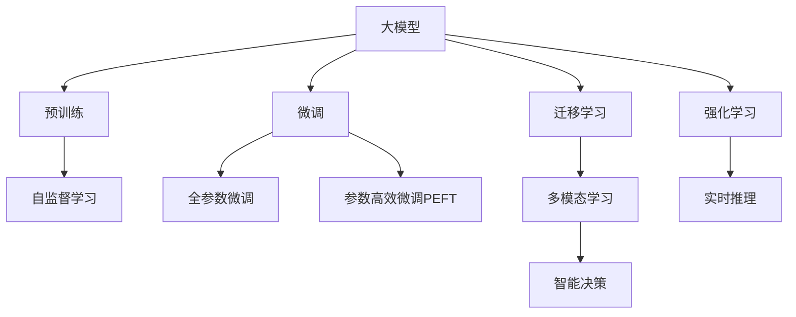
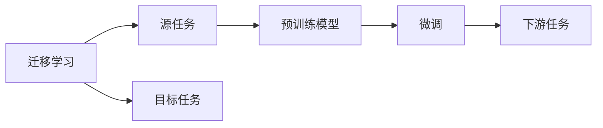
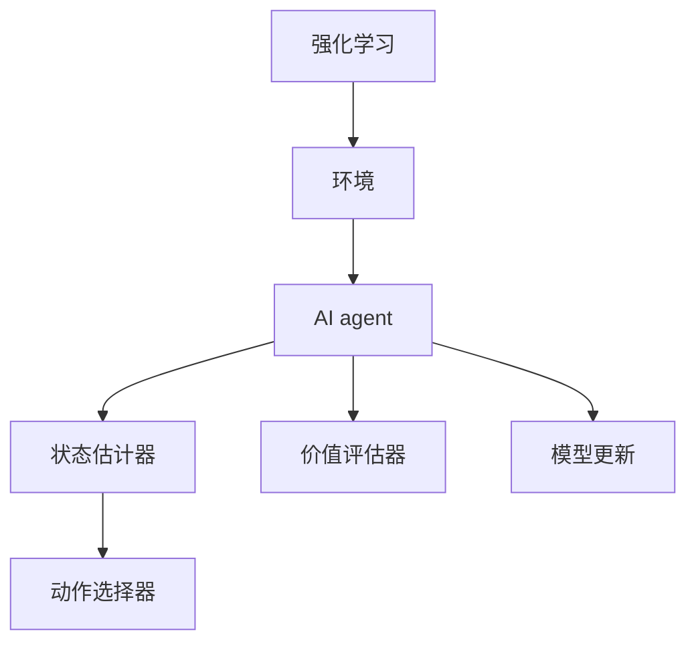
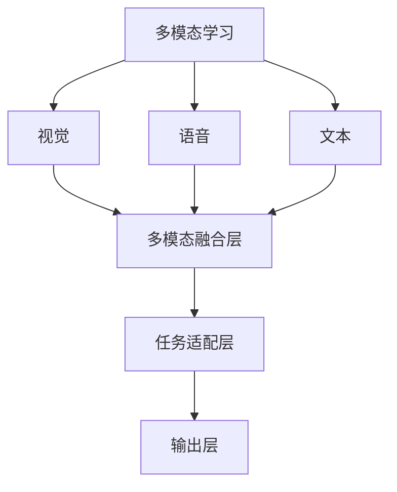
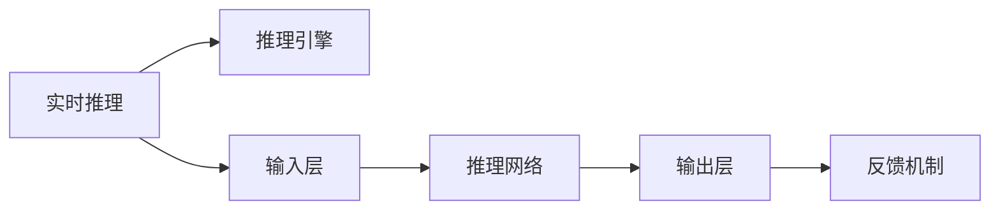
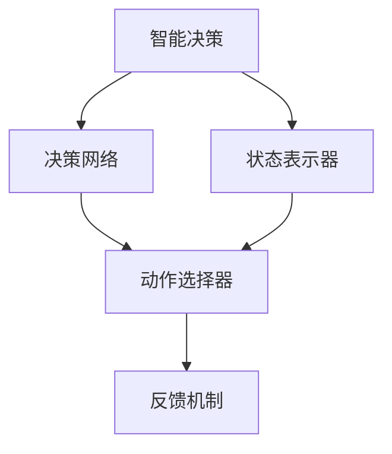
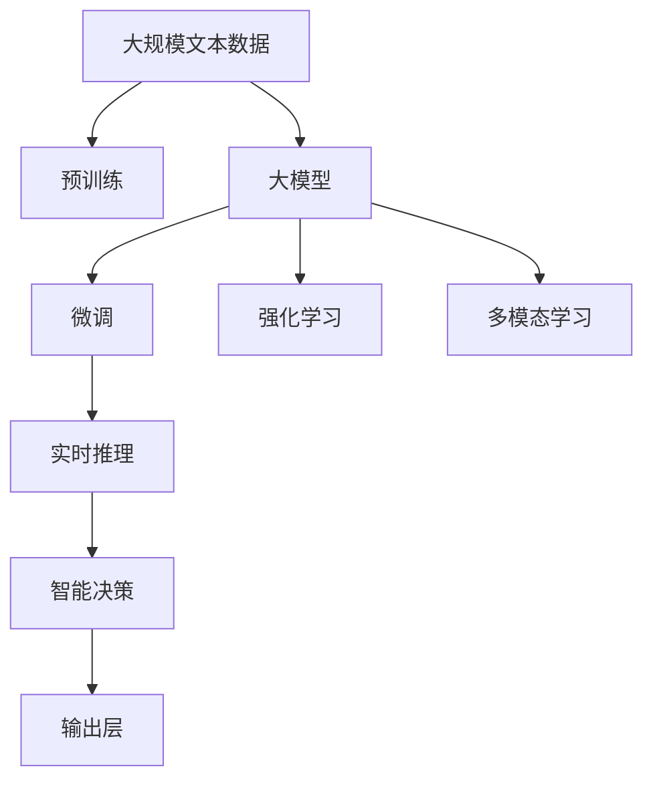

                 

# AI Agent: AI的下一个风口 大模型时代狂飙猛进

> 关键词：AI agent, 大模型, 微调, 迁移学习, 强化学习, 多模态学习, 智能决策, 实时推理, 人工智能

## 1. 背景介绍

### 1.1 问题由来

人工智能(AI)技术正在经历一场前所未有的变革。从最初的专家系统、机器学习到深度学习，AI技术已经从单点突破迈向了多维融合，从通用模型迈向了定制模型。在这一过程中，大语言模型和大模型微调技术发挥了关键作用。大语言模型通过在海量数据上预训练，学习到了丰富的语言知识和常识，能够处理复杂的自然语言处理(NLP)任务，如图语言翻译、文本摘要、情感分析等。大模型微调则在此基础上，通过有监督的微调方法，使模型更好地适应特定任务，从而在实际应用中取得卓越性能。

然而，当前的大模型微调技术仍存在一些挑战和局限性。首先，大模型往往需要大量标注数据进行微调，而标注数据的获取成本较高，且对于小规模任务的微调效果有限。其次，微调模型的泛化能力和鲁棒性仍需进一步提高，尤其是在新领域和新任务上的适应性。此外，微调模型的计算资源消耗较大，难以实时推理，限制了其在某些应用场景中的应用。

为了解决这些问题，AI agent技术应运而生。AI agent是一种能够自主决策、持续学习的智能体，可以在各种环境中自适应地完成任务。AI agent不仅能够利用大模型微调技术，还需要结合强化学习和多模态学习等前沿技术，实现更加高效、鲁棒和智能的决策和推理能力。

### 1.2 问题核心关键点

AI agent的核心在于其自主学习和自主决策能力，具体包括以下几个关键点：

- **大模型微调**：利用预训练语言模型，通过有监督的微调方法，使模型更好地适应特定任务，提升模型性能。
- **迁移学习**：将大模型在源任务上学到的知识迁移到新任务上，提高模型在新环境中的适应性。
- **强化学习**：通过与环境的交互，使AI agent能够在不断试错中学习最优策略，实现自主决策。
- **多模态学习**：结合视觉、语音、文本等多模态信息，增强AI agent的感知和理解能力，提高决策的准确性。
- **实时推理**：在实时环境中，快速进行推理决策，满足实时应用的需求。
- **智能决策**：通过自主学习和决策，AI agent能够在复杂和动态环境中做出最优选择。

这些关键点共同构成了AI agent的核心能力，使其能够在各种场景下发挥重要作用。通过AI agent技术，我们可以构建更加智能、可靠和高效的人工智能系统，推动AI技术在更多领域的应用。

### 1.3 问题研究意义

AI agent技术具有重要的研究意义，具体如下：

- **提升AI应用能力**：AI agent能够利用大模型微调、迁移学习、强化学习等技术，提升AI系统的智能决策和实时推理能力，更好地适应复杂环境。
- **降低应用成本**：AI agent能够利用已有的大模型知识，减少从头开发所需的数据、计算和人力等成本投入。
- **提高模型效果**：通过微调和大模型知识迁移，AI agent能够在大规模数据上取得更好的性能，满足高要求的应用需求。
- **加速开发进度**：AI agent提供了一种快速原型设计和迭代改进的方法，加快AI系统的开发和部署速度。
- **促进技术创新**：AI agent技术结合了多种前沿技术，推动了AI领域的持续创新和发展。

## 2. 核心概念与联系

### 2.1 核心概念概述

为更好地理解AI agent的原理和架构，本节将介绍几个密切相关的核心概念：

- **大模型**：以自回归(如GPT)或自编码(如BERT)模型为代表的大规模预训练语言模型。通过在大规模无标签文本语料上进行预训练，学习通用的语言表示，具备强大的语言理解和生成能力。
- **大模型微调**：在大模型基础上，使用下游任务的少量标注数据，通过有监督地训练优化模型在特定任务上的性能。通常只需要调整顶层分类器或解码器，并以较小的学习率更新全部或部分的模型参数。
- **迁移学习**：指将一个领域学习到的知识，迁移应用到另一个不同但相关的领域的学习范式。大模型的预训练-微调过程即是一种典型的迁移学习方式。
- **强化学习**：通过与环境的交互，使智能体能够在不断试错中学习最优策略，实现自主决策。
- **多模态学习**：结合视觉、语音、文本等多模态信息，增强AI agent的感知和理解能力，提高决策的准确性。
- **实时推理**：在实时环境中，快速进行推理决策，满足实时应用的需求。
- **智能决策**：通过自主学习和决策，AI agent能够在复杂和动态环境中做出最优选择。

这些核心概念之间的逻辑关系可以通过以下Mermaid流程图来展示：



这个流程图展示了大模型微调、迁移学习、强化学习、多模态学习、实时推理和智能决策之间的联系。

### 2.2 概念间的关系

这些核心概念之间存在着紧密的联系，形成了AI agent的整体架构。下面我们通过几个Mermaid流程图来展示这些概念之间的关系。

#### 2.2.1 大模型的学习范式



这个流程图展示了大模型的学习范式，包括预训练、微调、迁移学习、强化学习和多模态学习等。

#### 2.2.2 迁移学习与微调的关系



这个流程图展示了迁移学习的基本原理，以及它与微调的关系。迁移学习涉及源任务和目标任务，预训练模型在源任务上学习，然后通过微调适应各种下游任务（目标任务）。

#### 2.2.3 强化学习与微调的关系



这个流程图展示了强化学习的基本原理，以及它与微调的关系。强化学习通过与环境的交互，使AI agent能够在不断试错中学习最优策略，实现自主决策。

#### 2.2.4 多模态学习与微调的关系



这个流程图展示了多模态学习的基本原理，以及它与微调的关系。多模态学习结合视觉、语音、文本等多模态信息，增强AI agent的感知和理解能力，提高决策的准确性。

#### 2.2.5 实时推理与微调的关系



这个流程图展示了实时推理的基本原理，以及它与微调的关系。实时推理在实时环境中，快速进行推理决策，满足实时应用的需求。

#### 2.2.6 智能决策与微调的关系



这个流程图展示了智能决策的基本原理，以及它与微调的关系。智能决策通过自主学习和决策，AI agent能够在复杂和动态环境中做出最优选择。

### 2.3 核心概念的整体架构

最后，我们用一个综合的流程图来展示这些核心概念在大模型微调中的整体架构：



这个综合流程图展示了从预训练到微调，再到强化学习、多模态学习和实时推理的完整过程。大模型首先在大规模文本数据上进行预训练，然后通过微调（包括全参数微调和参数高效微调）或强化学习，使模型在特定任务上取得优异的性能。最后，通过多模态学习和实时推理，AI agent能够在实际应用中快速、准确地进行决策和推理。

## 3. 核心算法原理 & 具体操作步骤
### 3.1 算法原理概述

AI agent的算法原理主要基于监督学习和强化学习的混合范式，利用预训练语言模型进行微调，同时通过与环境的交互进行强化学习。在具体实现中，大模型通常作为特征提取器，通过任务适配层进行微调，以适应特定任务。在强化学习阶段，AI agent通过与环境的交互，不断调整策略，提升决策性能。

### 3.2 算法步骤详解

AI agent的实现过程可以分为以下几个步骤：

**Step 1: 准备预训练模型和数据集**
- 选择合适的预训练语言模型 $M_{\theta}$ 作为初始化参数，如 BERT、GPT 等。
- 准备下游任务 $T$ 的标注数据集 $D$，划分为训练集、验证集和测试集。一般要求标注数据与预训练数据的分布不要差异过大。

**Step 2: 添加任务适配层**
- 根据任务类型，在预训练模型顶层设计合适的输出层和损失函数。
- 对于分类任务，通常在顶层添加线性分类器和交叉熵损失函数。
- 对于生成任务，通常使用语言模型的解码器输出概率分布，并以负对数似然为损失函数。

**Step 3: 设置微调超参数**
- 选择合适的优化算法及其参数，如 AdamW、SGD 等，设置学习率、批大小、迭代轮数等。
- 设置正则化技术及强度，包括权重衰减、Dropout、Early Stopping 等。
- 确定冻结预训练参数的策略，如仅微调顶层，或全部参数都参与微调。

**Step 4: 执行梯度训练**
- 将训练集数据分批次输入模型，前向传播计算损失函数。
- 反向传播计算参数梯度，根据设定的优化算法和学习率更新模型参数。
- 周期性在验证集上评估模型性能，根据性能指标决定是否触发 Early Stopping。
- 重复上述步骤直到满足预设的迭代轮数或 Early Stopping 条件。

**Step 5: 强化学习训练**
- 与环境进行交互，收集动作和状态信息。
- 通过状态估计器和动作选择器计算状态价值和动作选择概率。
- 根据Q值函数更新状态价值和动作选择概率。
- 通过模型更新调整动作选择策略。
- 重复上述步骤直到满足预设的训练轮数。

**Step 6: 多模态信息融合**
- 收集视觉、语音、文本等多模态信息。
- 使用多模态融合层将不同模态的信息进行整合。
- 根据融合后的多模态信息进行任务适配。
- 通过输出层输出决策结果。

**Step 7: 实时推理**
- 将多模态信息输入推理网络进行实时推理。
- 根据推理结果进行智能决策。
- 将决策结果输出给执行器进行操作。

以上是AI agent的基本实现流程，每个步骤都有其独特的算法原理和具体操作细节。

### 3.3 算法优缺点

AI agent具有以下优点：

1. **提升模型效果**：通过微调和大模型知识迁移，AI agent能够在大规模数据上取得更好的性能，满足高要求的应用需求。
2. **通用适用**：适用于各种NLP下游任务，包括分类、匹配、生成等，设计简单的任务适配层即可实现。
3. **参数高效微调**：利用参数高效微调技术，在固定大部分预训练参数的情况下，仍可取得不错的提升。
4. **实时推理**：在实时环境中，快速进行推理决策，满足实时应用的需求。
5. **智能决策**：通过自主学习和决策，AI agent能够在复杂和动态环境中做出最优选择。

同时，该方法也存在一些局限性：

1. **依赖标注数据**：微调的效果很大程度上取决于标注数据的质量和数量，获取高质量标注数据的成本较高。
2. **迁移能力有限**：当目标任务与预训练数据的分布差异较大时，微调的性能提升有限。
3. **负面效果传递**：预训练模型的固有偏见、有害信息等，可能通过微调传递到下游任务，造成负面影响。
4. **可解释性不足**：微调模型的决策过程通常缺乏可解释性，难以对其推理逻辑进行分析和调试。

尽管存在这些局限性，但AI agent方法仍然是大模型微调和强化学习的重要应用范式，对于推动NLP技术落地应用具有重要意义。

### 3.4 算法应用领域

AI agent在NLP领域已经得到了广泛的应用，覆盖了几乎所有常见任务，例如：

- 文本分类：如情感分析、主题分类、意图识别等。通过微调使模型学习文本-标签映射。
- 命名实体识别：识别文本中的人名、地名、机构名等特定实体。通过微调使模型掌握实体边界和类型。
- 关系抽取：从文本中抽取实体之间的语义关系。通过微调使模型学习实体-关系三元组。
- 问答系统：对自然语言问题给出答案。将问题-答案对作为微调数据，训练模型学习匹配答案。
- 机器翻译：将源语言文本翻译成目标语言。通过微调使模型学习语言-语言映射。
- 文本摘要：将长文本压缩成简短摘要。将文章-摘要对作为微调数据，使模型学习抓取要点。
- 对话系统：使机器能够与人自然对话。将多轮对话历史作为上下文，微调模型进行回复生成。

除了上述这些经典任务外，AI agent还被创新性地应用到更多场景中，如可控文本生成、常识推理、代码生成、数据增强等，为NLP技术带来了全新的突破。随着预训练模型和AI agent方法的不断进步，相信NLP技术将在更广阔的应用领域大放异彩。

## 4. 数学模型和公式 & 详细讲解  
### 4.1 数学模型构建

本节将使用数学语言对AI agent的微调过程进行更加严格的刻画。

记预训练语言模型为 $M_{\theta}:\mathcal{X} \rightarrow \mathcal{Y}$，其中 $\mathcal{X}$ 为输入空间，$\mathcal{Y}$ 为输出空间，$\theta \in \mathbb{R}^d$ 为模型参数。假设微调任务的训练集为 $D=\{(x_i,y_i)\}_{i=1}^N, x_i \in \mathcal{X}, y_i \in \mathcal{Y}$。

定义模型 $M_{\theta}$ 在数据样本 $(x,y)$ 上的损失函数为 $\ell(M_{\theta}(x),y)$，则在数据集 $D$ 上的经验风险为：

$$
\mathcal{L}(\theta) = \frac{1}{N} \sum_{i=1}^N \ell(M_{\theta}(x_i),y_i)
$$

微调的优化目标是最小化经验风险，即找到最优参数：

$$
\theta^* = \mathop{\arg\min}_{\theta} \mathcal{L}(\theta)
$$

在实践中，我们通常使用基于梯度的优化算法（如SGD、Adam等）来近似求解上述最优化问题。设 $\eta$ 为学习率，$\lambda$ 为正则化系数，则参数的更新公式为：

$$
\theta \leftarrow \theta - \eta \nabla_{\theta}\mathcal{L}(\theta) - \eta\lambda\theta
$$

其中 $\nabla_{\theta}\mathcal{L}(\theta)$ 为损失函数对参数 $\theta$ 的梯度，可通过反向传播算法高效计算。

### 4.2 公式推导过程

以下我们以二分类任务为例，推导交叉熵损失函数及其梯度的计算公式。

假设模型 $M_{\theta}$ 在输入 $x$ 上的输出为 $\hat{y}=M_{\theta}(x) \in [0,1]$，表示样本属于正类的概率。真实标签 $y \in \{0,1\}$。则二分类交叉熵损失函数定义为：

$$
\ell(M_{\theta}(x),y) = -[y\log \hat{y} + (1-y)\log (1-\hat{y})]
$$

将其代入经验风险公式，得：

$$
\mathcal{L}(\theta) = -\frac{1}{N}\sum_{i=1}^N [y_i\log M_{\theta}(x_i)+(1-y_i)\log(1-M_{\theta}(x_i))]
$$

根据链式法则，损失函数对参数 $\theta_k$ 的梯度为：

$$
\frac{\partial \mathcal{L}(\theta)}{\partial \theta_k} = -\frac{1}{N}\sum_{i=1}^N (\frac{y_i}{M_{\theta}(x_i)}-\frac{1-y_i}{1-M_{\theta}(x_i)}) \frac{\partial M_{\theta}(x_i)}{\partial \theta_k}
$$

其中 $\frac{\partial M_{\theta}(x_i)}{\partial \theta_k}$ 可进一步递归展开，利用自动微分技术完成计算。

在得到损失函数的梯度后，即可带入参数更新公式，完成模型的迭代优化。重复上述过程直至收敛，最终得到适应下游任务的最优模型参数 $\theta^*$。

## 5. 项目实践：代码实例和详细解释说明
### 5.1 开发环境搭建

在进行AI agent实践前，我们需要准备好开发环境。以下是使用Python进行PyTorch开发的环境配置流程：

1. 安装Anaconda：从官网下载并安装Anaconda，用于创建独立的Python环境。

2. 创建并激活虚拟环境：
```bash
conda create -n pytorch-env python=3.8 
conda activate pytorch-env
```

3. 安装PyTorch：根据CUDA版本，从官网获取对应的安装命令。例如：
```bash
conda install pytorch torchvision torchaudio cudatoolkit=11.1 -c pytorch -c conda-forge
```

4. 安装Transformers库：
```bash
pip install transformers
```

5. 安装各类工具包：
```bash
pip install numpy pandas scikit-learn matplotlib tqdm jupyter notebook ipython
```

完成上述步骤后，即可在`pytorch-env`环境中开始AI agent实践。

### 5.2 源代码详细实现

下面我们以命名实体识别(NER)任务为例，给出使用Transformers库对BERT模型进行AI agent微调的PyTorch代码实现。

首先，定义NER任务的数据处理函数：

```python
from transformers import BertTokenizer
from torch.utils.data import Dataset
import torch

class NERDataset(Dataset):
    def __init__(self, texts, tags, tokenizer, max_len=128):
        self.texts = texts
        self.tags = tags
        self.tokenizer = tokenizer
        self.max_len = max_len
        
    def __len__(self):
        return len(self.texts)
    
    def __getitem__(self, item):
        text = self.texts[item]
        tags = self.tags[item]
        
        encoding = self.tokenizer(text, return_tensors='pt', max_length=self.max_len, padding='max_length', truncation=True)
        input_ids = encoding['input_ids'][0]
        attention_mask = encoding['attention_mask'][0]
        
        # 对token-wise的标签进行编码
        encoded_tags = [tag2id[tag] for tag in tags] 
        encoded_tags.extend([tag2id['O']] * (self.max_len - len(encoded_tags)))
        labels = torch.tensor(encoded_tags, dtype=torch.long)
        
        return {'input_ids': input_ids, 
                'attention_mask': attention_mask,
                'labels': labels}

# 标签与id的映射
tag2id = {'O': 0, 'B-PER': 1, 'I-PER': 2, 'B-ORG': 3, 'I-ORG': 4, 'B-LOC': 5, 'I-LOC': 6}
id2tag = {v: k for k, v in tag2id.items()}

# 创建dataset
tokenizer = BertTokenizer.from_pretrained('bert-base-cased')

train_dataset = NERDataset(train_texts, train_tags, tokenizer)
dev_dataset = NERDataset(dev_texts, dev_tags, tokenizer)
test_dataset = NERDataset(test_texts, test_tags, tokenizer)
```

然后，定义模型和优化器：

```python
from transformers import BertForTokenClassification, AdamW

model = BertForTokenClassification.from_pretrained('bert-base-cased', num_labels=len(tag2id))

optimizer = AdamW(model.parameters(), lr=2e-5)
```

接着，定义训练和评估函数：

```python
from torch.utils.data import DataLoader
from tqdm import tqdm
from sklearn.metrics import classification_report

device = torch.device('cuda') if torch.cuda.is_available() else torch.device('cpu')
model.to(device)

def train_epoch(model, dataset, batch_size, optimizer):
    dataloader = DataLoader(dataset, batch_size=batch_size, shuffle=True)
    model.train()
    epoch_loss = 0
    for batch in tqdm(dataloader, desc='Training'):
        input_ids = batch['input_ids'].to(device)
        attention_mask = batch['attention_mask'].to(device)
        labels = batch['labels'].to(device)
        model.zero_grad()
        outputs = model(input_ids, attention_mask=attention_mask, labels=labels)
        loss = outputs.loss
        epoch_loss += loss.item()
        loss.backward()
        optimizer.step()
    return epoch_loss / len(dataloader)

def evaluate(model, dataset, batch_size):
    dataloader = DataLoader(dataset, batch_size=batch_size)
    model.eval()
    preds, labels = [], []
    with torch.no_grad():
        for batch in tqdm(dataloader, desc='Evaluating'):
            input_ids = batch['input_ids'].to(device)
            attention_mask = batch['attention_mask'].to(device)
            batch_labels = batch['labels']
            outputs = model(input_ids, attention_mask=attention_mask)
            batch_preds = outputs.logits.argmax(dim=2).to('cpu').tolist()
            batch_labels = batch_labels.to('cpu').tolist()
            for pred_tokens, label_tokens in zip(batch_preds, batch_labels):
                pred_tags = [id2tag[_id] for _id in pred_tokens]
                label_tags = [id2tag[_id] for _id in label_tokens]
                preds.append(pred_tags[:len(label_tags)])
                labels.append(label_tags)
                
    print(classification_report(labels, preds))
```

最后，启动训练流程并在测试集上评估：

```python
epochs = 5
batch_size = 16

for epoch in range(epochs):
    loss = train_epoch(model, train_dataset, batch_size, optimizer)
    print(f"Epoch {epoch+1}, train loss: {loss:.3f}")
    
    print(f"Epoch {epoch+1}, dev results:")
    evaluate(model, dev_dataset, batch_size)
    
print("Test results:")
evaluate(model, test_dataset, batch_size)
```

以上就是使用PyTorch对BERT进行命名实体识别任务微调的完整代码实现。可以看到，得益于Transformers库的强大封装，我们可以用相对简洁的代码完成BERT模型的加载和微调。

### 5.3 代码解读与分析

让我们再详细解读一下关键代码的实现细节：

**NERDataset类**：
- `__init__`方法：初始化文本、标签、分词器等关键组件。
- `__len__`方法：返回数据集的样本数量。
- `__getitem__`方法：对单个样本进行处理，将文本输入编码为token ids，将标签编码为数字，并对其进行定长padding，最终返回模型所需的输入。

**tag2id和id2tag字典**：
- 定义了标签与数字id之间的映射关系，用于将token-wise的预测结果解码回真实的标签。

**训练和评估函数**：
- 使用PyTorch的DataLoader对数据集进行批次化加载，供模型训练和推理使用。
-

