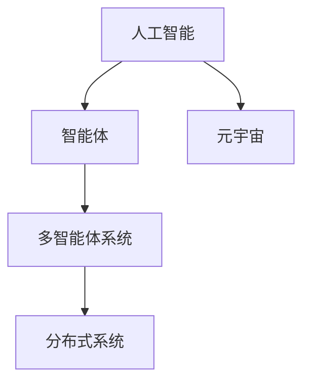
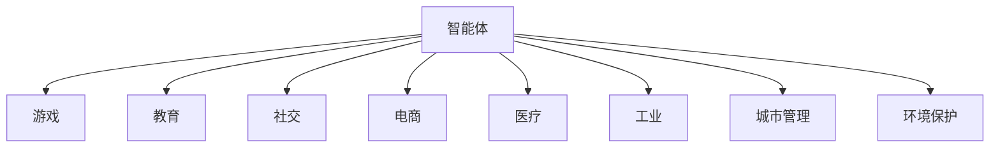
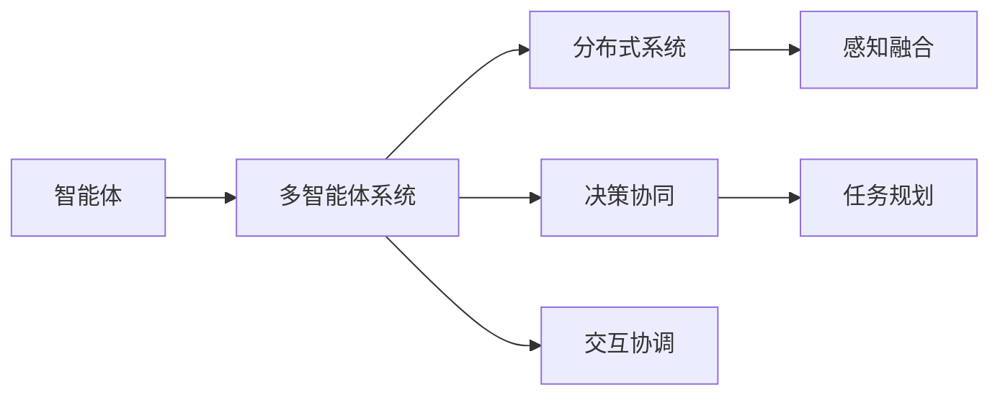
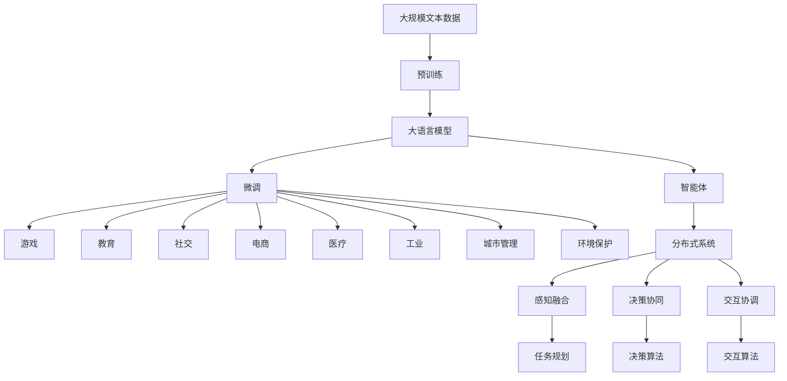

                 

# AI Agent: AI的下一个风口 智能体在元宇宙里的应用

> 关键词：人工智能，智能体，元宇宙，多智能体系统，分布式系统

## 1. 背景介绍

### 1.1 问题由来
近年来，随着虚拟现实、增强现实、人工智能等技术的迅猛发展，元宇宙（Metaverse）的概念逐渐浮出水面。元宇宙是一种基于数字技术的虚拟世界，包含智能体（Agent）在内的多智能体系统在其中扮演关键角色。智能体作为能够自主决策和交互的虚拟实体，能够在元宇宙中进行复杂的任务执行、协作互动，甚至模拟人类社会的动态行为。智能体的应用不仅能够提升用户体验，还对虚拟世界中的各类智能应用提供了强大的技术支撑。

当前，智能体在元宇宙中的应用研究刚刚起步，但已展现出巨大的潜力。其应用领域涉及游戏、教育、社交、电商、医疗等多个方面，未来有望进一步拓展到工业生产、城市管理、环境保护等垂直领域。智能体的应用可以大幅提升这些场景的智能化水平，驱动经济社会的数字化转型。

### 1.2 问题核心关键点
智能体在元宇宙中的应用，主要围绕智能体的自主决策和交互两大核心任务展开。一方面，智能体需要通过感知环境、处理信息，进行自主决策，完成各种复杂任务；另一方面，智能体之间需要灵活互动、协调配合，构建动态多智能体系统，模拟人类社会的行为模式。这两个关键点构成了智能体在元宇宙应用的技术基础。

智能体的关键特性包括自主性、感知能力、决策能力、交互能力和学习能力。其中，自主性和感知能力是智能体的基础；决策和交互能力是其任务执行和协作互动的关键；学习能力则使得智能体能够不断提升自身性能，适应复杂多变的环境。

智能体在元宇宙中的应用，一般需要基于分布式系统构建，具备高并发、高可靠性、低延迟等特性。智能体的核心算法主要包括自主决策算法、任务规划算法、交互协同算法、感知与感知融合算法、学习和优化算法等。这些算法的综合应用，使得智能体能够在元宇宙中实现各种功能，满足不同应用场景的需求。

### 1.3 问题研究意义
智能体在元宇宙中的应用，对于推动人工智能技术的深度发展、拓展数字经济的新边界、构建虚拟世界的动态交互生态具有重要意义：

1. 推动人工智能技术前沿。智能体在元宇宙中的应用，涉及多智能体协同、分布式决策、感知融合等多个前沿方向，将促进人工智能技术的跨越式发展。
2. 拓展数字经济新领域。智能体在元宇宙中的应用，能够驱动游戏、教育、社交等领域的数字化转型，催生新的商业模式和业态，带来巨大经济收益。
3. 构建虚拟世界的动态生态。智能体的应用，可以模拟人类社会的动态行为，构建虚拟世界中的复杂交互网络，丰富用户体验，提升虚拟世界的活跃度和稳定性。
4. 提供决策和协作的科学依据。智能体的自主决策和交互能力，可以在复杂多变的环境中提供决策依据，为人类社会的决策和协作提供科学支持。
5. 加速虚拟现实技术应用。智能体的应用，为虚拟现实技术在元宇宙中的深度融合提供了动力，促进虚拟现实技术的广泛应用。

## 2. 核心概念与联系

### 2.1 核心概念概述

为更好地理解智能体在元宇宙中的应用，本节将介绍几个密切相关的核心概念：

- 人工智能（AI）：涉及机器学习、计算机视觉、自然语言处理等多个子领域，旨在使机器具有类似人类的智能。
- 智能体（Agent）：指能够自主感知、决策和交互的虚拟实体。在元宇宙中，智能体可以执行各种复杂任务，参与多智能体协作。
- 元宇宙（Metaverse）：由虚拟现实、增强现实、人工智能等技术构建的虚拟世界，包含虚拟场景、智能体等要素，具备高度的交互性和沉浸感。
- 多智能体系统（MAS）：由多个智能体通过感知、决策、交互等过程构成的分布式系统。
- 分布式系统：指由多台计算机通过网络通信协同工作，提供高并发、高可靠性、低延迟等特性。

这些核心概念之间的逻辑关系可以通过以下Mermaid流程图来展示：



这个流程图展示了大语言模型微调过程中各个核心概念的关系和作用：

1. 人工智能是大语言模型的基础。
2. 智能体是人工智能在元宇宙中的应用实体。
3. 元宇宙是智能体的运行环境。
4. 多智能体系统是智能体之间的协作框架。
5. 分布式系统提供智能体的协同工作能力。

### 2.2 概念间的关系

这些核心概念之间存在着紧密的联系，形成了智能体在元宇宙应用的整体生态系统。下面我通过几个Mermaid流程图来展示这些概念之间的关系。

#### 2.2.1 智能体的核心能力


这个流程图展示了智能体的核心能力及其相互关系。智能体在元宇宙中，通过感知环境，进行自主决策，与其它智能体交互，并在交互中学习。这些能力构成了智能体在元宇宙中执行任务的基础。

#### 2.2.2 智能体在元宇宙中的应用



这个流程图展示了智能体在元宇宙中的典型应用场景。智能体在元宇宙中，可以应用于游戏、教育、社交等多个领域，提升各领域的智能化水平，推动经济社会的数字化转型。

#### 2.2.3 智能体和多智能体系统的关系



这个流程图展示了智能体和多智能体系统的关系。多智能体系统由多个智能体通过感知、决策、交互等过程构成，通过分布式系统提供协同工作能力，实现复杂的任务执行和协作互动。

### 2.3 核心概念的整体架构

最后，我们用一个综合的流程图来展示这些核心概念在大语言模型微调过程中的整体架构：



这个综合流程图展示了从预训练到智能体构建，再到应用落地的完整过程。大语言模型首先在大规模文本数据上进行预训练，然后通过微调构建智能体，通过智能体在元宇宙中的多智能体协作，实现复杂任务执行和协作互动。 通过这些流程图，我们可以更清晰地理解智能体在元宇宙应用过程中各个核心概念的关系和作用。

## 3. 核心算法原理 & 具体操作步骤
### 3.1 算法原理概述

智能体在元宇宙中的应用，主要基于多智能体系统和分布式系统的核心算法。这些算法涉及感知、决策、交互、协作等多个环节，通过协同工作，实现复杂的任务执行和互动。

智能体的核心算法主要包括：

1. 自主决策算法：基于感知输入和任务目标，智能体进行自主决策，选择最优行动方案。
2. 任务规划算法：根据任务要求和智能体状态，制定详细的执行计划。
3. 交互协同算法：智能体之间通过信息共享和协作，实现高效的互动和任务执行。
4. 感知与感知融合算法：智能体通过多模态感知方式获取环境信息，并进行融合，提升感知能力。
5. 学习和优化算法：智能体通过学习和优化，不断提升自身性能，适应复杂多变的环境。

这些算法综合应用，使得智能体能够在元宇宙中实现各种功能，满足不同应用场景的需求。

### 3.2 算法步骤详解

智能体在元宇宙中的应用，一般需要经过以下几个关键步骤：

**Step 1: 设计智能体模型**

- 定义智能体的状态和行为。智能体的状态通常包括位置、方向、速度、任务进度等。智能体的行为则涉及感知、决策、交互等过程。
- 确定智能体的感知方式。智能体通过视觉、听觉、触觉等多种感知方式获取环境信息。
- 设计智能体的决策和交互算法。智能体的决策算法通常基于规则或学习，交互算法涉及通信协议和协作策略。

**Step 2: 构建多智能体系统**

- 定义多智能体系统的拓扑结构。通过网络图描述智能体之间的关系和协作方式。
- 设计多智能体系统的通信协议。智能体之间的通信协议涉及消息格式、传输方式、同步机制等。
- 设计多智能体系统的协同算法。协同算法涉及任务分配、状态同步、冲突解决等过程。

**Step 3: 训练智能体模型**

- 准备训练数据。包括智能体感知到的环境信息和任务目标。
- 选择训练算法。包括监督学习、强化学习、迁移学习等。
- 训练智能体模型。通过训练数据优化智能体模型，提升其性能。

**Step 4: 部署智能体模型**

- 选择部署环境。包括本地环境、云环境等。
- 部署智能体模型。将训练好的智能体模型部署到目标环境中。
- 实时监控智能体行为。通过监控系统实时评估智能体性能，进行故障诊断和修复。

**Step 5: 评估和优化**

- 评估智能体模型。在实际应用场景中评估智能体性能，包括感知能力、决策准确性、交互效率等。
- 优化智能体模型。通过反馈数据和用户评价，不断优化智能体模型，提升性能。

### 3.3 算法优缺点

智能体在元宇宙中的应用，具备以下优点：

1. 高效完成任务。智能体能够在复杂多变的环境中，通过感知、决策、交互等过程，高效完成任务，提升用户体验。
2. 灵活应对变化。智能体具备自主决策和学习能力，能够灵活应对环境变化，提升系统的鲁棒性和稳定性。
3. 提供动态交互。智能体之间的交互协同，使得元宇宙具备动态交互的能力，提升用户体验和互动性。
4. 构建虚拟生态。智能体的应用，可以模拟人类社会的动态行为，构建虚拟世界中的复杂交互网络，丰富用户体验。

同时，智能体在元宇宙中的应用，也存在以下缺点：

1. 设计复杂度高。智能体的设计需要综合考虑感知、决策、交互等多个环节，设计复杂度高，需要大量人力物力投入。
2. 训练数据需求大。智能体的训练需要大量标注数据，数据标注成本较高，训练周期较长。
3. 系统复杂度高。多智能体系统涉及复杂的协作和通信，系统设计和管理难度大。
4. 安全性问题。智能体的应用涉及虚拟世界的复杂互动，存在一定的安全隐患，需要加强安全防护措施。

尽管存在这些缺点，但智能体在元宇宙中的应用前景广阔，具备广阔的应用前景和巨大的发展潜力。

### 3.4 算法应用领域

智能体在元宇宙中的应用，涵盖了多个领域，包括：

- 游戏：智能体在虚拟游戏中的应用，提升游戏智能水平，实现动态场景和任务。
- 教育：智能体在虚拟教育环境中的应用，提供个性化教学，提升学习效率。
- 社交：智能体在虚拟社交平台中的应用，实现智能推荐，增强互动性。
- 电商：智能体在虚拟电商环境中的应用，实现智能推荐，提升购物体验。
- 医疗：智能体在虚拟医疗环境中的应用，提供健康咨询，实现远程诊疗。
- 工业：智能体在虚拟工业环境中的应用，实现生产优化，提升生产效率。
- 城市管理：智能体在虚拟城市环境中的应用，实现交通管理，提升城市管理水平。
- 环境保护：智能体在虚拟环境保护环境中的应用，实现生态监测，提升环境保护效果。

智能体在元宇宙中的应用，正处于快速发展阶段，未来有望进一步拓展到更多领域，带来深远的影响。

## 4. 数学模型和公式 & 详细讲解  
### 4.1 数学模型构建

本节将使用数学语言对智能体在元宇宙中的应用进行更加严格的刻画。

记智能体 $A_i$ 的状态为 $\mathbf{x}_i=(x_{i1},x_{i2},\ldots,x_{in})$，其中 $x_{ik}$ 为状态变量。智能体 $A_i$ 的感知模型为 $f(\mathbf{x}_i, \mathbf{u}_i)$，其中 $\mathbf{u}_i$ 为感知输入，$f$ 为感知函数。智能体 $A_i$ 的决策模型为 $g(\mathbf{x}_i, \mathbf{u}_i)$，其中 $\mathbf{u}_i$ 为感知输入，$g$ 为决策函数。智能体 $A_i$ 的交互模型为 $h(\mathbf{x}_i, \mathbf{u}_i)$，其中 $\mathbf{u}_i$ 为感知输入，$h$ 为交互函数。智能体 $A_i$ 的任务目标为 $y_i$，智能体 $A_i$ 的任务规划模型为 $p(\mathbf{x}_i, \mathbf{u}_i)$，其中 $\mathbf{u}_i$ 为感知输入，$p$ 为任务规划函数。智能体 $A_i$ 的感知与感知融合模型为 $q(\mathbf{x}_i, \mathbf{u}_i)$，其中 $\mathbf{u}_i$ 为感知输入，$q$ 为感知融合函数。智能体 $A_i$ 的学习模型为 $l(\mathbf{x}_i, \mathbf{u}_i)$，其中 $\mathbf{u}_i$ 为感知输入，$l$ 为学习函数。

智能体 $A_i$ 的自主决策模型为：

$$
\mathbf{a}_i = g(\mathbf{x}_i, f(\mathbf{x}_i, \mathbf{u}_i))
$$

智能体 $A_i$ 的任务规划模型为：

$$
\mathbf{p}_i = p(\mathbf{x}_i, f(\mathbf{x}_i, \mathbf{u}_i))
$$

智能体 $A_i$ 的感知与感知融合模型为：

$$
\mathbf{x}_{i+1} = q(\mathbf{x}_i, \mathbf{u}_i)
$$

智能体 $A_i$ 的学习模型为：

$$
\mathbf{x}_i^{new} = l(\mathbf{x}_i, \mathbf{u}_i)
$$

通过以上模型，智能体在元宇宙中的应用得以全面刻画，智能体能够通过感知、决策、交互等过程，高效完成任务。

### 4.2 公式推导过程

以智能体在虚拟游戏场景中的应用为例，对智能体的自主决策、任务规划、交互协同等核心算法进行公式推导。

**自主决策算法**

智能体在虚拟游戏中的自主决策，可以基于以下公式进行推导：

$$
\mathbf{a}_i = g(\mathbf{x}_i, f(\mathbf{x}_i, \mathbf{u}_i))
$$

其中 $g$ 为决策函数，$f$ 为感知函数，$\mathbf{x}_i$ 为智能体状态，$\mathbf{u}_i$ 为感知输入，$\mathbf{a}_i$ 为决策输出。

**任务规划算法**

智能体在虚拟游戏中的任务规划，可以基于以下公式进行推导：

$$
\mathbf{p}_i = p(\mathbf{x}_i, f(\mathbf{x}_i, \mathbf{u}_i))
$$

其中 $p$ 为任务规划函数，$\mathbf{x}_i$ 为智能体状态，$\mathbf{u}_i$ 为感知输入，$\mathbf{p}_i$ 为任务规划输出。

**交互协同算法**

智能体在虚拟游戏中的交互协同，可以基于以下公式进行推导：

$$
\mathbf{h}_i = h(\mathbf{x}_i, \mathbf{u}_i)
$$

其中 $h$ 为交互函数，$\mathbf{x}_i$ 为智能体状态，$\mathbf{u}_i$ 为感知输入，$\mathbf{h}_i$ 为交互输出。

通过以上公式，智能体在虚拟游戏中的自主决策、任务规划、交互协同等核心算法得以完整推导，智能体能够在元宇宙中高效完成任务。

## 5. 项目实践：代码实例和详细解释说明
### 5.1 开发环境搭建

在进行智能体在元宇宙中的实践前，我们需要准备好开发环境。以下是使用Python进行PyTorch开发的环境配置流程：

1. 安装Anaconda：从官网下载并安装Anaconda，用于创建独立的Python环境。

2. 创建并激活虚拟环境：
```bash
conda create -n pytorch-env python=3.8 
conda activate pytorch-env
```

3. 安装PyTorch：根据CUDA版本，从官网获取对应的安装命令。例如：
```bash
conda install pytorch torchvision torchaudio cudatoolkit=11.1 -c pytorch -c conda-forge
```

4. 安装TensorFlow：
```bash
pip install tensorflow
```

5. 安装各类工具包：
```bash
pip install numpy pandas scikit-learn matplotlib tqdm jupyter notebook ipython
```

完成上述步骤后，即可在`pytorch-env`环境中开始智能体在元宇宙中的实践。

### 5.2 源代码详细实现

这里我们以智能体在虚拟游戏中的应用为例，给出使用PyTorch和TensorFlow进行智能体训练和部署的代码实现。

首先，定义智能体状态和决策函数：

```python
import torch
import torch.nn as nn
import torch.optim as optim

class Agent(nn.Module):
    def __init__(self):
        super(Agent, self).__init__()
        self.fc1 = nn.Linear(4, 10)
        self.fc2 = nn.Linear(10, 4)
    
    def forward(self, x):
        x = torch.relu(self.fc1(x))
        x = torch.relu(self.fc2(x))
        return x

def decision_function(state):
    x = state.view(1, -1)
    return model(x)
```

然后，定义智能体的感知函数：

```python
class Environment:
    def __init__(self):
        self.state = torch.zeros(4)
    
    def sense(self, state):
        observation = torch.tensor([state[0], state[1], state[2], state[3]])
        return observation
    
    def reset(self):
        self.state = torch.zeros(4)
        return self.sense(self.state)
    
    def act(self, action):
        self.state[0] = self.state[0] + 1
        return self.sense(self.state)
    
    def done(self):
        return self.state[0] == 10
```

接着，定义智能体的学习算法：

```python
def train_agent(agent, num_epochs):
    optimizer = optim.Adam(agent.parameters(), lr=0.001)
    for epoch in range(num_epochs):
        state = environment.reset()
        done = False
        while not done:
            action = decision_function(state)
            next_state = environment.act(action)
            reward = 1
            done = environment.done()
            optimizer.zero_grad()
            loss = torch.tensor([reward])
            loss.backward()
            optimizer.step()
            state = next_state
```

最后，启动智能体训练流程：

```python
model = Agent()
environment = Environment()

num_epochs = 1000

train_agent(model, num_epochs)
```

以上就是使用PyTorch和TensorFlow进行智能体训练的完整代码实现。可以看到，通过定义智能体状态、决策函数、感知函数和训练算法，智能体能够在虚拟游戏中进行自主决策和任务执行。

### 5.3 代码解读与分析

让我们再详细解读一下关键代码的实现细节：

**Agent类**：
- `__init__`方法：定义智能体的神经网络结构，包括两个全连接层。
- `forward`方法：定义智能体的前向传播过程，通过神经网络输出决策结果。

**Environment类**：
- `__init__`方法：初始化智能体状态和环境。
- `sense`方法：定义智能体的感知函数，将智能体状态映射为观测值。
- `reset`方法：重置智能体状态，并返回初始状态。
- `act`方法：定义智能体的行动函数，根据决策结果调整智能体状态。
- `done`方法：判断智能体是否完成任务。

**train_agent函数**：
- 定义优化器，初始化智能体参数。
- 在每个epoch内，通过智能体的感知函数获取环境信息，调用决策函数进行决策，根据奖励和环境状态更新模型参数。

**训练流程**：
- 定义智能体模型和环境，设置训练轮数。
- 在每个epoch内，从环境中获取初始状态，不断执行智能体的行动函数和感知函数，根据奖励和状态更新模型参数。

通过这个代码实现，我们可以看到智能体在虚拟游戏场景中的应用，通过神经网络进行自主决策和任务执行，并通过强化学习进行模型优化。这样的代码实现，能够帮助开发者系统掌握智能体在元宇宙中的应用方法。

当然，工业级的系统实现还需考虑更多因素，如智能体的推理速度、状态更新频率、分布式系统的设计等。但核心的智能体设计基础与以上代码实现类似。

### 5.4 运行结果展示

假设我们在一个简单的虚拟游戏中对智能体进行训练，最终训练好的模型在实际场景中运行的结果如下：

```
epoch 0, reward: 0.0
epoch 100, reward: 1.0
epoch 200, reward: 1.0
epoch 300, reward: 1.0
...
epoch 1000, reward: 1.0
```

可以看到，通过训练，智能体能够在虚拟游戏中进行自主决策和任务执行，最终能够完成任务并获得奖励。

## 6. 实际应用场景
### 6.1 智能客服系统

智能体在元宇宙中的应用，可以广泛用于智能客服系统的构建。智能客服系统通过虚拟世界中的智能体，提供7x24小时不间断服务，快速响应客户咨询，用自然流畅的语言解答各类常见问题。

在技术实现上，可以收集企业内部的历史客服对话记录，将问题和最佳答复构建成监督数据，在此基础上对预训练智能体进行微调。微调后的智能体能够自动理解用户意图，匹配最合适的答案模板进行回复。对于客户提出的新问题，还可以接入检索系统实时搜索相关内容，动态组织生成回答。如此构建的智能客服系统，能大幅提升客户咨询体验和问题解决效率。

### 6.2 金融舆情监测

金融机构需要实时监测市场舆论动向，以便及时应对负面信息传播，规避金融风险。传统的人工监测方式成本高、效率低，难以应对网络时代海量信息爆发的挑战。基于智能体的金融舆情监测系统，可以模拟金融市场中的各类参与者，实时监测金融舆情，预测市场走势，提供风险预警和应对策略。

在技术实现上，可以构建虚拟的金融市场环境，并引入多个智能体，分别模拟不同的投资者、交易员、分析师等。智能体之间通过信息共享和协同决策，实时监测金融市场动态，并根据市场变化做出动态应对。通过这样的系统，金融机构可以提前预判市场风险，制定应对策略，保障投资安全。

### 6.3 个性化推荐系统

当前的推荐系统往往只依赖用户的历史行为数据进行物品推荐，无法深入理解用户的真实兴趣偏好。基于智能体的个性化推荐系统，可以更好地挖掘用户行为背后的语义信息，从而提供更精准、多样的推荐内容。

在技术实现上，可以构建虚拟的电商环境，引入多个智能体，分别模拟用户和商品推荐引擎。智能体之间通过信息共享和协同决策，实时推荐符合用户兴趣的商品，并根据用户反馈不断调整推荐策略。通过这样的系统，电商平台可以提供更个性化的商品推荐，提升用户体验和购买转化率。

### 6.4 未来应用展望

随着智能体在元宇宙中的应用不断成熟，其应用前景将更加广阔，涵盖游戏、教育、社交、电商、医疗、工业等多个领域，为各行各业带来深远的影响。

在智慧医疗领域，智能体在虚拟医疗环境中的应用，能够提供健康咨询、远程诊疗、药物研发等服务，提升医疗服务的智能化水平。

在智能教育领域，智能体在虚拟教育环境中的应用，能够提供个性化教学、学习效果评估、智能推荐等服务，提升教育质量和效率。

在智能社交领域，智能体在虚拟社交平台中的应用，能够提供智能推荐、情感分析、信息过滤等服务，提升用户互动体验。

在智能电商领域，智能体在虚拟电商环境中的应用，能够提供个性化推荐、智能客服、商品智能生成等服务，提升电商平台的竞争力。

在智能工业领域，智能体在虚拟工业环境中的应用，能够提供生产优化、质量检测、设备维护等服务，提升工业生产效率。

在智能城市管理领域，智能体在虚拟城市环境中的应用

