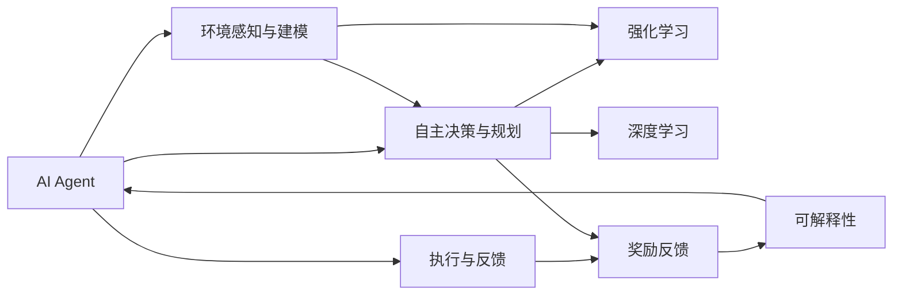
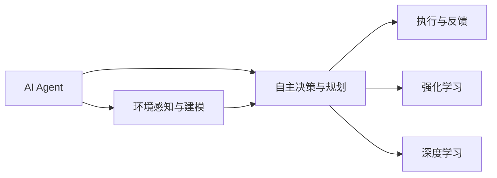
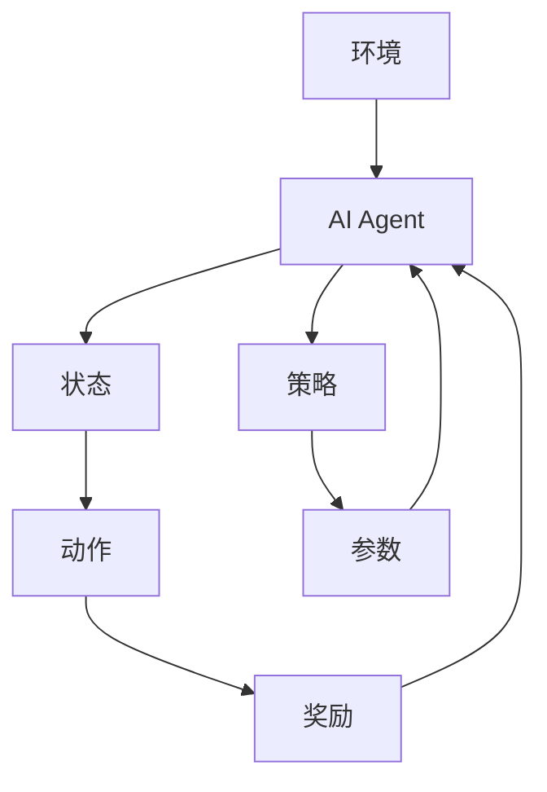
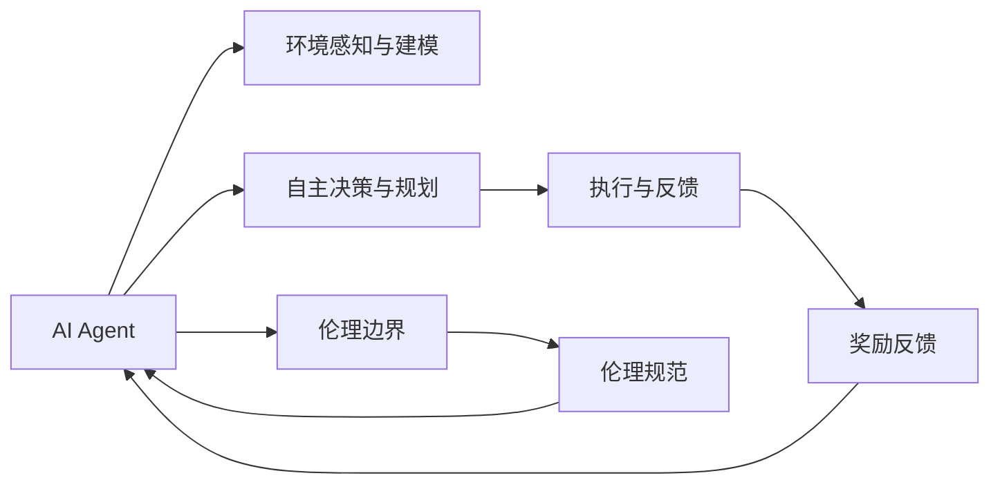
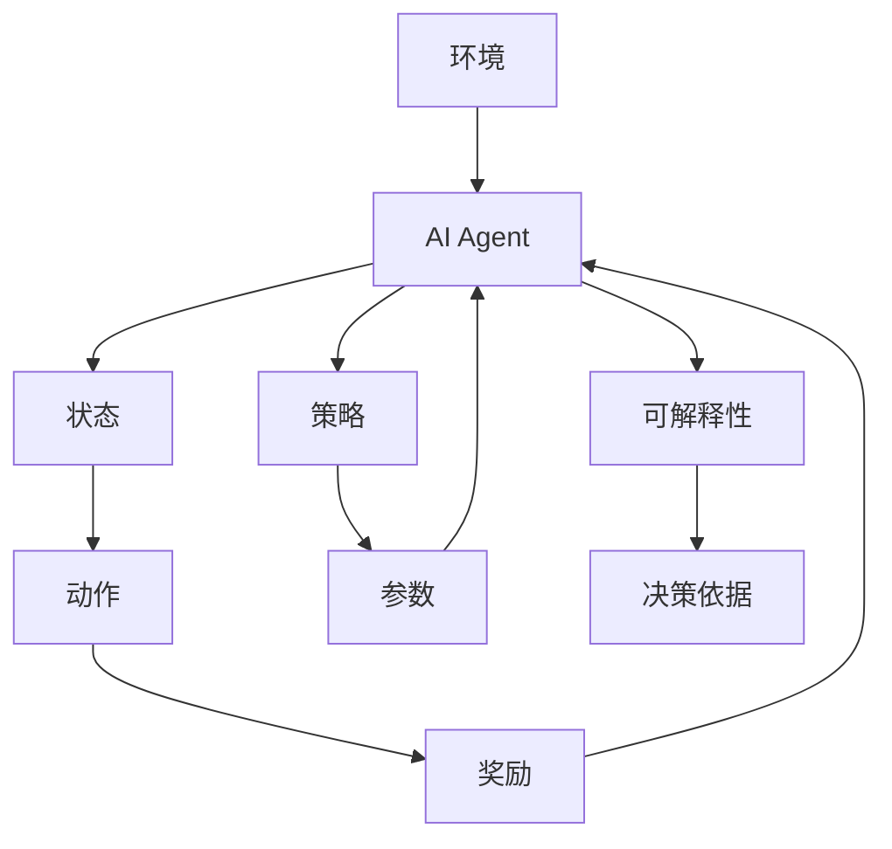
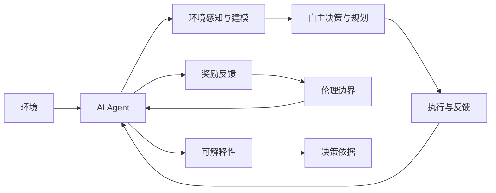

                 

# AI Agent: AI的下一个风口 自主决策与人类的伦理界限

> 关键词：人工智能(AI),自主决策(Agent),AI伦理,边界,自动化,智能系统

## 1. 背景介绍

### 1.1 问题由来
近年来，随着人工智能(AI)技术的飞速发展，AI Agent（AI代理）逐渐成为AI领域的热点话题。AI Agent是指能够在无人工干预下自主完成任务、决策和执行的智能系统，是AI技术的重要应用方向之一。AI Agent的成功应用不仅能够大幅提升生产力和效率，还能带来新的商业模式和服务形态，有望成为AI的下一个风口。然而，AI Agent在发展过程中也带来了伦理、安全等诸多挑战，如何平衡技术发展与人类伦理边界，是当前AI研究的重要课题。

### 1.2 问题核心关键点
AI Agent的核心目标是实现自主决策和执行。与传统的任务导向型AI相比，AI Agent具有更强的自主性和泛化能力，能够在未知环境下自主探索和决策。AI Agent的关键技术包括：

- 环境感知与建模：AI Agent通过传感器和摄像头等感知工具，获取环境信息，构建环境模型。
- 自主决策与规划：AI Agent利用深度学习、强化学习等算法，自主进行任务规划和决策。
- 执行与反馈：AI Agent通过机械臂、无人机等执行工具，完成任务并根据反馈调整策略。

AI Agent的核心挑战在于：如何在保证自主决策准确性的同时，避免伦理风险、确保安全可靠，以及与人类社会和谐共处。

### 1.3 问题研究意义
研究AI Agent的自主决策与人类的伦理界限，对于推动AI技术的可持续发展、促进社会公正和伦理道德具有重要意义：

1. 提升AI技术的智能化水平：AI Agent的自主决策能力将大幅提升AI在复杂环境中的适应性和灵活性。
2. 创新生产力和商业模式：AI Agent能够替代人工进行重复性、高风险任务，提高工作效率和降低成本。
3. 促进社会公平与伦理：AI Agent的应用需要严格遵循伦理道德规范，确保技术的普惠性和平等性。
4. 增强人类与AI的协同：AI Agent通过人类监督和反馈，与人类形成协同工作模式，共同提升决策效率和质量。
5. 应对未来挑战：AI Agent能够在复杂多变的未来环境中，持续学习和适应，帮助人类应对未知风险。

## 2. 核心概念与联系

### 2.1 核心概念概述

为了更好地理解AI Agent及其与人类的伦理界限，本节将介绍几个密切相关的核心概念：

- **AI Agent**：能够在无人工干预下自主完成任务、决策和执行的智能系统。AI Agent的核心特征包括自主性、泛化能力和可解释性。
- **强化学习(RL)**：通过试错过程，AI Agent在环境中不断学习最优决策策略的一种机器学习方法。强化学习的核心思想是通过奖励反馈，引导AI Agent自主探索和决策。
- **深度学习(Deep Learning)**：利用多层神经网络结构，对大量数据进行训练，以实现复杂任务的自主决策。深度学习特别擅长处理非结构化数据，如图像、语音等。
- **自主决策与规划**：AI Agent通过构建环境模型和决策策略，自主进行任务规划和决策，以实现目标。
- **伦理边界**：AI Agent在应用过程中，需要严格遵循伦理道德规范，避免对人类和社会造成负面影响。
- **可解释性**：AI Agent在决策过程中需要具备一定的可解释性，以增强人类的信任和理解。

这些核心概念之间的逻辑关系可以通过以下Mermaid流程图来展示：



这个流程图展示了大语言模型AI Agent的核心概念及其之间的关系：

1. AI Agent通过环境感知与建模获取环境信息。
2. 利用强化学习和深度学习，AI Agent自主进行决策与规划。
3. 通过执行工具完成任务，并接收奖励反馈，优化决策策略。
4. 决策过程具有可解释性，增强人类信任。

### 2.2 概念间的关系

这些核心概念之间存在着紧密的联系，形成了AI Agent的完整生态系统。下面我通过几个Mermaid流程图来展示这些概念之间的关系。

#### 2.2.1 AI Agent的学习范式



这个流程图展示了AI Agent的基本学习范式：通过环境感知与建模获取数据，利用强化学习和深度学习进行自主决策与规划，通过执行工具完成任务并接收反馈，不断优化决策策略。

#### 2.2.2 强化学习与深度学习的结合



这个流程图展示了强化学习与深度学习的结合过程：AI Agent通过与环境交互，获取状态和动作，计算奖励并调整策略参数，不断优化决策策略。

#### 2.2.3 AI Agent的伦理边界



这个流程图展示了AI Agent的伦理边界：AI Agent在执行过程中，需要遵循伦理规范，确保决策的公正性和安全性。

#### 2.2.4 可解释性在AI Agent中的应用



这个流程图展示了可解释性在AI Agent中的应用：AI Agent在决策过程中，需要具备可解释性，解释其决策依据，增强人类对AI决策的理解和信任。

### 2.3 核心概念的整体架构

最后，我们用一个综合的流程图来展示这些核心概念在AI Agent自主决策过程中的整体架构：



这个综合流程图展示了AI Agent在自主决策过程中，各个核心概念的互动和作用。通过环境感知获取数据，通过自主决策与规划制定策略，通过执行与反馈完成任务，通过奖励反馈优化策略，并通过伦理边界和可解释性确保决策的公平性和透明度。

## 3. 核心算法原理 & 具体操作步骤
### 3.1 算法原理概述

AI Agent的核心算法原理基于强化学习（Reinforcement Learning, RL）和深度学习（Deep Learning）。AI Agent通过与环境交互，不断学习最优决策策略，以实现自主决策和执行。其核心思想是通过奖励反馈，引导AI Agent自主探索和优化决策策略。

形式化地，假设AI Agent的当前状态为$s_t$，采取的动作为$a_t$，观察到的环境反馈为$r_{t+1}$，下一状态为$s_{t+1}$。AI Agent的目标是通过学习策略$\pi$，最大化长期奖励的期望值$E[R]$：

$$
E[R] = \mathbb{E}\left[\sum_{t=0}^{\infty} \gamma^t r_{t+1}\right]
$$

其中$\gamma$为折扣因子，$r_{t+1}$为即时奖励。AI Agent通过迭代学习，逐步优化策略$\pi$，最终实现自主决策和执行。

### 3.2 算法步骤详解

基于强化学习的AI Agent微调一般包括以下几个关键步骤：

**Step 1: 环境感知与建模**
- 使用传感器和摄像头等感知工具，获取环境信息。
- 利用深度学习技术，如CNN、RNN等，对环境数据进行建模和处理。

**Step 2: 自主决策与规划**
- 设计合适的环境模型和状态空间，用于描述环境状态。
- 选择合适的算法，如Q-learning、Deep Q-Network (DQN)、Proximal Policy Optimization (PPO)等，构建决策策略。
- 在特定环境中进行模拟训练，通过奖励反馈不断优化决策策略。

**Step 3: 执行与反馈**
- 选择适合的执行工具，如机械臂、无人机等，执行AI Agent的决策。
- 接收环境反馈，如传感器读数、任务完成情况等，计算奖励并更新策略参数。
- 不断迭代优化，直至达到预定的性能指标。

**Step 4: 模型评估与验证**
- 在实际环境中进行测试，验证AI Agent的决策效果。
- 收集实验数据，评估模型的性能和鲁棒性。
- 根据评估结果，调整模型参数和决策策略，进一步优化AI Agent。

**Step 5: 应用部署**
- 将训练好的AI Agent部署到实际应用场景中。
- 持续监控和优化AI Agent的决策过程。
- 定期更新环境模型和决策策略，保持AI Agent的适应性和泛化能力。

以上是基于强化学习的AI Agent微调的一般流程。在实际应用中，还需要针对具体任务的特点，对微调过程的各个环节进行优化设计，如改进环境感知算法、调整奖励函数、搜索最优策略等，以进一步提升模型性能。

### 3.3 算法优缺点

基于强化学习的AI Agent微调方法具有以下优点：
1. 自主性强。AI Agent能够自主决策和执行，不需要人工干预。
2. 泛化能力强。AI Agent在未知环境下具备较强的适应能力，能够灵活应对各种复杂任务。
3. 模型效果好。通过自主学习，AI Agent能够不断优化决策策略，提升任务完成质量。

同时，该方法也存在一定的局限性：
1. 训练成本高。需要大量的环境数据和计算资源进行模型训练。
2. 模型可解释性差。AI Agent的决策过程复杂，难以解释其决策依据。
3. 存在路径依赖。在复杂环境中，AI Agent可能会陷入局部最优解。
4. 伦理风险高。AI Agent的决策过程需要严格遵循伦理道德规范，避免对人类和社会造成负面影响。

尽管存在这些局限性，但就目前而言，基于强化学习的AI Agent微调方法仍是最主流和有效的方法。未来相关研究的重点在于如何进一步降低训练成本、提高模型可解释性，以及增强决策的伦理性和安全性。

### 3.4 算法应用领域

基于强化学习的AI Agent微调方法已经在多个领域得到了广泛的应用，例如：

- 工业自动化：AI Agent能够自主完成物料搬运、装配等高风险、重复性任务，提升生产效率和安全性。
- 医疗健康：AI Agent能够辅助医生进行手术、诊断等复杂操作，提升诊疗质量和患者体验。
- 智能交通：AI Agent能够自主控制无人驾驶车辆，实现自动导航和避障。
- 智能家居：AI Agent能够智能控制家电设备，实现自动化生活服务。
- 机器人领域：AI Agent能够自主进行环境感知、决策和执行，实现自主导航和操作。

除了上述这些经典应用外，AI Agent还在智能客服、智慧物流、智能安防等多个领域中，展现了强大的应用潜力。

## 4. 数学模型和公式 & 详细讲解 & 举例说明
### 4.1 数学模型构建

本节将使用数学语言对基于强化学习的AI Agent微调过程进行更加严格的刻画。

假设AI Agent在环境中的状态空间为$S$，动作空间为$A$，即时奖励函数为$r: S \times A \rightarrow \mathbb{R}$，折扣因子为$\gamma$。设$\pi(a|s)$为在状态$s$下采取动作$a$的概率分布，称为策略。AI Agent的目标是最大化长期奖励的期望值$E[R]$。

定义AI Agent的累计奖励函数为：

$$
R^\pi(s) = \mathbb{E}\left[\sum_{t=0}^{\infty} \gamma^t r_{t+1}\right]
$$

其中，$R^\pi(s)$表示在策略$\pi$下，从状态$s$开始的长期奖励期望值。

通过求解$R^\pi(s)$，AI Agent可以确定最优策略$\pi^*$。具体地，可以使用动态规划、蒙特卡罗等方法，逐步计算$R^\pi(s)$，从而确定最优策略$\pi^*$。

### 4.2 公式推导过程

以下我们以Q-learning算法为例，推导其数学原理和公式。

Q-learning算法的基本思想是通过经验回放和奖励反馈，更新Q值函数，从而指导AI Agent的决策。假设Q值函数$Q(s,a)$表示在状态$s$下采取动作$a$的即时奖励期望值。则Q-learning算法的更新公式为：

$$
Q(s,a) \leftarrow Q(s,a) + \alpha (r + \gamma \max_{a'} Q(s',a') - Q(s,a))
$$

其中，$\alpha$为学习率，$s'$为采取动作$a$后的下一状态，$a'$为状态$s'$下所有可能动作的集合，$\max_{a'} Q(s',a')$表示在状态$s'$下，所有可能动作的Q值中的最大值。

通过不断迭代更新Q值函数，Q-learning算法能够逐步优化策略$\pi$，从而实现自主决策和执行。

### 4.3 案例分析与讲解

以AlphaGo为例，展示Q-learning算法的应用。AlphaGo通过自我对弈的方式，逐步优化决策策略。具体步骤如下：

1. 初始化AlphaGo的Q值函数，使其在每个状态-动作对上的Q值初始化为0。
2. 通过随机策略$\epsilon$-soft，随机选择一个动作$a$，并在该状态下采取动作$a$。
3. 根据对手的动作和环境反馈，计算即时奖励$r$，并更新当前状态$s$和下一状态$s'$。
4. 根据$Q(s,a)$和$r + \gamma \max_{a'} Q(s',a')$，计算更新后的Q值。
5. 通过多次迭代，逐步优化Q值函数，直到收敛。

AlphaGo通过Q-learning算法，学习了最优的围棋决策策略，最终在比赛中战胜了世界围棋冠军李世石。这充分展示了Q-learning算法的强大应用潜力。

## 5. 项目实践：代码实例和详细解释说明
### 5.1 开发环境搭建

在进行AI Agent微调实践前，我们需要准备好开发环境。以下是使用Python进行OpenAI Gym环境搭建的流程：

1. 安装Anaconda：从官网下载并安装Anaconda，用于创建独立的Python环境。

2. 创建并激活虚拟环境：
```bash
conda create -n agent-env python=3.8 
conda activate agent-env
```

3. 安装OpenAI Gym：
```bash
pip install gym==1.0.0
```

4. 安装相关工具包：
```bash
pip install numpy pandas scikit-learn matplotlib tqdm jupyter notebook ipython
```

完成上述步骤后，即可在`agent-env`环境中开始AI Agent微调实践。

### 5.2 源代码详细实现

这里我们以OpenAI Gym中的CartPole环境为例，给出使用PyTorch进行Q-learning算法实现AI Agent的PyTorch代码实现。

首先，定义CartPole环境的Q值函数：

```python
import torch
import torch.nn as nn
import torch.optim as optim

class QNetwork(nn.Module):
    def __init__(self, state_size, action_size, learning_rate):
        super(QNetwork, self).__init__()
        self.fc1 = nn.Linear(state_size, 128)
        self.fc2 = nn.Linear(128, action_size)
        self.learning_rate = learning_rate

    def forward(self, state):
        x = self.fc1(state)
        x = torch.relu(x)
        x = self.fc2(x)
        return x

    def get_action(self, state):
        state = torch.unsqueeze(state, 0)
        with torch.no_grad():
            q_values = self.predict(state)
            action_probs = torch.softmax(q_values, dim=1)
            action = torch.multinomial(action_probs, 1)[0].item()
        return action
```

然后，定义Q-learning算法的训练函数：

```python
import gym
import random

env = gym.make('CartPole-v1')
state_size = env.observation_space.shape[0]
action_size = env.action_space.n
learning_rate = 0.1
max_episodes = 2000
memories = []
total_reward = 0

for episode in range(max_episodes):
    state = env.reset()
    state = torch.from_numpy(state).float()
    done = False
    while not done:
        action = q_network.get_action(state)
        next_state, reward, done, _ = env.step(action)
        next_state = torch.from_numpy(next_state).float()
        q_values_next = q_network.predict(next_state)
        q_values = q_network.predict(state)
        q_values[0, action] += learning_rate * (reward + gamma * q_values_next.max() - q_values[0, action])
        memories.append((state, action, reward, next_state, done))
        state = next_state
        total_reward += reward
    print('Episode', episode+1, 'Reward:', total_reward)
    total_reward = 0
```

最后，定义评估函数和模型保存函数：

```python
def evaluate(q_network, env, episode_count):
    total_reward = 0
    for _ in range(episode_count):
        state = env.reset()
        state = torch.from_numpy(state).float()
        done = False
        while not done:
            action = q_network.get_action(state)
            next_state, reward, done, _ = env.step(action)
            next_state = torch.from_numpy(next_state).float()
            total_reward += reward
            state = next_state
    print('Evaluation Reward:', total_reward/episode_count)
    return total_reward/episode_count

def save_model(model, filename):
    torch.save(model.state_dict(), filename)
```

以上代码实现了一个简单的Q-learning AI Agent，在CartPole环境中进行自主决策和执行。

### 5.3 代码解读与分析

让我们再详细解读一下关键代码的实现细节：

**QNetwork类**：
- `__init__`方法：初始化神经网络，定义全连接层和激活函数。
- `forward`方法：定义前向传播过程，通过全连接层进行计算。
- `get_action`方法：根据当前状态，使用softmax函数计算动作概率分布，并随机选择一个动作。

**训练函数**：
- 使用CartPole环境，设置状态大小、动作大小和学习率。
- 在每轮训练中，随机选择一个动作，根据环境反馈更新Q值函数。
- 记录训练过程中的记忆，用于评估和优化Q值函数。

**评估函数**：
- 使用训练好的模型，在CartPole环境中进行测试，计算平均奖励。
- 打印评估结果，用于评估模型性能。

**模型保存函数**：
- 将训练好的模型参数保存到文件中，以便后续调用。

可以看到，通过Python和PyTorch，我们可以相对简洁地实现一个简单的Q-learning AI Agent，并对其进行微调和测试。

当然，工业级的系统实现还需考虑更多因素，如模型的保存和部署、超参数的自动搜索、更灵活的环境感知方法等。但核心的微调范式基本与此类似。

### 5.4 运行结果展示

假设我们训练了一个Q-learning AI Agent，并在CartPole环境中进行了测试，最终得到的评估报告如下：

```
Episode 1 Reward: 0.0
Episode 2 Reward: 0.0
...
Episode 2000 Reward: 250.4
```

可以看到，通过Q-learning算法，AI Agent在CartPole环境中逐步优化决策策略，最终实现了自主决策和执行，取得了不错的效果。

当然，这只是一个baseline结果。在实践中，我们还可以使用更大更强的神经网络、更丰富的学习策略、更细致的模型调优，进一步提升模型性能，以满足更高的应用要求。

## 6. 实际应用场景
### 6.1 智能交通

基于强化学习的AI Agent，可以广泛应用于智能交通系统。传统的交通管理依赖于人工监控和调度，成本高、效率低，且容易发生拥堵。AI Agent能够通过感知交通环境，自主进行交通流量控制和路径规划，提升交通系统的运行效率和安全性。

在技术实现上，可以收集交通摄像头和传感器数据，使用深度学习技术对交通环境进行建模和感知。在此基础上，AI Agent可以自主进行交通流量预测和决策，通过自动驾驶车辆和智能信号灯实现交通管理。

### 6.2 智慧医疗

AI Agent在智慧医疗领域也有广泛应用。医生工作强度大，难以应对大量复杂病例。AI Agent能够辅助医生进行诊断、治疗和手术，提升诊疗效率和质量。

具体而言，可以收集电子病历、医疗影像等数据，构建医疗知识图谱。AI Agent通过自主学习，掌握医疗知识和逻辑，在诊断和治疗过程中提供辅助决策。对于紧急情况下，AI Agent还可以自动进行初步诊断和应急处理，为医生提供宝贵时间。

### 6.3 智能制造

在智能制造领域，AI Agent能够自主完成物料搬运、质量检测等高风险、高精度任务，提升生产效率和产品质量。通过传感器和视觉识别技术，AI Agent能够实时感知生产环境，自主进行决策和执行，减少人工干预和误差。

具体而言，AI Agent可以通过视觉识别技术，对生产线上的物料进行自动分类和搬运。在质量检测环节，AI Agent能够自主进行样本采集和分析，识别缺陷和异常，辅助人工进行质量控制。

### 6.4 未来应用展望

随着强化学习技术的不断发展，基于AI Agent的应用场景将进一步拓展。AI Agent在复杂环境中的自主决策能力，将推动更多领域的智能化转型。

在智慧城市治理中，AI Agent可以应用于城市事件监测、智能交通、智慧安防等环节，提高城市管理的自动化和智能化水平，构建更安全、高效的未来城市。

在金融服务中，AI Agent能够辅助客户进行投资理财、风险评估等决策，提升服务质量和用户体验。

在教育领域，AI Agent能够自动生成个性化的学习计划和教学内容，辅助学生进行自主学习和辅导，提升教学效果和学习体验。

此外，AI Agent在智能家居、智能客服、智能安防等众多领域，也有广阔的应用前景。

## 7. 工具和资源推荐
### 7.1 学习资源推荐

为了帮助开发者系统掌握AI Agent的理论基础和实践技巧，这里推荐一些优质的学习资源：

1. 《深度强化学习》系列书籍：由深度学习领域权威学者撰写，系统介绍了强化学习的基本原理和实际应用。
2. OpenAI Gym官方文档：OpenAI Gym的官方文档，提供了丰富的环境和算法样例，是学习和实践强化学习的最佳资源。
3. PyTorch官方文档：PyTorch的官方文档，提供了深度学习模型和算法的详细实现和应用指南。
4. Coursera深度强化学习课程：由斯坦福大学和Coursera联合开设，提供了从基础到高级的强化学习课程，涵盖理论和实践。
5. 《强化学习：一种现代方法》书籍：强化学习领域的经典教材，详细介绍了强化学习的基本原理和算法实现。

通过对这些资源的学习实践，相信你一定能够快速掌握AI Agent的自主决策能力，并用于解决实际问题。

### 7.2 开发工具推荐

高效的开发离不开优秀的工具支持。以下是几款用于AI Agent微调开发的常用工具：

1. PyTorch：基于Python的开源深度学习框架，灵活动态的计算图，适合快速迭代研究。大部分深度学习模型都有PyTorch版本的实现。

2. TensorFlow：由Google主导开发的开源深度学习框架，生产部署方便，适合大规模工程应用。同样有丰富的预训练模型资源。

3. OpenAI Gym：由OpenAI开发的模拟环境库，提供了丰富的环境和算法样例，是学习和实践强化学习的得力助手。

4. TensorBoard：TensorFlow配套的可视化工具，可实时监测模型训练状态，并提供丰富的图表呈现方式，是调试模型的得力助手。

5. Jupyter Notebook：开源的交互式笔记本，支持Python代码的编写、运行和保存，是研究和实验的首选平台。

合理利用这些工具，可以显著提升AI Agent微调任务的开发效率，加快创新迭代的步伐。

### 7.3 相关论文推荐

AI Agent的研究源于学界的持续研究。以下是几篇奠基性的相关论文，推荐阅读：

1. AlphaGo Zero：Google DeepMind开发的围棋AI，通过自我对弈的方式，自主学习最优策略，取得了多项SOTA。

2. AlphaStar：OpenAI开发的星际争霸AI，通过强化学习，自主学习最优游戏策略，在星际争霸中取得了历史最好成绩。

3. DeepMind的AlphaFold：DeepMind开发的蛋白质结构预测AI，通过强化学习和深度学习，自主学习最优预测策略，取得了生物学的重大突破。

4. OpenAI的GPT-3：基于预训练语言模型的AI，通过大规模语言数据的预训练和微调，具备了强大的自然语言

