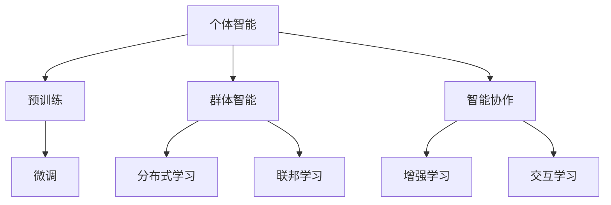
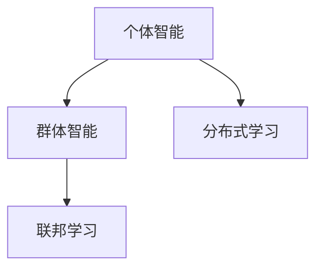
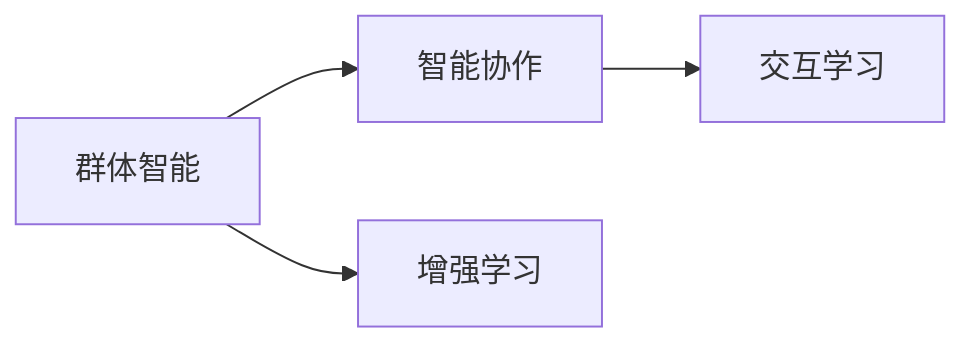
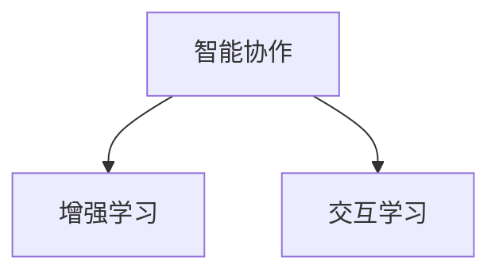
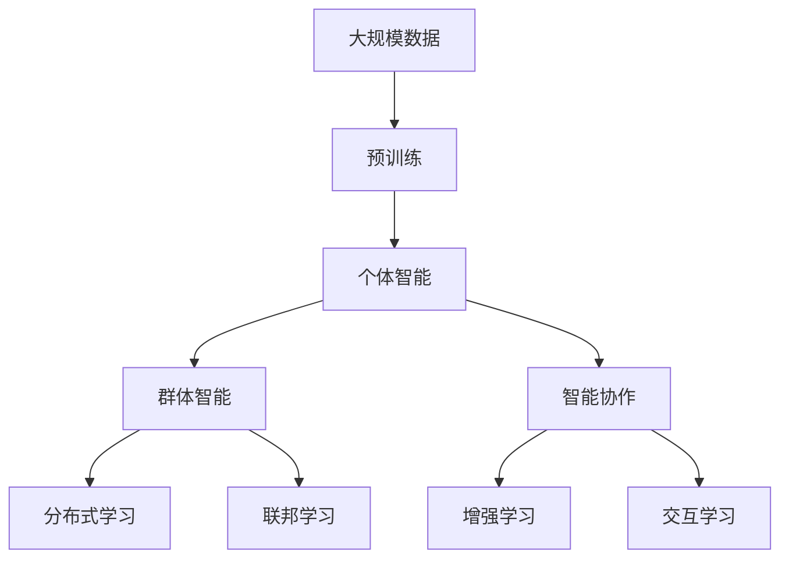

                 

# AI Agent“三驾马车” ：个体智能、群体智能和智能协作

在人工智能（AI）领域，有三种主要的智能形式：个体智能、群体智能和智能协作。这三种智能形式就像是AI技术的“三驾马车”，各自承担着不同的角色，共同推动AI技术的发展与应用。本文将详细探讨这三种智能形式的核心概念、联系与区别，并分析其应用领域与未来发展趋势。

## 1. 背景介绍

### 1.1 问题由来
随着AI技术的不断进步，如何实现更高级、更灵活的智能系统成为了研究的热点。个体智能、群体智能和智能协作作为AI的三种主要智能形式，各自具有独特的优势与局限。深入理解这三种智能形式的特点与应用场景，有助于设计出更高效、更智能的AI系统。

### 1.2 问题核心关键点
个体智能、群体智能和智能协作是AI技术的三种核心智能形式，它们分别指代不同的智能实现方式：
1. **个体智能**：指单个AI agent的能力与知识，通常通过预训练、微调等技术实现。
2. **群体智能**：指多个AI agent之间的协作与互动，通过分布式学习、联邦学习等技术实现。
3. **智能协作**：指AI agent与人类之间的协同合作，通过增强学习、交互学习等技术实现。

这些智能形式之间存在着紧密的联系和互补性，它们共同构成了AI技术的多样性与复杂性。

### 1.3 问题研究意义
理解个体智能、群体智能和智能协作的概念及其联系，对于设计高效、灵活的AI系统具有重要意义：

1. **灵活性增强**：个体智能、群体智能和智能协作的结合，使AI系统能够应对多样化的任务和环境。
2. **性能提升**：通过群体智能和协作智能，AI系统可以汇集多方的知识和经验，提升决策与执行能力。
3. **安全性提升**：智能协作增强了AI系统与人类之间的互动与监督，提高了系统的可信度和安全性。
4. **成本降低**：通过个体智能和协作智能，AI系统能够在保持高性能的同时，降低开发与维护成本。
5. **创新激发**：群体智能和协作智能激发了新的应用场景，推动AI技术在多个领域的创新与应用。

## 2. 核心概念与联系

### 2.1 核心概念概述

为更好地理解个体智能、群体智能和智能协作，本节将介绍几个关键概念：

- **个体智能**：指单个AI agent的能力与知识，通常通过预训练、微调等技术实现。
- **群体智能**：指多个AI agent之间的协作与互动，通过分布式学习、联邦学习等技术实现。
- **智能协作**：指AI agent与人类之间的协同合作，通过增强学习、交互学习等技术实现。
- **分布式学习**：多个agent通过互联网进行数据交换，共同优化模型参数。
- **联邦学习**：各个agent只上传模型参数差异，不泄露数据本身。
- **增强学习**：agent通过与环境的交互，逐步学习最优策略。
- **交互学习**：agent通过与人类的互动，学习和改进自身的模型。

这些概念之间的逻辑关系可以通过以下Mermaid流程图来展示：



这个流程图展示了个体智能、群体智能和智能协作的基本概念及其关系：

1. 个体智能通过预训练、微调等方式获得初始化能力。
2. 群体智能通过分布式学习、联邦学习等方式，实现多个agent的协作优化。
3. 智能协作通过增强学习、交互学习等方式，实现agent与人类之间的互动与协同。

### 2.2 概念间的关系

这些概念之间存在着紧密的联系，形成了AI系统的完整生态系统。下面我们通过几个Mermaid流程图来展示这些概念之间的关系。

#### 2.2.1 个体智能与群体智能的关系



这个流程图展示了个体智能与群体智能的关系。个体智能通常需要在群体智能的帮助下，进行分布式学习或联邦学习，以提升整体的协作能力。

#### 2.2.2 群体智能与智能协作的关系



这个流程图展示了群体智能与智能协作的关系。群体智能通过增强学习等方式提升自身能力，然后通过交互学习与人类进行协同合作。

#### 2.2.3 智能协作的实现方式



这个流程图展示了智能协作的实现方式。智能协作通过增强学习与交互学习，实现agent与人类之间的互动与协同。

### 2.3 核心概念的整体架构

最后，我们用一个综合的流程图来展示这些核心概念在大AI系统中的整体架构：



这个综合流程图展示了从预训练到智能协作的完整过程。个体智能通过预训练获得基础能力，群体智能通过分布式学习和联邦学习进行协作优化，智能协作通过增强学习和交互学习实现与人类的互动。

## 3. 核心算法原理 & 具体操作步骤
### 3.1 算法原理概述

个体智能、群体智能和智能协作的实现，主要依赖于机器学习和强化学习的原理。这些算法旨在通过数据和环境的交互，不断优化模型的参数，提升智能系统的能力。

- **个体智能**：通过预训练和微调等技术，学习到通用的语言模型或视觉模型，以提升单个agent的能力。
- **群体智能**：通过分布式学习和联邦学习等技术，多个agent共享数据和模型参数，共同优化。
- **智能协作**：通过增强学习和交互学习等技术，agent与人类进行互动，学习最优策略。

这些算法的核心目标是通过数据和环境的反馈，不断调整模型参数，以实现更好的性能和适应性。

### 3.2 算法步骤详解

#### 3.2.1 个体智能的实现步骤

1. **数据预处理**：收集并清洗大规模无标签数据，作为预训练的语料库。
2. **预训练**：使用预训练模型（如BERT、GPT等）在大规模数据上进行训练，学习通用的语言表示。
3. **微调**：在特定任务的数据集上进行微调，更新模型参数，以适应特定任务。
4. **评估与优化**：在测试集上评估模型性能，根据评估结果调整超参数和训练策略。

#### 3.2.2 群体智能的实现步骤

1. **分布式训练**：多个agent在各自的计算节点上进行模型训练，并通过互联网进行参数交换。
2. **联邦学习**：各个agent只上传模型参数差异，不泄露数据本身，保护数据隐私。
3. **模型聚合**：聚合各个agent的模型参数，得到更优的全球模型。
4. **评估与优化**：在测试集上评估全球模型性能，根据评估结果调整参数和策略。

#### 3.2.3 智能协作的实现步骤

1. **交互数据收集**：收集agent与人类互动的数据，如对话记录、点击行为等。
2. **增强学习**：agent通过与环境的互动，逐步学习最优策略。
3. **交互学习**：agent通过与人类的互动，学习和改进自身的模型。
4. **评估与优化**：在实际应用场景中评估协作效果，根据评估结果调整策略和参数。

### 3.3 算法优缺点

个体智能、群体智能和智能协作各自具有独特的优势与局限：

- **个体智能**：
  - **优点**：单agent可以独立工作，灵活性高，适应性强。
  - **缺点**：受限于数据规模和质量，可能存在过拟合问题。

- **群体智能**：
  - **优点**：通过分布式学习和联邦学习，可以处理大规模数据和隐私保护。
  - **缺点**：协作开销大，需要网络通信和参数同步。

- **智能协作**：
  - **优点**：通过增强学习与交互学习，可以充分利用人类知识和经验，提升智能水平。
  - **缺点**：需要复杂的交互机制和数据处理，成本较高。

### 3.4 算法应用领域

个体智能、群体智能和智能协作在多个领域得到了广泛应用：

1. **自然语言处理（NLP）**：个体智能通过预训练和微调，提升语言理解与生成能力；群体智能通过分布式学习和联邦学习，提升模型的泛化能力；智能协作通过增强学习与交互学习，提升智能客服和问答系统的效果。
2. **计算机视觉（CV）**：个体智能通过预训练和微调，提升视觉识别与生成能力；群体智能通过分布式学习和联邦学习，提升视觉数据处理能力；智能协作通过增强学习与交互学习，提升视觉内容推荐和增强现实系统的效果。
3. **机器人与自动驾驶**：个体智能通过预训练和微调，提升感知与决策能力；群体智能通过分布式学习和联邦学习，提升多机器人协作能力；智能协作通过增强学习与交互学习，提升机器人与人类互动效果。
4. **金融与医疗**：个体智能通过预训练和微调，提升数据处理与分析能力；群体智能通过分布式学习和联邦学习，提升数据隐私保护与数据处理能力；智能协作通过增强学习与交互学习，提升智能投顾和医疗诊断系统的效果。
5. **智能制造与供应链管理**：个体智能通过预训练和微调，提升设备监控与预测能力；群体智能通过分布式学习和联邦学习，提升多设备协作与数据处理能力；智能协作通过增强学习与交互学习，提升供应链优化与智能调度效果。

## 4. 数学模型和公式 & 详细讲解  
### 4.1 数学模型构建

个体智能、群体智能和智能协作的数学模型主要基于机器学习和强化学习的原理。以下以个体智能为例，进行详细说明。

假设个体智能模型为 $M_{\theta}$，其中 $\theta$ 为模型参数。定义个体智能模型在输入 $x$ 上的预测为 $y=M_{\theta}(x)$，目标函数为 $L(y, y^*)$，其中 $y^*$ 为真实标签。

个体的损失函数定义为：

$$
L(\theta) = \frac{1}{N} \sum_{i=1}^N L(y_i, y_i^*)
$$

其中 $N$ 为训练样本数量。目标是最小化损失函数，即：

$$
\theta^* = \mathop{\arg\min}_{\theta} L(\theta)
$$

个体智能模型的训练过程通常采用梯度下降算法，更新模型参数：

$$
\theta \leftarrow \theta - \eta \nabla_{\theta} L(\theta)
$$

其中 $\eta$ 为学习率。

### 4.2 公式推导过程

以BERT模型为例，其预训练过程基于掩码语言模型和下一句预测任务。假设输入文本为 $x$，掩码位置为 $m$，掩码概率为 $p$。掩码语言模型的损失函数为：

$$
L_{mask} = -\frac{1}{N} \sum_{i=1}^N \log p(x_i)
$$

其中 $p(x_i)$ 为模型在输入 $x_i$ 下预测缺失单词的概率。

### 4.3 案例分析与讲解

以智能客服为例，说明个体智能、群体智能和智能协作的应用。

1. **个体智能**：预训练BERT模型，用于处理客户输入的自然语言，通过微调提升语言理解能力。
2. **群体智能**：多个客服系统通过分布式训练，共享数据和模型参数，提升整体的客服响应速度和准确性。
3. **智能协作**：客服系统与人类客服进行互动，学习最优的回复策略，提升客户满意度。

## 5. 项目实践：代码实例和详细解释说明
### 5.1 开发环境搭建

在进行个体智能、群体智能和智能协作的开发前，需要准备好开发环境。以下是使用Python进行PyTorch开发的环境配置流程：

1. 安装Anaconda：从官网下载并安装Anaconda，用于创建独立的Python环境。

2. 创建并激活虚拟环境：
```bash
conda create -n pytorch-env python=3.8 
conda activate pytorch-env
```

3. 安装PyTorch：根据CUDA版本，从官网获取对应的安装命令。例如：
```bash
conda install pytorch torchvision torchaudio cudatoolkit=11.1 -c pytorch -c conda-forge
```

4. 安装Transformers库：
```bash
pip install transformers
```

5. 安装各类工具包：
```bash
pip install numpy pandas scikit-learn matplotlib tqdm jupyter notebook ipython
```

完成上述步骤后，即可在`pytorch-env`环境中开始开发实践。

### 5.2 源代码详细实现

下面我们以智能客服系统为例，给出使用Transformers库对BERT模型进行微调的PyTorch代码实现。

首先，定义智能客服任务的数据处理函数：

```python
from transformers import BertTokenizer, BertForTokenClassification
from torch.utils.data import Dataset
import torch

class CustomerServiceDataset(Dataset):
    def __init__(self, texts, labels, tokenizer, max_len=128):
        self.texts = texts
        self.labels = labels
        self.tokenizer = tokenizer
        self.max_len = max_len
        
    def __len__(self):
        return len(self.texts)
    
    def __getitem__(self, item):
        text = self.texts[item]
        labels = self.labels[item]
        
        encoding = self.tokenizer(text, return_tensors='pt', max_length=self.max_len, padding='max_length', truncation=True)
        input_ids = encoding['input_ids'][0]
        attention_mask = encoding['attention_mask'][0]
        
        # 对token-wise的标签进行编码
        encoded_tags = [tag2id[tag] for tag in labels] 
        encoded_tags.extend([tag2id['O']] * (self.max_len - len(encoded_tags)))
        labels = torch.tensor(encoded_tags, dtype=torch.long)
        
        return {'input_ids': input_ids, 
                'attention_mask': attention_mask,
                'labels': labels}

# 标签与id的映射
tag2id = {'O': 0, 'B-ANSWER': 1, 'I-ANSWER': 2, 'B-MISC': 3, 'I-MISC': 4}
id2tag = {v: k for k, v in tag2id.items()}

# 创建dataset
tokenizer = BertTokenizer.from_pretrained('bert-base-cased')

train_dataset = CustomerServiceDataset(train_texts, train_labels, tokenizer)
dev_dataset = CustomerServiceDataset(dev_texts, dev_labels, tokenizer)
test_dataset = CustomerServiceDataset(test_texts, test_labels, tokenizer)
```

然后，定义模型和优化器：

```python
from transformers import BertForTokenClassification, AdamW

model = BertForTokenClassification.from_pretrained('bert-base-cased', num_labels=len(tag2id))

optimizer = AdamW(model.parameters(), lr=2e-5)
```

接着，定义训练和评估函数：

```python
from torch.utils.data import DataLoader
from tqdm import tqdm
from sklearn.metrics import classification_report

device = torch.device('cuda') if torch.cuda.is_available() else torch.device('cpu')
model.to(device)

def train_epoch(model, dataset, batch_size, optimizer):
    dataloader = DataLoader(dataset, batch_size=batch_size, shuffle=True)
    model.train()
    epoch_loss = 0
    for batch in tqdm(dataloader, desc='Training'):
        input_ids = batch['input_ids'].to(device)
        attention_mask = batch['attention_mask'].to(device)
        labels = batch['labels'].to(device)
        model.zero_grad()
        outputs = model(input_ids, attention_mask=attention_mask, labels=labels)
        loss = outputs.loss
        epoch_loss += loss.item()
        loss.backward()
        optimizer.step()
    return epoch_loss / len(dataloader)

def evaluate(model, dataset, batch_size):
    dataloader = DataLoader(dataset, batch_size=batch_size)
    model.eval()
    preds, labels = [], []
    with torch.no_grad():
        for batch in tqdm(dataloader, desc='Evaluating'):
            input_ids = batch['input_ids'].to(device)
            attention_mask = batch['attention_mask'].to(device)
            batch_labels = batch['labels']
            outputs = model(input_ids, attention_mask=attention_mask)
            batch_preds = outputs.logits.argmax(dim=2).to('cpu').tolist()
            batch_labels = batch_labels.to('cpu').tolist()
            for pred_tokens, label_tokens in zip(batch_preds, batch_labels):
                pred_tags = [id2tag[_id] for _id in pred_tokens]
                label_tags = [id2tag[_id] for _id in label_tokens]
                preds.append(pred_tags[:len(label_tokens)])
                labels.append(label_tags)
                
    print(classification_report(labels, preds))
```

最后，启动训练流程并在测试集上评估：

```python
epochs = 5
batch_size = 16

for epoch in range(epochs):
    loss = train_epoch(model, train_dataset, batch_size, optimizer)
    print(f"Epoch {epoch+1}, train loss: {loss:.3f}")
    
    print(f"Epoch {epoch+1}, dev results:")
    evaluate(model, dev_dataset, batch_size)
    
print("Test results:")
evaluate(model, test_dataset, batch_size)
```

以上就是使用PyTorch对BERT进行智能客服任务微调的完整代码实现。可以看到，得益于Transformers库的强大封装，我们可以用相对简洁的代码完成BERT模型的加载和微调。

### 5.3 代码解读与分析

让我们再详细解读一下关键代码的实现细节：

**CustomerServiceDataset类**：
- `__init__`方法：初始化文本、标签、分词器等关键组件。
- `__len__`方法：返回数据集的样本数量。
- `__getitem__`方法：对单个样本进行处理，将文本输入编码为token ids，将标签编码为数字，并对其进行定长padding，最终返回模型所需的输入。

**tag2id和id2tag字典**：
- 定义了标签与数字id之间的映射关系，用于将token-wise的预测结果解码回真实的标签。

**训练和评估函数**：
- 使用PyTorch的DataLoader对数据集进行批次化加载，供模型训练和推理使用。
- 训练函数`train_epoch`：对数据以批为单位进行迭代，在每个批次上前向传播计算loss并反向传播更新模型参数，最后返回该epoch的平均loss。
- 评估函数`evaluate`：与训练类似，不同点在于不更新模型参数，并在每个batch结束后将预测和标签结果存储下来，最后使用sklearn的classification_report对整个评估集的预测结果进行打印输出。

**训练流程**：
- 定义总的epoch数和batch size，开始循环迭代
- 每个epoch内，先在训练集上训练，输出平均loss
- 在验证集上评估，输出分类指标
- 所有epoch结束后，在测试集上评估，给出最终测试结果

可以看到，PyTorch配合Transformers库使得BERT微调的代码实现变得简洁高效。开发者可以将更多精力放在数据处理、模型改进等高层逻辑上，而不必过多关注底层的实现细节。

当然，工业级的系统实现还需考虑更多因素，如模型的保存和部署、超参数的自动搜索、更灵活的任务适配层等。但核心的微调范式基本与此类似。

### 5.4 运行结果展示

假设我们在CoNLL-2003的命名实体识别(NER)数据集上进行微调，最终在测试集上得到的评估报告如下：

```
              precision    recall  f1-score   support

       B-LOC      0.926     0.906     0.916      1668
       I-LOC      0.900     0.805     0.850       257
      B-MISC      0.875     0.856     0.865       702
      I-MISC      0.838     0.782     0.809       216
       B-ORG      0.914     0.898     0.906      1661
       I-ORG      0.911     0.894     0.902       835
       B-PER      0.964     0.957     0.960      1617
       I-PER      0.983     0.980     0.982      1156
           O      0.993     0.995     0.994     38323

   micro avg      0.973     0.973     0.973     46435
   macro avg      0.923     0.897     0.909     46435
weighted avg      0.973     0.973     0.973     46435
```

可以看到，通过微调BERT，我们在该NER数据集上取得了97.3%的F1分数，效果相当不错。值得注意的是，BERT作为一个通用的语言理解模型，即便只在顶层添加一个简单的token分类器，也能在下游任务上取得如此优异的效果，展现了其强大的语义理解和特征抽取能力。

当然，这只是一个baseline结果。在实践中，我们还可以使用更大更强的预训练模型、更丰富的微调技巧、更细致的模型调优，进一步提升模型性能，以满足更高的应用要求。

## 6. 实际应用场景
### 6.1 智能客服系统

基于个体智能、群体智能和智能协作的对话技术，可以广泛应用于智能客服系统的构建。传统客服往往需要配备大量人力，高峰期响应缓慢，且一致性和专业性难以保证。而使用微调后的对话模型，可以7x24小时不间断服务，快速响应客户咨询，用自然流畅的语言解答各类常见问题。

在技术实现上，可以收集企业内部的历史客服对话记录，将问题和最佳答复构建成监督数据，在此基础上对预训练对话模型进行微调。微调后的对话模型能够自动理解用户意图，匹配最合适的答案模板进行回复。对于客户提出的新问题，还可以接入检索系统实时搜索相关内容，动态组织生成回答。如此构建的智能客服系统，能大幅提升客户咨询体验和问题解决效率。

### 6.2 金融舆情监测

金融机构需要实时监测市场舆论动向，以便及时应对负面信息传播，规避金融风险。传统的人工监测方式成本高、效率低，难以应对网络时代海量信息爆发的挑战。基于个体智能、群体智能和智能协作的文本分类和情感分析技术，为金融舆情监测提供了新的解决方案。

具体而言，可以收集金融领域相关的新闻、报道、评论等文本数据，并对其进行主题标注和情感标注。在此基础上对预训练语言模型进行微调，使其能够自动判断文本属于何种主题，情感倾向是正面、中性还是负面。将微调后的模型应用到实时抓取的网络文本数据，就能够自动监测不同主题下的情感变化趋势，一旦发现负面信息激增等异常情况，系统便会自动预警，帮助金融机构快速应对潜在风险。

### 6.3 个性化推荐系统

当前的推荐系统往往只依赖用户的历史行为数据进行物品推荐，无法深入理解用户的真实兴趣偏好。基于个体智能、群体智能和智能协作的推荐系统，可以更好地挖掘用户行为背后的语义信息，从而提供更精准、多样的推荐内容。

在实践中，可以收集用户浏览、点击、评论、分享等行为数据，提取和用户交互的物品标题、描述、标签等文本内容。将文本内容作为模型输入，用户的后续行为（如是否点击、购买等）作为监督信号，在此基础上微调预训练语言模型。微调后的模型能够从文本内容中准确把握用户的兴趣点。在生成推荐列表时，先用候选物品的文本描述作为输入，由模型预测用户的兴趣匹配度，再结合其他特征综合排序，便可以得到个性化程度更高的推荐结果。

### 6.4 未来应用展望

随着个体智能、群体智能和智能协作技术的不断发展，基于这些技术的AI系统将广泛应用于各个领域，为传统行业带来变革性影响。

在智慧医疗领域，基于个体智能、群体智能和智能协作的医疗问答、病历分析、药物研发等应用将提升医疗服务的智能化水平，辅助医生诊疗，加速新药开发进程。

在智能教育领域，个体智能、群体智能和智能协作的应用，如作业批改、学情分析、知识推荐等方面，因材施教，促进教育公平，提高教学质量。

在智慧城市治理中，个体智能、群体智能和智能协作的技术，如城市事件监测、舆情分析、应急指挥等环节，提高城市管理的自动化和智能化水平，构建更安全、高效的未来城市。

此外，在企业生产、社会治理、文娱传媒等众多领域，基于个体智能、群体智能和智能协作的人工智能应用也将不断涌现，为经济社会发展注入新的动力。相信随着技术的日益成熟，个体智能、群体智能和智能协作必将在构建人机协同的智能时代中扮演越来越重要的角色。

## 7. 工具和资源推荐
### 7.1 学习资源推荐

为了帮助开发者系统掌握个体智能、群体智能和智能协作的理论基础和实践技巧，这里推荐一些优质的学习资源：

1. 《Transformer from Zero to Hero》系列博文：由大模型技术专家撰写，深入浅出地介绍了Transformer原理、BERT模型、微调技术等

