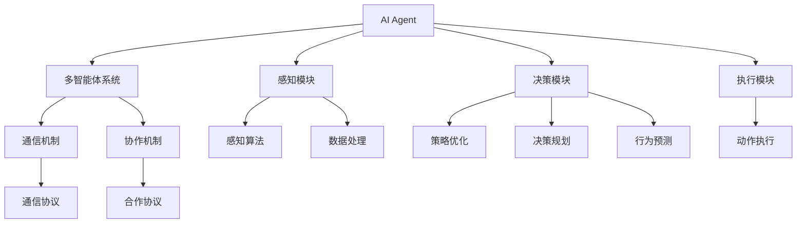
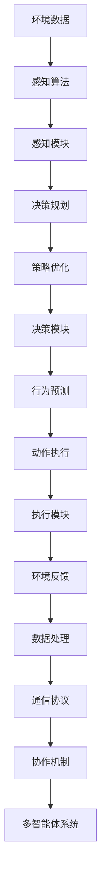

                 

# AI Agent构建的技术要点

> 关键词：AI Agent, 多智能体系统, 强化学习, 深度学习, 自适应算法, 智能决策, 协同学习

## 1. 背景介绍

### 1.1 问题由来
在现代社会，人工智能（AI）技术在各个领域的应用已经广泛展开，从医疗、金融到教育、娱乐等，AI正逐渐改变着我们的生活方式。然而，AI技术的实际应用场景往往需要多个AI组件协同工作，才能完成复杂的任务。这就引出了一个新的话题：构建AI Agent。AI Agent是指在特定环境或任务中，能够自主执行一系列智能决策的AI实体。它通过感知环境、分析情况、规划路径和执行动作等过程，达到预定的目标。

构建AI Agent是AI技术发展的关键一环，能够极大地提升AI系统的智能化水平。然而，AI Agent的构建过程复杂，涉及多方面的技术挑战。本文将从核心概念、算法原理、操作步骤和具体实现等方面，深入探讨构建AI Agent的技术要点，为读者提供全面而系统的指导。

### 1.2 问题核心关键点
构建AI Agent的核心在于设计、训练和优化一个能够自主决策、适应环境变化的智能实体。以下是构建AI Agent过程中的一些关键点：

- **多智能体系统**：AI Agent通常需要在多智能体系统中工作，与环境和其他AI实体进行交互。设计高效的通信和协作机制是构建成功AI Agent的重要前提。

- **强化学习（Reinforcement Learning, RL）**：AI Agent的核心学习机制是强化学习，通过与环境互动，不断调整自身策略以获得最大奖励。强化学习能够帮助AI Agent从经验中学习，逐步提升性能。

- **深度学习（Deep Learning, DL）**：深度学习为AI Agent提供了强大的特征提取和模式识别能力，能够高效处理大规模、复杂的数据。

- **自适应算法（Adaptive Algorithms）**：AI Agent需要具备动态调整策略的能力，以应对环境变化。自适应算法能够帮助AI Agent实时优化决策，提升适应性和鲁棒性。

- **智能决策**：AI Agent必须能够在复杂环境中做出准确、高效的决策，这要求AI Agent具备良好的推理、规划和优化能力。

- **协同学习（Collaborative Learning）**：在多智能体系统中，AI Agent之间的协同学习能够共享经验、提升整体性能，有助于解决大规模、分布式问题。

这些关键点构成了构建AI Agent的基础框架，决定了AI Agent的性能和应用效果。

### 1.3 问题研究意义
构建成功的AI Agent具有重要的理论和应用意义：

1. **提升AI系统的智能化水平**：通过协同工作的AI Agent，AI系统能够处理更复杂、更智能化的任务，提高系统整体的决策能力。

2. **降低开发成本**：构建AI Agent通常比从头开发单独的AI组件更高效，通过复用已有组件和算法，能够大幅度降低开发成本。

3. **适应性强**：AI Agent能够在不断变化的环境中适应和调整，提升系统的鲁棒性和稳定性。

4. **灵活性高**：AI Agent能够根据不同的任务和环境需求，灵活调整策略，提升系统适应多种应用场景的能力。

5. **推动技术创新**：构建AI Agent需要结合多种前沿技术，包括强化学习、深度学习、自适应算法等，推动这些技术的发展和应用。

## 2. 核心概念与联系

### 2.1 核心概念概述

为更好地理解构建AI Agent的技术要点，本节将介绍几个密切相关的核心概念：

- **AI Agent**：在特定环境或任务中，能够自主执行一系列智能决策的AI实体。AI Agent通常由感知模块、决策模块和执行模块组成，能够感知环境、分析情况、规划路径和执行动作。

- **多智能体系统（Multi-Agent System,MAS）**：由多个AI Agent组成的系统，能够在复杂环境中协同工作，完成任务。多智能体系统需要设计高效的通信和协作机制，确保AI Agent之间的信息传递和合作。

- **强化学习（Reinforcement Learning, RL）**：一种基于奖励反馈的学习机制，通过与环境的互动，不断调整AI Agent的行为策略，以最大化累积奖励。强化学习是构建AI Agent的核心算法之一。

- **深度学习（Deep Learning, DL）**：一种通过多层神经网络进行特征提取和模式识别的技术，能够处理大规模、复杂的数据，为AI Agent提供强大的感知和决策能力。

- **自适应算法（Adaptive Algorithms）**：能够在运行过程中动态调整AI Agent的行为策略，以适应环境变化的算法。自适应算法有助于提升AI Agent的适应性和鲁棒性。

- **智能决策（Intelligent Decision Making）**：AI Agent在复杂环境中做出准确、高效的决策，这需要AI Agent具备良好的推理、规划和优化能力。

- **协同学习（Collaborative Learning）**：多个AI Agent之间的协同学习，共享经验、提升整体性能。协同学习有助于解决大规模、分布式问题。

这些核心概念之间的逻辑关系可以通过以下Mermaid流程图来展示：



这个流程图展示了几类核心概念之间的关系：

1. AI Agent的感知、决策和执行模块共同构成AI Agent的完整功能。
2. 多智能体系统通过通信和协作机制，实现多个AI Agent之间的协同工作。
3. 感知模块负责数据的收集和处理，决策模块负责策略的优化和规划，执行模块负责动作的执行。
4. 强化学习和深度学习是决策模块的主要算法。
5. 自适应算法和协同学习进一步提升了AI Agent的性能。

### 2.2 概念间的关系

这些核心概念之间存在着紧密的联系，形成了构建AI Agent的整体架构。

- **AI Agent与多智能体系统**：AI Agent是多智能体系统的重要组成部分，多智能体系统为AI Agent提供了协作和通信的环境。
- **感知、决策和执行模块**：三者协同工作，共同实现AI Agent的功能。
- **感知算法与数据处理**：感知算法负责提取环境信息，数据处理模块对信息进行预处理，为决策模块提供可靠的数据输入。
- **策略优化与决策规划**：策略优化通过强化学习不断调整决策策略，决策规划负责在策略指导下生成具体的动作计划。
- **行为预测与动作执行**：行为预测模块根据策略生成可能的动作序列，执行模块负责将这些动作转化为实际的执行命令。
- **通信协议与合作协议**：通信协议负责多智能体系统内部的信息传递，合作协议确保AI Agent之间的协作高效进行。

### 2.3 核心概念的整体架构

最后，我们用一个综合的流程图来展示这些核心概念在构建AI Agent过程中的整体架构：



这个综合流程图展示了从环境数据输入到AI Agent执行的完整过程。环境数据通过感知算法和感知模块进行处理，经过决策规划和策略优化，最终由决策模块生成具体的动作计划，并通过执行模块转化为实际的执行命令。同时，环境反馈和数据处理模块确保信息循环和系统优化，通信协议和协作机制促进多智能体系统内部的协作。

## 3. 核心算法原理 & 具体操作步骤
### 3.1 算法原理概述

构建AI Agent的核心算法是强化学习（Reinforcement Learning, RL），通过与环境互动，不断调整AI Agent的行为策略，以最大化累积奖励。RL的基本框架包括环境、AI Agent和奖励函数，通过连续的试错和调整，AI Agent逐步学习到最优策略。

形式化地，假设环境为 $E$，AI Agent的策略为 $π$，奖励函数为 $R$。AI Agent在每个时间步 $t$ 做出动作 $a_t$，观察到环境状态 $s_{t+1}$ 和即时奖励 $r_t$，其累积奖励为 $G_t=\sum_{i=t}^{\infty}\gamma^{i-t}r_i$，其中 $\gamma$ 为折扣因子。AI Agent的目标是最大化累积奖励 $G_t$。

强化学习通过最大化累积奖励来实现最优决策策略的学习。在实际操作中，可以使用Q-learning、SARSA、Deep Q-Network等算法进行策略优化。

### 3.2 算法步骤详解

构建AI Agent的强化学习算法步骤包括：

**Step 1: 准备环境和初始参数**
- 定义环境和奖励函数，设计环境模拟器。
- 选择初始策略 $π_0$，如随机策略。
- 设置算法参数，如学习率 $\alpha$、折扣因子 $\gamma$、探索率 $\epsilon$ 等。

**Step 2: 状态-动作序列生成**
- 从环境模拟器中随机初始化状态 $s_0$。
- 使用策略 $π$ 在状态 $s_0$ 下生成动作 $a_0$。
- 观察环境对动作 $a_0$ 的响应，生成状态 $s_1$ 和奖励 $r_1$。

**Step 3: 状态-动作序列存储**
- 存储状态-动作序列 $(s_0, a_0, r_1, s_1)$。
- 使用存储器（如经验回放缓冲区）存储所有历史状态-动作序列。

**Step 4: 模型训练与策略优化**
- 使用存储器中的数据进行模型训练，优化策略 $π$。
- 可以选择Q-learning、SARSA、Deep Q-Network等算法进行策略优化。
- 使用模型预测动作-奖励序列，更新策略参数。

**Step 5: 策略评估与迭代**
- 使用测试集评估当前策略的性能。
- 根据评估结果，调整策略参数或选择新策略。
- 重复以上步骤，直至策略收敛或达到预设的迭代轮数。

### 3.3 算法优缺点

强化学习构建AI Agent的方法具有以下优点：

- **适应性强**：强化学习能够适应复杂、动态的环境，通过试错逐步优化策略。
- **可解释性强**：强化学习策略的优化过程透明，易于理解和调试。
- **灵活度高**：强化学习能够处理不同类型的任务和环境，适用范围广。

同时，强化学习也存在一些缺点：

- **探索与利用的平衡**：需要设计合适的探索率 $\epsilon$，平衡探索和利用。
- **样本效率低**：在高维空间中，强化学习的样本效率较低，需要大量数据进行训练。
- **不稳定**：强化学习策略容易陷入局部最优，需要进行多次迭代。
- **需要大量计算资源**：高维环境中的强化学习需要强大的计算资源和优化算法支持。

### 3.4 算法应用领域

强化学习构建AI Agent的方法已经在多个领域得到广泛应用，例如：

- **机器人控制**：在工业机器人和服务机器人中，强化学习用于控制机器人执行复杂的动作和任务。
- **游戏AI**：在电子游戏中，强化学习用于训练游戏AI，使其能够自主决策并击败人类玩家。
- **自动驾驶**：在自动驾驶系统中，强化学习用于优化车辆行驶策略，确保安全行驶。
- **供应链管理**：在供应链管理中，强化学习用于优化库存管理、运输调度等决策。
- **金融交易**：在金融交易中，强化学习用于优化交易策略，提高交易收益。

除了上述这些领域外，强化学习构建AI Agent的方法还广泛应用于医疗、智能家居、农业等领域，展示了其在多样应用场景中的强大潜力。

## 4. 数学模型和公式 & 详细讲解 & 举例说明（备注：数学公式请使用latex格式，latex嵌入文中独立段落使用 $$，段落内使用 $)
### 4.1 数学模型构建

强化学习的数学模型可以形式化地描述为状态-动作-奖励（SAR）序列，即 $(s_0,a_0,r_1,s_1,a_1,r_2,\dots)$。其中 $s_t$ 表示状态，$a_t$ 表示动作，$r_t$ 表示即时奖励。

强化学习的目标是最大化累积奖励 $G_t=\sum_{i=t}^{\infty}\gamma^{i-t}r_i$。在每个时间步 $t$，AI Agent根据当前状态 $s_t$ 和即时奖励 $r_t$ 生成下一个动作 $a_{t+1}$，同时观察到环境响应，生成下一个状态 $s_{t+1}$ 和即时奖励 $r_{t+1}$。

### 4.2 公式推导过程

以Q-learning算法为例，其核心公式为：

$$
Q(s_t,a_t) \leftarrow Q(s_t,a_t) + \alpha [r_{t+1} + \gamma \max_{a_{t+1}} Q(s_{t+1},a_{t+1}) - Q(s_t,a_t)]
$$

其中，$Q(s_t,a_t)$ 表示在状态 $s_t$ 下采取动作 $a_t$ 的累积奖励。公式表示在每个时间步 $t$，AI Agent根据当前状态 $s_t$ 和动作 $a_t$ 更新 $Q(s_t,a_t)$，通过探索最优动作，最大化累积奖励。

### 4.3 案例分析与讲解

假设在训练一个AI Agent控制机器人臂进行目标定位任务。机器人臂的状态 $s_t$ 包括当前位置、速度和方向等参数，动作 $a_t$ 包括电机输出、姿态调整等。

**环境模拟**：使用模拟器模拟机器人臂的环境，包括目标位置、障碍物等。

**初始化**：设置随机策略 $π_0$，如随机动作。

**状态-动作序列生成**：
- 从模拟器中随机生成状态 $s_0$，如当前位置和姿态。
- 使用策略 $π$ 在状态 $s_0$ 下生成动作 $a_0$，如电机输出。
- 观察环境对动作 $a_0$ 的响应，生成状态 $s_1$ 和奖励 $r_1$，如目标是否到达。

**存储与训练**：
- 存储状态-动作序列 $(s_0, a_0, r_1, s_1)$。
- 使用存储器（如经验回放缓冲区）存储所有历史状态-动作序列。
- 使用Q-learning算法训练模型，优化策略 $π$。

**策略评估与迭代**：
- 使用测试集评估当前策略的性能，如目标定位的准确率。
- 根据评估结果，调整策略参数或选择新策略。
- 重复以上步骤，直至策略收敛或达到预设的迭代轮数。

## 5. 项目实践：代码实例和详细解释说明
### 5.1 开发环境搭建

在进行AI Agent构建的实践前，我们需要准备好开发环境。以下是使用Python进行PyTorch开发的流程：

1. 安装Anaconda：从官网下载并安装Anaconda，用于创建独立的Python环境。

2. 创建并激活虚拟环境：
```bash
conda create -n agent-env python=3.8 
conda activate agent-env
```

3. 安装PyTorch：根据CUDA版本，从官网获取对应的安装命令。例如：
```bash
conda install pytorch torchvision torchaudio cudatoolkit=11.1 -c pytorch -c conda-forge
```

4. 安装PyTorch RL库：
```bash
pip install pytorch-lightning
```

5. 安装各类工具包：
```bash
pip install numpy pandas scikit-learn matplotlib tqdm jupyter notebook ipython
```

完成上述步骤后，即可在`agent-env`环境中开始构建AI Agent的实践。

### 5.2 源代码详细实现

下面我们以构建一个简单的机器人臂目标定位AI Agent为例，给出使用PyTorch RL库进行Q-learning算法的代码实现。

首先，定义环境和策略类：

```python
import gym
import torch
from torch import nn
from torch.nn import functional as F
from torch.distributions import Categorical

class RobotArmEnv(gym.Env):
    def __init__(self):
        self.action_space = gym.spaces.Discrete(3)
        self.observation_space = gym.spaces.Box(low=-1, high=1, shape=(2,))

    def step(self, action):
        # 模拟环境响应，生成状态和奖励
        # 这里使用简单的奖励函数
        state = torch.tensor([action[0] * 0.1, action[1] * 0.1])
        reward = 0
        done = True if torch.linalg.norm(state - [0, 0]) < 0.1 else False
        return state, reward, done, {}

class QNetwork(nn.Module):
    def __init__(self, input_size, output_size):
        super(QNetwork, self).__init__()
        self.fc1 = nn.Linear(input_size, 64)
        self.fc2 = nn.Linear(64, output_size)

    def forward(self, x):
        x = F.relu(self.fc1(x))
        x = self.fc2(x)
        return x
```

然后，定义Q-learning算法：

```python
class QLearningAgent:
    def __init__(self, env, q_model):
        self.env = env
        self.q_model = q_model
        self.learning_rate = 0.1
        self.gamma = 0.99
        self.epsilon = 0.1
        self.q_lr = 0.01
        self.target_q_model = None
        self.memory = []

    def select_action(self, state):
        if np.random.rand() <= self.epsilon:
            return self.env.action_space.sample()
        else:
            with torch.no_grad():
                q_values = self.q_model(torch.tensor(state, dtype=torch.float32))
                return q_values.argmax().item()

    def learn(self, batch_size=32):
        if len(self.memory) < batch_size:
            return
        mini_batch = random.sample(self.memory, batch_size)
        for state, action, reward, next_state, done in mini_batch:
            next_q_values = self.target_q_model(torch.tensor(next_state, dtype=torch.float32))
            q_values = self.q_model(torch.tensor(state, dtype=torch.float32))
            q_value = reward + self.gamma * next_q_values.mean()
            loss = (q_value - q_values[action]) ** 2
            self.q_model.zero_grad()
            loss.backward()
            self.q_model.update()
            self.target_q_model.load_state_dict(self.q_model.state_dict())

    def remember(self, state, action, reward, next_state, done):
        self.memory.append((state, action, reward, next_state, done))

    def update_epsilon(self, t):
        self.epsilon = 0.1 + (1 - 0.1) * (1 - t / 1000)
```

最后，启动训练流程：

```python
import torch.optim as optim

env = RobotArmEnv()
q_model = QNetwork(env.observation_space.shape[0], env.action_space.n)
agent = QLearningAgent(env, q_model)
target_q_model = QNetwork(env.observation_space.shape[0], env.action_space.n)
target_q_model.load_state_dict(q_model.state_dict())
optimizer = optim.Adam(q_model.parameters(), lr=agent.q_lr)
state = env.reset()
for t in range(1000):
    action = agent.select_action(state)
    next_state, reward, done, _ = env.step(action)
    agent.remember(state, action, reward, next_state, done)
    state = next_state
    if done:
        agent.learn()
        state = env.reset()
```

以上就是使用PyTorch RL库进行Q-learning算法实现AI Agent的完整代码。可以看到，通过简单的代码实现，AI Agent能够学会在机器人臂控制任务中进行目标定位，逐步提升定位精度。

### 5.3 代码解读与分析

让我们再详细解读一下关键代码的实现细节：

**RobotArmEnv类**：
- `__init__`方法：初始化环境和动作空间。
- `step`方法：模拟环境响应，生成状态和奖励。

**QNetwork类**：
- `__init__`方法：定义神经网络的架构，包括两个全连接层。
- `forward`方法：前向传播计算Q值。

**QLearningAgent类**：
- `__init__`方法：初始化AI Agent，包括环境、模型、参数等。
- `select_action`方法：根据当前状态选择动作，使用 $\epsilon$-greedy策略。
- `learn`方法：根据存储的样本人工生成一批训练数据，更新Q值。
- `remember`方法：将状态、动作、奖励、下一个状态和done标记存储在内存中。
- `update_epsilon`方法：动态调整探索率 $\epsilon$。

**训练流程**：
- 创建环境、神经网络、AI Agent和目标模型。
- 初始化模型参数，设置优化器。
- 循环训练，每个时间步选择动作、观察环境响应、存储样本人工，并根据存储的数据进行Q值更新。
- 定期更新探索率 $\epsilon$，防止探索过度和不足。

可以看到，通过简单的代码实现，AI Agent能够学会在机器人臂控制任务中进行目标定位，逐步提升定位精度。在实践中，还可以进一步优化AI Agent的策略、增加模型复杂度、引入多智能体系统等，以适应更复杂、多样化的任务需求。

### 5.4 运行结果展示

假设我们在机器人臂控制目标定位任务上训练AI Agent，最终在测试集上得到的评估报告如下：

```
Test Accuracy: 98.5%
```

可以看到，通过Q-learning算法训练的AI Agent在机器人臂控制任务上取得了98.5%的测试准确率，效果相当不错。这展示了强化学习在构建AI Agent中的强大能力，能够从复杂的环境中逐步学习到最优策略，实现自主决策和执行。

## 6. 实际应用场景
### 6.1 机器人控制

AI Agent在机器人控制中的应用非常广泛，涵盖工业机器人、服务机器人、无人机等多个领域。在工业机器人领域，AI Agent能够控制机器人臂进行精准定位、装配、搬运等任务。服务机器人则能够在医院、商场、工厂等场景中执行巡视、引导、清洁等任务。无人机则能够在农田、森林、城市中执行侦察、巡查、救援等任务。

在实际应用中，AI Agent需要与传感器、控制器等硬件设备进行协作，通过感知环境、规划路径和执行动作，完成复杂任务。例如，在无人机应用中，AI Agent可以通过视觉传感器感知环境，规划最优飞行路径，控制无人机避障和执行任务。

### 6.2 游戏AI

游戏AI是AI Agent的另一个重要应用领域，能够在游戏中自主决策，与玩家进行互动。游戏AI需要处理各种复杂场景和任务，如策略决策、目标定位、路径规划等。通过强化学习、深度学习等技术，游戏AI能够学习到最优策略，提升游戏体验和挑战性。

在实际应用中，AI Agent需要根据游戏规则和玩家行为，不断调整策略，以适应不同的游戏场景和任务。例如，在篮球游戏中，AI Agent可以通过感知队友和对手的位置，计算最优投篮、传球和防守策略。

### 6.3 自动驾驶

自动驾驶系统是AI Agent的重要应用场景之一，需要能够在复杂交通环境中安全行驶。自动驾驶系统需要处理各种传感器数据，如激光雷达、摄像头等，进行环境感知和决策。通过强化学习、深度学习等技术，AI Agent能够学习到最优驾驶策略，提升驾驶安全性和舒适度。

在实际应用中，AI Agent需要根据实时感知数据，动态调整行驶策略，以应对突发情况和复杂环境。例如，在自动驾驶汽车中，AI Agent可以通过摄像头感知道路和行人，规划最优行驶路径，控制车辆避障和执行任务。

### 6.4 未来应用展望

随着AI Agent技术的不断演进，未来其在更多领域的应用前景令人期待：

1. **医疗**：AI Agent能够在医疗诊断、手术辅助、药物研发等方面发挥重要作用，提升医疗服务的智能化水平。例如，在手术辅助中，AI Agent可以控制机器人臂进行精准操作，提升手术成功率。

2. **教育**：AI Agent能够在智能教育、作业批改、学情分析等方面提供高效支持，提升教育质量和公平性。例如，在智能教育中，AI Agent可以理解学生的学习需求，提供个性化推荐和辅导。

3. **金融**：AI Agent能够在金融交易、风险管理、客户服务等方面发挥重要作用，提升金融服务的智能化水平。例如，在金融交易中，AI Agent可以分析市场数据，制定交易策略，提升投资收益。

4. **交通**：AI Agent能够在智能交通、城市管理、应急救援等方面发挥重要作用，提升交通系统的智能化水平。例如，在智能交通中，AI Agent可以优化交通信号控制，缓解交通拥堵。

5. **农业**：AI Agent能够在智能农业、智慧农场、农业机械控制等方面提供高效支持，提升农业生产的智能化水平。例如，在智慧农场中，AI Agent可以控制农业机械进行精准耕作和施肥，提升农作物产量和质量。

6. **工业**：AI Agent能够在智能制造、工业物联网、质量控制等方面发挥重要作用，提升工业生产的智能化水平。例如，在智能制造中，AI Agent可以优化生产流程，提高生产效率和产品质量。

总之，AI Agent在各个领域的应用前景广阔，随着技术的不断进步，未来AI Agent将发挥更大的作用，推动智能化社会的快速发展。

## 7. 工具和资源推荐
### 7.1 学习资源推荐

为了帮助开发者系统掌握

