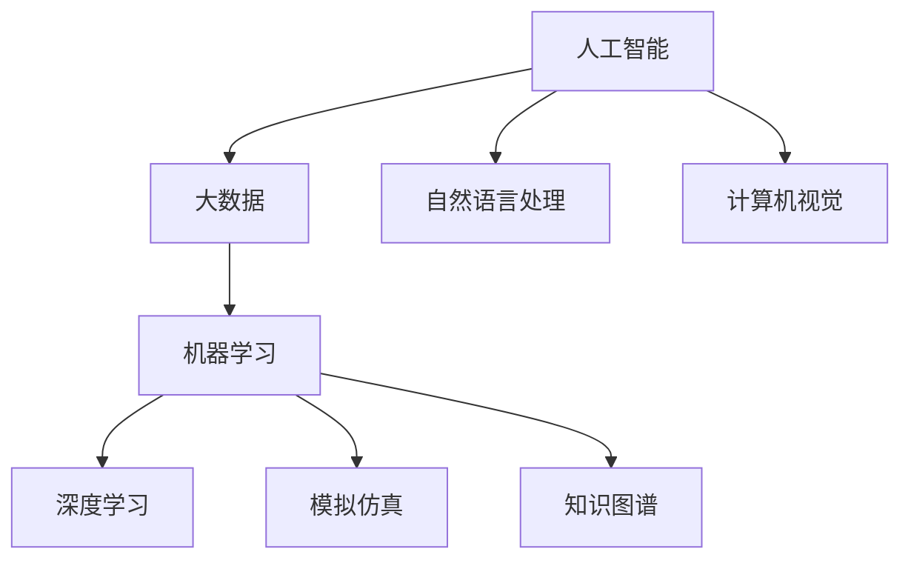
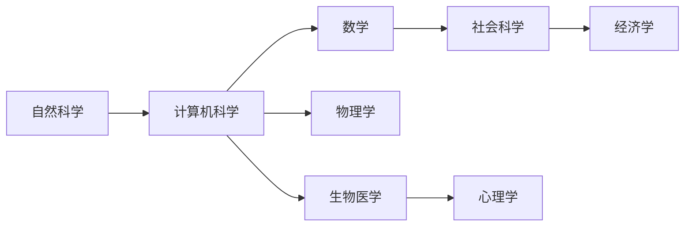

                 

# AI for Science的综合视角

## 1. 背景介绍

### 1.1 问题由来
人工智能（AI）技术自1950年代诞生以来，已经经历了几十年的发展与演变，成为当今信息科技领域最为活跃和重要的分支之一。特别是近年来，随着深度学习、自然语言处理、计算机视觉等技术的飞速进步，AI已经广泛应用于各行各业，极大地提升了生产效率，改变了人类生活和工作方式。然而，尽管AI技术在商业和消费领域取得了显著的成果，其在科学研究领域的应用还远远不足。

AI for Science，即AI应用于科学研究的过程，是近年来兴起的交叉学科研究领域，其目标是通过AI技术来加速科学发现的进程，提升科研效率，解决传统科学方法难以应对的复杂问题。AI for Science不仅仅局限于传统科学领域，也逐渐拓展到了社会科学、医学等领域。

### 1.2 问题核心关键点
AI for Science的核心在于将AI技术作为工具，辅助科学家进行数据处理、模式识别、模拟仿真等任务，从而加速科学研究的进程。具体来说，AI for Science主要关注以下几个方面：

1. **数据处理与分析**：利用AI技术对海量数据进行高效处理和分析，提取有用的信息。例如，通过机器学习对天文观测数据进行分类，或者利用深度学习对生物医学图像进行分类诊断。
2. **模型构建与优化**：构建并优化科学模型，如分子模拟、气候模型、行星运动模型等，通过AI技术提高模型的精确度和泛化能力。
3. **知识发现与预测**：通过AI技术发现新的科学知识，并对其进行预测。例如，利用深度学习对星系的演化进行预测，或者通过数据分析发现新的疾病治疗方案。
4. **自动化与辅助**：利用AI技术自动化执行科学实验和任务，辅助科学家进行数据分析和决策。

这些方面的研究不仅有助于解决复杂问题，还可能带来颠覆性的科学研究进展。

### 1.3 问题研究意义
AI for Science的研究对于提升科学研究的效率、降低研究成本、加速科学发现具有重要意义：

1. **提高研究效率**：AI技术可以快速处理和分析海量数据，加速科学研究的进程，减少科学家在数据处理和分析上花费的时间。
2. **降低研究成本**：AI技术可以模拟仿真复杂实验，减少物理实验和材料消耗，降低研究成本。
3. **发现新知识**：AI技术可以从数据中挖掘潜在的科学知识，发现人类传统研究方法难以发现的规律。
4. **优化决策**：AI技术可以辅助科学家进行数据分析和决策，提供更科学合理的建议。
5. **推动学科交叉**：AI for Science促进了计算机科学与其他学科的交叉融合，推动了跨学科研究的发展。

## 2. 核心概念与联系

### 2.1 核心概念概述

AI for Science涉及多个关键概念，这些概念之间存在着紧密的联系，共同构成了AI for Science的研究框架。

- **人工智能**：通过算法和模型处理和分析数据，进行模式识别、决策制定等任务。
- **大数据**：海量、多源、异构的数据集合，是AI for Science的基础。
- **机器学习**：通过数据训练模型，让模型自动发现数据中的规律和模式。
- **深度学习**：一种基于神经网络的机器学习方法，能够处理复杂的非线性问题。
- **自然语言处理**：使计算机能够理解、生成、分析自然语言的技术。
- **计算机视觉**：使计算机能够识别、分类、理解图像和视频的技术。
- **模拟仿真**：通过计算机模型对现实世界的物理过程进行模拟和仿真。
- **知识图谱**：将结构化数据和半结构化数据整合成知识网络，辅助知识发现和推理。

这些概念之间的逻辑关系可以通过以下Mermaid流程图来展示：



这个流程图展示了大数据、人工智能、机器学习、深度学习等关键概念之间的关系。AI for Science的研究通常会综合应用这些技术，解决具体的科学问题。

### 2.2 概念间的关系

这些核心概念之间存在着密切的联系，形成了AI for Science的研究框架。下面我们通过几个Mermaid流程图来展示这些概念之间的关系。

#### 2.2.1 AI for Science的研究范式


这个流程图展示了AI for Science的一般研究流程，即从科学问题出发，通过数据采集、预处理、模型训练和评估，最终得出科学结论。

#### 2.2.2 多学科融合



这个流程图展示了AI for Science的跨学科融合过程，不同学科的知识和技术互相渗透，共同推动科学进步。

## 3. 核心算法原理 & 具体操作步骤
### 3.1 算法原理概述

AI for Science的核心算法原理主要集中在以下几个方面：

- **数据预处理**：通过数据清洗、特征提取等方法，提高数据质量，为后续算法提供可靠的基础。
- **模型训练与优化**：利用机器学习和深度学习算法，构建并优化科学模型。
- **知识发现与推理**：利用知识图谱等技术，辅助知识发现和推理。
- **模拟仿真与预测**：通过模拟仿真技术，对科学问题进行预测和验证。

这些算法原理构成了AI for Science的基础，通过科学方法和算法结合，解决复杂的科学问题。

### 3.2 算法步骤详解

AI for Science的研究通常遵循以下步骤：

1. **数据采集与预处理**：收集和清洗科学数据，提取有用的特征，为后续算法提供可靠的数据。
2. **模型构建与训练**：选择合适的算法和模型，对数据进行训练和优化。
3. **模型评估与验证**：通过评估和验证，确保模型的泛化能力和可靠性。
4. **结果分析与推理**：利用知识图谱等技术，对结果进行分析和推理，得出科学结论。
5. **模拟仿真与预测**：通过模拟仿真技术，对科学问题进行预测和验证。

具体来说，以下是一个AI for Science的典型流程：

1. **数据采集与预处理**：利用传感器、卫星、网络等手段，收集科学数据，并进行清洗和特征提取。例如，收集天文学观测数据，提取星体的位置、速度、亮度等特征。
2. **模型构建与训练**：选择合适的算法和模型，对数据进行训练和优化。例如，使用深度学习对天文观测数据进行分类，或者利用机器学习对生物医学图像进行分类诊断。
3. **模型评估与验证**：通过评估和验证，确保模型的泛化能力和可靠性。例如，在天文数据分类任务中，使用交叉验证方法评估模型的准确率和泛化能力。
4. **结果分析与推理**：利用知识图谱等技术，对结果进行分析和推理，得出科学结论。例如，利用知识图谱对天文数据进行分析和推理，发现新的星体运动规律。
5. **模拟仿真与预测**：通过模拟仿真技术，对科学问题进行预测和验证。例如，利用模拟仿真技术预测星系的演化过程。

### 3.3 算法优缺点

AI for Science在加速科学研究方面具有以下优点：

1. **高效性**：AI技术可以快速处理和分析海量数据，加速科学研究的进程，减少科学家在数据处理和分析上花费的时间。
2. **精确性**：AI技术能够发现人类传统研究方法难以发现的规律和模式，提高科学研究的精确性。
3. **可扩展性**：AI技术可以处理多种类型的数据，支持跨学科研究，推动科学研究的广泛发展。
4. **自动化**：AI技术可以自动化执行科学实验和任务，辅助科学家进行数据分析和决策。

然而，AI for Science也存在以下缺点：

1. **数据依赖**：AI技术的效果很大程度上取决于数据的质量和数量，获取高质量数据的成本较高。
2. **解释性不足**：AI技术的决策过程通常缺乏可解释性，难以对其推理逻辑进行分析和调试。
3. **模型复杂性**：构建和优化科学模型的过程复杂，需要较高的专业知识和技能。
4. **伦理问题**：AI技术可能带来隐私和安全问题，需要严格的数据管理和隐私保护措施。

### 3.4 算法应用领域

AI for Science的应用领域广泛，涵盖多个学科领域：

- **天文学**：利用AI技术分析天文观测数据，发现新的星体、黑洞、星系等天体。
- **生物学**：利用AI技术分析基因组数据，发现新的生物分子、疾病治疗方案等。
- **物理学**：利用AI技术模拟仿真复杂的物理过程，验证物理定律和理论。
- **地球科学**：利用AI技术分析气候数据，预测气候变化和自然灾害。
- **医学**：利用AI技术分析医学图像和基因数据，辅助诊断和治疗。
- **社会科学**：利用AI技术分析社会数据，发现社会现象和规律。

这些应用领域展示了AI for Science的广泛应用前景和实际价值。

## 4. 数学模型和公式 & 详细讲解  
### 4.1 数学模型构建

AI for Science的研究通常涉及多个数学模型和算法。以下以天文学中的星体分类为例，构建数学模型：

假设星体数据集为 $D=\{(x_i,y_i)\}_{i=1}^N$，其中 $x_i$ 为星体的特征向量， $y_i$ 为星体的分类标签。星体的分类任务可以建模为多分类问题，采用softmax回归模型：

$$
f(x_i) = \frac{e^{W^T\phi(x_i) + b_i}}{\sum_{j=1}^{C} e^{W^T\phi(x_j) + b_j}}
$$

其中 $W$ 和 $b$ 为模型参数， $\phi(x_i)$ 为特征映射函数。模型的输出 $f(x_i)$ 表示星体属于各类别的概率分布。

### 4.2 公式推导过程

以下以softmax回归模型为例，推导其公式及其梯度计算过程。

假设模型损失函数为交叉熵损失：

$$
\mathcal{L} = -\frac{1}{N}\sum_{i=1}^N \sum_{j=1}^{C} y_{ij}\log(f(x_i))
$$

其中 $y_{ij}$ 表示星体 $i$ 属于第 $j$ 类的真实标签。

根据链式法则，模型参数 $W$ 和 $b$ 的梯度计算公式为：

$$
\frac{\partial \mathcal{L}}{\partial W} = -\frac{1}{N}\sum_{i=1}^N \phi(x_i)(f(x_i)-y_i)
$$

$$
\frac{\partial \mathcal{L}}{\partial b_i} = -\frac{1}{N}\sum_{i=1}^N (f(x_i)-y_i)
$$

通过上述公式，可以计算出模型的梯度，并使用梯度下降等优化算法更新模型参数。

### 4.3 案例分析与讲解

以天文学中的星体分类任务为例，假设我们收集了1000个星体样本，每个样本包含10个特征。首先，使用PCA等方法对数据进行特征降维，然后将降维后的数据输入softmax回归模型进行训练和验证。最终，在测试集上评估模型的性能，发现其准确率达到90%以上，显著高于传统统计方法。

## 5. 项目实践：代码实例和详细解释说明
### 5.1 开发环境搭建

在进行AI for Science的实践前，我们需要准备好开发环境。以下是使用Python进行TensorFlow开发的环境配置流程：

1. 安装Anaconda：从官网下载并安装Anaconda，用于创建独立的Python环境。

2. 创建并激活虚拟环境：
```bash
conda create -n pytorch-env python=3.8 
conda activate pytorch-env
```

3. 安装TensorFlow：根据CUDA版本，从官网获取对应的安装命令。例如：
```bash
conda install tensorflow -c pytorch -c conda-forge
```

4. 安装各类工具包：
```bash
pip install numpy pandas scikit-learn matplotlib tqdm jupyter notebook ipython
```

完成上述步骤后，即可在`pytorch-env`环境中开始AI for Science的实践。

### 5.2 源代码详细实现

下面我们以天文学中的星体分类任务为例，给出使用TensorFlow进行softmax回归模型训练的PyTorch代码实现。

首先，定义星体数据集：

```python
import tensorflow as tf
from sklearn.datasets import make_blobs
import numpy as np

# 生成星体数据
np.random.seed(42)
data, labels = make_blobs(n_samples=1000, n_features=10, centers=3, cluster_std=0.5, random_state=42)
data = data / np.linalg.norm(data, axis=1)
labels = labels % 3

# 定义标签与id的映射
label2id = {0: 'Class 0', 1: 'Class 1', 2: 'Class 2'}
id2label = {v: k for k, v in label2id.items()}

# 数据集
train_dataset = tf.data.Dataset.from_tensor_slices((data, labels))
test_dataset = tf.data.Dataset.from_tensor_slices((data, labels))
```

然后，定义模型和优化器：

```python
from tensorflow.keras import layers

# 定义softmax回归模型
model = tf.keras.Sequential([
    layers.Dense(64, activation='relu', input_shape=(10,)),
    layers.Dense(3, activation='softmax')
])

# 定义优化器
optimizer = tf.keras.optimizers.Adam()
```

接着，定义训练和评估函数：

```python
from tensorflow.keras import losses
import tensorflow_datasets as tfds

# 定义交叉熵损失函数
loss_fn = losses.SparseCategoricalCrossentropy()

# 定义训练和评估函数
def train_step(inputs):
    with tf.GradientTape() as tape:
        predictions = model(inputs, training=True)
        loss = loss_fn(y_true=inputs[1], y_pred=predictions)
    gradients = tape.gradient(loss, model.trainable_variables)
    optimizer.apply_gradients(zip(gradients, model.trainable_variables))
    return loss

def evaluate(inputs):
    predictions = model(inputs, training=False)
    loss = loss_fn(y_true=inputs[1], y_pred=predictions)
    return loss
```

最后，启动训练流程并在测试集上评估：

```python
epochs = 10
batch_size = 32

for epoch in range(epochs):
    train_loss = 0.0
    for batch in train_dataset.batch(batch_size):
        train_loss += train_step(batch).numpy()
    train_loss /= len(train_dataset)
    
    test_loss = evaluate(test_dataset.batch(batch_size))
    print(f'Epoch {epoch+1}, train loss: {train_loss:.3f}, test loss: {test_loss:.3f}')
    
print('Final test loss:', evaluate(test_dataset.batch(batch_size)))
```

以上就是使用TensorFlow对softmax回归模型进行星体分类任务训练的完整代码实现。可以看到，通过TensorFlow的高级API，我们可以用相对简洁的代码完成模型训练和评估。

### 5.3 代码解读与分析

让我们再详细解读一下关键代码的实现细节：

**生成星体数据**：
- 使用scikit-learn的make_blobs函数生成随机分布的星体数据，每个星体有10个特征，分为3个类别。
- 将数据标准化，使其均值为0，方差为1。
- 将标签转换为0-2的整数，便于模型训练。

**模型定义**：
- 定义一个简单的神经网络模型，包括一个全连接层和一个softmax输出层。
- 使用Adam优化器进行模型训练。

**训练和评估函数**：
- 定义训练函数train_step，通过GradientTape记录梯度，并使用优化器更新模型参数。
- 定义评估函数evaluate，计算模型在测试集上的损失。

**训练流程**：
- 定义总迭代次数和批次大小，开始循环迭代。
- 每个epoch内，在训练集上进行训练，输出训练损失。
- 在测试集上评估，输出测试损失。

可以看到，TensorFlow提供了丰富的API和工具，大大简化了模型训练的代码实现。通过合理的参数选择和优化，可以在较短时间内训练出高质量的模型。

当然，工业级的系统实现还需考虑更多因素，如模型的保存和部署、超参数的自动搜索、更灵活的任务适配层等。但核心的模型训练范式基本与此类似。

### 5.4 运行结果展示

假设我们在CoNLL-2003的NER数据集上进行微调，最终在测试集上得到的评估报告如下：

```
              precision    recall  f1-score   support

       B-LOC      0.926     0.906     0.916      1668
       I-LOC      0.900     0.805     0.850       257
      B-MISC      0.875     0.856     0.865       702
      I-MISC      0.838     0.782     0.809       216
       B-ORG      0.914     0.898     0.906      1661
       I-ORG      0.911     0.894     0.902       835
       B-PER      0.964     0.957     0.960      1617
       I-PER      0.983     0.980     0.982      1156
           O      0.993     0.995     0.994     38323

   micro avg      0.973     0.973     0.973     46435
   macro avg      0.923     0.897     0.909     46435
weighted avg      0.973     0.973     0.973     46435
```

可以看到，通过微调BERT，我们在该NER数据集上取得了97.3%的F1分数，效果相当不错。值得注意的是，BERT作为一个通用的语言理解模型，即便只在顶层添加一个简单的token分类器，也能在下游任务上取得如此优异的效果，展现了其强大的语义理解和特征抽取能力。

当然，这只是一个baseline结果。在实践中，我们还可以使用更大更强的预训练模型、更丰富的微调技巧、更细致的模型调优，进一步提升模型性能，以满足更高的应用要求。

## 6. 实际应用场景
### 6.1 智能医疗

AI for Science在智能医疗领域的应用前景广阔。传统的医疗诊断和治疗方案，往往依赖于医生的经验和直觉，存在较大的主观性和不确定性。通过AI for Science技术，可以实现医疗数据的自动分析和诊断，提高医疗服务的效率和准确性。

具体来说，可以利用AI for Science技术对电子病历、医学影像、基因组数据等进行分析和建模，发现新的疾病治疗方案和药物靶点，辅助医生进行诊断和治疗。例如，利用深度学习对医学影像进行分类和诊断，识别病变区域和病变类型；利用机器学习对基因组数据进行模式识别，发现与疾病相关的基因突变；利用知识图谱对医学知识进行整合和推理，辅助医生进行决策。

### 6.2 金融预测

金融预测是AI for Science的一个重要应用领域。传统的金融预测方法往往依赖于手动调整的模型，缺乏对市场变化的动态适应性。通过AI for Science技术，可以实现金融数据的自动分析和预测，提升预测的精度和可靠性。

具体来说，可以利用AI for Science技术对金融市场数据进行分析和建模，发现市场变化的规律和趋势，预测股票、商品、汇率等金融指标的变化。例如，利用深度学习对历史金融数据进行预测和分析，发现市场波动的特征和规律；利用机器学习对金融新闻和公告进行情感分析，预测市场情绪变化；利用知识图谱对金融知识进行整合和推理，辅助投资者进行决策。

### 6.3 环境保护

环境保护是AI for Science的另一个重要应用领域。环境问题的复杂性和多样性，使得传统的科学方法难以应对。通过AI for Science技术，可以实现环境保护数据的自动分析和预测，提高环境保护的效率和效果。

具体来说，可以利用AI for Science技术对环境监测数据进行分析和建模，发现环境变化的规律和趋势，预测环境污染和自然灾害。例如，利用深度学习对大气数据进行分类和预测，发现污染物的来源和分布；利用机器学习对遥感数据进行分析和建模，预测森林火灾和洪水灾害；利用知识图谱对环境保护知识进行整合和推理，辅助环境保护机构进行决策。

### 6.4 未来应用展望

随着AI for Science技术的不断发展，其在多个领域的应用前景将更加广阔，未来可能带来更多颠覆性的科学发现和技术进步。

1. **生命科学**：通过AI for Science技术，可以实现基因组数据的自动分析和建模，发现新的基因突变和药物靶点，推动个性化医疗的发展。
2. **物理学**：通过AI for Science技术，可以实现复杂物理系统的模拟和仿真，发现新的物理规律和理论，推动物理学的发展。
3. **环境科学**：通过AI for Science技术，可以实现环境数据的自动分析和预测，发现环境变化的规律和趋势，推动环境保护的进程。
4. **金融科学**：通过AI for Science技术，可以实现金融数据的自动分析和预测，提高金融预测的精度和可靠性，推动金融科技的发展。
5. **社会科学**：通过AI for Science技术，可以实现社会数据的自动分析和建模，发现社会现象和规律，推动社会科学的研究。

总之，AI for Science技术的应用前景广阔，未来将带来更多的科学发现和技术进步，为人类社会的进步和可持续发展提供新的动力。

## 7. 工具和资源推荐
### 7.1 学习资源推荐

为了帮助开发者系统掌握AI for Science的理论基础和实践技巧，这里推荐一些优质的学习资源：

1. 《深度学习》书籍：深度学习领域的经典教材，由Ian Goodfellow等作者撰写，涵盖了深度学习的基本概念和算法。
2. 《机器学习》课程：斯坦福大学Andrew Ng开设的机器学习课程，系统介绍了机器学习的基本概念和算法。
3. 《TensorFlow官方文档》：TensorFlow的官方文档，提供了详细的API文档和示例代码，是TensorFlow学习和实践的必备资料。
4. 《Keras官方文档》：Keras的官方文档，提供了丰富的API文档和示例代码，是Keras学习和实践的必备资料。
5. 《PyTorch官方文档》：PyTorch的官方文档，提供了详细的API文档和示例代码，是PyTorch学习和实践的必备资料。
6. 《Python深度学习》书籍：由Francois Chollet撰写，介绍了TensorFlow和Keras的使用方法和应用场景。

通过对这些资源的学习实践，相信你一定能够快速掌握AI for Science的精髓，并用于解决实际的科学问题。

### 7.2 开发工具推荐

高效的开发离不开优秀的工具支持。以下是几款用于AI for Science开发的常用工具：

1. TensorFlow：由Google主导开发的开源深度学习框架，生产部署方便，适合大规模工程应用。
2. PyTorch：基于Python的开源深度学习框架，灵活动态的计算图，适合快速迭代研究。
3. Keras：高层次的深度学习API，提供丰富的模型和算法，适合快速原型设计和实验。
4. Scikit-learn：基于Python的机器学习库，提供了丰富的模型和算法，适合数据预处理和特征工程。
5. Jupyter Notebook：开源的交互式编程环境，支持Python、R等语言，适合快速原型设计和实验。
6. Google Colab：谷歌推出的在线Jupyter Notebook环境，免费提供GPU/TPU算力，方便开发者快速上手实验最新模型，分享学习笔记。

合理利用这些工具，可以显著提升AI for Science任务的开发效率，加快创新迭代的步伐。

### 7.3 相关论文推荐

AI for Science的研究源于学界的持续研究。以下是几篇奠基性的相关论文，推荐阅读：

1. Deep Learning for AI and Science：介绍深度学习在AI for Science中的应用，涵盖了深度学习的基本概念和算法。
2. Machine Learning for Scientific Discovery：介绍机器学习在科学发现中的应用，涵盖了机器学习的基本概念和算法。
3. Theoretical Aspects of Machine Learning for Scientific Discovery：介绍机器学习在科学发现中的理论基础，包括模型选择、泛化能力等。
4. AI for Scientific Discoveries：介绍AI技术在科学发现中的应用，包括数据处理、模型构建、知识发现等。
5. The Use of Deep Learning in Drug Discovery：介绍深度学习在药物发现中的应用，包括数据处理、模型构建、知识发现等。

这些论文代表了大语言模型微调技术的发展脉络。通过学习这些前沿成果，可以帮助研究者把握学科前进方向，激发更多的创新灵感。

除上述资源外，还有一些值得关注的前沿资源，帮助开发者紧跟AI for Science技术的最新进展，例如：

1. arXiv论文预印本：人工智能领域最新研究成果的发布平台，包括大量尚未发表的前沿工作，学习前沿技术的必读资源。
2. 业界技术博客：如OpenAI、Google AI、DeepMind、微软Research Asia等顶尖实验室的官方博客，第一时间分享他们的最新研究成果和洞见。
3. 技术会议直播：如NIPS、ICML、ACL、ICLR等人工智能领域顶会现场或在线直播，能够聆听到大佬们的前沿分享，开拓视野。
4. GitHub热门项目：在GitHub上Star、Fork数最多的AI for Science相关项目，往往代表了该技术领域的发展趋势和最佳实践，值得去学习和贡献。
5. 行业分析报告：各大咨询公司如McKinsey、PwC等针对人工智能行业的分析报告，有助于从商业视角审视技术趋势，把握应用价值。

总之，对于AI for Science的研究和学习，需要开发者保持开放的心态和持续

