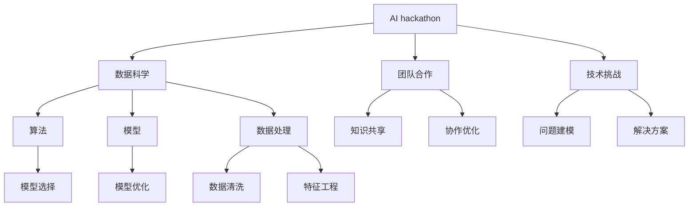
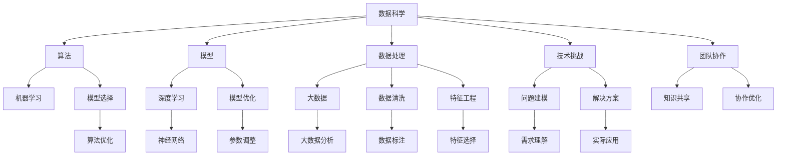

                 

# AI hackathon的创新与未来

> 关键词：AI hackathon, 创新, 数据科学, 团队合作, 技术挑战, 人工智能, 机器学习

## 1. 背景介绍

在人工智能(AI)和数据科学的快速发展下，全球范围内越来越多的技术爱好者和专业团队开始举办各种以AI为主题的创新竞赛，即所谓的AI hackathon。AI hackathon作为一种富有创新精神的集训比赛，能够快速促进新技术的探索和应用。作为“马拉松”式创新挑战，参赛者通常需要在极短的时间内解决数据科学和机器学习领域的前沿问题，并且以此提升个人和团队的实战能力。

### 1.1 问题由来
人工智能和数据科学正迅猛地塑造着各行各业，AI hackathon在这个过程中起到了举足轻重的作用。它们不仅可以为团队成员提供一个深入理解数据、算法和技术的机会，更能在紧张的竞赛环境中锻炼协作和解决问题的能力。这不仅仅是一个比赛，更是一个发现问题、解决问题的平台。

随着技术的演进和需求的增长，AI hackathon的内容也不断演变和扩展。从最初的图像识别、文本分析到自然语言处理、生成对抗网络，再到如今的医疗、金融、教育等多个领域的应用，AI hackathon的挑战内容持续拓展。

## 2. 核心概念与联系

### 2.1 核心概念概述

为更好地理解AI hackathon的精髓，本节将介绍几个关键概念：

- **AI hackathon**：由专业人士和业余爱好者组成的团队，在规定时间内，使用各种AI和数据科学工具解决实际问题，并根据项目质量评比胜出的竞赛形式。

- **数据科学**：涵盖了从数据收集、清洗、分析到机器学习模型构建的全过程，是AI hackathon的核心。

- **团队合作**：AI hackathon通常要求跨学科团队协同工作，通过分工协作，高效解决复杂问题。

- **技术挑战**：AI hackathon中的挑战问题通常具有高度的复杂性和技术性，涉及算法、模型优化、数据处理等多个方面。

- **创新**：AI hackathon的最终目标是推动技术创新，发现新的方法和解决方案，满足实际需求。

这些核心概念之间的联系通过以下Mermaid流程图展示：



这个流程图展示了AI hackathon的基本流程和关键要素：

1. 挑战问题基于数据科学，涵盖算法、模型和数据处理等多个方面。
2. 团队的协作与知识共享是竞赛成功的关键。
3. 团队通过解决问题来展示技术实力和创新能力。

### 2.2 概念间的关系

这些核心概念之间存在着紧密的联系，形成了AI hackathon的完整生态系统。通过以下Mermaid流程图，我们可以更清晰地理解它们之间的关系：



这个综合流程图展示了从数据科学到团队协作再到技术挑战的完整流程，以及它们之间的联系。

## 3. 核心算法原理 & 具体操作步骤

### 3.1 算法原理概述

AI hackathon的核心是数据科学和机器学习。选手需要在有限的时间内，基于提供的数据集和挑战描述，设计出高效的算法，构建和优化机器学习模型，解决实际问题。这些模型通常包括但不限于分类、回归、聚类、时序预测等。

AI hackathon的算法设计一般遵循以下原则：

- **问题建模**：理解问题定义，确定是回归、分类、聚类等何种类型的问题。
- **数据预处理**：清洗数据，处理缺失值，进行特征工程，提高模型输入质量。
- **模型选择**：根据问题类型选择合适的模型，如线性回归、决策树、支持向量机、神经网络等。
- **模型优化**：通过调参、正则化、特征选择等方法提升模型效果。
- **模型评估**：使用交叉验证、混淆矩阵、ROC曲线等方法评估模型性能。

### 3.2 算法步骤详解

以下是AI hackathon中常见的算法步骤：

1. **问题建模**：
   - **理解问题**：读取挑战描述，理解问题的背景、目标和限制条件。
   - **定义目标**：确定是要进行分类、回归还是聚类等任务，明确评估指标。

2. **数据预处理**：
   - **数据清洗**：处理缺失值、异常值，保证数据完整性。
   - **特征工程**：选择合适的特征，去除噪声，创建新特征，优化数据表示。

3. **模型选择与构建**：
   - **算法选择**：根据问题类型选择线性回归、决策树、SVM、神经网络等模型。
   - **模型训练**：使用训练集数据训练模型。
   - **参数调整**：通过网格搜索、随机搜索、贝叶斯优化等方法调整模型超参数。

4. **模型评估**：
   - **交叉验证**：用交叉验证方法评估模型性能，防止过拟合。
   - **模型选择**：根据交叉验证结果选择最优模型。
   - **超参数优化**：进一步调整超参数，提升模型精度。

5. **模型部署**：
   - **模型测试**：使用测试集数据评估模型性能。
   - **模型优化**：根据测试集结果调整模型参数，优化模型性能。
   - **模型部署**：将模型部署到实际应用中。

### 3.3 算法优缺点

AI hackathon算法设计具有以下优点：

- **高效**：在有限的时间内快速构建和优化模型。
- **创新性**：能够鼓励创新，在压力下寻找新颖的解决方案。
- **团队合作**：促进跨学科协作，形成综合力量。

同时，也存在一些缺点：

- **压力较大**：时间紧张，任务复杂，压力大。
- **数据质量**：数据质量和标注问题可能影响结果。
- **模型泛化**：模型过度拟合训练数据，可能泛化能力不足。

### 3.4 算法应用领域

AI hackathon覆盖了数据科学和机器学习的广泛应用领域，以下是几个典型应用：

1. **图像识别**：通过图像分类、目标检测等任务，解决医疗影像诊断、自动驾驶、安防监控等问题。
2. **自然语言处理(NLP)**：通过文本分类、情感分析、命名实体识别等任务，处理智能客服、社交媒体情感分析、机器翻译等问题。
3. **推荐系统**：通过用户行为预测、物品推荐等任务，提升电商、视频推荐、音乐推荐等平台的个性化推荐效果。
4. **医疗健康**：通过医学影像分析、疾病预测等任务，辅助医疗诊断、健康管理等。
5. **金融分析**：通过交易预测、欺诈检测等任务，提升金融机构的风险管理水平。

## 4. 数学模型和公式 & 详细讲解 & 举例说明

### 4.1 数学模型构建

在本节中，我们将通过具体案例，详细讲解如何在AI hackathon中应用数学模型和公式。

假设我们要参加一个图像分类任务，数据集包含数千张图片，每张图片标签为数字0到9。我们的目标是通过机器学习模型将图片分为10个类别。

定义模型 $M(x)$，其中 $x$ 是输入图片，模型输出 $y$ 为类别标签。设训练集为 $\{(x_i, y_i)\}_{i=1}^N$，目标是最小化经验风险：

$$
\mathcal{L}(M) = \frac{1}{N} \sum_{i=1}^N \ell(M(x_i), y_i)
$$

其中 $\ell$ 为损失函数，例如交叉熵损失：

$$
\ell(M(x_i), y_i) = -y_i \log M(x_i) - (1-y_i) \log (1-M(x_i))
$$

### 4.2 公式推导过程

接下来，我们推导模型的训练过程。

1. **问题建模**：确定是分类问题，选择交叉熵损失函数。

2. **数据预处理**：
   - **数据清洗**：去除噪声数据，处理缺失值。
   - **特征工程**：选择合适特征，如图片尺寸、像素值等。

3. **模型选择与构建**：
   - **算法选择**：选择卷积神经网络(CNN)模型，构建卷积层、池化层、全连接层等。
   - **模型训练**：使用训练集数据 $(x_i, y_i)$ 训练模型。
   - **参数调整**：使用梯度下降优化算法调整模型参数。

4. **模型评估**：
   - **交叉验证**：使用交叉验证方法评估模型性能。
   - **模型选择**：选择交叉验证中最优模型。
   - **超参数优化**：使用网格搜索、随机搜索等方法调整模型超参数。

5. **模型部署**：
   - **模型测试**：使用测试集数据评估模型性能。
   - **模型优化**：根据测试集结果调整模型参数。
   - **模型部署**：将模型部署到实际应用中。

### 4.3 案例分析与讲解

以一个真实的AI hackathon案例为例，展示如何在短时间内解决一个复杂问题。

假设某次AI hackathon的任务是预测股市价格走势。我们组建了一个多学科团队，分别负责数据收集与清洗、特征工程、模型构建与优化、模型评估等环节。

1. **数据预处理**：
   - **数据清洗**：处理缺失值和异常值，使用缺失值填充方法。
   - **特征工程**：选择股票价格、成交量、市场情绪等特征。

2. **模型选择与构建**：
   - **算法选择**：选择LSTM模型，用于处理时间序列数据。
   - **模型训练**：使用训练集数据训练模型，调整LSTM的超参数。

3. **模型评估**：
   - **交叉验证**：使用交叉验证方法评估模型性能。
   - **模型选择**：选择交叉验证中最优模型。
   - **超参数优化**：使用网格搜索方法调整LSTM的超参数。

4. **模型部署**：
   - **模型测试**：使用测试集数据评估模型性能。
   - **模型优化**：根据测试集结果调整模型参数。
   - **模型部署**：将模型部署到实际股市分析系统中。

## 5. 项目实践：代码实例和详细解释说明

### 5.1 开发环境搭建

在进行AI hackathon项目实践前，我们需要准备好开发环境。以下是使用Python进行PyTorch开发的环境配置流程：

1. 安装Anaconda：从官网下载并安装Anaconda，用于创建独立的Python环境。

2. 创建并激活虚拟环境：
```bash
conda create -n pytorch-env python=3.8 
conda activate pytorch-env
```

3. 安装PyTorch：根据CUDA版本，从官网获取对应的安装命令。例如：
```bash
conda install pytorch torchvision torchaudio cudatoolkit=11.1 -c pytorch -c conda-forge
```

4. 安装TensorFlow：
```bash
pip install tensorflow
```

5. 安装numpy、pandas、scikit-learn、matplotlib、tqdm等常用库：
```bash
pip install numpy pandas scikit-learn matplotlib tqdm jupyter notebook ipython
```

完成上述步骤后，即可在`pytorch-env`环境中开始实践。

### 5.2 源代码详细实现

下面以图像识别任务为例，展示如何使用PyTorch进行AI hackathon项目开发。

```python
import torch
import torch.nn as nn
import torch.optim as optim
from torchvision import datasets, transforms, models

# 定义数据预处理步骤
transform = transforms.Compose([
    transforms.Resize(256),
    transforms.CenterCrop(224),
    transforms.ToTensor(),
    transforms.Normalize(mean=[0.485, 0.456, 0.406], std=[0.229, 0.224, 0.225])
])

# 加载数据集
train_data = datasets.CIFAR10(root='./data', train=True, download=True, transform=transform)
test_data = datasets.CIFAR10(root='./data', train=False, download=True, transform=transform)

# 定义模型结构
class Net(nn.Module):
    def __init__(self):
        super(Net, self).__init__()
        self.conv1 = nn.Conv2d(3, 6, 5)
        self.pool = nn.MaxPool2d(2, 2)
        self.conv2 = nn.Conv2d(6, 16, 5)
        self.fc1 = nn.Linear(16 * 5 * 5, 120)
        self.fc2 = nn.Linear(120, 84)
        self.fc3 = nn.Linear(84, 10)

    def forward(self, x):
        x = self.pool(F.relu(self.conv1(x)))
        x = self.pool(F.relu(self.conv2(x)))
        x = x.view(-1, 16 * 5 * 5)
        x = F.relu(self.fc1(x))
        x = F.relu(self.fc2(x))
        x = self.fc3(x)
        return x

# 定义模型训练函数
def train_model(model, train_data, test_data, num_epochs, learning_rate):
    device = torch.device("cuda:0" if torch.cuda.is_available() else "cpu")
    model.to(device)
    criterion = nn.CrossEntropyLoss()
    optimizer = optim.SGD(model.parameters(), lr=learning_rate, momentum=0.9)

    for epoch in range(num_epochs):
        running_loss = 0.0
        for i, data in enumerate(train_loader, 0):
            inputs, labels = data[0].to(device), data[1].to(device)
            optimizer.zero_grad()
            outputs = model(inputs)
            loss = criterion(outputs, labels)
            loss.backward()
            optimizer.step()

            running_loss += loss.item()
            if i % 100 == 99:
                print(f'Epoch [{epoch+1}/{num_epochs}], Step [{i+1}/{len(train_loader)}], Loss: {running_loss/100:.3f}')
                running_loss = 0.0

    print(f'Training finished!')

# 加载数据
train_data = datasets.CIFAR10(root='./data', train=True, download=True, transform=transform)
test_data = datasets.CIFAR10(root='./data', train=False, download=True, transform=transform)

# 定义数据加载器
train_loader = torch.utils.data.DataLoader(train_data, batch_size=4, shuffle=True, num_workers=4)
test_loader = torch.utils.data.DataLoader(test_data, batch_size=4, shuffle=False, num_workers=4)

# 定义模型
model = Net()

# 训练模型
train_model(model, train_loader, test_loader, num_epochs=10, learning_rate=0.001)

# 测试模型
with torch.no_grad():
    correct = 0
    total = 0
    for data in test_loader:
        images, labels = data[0].to(device), data[1].to(device)
        outputs = model(images)
        _, predicted = torch.max(outputs.data, 1)
        total += labels.size(0)
        correct += (predicted == labels).sum().item()

    print(f'Accuracy of the network on the 10000 test images: {100 * correct / total}%')
```

### 5.3 代码解读与分析

这段代码展示了如何使用PyTorch进行图像识别任务的训练和测试。

1. **数据预处理**：
   - `transform`：定义了图片的预处理步骤，包括调整大小、裁剪、归一化等。
   - `train_data`和`test_data`：加载CIFAR-10数据集。

2. **模型定义**：
   - `Net`：定义了一个简单的卷积神经网络，包含卷积层、池化层、全连接层。
   - `forward`：定义了前向传播函数。

3. **模型训练**：
   - `train_model`：定义了模型训练函数，使用交叉熵损失函数和随机梯度下降优化算法。
   - `device`：判断设备是否支持GPU加速。
   - `criterion`：定义了损失函数。
   - `optimizer`：定义了优化器。

4. **模型测试**：
   - `test_loader`：加载测试集数据。
   - `with torch.no_grad()`：开启测试模式，关闭梯度计算。
   - `correct`和`total`：计算准确率和总数。

通过这段代码，我们可以快速构建并训练一个简单的图像识别模型，展示如何在AI hackathon中进行实践。

## 6. 实际应用场景

### 6.1 智能客服系统

基于AI hackathon开发的智能客服系统，可以显著提升客服服务质量和效率。传统客服需要大量人力，且服务质量受人工水平限制。而智能客服系统则能够全天候、无间断地为消费者提供服务。

在实际部署中，我们可以将AI hackathon的模型和代码部署到云平台上，结合NLP技术，构建基于用户输入的问答系统。通过不断优化模型和算法，智能客服系统能够理解用户问题，并给出合理的回答，提升客户满意度。

### 6.2 医疗影像分析

在AI hackathon中，医疗影像分析是一个非常热门的挑战。通过图像分类、分割等技术，AI模型能够辅助医生诊断疾病，提高诊断效率和准确性。

具体应用场景包括：
- 肺癌早期筛查：通过CT图像分类，自动识别肺癌病灶。
- 脑部疾病诊断：通过MRI图像分割，精准定位脑部异常区域。
- 心脏病检测：通过心脏超声图像分类，辅助心脏疾病诊断。

### 6.3 金融风险控制

金融市场具有高风险、高复杂性特点，AI hackathon的挑战也常聚焦于风险管理和欺诈检测。通过AI模型，金融机构能够实时监控交易行为，及时发现异常交易，防范金融欺诈。

具体应用场景包括：
- 信用风险评估：通过用户行为数据分析，评估用户信用风险。
- 交易异常检测：通过交易模式分析，识别异常交易行为。
- 市场情绪分析：通过新闻舆情分析，预测市场波动。

## 7. 工具和资源推荐

### 7.1 学习资源推荐

为帮助开发者系统掌握AI hackathon的理论基础和实践技巧，这里推荐一些优质的学习资源：

1. **《机器学习实战》**：一本经典书籍，涵盖数据预处理、模型构建、评估等基础知识，适合初学者入门。

2. **《深度学习》**：由Ian Goodfellow等人编写，是深度学习领域的权威教材，详细介绍了神经网络、卷积神经网络、循环神经网络等核心内容。

3. **Coursera《机器学习》**：由Andrew Ng教授主讲的课程，深入浅出地讲解了机器学习基础，包括监督学习、无监督学习等。

4. **Kaggle竞赛**：Kaggle是全球最大的数据科学竞赛平台，提供大量真实世界的竞赛挑战，让你在实践中提升技能。

5. **GitHub开源项目**：GitHub上有许多优秀的AI hackathon项目，可以参考其代码和文档，快速学习新技能。

### 7.2 开发工具推荐

高效的开发离不开优秀的工具支持。以下是几款用于AI hackathon开发的常用工具：

1. **Jupyter Notebook**：一个交互式笔记本，适合进行数据预处理、模型训练、可视化等操作。

2. **PyTorch**：一个动态计算图框架，灵活高效，适合进行深度学习模型的训练和推理。

3. **TensorFlow**：一个静态计算图框架，支持分布式训练和部署，适合进行大规模模型训练。

4. **Scikit-learn**：一个简单实用的机器学习库，提供了大量的算法和工具，适合进行数据处理和模型评估。

5. **DataRobot**：一个自动化机器学习平台，可以快速构建和优化模型，适合进行生产环境的部署。

6. **Google Colab**：一个免费的Jupyter Notebook环境，支持GPU/TPU加速，适合进行高性能计算。

### 7.3 相关论文推荐

AI hackathon的研究离不开前沿论文的指导。以下是几篇奠基性的相关论文，推荐阅读：

1. **《Deep Learning》**：Ian Goodfellow等人著作，是深度学习领域的权威教材，详细介绍了深度学习的基本原理和算法。

2. **《AlphaGo Zero》**：DeepMind团队发表的论文，介绍了AlphaGo Zero的深度强化学习算法，开创了AI在策略博弈领域的先河。

3. **《LSTM: A Search Space Odyssey》**：Hochreiter等人发表的论文，介绍了LSTM模型，推动了时间序列数据处理的进展。

4. **《Adversarial Examples》**：Ian Goodfellow等人发表的论文，介绍了对抗性样本的概念和生成方法，为模型的鲁棒性研究奠定了基础。

5. **《Attention Is All You Need》**：Vaswani等人发表的论文，介绍了Transformer模型，推动了自然语言处理领域的发展。

这些论文代表了AI hackathon的技术前沿，能够帮助研究者把握学科前进方向，激发更多的创新灵感。

## 8. 总结：未来发展趋势与挑战

### 8.1 研究成果总结

AI hackathon自诞生以来，已经成为推动人工智能技术发展的重要力量。它不仅促进了跨学科交流，加速了新技术的落地应用，更激发了研究者们的创新热情，推动了学术界的蓬勃发展。

通过AI hackathon，我们已经见证了图像识别、自然语言处理、医疗诊断、金融分析等多个领域的技术突破。未来，随着AI技术的不断演进，AI hackathon也将展现出更广阔的应用前景。

### 8.2 未来发展趋势

展望未来，AI hackathon的发展趋势如下：

1. **技术融合**：未来的AI hackathon将更加注重技术融合，跨学科的交叉创新将成为常态。AI与其他学科（如医学、金融、教育等）的结合，将推动更多领域的应用创新。

2. **数据驱动**：随着大数据时代的到来，AI hackathon将更多地依赖大规模、高质度的数据进行训练和优化。数据驱动的创新将成为未来发展的主流。

3. **模型泛化**：未来的AI模型将追求更高的泛化能力，能够在不同领域和场景中高效应用。通用化的模型构建和优化将是关键。

4. **计算效率**：随着算力资源的普及和计算框架的优化，未来的AI hackathon将更加注重模型的计算效率，能够在有限时间内构建更高效、更准确的模型。

5. **实时应用**：未来AI模型的应用将更加注重实时性，能够快速响应用户需求，提供高质量的服务。

### 8.3 面临的挑战

尽管AI hackathon取得了瞩目的成就，但也面临一些挑战：

1. **数据质量**：数据质量直接影响模型的性能，高质量、多样化的数据资源仍需进一步挖掘。

2. **计算资源**：大规模模型的训练和推理需要大量计算资源，这对硬件设施提出了较高要求。

3. **模型解释**：模型的可解释性问题仍然存在，如何提高模型的透明度和可理解性，是一个亟待解决的问题。

4. **应用落地**：如何将AI模型应用到实际生产环境中，需要考虑模型部署、系统架构、用户反馈等多方面问题。

5. **伦理问题**：AI模型的应用可能带来隐私、伦理等风险，如何确保模型使用的安全性、公平性、透明性，是一个需要深入探讨的问题。

### 8.4 研究展望

面对这些挑战，未来的研究需要在以下几个方面寻求突破：

1. **数据增强**：探索更多高质量、多样化的数据增强方法，提升模型的泛化能力。

2. **模型压缩**：研究模型压缩和优化技术，提升模型的计算效率和实时性。

3. **可解释性**：开发可解释性AI模型，提高模型的透明度和可信度。

4. **安全机制**：建立AI模型使用的安全机制，确保模型应用的公平性、透明性。

5. **跨学科融合**：推动AI与其他学科的深度融合，促进更多领域的创新应用。

总之，AI hackathon作为推动AI技术发展的重要平台，将继续发挥其独特价值。未来的AI技术需要更多跨学科的创新和突破，相信在研究者和产业界的共同努力下，AI hackathon必将迎来更加辉煌的未来。

## 9. 附录：常见问题与解答

**Q1：AI hackathon适合哪些人群参加？**

A: AI hackathon面向所有对AI技术感兴趣的人群，包括学生、研究人员、工程师、创业者等。无论你是在校生还是在职人员，都可以参加AI hackathon，挑战自我，提升技能。

**Q2：AI hackathon需要哪些基础技能？**

A: 参加AI hackathon需要具备一定的基础技能，包括编程能力、数据处理能力、机器学习算法等。你可以通过在线课程、书籍、实践项目等方式提升这些技能。

**Q3：参加AI hackathon需要准备哪些工具？**

A: 参加AI hackathon需要准备编程环境（如Python、

