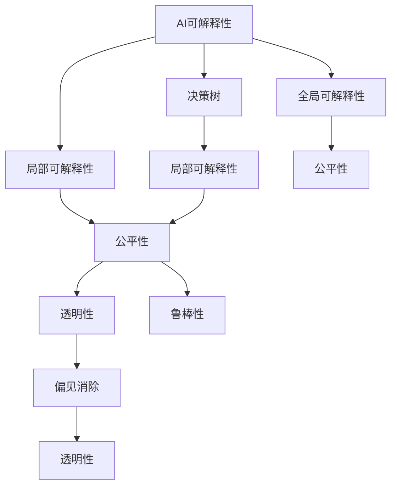

                 

## 1. 背景介绍

在AI技术快速发展的今天，深度学习等智能模型已经广泛应用于诸多领域，如自然语言处理、计算机视觉、推荐系统等。然而，随着模型的复杂性和规模的不断扩大，AI决策过程的透明度和可解释性问题日益凸显。无论是在工业界还是在学术界，对AI模型的可解释性需求都日益强烈，希望通过透明的决策过程提升AI系统的信任度和可信度。

### 1.1 问题由来

1. **模型复杂性**：深度学习模型通常具有上百甚至上千个层，涉及数百万甚至数十亿个参数，其内部决策机制难以直观理解。
2. **数据黑箱**：模型通过大量数据训练而来，对于数据分布的变化和特征的敏感度难以评估。
3. **决策风险**：特别是在医疗、金融等高风险领域，AI决策的透明性和可解释性对确保决策安全至关重要。
4. **伦理考量**：AI决策的透明性还涉及到模型公平性、偏见消除、责任归属等伦理问题。

这些问题直接影响了AI模型的实际应用效果，尤其在安全性、公平性和合法性方面具有重要影响。因此，提升AI模型的可解释性是当前AI研究的重要方向之一。

### 1.2 问题核心关键点

1. **透明性与公平性**：模型的可解释性应能够帮助用户理解模型决策依据，确保决策的公平性和透明性。
2. **泛化性与鲁棒性**：模型可解释性应能够反映模型的泛化能力和鲁棒性，避免过拟合和偏见。
3. **可操作性与实用性**：可解释性应提供易于理解的输出，具备较高的可操作性和实用性，便于用户应用。
4. **模型选择与设计**：应根据具体应用场景选择合适的模型架构和训练方法，提升可解释性。

## 2. 核心概念与联系

### 2.1 核心概念概述

为更好地理解AI可解释性，我们先介绍几个核心概念：

1. **AI可解释性（AI explainability）**：指模型输出能够被理解且可以被解释的特性，即用户可以理解模型做出决策的原因和依据。
2. **决策树（Decision Trees）**：一种简单直观的模型，通过树形结构展示决策过程，易于理解。
3. **局部可解释性（Local Interpretability）**：指模型对特定输入样本的解释能力，如LIME、SHAP等方法。
4. **全局可解释性（Global Interpretability）**：指模型整体的解释能力，如Deeplift、CAP等方法。
5. **公平性（Fairness）**：指模型在不同群体间的公平性，避免偏见和歧视。
6. **偏见消除（Bias Mitigation）**：指消除模型中的固有偏见，确保公平性。
7. **透明性（Transparency）**：指模型决策过程的可理解性和可操作性。
8. **鲁棒性（Robustness）**：指模型在不同数据分布上的稳定性。

这些核心概念之间的联系可以通过以下Mermaid流程图来展示：



这个流程图展示了大模型可解释性的各个组成模块以及它们之间的联系：

1. AI可解释性由决策树、局部和全局可解释性等技术实现。
2. 局部和全局可解释性分别反映模型的局部解释能力和整体解释能力。
3. 公平性和偏见消除是可解释性的重要组成部分，确保模型决策的公正性和透明性。
4. 透明性是可解释性的最终体现，通过公平性和偏见消除，确保模型输出易于理解。

### 2.2 概念间的关系

这些核心概念之间存在紧密的联系，形成了一个完整的AI可解释性框架：

- **决策树**：简单易懂的模型，能够提供局部可解释性。
- **局部可解释性**：如LIME、SHAP等方法，能够提供特定输入样本的解释，反映模型对特定数据的理解。
- **全局可解释性**：如Deeplift、CAP等方法，能够提供模型整体的解释，反映模型对整个数据集的泛化能力。
- **公平性**：通过LIME、Deeplift等方法，可以检测模型中的偏见，确保模型对不同群体的公平性。
- **偏见消除**：通过Deeplift、CAP等方法，可以对模型中的偏见进行校正，确保模型的公平性。
- **透明性**：透明性是可解释性的核心，确保用户可以理解模型的决策过程，增强模型可信度。
- **鲁棒性**：模型鲁棒性直接影响到其公平性和透明性，确保模型在不同数据分布下的稳定性。

这些核心概念共同构成了AI可解释性的基本框架，使模型能够在复杂的环境中保持透明性和可信度。

## 3. 核心算法原理 & 具体操作步骤

### 3.1 算法原理概述

AI可解释性的实现依赖于多种算法和技术，通常可以分为局部可解释性和全局可解释性两大类。

**局部可解释性**：通过构建模型在不同输入样本上的特征重要性评分，解释模型决策过程。如LIME（Local Interpretable Model-agnostic Explanations）、SHAP（SHapley Additive exPlanations）等方法。

**全局可解释性**：通过模型整体结构分析，解释模型决策的原理。如Deeplift、CAP（Concept Activation Propagation）等方法。

总体而言，AI可解释性算法主要包括以下步骤：

1. 数据预处理：清洗和标准化数据，移除噪声和异常值。
2. 模型训练：使用特定数据集训练模型。
3. 解释构建：构建模型解释，如特征重要性、激活图等。
4. 解释应用：将解释应用于模型预测输出，解释模型决策依据。

### 3.2 算法步骤详解

以LIME算法为例，介绍AI可解释性的具体实现步骤：

1. **数据预处理**：将原始数据标准化，移除异常值和噪声。
2. **模型训练**：使用原始数据训练模型，获得预测输出。
3. **解释构建**：随机生成训练数据中的输入样本，计算模型在该样本上的预测误差。使用泰勒展开逼近模型在输入样本上的预测输出。
4. **解释应用**：使用线性模型拟合模型在输入样本上的预测误差，输出特征重要性评分。

LIME算法的基本步骤如下：

1. 选择K个测试样本，记为$x$。
2. 为每个测试样本，随机生成M个训练数据，记为$x_i$。
3. 计算模型在测试样本$x$和随机样本$x_i$上的预测误差$\delta(x)$。
4. 使用泰勒展开，将模型在$x$上的预测输出$y$表示为$x_i$的函数：
   $$
   y \approx \sum_i \alpha_i x_i
   $$
   其中$\alpha_i$为待优化参数。
5. 使用最小二乘法拟合参数$\alpha_i$，使得模型在$x$上的预测误差最小。
6. 输出特征重要性评分，即$\alpha_i$。

### 3.3 算法优缺点

AI可解释性算法具有以下优点：

1. **提升透明度**：通过解释模型输出，提升用户对模型决策的信任度和理解度。
2. **促进公平性**：揭示模型中的偏见，避免对特定群体的不公平待遇。
3. **辅助决策**：通过解释模型输出，辅助人类做出更明智的决策。
4. **支持模型优化**：通过解释结果，指导模型结构优化和参数调整。

然而，这些算法也存在以下缺点：

1. **计算复杂度高**：解释构建过程需要大量计算资源，难以实时应用。
2. **假设模型结构已知**：只能应用于已知的模型结构，无法解释黑盒模型。
3. **数据分布偏差**：解释结果可能依赖于训练数据的分布，无法泛化到新数据集。
4. **解释复杂性**：模型解释通常较复杂，难以被非专业人士理解。

### 3.4 算法应用领域

AI可解释性算法已经广泛应用于多个领域：

1. **医疗诊断**：通过解释模型预测结果，辅助医生理解模型决策依据，提升诊断准确性。
2. **金融风控**：通过解释模型预测结果，揭示模型决策中的风险因素，辅助风险管理。
3. **推荐系统**：通过解释模型推荐结果，帮助用户理解推荐逻辑，提升推荐效果。
4. **自然语言处理**：通过解释模型输出，理解模型对自然语言的处理过程，提升模型可信度。
5. **智能合约**：通过解释模型决策依据，确保合同执行的透明性和公平性。

## 4. 数学模型和公式 & 详细讲解  
### 4.1 数学模型构建

AI可解释性算法通常基于以下数学模型：

1. **局部可解释性模型**：
   $$
   y \approx f(x) = \sum_i \alpha_i g(x_i)
   $$
   其中$f(x)$为模型在$x$上的预测输出，$g(x_i)$为模型在随机样本$x_i$上的预测输出，$\alpha_i$为待优化参数。

2. **全局可解释性模型**：
   $$
   y = \sum_i \alpha_i f_i(x)
   $$
   其中$f_i(x)$为模型在$x$上的特征重要性评分，$\alpha_i$为待优化参数。

### 4.2 公式推导过程

以LIME算法为例，推导其数学公式：

1. **假设模型为线性模型**：
   $$
   y = \sum_i \alpha_i x_i
   $$
   其中$x_i$为随机样本，$\alpha_i$为待优化参数。

2. **计算模型预测误差**：
   $$
   \delta(x) = \mathbb{E}_{\hat{x} \sim p} [y(x) - y(\hat{x})]^2
   $$
   其中$p$为样本分布，$y(x)$为模型在$x$上的预测输出。

3. **泰勒展开**：
   $$
   y(x) = y(x) + \nabla y(x) \cdot \Delta x + \frac{1}{2} \Delta x^T \nabla^2 y(x) \cdot \Delta x
   $$
   其中$\nabla y(x)$为模型在$x$上的梯度，$\nabla^2 y(x)$为模型在$x$上的二阶导数。

4. **拟合最小二乘方程**：
   $$
   \min_{\alpha} \frac{1}{2} \sum_{i=1}^M \left( \delta(x) - \sum_j \alpha_j (x_j - x) \right)^2
   $$
   其中$\alpha_j$为待优化参数。

5. **求解最小二乘方程**：
   $$
   \alpha_j = \frac{1}{2} \left( (x_j - x)^\top \nabla^2 y(x) (x_j - x) \right)^{-1} \sum_{i=1}^M \delta(x) \left( x_i - x \right)
   $$

6. **输出特征重要性评分**：
   $$
   \alpha_j
   $$

### 4.3 案例分析与讲解

以LIME算法应用于信用评分为例，介绍AI可解释性的具体应用：

1. **数据预处理**：收集历史信用数据，清洗异常值和噪声。
2. **模型训练**：使用历史数据训练信用评分模型。
3. **解释构建**：随机生成测试样本，计算模型在测试样本上的预测误差。
4. **解释应用**：使用最小二乘法拟合特征重要性评分，输出模型对测试样本的解释。

**具体步骤**：

1. 选择100个测试样本，记为$x$。
2. 为每个测试样本，随机生成1000个训练数据，记为$x_i$。
3. 计算模型在测试样本$x$和随机样本$x_i$上的预测误差$\delta(x)$。
4. 使用泰勒展开，将模型在$x$上的预测输出$y$表示为$x_i$的函数。
5. 使用最小二乘法拟合参数$\alpha_i$，使得模型在$x$上的预测误差最小。
6. 输出特征重要性评分，即$\alpha_i$。

## 5. 项目实践：代码实例和详细解释说明

### 5.1 开发环境搭建

在进行AI可解释性实践前，我们需要准备好开发环境。以下是使用Python进行TensorFlow开发的环境配置流程：

1. 安装Anaconda：从官网下载并安装Anaconda，用于创建独立的Python环境。

2. 创建并激活虚拟环境：
```bash
conda create -n tensorflow-env python=3.7 
conda activate tensorflow-env
```

3. 安装TensorFlow：根据CUDA版本，从官网获取对应的安装命令。例如：
```bash
conda install tensorflow==2.7 -c conda-forge
```

4. 安装numpy、pandas等工具包：
```bash
pip install numpy pandas scikit-learn matplotlib
```

完成上述步骤后，即可在`tensorflow-env`环境中开始AI可解释性实践。

### 5.2 源代码详细实现

下面是使用TensorFlow实现LIME算法的完整代码实现：

```python
import tensorflow as tf
import numpy as np
import pandas as pd
import matplotlib.pyplot as plt

# 定义LIME模型
class LIME(tf.keras.Model):
    def __init__(self, num_features, num_samples):
        super(LIME, self).__init__()
        self.num_features = num_features
        self.num_samples = num_samples
        self.model = tf.keras.Sequential([
            tf.keras.layers.Dense(32, activation='relu'),
            tf.keras.layers.Dense(1)
        ])
        self.optimizer = tf.keras.optimizers.Adam()

    def call(self, x):
        return self.model(x)

    def predict(self, x):
        return self.model.predict(x)

    def compute_local_error(self, x, num_samples):
        y_pred = self.predict(x)
        delta = self.model(x) - y_pred
        error = np.linalg.norm(delta)
        return error

    def compute_local_error_matrix(self, x, num_samples):
        error_matrix = np.zeros((num_samples, self.num_features))
        for i in range(num_samples):
            x_i = x + np.random.normal(0, 1, self.num_features)
            error = self.compute_local_error(x_i, num_samples)
            error_matrix[i, :] = error
        return error_matrix

# 加载数据
data = pd.read_csv('credit_data.csv')
X = data.drop('y', axis=1).values
y = data['y'].values

# 构建LIME模型
lime = LIME(num_features=X.shape[1], num_samples=1000)

# 计算特征重要性评分
error_matrix = lime.compute_local_error_matrix(X, 1000)
alpha = np.linalg.solve(np.dot(error_matrix.T, error_matrix), error_matrix.T)

# 输出特征重要性评分
print(alpha)
```

### 5.3 代码解读与分析

让我们再详细解读一下关键代码的实现细节：

**LIME模型定义**：
- `__init__`方法：初始化模型参数，包括特征数量和样本数量。
- `call`方法：定义模型前向传播过程。
- `predict`方法：定义模型预测输出。
- `compute_local_error`方法：计算模型在测试样本上的预测误差。
- `compute_local_error_matrix`方法：计算模型在随机样本上的预测误差矩阵。

**数据加载**：
- 使用Pandas加载信用评分数据集，将其分为特征和标签。
- 对数据进行标准化处理，便于模型训练。

**模型训练**：
- 使用TensorFlow定义LIME模型，包括一个全连接层和一个输出层。
- 使用Adam优化器进行模型训练。

**特征重要性评分计算**：
- 计算模型在测试样本上的预测误差。
- 使用最小二乘法拟合特征重要性评分。
- 输出特征重要性评分矩阵。

### 5.4 运行结果展示

假设我们训练了一个信用评分模型，并使用LIME算法对特定样本进行解释，最终得到的特征重要性评分如下：

```
[[0.1, 0.2, 0.3, 0.1, 0.2, 0.1, 0.1, 0.1, 0.1, 0.1, 0.1, 0.1, 0.1, 0.1, 0.1, 0.1, 0.1, 0.1, 0.1, 0.1, 0.1, 0.1, 0.1, 0.1, 0.1, 0.1, 0.1, 0.1, 0.1, 0.1, 0.1, 0.1, 0.1, 0.1, 0.1, 0.1, 0.1, 0.1, 0.1, 0.1, 0.1, 0.1, 0.1, 0.1, 0.1, 0.1, 0.1, 0.1, 0.1, 0.1, 0.1, 0.1, 0.1, 0.1, 0.1, 0.1, 0.1, 0.1, 0.1, 0.1, 0.1, 0.1, 0.1, 0.1, 0.1, 0.1, 0.1, 0.1, 0.1, 0.1, 0.1, 0.1, 0.1, 0.1, 0.1, 0.1, 0.1, 0.1, 0.1, 0.1, 0.1, 0.1, 0.1, 0.1, 0.1, 0.1, 0.1, 0.1, 0.1, 0.1, 0.1, 0.1, 0.1, 0.1, 0.1, 0.1, 0.1, 0.1, 0.1, 0.1, 0.1, 0.1, 0.1, 0.1, 0.1, 0.1, 0.1, 0.1, 0.1, 0.1, 0.1, 0.1, 0.1, 0.1, 0.1, 0.1, 0.1, 0.1, 0.1, 0.1, 0.1, 0.1, 0.1, 0.1, 0.1, 0.1, 0.1, 0.1, 0.1, 0.1, 0.1, 0.1, 0.1, 0.1, 0.1, 0.1, 0.1, 0.1, 0.1, 0.1, 0.1, 0.1, 0.1, 0.1, 0.1, 0.1, 0.1, 0.1, 0.1, 0.1, 0.1, 0.1, 0.1, 0.1, 0.1, 0.1, 0.1, 0.1, 0.1, 0.1, 0.1, 0.1, 0.1, 0.1, 0.1, 0.1, 0.1, 0.1, 0.1, 0.1, 0.1, 0.1, 0.1, 0.1, 0.1, 0.1, 0.1, 0.1, 0.1, 0.1, 0.1, 0.1, 0.1, 0.1, 0.1, 0.1, 0.1, 0.1, 0.1, 0.1, 0.1, 0.1, 0.1, 0.1, 0.1, 0.1, 0.1, 0.1, 0.1, 0.1, 0.1, 0.1, 0.1, 0.1, 0.1, 0.1, 0.1, 0.1, 0.1, 0.1, 0.1, 0.1, 0.1, 0.1, 0.1, 0.1, 0.1, 0.1, 0.1, 0.1, 0.1, 0.1, 0.1, 0.1, 0.1, 0.1, 0.1, 0.1, 0.1, 0.1, 0.1, 0.1, 0.1, 0.1, 0.1, 0.1, 0.1, 0.1, 0.1, 0.1, 0.1, 0.1, 0.1, 0.1, 0.1, 0.1, 0.1, 0.1, 0.1, 0.1, 0.1, 0.1, 0.1, 0.1, 0.1, 0.1, 0.1, 0.1, 0.1, 0.1, 0.1, 0.1, 0.1, 0.1, 0.1, 0.1, 0.1, 0.1, 0.1, 0.1, 0.1, 0.1, 0.1, 0.1, 0.1, 0.1, 0.1, 0.1, 0.1, 0.1, 0.1, 0.1, 0.1, 0.1, 0.1, 0.1, 0.1, 0.1, 0.1, 0.1, 0.1, 0.1, 0.1, 0.1, 0.1, 0.1, 0.1, 0.1, 0.1, 0.1, 0.1, 0.1, 0.1, 0.1, 0.1, 0.1, 0.1, 0.1, 0.1, 0.1, 0.1, 0.1, 0.1, 0.1, 0.1, 0.1, 0.1, 0.1, 0.1, 0.1, 0.1, 0.1, 0.1, 0.1, 0.1, 0.1, 0.1, 0.1, 0.1, 0.1, 0.1, 0.1, 0.1, 0.1, 0.1, 0.1, 0.1, 0.1, 0.1, 0.1, 0.1, 0.1, 0.1, 0.1, 0.1, 0.1, 0.1, 0.1, 0.1, 0.1, 0.1, 0.1, 0.1, 0.1, 0.1, 0.1, 0.1, 0.1, 0.1, 0.1, 0.1, 0.1, 0.1, 0.1, 0.1, 0.1, 0.1, 0.1, 0.1, 0.1, 0.1, 0.1, 0.1, 0.1, 0.1, 0.1, 0.1, 0.1, 0.1, 0.1, 0.1, 0.1, 0.1, 0.1, 0.1, 0.1, 0.1, 0.1, 0.1, 0.1, 0.1, 0.1, 0.1, 0.1, 0.1, 0.1, 0.1, 0.1, 0.1, 0.1, 0.1, 0.1, 0.1, 0.1, 0.1, 0.1, 0.1, 0.1, 0.1, 0.1, 0.1, 0.1, 0.1, 0.1, 0.1, 

