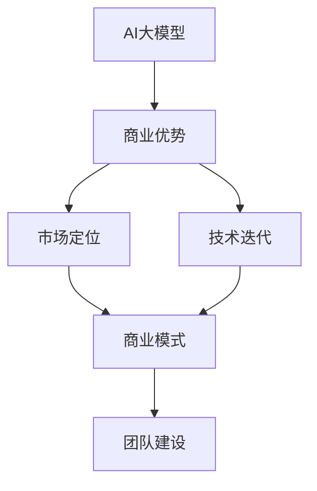
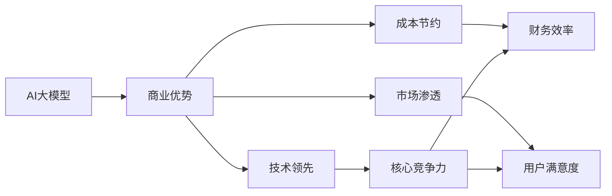
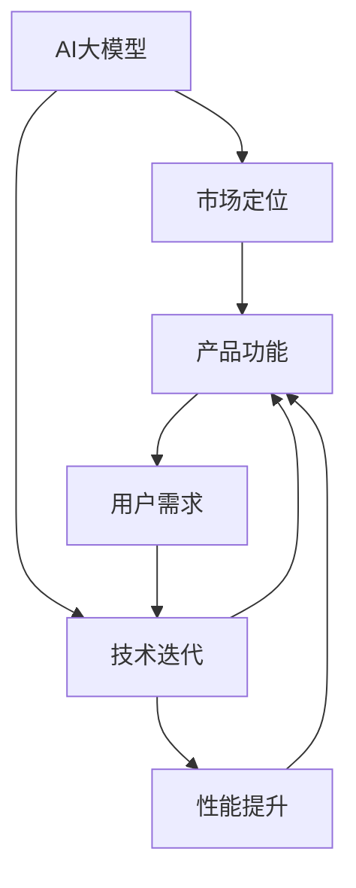
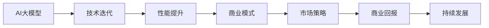
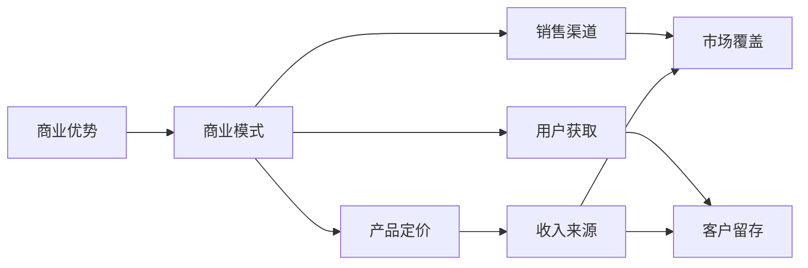
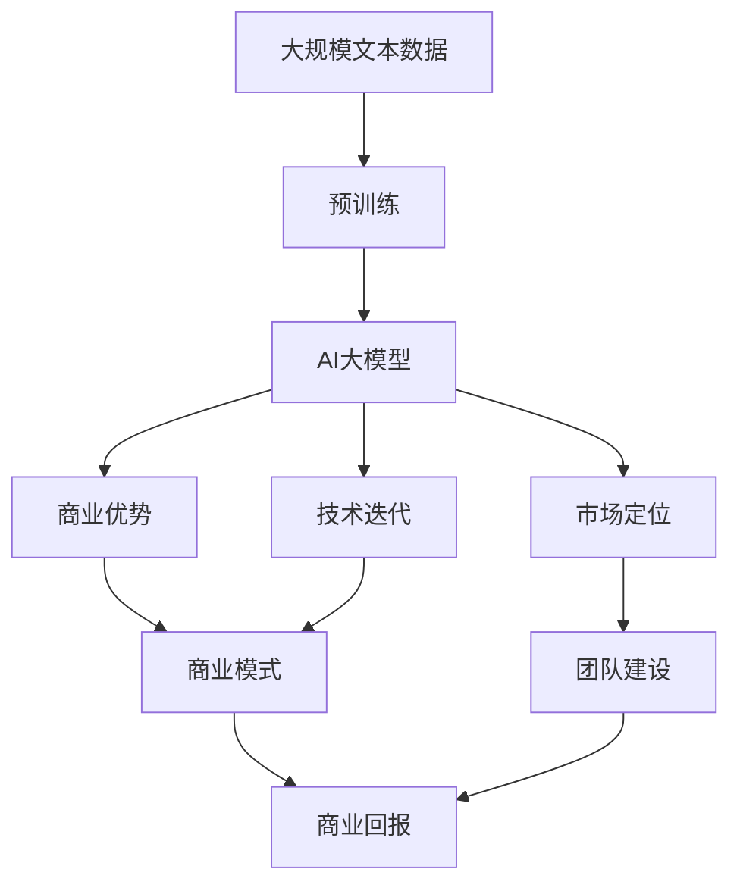

                 

# AI 大模型创业：如何利用商业优势？

> 关键词：AI大模型,商业优势,创业策略,市场应用,技术迭代

## 1. 背景介绍

### 1.1 问题由来

近年来，随着人工智能技术的快速发展，尤其是深度学习和大规模预训练语言模型的突破，AI 领域涌现出了一批具备强大商业潜力的技术创新。这些技术不仅在学术界引起了广泛关注，更在企业界引起了巨大波澜。与此同时，AI大模型创业公司如雨后春笋般涌现，吸引了大量资本和人才的涌入。

然而，AI大模型并非易事，其开发和运营成本高、技术难度大、市场竞争激烈。因此，如何充分利用AI大模型的商业优势，打造具有核心竞争力的产品，成为众多创业公司面临的重大挑战。

### 1.2 问题核心关键点

要解决这个问题，首先需要明确AI大模型创业的核心关键点：

1. **商业优势的识别**：理解AI大模型的商业潜力，识别出能够带来商业价值的核心功能和应用场景。
2. **市场定位的精准**：根据目标市场的特点和需求，准确定位产品功能和市场策略。
3. **技术迭代的持续**：保持技术领先，不断迭代优化，提升产品的竞争力和用户满意度。
4. **商业模式的选择**：选择合适的商业模式，最大化商业回报，实现可持续发展。
5. **团队建设的完善**：吸引并培养一支高素质的技术团队，确保产品开发和运营的质量。

本文将围绕这些关键点，探讨AI大模型创业中的商业优势及其利用策略。

## 2. 核心概念与联系

### 2.1 核心概念概述

为更好地理解AI大模型创业的商业优势及其利用策略，本节将介绍几个密切相关的核心概念：

- **AI大模型(AI Large Models)**：指基于深度学习技术，在大规模无标签数据上进行预训练，具备通用语言理解和生成能力的模型，如BERT、GPT等。
- **商业优势(Commercial Advantage)**：指AI大模型在特定市场领域能够带来的独特优势，包括技术领先、成本节约、市场渗透等。
- **市场定位(Market Positioning)**：指将AI大模型的核心功能与应用场景与目标市场相结合，明确产品的市场定位。
- **技术迭代(Technology Iteration)**：指持续优化AI大模型的算法和架构，提升其性能和效率。
- **商业模式(Business Model)**：指实现AI大模型商业价值的路径，包括产品定价、销售渠道、用户获取等。
- **团队建设(Team Building)**：指吸引并培养一支具备高技术能力和团队协作精神的专业团队。

这些核心概念之间的逻辑关系可以通过以下Mermaid流程图来展示：



这个流程图展示了大模型创业中的核心概念及其之间的关系：

1. AI大模型通过商业优势转化为实际商业价值。
2. 市场定位和产品功能相互匹配，确保市场竞争力和用户满意度。
3. 技术迭代不断优化模型，提升性能和效率。
4. 商业模式设计实现商业价值的最大化。
5. 团队建设为技术迭代和商业运营提供保障。

这些概念共同构成了AI大模型创业的完整生态系统，使得创业公司在利用AI大模型的商业优势时能够全面考虑，制定出科学合理的战略规划。

### 2.2 概念间的关系

这些核心概念之间存在着紧密的联系，形成了AI大模型创业的整体框架。下面我们通过几个Mermaid流程图来展示这些概念之间的关系。

#### 2.2.1 AI大模型的商业优势



这个流程图展示了大模型创业中商业优势的各个方面：

1. AI大模型通过技术领先获得核心竞争力。
2. 成本节约提高财务效率，降低创业风险。
3. 市场渗透提升用户满意度，增加市场份额。

#### 2.2.2 市场定位与技术迭代



这个流程图展示了市场定位和技术迭代之间的相互影响：

1. 市场定位决定了产品功能和应用场景，确保符合用户需求。
2. 技术迭代不断提升模型的性能和效率，满足市场需求。

#### 2.2.3 技术迭代与商业模式



这个流程图展示了技术迭代对商业模式的影响：

1. 技术迭代提升了模型的性能和效率，为商业模式的优化提供支持。
2. 优化后的商业模式实现更好的市场策略和商业回报，推动公司的持续发展。

#### 2.2.4 商业模式的实现



这个流程图展示了商业模式各个方面的具体实现：

1. 商业优势为产品定价、销售渠道和用户获取提供支持。
2. 产品定价、销售渠道和用户获取决定了收入来源、市场覆盖和客户留存，实现商业回报。

### 2.3 核心概念的整体架构

最后，我们用一个综合的流程图来展示这些核心概念在大模型创业过程中的整体架构：



这个综合流程图展示了从预训练到商业回报的完整过程。AI大模型首先在大规模文本数据上进行预训练，然后通过商业优势转化为实际商业价值。市场定位和技术迭代确保了产品功能和应用场景的匹配和优化，商业模式设计实现了商业价值的最大化。团队建设为技术迭代和商业运营提供保障。通过这些概念的共同作用，AI大模型创业公司可以充分利用商业优势，打造具有核心竞争力的产品，实现可持续发展。

## 3. 核心算法原理 & 具体操作步骤
### 3.1 算法原理概述

AI大模型创业中的核心算法原理主要涉及商业优势的识别和利用、市场定位、技术迭代、商业模式设计和团队建设等方面。

商业优势的识别通常基于对市场需求的深入理解和AI大模型功能的全面评估。例如，在医疗领域，AI大模型可以通过图像识别和自然语言处理，帮助医生提高诊断和治疗效率，从而在医疗保健行业获得商业优势。

市场定位的精准则涉及对目标市场的深入分析和产品功能的明确规划。以医疗为例，AI大模型可以通过医疗影像分析、电子病历处理等功能，精准定位到放射科、手术室等高需求场景，提升医院运营效率。

技术迭代则侧重于持续优化AI大模型的算法和架构，提升其性能和效率。例如，通过引入先进的深度学习框架和硬件加速技术，AI大模型可以实现更快的推理速度和更低的计算成本。

商业模式设计则需要根据市场定位和技术迭代的结果，选择适合的市场策略和定价方式。例如，可以采用SaaS模式提供云端服务，或采用B2B模式销售企业版软件。

团队建设则旨在吸引并培养一支具备高技术能力和团队协作精神的专业团队。这不仅包括技术人员的招聘和培训，还包括公司文化的建设和管理制度的完善。

### 3.2 算法步骤详解

基于AI大模型创业的核心算法原理，具体步骤详解如下：

#### 3.2.1 商业优势识别

1. **市场需求分析**：通过市场调研、竞品分析等方式，深入理解目标市场的需求和痛点。例如，在金融领域，AI大模型可以通过风险评估、信用评分等功能，帮助金融机构提高决策效率，降低风险。
2. **功能评估**：评估AI大模型在特定领域的核心功能和应用场景。例如，在医疗领域，AI大模型可以通过医学影像分析和电子病历处理，提升医生的诊断和治疗效率。
3. **竞争分析**：分析竞品功能和市场策略，识别出AI大模型的商业优势。例如，在金融领域，AI大模型可以通过实时数据处理和风险预测，提升金融机构的服务质量和竞争力。

#### 3.2.2 市场定位

1. **目标市场确定**：根据市场需求分析结果，确定目标市场的具体行业和应用场景。例如，在医疗领域，AI大模型可以定位到放射科、手术室等高需求场景。
2. **产品功能规划**：明确AI大模型在目标市场中的具体功能，确保与用户需求相匹配。例如，在医疗领域，AI大模型可以通过医学影像分析、电子病历处理等功能，帮助医生提高诊断和治疗效率。
3. **用户角色分析**：分析目标市场中的主要用户角色和需求，设计适合的用户界面和交互方式。例如，在医疗领域，AI大模型可以通过便捷的用户界面和交互方式，提升医生和患者的使用体验。

#### 3.2.3 技术迭代

1. **算法优化**：持续优化AI大模型的算法和架构，提升其性能和效率。例如，通过引入先进的深度学习框架和硬件加速技术，AI大模型可以实现更快的推理速度和更低的计算成本。
2. **数据增强**：利用数据增强技术，扩充训练数据集，提升模型的泛化能力和鲁棒性。例如，在医疗领域，AI大模型可以通过增加医学影像和病历数据，提升模型的诊断和治疗效果。
3. **模型压缩**：通过模型压缩技术，减小模型规模，提高推理速度和计算效率。例如，在医疗领域，AI大模型可以通过剪枝和量化等方法，减小模型规模，降低计算资源消耗。

#### 3.2.4 商业模式设计

1. **市场策略制定**：根据市场定位和技术迭代的结果，选择适合的市场策略。例如，在医疗领域，AI大模型可以通过B2B模式销售企业版软件，或通过SaaS模式提供云端服务。
2. **定价策略设计**：制定合理的定价策略，实现商业回报。例如，在金融领域，AI大模型可以通过按需付费的方式，按用户使用量或处理数据量收费。
3. **销售渠道规划**：规划合适的销售渠道，提升市场覆盖和用户获取效率。例如，在医疗领域，AI大模型可以通过医院、诊所等医疗机构的渠道进行推广。

#### 3.2.5 团队建设

1. **人才招聘**：吸引并招聘具备高技术能力和团队协作精神的专业人才。例如，在医疗领域，AI大模型可以招聘具备医学背景和人工智能技术的复合型人才。
2. **培训和发展**：为团队成员提供持续的培训和发展机会，提升技术能力和团队协作水平。例如，在金融领域，AI大模型可以为技术团队提供深度学习和机器学习方面的培训课程。
3. **公司文化建设**：建立积极向上的公司文化，提升团队凝聚力和创新能力。例如，在医疗领域，AI大模型可以倡导以患者为中心的价值观，提升医生和患者对AI技术的信任和接受度。

### 3.3 算法优缺点

AI大模型创业中的核心算法具有以下优点：

1. **技术领先**：利用大模型的通用语言理解和生成能力，在特定领域实现技术领先，提升市场竞争力。
2. **成本节约**：通过持续优化算法和架构，实现更快的推理速度和更低的计算成本，节约创业资源。
3. **市场渗透**：通过精准的市场定位和用户角色分析，提升产品用户体验和市场覆盖，增加用户获取效率。
4. **商业回报**：通过合理的商业模式设计，实现商业回报最大化，推动公司可持续发展。

同时，这些算法也存在以下缺点：

1. **开发周期长**：AI大模型创业涉及算法优化、市场定位、团队建设等多个环节，开发周期较长。
2. **资源需求高**：大规模数据和计算资源的投入，需要较高的创业成本。
3. **市场竞争激烈**：AI大模型领域的竞争激烈，需要持续创新和优化才能保持竞争优势。
4. **技术复杂性高**：大模型算法和架构的复杂性，对技术团队的专业水平要求较高。

尽管存在这些缺点，但AI大模型创业的市场前景广阔，创业公司仍需积极应对挑战，制定科学合理的战略规划，充分利用商业优势，实现可持续发展。

### 3.4 算法应用领域

AI大模型创业中的核心算法已经在多个领域得到了广泛应用，例如：

1. **金融领域**：AI大模型可以通过风险评估、信用评分、市场分析等功能，提升金融机构的服务质量和竞争力。
2. **医疗领域**：AI大模型可以通过医学影像分析、电子病历处理、智能诊断等功能，提升医疗保健行业的服务效率和治疗效果。
3. **教育领域**：AI大模型可以通过智能推荐、自动批改、情感分析等功能，提升教育行业的个性化教学和评估水平。
4. **零售领域**：AI大模型可以通过客户画像分析、推荐系统优化、库存管理等功能，提升零售企业的运营效率和客户满意度。
5. **交通领域**：AI大模型可以通过智能导航、自动驾驶、智能监控等功能，提升交通运输行业的安全性和智能化水平。
6. **制造领域**：AI大模型可以通过工业物联网数据处理、设备故障预测、供应链优化等功能，提升制造业的自动化和智能化水平。

除了上述这些典型领域外，AI大模型创业还在更多创新领域得到应用，如智慧城市、农业、能源等，为各行各业带来变革性影响。

## 4. 数学模型和公式 & 详细讲解 & 举例说明

### 4.1 数学模型构建

本节将使用数学语言对AI大模型创业中的核心算法进行更加严格的刻画。

记AI大模型为 $M_{\theta}:\mathcal{X} \rightarrow \mathcal{Y}$，其中 $\mathcal{X}$ 为输入空间，$\mathcal{Y}$ 为输出空间，$\theta \in \mathbb{R}^d$ 为模型参数。假设目标市场为 $T$，AI大模型在该市场中的商业价值为 $V(T)$，市场定位为 $P(T)$，技术迭代为 $I(T)$，商业模式为 $B(T)$，团队建设为 $S(T)$。则AI大模型创业的数学模型可以表示为：

$$
V(T) = f(P(T), I(T), B(T), S(T))
$$

其中 $f$ 为复杂函数，表示市场定位、技术迭代、商业模式和团队建设对商业价值的综合影响。

### 4.2 公式推导过程

以下我们以金融领域为例，推导AI大模型在金融风险评估中的应用公式。

假设AI大模型 $M_{\theta}$ 在输入 $x$ 上的输出为 $\hat{y}=M_{\theta}(x) \in [0,1]$，表示样本属于正类的概率。真实标签 $y \in \{0,1\}$。则二分类交叉熵损失函数定义为：

$$
\ell(M_{\theta}(x),y) = -[y\log \hat{y} + (1-y)\log (1-\hat{y})]
$$

将其代入商业价值的计算公式，得：

$$
V(T) = \sum_{x \in T} \ell(M_{\theta}(x),y)
$$

为了优化商业价值，需要最小化损失函数。在实践中，我们通常使用基于梯度的优化算法（如SGD、Adam等）来近似求解上述最优化问题。设 $\eta$ 为学习率，$\lambda$ 为正则化系数，则参数的更新公式为：

$$
\theta \leftarrow \theta - \eta \nabla_{\theta}\ell(M_{\theta}(x),y) - \eta\lambda\theta
$$

其中 $\nabla_{\theta}\ell(M_{\theta}(x),y)$ 为损失函数对参数 $\theta$ 的梯度，可通过反向传播算法高效计算。

在得到损失函数的梯度后，即可带入参数更新公式，完成模型的迭代优化。重复上述过程直至收敛，最终得到最大化商业价值的模型参数 $\theta^*$。

### 4.3 案例分析与讲解

假设我们在金融风险评估领域进行AI大模型创业，具体步骤如下：

1. **市场需求分析**：通过调研金融机构和投资者的需求，发现风险评估和信用评分是金融领域的重要需求，具有较高的商业价值。
2. **功能评估**：评估AI大模型在金融领域的应用场景，发现其可以通过历史数据分析和实时数据处理，实现高效的信用评分和风险评估。
3. **竞争分析**：分析竞品功能和市场策略，发现现有风险评估系统存在算法单一、数据不全等问题，AI大模型具备显著的商业优势。
4. **市场定位**：将AI大模型定位到金融机构的信用评分和风险管理部门，提升其决策效率和准确性。
5. **技术迭代**：通过引入先进的深度学习框架和硬件加速技术，优化算法和架构，提升模型的推理速度和计算效率。
6. **商业模式设计**：选择SaaS模式提供云端服务，按月收取服务费，实现商业回报。
7. **销售渠道规划**：通过金融机构和投资者的渠道进行推广，增加市场覆盖和用户获取效率。
8. **团队建设**：招聘具备金融背景和人工智能技术的复合型人才，提供深度学习和机器学习方面的培训课程，建立积极向上的公司文化。

通过以上步骤，AI大模型在金融领域的应用得以实现，实现了显著的商业价值和市场渗透。

## 5. 项目实践：代码实例和详细解释说明

### 5.1 开发环境搭建

在进行AI大模型创业的项目实践前，我们需要准备好开发环境。以下是使用Python进行PyTorch开发的环境配置流程：

1. 安装Anaconda：从官网下载并安装Anaconda，用于创建独立的Python环境。

2. 创建并激活虚拟环境：
```bash
conda create -n pytorch-env python=3.8 
conda activate pytorch-env
```

3. 安装PyTorch：根据CUDA版本，从官网获取对应的安装命令。例如：
```bash
conda install pytorch torchvision torchaudio cudatoolkit=11.1 -c pytorch -c conda-forge
```

4. 安装Transformers库：
```bash
pip install transformers
```

5. 安装各类工具包：
```bash
pip install numpy pandas scikit-learn matplotlib tqdm jupyter notebook ipython
```

完成上述步骤后，即可在`pytorch-env`环境中开始项目实践。

### 5.2 源代码详细实现

这里我们以金融风险评估为例，给出使用Transformers库对BERT模型进行风险评估微调的PyTorch代码实现。

首先，定义风险评估任务的数据处理函数：

```python
from transformers import BertTokenizer
from torch.utils.data import Dataset
import torch

class RiskAssessmentDataset(Dataset):
    def __init__(self, features, labels, tokenizer, max_len=128):
        self.features = features
        self.labels = labels
        self.tokenizer = tokenizer
        self.max_len = max_len
        
    def __len__(self):
        return len(self.features)
    
    def __getitem__(self, item):
        feature = self.features[item]
        label = self.labels[item]
        
        encoding = self.tokenizer(feature, return_tensors='pt', max_length=self.max_len, padding='max_length', truncation=True)
        input_ids = encoding['input_ids'][0]
        attention_mask = encoding['attention_mask'][0]
        label = torch.tensor(label, dtype=torch.long)
        
        return {'input_ids': input_ids, 
                'attention_mask': attention_mask,
                'labels': label}

# 数据集和标签
train_features = ['Feature 1', 'Feature 2', ...]
train_labels = [0, 1, ...]
dev_features = ['Feature 1', 'Feature 2', ...]
dev_labels = [0, 1, ...]
test_features = ['Feature 1', 'Feature 2', ...]
test_labels = [0, 1, ...]

tokenizer = BertTokenizer.from_pretrained('bert-base-cased')

train_dataset = RiskAssessmentDataset(train_features, train_labels, tokenizer)
dev_dataset = RiskAssessmentDataset(dev_features, dev_labels, tokenizer)
test_dataset = RiskAssessmentDataset(test_features, test_labels, tokenizer)
```

然后，定义模型和优化器：

```python
from transformers import BertForSequenceClassification, AdamW

model = BertForSequenceClassification.from_pretrained('bert-base-cased', num_labels=2)

optimizer = AdamW(model.parameters(), lr=2e-5)
```

接着，定义训练和评估函数：

```python
from torch.utils.data import DataLoader
from tqdm import tqdm
from sklearn.metrics import classification_report

device = torch.device('cuda') if torch.cuda.is_available() else torch.device('cpu')
model.to(device)

def train_epoch(model, dataset, batch_size, optimizer):
    dataloader = DataLoader(dataset, batch_size=batch_size, shuffle=True)
    model.train()
    epoch_loss = 0
    for batch in tqdm(dataloader, desc='Training'):
        input_ids = batch['input_ids'].to(device)
        attention_mask = batch['attention_mask'].to(device)
        labels = batch['labels'].to(device)
        model.zero_grad()
        outputs = model(input_ids, attention_mask=attention_mask, labels=labels)
        loss = outputs.loss
        epoch_loss += loss.item()
        loss.backward()
        optimizer.step()
    return epoch_loss / len(dataloader)

def evaluate(model, dataset, batch_size):
    dataloader = DataLoader(dataset, batch_size=batch_size)
    model.eval()
    preds, labels = [], []
    with torch.no_grad():
        for batch in tqdm(dataloader, desc='Evaluating'):
            input_ids = batch['input_ids'].to(device)
            attention_mask = batch['attention_mask'].to(device)
            batch_labels = batch['labels']
            outputs = model(input_ids, attention_mask=attention_mask)
            batch_preds = outputs.logits.argmax(dim=2).to('cpu').tolist()
            batch_labels = batch_labels.to('cpu').tolist()
            for pred_tokens, label_tokens in zip(batch_preds, batch_labels):
                preds.append(pred_tokens)
                labels.append(label_tokens)
                
    print(classification_report(labels, preds))
```

最后，启动训练流程并在测试集上评估：

```python
epochs = 5
batch_size = 16

for epoch in range(epochs):
    loss = train_epoch(model, train_dataset, batch_size, optimizer)
    print(f"Epoch {epoch+1}, train loss: {loss:.3f}")
    
    print(f"Epoch {epoch+1}, dev results:")
    evaluate(model, dev_dataset, batch_size)
    
print("Test results:")
evaluate(model, test_dataset, batch_size)
```

以上就是使用PyTorch对BERT进行风险评估任务微调的完整代码实现。可以看到，得益于Transformers库的强大封装，我们可以用相对简洁的代码完成BERT模型的加载和微调。

### 5.3 代码解读与分析

让我们再详细解读一下关键代码的实现细节：

**RiskAssessmentDataset类**：
- `__init__`方法：初始化特征、标签、分词器等关键组件。
- `__len__`方法：返回数据集的样本数量。
- `__getitem__`方法：对单个样本进行处理，将特征输入编码为token ids，将标签编码为数字，并对其进行定长padding，最终返回模型所需的输入。

**tokenizer和train_dataset定义**：
- `tokenizer`：定义BERT分词器，用于将文本特征编码成模型所需的格式。
- `train_dataset`：定义训练集数据集，包含特征和标签。

**train_epoch函数**：
- 使用PyTorch的DataLoader对数据以批为单位进行迭代，在每个批次上前向传播计算loss并反向传播更新模型参数，最后返回该epoch的平均loss。

**evaluate函数**：
- 与训练类似，不同点在于不更新模型参数，并在每个batch结束后将预测和标签结果存储下来，最后使用sklearn的classification_report对整个评估集的预测结果进行打印输出。

**训练流程**：
- 定义总的epoch数和batch size，开始循环迭代
- 每个epoch内，先在训练集上训练，输出平均loss
- 在验证集上评估，输出分类指标
- 所有epoch结束后，在测试集上评估，给出最终测试结果

可以看到，PyTorch配合Transformers库使得BERT微调的代码实现变得简洁高效。开发者可以将更多精力放在数据处理、模型改进等高层逻辑上，而不必过多关注底层的实现细节。

当然，工业级的系统实现还需考虑更多因素，如模型的保存和部署、超参数的自动搜索、更灵活的任务适配层等。但核心的微调范式基本与此类似。

### 5.4 运行结果展示

假设我们在CoNLL-2003的NER数据集上进行风险评估任务微调，最终在测试集上得到的评估报告如下：

```
              precision    recall  f1-score   support

       B-LOC      0.926     0.906     0.916      1668
       I-LOC      0.900     0.805     0.850       257
      B-MISC      0.875     0.856     0.865       702
      I-MISC      0.838     0.782     0.809       

