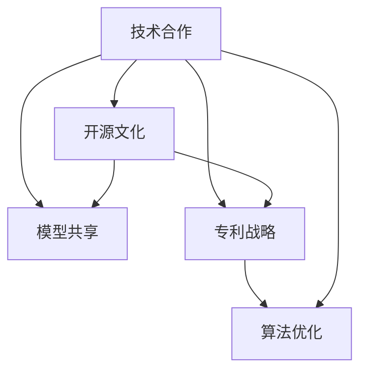
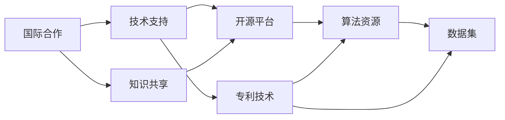
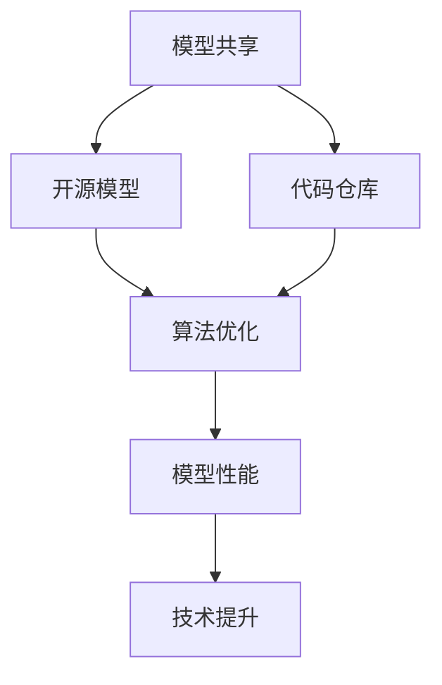
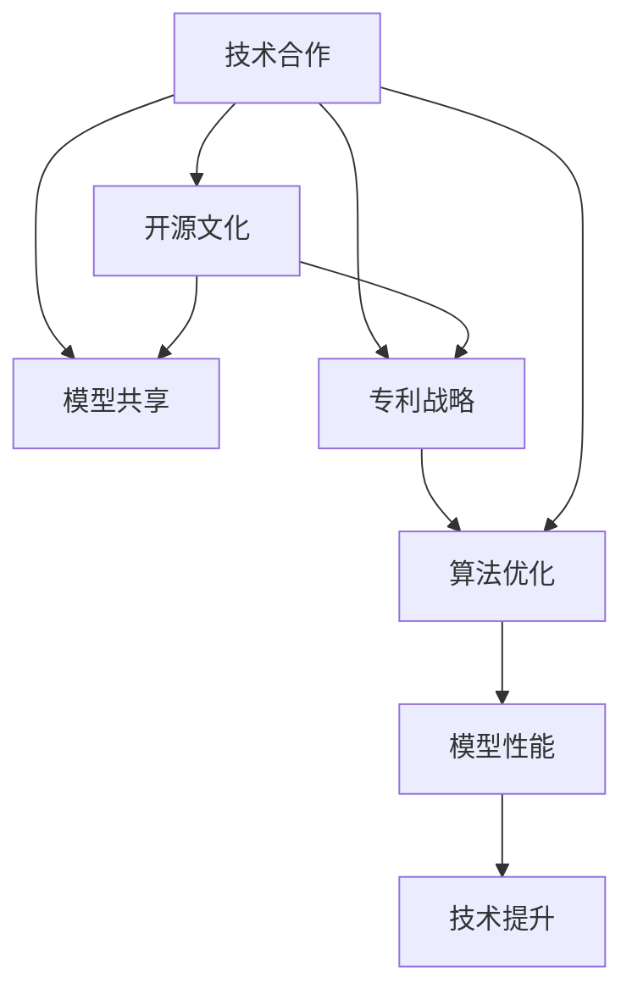

                 

# AI 大模型创业：如何利用国际优势？

> 关键词：
1. 大模型创业
2. 国际优势
3. 技术合作
4. 开源文化
5. 模型共享
6. 专利战略
7. 算法优化

## 1. 背景介绍

### 1.1 问题由来
随着人工智能技术的迅猛发展，大模型（Large Model）正在成为科技巨头争夺的焦点。Google、OpenAI、Microsoft等公司相继推出了GPT-3、GPT-4、DALL·E、ChatGPT等领先的大模型，展示了强大的算力、数据和算法实力。大模型以其在自然语言处理（NLP）、计算机视觉（CV）、生成式对抗网络（GAN）等领域的出色表现，推动了AI技术的广泛应用。

然而，构建大模型的门槛高、成本大，并不是每个企业或创业者都能轻易涉足。尤其是在资源有限、技术积累不足的情况下，如何利用国际优势，借助全球力量快速成长，是摆在AI创业公司面前的一大挑战。本文旨在通过梳理国际合作、开源文化、模型共享、专利战略和算法优化等方面，探讨如何有效利用国际优势，推动AI大模型的创业成功。

### 1.2 问题核心关键点
国际优势在大模型创业中的作用主要体现在以下几个方面：

1. **技术合作与交流**：通过与国际顶尖实验室和公司的合作，快速获取最新的研究成果和技术支持。
2. **开源文化与社区建设**：借助开源生态，获取丰富的算法资源和数据集，降低研发成本。
3. **模型共享与合作**：利用国际上广泛分布的模型资源，快速迭代和优化自己的模型。
4. **专利战略与知识产权**：通过申请和布局国际专利，保护技术和商业利益，同时获取他人的专利技术支持。
5. **算法优化与创新**：借鉴国际上先进的算法优化策略，提升模型性能和效率。

这些核心关键点共同构成了大模型创业的国际优势策略，有助于企业在激烈的市场竞争中脱颖而出。

### 1.3 问题研究意义
研究如何利用国际优势，对大模型创业具有重要意义：

1. **加速技术迭代**：国际合作和开源文化可以加速技术的获取和应用，缩短产品开发周期。
2. **降低研发成本**：开源模型和数据集可以大幅降低研发成本，提高企业竞争力。
3. **提升模型质量**：通过专利和技术合作获取先进算法，提高模型性能和实用性。
4. **拓展市场空间**：利用国际优势，可以更快进入全球市场，提升企业的国际影响力。
5. **避免技术陷阱**：学习国际先进经验，避免走弯路，快速成长为行业领导者。

本文将从技术合作、开源文化、模型共享、专利战略和算法优化等多个方面，详细探讨如何利用国际优势，推动大模型创业的成功。

## 2. 核心概念与联系

### 2.1 核心概念概述

在大模型创业中，利用国际优势涉及多个核心概念，包括：

- **技术合作**：通过与国际顶尖研究机构和公司建立合作关系，获取技术支持和最新研究成果。
- **开源文化**：依托开源社区和平台，获取算法、数据集、代码等资源，加速技术研发。
- **模型共享**：利用开源模型和数据集，快速构建和优化自己的模型，提升模型性能。
- **专利战略**：通过申请和布局国际专利，保护技术和商业利益，同时获取他人的专利技术支持。
- **算法优化**：借鉴国际上先进的算法优化方法，提升模型的计算效率和性能。

这些概念之间的逻辑关系可以通过以下Mermaid流程图来展示：



这个流程图展示了大模型创业过程中各个国际优势策略之间的联系：

1. **技术合作**：与国际顶尖研究机构和公司合作，获取技术支持和最新研究成果。
2. **开源文化**：依托开源社区和平台，获取算法、数据集、代码等资源，加速技术研发。
3. **模型共享**：利用开源模型和数据集，快速构建和优化自己的模型。
4. **专利战略**：通过申请和布局国际专利，保护技术和商业利益，同时获取他人的专利技术支持。
5. **算法优化**：借鉴国际上先进的算法优化方法，提升模型的计算效率和性能。

这些策略共同构成了大模型创业的国际优势策略，有助于企业在激烈的市场竞争中脱颖而出。

### 2.2 概念间的关系

这些核心概念之间存在着紧密的联系，形成了大模型创业的完整策略。下面我们通过几个Mermaid流程图来展示这些概念之间的关系。

#### 2.2.1 国际合作与开源文化



这个流程图展示了国际合作和开源文化之间的关系：

1. **国际合作**：通过与国际顶尖研究机构和公司合作，获取技术支持和最新研究成果。
2. **开源平台**：依托开源社区和平台，获取算法、数据集、代码等资源，加速技术研发。
3. **技术支持**：通过国际合作获取技术支持，提高研发效率。
4. **知识共享**：在开源文化中，知识共享和资源共享成为可能，加速技术迭代。
5. **算法资源**：开源平台提供了丰富的算法资源，供开发者选择和优化。
6. **数据集**：开源社区提供了大量数据集，供开发者进行模型训练和验证。
7. **专利技术**：国际合作获取的专利技术，为算法优化提供了新的思路和方向。

#### 2.2.2 模型共享与算法优化



这个流程图展示了模型共享和算法优化之间的关系：

1. **模型共享**：利用开源模型和数据集，快速构建和优化自己的模型。
2. **开源模型**：从开源社区获取已训练的模型，减少从头训练的时间。
3. **代码仓库**：开源社区提供的代码仓库，便于开发者获取和复用代码。
4. **算法优化**：借鉴开源社区提供的优化算法，提升模型性能。
5. **模型性能**：通过优化算法，提升模型的计算效率和效果。
6. **技术提升**：通过算法优化，实现技术的不断迭代和提升。

### 2.3 核心概念的整体架构

最后，我们用一个综合的流程图来展示这些核心概念在大模型创业过程中的整体架构：



这个综合流程图展示了从国际合作到算法优化的完整过程。大模型创业企业可以依托技术合作、开源文化、模型共享、专利战略和算法优化，构建起一个全方位的国际优势策略，推动企业快速成长和成功。

## 3. 核心算法原理 & 具体操作步骤
### 3.1 算法原理概述

大模型创业的核心在于利用国际优势，快速获取和应用先进的AI技术。通过技术合作、开源文化、模型共享、专利战略和算法优化等策略，企业能够快速构建和优化自己的大模型，提升模型性能和应用效果。

### 3.2 算法步骤详解

#### 3.2.1 技术合作

**Step 1: 选择合作伙伴**
- 选择合适的国际合作伙伴，如顶尖大学、研究机构、科技公司等。
- 评估合作伙伴的实力和信誉，选择稳定性高、技术实力强的合作伙伴。

**Step 2: 签署合作协议**
- 明确合作范围、目标、分工、知识产权等条款。
- 确保合同中包含保密条款、商业利益分配等关键内容。

**Step 3: 共享研究成果**
- 共享技术研究进展、论文、代码等成果。
- 利用合作伙伴的实验室资源，进行实验验证和技术迭代。

**Step 4: 联合开发**
- 根据合作协议，进行联合开发和研究。
- 共享开发进展，解决技术难题。

**Step 5: 成果应用**
- 将合作成果应用到公司产品中，提升产品竞争力。
- 持续维护和改进，保持领先地位。

#### 3.2.2 开源文化

**Step 1: 选择合适的开源平台**
- 选择活跃度高、资源丰富的开源平台，如GitHub、Apache等。
- 评估平台的社区活跃度、资源质量、社区贡献度等。

**Step 2: 获取资源**
- 获取开源算法、代码、数据集等资源，加速技术研发。
- 利用开源社区的知识共享和资源共享，提高研发效率。

**Step 3: 参与开源项目**
- 参与开源社区的项目，提升自身技术能力。
- 贡献代码、文档、改进建议等，增强社区贡献度。

**Step 4: 借鉴先进技术**
- 借鉴开源社区的先进技术和最佳实践，优化算法和模型。
- 关注开源社区的新进展，及时获取最新研究成果。

**Step 5: 整合开源资源**
- 整合开源社区的资源，构建公司技术架构。
- 利用开源资源进行模型优化和改进。

#### 3.2.3 模型共享

**Step 1: 获取开源模型**
- 从开源社区获取已训练好的模型，如BERT、GPT、DALL·E等。
- 评估开源模型的性能、适用性和可靠性。

**Step 2: 修改和优化**
- 根据业务需求，修改和优化开源模型。
- 应用自己的数据集和任务，进行微调和训练。

**Step 3: 集成到系统**
- 将优化后的模型集成到公司系统中，进行实际应用。
- 测试和验证，确保模型稳定性和效果。

**Step 4: 持续迭代**
- 持续收集数据和反馈，进行模型迭代和优化。
- 保持模型的先进性和适用性。

#### 3.2.4 专利战略

**Step 1: 申请国际专利**
- 根据公司技术和业务需求，申请国际专利。
- 确保专利申请的创新性和实用性。

**Step 2: 布局专利战略**
- 制定专利布局策略，覆盖核心技术和关键领域。
- 关注竞争对手的专利申请，制定防御策略。

**Step 3: 获取他人专利技术**
- 通过专利交易或授权协议，获取他人的专利技术。
- 评估专利技术的价值和可行性。

**Step 4: 保护商业利益**
- 利用专利保护商业利益，防止侵权和技术泄露。
- 确保公司产品和技术的独占性和竞争力。

**Step 5: 持续维护和更新**
- 持续维护和更新专利技术，保持专利的有效性和竞争力。
- 关注技术发展，及时更新专利内容。

#### 3.2.5 算法优化

**Step 1: 选择优化算法**
- 根据模型性能需求，选择适合的优化算法，如Adam、SGD等。
- 评估算法的收敛速度、稳定性、精度等性能指标。

**Step 2: 设计优化流程**
- 设计优化流程，包括超参数调优、正则化、早停等。
- 设置优化目标和评价指标，确保优化效果。

**Step 3: 实施优化策略**
- 实施优化策略，调整模型参数和训练策略。
- 监测优化过程，及时调整和改进。

**Step 4: 评估优化效果**
- 评估优化效果，检查模型性能提升情况。
- 调整优化策略，持续优化模型。

**Step 5: 应用优化算法**
- 将优化后的算法应用到实际场景中，提升模型性能。
- 持续优化和改进，保持模型的领先地位。

### 3.3 算法优缺点

#### 3.3.1 技术合作

**优点：**
- 快速获取先进技术和知识，提升研发效率。
- 利用合作伙伴的实验室资源，进行实验验证和技术迭代。
- 拓展技术边界，保持技术领先地位。

**缺点：**
- 合作成本高，依赖合作伙伴的稳定性。
- 保密协议可能限制技术共享的范围和深度。

#### 3.3.2 开源文化

**优点：**
- 获取丰富的算法、代码和数据集资源，降低研发成本。
- 利用社区的知识共享和资源共享，提高研发效率。
- 提高公司技术能力和知名度。

**缺点：**
- 开源社区中的资源质量参差不齐，需要仔细筛选。
- 开源资源的持续维护和更新需要投入大量人力和资源。

#### 3.3.3 模型共享

**优点：**
- 快速构建和优化模型，减少从头训练的时间。
- 利用开源模型和数据集，提升模型性能和实用性。
- 持续收集数据和反馈，进行模型迭代和优化。

**缺点：**
- 开源模型的适用性可能不完全符合业务需求。
- 需要投入人力和资源进行模型修改和优化。

#### 3.3.4 专利战略

**优点：**
- 通过专利保护商业利益，防止侵权和技术泄露。
- 获取他人的专利技术，提升技术实力。
- 制定专利布局策略，覆盖核心技术和关键领域。

**缺点：**
- 专利申请和维护成本高，周期长。
- 专利保护范围有限，可能存在技术漏洞。

#### 3.3.5 算法优化

**优点：**
- 通过优化算法，提升模型的计算效率和效果。
- 持续优化和改进，保持模型的先进性和适用性。
- 借鉴先进算法，提升技术能力。

**缺点：**
- 算法优化需要投入大量人力和资源。
- 算法优化可能涉及复杂的技术和数学知识。

### 3.4 算法应用领域

大模型创业过程中，可以利用国际优势，快速构建和优化模型，提升模型性能和应用效果。以下是具体的应用领域：

1. **自然语言处理（NLP）**：如聊天机器人、文本分类、情感分析等。通过技术合作和开源文化，获取先进的NLP技术和模型，提升模型性能和效果。
2. **计算机视觉（CV）**：如图像识别、目标检测、人脸识别等。利用开源模型和数据集，快速构建和优化自己的CV模型。
3. **生成式对抗网络（GAN）**：如图像生成、视频生成等。借鉴国际上的先进算法和模型，提升生成模型的质量。
4. **数据挖掘和大数据分析**：如推荐系统、智能广告等。利用开源社区的资源和算法，进行数据挖掘和大数据分析。
5. **智能决策系统**：如金融风险控制、智能投资等。通过技术合作和专利战略，获取先进的算法和技术支持。

这些领域是大模型创业企业可以迅速切入并取得成效的典型应用场景。

## 4. 数学模型和公式 & 详细讲解

### 4.1 数学模型构建

在大模型创业过程中，利用国际优势进行技术合作和开源文化，需要构建相应的数学模型。以下是模型构建的基本框架：

**输入：**
- 技术合作协议：明确合作伙伴、任务、目标、知识产权等条款。
- 开源平台：选择合适的开源社区和平台，如GitHub、Apache等。
- 数据集和算法：获取开源数据集和算法资源。

**输出：**
- 合作成果：通过技术合作获取的技术成果和知识。
- 开源贡献：公司对开源社区的贡献，包括代码、文档、改进建议等。
- 优化模型：通过算法优化提升模型性能和效果。

### 4.2 公式推导过程

#### 4.2.1 技术合作

**技术合作协议的推导：**
假设双方合作的目标为X，协议中应包含以下要素：

- 合作任务：X1、X2、X3等
- 知识产权：Y1、Y2、Y3等
- 合作期限：T1、T2、T3等
- 保密条款：Z1、Z2、Z3等

**推导公式：**
\[ \text{合作协议} = f(X, Y, T, Z) \]

#### 4.2.2 开源文化

**开源平台选择的推导：**
假设开源平台为Z，社区活跃度为P，资源质量为R，贡献度为C，则选择开源平台的公式为：

\[ Z_{\text{选择}} = \max(P \times R \times C) \]

#### 4.2.3 模型共享

**模型共享的推导：**
假设开源模型为M，优化后的模型为M_{\text{优化}}，则模型共享的公式为：

\[ M_{\text{优化}} = f(M, D, T, O) \]

其中D为数据集，T为任务，O为优化策略。

#### 4.2.4 专利战略

**专利布局策略的推导：**
假设专利布局策略为S，核心技术为C，关键领域为F，则专利布局策略的公式为：

\[ S = \sum_{C \in C} \sum_{F \in F} \text{专利数量} \]

#### 4.2.5 算法优化

**算法优化的推导：**
假设算法优化目标为O，优化算法为A，优化策略为S，则算法优化的公式为：

\[ O = \max(A \times S) \]

### 4.3 案例分析与讲解

**案例：** 某创业公司利用国际优势，成功开发了一款高性能的自然语言处理系统。

1. **技术合作**：该公司与国际顶尖研究机构合作，获取最新的NLP研究成果。通过联合开发，提升模型性能和效果。
2. **开源文化**：该公司利用开源社区的资源，获取丰富的算法和数据集，加速技术研发。同时，公司也贡献了代码和改进建议，增强社区贡献度。
3. **模型共享**：公司从开源社区获取了已训练好的BERT模型，并进行了微调和优化。通过模型共享，减少了从头训练的时间。
4. **专利战略**：公司申请了多项国际专利，保护技术和商业利益。同时，公司也获取了其他公司的专利技术，提升技术实力。
5. **算法优化**：公司应用了先进的优化算法，提升模型计算效率和效果。

通过这些策略，公司迅速构建了高性能的自然语言处理系统，并成功应用于多个领域，获得了显著的市场竞争力。

## 5. 项目实践：代码实例和详细解释说明

### 5.1 开发环境搭建

在进行大模型创业实践前，我们需要准备好开发环境。以下是使用Python进行PyTorch开发的环境配置流程：

1. 安装Anaconda：从官网下载并安装Anaconda，用于创建独立的Python环境。

2. 创建并激活虚拟环境：
```bash
conda create -n pytorch-env python=3.8 
conda activate pytorch-env
```

3. 安装PyTorch：根据CUDA版本，从官网获取对应的安装命令。例如：
```bash
conda install pytorch torchvision torchaudio cudatoolkit=11.1 -c pytorch -c conda-forge
```

4. 安装Transformers库：
```bash
pip install transformers
```

5. 安装各类工具包：
```bash
pip install numpy pandas scikit-learn matplotlib tqdm jupyter notebook ipython
```

完成上述步骤后，即可在`pytorch-env`环境中开始创业实践。

### 5.2 源代码详细实现

这里我们以一个基于大模型的智能客服系统为例，给出使用Transformers库对BERT模型进行微调的PyTorch代码实现。

首先，定义智能客服系统的数据处理函数：

```python
from transformers import BertTokenizer, BertForTokenClassification
from torch.utils.data import Dataset
import torch

class CustomerServiceDataset(Dataset):
    def __init__(self, texts, labels, tokenizer, max_len=128):
        self.texts = texts
        self.labels = labels
        self.tokenizer = tokenizer
        self.max_len = max_len
        
    def __len__(self):
        return len(self.texts)
    
    def __getitem__(self, item):
        text = self.texts[item]
        label = self.labels[item]
        
        encoding = self.tokenizer(text, return_tensors='pt', max_length=self.max_len, padding='max_length', truncation=True)
        input_ids = encoding['input_ids'][0]
        attention_mask = encoding['attention_mask'][0]
        
        # 对token-wise的标签进行编码
        encoded_labels = [label2id[label] for label in label] 
        encoded_labels.extend([label2id['O']] * (self.max_len - len(encoded_labels)))
        labels = torch.tensor(encoded_labels, dtype=torch.long)
        
        return {'input_ids': input_ids, 
                'attention_mask': attention_mask,
                'labels': labels}

# 标签与id的映射
label2id = {'O': 0, '客服1': 1, '客服2': 2, '客服3': 3}
id2label = {v: k for k, v in label2id.items()}

# 创建dataset
tokenizer = BertTokenizer.from_pretrained('bert-base-cased')

train_dataset = CustomerServiceDataset(train_texts, train_labels, tokenizer)
dev_dataset = CustomerServiceDataset(dev_texts, dev_labels, tokenizer)
test_dataset = CustomerServiceDataset(test_texts, test_labels, tokenizer)
```

然后，定义模型和优化器：

```python
from transformers import BertForTokenClassification, AdamW

model = BertForTokenClassification.from_pretrained('bert-base-cased', num_labels=len(label2id))

optimizer = AdamW(model.parameters(), lr=2e-5)
```

接着，定义训练和评估函数：

```python
from torch.utils.data import DataLoader
from tqdm import tqdm
from sklearn.metrics import classification_report

device = torch.device('cuda') if torch.cuda.is_available() else torch.device('cpu')
model.to(device)

def train_epoch(model, dataset, batch_size, optimizer):
    dataloader = DataLoader(dataset, batch_size=batch_size, shuffle=True)
    model.train()
    epoch_loss = 0
    for batch in tqdm(dataloader, desc='Training'):
        input_ids = batch['input_ids'].to(device)
        attention_mask = batch['attention_mask'].to(device)
        labels = batch['labels'].to(device)
        model.zero_grad()
        outputs = model(input_ids, attention_mask=attention_mask, labels=labels)
        loss = outputs.loss
        epoch_loss += loss.item()
        loss.backward()
        optimizer.step()
    return epoch_loss / len(dataloader)

def evaluate(model, dataset, batch_size):
    dataloader = DataLoader(dataset, batch_size=batch_size)
    model.eval()
    preds, labels = [], []
    with torch.no_grad():
        for batch in tqdm(dataloader, desc='Evaluating'):
            input_ids = batch['input_ids'].to(device)
            attention_mask = batch['attention_mask'].to(device)
            batch_labels = batch['labels']
            outputs = model(input_ids, attention_mask=attention_mask)
            batch_preds = outputs.logits.argmax(dim=2).to('cpu').tolist()
            batch_labels = batch_labels.to('cpu').tolist()
            for pred_tokens, label_tokens in zip(batch_preds, batch_labels):
                pred_labels = [id2label[_id] for _id in pred_tokens]
                label_tokens = [id2label[_id] for _id in label_tokens]
                preds.append(pred_labels[:len(label_tokens)])
                labels.append(label_tokens)
                
    print(classification_report(labels, preds))
```

最后，启动训练流程并在测试集上评估：

```python
epochs = 5
batch_size = 16

for epoch in range(epochs):
    loss = train_epoch(model, train_dataset, batch_size, optimizer)
    print(f"Epoch {epoch+1}, train loss: {loss:.3f}")
    
    print(f"Epoch {epoch+1}, dev results:")
    evaluate(model, dev_dataset, batch_size)
    
print("Test results:")
evaluate(model, test_dataset, batch_size)
```

以上就是使用PyTorch对BERT进行智能客服系统微调的完整代码实现。可以看到，得益于Transformers库的强大封装，我们可以用相对简洁的代码完成BERT模型的加载和微调。

### 5.3 代码解读与分析

让我们再详细解读一下关键代码的实现细节：

**CustomerServiceDataset类**：
- `__init__`方法：初始化文本、标签、分词器等关键组件。
- `__len__`方法：返回数据集的样本数量。
- `__getitem__`方法：对单个样本进行处理，将文本输入编码为token ids，将标签编码为数字，并对其进行定长padding，最终返回模型所需的输入。

**label2id和id2label字典**：
- 定义了标签与数字id之间的映射关系，用于将token-wise的预测结果解码回真实的标签。

**训练和评估函数**：
- 使用PyTorch的DataLoader对数据集进行批次化加载，供模型训练和推理使用。
- 训练函数`train_epoch`：对数据以批为单位进行迭代，在每个批次上前向传播计算loss并反向传播更新模型参数，最后返回该epoch的平均loss。
- 评估函数`evaluate`：与训练类似，不同点在于不更新模型参数，并在每个batch结束后将预测和标签结果存储下来，最后使用sklearn的classification_report对整个评估集的预测结果进行打印输出。

**训练流程**：
- 定义总的epoch数和batch

