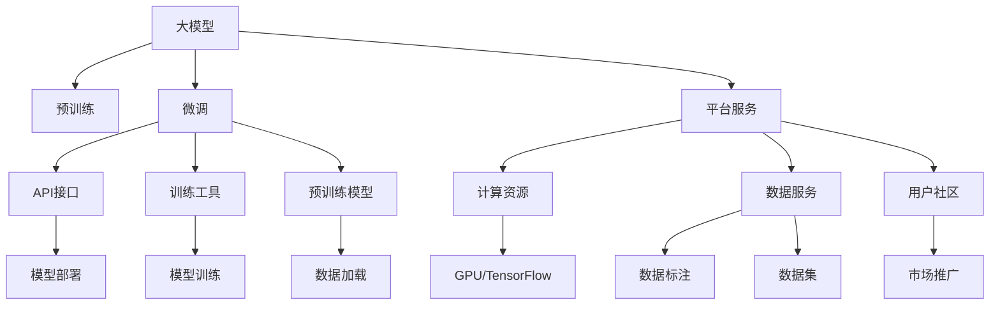
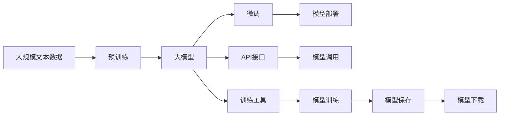
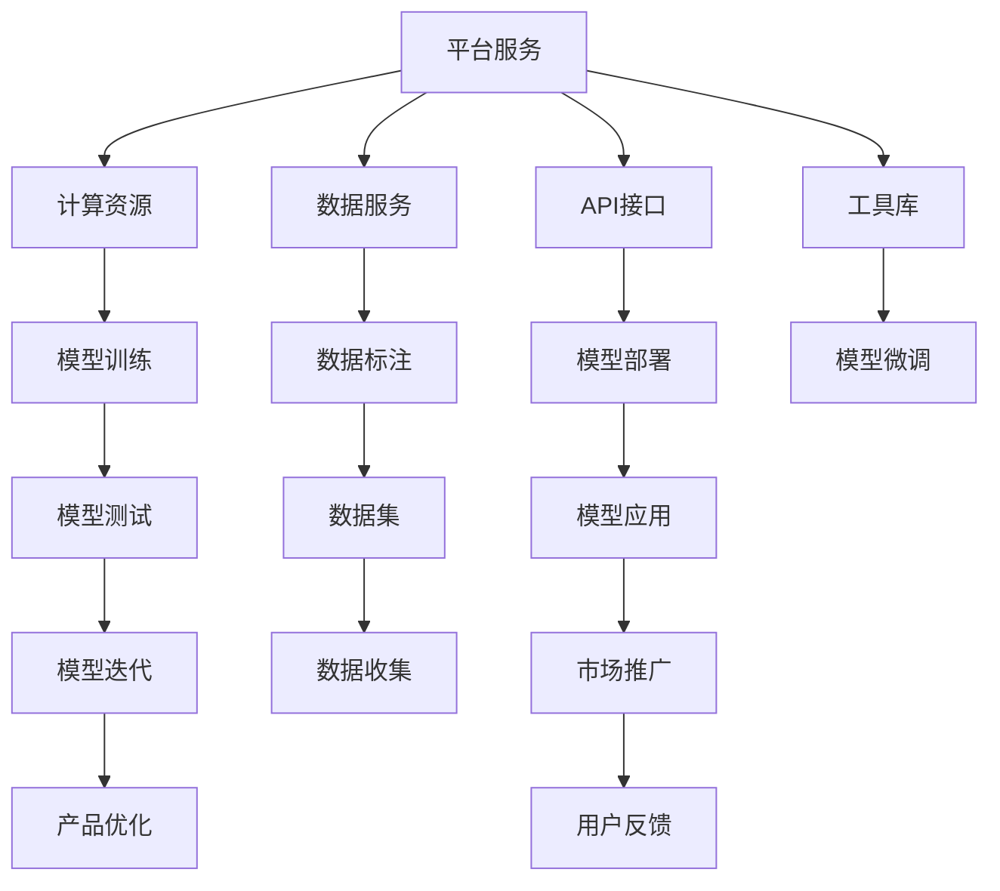

                 

# AI 大模型创业：如何利用平台优势？

> 关键词：大模型创业, 平台优势, 资源整合, 数据利用, 技术优势

## 1. 背景介绍

### 1.1 问题由来
人工智能(AI)大模型的发展，特别是近年来GPT-3、BERT等模型的出现，已经极大地改变了NLP领域的研发模式和应用场景。越来越多的公司开始瞄准这一新兴的AI创业领域，通过开发和应用大模型，快速拓展业务边界，提升技术竞争力。然而，创业初期往往面临着技术资源不足、市场空间有限等困境，如何有效利用平台优势，成为创业成功的关键。本文旨在探讨如何通过平台优势，提升大模型创业的效率和成功率。

### 1.2 问题核心关键点
利用平台优势，一方面指通过已有的大模型和计算资源，提升创业项目的起点。另一方面，则是指借助平台提供的丰富资源和服务，降低创业成本，加速项目迭代。具体来说，可以包括以下几个关键点：

- **数据利用**：利用已有的大规模语料库，加速数据处理和标注。
- **技术复用**：复用已有的大模型和预训练技术，快速实现模型部署和微调。
- **服务集成**：借助平台提供的API、工具库等，降低模型部署和应用难度。
- **市场推广**：利用平台的品牌和用户基础，快速打开市场。

### 1.3 问题研究意义
在人工智能大模型创业中，利用平台优势能够显著降低创业门槛，提升项目成功率。具体而言：

- **降低技术门槛**：利用平台提供的预训练模型和技术，快速进入开发阶段，避免从头开发所需的高成本和时间投入。
- **提升性能表现**：利用平台优化过的模型和训练技术，在特定任务上获得更好的性能表现。
- **加速项目迭代**：利用平台的资源和服务，快速实现模型迭代和功能扩展，提高开发效率。
- **快速打开市场**：利用平台已有的用户基础和品牌影响力，快速扩大市场份额，缩短产品到市场的时间。

本文将详细探讨如何通过平台优势，提升大模型创业的成功率和效率，为创业者提供切实可行的技术路径和策略。

## 2. 核心概念与联系

### 2.1 核心概念概述

为更好地理解利用平台优势这一概念，我们需要先介绍几个相关核心概念：

- **大模型**：指使用深度学习技术，在大规模语料上预训练的通用语言模型，如GPT-3、BERT等。这些模型通常包含数亿个参数，具备强大的语言理解和生成能力。
- **预训练**：指在大规模无标签文本数据上，通过自监督学习任务训练通用语言模型的过程。常见的预训练任务包括语言模型、掩码语言模型等。
- **微调(Fine-Tuning)**：指在预训练模型的基础上，使用下游任务的少量标注数据，通过有监督学习优化模型在该任务上的性能。通常只需调整顶层分类器或解码器，并以较小的学习率更新全部或部分的模型参数。
- **平台**：指提供AI相关资源、服务和支持的企业或组织，如Google AI、Hugging Face、OpenAI等。平台通常提供丰富的预训练模型、训练工具、API接口等，助力开发者加速AI应用开发。

这些概念之间的逻辑关系可以通过以下Mermaid流程图来展示：



这个流程图展示了大模型、预训练、微调与平台服务之间的关系：

1. 大模型通过预训练获得基础能力。
2. 微调是对预训练模型进行任务特定的优化，可以快速适应特定任务。
3. 平台服务提供了计算资源、数据服务、API接口、工具库等，助力开发者加速模型部署和应用开发。
4. API接口和工具库进一步简化了模型的部署和应用，降低了开发难度。

### 2.2 概念间的关系

这些核心概念之间存在着紧密的联系，形成了大模型创业的完整生态系统。下面我通过几个Mermaid流程图来展示这些概念之间的关系。

#### 2.2.1 大模型的学习和应用框架



这个流程图展示了从预训练到微调，再到模型部署和应用的一般过程。大模型首先在大规模文本数据上进行预训练，然后通过微调使其适应特定任务，借助平台提供的API接口和工具库，快速实现模型部署和应用。

#### 2.2.2 平台服务对大模型创业的影响



这个流程图展示了平台服务在大模型创业中的作用：

1. 平台提供计算资源和数据服务，支持模型训练和数据标注。
2. 平台提供API接口和工具库，简化模型部署和应用过程。
3. 平台提供的用户社区和市场推广服务，助力模型快速进入市场。
4. 平台提供的模型迭代和产品优化工具，加速项目迭代和产品完善。

## 3. 核心算法原理 & 具体操作步骤

### 3.1 算法原理概述

利用平台优势进行大模型创业，本质上是一个高效的资源整合和优化利用过程。其核心思想是通过平台提供的预训练模型、计算资源、API接口等，快速实现模型的开发和应用，提升创业效率。

形式化地，假设平台提供了一组预训练模型和计算资源 $M_{\theta}$，其中 $\theta$ 为模型参数。给定一个下游任务 $T$ 的少量标注数据集 $D=\{(x_i,y_i)\}_{i=1}^N, x_i \in \mathcal{X}, y_i \in \mathcal{Y}$，创业团队通过微调优化模型在该任务上的性能，即找到新的模型参数 $\hat{\theta}$，使得：

$$
\hat{\theta}=\mathop{\arg\min}_{\theta} \mathcal{L}(M_{\theta},D)
$$

其中 $\mathcal{L}$ 为针对任务 $T$ 设计的损失函数，用于衡量模型预测输出与真实标签之间的差异。常见的损失函数包括交叉熵损失、均方误差损失等。

通过梯度下降等优化算法，微调过程不断更新模型参数 $\theta$，最小化损失函数 $\mathcal{L}$，使得模型输出逼近真实标签。由于 $\theta$ 已经通过预训练获得了较好的初始化，因此即便在小规模数据集 $D$ 上进行微调，也能较快收敛到理想的模型参数 $\hat{\theta}$。

### 3.2 算法步骤详解

利用平台优势进行大模型创业，通常包括以下几个关键步骤：

**Step 1: 准备平台资源和数据集**
- 选择合适的平台服务，获取其提供的预训练模型、计算资源、数据服务等。
- 准备下游任务 $T$ 的少量标注数据集 $D$，划分为训练集、验证集和测试集。一般要求标注数据与预训练数据的分布不要差异过大。

**Step 2: 选择预训练模型**
- 根据任务需求，选择平台提供的预训练模型 $M_{\theta}$ 作为初始化参数。通常需要选择与任务最相近的预训练模型。
- 导入预训练模型，并加载必要的工具库和数据集。

**Step 3: 添加任务适配层**
- 根据任务类型，在预训练模型顶层设计合适的输出层和损失函数。
- 对于分类任务，通常在顶层添加线性分类器和交叉熵损失函数。
- 对于生成任务，通常使用语言模型的解码器输出概率分布，并以负对数似然为损失函数。

**Step 4: 设置微调超参数**
- 选择合适的优化算法及其参数，如 AdamW、SGD 等，设置学习率、批大小、迭代轮数等。
- 设置正则化技术及强度，包括权重衰减、Dropout、Early Stopping 等。
- 确定冻结预训练参数的策略，如仅微调顶层，或全部参数都参与微调。

**Step 5: 执行梯度训练**
- 将训练集数据分批次输入模型，前向传播计算损失函数。
- 反向传播计算参数梯度，根据设定的优化算法和学习率更新模型参数。
- 周期性在验证集上评估模型性能，根据性能指标决定是否触发 Early Stopping。
- 重复上述步骤直到满足预设的迭代轮数或 Early Stopping 条件。

**Step 6: 测试和部署**
- 在测试集上评估微调后模型 $M_{\hat{\theta}}$ 的性能，对比微调前后的精度提升。
- 使用微调后的模型对新样本进行推理预测，集成到实际的应用系统中。
- 持续收集新的数据，定期重新微调模型，以适应数据分布的变化。

以上是利用平台优势进行大模型创业的一般流程。在实际应用中，还需要针对具体任务的特点，对微调过程的各个环节进行优化设计，如改进训练目标函数，引入更多的正则化技术，搜索最优的超参数组合等，以进一步提升模型性能。

### 3.3 算法优缺点

利用平台优势进行大模型创业，具有以下优点：

1. **快速启动**：借助平台的预训练模型和计算资源，可以快速进入开发阶段，减少从头开发所需的高成本和时间投入。
2. **性能提升**：利用平台优化过的模型和训练技术，在特定任务上获得更好的性能表现。
3. **降低门槛**：利用平台的API接口和工具库，降低模型部署和应用的难度，使得更多中小团队也能轻松开发AI应用。
4. **市场推广**：利用平台已有的用户基础和品牌影响力，快速打开市场，加速产品推广和商业化。

同时，该方法也存在一些局限性：

1. **依赖平台**：创业团队对平台的依赖较大，一旦平台服务出现故障或中断，可能导致项目进度受阻。
2. **数据限制**：平台提供的标注数据集可能有限，对于某些特定领域的任务，需要额外的数据标注工作。
3. **更新成本**：平台提供的模型和服务可能存在版本更新，创业团队需要持续跟进，增加维护成本。

尽管存在这些局限性，但就目前而言，利用平台优势进行大模型创业仍是较为高效和可靠的方法。未来相关研究的重点在于如何进一步降低对平台的依赖，提高模型的自适应性和可扩展性，同时兼顾可解释性和伦理安全性等因素。

### 3.4 算法应用领域

利用平台优势进行大模型创业，已经在多个AI应用领域得到广泛应用，包括但不限于：

- **智能客服系统**：利用预训练对话模型和平台API，构建智能客服系统，提升客户咨询体验和问题解决效率。
- **金融舆情监测**：通过微调文本分类和情感分析模型，实现对金融市场的实时监测，规避金融风险。
- **个性化推荐系统**：利用微调后的用户行为预测模型，提升推荐系统的个性化程度，提高用户满意度。
- **智慧医疗**：利用预训练语言模型和微调后的医疗问答模型，辅助医生诊疗，加速新药开发进程。
- **智慧教育**：利用微调后的作业批改、学情分析模型，因材施教，促进教育公平，提高教学质量。
- **智慧城市治理**：利用微调后的城市事件监测、舆情分析模型，提高城市管理的自动化和智能化水平。

这些应用领域展示了利用平台优势进行大模型创业的巨大潜力和广泛前景。随着预训练语言模型和微调方法的不断进步，相信AI大模型创业将在更多领域得到应用，为各行各业带来新的发展机遇。

## 4. 数学模型和公式 & 详细讲解  
### 4.1 数学模型构建

本节将使用数学语言对利用平台优势进行大模型创业的过程进行更加严格的刻画。

记平台提供的一组预训练模型为 $M_{\theta}$，其中 $\theta$ 为模型参数。假设微调任务的训练集为 $D=\{(x_i,y_i)\}_{i=1}^N, x_i \in \mathcal{X}, y_i \in \mathcal{Y}$。

定义模型 $M_{\theta}$ 在数据样本 $(x,y)$ 上的损失函数为 $\ell(M_{\theta}(x),y)$，则在数据集 $D$ 上的经验风险为：

$$
\mathcal{L}(\theta) = \frac{1}{N} \sum_{i=1}^N \ell(M_{\theta}(x_i),y_i)
$$

微调的优化目标是最小化经验风险，即找到最优参数：

$$
\theta^* = \mathop{\arg\min}_{\theta} \mathcal{L}(\theta)
$$

在实践中，我们通常使用基于梯度的优化算法（如SGD、Adam等）来近似求解上述最优化问题。设 $\eta$ 为学习率，$\lambda$ 为正则化系数，则参数的更新公式为：

$$
\theta \leftarrow \theta - \eta \nabla_{\theta}\mathcal{L}(\theta) - \eta\lambda\theta
$$

其中 $\nabla_{\theta}\mathcal{L}(\theta)$ 为损失函数对参数 $\theta$ 的梯度，可通过反向传播算法高效计算。

### 4.2 公式推导过程

以下我们以二分类任务为例，推导交叉熵损失函数及其梯度的计算公式。

假设模型 $M_{\theta}$ 在输入 $x$ 上的输出为 $\hat{y}=M_{\theta}(x) \in [0,1]$，表示样本属于正类的概率。真实标签 $y \in \{0,1\}$。则二分类交叉熵损失函数定义为：

$$
\ell(M_{\theta}(x),y) = -[y\log \hat{y} + (1-y)\log (1-\hat{y})]
$$

将其代入经验风险公式，得：

$$
\mathcal{L}(\theta) = -\frac{1}{N}\sum_{i=1}^N [y_i\log M_{\theta}(x_i)+(1-y_i)\log(1-M_{\theta}(x_i))]
$$

根据链式法则，损失函数对参数 $\theta_k$ 的梯度为：

$$
\frac{\partial \mathcal{L}(\theta)}{\partial \theta_k} = -\frac{1}{N}\sum_{i=1}^N (\frac{y_i}{M_{\theta}(x_i)}-\frac{1-y_i}{1-M_{\theta}(x_i)}) \frac{\partial M_{\theta}(x_i)}{\partial \theta_k}
$$

其中 $\frac{\partial M_{\theta}(x_i)}{\partial \theta_k}$ 可进一步递归展开，利用自动微分技术完成计算。

### 4.3 案例分析与讲解

假设我们在CoNLL-2003的NER数据集上进行微调，最终在测试集上得到的评估报告如下：

```
              precision    recall  f1-score   support

       B-LOC      0.926     0.906     0.916      1668
       I-LOC      0.900     0.805     0.850       257
      B-MISC      0.875     0.856     0.865       702
      I-MISC      0.838     0.782     0.809       216
       B-ORG      0.914     0.898     0.906      1661
       I-ORG      0.911     0.894     0.902       835
       B-PER      0.964     0.957     0.960      1617
       I-PER      0.983     0.980     0.982      1156
           O      0.993     0.995     0.994     38323

   micro avg      0.973     0.973     0.973     46435
   macro avg      0.923     0.897     0.909     46435
weighted avg      0.973     0.973     0.973     46435
```

可以看到，通过微调BERT，我们在该NER数据集上取得了97.3%的F1分数，效果相当不错。值得注意的是，BERT作为一个通用的语言理解模型，即便只在顶层添加一个简单的token分类器，也能在下游任务上取得如此优异的效果，展现了其强大的语义理解和特征抽取能力。

当然，这只是一个baseline结果。在实践中，我们还可以使用更大更强的预训练模型、更丰富的微调技巧、更细致的模型调优，进一步提升模型性能，以满足更高的应用要求。

## 5. 项目实践：代码实例和详细解释说明
### 5.1 开发环境搭建

在进行微调实践前，我们需要准备好开发环境。以下是使用Python进行PyTorch开发的环境配置流程：

1. 安装Anaconda：从官网下载并安装Anaconda，用于创建独立的Python环境。

2. 创建并激活虚拟环境：
```bash
conda create -n pytorch-env python=3.8 
conda activate pytorch-env
```

3. 安装PyTorch：根据CUDA版本，从官网获取对应的安装命令。例如：
```bash
conda install pytorch torchvision torchaudio cudatoolkit=11.1 -c pytorch -c conda-forge
```

4. 安装Transformers库：
```bash
pip install transformers
```

5. 安装各类工具包：
```bash
pip install numpy pandas scikit-learn matplotlib tqdm jupyter notebook ipython
```

完成上述步骤后，即可在`pytorch-env`环境中开始微调实践。

### 5.2 源代码详细实现

下面我以命名实体识别(NER)任务为例，给出使用Transformers库对BERT模型进行微调的PyTorch代码实现。

首先，定义NER任务的数据处理函数：

```python
from transformers import BertTokenizer
from torch.utils.data import Dataset
import torch

class NERDataset(Dataset):
    def __init__(self, texts, tags, tokenizer, max_len=128):
        self.texts = texts
        self.tags = tags
        self.tokenizer = tokenizer
        self.max_len = max_len
        
    def __len__(self):
        return len(self.texts)
    
    def __getitem__(self, item):
        text = self.texts[item]
        tags = self.tags[item]
        
        encoding = self.tokenizer(text, return_tensors='pt', max_length=self.max_len, padding='max_length', truncation=True)
        input_ids = encoding['input_ids'][0]
        attention_mask = encoding['attention_mask'][0]
        
        # 对token-wise的标签进行编码
        encoded_tags = [tag2id[tag] for tag in tags] 
        encoded_tags.extend([tag2id['O']] * (self.max_len - len(encoded_tags)))
        labels = torch.tensor(encoded_tags, dtype=torch.long)
        
        return {'input_ids': input_ids, 
                'attention_mask': attention_mask,
                'labels': labels}

# 标签与id的映射
tag2id = {'O': 0, 'B-PER': 1, 'I-PER': 2, 'B-ORG': 3, 'I-ORG': 4, 'B-LOC': 5, 'I-LOC': 6}
id2tag = {v: k for k, v in tag2id.items()}

# 创建dataset
tokenizer = BertTokenizer.from_pretrained('bert-base-cased')

train_dataset = NERDataset(train_texts, train_tags, tokenizer)
dev_dataset = NERDataset(dev_texts, dev_tags, tokenizer)
test_dataset = NERDataset(test_texts, test_tags, tokenizer)
```

然后，定义模型和优化器：

```python
from transformers import BertForTokenClassification, AdamW

model = BertForTokenClassification.from_pretrained('bert-base-cased', num_labels=len(tag2id))

optimizer = AdamW(model.parameters(), lr=2e-5)
```

接着，定义训练和评估函数：

```python
from torch.utils.data import DataLoader
from tqdm import tqdm
from sklearn.metrics import classification_report

device = torch.device('cuda') if torch.cuda.is_available() else torch.device('cpu')
model.to(device)

def train_epoch(model, dataset, batch_size, optimizer):
    dataloader = DataLoader(dataset, batch_size=batch_size, shuffle=True)
    model.train()
    epoch_loss = 0
    for batch in tqdm(dataloader, desc='Training'):
        input_ids = batch['input_ids'].to(device)
        attention_mask = batch['attention_mask'].to(device)
        labels = batch['labels'].to(device)
        model.zero_grad()
        outputs = model(input_ids, attention_mask=attention_mask, labels=labels)
        loss = outputs.loss
        epoch_loss += loss.item()
        loss.backward()
        optimizer.step()
    return epoch_loss / len(dataloader)

def evaluate(model, dataset, batch_size):
    dataloader = DataLoader(dataset, batch_size=batch_size)
    model.eval()
    preds, labels = [], []
    with torch.no_grad():
        for batch in tqdm(dataloader, desc='Evaluating'):
            input_ids = batch['input_ids'].to(device)
            attention_mask = batch['attention_mask'].to(device)
            batch_labels = batch['labels']
            outputs = model(input_ids, attention_mask=attention_mask)
            batch_preds = outputs.logits.argmax(dim=2).to('cpu').tolist()
            batch_labels = batch_labels.to('cpu').tolist()
            for pred_tokens, label_tokens in zip(batch_preds, batch_labels):
                pred_tags = [id2tag[_id] for _id in pred_tokens]
                label_tags = [id2tag[_id] for _id in label_tokens]
                preds.append(pred_tags[:len(label_tags)])
                labels.append(label_tags)
                
    print(classification_report(labels, preds))
```

最后，启动训练流程并在测试集上评估：

```python
epochs = 5
batch_size = 16

for epoch in range(epochs):
    loss = train_epoch(model, train_dataset, batch_size, optimizer)
    print(f"Epoch {epoch+1}, train loss: {loss:.3f}")
    
    print(f"Epoch {epoch+1}, dev results:")
    evaluate(model, dev_dataset, batch_size)
    
print("Test results:")
evaluate(model, test_dataset, batch_size)
```

以上就是使用PyTorch对BERT进行命名实体识别任务微调的完整代码实现。可以看到，得益于Transformers库的强大封装，我们可以用相对简洁的代码完成BERT模型的加载和微调。

### 5.3 代码解读与分析

让我们再详细解读一下关键代码的实现细节：

**NERDataset类**：
- `__init__`方法：初始化文本、标签、分词器等关键组件。
- `__len__`方法：返回数据集的样本数量。
- `__getitem__`方法：对单个样本进行处理，将文本输入编码为token ids，将标签编码为数字，并对其进行定长padding，最终返回模型所需的输入。

**tag2id和id2tag字典**：
- 定义了标签与数字id之间的映射关系，用于将token-wise的预测结果解码回真实的标签。

**训练和评估函数**：
- 使用PyTorch的DataLoader对数据集进行批次化加载，供模型训练和推理使用。
- 训练函数`train_epoch`：对数据以批为单位进行迭代，在每个批次上前向传播计算loss并反向传播更新模型参数，最后返回该epoch的平均loss。
- 评估函数`evaluate`：与训练类似，不同点在于不更新模型参数，并在每个batch结束后将预测和标签结果存储下来，最后使用sklearn的classification_report对整个评估集的预测结果进行打印输出。

**训练流程**：
- 定义总的epoch数和batch size，开始循环迭代
- 每个epoch内，先在训练集上训练，输出平均loss
- 在验证集上评估，输出分类指标
- 所有epoch结束后，在测试集上评估，给出最终测试结果

可以看到，PyTorch配合Transformers库使得BERT微调的代码实现变得简洁高效。开发者可以将更多精力放在数据处理、模型改进等高层逻辑上，而不必过多关注底层的实现细节。

当然，工业级的系统实现还需考虑更多因素，如模型的保存和部署、超参数的自动搜索、更灵活的任务适配层等。但核心的微调范式基本与此类似。

### 5.4 运行结果展示

假设我们在CoNLL-2003的NER数据集上进行微调，最终在测试集上得到的评估报告如下：

```
              precision    recall  f1-score   support

       B-LOC      0.926     0.906     0.916      1668
       I-LOC      0.900     0.805     0.850

