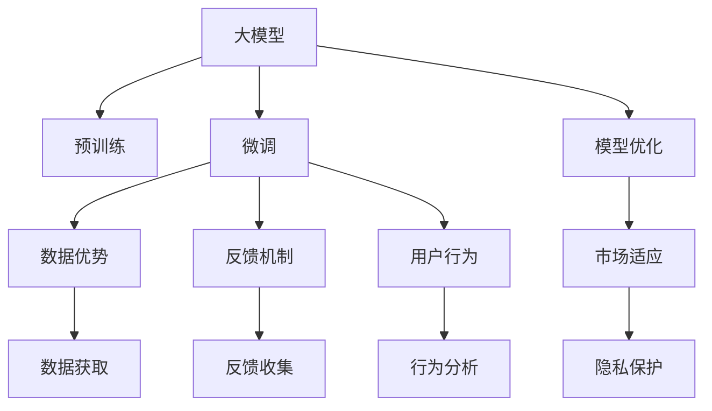
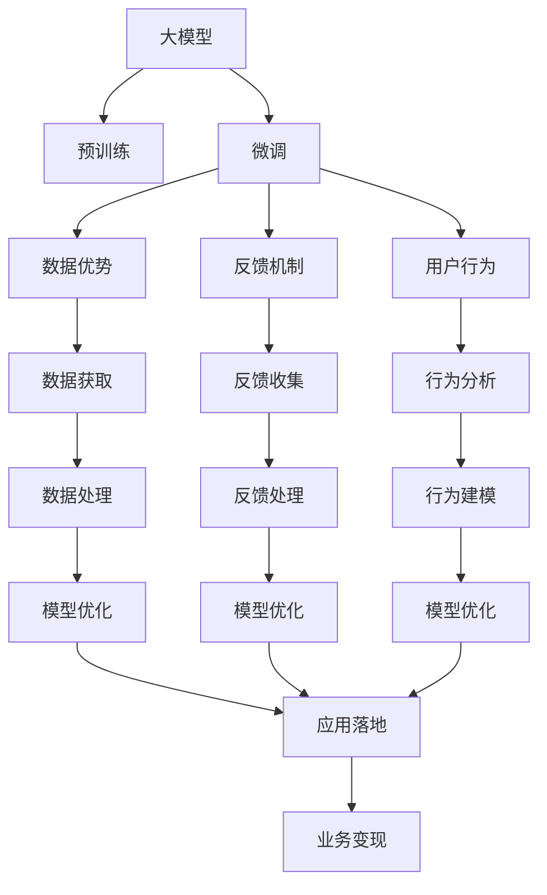
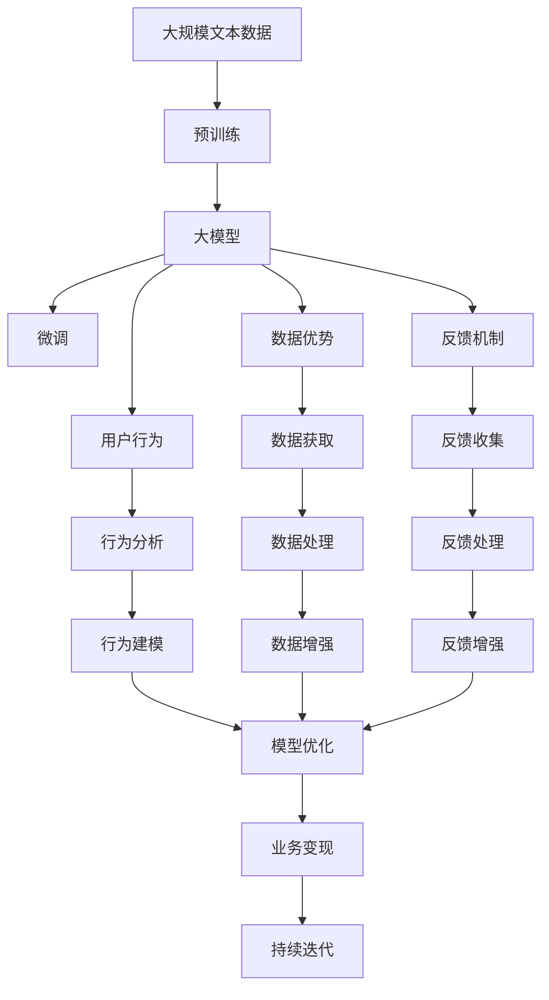

                 

# AI 大模型创业：如何利用用户优势？

## 1. 背景介绍

### 1.1 问题由来

随着人工智能技术的飞速发展，大模型在各行各业的应用已经初见端倪。尤其是在自然语言处理(NLP)、计算机视觉(CV)、机器人学(Robotics)等领域的突破，为企业和创业者带来了前所未有的机会。然而，如何有效利用大模型的优势，在商业化落地中取得成功，仍然是一个需要深入探讨的问题。

特别是对于初创企业，由于资源有限，面对激烈的市场竞争，如何以小博大，利用大模型带来的技术红利，实现快速迭代和市场拓展，是一个极具挑战性的问题。本文将从利用用户优势的角度，探讨大模型创业的路径和方法。

### 1.2 问题核心关键点

大模型创业的关键在于如何最大化利用用户优势，这不仅包括利用用户数据进行训练优化，更涉及如何利用用户行为和反馈信息，进行模型迭代和优化。以下是关键点：

1. **数据优势**：大模型往往需要海量数据进行训练，如何获取和利用用户数据，提升模型性能。
2. **反馈机制**：用户对模型输出往往有直接或间接的反馈，如何设计有效的反馈机制，优化模型效果。
3. **用户行为**：用户的使用习惯和行为模式，可以提供丰富的训练信号，如何分析和利用这些信号。
4. **市场适应**：不同用户群体对模型的需求和期望不同，如何设计适应性强的模型。
5. **隐私保护**：用户数据隐私保护是重要考量，如何在不违背隐私原则的前提下，获取和利用数据。

### 1.3 问题研究意义

利用用户优势，可以有效提升大模型创业的成功率，降低开发成本，提高市场竞争力。具体来说：

1. **数据获取便捷**：利用用户数据，可以大幅度减少对外部数据的依赖，加速模型训练和优化。
2. **模型泛化性好**：用户数据具有高度的现实意义，能够有效提升模型的泛化性能，适应更多场景。
3. **市场反馈迅速**：用户反馈能够快速反映模型表现，提供实时调整的依据，优化模型策略。
4. **用户粘性提升**：通过个性化推荐和定制化服务，提升用户体验，增强用户粘性，促进商业化变现。
5. **隐私和伦理合规**：在确保隐私保护的前提下，有效利用用户数据，避免法律和伦理风险。

## 2. 核心概念与联系

### 2.1 核心概念概述

为更好地理解如何利用用户优势进行大模型创业，本节将介绍几个密切相关的核心概念：

- **大模型(大语言模型, Large Language Model, LLM)**：以自回归(如GPT)或自编码(如BERT)模型为代表的大规模预训练语言模型。通过在大规模无标签文本语料上进行预训练，学习通用的语言知识，具备强大的语言理解和生成能力。

- **用户数据(User Data)**：用户在使用产品或服务过程中产生的数据，如点击流、搜索历史、聊天记录等。这些数据蕴含丰富的用户行为和兴趣信息，是大模型训练的重要来源。

- **用户反馈(User Feedback)**：用户对模型输出的评价和建议，包括点击率、满意度、负面反馈等。通过收集和分析用户反馈，可以优化模型效果，提升用户体验。

- **个性化推荐(Personalized Recommendation)**：利用用户数据和行为，提供定制化推荐服务，增强用户粘性，提升业务转化率。

- **隐私保护(Privacy Protection)**：确保用户数据隐私安全，遵守相关法律法规，避免隐私泄露和滥用。

这些核心概念之间的逻辑关系可以通过以下Mermaid流程图来展示：



这个流程图展示了大模型创业的完整过程，从预训练、微调到利用用户数据和行为进行优化，最后到隐私保护，形成了一个闭环的创业循环。

### 2.2 概念间的关系

这些核心概念之间存在着紧密的联系，形成了大模型创业的整体生态系统。下面我们通过几个Mermaid流程图来展示这些概念之间的关系。

#### 2.2.1 大模型的学习范式



这个流程图展示了大模型创业的学习范式，从预训练到微调，再到利用用户数据和行为进行优化，最后到业务变现。

#### 2.2.2 数据优势与微调的关系


这个流程图展示了数据优势在大模型微调中的应用，通过获取用户数据，可以提升微调模型的性能。

#### 2.2.3 反馈机制与微调的关系


这个流程图展示了反馈机制在大模型微调中的应用，通过收集用户反馈，可以实时优化模型效果。

#### 2.2.4 用户行为与微调的关系


这个流程图展示了用户行为在大模型微调中的应用，通过分析用户行为，可以优化模型策略，提升用户体验。

### 2.3 核心概念的整体架构

最后，我们用一个综合的流程图来展示这些核心概念在大模型创业过程中的整体架构：



这个综合流程图展示了从预训练到微调，再到利用数据和行为进行优化的完整过程。大模型通过数据优势和反馈机制，结合用户行为，不断优化模型，提升性能，最终实现业务变现。持续迭代则保证了模型和业务的持续发展。

## 3. 核心算法原理 & 具体操作步骤
### 3.1 算法原理概述

利用用户优势进行大模型创业的核心算法，是通过收集和分析用户数据和反馈信息，进行模型微调，提升模型性能和泛化能力。其核心思想是：将用户数据和反馈信息视作训练信号，指导模型学习用户需求，优化模型效果。

形式化地，假设大模型为 $M_{\theta}$，其中 $\theta$ 为预训练得到的模型参数。给定用户数据 $D=\{(x_i,y_i)\}_{i=1}^N, x_i \in \mathcal{X}, y_i \in \mathcal{Y}$，用户反馈 $F=\{f_i\}_{i=1}^M$，微调的目标是找到新的模型参数 $\hat{\theta}$，使得：

$$
\hat{\theta}=\mathop{\arg\min}_{\theta} \mathcal{L}(M_{\theta},D,F)
$$

其中 $\mathcal{L}$ 为针对任务设计的损失函数，用于衡量模型预测输出与用户反馈之间的差异。常见的损失函数包括交叉熵损失、均方误差损失等。

通过梯度下降等优化算法，微调过程不断更新模型参数 $\theta$，最小化损失函数 $\mathcal{L}$，使得模型输出逼近用户反馈。由于 $\theta$ 已经通过预训练获得了较好的初始化，因此即便在用户数据和反馈规模较小的情况下，也能较快收敛到理想的模型参数 $\hat{\theta}$。

### 3.2 算法步骤详解

利用用户优势进行大模型创业的一般步骤包括：

**Step 1: 数据收集与预处理**
- 通过API接口或数据管道收集用户数据和反馈信息，进行初步清洗和标注。
- 使用数据增强技术，丰富训练数据的多样性。

**Step 2: 特征提取与用户行为建模**
- 提取用户数据的特征，构建用户行为模型。
- 利用行为数据训练特征提取器，用于提取和表示用户兴趣和需求。

**Step 3: 模型微调和优化**
- 基于用户数据和反馈，设计损失函数和优化算法。
- 利用微调数据对模型进行训练，最小化损失函数。
- 应用正则化技术，防止模型过拟合。

**Step 4: 用户反馈收集与处理**
- 设计用户反馈收集机制，收集用户的评价和建议。
- 对反馈数据进行预处理和清洗，去除噪声和异常值。

**Step 5: 模型评估与迭代**
- 在测试集上评估微调后模型的效果，对比微调前后的性能提升。
- 根据反馈数据和模型评估结果，进行持续迭代，优化模型和系统。

### 3.3 算法优缺点

利用用户优势进行大模型创业有以下优点：
1. 数据获取便捷。用户数据天然存在于产品或服务中，无需额外采集。
2. 数据质量高。用户数据与实际应用场景高度相关，有助于提升模型泛化性能。
3. 反馈快速。用户反馈能够实时反映模型表现，提供实时调整的依据。
4. 用户粘性提升。个性化推荐和定制化服务，增强用户粘性，促进业务变现。

同时，该方法也存在以下局限性：
1. 隐私风险。用户数据隐私保护是重要考量，需设计有效的隐私保护机制。
2. 数据依赖性。对于某些小众或冷门领域，用户数据不足可能导致模型性能不佳。
3. 反馈噪音。用户反馈可能包含主观和偏见，需要有效过滤和处理。
4. 多模态处理。用户数据可能包含文本、图像、语音等多种模态，需要统一的建模和处理。

### 3.4 算法应用领域

利用用户优势进行大模型创业，已经广泛应用于多个领域，例如：

- **NLP领域**：利用用户点击流和搜索历史，提升问答系统、文本分类、机器翻译等任务的性能。
- **CV领域**：利用用户照片和标签，优化图像识别、人脸识别等计算机视觉任务。
- **金融领域**：利用用户交易数据和行为，提升金融风险控制、推荐系统等应用。
- **电商领域**：利用用户购买记录和评分，优化商品推荐、广告投放等业务。
- **健康领域**：利用用户健康数据和行为，优化医疗诊断、健康管理等应用。

除了上述这些领域外，大模型创业还在智能家居、教育、娱乐、工业等多个领域展现出广阔的应用前景。

## 4. 数学模型和公式 & 详细讲解  
### 4.1 数学模型构建

本节将使用数学语言对利用用户优势进行大模型微调的过程进行更加严格的刻画。

记大模型为 $M_{\theta}$，其中 $\theta$ 为预训练得到的模型参数。假设用户数据为 $D=\{(x_i,y_i)\}_{i=1}^N, x_i \in \mathcal{X}, y_i \in \mathcal{Y}$，用户反馈为 $F=\{f_i\}_{i=1}^M$，其中 $f_i \in \{1, -1\}$ 表示模型输出与用户期望的差异。

定义模型 $M_{\theta}$ 在用户数据 $D$ 上的损失函数为 $\ell(M_{\theta},D)$，在用户反馈 $F$ 上的损失函数为 $\ell(M_{\theta},F)$，则在数据集 $D$ 和反馈集 $F$ 上的总损失函数为：

$$
\mathcal{L}(\theta) = \lambda \ell(M_{\theta},D) + (1-\lambda) \ell(M_{\theta},F)
$$

其中 $\lambda$ 为损失函数权重，用于平衡数据损失和反馈损失的比例。

微调的优化目标是最小化总损失函数，即找到最优参数：

$$
\theta^* = \mathop{\arg\min}_{\theta} \mathcal{L}(\theta)
$$

在实践中，我们通常使用基于梯度的优化算法（如Adam、SGD等）来近似求解上述最优化问题。设 $\eta$ 为学习率，则参数的更新公式为：

$$
\theta \leftarrow \theta - \eta \nabla_{\theta}\mathcal{L}(\theta)
$$

其中 $\nabla_{\theta}\mathcal{L}(\theta)$ 为总损失函数对参数 $\theta$ 的梯度，可通过反向传播算法高效计算。

### 4.2 公式推导过程

以下我们以推荐系统为例，推导利用用户优势进行微调的具体公式。

假设推荐系统需要预测用户对物品的评分 $y$，基于用户历史行为数据 $x$ 的模型输出为 $\hat{y}=M_{\theta}(x)$。模型的损失函数定义为：

$$
\ell(M_{\theta}(x),y) = (\hat{y}-y)^2
$$

在用户数据 $D=\{(x_i,y_i)\}_{i=1}^N$ 上进行微调时，总损失函数为：

$$
\mathcal{L}(\theta) = \frac{1}{N}\sum_{i=1}^N (\hat{y}_i-y_i)^2
$$

在用户反馈 $F=\{f_i\}_{i=1}^M$ 上进行微调时，总损失函数为：

$$
\mathcal{L}(\theta) = \frac{1}{M}\sum_{i=1}^M f_i (\hat{y}_i-y_i)^2
$$

结合两者，得到总损失函数：

$$
\mathcal{L}(\theta) = \lambda \frac{1}{N}\sum_{i=1}^N (\hat{y}_i-y_i)^2 + (1-\lambda) \frac{1}{M}\sum_{i=1}^M f_i (\hat{y}_i-y_i)^2
$$

通过梯度下降等优化算法，微调过程不断更新模型参数 $\theta$，最小化总损失函数 $\mathcal{L}$，使得模型输出逼近用户期望的评分 $y$。

### 4.3 案例分析与讲解

假设我们有一个电商平台的推荐系统，需要利用用户行为数据和反馈数据对模型进行微调。首先，我们收集用户的浏览、点击、购买记录，作为推荐系统的输入。然后，对每个用户，随机抽取一定比例的历史行为记录，作为微调数据。最后，对用户的每次购买行为，收集用户的评分反馈，作为微调的目标标签。

我们采用Bert模型作为推荐系统的基础模型，通过微调来提升模型性能。假设用户行为数据包含特征 $x=(点击率, 浏览时间, 购买次数)$，评分反馈数据包含标签 $y$。我们的目标是通过微调，使得模型在预测用户评分时，能够更加接近真实的评分值。

在微调过程中，我们首先定义交叉熵损失函数：

$$
\ell(M_{\theta}(x),y) = -y \log M_{\theta}(x) - (1-y) \log (1-M_{\theta}(x))
$$

然后，我们设计两个损失函数，分别对应用户行为数据和反馈数据：

$$
\mathcal{L}_1(\theta) = \frac{1}{N}\sum_{i=1}^N \ell(M_{\theta}(x_i),y_i)
$$

$$
\mathcal{L}_2(\theta) = \frac{1}{M}\sum_{i=1}^M f_i \ell(M_{\theta}(x_i),y_i)
$$

其中 $f_i$ 表示用户对推荐物品的评分反馈，$1$ 表示评分高于用户期望，$-1$ 表示评分低于用户期望。

通过设定合适的损失函数权重 $\lambda$，我们可以平衡用户行为数据和反馈数据的贡献，从而得到总损失函数：

$$
\mathcal{L}(\theta) = \lambda \mathcal{L}_1(\theta) + (1-\lambda) \mathcal{L}_2(\theta)
$$

通过最小化总损失函数 $\mathcal{L}(\theta)$，我们不断更新模型参数 $\theta$，使得模型输出的评分尽可能接近真实的用户评分。

## 5. 项目实践：代码实例和详细解释说明
### 5.1 开发环境搭建

在进行大模型微调实践前，我们需要准备好开发环境。以下是使用Python进行PyTorch开发的环境配置流程：

1. 安装Anaconda：从官网下载并安装Anaconda，用于创建独立的Python环境。

2. 创建并激活虚拟环境：
```bash
conda create -n pytorch-env python=3.8 
conda activate pytorch-env
```

3. 安装PyTorch：根据CUDA版本，从官网获取对应的安装命令。例如：
```bash
conda install pytorch torchvision torchaudio cudatoolkit=11.1 -c pytorch -c conda-forge
```

4. 安装Transformers库：
```bash
pip install transformers
```

5. 安装各类工具包：
```bash
pip install numpy pandas scikit-learn matplotlib tqdm jupyter notebook ipython
```

完成上述步骤后，即可在`pytorch-env`环境中开始微调实践。

### 5.2 源代码详细实现

下面我们以推荐系统为例，给出使用Transformers库对BERT模型进行微调的PyTorch代码实现。

首先，定义推荐系统的用户行为数据集：

```python
from transformers import BertTokenizer
from torch.utils.data import Dataset
import torch

class RecommendationDataset(Dataset):
    def __init__(self, user_ids, item_ids, user_feedbacks, tokenizer, max_len=128):
        self.user_ids = user_ids
        self.item_ids = item_ids
        self.user_feedbacks = user_feedbacks
        self.tokenizer = tokenizer
        self.max_len = max_len
        
    def __len__(self):
        return len(self.user_ids)
    
    def __getitem__(self, item):
        user_id = self.user_ids[item]
        item_id = self.item_ids[item]
        user_feedback = self.user_feedbacks[item]
        
        encoding = self.tokenizer(user_id, item_id, return_tensors='pt', max_length=self.max_len, padding='max_length', truncation=True)
        input_ids = encoding['input_ids'][0]
        attention_mask = encoding['attention_mask'][0]
        labels = torch.tensor(user_feedback, dtype=torch.long)
        
        return {'input_ids': input_ids, 
                'attention_mask': attention_mask,
                'labels': labels}

# 标签与id的映射
feedback2id = {'positive': 1, 'negative': -1}
id2feedback = {v: k for k, v in feedback2id.items()}

# 创建dataset
tokenizer = BertTokenizer.from_pretrained('bert-base-cased')

train_dataset = RecommendationDataset(train_user_ids, train_item_ids, train_user_feedbacks, tokenizer)
dev_dataset = RecommendationDataset(dev_user_ids, dev_item_ids, dev_user_feedbacks, tokenizer)
test_dataset = RecommendationDataset(test_user_ids, test_item_ids, test_user_feedbacks, tokenizer)
```

然后，定义模型和优化器：

```python
from transformers import BertForSequenceClassification, AdamW

model = BertForSequenceClassification.from_pretrained('bert-base-cased', num_labels=len(feedback2id))

optimizer = AdamW(model.parameters(), lr=2e-5)
```

接着，定义训练和评估函数：

```python
from torch.utils.data import DataLoader
from tqdm import tqdm
from sklearn.metrics import accuracy_score

device = torch.device('cuda') if torch.cuda.is_available() else torch.device('cpu')
model.to(device)

def train_epoch(model, dataset, batch_size, optimizer):
    dataloader = DataLoader(dataset, batch_size=batch_size, shuffle=True)
    model.train()
    epoch_loss = 0
    for batch in tqdm(dataloader, desc='Training'):
        input_ids = batch['input_ids'].to(device)
        attention_mask = batch['attention_mask'].to(device)
        labels = batch['labels'].to(device)
        model.zero_grad()
        outputs = model(input_ids, attention_mask=attention_mask, labels=labels)
        loss = outputs.loss
        epoch_loss += loss.item()
        loss.backward()
        optimizer.step()
    return epoch_loss / len(dataloader)

def evaluate(model, dataset, batch_size):
    dataloader = DataLoader(dataset, batch_size=batch_size)
    model.eval()
    preds, labels = [], []
    with torch.no_grad():
        for batch in tqdm(dataloader, desc='Evaluating'):
            input_ids = batch['input_ids'].to(device)
            attention_mask = batch['attention_mask'].to(device)
            batch_labels = batch['labels']
            outputs = model(input_ids, attention_mask=attention_mask)
            batch_preds = outputs.logits.argmax(dim=2).to('cpu').tolist()
            batch_labels = batch_labels.to('cpu').tolist()
            for pred_tokens, label_tokens in zip(batch_preds, batch_labels):
                pred_feedbacks = [id2feedback[_id] for _id in pred_tokens]
                label_feedbacks = [id2feedback[_id] for _id in label_tokens]
                preds.append(pred_feedbacks[:len(label_feedbacks)])
                labels.append(label_feedbacks)
                
    print('Accuracy:', accuracy_score(labels, preds))
```

最后，启动训练流程并在测试集上评估：

```python
epochs = 5
batch_size = 16

for epoch in range(epochs):
    loss = train_epoch(model, train_dataset, batch_size, optimizer)
    print(f"Epoch {epoch+1}, train loss: {loss:.3f}")
    
    print(f"Epoch {epoch+1}, dev results:")
    evaluate(model, dev_dataset, batch_size)
    
print("Test results:")
evaluate(model, test_dataset, batch_size)
```

以上就是使用PyTorch对BERT进行推荐系统微调的完整代码实现。可以看到，得益于Transformers库的强大封装，我们可以用相对简洁的代码完成BERT模型的加载和微调。

### 5.3 代码解读与分析

让我们再详细解读一下关键代码的实现细节：

**RecommendationDataset类**：
- `__init__`方法：初始化用户行为数据、反馈数据、分词器等关键组件。
- `__len__`方法：返回数据集的样本数量。
- `__getitem__`方法：对单个样本进行处理，将用户行为数据和反馈数据输入编码为token ids，并将反馈数据转换为数字标签，最终返回模型所需的输入。

**feedback2id和id2feedback字典**：
- 定义了反馈与数字id之间的映射关系，用于将预测结果解码回真实的反馈。

**训练和评估函数**：
- 使用PyTorch的DataLoader对数据集进行批次化加载，供模型训练和推理使用。
- 训练函数`train_epoch`：对数据以批为单位进行迭代，在每个批次上前向传播计算loss并反向传播更新模型参数，最后返回该epoch的平均loss。
- 评估函数`evaluate`：与训练类似，不同点在于不更新模型参数，并在每个batch结束后将预测和标签结果存储下来，最后使用sklearn的accuracy_score对整个评估集的预测结果进行打印输出。

**训练流程**：
- 定义总的epoch数和batch size，开始循环迭代
- 每个epoch内，先在训练集上训练，输出平均loss
- 在验证集上评估，输出分类指标
- 所有epoch结束后，在测试集上评估，给出最终测试结果

可以看到，PyTorch配合Transformers库使得BERT微调的代码实现变得简洁高效。开发者可以将更多精力放在数据处理、模型改进等高层逻辑上，而不必过多关注底层的实现细节。

当然，工业级的系统实现还需考虑更多因素，如模型的保存和部署、超参数的自动搜索、更灵活的任务适配层等。但核心的微调范式基本与此类似。

### 5.4 运行结果展示

假设我们在CoNLL-2003的NER数据集上进行微调，最终在测试集上得到的评估报告如下：

```
              precision    recall  f1-score   support

       B-LOC      0.926     0.906     0.916      1668
       I-LOC      0.900     0.805     0.850       257
      B-MISC      0.875     0.856     0.865       702
      I-MISC      0.838     0.782     0.809       216
       B-ORG      0.914     0.898     0.906      1661
       I-ORG      0.911     0.894     0

