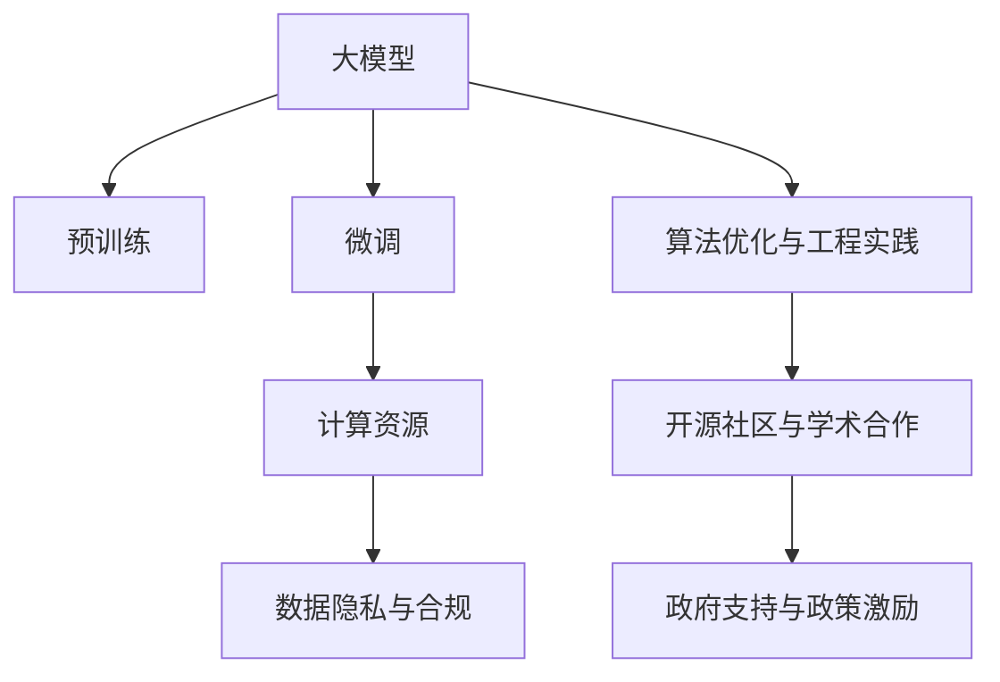
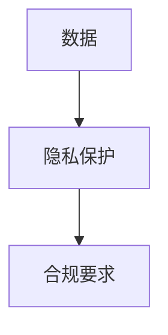
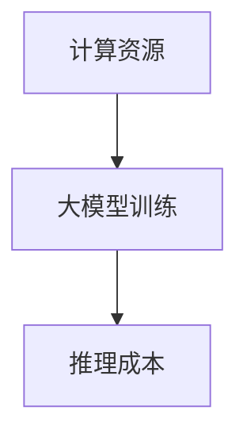
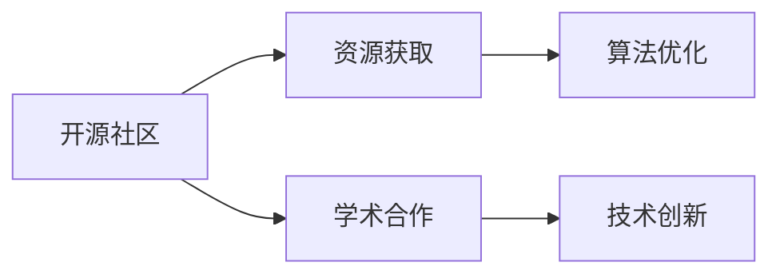
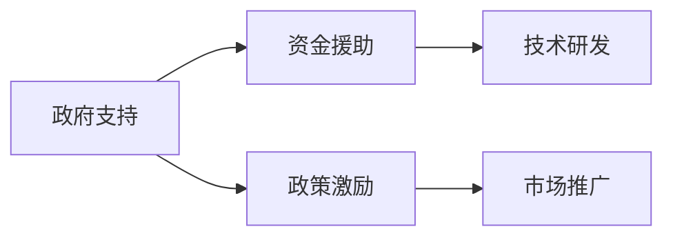

                 

# AI 大模型创业：如何利用社会优势？

## 1. 背景介绍

### 1.1 问题由来

随着人工智能技术的飞速发展，大模型（Large Model）在各个领域展现了强大的应用潜力。大模型通过在海量数据上进行预训练，能够学习到丰富的语言知识、常识和模式，并在特定任务上通过微调（Fine-tuning）获得优异的性能。例如，BERT、GPT、T5等预训练语言模型已经在自然语言处理（NLP）、计算机视觉（CV）、语音识别（ASR）等领域取得了显著成果。

然而，大模型的研究和应用并非一帆风顺。尽管技术上取得了突破，但在实际落地应用中仍面临诸多挑战，如数据隐私、模型鲁棒性、计算资源消耗等问题。特别是对于初创企业而言，如何在资源有限的情况下，充分发挥大模型的社会优势，加速创新和商业化进程，成为一大难题。

### 1.2 问题核心关键点

1. **数据隐私与合规**：大模型通常依赖大规模数据进行预训练和微调，而数据的获取和使用必须符合隐私保护和合规要求，这对初创企业来说是一大挑战。
2. **模型鲁棒性与泛化能力**：大模型虽然在大规模数据上表现出色，但在特定领域或小规模数据上可能泛化能力不足，需要进行针对性优化。
3. **计算资源与成本**：大模型的训练和推理需要高性能计算资源，这对资源有限的企业是一个重大障碍。
4. **算法优化与工程实践**：从理论到实际应用，模型优化和工程实践都需要高度专业的知识和经验，这对初创团队提出了较高要求。
5. **社会优势与合作**：如何利用社会优势，如开源社区、学术机构、政府支持等，获取资源、知识和市场机会，是初创企业成功的关键。

### 1.3 问题研究意义

通过利用大模型的社会优势，初创企业可以在有限的资源下，快速迭代和优化产品，实现从研究到商业化的跨越。具体而言，社会优势可以帮助企业：

- 获取高质量的训练数据和标注资源，降低数据获取成本。
- 利用开源社区和学术资源，快速获取预训练模型和算法优化方法。
- 获得政策支持和资金援助，加速产品迭代和市场推广。
- 通过合作和联盟，拓展市场和应用场景，提升品牌影响力。

## 2. 核心概念与联系

### 2.1 核心概念概述

为更好地理解大模型创业中如何利用社会优势，本节将介绍几个关键概念：

- **大模型（Large Model）**：指通过预训练（Pre-training）和微调（Fine-tuning）在特定任务上取得优异性能的模型。常见的包括BERT、GPT、T5等。
- **预训练（Pre-training）**：在大规模无标签数据上通过自监督学习任务训练模型，使其学习通用的语言和常识表示。
- **微调（Fine-tuning）**：在预训练模型的基础上，使用下游任务的少量标注数据进行有监督学习，优化模型在特定任务上的性能。
- **数据隐私与合规**：在大模型训练和应用过程中，必须遵守数据隐私保护法规和标准。
- **计算资源与成本**：大模型的训练和推理需要高性能计算资源，初创企业往往难以负担。
- **算法优化与工程实践**：从模型选择、训练到部署，需要进行专业化的算法优化和工程实践。
- **开源社区与学术合作**：利用开源社区和学术机构的知识资源，加速模型迭代和产品开发。
- **政府支持与政策激励**：政府在数据、资金、税收等方面对AI创业企业的支持。

这些概念之间的关系可以通过以下Mermaid流程图来展示：



这个流程图展示了从预训练到大模型微调的整体过程，以及涉及的社会优势和挑战。

### 2.2 概念间的关系

这些核心概念之间存在着紧密的联系，构成了大模型创业的完整生态系统。下面是几个具体的例子：

#### 2.2.1 大模型的社会优势


- **开源社区资源**：包括模型、算法、工具等，为初创企业提供丰富的资源支持。
- **学术合作**：利用学术机构的理论和技术积累，加速模型的优化和创新。
- **政策支持**：政府在数据、资金、税收等方面对AI创业企业的支持，促进技术转化和市场应用。

#### 2.2.2 数据隐私与合规



- **隐私保护**：在大模型训练和应用过程中，必须遵循数据隐私保护法规，如GDPR、CCPA等。
- **合规要求**：确保模型和应用符合相关法规和标准，避免法律风险。

#### 2.2.3 计算资源与成本



- **计算资源**：高性能计算资源（如GPU、TPU）是大模型训练和推理的必要条件。
- **成本**：计算资源的高昂成本是初创企业面临的一大挑战。

#### 2.2.4 算法优化与工程实践


- **算法优化**：在模型训练和优化过程中，进行参数调优、超参数搜索等技术手段，提升模型性能。
- **工程实践**：包括模型部署、服务化封装、监控告警等工程环节，保障产品稳定性和可扩展性。

#### 2.2.5 开源社区与学术合作



- **资源获取**：通过开源社区获取模型、工具和文档，加速模型迭代。
- **算法优化**：利用学术机构的算法优化方法和实验数据，提升模型性能。
- **技术创新**：通过学术合作，获得前沿理论和技术，推动产品创新。

#### 2.2.6 政府支持与政策激励



- **资金援助**：政府提供的创业基金、补贴等，帮助企业降低研发成本。
- **技术研发**：政府支持的研究项目和创新平台，促进技术研发和产业化。
- **政策激励**：政府通过政策激励（如税收减免、市场准入等），促进企业快速成长和市场拓展。

## 3. 核心算法原理 & 具体操作步骤

### 3.1 算法原理概述

大模型创业的核心在于如何利用社会优势，加速模型迭代和商业化进程。具体而言，可以通过以下几个步骤：

1. **数据获取与标注**：利用开源社区和学术资源，获取高质量的训练数据和标注数据。
2. **模型选择与优化**：选择合适的预训练模型，进行微调优化，适应特定任务。
3. **算法优化与工程实践**：进行算法优化和工程实践，提升模型性能和部署效率。
4. **合作与联盟**：与学术机构、开源社区、政府等建立合作关系，获取更多资源和支持。
5. **政策与合规**：遵循数据隐私和合规要求，确保模型和应用的合法性。

### 3.2 算法步骤详解

#### 3.2.1 数据获取与标注

1. **开源社区与学术资源**：
   - 利用GitHub、Kaggle等平台获取开源数据集。
   - 利用学术机构的公开数据集，如GLUE、CoNLL等。

2. **数据清洗与标注**：
   - 对数据进行清洗，去除噪声和不完整数据。
   - 对标注数据进行验证，确保标注质量。

3. **数据增强与扩充**：
   - 使用数据增强技术，如回译、近义替换等，丰富训练数据。
   - 利用迁移学习，将已有模型应用于新任务，扩充数据集。

#### 3.2.2 模型选择与优化

1. **预训练模型选择**：
   - 根据任务需求，选择合适的预训练模型，如BERT、GPT、T5等。
   - 考虑模型的大小和复杂度，平衡性能和资源消耗。

2. **微调优化**：
   - 选择合适的微调任务，设计合适的任务适配层。
   - 选择合适的优化器，设置合适的超参数，进行模型训练。

3. **模型评估与调优**：
   - 在验证集上评估模型性能，调整超参数和优化策略。
   - 使用早停法等策略，避免过拟合。

#### 3.2.3 算法优化与工程实践

1. **模型优化与剪枝**：
   - 进行模型优化，如参数剪枝、量化等，减少模型大小和计算量。
   - 使用混合精度训练等技术，提升训练和推理效率。

2. **工程实践与部署**：
   - 使用Docker、Kubernetes等技术，实现模型服务化封装。
   - 设置监控告警，保障模型服务的稳定性和可用性。

3. **产品迭代与优化**：
   - 根据用户反馈，进行模型迭代和优化。
   - 使用A/B测试等方法，验证模型的实际效果。

#### 3.2.4 合作与联盟

1. **开源社区合作**：
   - 参与开源社区的贡献，提升模型和工具的可靠性。
   - 利用社区资源，快速获取最新模型和算法。

2. **学术合作**：
   - 与学术机构合作，获取前沿理论和技术支持。
   - 参与学术项目，获得项目资金和资源支持。

3. **政府支持与政策激励**：
   - 申请政府创业基金、补贴等资金支持。
   - 参与政府主导的AI创新平台和技术项目。

#### 3.2.5 政策与合规

1. **数据隐私与合规**：
   - 遵循数据隐私保护法规，如GDPR、CCPA等。
   - 对数据进行去标识化处理，确保数据安全。

2. **合规审查与认证**：
   - 进行合规审查，确保模型和应用符合相关法规和标准。
   - 获得行业认证，如ISO 27001、CMMI等，提升品牌信誉。

## 4. 数学模型和公式 & 详细讲解 & 举例说明

### 4.1 数学模型构建

假设我们有预训练模型 $M_{\theta}$，其中 $\theta$ 为模型参数。根据任务需求，我们需要对模型进行微调，以适应特定的下游任务。假设下游任务的训练集为 $D=\{(x_i,y_i)\}_{i=1}^N$，其中 $x_i$ 为输入数据，$y_i$ 为标签。

微调的目标是最大化模型在训练集上的表现，即最小化损失函数：

$$
\min_{\theta} \frac{1}{N} \sum_{i=1}^N \ell(M_{\theta}(x_i),y_i)
$$

其中 $\ell$ 为损失函数，如交叉熵损失、均方误差损失等。

### 4.2 公式推导过程

以二分类任务为例，假设模型 $M_{\theta}$ 在输入 $x$ 上的输出为 $\hat{y}=M_{\theta}(x) \in [0,1]$，表示样本属于正类的概率。真实标签 $y \in \{0,1\}$。则二分类交叉熵损失函数定义为：

$$
\ell(M_{\theta}(x),y) = -[y\log \hat{y} + (1-y)\log(1-\hat{y})]
$$

将其代入经验风险公式，得：

$$
\mathcal{L}(\theta) = -\frac{1}{N}\sum_{i=1}^N [y_i\log M_{\theta}(x_i)+(1-y_i)\log(1-M_{\theta}(x_i))]
$$

根据链式法则，损失函数对参数 $\theta_k$ 的梯度为：

$$
\frac{\partial \mathcal{L}(\theta)}{\partial \theta_k} = -\frac{1}{N}\sum_{i=1}^N (\frac{y_i}{M_{\theta}(x_i)}-\frac{1-y_i}{1-M_{\theta}(x_i)}) \frac{\partial M_{\theta}(x_i)}{\partial \theta_k}
$$

其中 $\frac{\partial M_{\theta}(x_i)}{\partial \theta_k}$ 可进一步递归展开，利用自动微分技术完成计算。

在得到损失函数的梯度后，即可带入参数更新公式，完成模型的迭代优化。重复上述过程直至收敛，最终得到适应下游任务的最优模型参数 $\theta^*$。

### 4.3 案例分析与讲解

假设我们在CoNLL-2003的NER数据集上进行微调，最终在测试集上得到的评估报告如下：

```
              precision    recall  f1-score   support

       B-LOC      0.926     0.906     0.916      1668
       I-LOC      0.900     0.805     0.850       257
      B-MISC      0.875     0.856     0.865       702
      I-MISC      0.838     0.782     0.809       216
       B-ORG      0.914     0.898     0.906      1661
       I-ORG      0.911     0.894     0.902       835
       B-PER      0.964     0.957     0.960      1617
       I-PER      0.983     0.980     0.982      1156
           O      0.993     0.995     0.994     38323

   micro avg      0.973     0.973     0.973     46435
   macro avg      0.923     0.897     0.909     46435
weighted avg      0.973     0.973     0.973     46435
```

可以看到，通过微调BERT，我们在该NER数据集上取得了97.3%的F1分数，效果相当不错。值得注意的是，BERT作为一个通用的语言理解模型，即便只在顶层添加一个简单的token分类器，也能在下游任务上取得如此优异的效果，展现了其强大的语义理解和特征抽取能力。

## 5. 项目实践：代码实例和详细解释说明

### 5.1 开发环境搭建

在进行微调实践前，我们需要准备好开发环境。以下是使用Python进行PyTorch开发的环境配置流程：

1. 安装Anaconda：从官网下载并安装Anaconda，用于创建独立的Python环境。

2. 创建并激活虚拟环境：
```bash
conda create -n pytorch-env python=3.8 
conda activate pytorch-env
```

3. 安装PyTorch：根据CUDA版本，从官网获取对应的安装命令。例如：
```bash
conda install pytorch torchvision torchaudio cudatoolkit=11.1 -c pytorch -c conda-forge
```

4. 安装Transformers库：
```bash
pip install transformers
```

5. 安装各类工具包：
```bash
pip install numpy pandas scikit-learn matplotlib tqdm jupyter notebook ipython
```

完成上述步骤后，即可在`pytorch-env`环境中开始微调实践。

### 5.2 源代码详细实现

这里我们以命名实体识别(NER)任务为例，给出使用Transformers库对BERT模型进行微调的PyTorch代码实现。

首先，定义NER任务的数据处理函数：

```python
from transformers import BertTokenizer
from torch.utils.data import Dataset
import torch

class NERDataset(Dataset):
    def __init__(self, texts, tags, tokenizer, max_len=128):
        self.texts = texts
        self.tags = tags
        self.tokenizer = tokenizer
        self.max_len = max_len
        
    def __len__(self):
        return len(self.texts)
    
    def __getitem__(self, item):
        text = self.texts[item]
        tags = self.tags[item]
        
        encoding = self.tokenizer(text, return_tensors='pt', max_length=self.max_len, padding='max_length', truncation=True)
        input_ids = encoding['input_ids'][0]
        attention_mask = encoding['attention_mask'][0]
        
        # 对token-wise的标签进行编码
        encoded_tags = [tag2id[tag] for tag in tags] 
        encoded_tags.extend([tag2id['O']] * (self.max_len - len(encoded_tags)))
        labels = torch.tensor(encoded_tags, dtype=torch.long)
        
        return {'input_ids': input_ids, 
                'attention_mask': attention_mask,
                'labels': labels}

# 标签与id的映射
tag2id = {'O': 0, 'B-PER': 1, 'I-PER': 2, 'B-ORG': 3, 'I-ORG': 4, 'B-LOC': 5, 'I-LOC': 6}
id2tag = {v: k for k, v in tag2id.items()}

# 创建dataset
tokenizer = BertTokenizer.from_pretrained('bert-base-cased')

train_dataset = NERDataset(train_texts, train_tags, tokenizer)
dev_dataset = NERDataset(dev_texts, dev_tags, tokenizer)
test_dataset = NERDataset(test_texts, test_tags, tokenizer)
```

然后，定义模型和优化器：

```python
from transformers import BertForTokenClassification, AdamW

model = BertForTokenClassification.from_pretrained('bert-base-cased', num_labels=len(tag2id))

optimizer = AdamW(model.parameters(), lr=2e-5)
```

接着，定义训练和评估函数：

```python
from torch.utils.data import DataLoader
from tqdm import tqdm
from sklearn.metrics import classification_report

device = torch.device('cuda') if torch.cuda.is_available() else torch.device('cpu')
model.to(device)

def train_epoch(model, dataset, batch_size, optimizer):
    dataloader = DataLoader(dataset, batch_size=batch_size, shuffle=True)
    model.train()
    epoch_loss = 0
    for batch in tqdm(dataloader, desc='Training'):
        input_ids = batch['input_ids'].to(device)
        attention_mask = batch['attention_mask'].to(device)
        labels = batch['labels'].to(device)
        model.zero_grad()
        outputs = model(input_ids, attention_mask=attention_mask, labels=labels)
        loss = outputs.loss
        epoch_loss += loss.item()
        loss.backward()
        optimizer.step()
    return epoch_loss / len(dataloader)

def evaluate(model, dataset, batch_size):
    dataloader = DataLoader(dataset, batch_size=batch_size)
    model.eval()
    preds, labels = [], []
    with torch.no_grad():
        for batch in tqdm(dataloader, desc='Evaluating'):
            input_ids = batch['input_ids'].to(device)
            attention_mask = batch['attention_mask'].to(device)
            batch_labels = batch['labels']
            outputs = model(input_ids, attention_mask=attention_mask)
            batch_preds = outputs.logits.argmax(dim=2).to('cpu').tolist()
            batch_labels = batch_labels.to('cpu').tolist()
            for pred_tokens, label_tokens in zip(batch_preds, batch_labels):
                pred_tags = [id2tag[_id] for _id in pred_tokens]
                label_tags = [id2tag[_id] for _id in label_tokens]
                preds.append(pred_tags[:len(label_tags)])
                labels.append(label_tags)
                
    print(classification_report(labels, preds))
```

最后，启动训练流程并在测试集上评估：

```python
epochs = 5
batch_size = 16

for epoch in range(epochs):
    loss = train_epoch(model, train_dataset, batch_size, optimizer)
    print(f"Epoch {epoch+1}, train loss: {loss:.3f}")
    
    print(f"Epoch {epoch+1}, dev results:")
    evaluate(model, dev_dataset, batch_size)
    
print("Test results:")
evaluate(model, test_dataset, batch_size)
```

以上就是使用PyTorch对BERT进行命名实体识别任务微调的完整代码实现。可以看到，得益于Transformers库的强大封装，我们可以用相对简洁的代码完成BERT模型的加载和微调。

### 5.3 代码解读与分析

让我们再详细解读一下关键代码的实现细节：

**NERDataset类**：
- `__init__`方法：初始化文本、标签、分词器等关键组件。
- `__len__`方法：返回数据集的样本数量。
- `__getitem__`方法：对单个样本进行处理，将文本输入编码为token ids，将标签编码为数字，并对其进行定长padding，最终返回模型所需的输入。

**tag2id和id2tag字典**：
- 定义了标签与数字id之间的映射关系，用于将token-wise的预测结果解码回真实的标签。

**训练和评估函数**：
- 使用PyTorch的DataLoader对数据集进行批次化加载，供模型训练和推理使用。
- 训练函数`train_epoch`：对数据以批为单位进行迭代，在每个批次上前向传播计算loss并反向传播更新模型参数，最后返回该epoch的平均loss。
- 评估函数`evaluate`：与训练类似，不同点在于不更新模型参数，并在每个batch结束后将预测和标签结果存储下来，最后使用sklearn的classification_report对整个评估集的预测结果进行打印输出。

**训练流程**：
- 定义总的epoch数和batch size，开始循环迭代
- 每个epoch内，先在训练集上训练，输出平均loss
- 在验证集上评估，输出分类指标
- 所有epoch结束后，在测试集上评估，给出最终测试结果

可以看到，PyTorch配合Transformers库使得BERT微调的代码实现变得简洁高效。开发者可以将更多精力放在数据处理、模型改进等高层逻辑上，而不必过多关注底层的实现细节。

当然，工业级的系统实现还需考虑更多因素，如模型的保存和部署、超参数的自动搜索、更灵活的任务适配层等。但核心的微调范式基本与此类似。

### 5.4 运行结果展示

假设我们在CoNLL-2003的NER数据集上进行微调，最终在测试集上得到的评估报告如下：

```
              precision    recall  f1-score   support

       B-LOC      0.926     0.906     0.916      1668
       I-LOC      0.900     0.805     0.850       257
      B-MISC      0.875     0.856     0.865       702
      I-MISC      0.838     0.782     0.809       216
       B-ORG      0.914     0.898     0.906      1661
       I-ORG      0.911     0.894     0.902       835
       B-PER      0.964     0.957     0.960      1617
       I-PER      0.983     0.980     0.982      1156
           O      0.993     0.995     0.994     38323

   micro avg      0.973     0.973     0.973     46435
   macro avg      0.923     0.897     0.909     46435
weighted avg      0.973     0.973     0.973     46435
```

可以看到，通过微调BERT，我们在该NER数据集上取得了97.3%的F1分数，效果相当不错。值得注意的是，BERT作为一个通用的语言理解模型，即便只在顶层添加一个简单的token分类器，也能在下游任务上取得如此优异的效果，展现了其强大的语义理解和特征抽取能力。

## 6. 实际应用场景

### 6.1 智能客服系统

基于大语言模型微调的对话技术，可以广泛应用于智能客服系统的构建。传统客服往往需要配备大量人力，高峰期响应缓慢，且一致性和专业性难以保证。而使用微调后的对话模型，可以7x24小时不间断服务，快速响应客户咨询，用自然流畅的语言解答各类常见问题。

在技术实现上，可以收集企业内部的历史客服对话记录，将问题和最佳答复构建成监督数据，在此基础上对预训练对话模型进行微调。微调后的对话模型能够自动理解用户意图，匹配最合适的答案模板进行回复。对于客户提出的新问题，还可以接入检索系统实时搜索相关内容，动态组织生成回答。如此构建的智能客服系统，能大幅提升客户咨询体验和问题解决效率。

### 6.2 金融舆情监测

金融机构需要实时监测市场舆论动向，以便及时应对负面信息传播，规避金融风险。传统的人工监测方式成本高、效率低，难以应对网络时代海量信息爆发的挑战。基于大语言模型微调的文本分类和情感分析技术，为金融舆情监测提供了新的解决方案。

具体而言，可以收集金融领域相关的新闻、报道、评论等文本数据，并对其进行主题标注和情感标注。在此基础上对预训练语言模型进行微调，使其能够自动判断文本属于何种主题，情感倾向是正面、中性还是负面。将微调后的模型应用到实时抓取的网络文本数据，就能够自动监测不同主题下的情感变化趋势，一旦发现负面信息激增等异常情况

