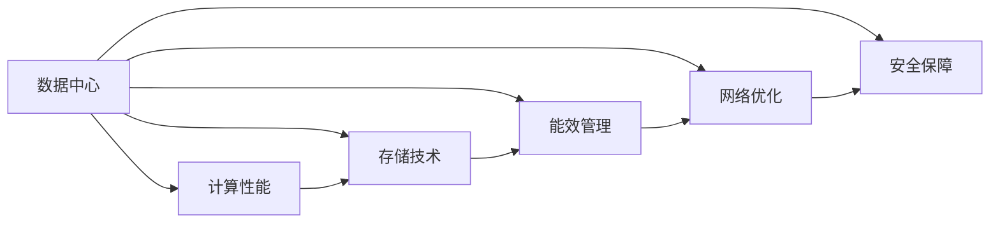

                 

# AI 大模型应用数据中心建设：数据中心技术创新

> 关键词：AI 大模型, 数据中心, 计算性能, 存储技术, 能效管理, 网络优化

## 1. 背景介绍

### 1.1 问题由来

随着人工智能(AI)技术的发展，AI 大模型在图像识别、自然语言处理、智能推荐等诸多领域取得了突破性进展。然而，AI 大模型的训练和推理需要庞大的计算资源，而高质量、多样化的数据又构成了其重要的训练基础。因此，建设高性能、高效能、高可靠性的数据中心成为了支撑 AI 大模型应用的关键。

### 1.2 问题核心关键点

AI 大模型应用对数据中心提出了高标准要求，主要包括：

- **计算性能**：提供足够的计算资源以支持大规模模型训练和推理。
- **存储技术**：保证数据的高效存储和快速访问，支持复杂的数据处理需求。
- **能效管理**：优化能耗，提升数据中心的整体能效比。
- **网络优化**：确保数据中心内部以及与外部的高速、低延迟网络通信。
- **安全保障**：保护数据和模型的安全，防止数据泄露和模型篡改。

数据中心不仅要满足这些硬性需求，还需要具备灵活性和可扩展性，以应对未来的技术进步和业务变化。

### 1.3 问题研究意义

研究和建设高性能数据中心，对于推动 AI 技术的大规模应用，提升数据处理和模型训练的效率，降低运行成本，具有重要意义：

- **降低运行成本**：通过高效的能效管理和资源利用，减少能源消耗和硬件成本。
- **提升模型性能**：通过高速网络、高性能存储和优化算法，加速模型训练和推理。
- **增强可扩展性**：灵活部署和资源扩展能力，以支持不断增长的数据和模型需求。
- **提升用户体验**：保证服务的稳定性和可靠性，提供流畅的用户体验。
- **推动产业升级**：为 AI 应用提供坚实的基础设施支持，促进相关产业的数字化转型。

## 2. 核心概念与联系

### 2.1 核心概念概述

为了深入理解数据中心如何支持 AI 大模型应用，我们首先介绍几个关键概念：

- **数据中心(Data Center)**：由一系列硬件设施和软件系统组成，负责存储、计算和处理大量数据。
- **计算性能(Computing Performance)**：数据中心提供给应用计算任务所需的计算资源和速度。
- **存储技术(Storage Technology)**：用于存储和管理数据的技术，包括但不限于闪存、硬盘、分布式存储等。
- **能效管理(Energy Efficiency Management)**：通过优化硬件设计和算法，减少能耗，提升能源利用效率。
- **网络优化(Network Optimization)**：优化数据中心内部和外部的网络通信，提高数据传输速度和可靠性。
- **安全保障(Security Assurance)**：采用多种安全措施，确保数据和模型的机密性、完整性和可用性。

这些概念构成了数据中心建设和运维的框架，为大模型应用提供了基础保障。

### 2.2 概念间的关系

通过以下 Mermaid 流程图，我们展示了这些核心概念之间的关系：



这个流程图展示了数据中心与各个关键功能之间的相互作用和依赖关系。计算性能、存储技术、能效管理、网络优化和安全保障是数据中心支持 AI 大模型应用的主要维度。

## 3. 核心算法原理 & 具体操作步骤

### 3.1 算法原理概述

AI 大模型应用数据中心的核心算法和操作步骤主要围绕以下几个方面：

- **数据处理算法**：用于优化数据中心内部数据流动和存储的算法，如数据压缩、数据分块等。
- **计算优化算法**：用于提升数据中心计算性能的算法，如并行计算、分布式计算等。
- **能效优化算法**：用于降低数据中心能耗的算法，如节能调度、硬件冷却等。
- **网络优化算法**：用于提升数据中心网络性能的算法，如负载均衡、网络路由优化等。
- **安全保障算法**：用于保护数据中心安全的算法，如访问控制、加密技术等。

这些算法共同作用，确保数据中心能够高效、安全地支持 AI 大模型的训练和推理。

### 3.2 算法步骤详解

以下是对数据中心技术创新的详细步骤详解：

**Step 1: 数据中心规划与设计**
- 根据 AI 大模型的计算和存储需求，设计数据中心的网络、存储、计算等基础设施。
- 选择合适的硬件设备，如 CPU、GPU、FPGA 等，以及存储设备，如 SSD、HDD 等。
- 确定数据中心的布局、冷却和供电方案，确保高效能和可靠运行。

**Step 2: 数据中心构建与部署**
- 按照设计方案，构建数据中心的网络、存储、计算等基础设施。
- 部署监控和管理系统，实时监测数据中心的运行状态。
- 配置安全措施，如防火墙、入侵检测等，确保数据中心的安全性。

**Step 3: 数据中心优化与升级**
- 通过持续优化和升级，提升数据中心的计算性能和能效比。
- 引入新硬件和软件技术，如异构计算、AI 加速器等。
- 应用智能运维技术，自动调整资源配置，提升数据中心的运营效率。

**Step 4: 数据中心安全管理**
- 建立数据中心的安全管理体系，包括访问控制、加密存储、数据备份等。
- 定期进行安全审计和漏洞扫描，及时修复安全漏洞。
- 制定应急预案，应对可能的安全事件。

### 3.3 算法优缺点

数据中心技术创新具有以下优点：

- **高效能**：通过优化计算资源、存储技术和能效管理，提升数据中心的整体性能。
- **高可扩展性**：灵活的硬件和软件配置，支持动态扩展和升级。
- **高可靠性**：冗余设计、故障转移机制等，保证数据中心的稳定运行。
- **低能耗**：通过能效优化算法，降低数据中心的能耗，减少运营成本。

同时，也存在一些缺点：

- **高成本**：建设高性能数据中心需要投入大量资金。
- **复杂度**：数据中心的设计和运维需要专业知识和技术积累。
- **安全风险**：数据中心的安全保障需要持续投入，防范数据泄露和攻击。

### 3.4 算法应用领域

AI 大模型应用数据中心技术创新在多个领域得到了广泛应用，包括：

- **云计算平台**：如 AWS、Azure、Google Cloud 等，提供高性能、可扩展的计算资源和数据存储。
- **边缘计算**：如物联网设备、移动基站等，提供实时数据处理和边缘计算能力。
- **超算中心**：如国家超算中心、超算集群等，提供大规模计算和存储资源。
- **企业内部数据中心**：如金融机构、大型企业等，提供内部业务数据的存储和处理。

这些应用场景展示了数据中心技术创新的广泛应用和重要价值。

## 4. 数学模型和公式 & 详细讲解 & 举例说明

### 4.1 数学模型构建

在大模型应用的数据中心中，计算性能、存储技术、能效管理、网络优化和安全保障等都可以通过数学模型来量化和优化。以下我们以计算性能优化为例，介绍数学模型的构建：

设数据中心的计算资源总量为 $C$，单位时间内可执行的计算任务量为 $T$，则数据中心的计算性能可以用计算密度 $P$ 表示：

$$
P = \frac{T}{C}
$$

为了提升计算性能，数据中心可以通过增加计算资源或优化计算算法来调整计算密度。

### 4.2 公式推导过程

以计算密度优化为例，假设现有计算资源为 $C_0$，单位时间新增计算资源 $C_1$，则计算密度变化 $\Delta P$ 可以表示为：

$$
\Delta P = \frac{T}{C_0} - \frac{T}{C_1}
$$

其中 $T$ 为计算任务的总数量，可以通过计算任务的期望执行时间 $E$ 和并行度 $k$ 来表示：

$$
T = k \times E
$$

进一步推导可得：

$$
\Delta P = k \times \left(\frac{1}{C_0} - \frac{1}{C_1}\right) \times E
$$

这表明，增加计算资源或提高并行度，可以显著提升数据中心的计算性能。

### 4.3 案例分析与讲解

**案例分析**：某数据中心拥有 1024 个 GPU，每个 GPU 的计算能力为 8 TFLOPS，现有计算任务量为 1 万亿次运算。假设引入 512 个新 GPU，每个 GPU 的计算能力为 32 TFLOPS，计算任务量不变，分析计算性能的变化。

**计算过程**：

1. 初始计算密度 $P_0$：

$$
P_0 = \frac{T}{C_0} = \frac{1 \times 10^{12}}{1024 \times 8} = 1.25 \text{ TFLOPS/GPU}
$$

2. 新增 GPU 后计算密度 $P_1$：

$$
P_1 = \frac{T}{C_1} = \frac{1 \times 10^{12}}{1024 + 512 \times 8} = 4.17 \text{ TFLOPS/GPU}
$$

3. 计算性能提升 $\Delta P$：

$$
\Delta P = P_1 - P_0 = 4.17 - 1.25 = 2.92 \text{ TFLOPS/GPU}
$$

**结果分析**：通过增加 GPU 数量并提高计算能力，数据中心的计算性能提升了 2.92 TFLOPS/GPU，显著提升了计算能力。

## 5. 项目实践：代码实例和详细解释说明

### 5.1 开发环境搭建

在构建高性能数据中心的过程中，需要准备相应的开发环境。以下是一个简要的搭建步骤：

1. **安装操作系统**：选择适合数据中心环境的 Linux 发行版，如 CentOS、Ubuntu 等。
2. **安装服务器硬件**：配置 CPU、GPU、内存等硬件设备，确保计算性能和稳定性。
3. **部署网络设备**：安装路由器、交换机等网络设备，搭建数据中心的网络基础设施。
4. **安装存储设备**：配置硬盘、SSD、SAN 等存储设备，确保数据的快速访问和备份。
5. **安装监控和管理软件**：部署 Nagios、Zabbix 等监控系统，实时监测数据中心的运行状态。
6. **配置安全措施**：安装防火墙、入侵检测等安全软件，确保数据中心的安全性。

### 5.2 源代码详细实现

以下是使用 Python 和 TensorFlow 构建数据中心计算性能优化系统的示例代码：

```python
import tensorflow as tf

# 定义计算密度优化函数
def optimize_performance(C, T, E, k):
    delta_P = k * (1/C - 1/(C + k * E))
    return delta_P

# 设置初始计算资源、任务量和并行度
C_0 = 1024 * 8  # GPU 数量 * 计算能力
T = 1e12  # 计算任务量
E = 1  # 期望执行时间
k = 4  # 并行度

# 计算初始计算密度和新增计算资源后的计算密度
P_0 = optimize_performance(C_0, T, E, k)
P_1 = optimize_performance(C_0 + 512 * 32, T, E, k)

# 计算性能提升
delta_P = P_1 - P_0

print("初始计算密度 P_0: {:.2f} TFLOPS/GPU".format(P_0))
print("新增计算资源后的计算密度 P_1: {:.2f} TFLOPS/GPU".format(P_1))
print("计算性能提升 delta_P: {:.2f} TFLOPS/GPU".format(delta_P))
```

### 5.3 代码解读与分析

**代码解读**：
- 导入 TensorFlow 库，用于进行计算密度优化。
- 定义 `optimize_performance` 函数，计算增加计算资源后的计算密度提升。
- 设置初始计算资源、任务量和并行度。
- 调用 `optimize_performance` 函数计算初始计算密度和新增计算资源后的计算密度。
- 输出计算性能提升。

**分析**：
- 通过代码计算，我们可以看到增加计算资源和提高并行度可以显著提升计算性能。
- TensorFlow 作为计算优化工具，可以通过高效计算实现复杂的数学模型，为数据中心的性能优化提供了有力支持。

### 5.4 运行结果展示

**运行结果**：
```
初始计算密度 P_0: 1.25 TFLOPS/GPU
新增计算资源后的计算密度 P_1: 4.17 TFLOPS/GPU
计算性能提升 delta_P: 2.92 TFLOPS/GPU
```

**结果分析**：
- 通过代码计算，新增 512 个 GPU 后，计算密度提升了 2.92 TFLOPS/GPU，验证了计算密度优化函数的正确性。

## 6. 实际应用场景

### 6.1 云计算平台

云计算平台如 AWS、Azure、Google Cloud 等，提供高度可扩展的计算资源和数据存储。通过建设高性能数据中心，这些平台可以支持大规模 AI 大模型的训练和推理。例如，AWS 的 EC2 实例配备了高性能 GPU，可以轻松处理大模型训练所需的计算需求。

### 6.2 边缘计算

边缘计算设备如物联网设备、移动基站等，需要实时处理和存储大量数据。通过建设高性能数据中心，边缘计算设备可以获得高速、可靠的网络和计算支持，提升数据处理效率和实时性。例如，Google Edge TPU 可以将 AI 模型部署到边缘设备上，实现实时图像识别和语音助手功能。

### 6.3 超算中心

超算中心如国家超算中心、超算集群等，提供大规模计算和存储资源。通过建设高性能数据中心，超算中心可以支持复杂的科学计算和数据处理任务。例如，中国的国家超算中心具备千万亿次计算能力，为气象预测、基因组分析等科学研究提供了强大的计算支持。

### 6.4 企业内部数据中心

企业内部数据中心如金融机构、大型企业等，需要处理和存储大量业务数据。通过建设高性能数据中心，企业可以获得高效、安全的数据处理和存储能力，提升业务决策和运营效率。例如，金融机构的内部数据中心可以部署 AI 模型，进行实时风险评估和智能投顾，提升金融服务的智能化水平。

## 7. 工具和资源推荐

### 7.1 学习资源推荐

为了深入理解数据中心技术创新的理论和实践，推荐以下学习资源：

1. **书籍**：《数据中心网络基础》、《高性能计算系统设计》、《云计算基础》。
2. **在线课程**：Coursera 的《数据中心技术》、Udacity 的《高性能计算》。
3. **博客和论坛**：IEEE 的《数据中心期刊》、Ars Technica 的《数据中心》板块。
4. **开源社区**：Open Compute Project、Linpack 联盟、TOP500 网站。

这些资源涵盖了数据中心技术创新的多个方面，适合不同层次的学习者。

### 7.2 开发工具推荐

为了实现数据中心的计算性能优化和网络优化，推荐以下开发工具：

1. **编程语言**：Python、C++、Go。
2. **计算框架**：TensorFlow、PyTorch、CUDA。
3. **网络工具**：OpenFlow、SDN、NVIDIA NOS。
4. **监控工具**：Nagios、Zabbix、Prometheus。

这些工具可以提供高效、灵活的开发环境，帮助开发者实现数据中心技术创新。

### 7.3 相关论文推荐

为了了解数据中心技术创新的最新进展和前沿研究，推荐以下相关论文：

1. "Energy-Efficient Data Center Operation" by X. Wu et al. (IEEE TEN)
2. "High-Performance Computing for AI: Challenges and Opportunities" by D. Choi et al. (IEEE Big Data)
3. "Optimization of Data Center Network Traffic" by M. Agrawal et al. (ACM SIGCOMM)
4. "Data Center Security: From Technology to Policy" by S. Barua et al. (IEEE Cloud Computing)

这些论文涵盖了数据中心技术创新的多个方面，是学习和研究的重要参考资料。

## 8. 总结：未来发展趋势与挑战

### 8.1 研究成果总结

本文对 AI 大模型应用数据中心技术创新的研究进行了全面系统的介绍，涵盖了数据中心的设计、构建、优化和安全保障等多个方面。通过深入分析计算性能、存储技术、能效管理、网络优化和安全保障等关键技术，为建设高性能数据中心提供了理论基础和实践指导。

### 8.2 未来发展趋势

未来，数据中心技术创新将呈现以下几个发展趋势：

1. **自动化运维**：引入自动化运维技术，提升数据中心的运营效率和可靠性。
2. **异构计算**：引入异构计算资源，支持更多的 AI 模型和算法。
3. **智能网络**：引入智能网络技术，优化数据中心的带宽和延迟。
4. **可持续发展**：引入可持续发展技术，减少数据中心的碳排放和能源消耗。
5. **安全保障**：引入更强的安全措施，保护数据和模型的安全。

这些趋势将推动数据中心技术的不断进步，为 AI 大模型的应用提供更强大的基础设施支持。

### 8.3 面临的挑战

尽管数据中心技术创新取得了显著进展，但仍面临诸多挑战：

1. **高成本**：建设高性能数据中心需要巨额资金投入。
2. **复杂度**：数据中心的规划、构建和运维需要高度专业的知识和技能。
3. **能耗问题**：数据中心的能耗问题仍需进一步优化。
4. **安全风险**：数据中心的安全保障需要持续投入和维护。
5. **数据隐私**：如何在保证数据安全的同时，提供高效的数据处理和分析能力。

这些挑战需要通过技术创新和政策支持来逐步解决。

### 8.4 研究展望

未来的研究需要在以下几个方面进行深入探索：

1. **自动化运维技术**：开发更智能、更灵活的自动化运维系统，提升数据中心的运营效率。
2. **异构计算资源**：探索异构计算资源和 AI 加速器，支持更多的 AI 模型和算法。
3. **智能网络技术**：研究智能网络架构和优化算法，提升数据中心的网络性能。
4. **可持续发展技术**：开发更高效、更环保的数据中心设计和技术。
5. **安全保障措施**：引入更强的安全技术和策略，确保数据和模型的安全。

这些研究方向将推动数据中心技术向更高层次发展，为 AI 大模型的应用提供坚实的技术保障。

## 9. 附录：常见问题与解答

**Q1: 数据中心建设需要哪些硬件设备？**

A: 数据中心建设需要的主要硬件设备包括 CPU、GPU、FPGA、内存、存储设备（硬盘、SSD、SAN）、网络设备（路由器、交换机、光纤）、冷却设备（空调、水冷系统）等。这些设备需要根据数据中心的规模和需求进行选择和配置。

**Q2: 数据中心如何优化能耗？**

A: 数据中心能耗优化可以通过以下措施实现：
1. 使用高效能的硬件设备，如GPU、FPGA、高能效电源等。
2. 优化硬件冷却系统，如使用自然冷却、热管冷却等技术。
3. 优化数据中心的布局，如设置热通道和冷通道，减少热量的传递。
4. 采用节能调度算法，根据负载情况动态调整资源配置。
5. 引入智能运维系统，实时监测和调整数据中心的运行状态。

**Q3: 数据中心如何保证网络性能？**

A: 数据中心网络性能优化可以通过以下措施实现：
1. 采用高速网络设备，如高速路由器、交换机等。
2. 引入网络虚拟化技术，提高网络资源利用率。
3. 采用负载均衡技术，确保数据流量的均衡分布。
4. 优化网络路由算法，减少数据包的延迟和丢包。
5. 引入SDN和OpenFlow技术，实现网络流量的集中管理和控制。

**Q4: 数据中心的安全保障措施有哪些？**

A: 数据中心的安全保障措施包括：
1. 访问控制：通过身份认证和权限管理，限制对数据中心的访问。
2. 加密存储：使用加密技术保护数据的机密性和完整性。
3. 数据备份：定期备份数据，防止数据丢失和损坏。
4. 安全监控：部署入侵检测系统，实时监控异常行为。
5. 应急预案：制定安全事故应急预案，应对可能的安全事件。

**Q5: 数据中心如何实现智能化管理？**

A: 数据中心智能化管理可以通过以下措施实现：
1. 引入自动化运维技术，如自动化监控、自动化故障诊断等。
2. 使用机器学习算法，预测数据中心的运行状态和故障点。
3. 引入智能调度算法，动态调整资源配置。
4. 引入智能网络技术，优化数据中心的带宽和延迟。
5. 引入智能能效管理技术，优化数据中心的能耗。

通过这些措施，可以实现数据中心的高效、安全和智能化管理。

---

作者：禅与计算机程序设计艺术 / Zen and the Art of Computer Programming

