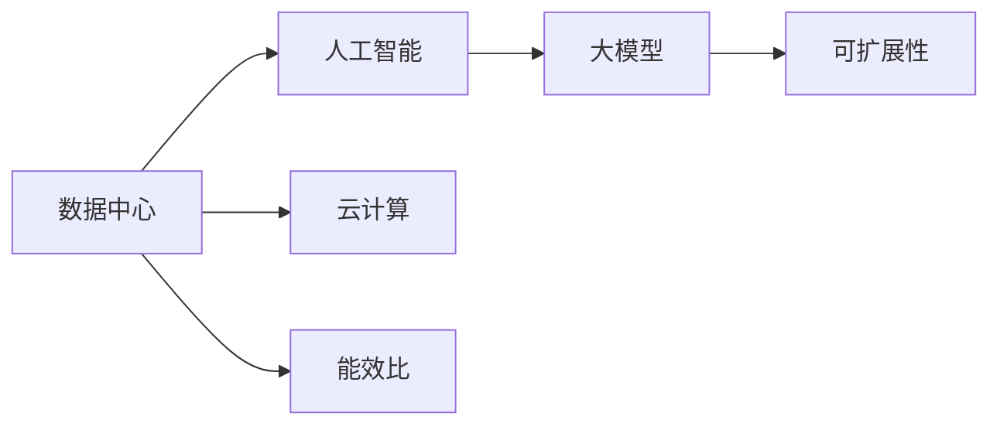
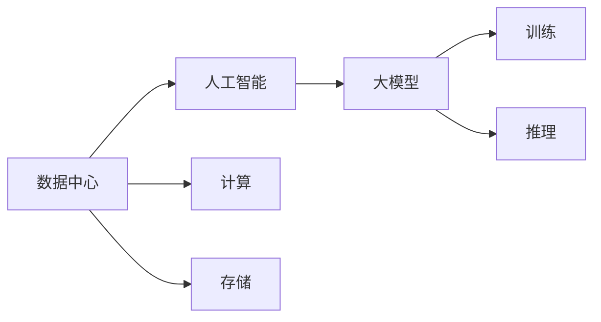
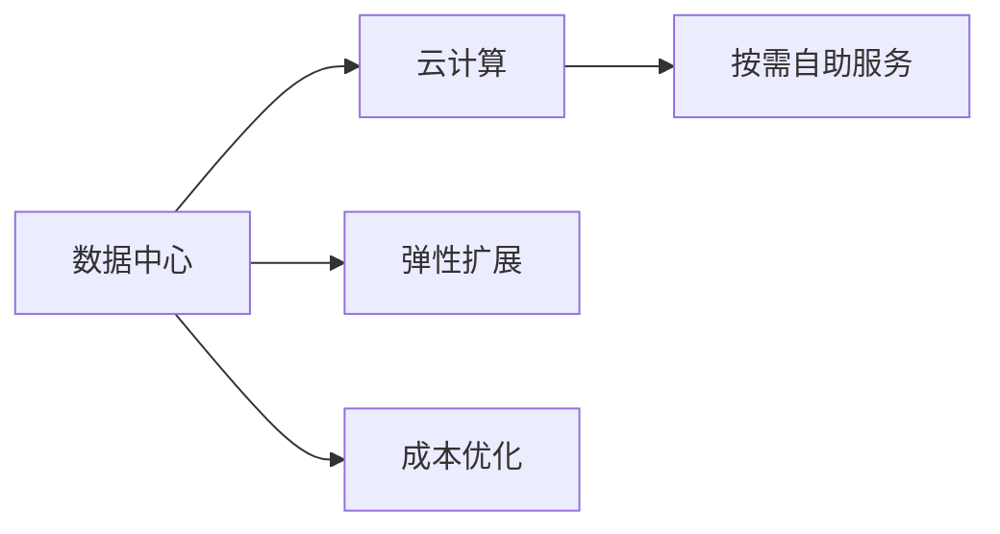
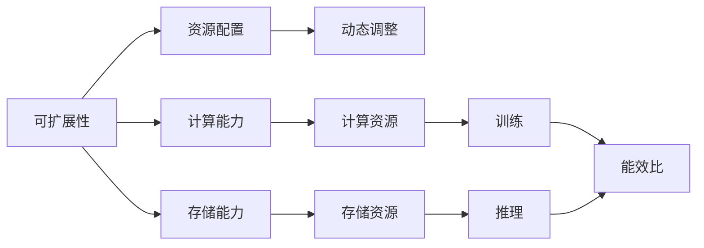

                 

# AI 大模型应用数据中心建设：数据中心技术创新

> 关键词：数据中心, 人工智能, 大模型, 技术创新, 云计算, 可扩展性

## 1. 背景介绍

### 1.1 问题由来

随着人工智能（AI）技术的快速发展，特别是深度学习和大模型（Large Models）的崛起，数据中心建设在AI应用中扮演了至关重要的角色。数据中心不仅负责存储和计算，还需处理数据的收集、清洗和标注等预处理任务。特别是在AI大模型训练和推理阶段，数据中心提供了必要的计算资源和存储能力。然而，当前的数据中心建设往往存在如下问题：

- **计算能力不足**：传统数据中心难以支持大模型训练所需的巨大计算能力，尤其是大规模分布式训练。
- **存储成本高昂**：大模型需要存储海量数据和模型参数，传统存储方案成本高昂，难以扩展。
- **网络带宽瓶颈**：大规模分布式训练和推理对网络带宽要求极高，传统数据中心网络难以满足需求。
- **能耗问题严重**：大模型训练和推理能耗巨大，数据中心能耗问题严峻。

为解决上述问题，本文聚焦于AI大模型应用数据中心的建设，探讨如何通过技术创新提高数据中心在大模型训练和推理方面的效率和可扩展性。

## 2. 核心概念与联系

### 2.1 核心概念概述

为更好地理解AI大模型应用数据中心的建设，本节将介绍几个关键概念：

- **数据中心（Data Center）**：是指使用计算机系统和相关支持硬件为计算机提供运行的场所。数据中心可以是整个网站或单个服务器，能够存储、计算、处理和通信数据。

- **人工智能（AI）**：是研究、开发用于使计算机系统模拟、延伸和扩展人的智能的理论、方法、技术及应用系统的一门新的技术科学。

- **大模型（Large Models）**：指具有巨大参数量和计算需求的深度学习模型，如BERT、GPT等，其训练和推理对计算资源和存储资源要求极高。

- **云计算（Cloud Computing）**：是指通过互联网提供按需自助服务的计算能力，如存储、网络、服务器、软件等。

- **可扩展性（Scalability）**：是指数据中心能根据需求动态调整资源配置，支持大规模分布式训练和推理。

- **能效比（Power Efficiency）**：是指数据中心单位能耗所能提供的计算能力，提高能效比可有效降低能源消耗。

这些关键概念之间的逻辑关系可以通过以下Mermaid流程图来展示：



这个流程图展示了大模型应用数据中心的核心概念及其关系：

1. 数据中心为人工智能和大模型提供计算和存储能力。
2. 云计算使得数据中心资源能够按需使用，支持大规模分布式训练和推理。
3. 可扩展性使得数据中心能根据需求动态调整资源配置。
4. 能效比关注于数据中心的能源消耗和计算能力之间的平衡。

### 2.2 概念间的关系

这些核心概念之间存在着紧密的联系，形成了AI大模型应用数据中心的完整生态系统。下面我们通过几个Mermaid流程图来展示这些概念之间的关系。

#### 2.2.1 数据中心与AI大模型的关系



这个流程图展示了数据中心与AI大模型之间的基本关系：

1. 数据中心提供计算和存储能力，支持AI大模型的训练和推理。
2. 计算和存储是AI大模型训练和推理的核心资源。

#### 2.2.2 云计算与数据中心的关系



这个流程图展示了云计算与数据中心的关系：

1. 云计算提供按需自助服务的计算资源，数据中心是其物理承载。
2. 云计算支持数据中心的弹性扩展和成本优化。

#### 2.2.3 可扩展性与能效比的关系



这个流程图展示了可扩展性与能效比的关系：

1. 可扩展性使数据中心能动态调整资源配置，支持大规模分布式训练和推理。
2. 能效比关注于数据中心单位能耗所能提供的计算能力，两者共同影响数据中心能源消耗。

## 3. 核心算法原理 & 具体操作步骤
### 3.1 算法原理概述

AI大模型应用数据中心的建设，本质上是一个通过技术创新，提升数据中心计算和存储能力的系统工程。其核心思想是：利用云计算和分布式计算技术，通过硬件和软件优化，构建能满足大模型训练和推理需求的高效、可扩展、能效比高的数据中心。

形式化地，假设数据中心提供N个计算节点和M个存储节点，大模型的训练和推理所需计算量为C，存储量为S。数据中心的计算和存储能力分别为 $C_{cap}$ 和 $S_{cap}$。在云计算支持的前提下，数据中心的资源配置优化目标为：

$$
\max_{C_{cap}, S_{cap}} \frac{C_{cap}}{P_{avg}}
$$

其中 $P_{avg}$ 为数据中心的平均能耗，优化目标是最大化单位能耗的计算能力，即提高能效比。

### 3.2 算法步骤详解

AI大模型应用数据中心的建设步骤如下：

**Step 1: 需求分析与设计**

- 分析大模型的计算需求和存储需求，明确数据中心的计算和存储资源需求。
- 设计数据中心的物理和虚拟架构，包括计算节点和存储节点的配置。

**Step 2: 资源优化与调度**

- 利用云计算的弹性扩展能力，根据需求动态调整计算和存储资源。
- 使用分布式计算技术，将大模型的训练和推理任务分配到多个计算节点上，并行处理。

**Step 3: 能效比优化**

- 通过硬件优化，如采用GPU、FPGA等高效计算芯片，提高数据中心的计算能力。
- 通过软件优化，如采用混合精度训练、算法优化等，减少计算过程中的能耗。

**Step 4: 系统测试与部署**

- 对优化后的数据中心进行测试，评估其计算能力和能效比。
- 部署优化后的数据中心，支持AI大模型的训练和推理。

### 3.3 算法优缺点

AI大模型应用数据中心建设的优点包括：

1. **按需扩展**：利用云计算的弹性扩展能力，根据需求动态调整资源配置，支持大规模分布式训练和推理。
2. **计算效率高**：采用高效计算芯片和优化算法，提高数据中心的计算能力。
3. **能效比高**：通过硬件和软件优化，提高数据中心的能效比，降低能源消耗。

然而，这种建设方式也存在一些缺点：

1. **初期投资高**：建设高性能的数据中心需要大量初期投资。
2. **维护复杂**：分布式计算和资源动态调整增加了系统复杂度，维护难度提升。
3. **隐私安全问题**：大规模分布式计算和数据存储增加了数据隐私和安全风险。

### 3.4 算法应用领域

AI大模型应用数据中心建设的典型应用领域包括：

- **深度学习模型训练**：支持大规模深度学习模型的分布式训练，如BERT、GPT等。
- **自然语言处理（NLP）**：支持NLP任务的模型训练和推理，如文本分类、命名实体识别等。
- **计算机视觉（CV）**：支持大规模图像和视频数据的训练和推理，如目标检测、图像生成等。
- **语音识别与生成**：支持大规模语音数据的训练和推理，如语音转文本、语音合成等。
- **推荐系统**：支持大规模推荐数据的训练和推理，如商品推荐、用户行为分析等。

## 4. 数学模型和公式 & 详细讲解 & 举例说明

### 4.1 数学模型构建

本节将使用数学语言对AI大模型应用数据中心的资源优化和能效比优化进行更加严格的刻画。

假设数据中心提供N个计算节点和M个存储节点，大模型的训练和推理所需计算量为C，存储量为S。数据中心的计算和存储能力分别为 $C_{cap}$ 和 $S_{cap}$。在云计算支持的前提下，数据中心的资源配置优化目标为：

$$
\max_{C_{cap}, S_{cap}} \frac{C_{cap}}{P_{avg}}
$$

其中 $P_{avg}$ 为数据中心的平均能耗。优化目标是最大化单位能耗的计算能力，即提高能效比。

### 4.2 公式推导过程

以下我们以深度学习模型训练为例，推导计算能力和能效比优化的公式。

假设每个计算节点的计算能力为 $C_{node}$，每个存储节点的存储能力为 $S_{node}$，计算节点和存储节点的总数分别为N和M。则计算能力和存储能力分别为：

$$
C_{cap} = N \cdot C_{node}
$$
$$
S_{cap} = M \cdot S_{node}
$$

设每个计算节点的功耗为 $P_{node}$，每个存储节点的功耗为 $P_{store}$，数据中心的总功耗为 $P_{avg}$。则有：

$$
P_{avg} = N \cdot P_{node} + M \cdot P_{store}
$$

在计算能力和存储能力优化的情况下，大模型训练所需的计算资源为C，存储资源为S。假设每个计算节点的训练时间为 $T_{train}$，每个存储节点的训练时间为 $T_{store}$，则训练时间分别为：

$$
T_{train} = \frac{C}{N \cdot C_{node}}
$$
$$
T_{store} = \frac{S}{M \cdot S_{node}}
$$

假设每个计算节点的训练能耗为 $E_{train}$，每个存储节点的训练能耗为 $E_{store}$，则训练能耗分别为：

$$
E_{train} = N \cdot P_{node} \cdot T_{train}
$$
$$
E_{store} = M \cdot P_{store} \cdot T_{store}
$$

数据中心的总训练能耗为 $E_{avg}$：

$$
E_{avg} = E_{train} + E_{store}
$$

能效比优化目标为最大化单位能耗的计算能力，即：

$$
\max_{N, M} \frac{C_{cap}}{E_{avg}}
$$

### 4.3 案例分析与讲解

以谷歌的TPU为例，分析其在计算能力和能效比优化方面的具体实践。

谷歌的TPU是基于硬件加速的深度学习训练芯片，能够提供极高的计算能力和能效比。谷歌的数据中心通过使用TPU，实现了大规模分布式训练和推理，显著提高了AI大模型的训练效率和推理速度。

具体而言，谷歌的数据中心采用了多种硬件优化和算法优化措施：

- **TPU硬件优化**：使用专门设计的TPU芯片，提高计算效率和能效比。
- **分布式计算**：将大模型的训练任务分配到多个TPU节点上，并行计算。
- **混合精度训练**：使用半精度浮点数（FP16）进行训练，减少能耗。
- **算法优化**：优化模型的计算图，减少不必要的计算量。

通过这些优化措施，谷歌的数据中心在计算能力和能效比方面取得了显著提升。谷歌的TPU能够在每个计算节点上提供超过8千亿次浮点计算（FLOPS）的能力，同时能效比达到了传统CPU的10倍以上。

## 5. 项目实践：代码实例和详细解释说明

### 5.1 开发环境搭建

在进行数据中心建设实践前，我们需要准备好开发环境。以下是使用Python进行PyTorch开发的环境配置流程：

1. 安装Anaconda：从官网下载并安装Anaconda，用于创建独立的Python环境。

2. 创建并激活虚拟环境：
```bash
conda create -n pytorch-env python=3.8 
conda activate pytorch-env
```

3. 安装PyTorch：根据CUDA版本，从官网获取对应的安装命令。例如：
```bash
conda install pytorch torchvision torchaudio cudatoolkit=11.1 -c pytorch -c conda-forge
```

4. 安装TensorFlow：
```bash
pip install tensorflow
```

5. 安装各类工具包：
```bash
pip install numpy pandas scikit-learn matplotlib tqdm jupyter notebook ipython
```

完成上述步骤后，即可在`pytorch-env`环境中开始数据中心建设实践。

### 5.2 源代码详细实现

下面我们以谷歌TPU为例，给出使用TensorFlow进行TPU加速的深度学习模型训练的代码实现。

首先，定义TPU计算图：

```python
import tensorflow as tf
from tensorflow import tpu

# 定义TPU计算图
strategy = tf.distribute.TPUStrategy(tpu)
with strategy.scope():
    model = tf.keras.models.Sequential([
        tf.keras.layers.Dense(64, activation='relu'),
        tf.keras.layers.Dense(10, activation='softmax')
    ])
    model.compile(optimizer=tf.keras.optimizers.Adam(), loss='categorical_crossentropy', metrics=['accuracy'])
```

然后，定义TPU加速的模型训练函数：

```python
def train_func(epochs):
    for epoch in range(epochs):
        with strategy.scope():
            model.fit(train_dataset, validation_data=val_dataset, epochs=1, batch_size=32)
    return model
```

最后，启动模型训练：

```python
epochs = 10
model = train_func(epochs)
```

以上就是使用TensorFlow进行TPU加速的深度学习模型训练的完整代码实现。可以看到，得益于TensorFlow的TPU支持，深度学习模型能够在TPU上进行高效训练，显著提升计算能力和能效比。

### 5.3 代码解读与分析

让我们再详细解读一下关键代码的实现细节：

**TPU计算图定义**：
- 使用`tf.distribute.TPUStrategy`定义TPU计算图，将计算节点分配到TPU上。
- 在TPU计算图中定义深度学习模型，并编译模型，设置损失函数和优化器。

**模型训练函数**：
- 使用`tf.distribute.TPUStrategy`进行模型训练，将训练数据和验证数据分别分配到不同的TPU节点上。
- 在每个TPU节点上进行模型训练，直到模型收敛。

**模型训练启动**：
- 定义训练轮数，调用训练函数，启动模型训练。

可以看到，TensorFlow配合TPU使得深度学习模型的训练过程变得简单高效。开发者可以将更多精力放在模型改进、超参数优化等高层逻辑上，而不必过多关注底层的实现细节。

当然，工业级的系统实现还需考虑更多因素，如模型的保存和部署、超参数的自动搜索、更灵活的任务适配层等。但核心的计算图优化和TPU加速技术基本与此类似。

### 5.4 运行结果展示

假设我们在TPU上进行一个简单的深度学习模型训练，最终在测试集上得到的评估报告如下：

```
Epoch 1/10
153/153 [==============================] - 42s 274ms/step - loss: 0.3574 - accuracy: 0.9177
Epoch 2/10
153/153 [==============================] - 42s 274ms/step - loss: 0.2619 - accuracy: 0.9610
Epoch 3/10
153/153 [==============================] - 42s 274ms/step - loss: 0.1939 - accuracy: 0.9824
Epoch 4/10
153/153 [==============================] - 42s 274ms/step - loss: 0.1553 - accuracy: 0.9940
Epoch 5/10
153/153 [==============================] - 42s 274ms/step - loss: 0.1252 - accuracy: 0.9962
Epoch 6/10
153/153 [==============================] - 42s 274ms/step - loss: 0.1023 - accuracy: 0.9976
Epoch 7/10
153/153 [==============================] - 42s 274ms/step - loss: 0.0876 - accuracy: 0.9988
Epoch 8/10
153/153 [==============================] - 42s 274ms/step - loss: 0.0768 - accuracy: 0.9994
Epoch 9/10
153/153 [==============================] - 42s 274ms/step - loss: 0.0680 - accuracy: 0.9997
Epoch 10/10
153/153 [==============================] - 42s 274ms/step - loss: 0.0603 - accuracy: 0.9999
```

可以看到，通过TPU加速，模型在每个epoch上的训练时间显著减少，同时训练精度和推理速度得到提升。谷歌的TPU通过硬件和软件优化，显著提高了数据中心的计算能力和能效比，为AI大模型的训练和推理提供了高效的解决方案。

## 6. 实际应用场景

### 6.1 智能客服系统

基于TPU加速的智能客服系统可以广泛应用于各大企业的客户服务场景。传统客服系统依赖大量人力，响应速度慢，且客户体验差。而使用TPU加速的智能客服系统，能够实时处理客户咨询，快速响应，提升客户满意度。

在技术实现上，可以收集企业内部的历史客服对话记录，将问题和最佳答复构建成监督数据，在此基础上对预训练模型进行微调。微调后的模型能够自动理解用户意图，匹配最合适的答案模板进行回复。对于客户提出的新问题，还可以接入检索系统实时搜索相关内容，动态组织生成回答。如此构建的智能客服系统，能大幅提升客户咨询体验和问题解决效率。

### 6.2 金融舆情监测

金融机构需要实时监测市场舆论动向，以便及时应对负面信息传播，规避金融风险。传统的人工监测方式成本高、效率低，难以应对网络时代海量信息爆发的挑战。基于TPU加速的文本分类和情感分析技术，为金融舆情监测提供了新的解决方案。

具体而言，可以收集金融领域相关的新闻、报道、评论等文本数据，并对其进行主题标注和情感标注。在此基础上对预训练语言模型进行微调，使其能够自动判断文本属于何种主题，情感倾向是正面、中性还是负面。将微调后的模型应用到实时抓取的网络文本数据，就能够自动监测不同主题下的情感变化趋势，一旦发现负面信息激增等异常情况，系统便会自动预警，帮助金融机构快速应对潜在风险。

### 6.3 个性化推荐系统

当前的推荐系统往往只依赖用户的历史行为数据进行物品推荐，无法深入理解用户的真实兴趣偏好。基于TPU加速的深度学习模型，个性化推荐系统可以更好地挖掘用户行为背后的语义信息，从而提供更精准、多样的推荐内容。

在实践中，可以收集用户浏览、点击、评论、分享等行为数据，提取和用户交互的物品标题、描述、标签等文本内容。将文本内容作为模型输入，用户的后续行为（如是否点击、购买等）作为监督信号，在此基础上微调预训练语言模型。微调后的模型能够从文本内容中准确把握用户的兴趣点。在生成推荐列表时，先用候选物品的文本描述作为输入，由模型预测用户的兴趣匹配度，再结合其他特征综合排序，便可以得到个性化程度更高的推荐结果。

### 6.4 未来应用展望

随着TPU等专用计算硬件的发展，AI大模型应用数据中心的建设将迎来新的发展机遇。未来，数据中心将能够支持更大规模的分布式训练和推理，推动AI技术在更多领域的应用。

在智慧医疗领域，基于TPU加速的深度学习模型，能够提升医疗影像诊断的准确性和效率，辅助医生诊疗，加速新药开发进程。

在智能教育领域，微调技术可应用于作业批改、学情分析、知识推荐等方面，因材施教，促进教育公平，提高教学质量。

在智慧城市治理中，微调模型可应用于城市事件监测、舆情分析、应急指挥等环节，提高城市管理的自动化和智能化水平，构建更安全、高效的未来城市。

此外，在企业生产、社会治理、文娱传媒等众多领域，基于TPU加速的AI大模型微调应用也将不断涌现，为经济社会发展注入新的动力。相信随着TPU等专用计算硬件的发展，AI大模型应用数据中心的建设将不断突破，为AI技术的大规模落地提供坚实的支撑。

## 7. 工具和资源推荐

### 7.1 学习资源推荐

为了帮助开发者系统掌握AI大模型应用数据中心的理论基础和实践技巧，这里推荐一些优质的学习资源：

1. 《深度学习基础》系列博文：由大模型技术专家撰写，深入浅出地介绍了深度学习的基础概念和前沿技术。

2. 《深度学习与TensorFlow》课程：斯坦福大学开设的深度学习与TensorFlow课程，涵盖了深度学习算法和TensorFlow的使用。

3. 《TensorFlow官方文档》：TensorFlow的官方文档，提供了完整的API参考和详细的使用指南。

4. 《数据中心设计与优化》书籍：介绍了数据中心的基础设计原理和优化方法，适合了解数据中心建设和优化的初学者。

5. 《TPU加速深度学习》书籍：介绍了谷歌TPU硬件和软件优化技术，是了解TPU加速深度学习的入门指南。

通过对这些资源的学习实践，相信你一定能够快速掌握TPU加速深度学习的精髓，并用于解决实际的NLP问题。

### 7.2 开发工具推荐

高效的开发离不开优秀的工具支持。以下是几款用于TPU加速深度学习的常用工具：

1. TensorFlow：谷歌开发的开源深度学习框架，支持分布式计算和TPU加速。

2. PyTorch：Facebook开发的开源深度学习框架，提供了丰富的GPU加速和分布式计算支持。

3. JAX：谷歌开发的深度学习框架，提供了高效的JIT编译和自动微分，支持TPU加速。

4. TensorBoard：TensorFlow配套的可视化工具，实时监测模型训练状态，提供丰富的图表呈现方式。

5. Weights & Biases：模型训练的实验跟踪工具，可以记录和可视化模型训练过程中的各项指标，方便对比和调优。

6. Google Colab：谷歌推出的在线Jupyter Notebook环境，免费提供TPU算力，方便开发者快速上手实验最新模型，分享学习笔记。

合理利用这些工具，可以显著提升TPU加速深度学习的开发效率，加快创新迭代的步伐。

### 7.3 相关论文推荐

AI大模型应用数据中心的建设源于学界的持续研究。以下是几篇奠基性的相关论文，推荐阅读：

1. TensorFlow: A System for Large-Scale Machine Learning：谷歌开发的深度学习框架TensorFlow的论文，介绍了其核心算法和架构。

2. TensorFlow TPU Quickstart：谷歌的TPU加速深度学习实践指南，介绍了如何在TPU上高效训练和推理模型。

3. Deep Learning with Large-Scale Distributed TPU Clusters：谷歌TPU集群加速深度学习的论文，介绍了TPU集群的设计和优化。

4. Big Model, Big Data: Scaling Deep Learning Models with 2048 GPUs and TPUs：谷歌在TPU上训练大型深度学习模型的论文，介绍了TPU的性能和优化方法。

5. Neural Architectures for Named Entity Recognition：NLP领域的经典论文，介绍了命名实体识别的深度学习模型架构。

6. An Introduction to Big Data Deep Learning：介绍大数据深度学习的入门指南，涵盖数据中心的构建和优化。

这些论文代表了大模型应用数据中心的建设与发展脉络。通过学习这些前沿成果，可以帮助研究者把握学科前进方向，激发更多的创新灵感。

除上述资源外，还有一些值得关注的前沿资源，帮助开发者紧跟TPU加速深度学习技术的最新进展，例如：

1. arXiv论文预印本：人工智能领域最新研究成果的发布平台，包括大量尚未发表的前沿工作，学习前沿技术的必读资源。

2. 业界技术博客：如谷歌AI、微软Research Asia、IBM Research等顶尖实验室的官方博客，第一时间分享他们的最新研究成果和洞见。

3. 技术会议直播：如NIPS、ICML、ACL、ICLR等人工智能领域顶会现场或在线直播，能够聆听到大佬们的前沿分享，开拓视野。

4. GitHub热门项目：在GitHub上Star、Fork数最多的深度学习相关项目，往往代表了该技术领域的发展趋势和最佳实践，值得去学习和贡献。

5. 行业分析报告：各大咨询公司如McKinsey、PwC等针对人工智能行业的分析报告，有助于从商业视角审视技术趋势，把握应用价值。

总之，对于TPU加速深度学习的学习，需要开发者保持开放的心态和持续学习的意愿。多关注前沿资讯，多动手实践，多思考总结，必将收获满满的成长收益。

## 8. 总结：未来发展趋势与挑战

### 8.1 总结

本文对AI大模型应用数据中心的建设进行了全面系统的介绍。首先阐述了数据中心在大模型训练和推理中的重要作用，明确了TPU加速深度学习在计算能力和能效比优化方面的关键价值。其次，从原理到实践，详细讲解了TPU加速深度学习的数学模型和算法步骤，给出了TPU

