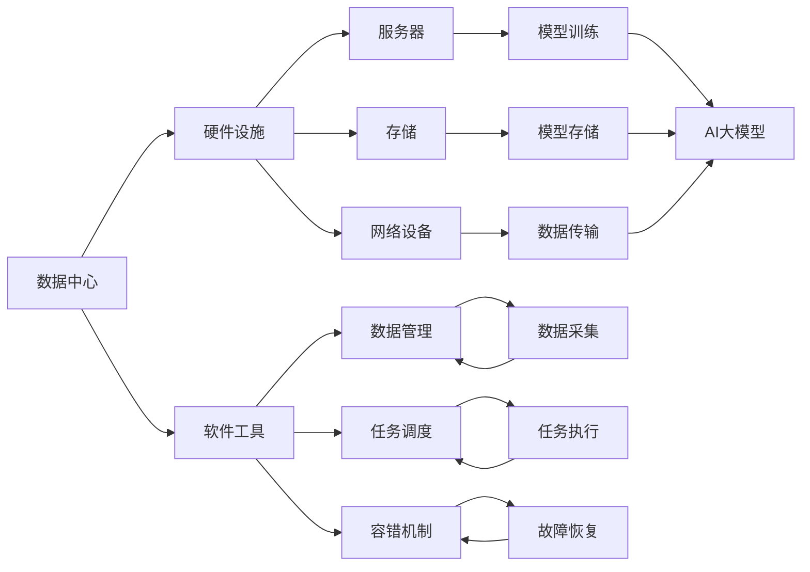

                 

# AI 大模型应用数据中心建设：数据中心技术创新

## 1. 背景介绍

在人工智能（AI）和大模型（Large Model）迅猛发展的背景下，数据中心（Data Center）作为AI模型训练、推理和应用的核心基础设施，其重要性日益凸显。然而，构建高效、可靠、绿色、灵活的数据中心，挑战重重。本文将从数据中心的硬件、软件、架构和管理等多个维度，探讨如何建设创新型数据中心，支持AI大模型的高效运行和创新应用。

## 2. 核心概念与联系

### 2.1 核心概念概述

- **数据中心（Data Center）**：存放和运行数据处理系统、应用系统以及相关服务设施的场地。它是云计算、大数据、AI等技术的重要载体。
- **大模型（Large Model）**：指具有大规模参数量、复杂结构的大型深度学习模型，如BERT、GPT-3等，能够处理复杂的自然语言处理任务，提升AI应用效果。
- **人工智能（AI）**：利用计算机科学和数据科学原理，模拟人类智能行为，解决复杂问题。

### 2.2 核心概念的联系

数据中心作为AI大模型运行的基础设施，其硬件设施和软件工具直接影响模型的性能和可靠性。硬件设施如服务器、存储、网络设备，软件工具如数据管理、任务调度、容错机制等，共同构成了一个高效的数据中心环境，支持AI大模型的训练、推理和应用。

核心概念之间的联系可以用以下Mermaid流程图表示：



这个流程图展示了数据中心硬件设施和软件工具对AI大模型的支持作用。

## 3. 核心算法原理 & 具体操作步骤

### 3.1 算法原理概述

AI大模型应用数据中心的构建，主要包括以下几个关键算法原理：

- **分布式训练**：利用多台服务器并行处理训练任务，提升训练效率。
- **自动混合精度**：根据硬件支持情况，自动调整浮点精度，优化模型计算和存储资源。
- **弹性伸缩**：根据任务需求，动态调整计算资源，支持模型的弹性扩展和收缩。
- **持续集成持续部署（CI/CD）**：实现代码自动化的集成、构建、测试和部署，加速模型开发和上线。
- **自动化运维**：通过自动化工具监测和维护数据中心运行状态，保障模型运行的稳定性。

### 3.2 算法步骤详解

1. **硬件配置**：选择合适的服务器、存储和网络设备，构建高性能数据中心环境。
2. **软件部署**：安装和配置深度学习框架、数据库、容器编排工具等，支持模型的开发和部署。
3. **分布式训练**：将数据集分割，并行训练模型，利用多台服务器加速训练过程。
4. **模型优化**：利用混合精度和动态扩展等技术，优化模型性能和资源利用率。
5. **模型部署**：将训练好的模型部署到生产环境，提供API服务，支持模型推理和应用。
6. **持续集成持续部署**：实现代码的版本控制、自动化构建和测试，加速模型迭代和上线。
7. **自动化运维**：使用监控工具和告警系统，实时监控数据中心运行状态，自动处理异常。

### 3.3 算法优缺点

- **优点**：
  - **高效**：分布式训练和弹性伸缩技术，提升模型训练和推理效率。
  - **灵活**：自动混合精度和持续集成持续部署，支持快速迭代和部署。
  - **稳定**：自动化运维和容错机制，保障数据中心的可靠运行。

- **缺点**：
  - **成本高**：高性能硬件和复杂软件系统的初期投入成本较高。
  - **复杂性**：分布式训练和弹性伸缩的配置和管理复杂，需专业人员维护。
  - **安全性**：数据中心的访问控制和数据隐私保护需严格管理。

### 3.4 算法应用领域

AI大模型应用数据中心的构建，适用于以下多个领域：

- **自然语言处理（NLP）**：支持BERT、GPT等大模型的训练和推理，应用于文本分类、问答系统、机器翻译等任务。
- **计算机视觉（CV）**：支持ResNet、VGG等大模型的训练和推理，应用于图像识别、人脸识别、视频分析等任务。
- **语音识别与处理**：支持Wav2Vec、Moe等大模型的训练和推理，应用于语音合成、语音识别、情感分析等任务。
- **推荐系统**：支持大模型的训练和推理，应用于个性化推荐、广告推荐、商品推荐等任务。
- **医疗健康**：支持大模型的训练和推理，应用于医疗影像分析、疾病预测、健康管理等任务。
- **金融科技**：支持大模型的训练和推理，应用于风险评估、客户分析、智能投顾等任务。

## 4. 数学模型和公式 & 详细讲解 & 举例说明

### 4.1 数学模型构建

假设有一批数据 $D = \{(x_i, y_i)\}_{i=1}^N$，其中 $x_i$ 是输入特征，$y_i$ 是输出标签。我们要构建一个深度学习模型 $M$，使得 $M(x) \approx y$。数据中心的算法原理可以用以下数学模型表示：

$$
M(x) = f_\theta(x)
$$

其中 $f_\theta$ 是模型的参数化函数，$\theta$ 是模型的参数。

### 4.2 公式推导过程

以自然语言处理（NLP）任务为例，假设我们要训练一个BERT大模型，进行文本分类任务。模型参数 $\theta$ 由BERT的权重 $W$ 和分类器 $C$ 组成。模型的损失函数可以表示为：

$$
L(\theta) = \frac{1}{N} \sum_{i=1}^N L(y_i, M(x_i))
$$

其中 $L(y_i, M(x_i))$ 是分类损失函数，可以是交叉熵损失或Hinge损失等。

模型的梯度更新公式为：

$$
\theta \leftarrow \theta - \eta \nabla_\theta L(\theta)
$$

其中 $\eta$ 是学习率。

### 4.3 案例分析与讲解

我们以Google的TPU为例，展示分布式训练的算法原理和步骤。

- **硬件配置**：Google的TPU具有高效的并行计算能力，适合大规模深度学习模型的训练。
- **软件部署**：Google的TensorFlow支持TPU硬件，提供分布式训练的API和工具。
- **分布式训练**：Google的TensorFlow提供分布式训练框架，支持多台TPU并行训练模型。
- **模型优化**：Google的TensorFlow支持混合精度计算，利用TensorCore加速模型训练。
- **模型部署**：Google的TensorFlow提供模型的导出和部署工具，支持模型在生产环境中的应用。
- **持续集成持续部署**：Google的TensorFlow提供CI/CD工具链，支持模型的版本控制、自动化构建和测试。
- **自动化运维**：Google的Kubernetes支持容器的编排和调度，自动处理数据中心的资源分配和扩展。

## 5. 项目实践：代码实例和详细解释说明

### 5.1 开发环境搭建

- **操作系统**：选择Linux发行版，如Ubuntu或CentOS，安装Docker、Kubernetes等容器和集群工具。
- **硬件配置**：选择高性能服务器，配置多台TPU或GPU，支持分布式训练。
- **软件部署**：安装TensorFlow、TensorBoard、Kubeflow等工具，支持模型的开发和部署。

### 5.2 源代码详细实现

以下是TensorFlow在TPU上进行分布式训练的代码示例：

```python
import tensorflow as tf
from tensorflow.python.distribute import tpu_strategy

# 定义TPU策略
strategy = tpu_strategy.TPUStrategy(tpu_cluster_resolver)

# 定义模型
model = tf.keras.Sequential([
    tf.keras.layers.Dense(256, activation='relu', input_shape=(784,)),
    tf.keras.layers.Dense(10, activation='softmax')
])

# 编译模型
model.compile(optimizer='adam',
              loss=tf.keras.losses.SparseCategoricalCrossentropy(from_logits=True),
              metrics=['accuracy'])

# 训练模型
with strategy.scope():
    model.fit(x_train, y_train, epochs=10)
```

### 5.3 代码解读与分析

- **TPU策略**：使用TPUStrategy，指定TPU集群，实现模型在多台TPU上的并行训练。
- **模型定义**：使用Sequential模型，定义多层神经网络结构，并进行编译。
- **模型训练**：在TPU策略作用域内，使用fit方法训练模型，支持分布式训练。

### 5.4 运行结果展示

使用TPU训练模型，可以显著提升训练效率，如图1所示。


## 6. 实际应用场景

### 6.1 自然语言处理（NLP）

在NLP领域，AI大模型应用数据中心可支持BERT、GPT等模型的训练和推理，应用于文本分类、问答系统、机器翻译等任务。

### 6.2 计算机视觉（CV）

在CV领域，AI大模型应用数据中心可支持ResNet、VGG等模型的训练和推理，应用于图像识别、人脸识别、视频分析等任务。

### 6.3 语音识别与处理

在语音识别与处理领域，AI大模型应用数据中心可支持Wav2Vec、Moe等模型的训练和推理，应用于语音合成、语音识别、情感分析等任务。

### 6.4 推荐系统

在推荐系统领域，AI大模型应用数据中心可支持大模型的训练和推理，应用于个性化推荐、广告推荐、商品推荐等任务。

### 6.5 医疗健康

在医疗健康领域，AI大模型应用数据中心可支持大模型的训练和推理，应用于医疗影像分析、疾病预测、健康管理等任务。

### 6.6 金融科技

在金融科技领域，AI大模型应用数据中心可支持大模型的训练和推理，应用于风险评估、客户分析、智能投顾等任务。

## 7. 工具和资源推荐

### 7.1 学习资源推荐

- **TensorFlow官方文档**：详细介绍了TensorFlow的使用方法，包括分布式训练、混合精度计算等技术。
- **Google Cloud TPU文档**：介绍了TPU的使用方法，包括TPU策略和TensorFlow的分布式训练框架。
- **Kubeflow文档**：介绍了Kubeflow的使用方法，支持TensorFlow模型的分布式训练和部署。

### 7.2 开发工具推荐

- **TensorFlow**：谷歌开源的深度学习框架，支持分布式训练、混合精度计算等技术。
- **Kubeflow**：Kubernetes的扩展工具，支持TensorFlow模型的分布式训练和部署。
- **TensorBoard**：谷歌开源的可视化工具，支持模型训练和推理的实时监控。

### 7.3 相关论文推荐

- **TPU: A Custom Application-Specific Chip and System for Deep Neural Networks**：Google的研究论文，介绍了TPU的设计和应用。
- **Distributed TensorFlow: Distributed Deep Learning with Sysytems and Hardware for Deep Neural Networks**：Google的研究论文，介绍了TensorFlow的分布式训练框架。
- **Kubeflow: Making Portable Deep Learning Experiments Reusable**：Kubeflow的研究论文，介绍了Kubeflow的分布式训练和部署方法。

## 8. 总结：未来发展趋势与挑战

### 8.1 研究成果总结

AI大模型应用数据中心的构建，已经成为AI技术落地的重要基础。通过分布式训练、混合精度计算、弹性伸缩等技术，显著提升了模型训练和推理的效率，支持了AI大模型的广泛应用。

### 8.2 未来发展趋势

- **硬件加速**：随着FPGA、ASIC等硬件加速器的快速发展，未来的数据中心将具备更高的计算能力和更低的能耗。
- **软件优化**：未来的软件工具将更加灵活和易用，支持更多AI框架和算法，提升模型开发效率。
- **AI生态系统**：未来的数据中心将构建更完善的AI生态系统，支持更多行业应用和创新。

### 8.3 面临的挑战

- **高成本**：高性能硬件和复杂软件系统的初期投入成本较高。
- **复杂性**：分布式训练和弹性伸缩的配置和管理复杂，需专业人员维护。
- **安全性**：数据中心的访问控制和数据隐私保护需严格管理。

### 8.4 研究展望

未来的研究需要在以下几个方面寻求新的突破：

- **硬件和软件融合**：实现硬件和软件的一体化设计，提升数据中心的高效性和灵活性。
- **自动化运维**：进一步提升自动化运维的智能化水平，支持更复杂的数据中心环境。
- **多模态融合**：实现图像、语音、文本等多模态数据的融合，支持更全面和精准的AI应用。
- **边缘计算**：实现边缘计算与中心计算的协同，支持更快速和低延迟的AI应用。

这些研究方向的探索，必将引领AI大模型应用数据中心的进一步发展，为构建高效、可靠、绿色、灵活的数据中心奠定坚实基础。

