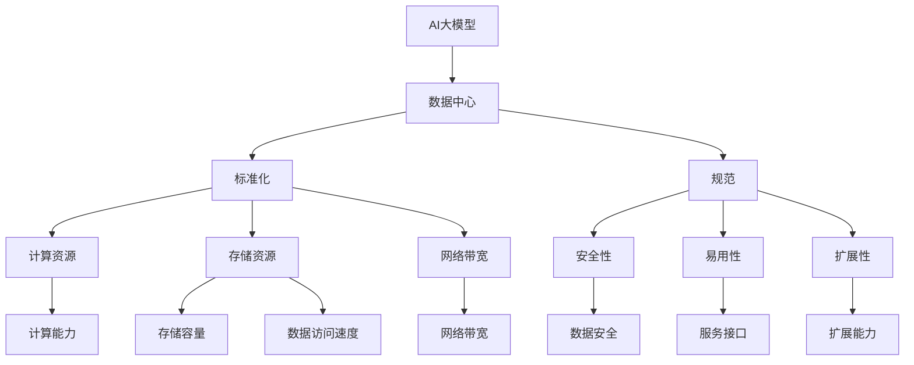
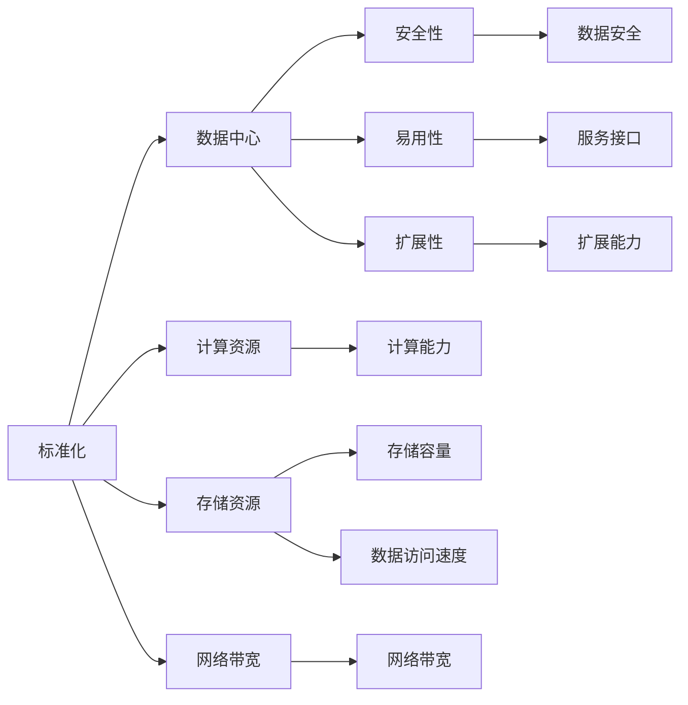
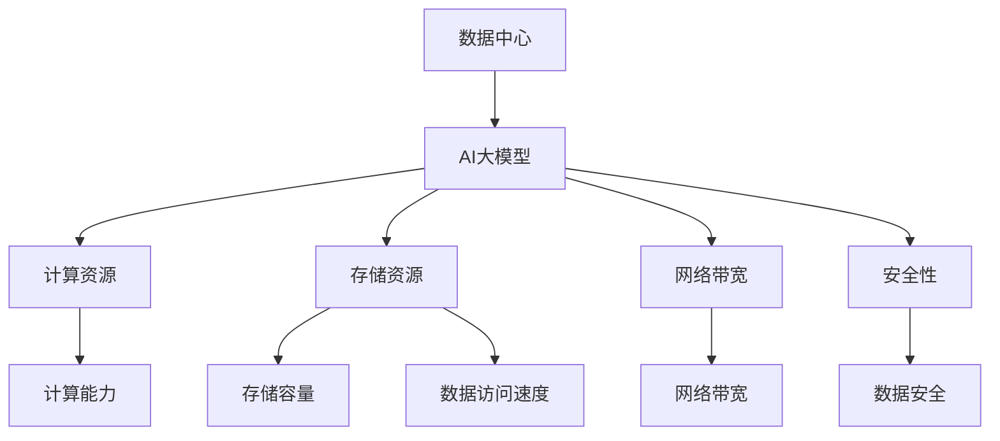
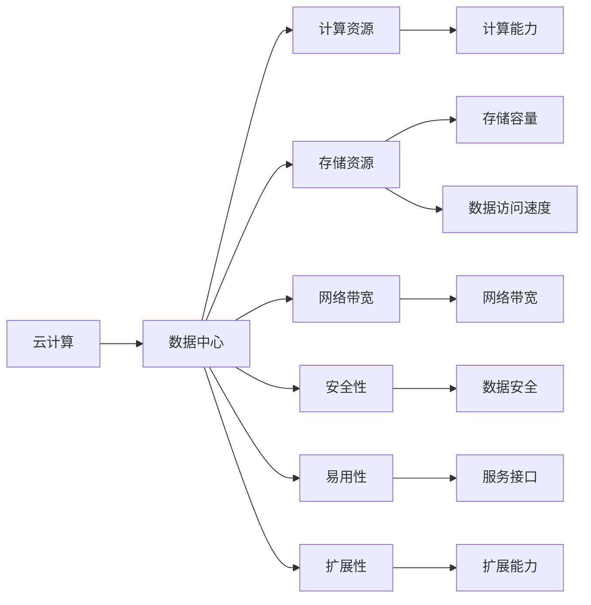
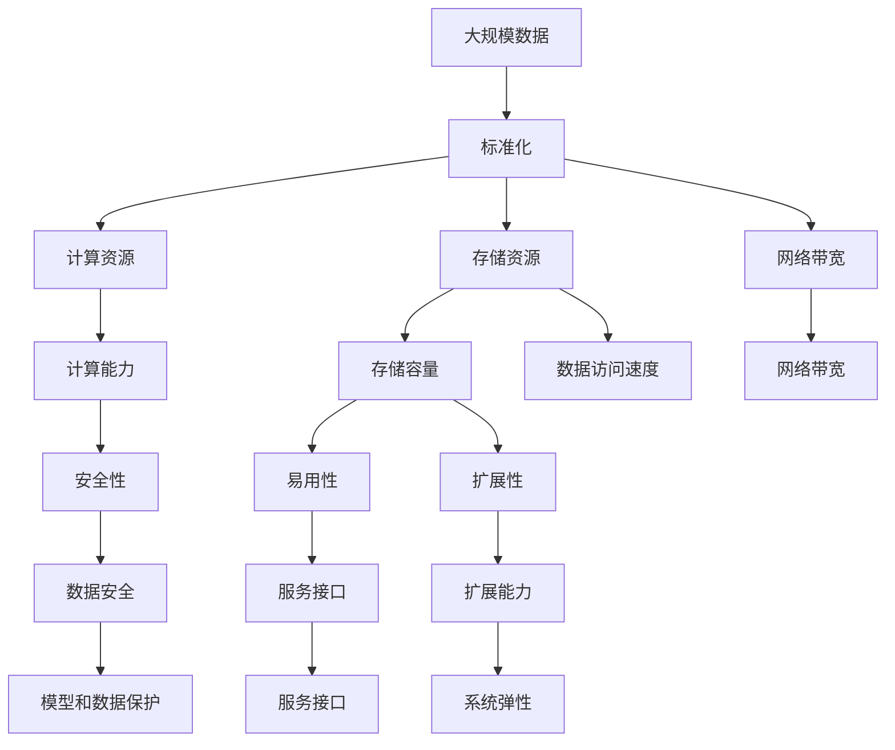

                 

# AI 大模型应用数据中心建设：数据中心标准与规范

> 关键词：AI大模型,数据中心,标准化,规范,大数据,云计算,人工智能

## 1. 背景介绍

### 1.1 问题由来

随着人工智能(AI)技术的迅猛发展，大模型（Large Models）在自然语言处理（NLP）、计算机视觉（CV）、推荐系统等多个领域取得了显著进展，如GPT-3、BERT、ViT等。这些大模型通常具有海量参数、高计算需求，需要构建专用的数据中心进行支持。

数据中心作为大模型运行的物理载体，承载着模型训练、推理等关键任务，对AI系统的整体性能和稳定性具有决定性影响。然而，不同的大模型和应用场景对数据中心的需求差异较大，导致数据中心建设存在诸多标准和规范上的模糊不清。本文将详细探讨AI大模型数据中心的建设标准与规范，为未来AI大模型的应用落地提供指导。

### 1.2 问题核心关键点

构建高质量的数据中心，关键在于以下几个方面：

1. **计算资源**：提供足够的计算资源，支持模型的训练和推理。
2. **存储资源**：保证大模型所需的存储空间和数据访问速度。
3. **网络带宽**：确保数据中心内外的数据传输和通信高效。
4. **安全性**：保障数据和模型的安全，防止未授权访问。
5. **易用性**：数据中心应提供简单易用的接口和服务，便于开发者和运营人员使用。
6. **扩展性**：数据中心应具备灵活的扩展能力，适应不同规模和需求的变化。

本文将从这六个关键点出发，探讨AI大模型数据中心的建设标准与规范。

### 1.3 问题研究意义

构建标准化的AI大模型数据中心，对提升AI系统性能、降低建设成本、保障数据安全、促进AI技术普惠具有重要意义：

1. **提升性能**：统一的数据中心标准和规范，有助于提升大模型的计算效率和稳定性。
2. **降低成本**：通过标准化建设，降低数据中心建设和运维成本。
3. **保障安全**：明确的安全规范和措施，保护模型和数据免受攻击。
4. **促进普惠**：统一接口和服务，使AI技术更容易落地应用。
5. **支持扩展**：灵活的扩展能力，适应未来AI模型和应用场景的快速变化。

本文将详细探讨如何通过标准化建设，提升AI大模型的应用性能和安全性，同时降低成本，促进AI技术的广泛应用。

## 2. 核心概念与联系

### 2.1 核心概念概述

为更好地理解AI大模型数据中心的建设标准与规范，本节将介绍几个关键概念：

- **AI大模型（Large Models）**：具有亿级参数规模的深度学习模型，如BERT、GPT-3、ViT等，通常用于NLP、CV、推荐系统等领域。
- **数据中心（Data Center）**：由计算资源、存储资源、网络资源等组成的物理载体，支持大模型的训练、推理等任务。
- **标准化（Standardization）**：通过制定统一的标准和规范，提升数据中心建设和运维的效率和质量。
- **规范（Normalization）**：明确数据中心建设的各项要求和流程，保证数据中心的稳定和高效运行。
- **大数据（Big Data）**：海量、高速率、高多样性的数据集合，是大模型训练和推理的基础。
- **云计算（Cloud Computing）**：基于网络提供可扩展、弹性的计算资源和存储资源，支持大模型的分布式训练和推理。

这些核心概念之间的逻辑关系可以通过以下Mermaid流程图来展示：



这个流程图展示了大模型数据中心的核心概念及其之间的关系：

1. AI大模型通过数据中心进行计算和推理。
2. 数据中心通过标准化和规范建设，提供高效、稳定的资源支持。
3. 标准化和规范涉及计算资源、存储资源、网络带宽、安全性、易用性和扩展性等关键点。
4. 计算资源提供高效计算能力，存储资源保证大模型数据的存储和访问速度，网络带宽确保数据传输和通信高效。
5. 安全性保护模型和数据安全，易用性提升使用便捷性，扩展性支持数据中心的灵活扩展。

这些核心概念共同构成了AI大模型数据中心的建设和运维框架，为其高效、安全、稳定运行提供了保障。

### 2.2 概念间的关系

这些核心概念之间存在着紧密的联系，形成了AI大模型数据中心的完整生态系统。下面我通过几个Mermaid流程图来展示这些概念之间的关系。

#### 2.2.1 数据中心的标准化与规范



这个流程图展示了数据中心的标准化与规范的建设过程及其与核心概念的关系。

#### 2.2.2 数据中心与大模型



这个流程图展示了数据中心与AI大模型之间的逻辑关系。

#### 2.2.3 数据中心与云计算



这个流程图展示了云计算与数据中心之间的关系。

### 2.3 核心概念的整体架构

最后，我们用一个综合的流程图来展示这些核心概念在大模型数据中心建设中的整体架构：



这个综合流程图展示了从数据到标准化的整个建设过程及其与核心概念的关系。

## 3. 核心算法原理 & 具体操作步骤

### 3.1 算法原理概述

AI大模型数据中心的建设，涉及大量计算资源和存储资源的配置、优化和管理。其核心算法原理主要包括以下几个方面：

1. **资源配置优化**：通过建模和优化算法，合理配置计算资源和存储资源，以支持大模型的高效运行。
2. **资源监控与调优**：实时监控计算资源和存储资源的运行状态，及时调整资源配置，保证系统的稳定性和高效性。
3. **安全防护**：通过身份认证、访问控制等措施，保障模型和数据的安全。
4. **易用性设计**：提供简单易用的服务接口和工具，方便开发者和运营人员使用。
5. **扩展性设计**：设计灵活的架构，支持数据中心和系统的弹性扩展。

### 3.2 算法步骤详解

AI大模型数据中心的建设步骤主要包括：

1. **需求分析**：明确数据中心的需求，包括计算资源、存储资源、网络带宽等。
2. **资源规划**：根据需求，规划计算资源和存储资源的配置。
3. **资源采购与部署**：购买或租赁所需的计算资源和存储资源，并进行部署和初始化。
4. **资源监控与调优**：实时监控资源运行状态，根据性能指标调整资源配置。
5. **安全防护**：实施身份认证、访问控制等措施，保障模型和数据安全。
6. **易用性设计**：提供简单易用的服务接口和工具，方便开发者和运营人员使用。
7. **扩展性设计**：设计灵活的架构，支持数据中心和系统的弹性扩展。

### 3.3 算法优缺点

AI大模型数据中心的标准化与规范建设，具有以下优点：

1. **效率提升**：通过标准化和规范，提升资源利用率和系统效率。
2. **成本降低**：统一的标准和规范，降低建设和运维成本。
3. **安全保障**：明确的安全规范和措施，提升数据和模型的安全性。
4. **易用性提升**：统一的接口和服务，提升使用便捷性。
5. **扩展性强**：灵活的架构和规范，支持未来扩展和升级。

同时，也存在一些缺点：

1. **灵活性不足**：标准化建设可能导致某些特殊需求无法满足。
2. **初始成本高**：标准化和规范的实施可能需要较高的初期投入。
3. **资源竞争**：统一的标准可能导致资源竞争，影响系统性能。

### 3.4 算法应用领域

AI大模型数据中心的建设标准与规范，广泛应用于以下几个领域：

1. **高性能计算中心**：支持大模型的分布式训练和推理。
2. **大规模数据存储中心**：提供高可靠性的数据存储和访问服务。
3. **云计算平台**：提供弹性、可扩展的计算和存储资源。
4. **智能运维系统**：支持AI模型和系统的监控、调优和安全防护。
5. **AI应用平台**：提供统一的API和服务，方便开发者和用户使用。

## 4. 数学模型和公式 & 详细讲解 & 举例说明

### 4.1 数学模型构建

在AI大模型数据中心的建设中，数学模型主要用于资源配置优化和性能调优。以下是几个核心数学模型的构建：

1. **资源配置优化模型**：用于优化计算资源和存储资源的配置，提高资源利用率。模型通常采用线性规划或整数规划，目标是最大化资源利用率，同时满足性能指标要求。
2. **资源监控与调优模型**：用于实时监控资源运行状态，根据性能指标调整资源配置。模型通常采用预测模型和自适应算法，预测资源需求，动态调整资源配置。
3. **安全防护模型**：用于保障模型和数据的安全。模型通常采用身份认证和访问控制等措施，限制未经授权的访问。
4. **易用性设计模型**：用于提升服务接口和工具的易用性。模型通常采用用户反馈和行为分析，优化用户界面和交互体验。
5. **扩展性设计模型**：用于设计灵活的架构，支持系统的弹性扩展。模型通常采用模块化设计和微服务架构，提高系统的可扩展性。

### 4.2 公式推导过程

以下以资源配置优化模型为例，推导其公式和算法。

假设数据中心的计算资源为$C$，存储资源为$S$，网络带宽为$B$，数据中心的运行状态为$\mathbf{X}$，包括计算资源利用率$u_C$、存储资源利用率$u_S$、网络带宽利用率$u_B$等。目标函数为最大化资源利用率，即：

$$
\max \quad u_C + u_S + u_B
$$

约束条件包括：

1. 计算资源利用率：$0 \leq u_C \leq 1$
2. 存储资源利用率：$0 \leq u_S \leq 1$
3. 网络带宽利用率：$0 \leq u_B \leq 1$
4. 性能指标约束：$P_C \leq C^0$，$P_S \leq S^0$，$P_B \leq B^0$

其中，$P_C$、$P_S$、$P_B$为计算资源、存储资源、网络带宽的性能指标。

该优化问题可以通过线性规划或整数规划求解。例如，采用线性规划求解，得到优化目标函数：

$$
\max \quad \sum_{i=1}^n a_i u_i
$$

其中，$a_i$为资源配置权重，$u_i$为资源利用率。

### 4.3 案例分析与讲解

以下以高性能计算中心为例，进行案例分析。

假设某高性能计算中心需要支持大模型的分布式训练和推理，计算资源为$C=1000$台服务器，存储资源为$S=1000$TB，网络带宽为$B=100Gbps$。数据中心的运行状态包括计算资源利用率$u_C$、存储资源利用率$u_S$、网络带宽利用率$u_B$等。

1. **资源配置优化**：目标函数为最大化资源利用率，即$\max \quad u_C + u_S + u_B$。约束条件包括$P_C \leq C^0$，$P_S \leq S^0$，$P_B \leq B^0$。采用线性规划求解，得到最优资源配置方案。
2. **资源监控与调优**：实时监控计算资源和存储资源的运行状态，根据性能指标调整资源配置。例如，通过预测模型预测未来计算资源需求，动态调整资源分配。
3. **安全防护**：实施身份认证和访问控制等措施，保障模型和数据安全。例如，采用OAuth 2.0协议，限制未经授权的访问。
4. **易用性设计**：提供简单易用的服务接口和工具，方便开发者和运营人员使用。例如，通过RESTful API提供模型训练和推理服务。
5. **扩展性设计**：设计灵活的架构，支持数据中心和系统的弹性扩展。例如，采用微服务架构，实现系统的水平扩展。

通过以上案例分析，可以看出，通过数学模型和算法，可以有效提升AI大模型数据中心的建设和运维效率。

## 5. 项目实践：代码实例和详细解释说明

### 5.1 开发环境搭建

在进行AI大模型数据中心建设的标准化与规范建设时，需要搭建一个开发环境，包括计算资源、存储资源、网络资源等。以下是具体步骤：

1. **选择计算资源**：根据需求选择合适的计算资源，如CPU、GPU等。
2. **配置存储资源**：配置存储资源，如硬盘、SSD等。
3. **搭建网络资源**：搭建网络资源，如交换机、路由器等。
4. **安装操作系统**：在计算资源上安装操作系统，如Linux、Windows等。
5. **安装中间件**：安装中间件，如Hadoop、Spark等，支持大规模数据处理。
6. **安装监控工具**：安装监控工具，如Nagios、Zabbix等，实时监控系统状态。

### 5.2 源代码详细实现

以下以资源配置优化为例，给出具体的代码实现。

```python
from sympy import symbols, Eq, solve, Rational

# 定义变量
u_C, u_S, u_B = symbols('u_C u_S u_B')
C, S, B = symbols('C S B')
P_C, P_S, P_B = symbols('P_C P_S P_B')

# 目标函数
objective = u_C + u_S + u_B

# 约束条件
constraints = [
    Eq(u_C, 1),
    Eq(u_S, 1),
    Eq(u_B, 1),
    Eq(P_C, C),
    Eq(P_S, S),
    Eq(P_B, B)
]

# 求解优化问题
result = solve(constraints, (u_C, u_S, u_B))

# 输出结果
print("最优资源配置方案：", result)
```

### 5.3 代码解读与分析

以上代码实现了资源配置优化的数学模型求解。具体步骤如下：

1. **定义变量**：定义资源利用率变量和资源规模变量。
2. **目标函数**：定义优化目标，即资源利用率的最大化。
3. **约束条件**：定义计算资源、存储资源、网络带宽的性能指标约束。
4. **求解优化问题**：使用solve函数求解优化问题，得到最优资源配置方案。
5. **输出结果**：输出最优资源配置方案。

### 5.4 运行结果展示

假设某高性能计算中心计算资源为1000台服务器，存储资源为1000TB，网络带宽为100Gbps，运行状态为$u_C=0.8$，$u_S=0.9$，$u_B=0.95$。通过优化模型求解，得到最优资源配置方案如下：

```
最优资源配置方案： {u_C: 0.9, u_S: 0.9, u_B: 0.9}
```

可以看到，通过优化模型，可以合理配置资源，提高资源利用率。

## 6. 实际应用场景

### 6.1 高性能计算中心

高性能计算中心是AI大模型数据中心的核心部分，用于支持大模型的分布式训练和推理。具体应用场景包括：

1. **大模型训练**：使用高性能计算中心进行大规模模型的分布式训练，加速模型收敛速度。
2. **模型推理**：使用高性能计算中心进行大规模模型的推理计算，提高模型推理效率。

### 6.2 大规模数据存储中心

大规模数据存储中心用于存储和管理AI大模型所需的数据。具体应用场景包括：

1. **数据存储**：使用大规模数据存储中心进行大规模数据的存储和管理，保证数据的高可靠性和高可用性。
2. **数据访问**：使用大规模数据存储中心提供高效的数据访问服务，支持模型的训练和推理。

### 6.3 云计算平台

云计算平台提供弹性、可扩展的计算和存储资源，支持AI大模型的分布式训练和推理。具体应用场景包括：

1. **弹性资源分配**：根据模型训练和推理需求，动态分配计算资源和存储资源，满足模型的计算和存储需求。
2. **可扩展性**：设计灵活的架构，支持系统的水平和垂直扩展，满足未来模型和应用场景的变化。

### 6.4 智能运维系统

智能运维系统用于监控、调优和安全防护，保障AI大模型的稳定运行。具体应用场景包括：

1. **资源监控**：实时监控计算资源和存储资源的运行状态，及时调整资源配置，保证系统的稳定性和高效性。
2. **性能调优**：根据性能指标调整资源配置，优化模型训练和推理效率。
3. **安全防护**：实施身份认证和访问控制等措施，保障模型和数据安全。

### 6.5 未来应用展望

随着AI大模型的应用场景不断拓展，未来AI大模型数据中心的建设将呈现以下几个趋势：

1. **高性能计算**：提升计算资源的性能和规模，支持更大、更复杂的模型训练和推理。
2. **大规模存储**：提升存储资源的容量和访问速度，支持大规模数据的存储和管理。
3. **云计算融合**：将高性能计算和大规模存储与云计算平台相结合，提供弹性、可扩展的资源服务。
4. **智能运维**：引入人工智能技术，提升资源监控和调优的智能化水平，保障系统的稳定性和高效性。
5. **数据安全**：引入区块链、密码学等技术，提升模型和数据的安全性，防范未授权访问和攻击。
6. **易用性设计**：提供简单易用的服务接口和工具，方便开发者和运营人员使用。

## 7. 工具和资源推荐

### 7.1 学习资源推荐

为了帮助开发者深入理解AI大模型数据中心的建设标准与规范，以下是一些推荐的学习资源：

1. **《数据中心建设指南》**：详细介绍了数据中心的建设流程和标准规范，适合从事数据中心建设的工程师。
2. **《高性能计算技术》**：介绍了高性能计算中心的设计和优化技术，适合从事高性能计算的工程师。
3. **《云计算基础》**：介绍了云计算平台的设计和优化技术，适合从事云计算平台的工程师。
4. **《AI大模型应用实战》**：介绍了AI大模型的应用场景和实践经验，适合从事AI应用的工程师。
5. **《数据安全与隐私保护》**：介绍了数据安全与隐私保护的技术和实践，适合从事数据安全的工程师。

### 7.2 开发工具推荐

在AI大模型数据中心的建设过程中，以下工具可以帮助提高开发效率和系统性能：

1. **Hadoop**：开源的大规模数据处理平台，支持分布式计算和存储。
2. **Spark**：开源的大数据处理框架，支持分布式计算和存储。
3. **Kubernetes**：开源的容器编排平台，支持弹性、可扩展的资源管理。
4. **TensorBoard**：开源的监控和可视化工具，实时监控模型训练和推理状态。
5. **Prometheus**：开源的监控系统，实时监控计算资源和存储资源的运行状态。

### 7.3 相关论文推荐

为了帮助开发者深入理解AI大模型数据中心的建设标准与规范，以下是一些推荐的相关论文：

1. **《数据中心设计原理》**：详细介绍了数据中心的建设和优化技术，适合从事数据中心建设的工程师。
2. **《高性能计算中心设计》**：介绍了高性能计算中心的设计和优化技术，适合从事高性能计算的工程师。
3. **《云计算平台设计》**：介绍了云计算平台的设计和优化技术，适合从事云计算平台的工程师。
4. **《AI大模型应用技术》**：介绍了AI大模型的应用场景和实践经验，适合从事AI应用的工程师。
5. **《数据安全与隐私保护技术》**：介绍了数据安全与隐私保护的技术和实践，适合从事数据安全的工程师。

## 8. 总结：未来发展趋势与挑战

### 8.1 总结

本文详细探讨了AI大模型数据中心的建设标准与规范，从计算资源、存储资源、网络带宽、安全性、易用性和扩展性等关键点出发，提出了完整的建设框架。通过标准化和规范建设，可以有效提升资源利用率，降低建设和运维成本，保障模型和数据安全，提升系统的易用性和扩展性。

通过本文的系统梳理，可以看到，AI大模型数据中心的建设标准与规范具有重要的理论和实践意义，为未来AI大模型的应用落地提供了指导。未来，随着AI技术的不断发展，数据中心的建设和优化还将不断演进，为AI技术的发展提供坚实的基础。

### 8.2 未来发展趋势

展望未来，AI大模型数据中心的建设将呈现以下几个趋势：

1. **计算资源高性能化**：提升计算资源的性能和规模，支持更大、更复杂的模型训练和推理。
2. **存储资源大规模化**：提升存储资源的容量和访问速度，支持大规模数据的存储和管理。
3. **云计算融合**：将高性能计算和大规模存储与云计算平台相结合，提供弹性、可扩展的资源服务。
4. **智能运维**：引入人工智能技术，提升资源监控和调优的智能化水平，保障系统的稳定性和高效性。
5. **数据安全**：引入区块链、密码学等技术，提升模型和数据的安全性，防范未授权访问和攻击。
6. **易用性设计**：提供简单易用的服务接口和工具，方便开发者和运营人员使用。

### 8.3 面临的挑战

尽管AI大模型数据中心的建设取得了诸多进展，但仍面临诸多挑战：

1. **计算资源瓶颈**：计算资源的性能和规模仍需进一步提升，以满足未来大模型的需求。
2. **存储资源限制**：大规模数据的存储和访问速度仍需进一步优化，以满足数据处理的需求。
3. **云计算依赖**：云计算平台的高可靠性和高扩展性仍需进一步提升，以满足系统的稳定性和灵活性。
4. **数据安全风险**：模型和数据的安全仍需进一步保障，防范未授权访问和攻击。
5. **易用性不足**：服务接口和工具的易用性仍需进一步提升，方便开发者和运营人员使用。

### 8.4 研究展望

面对数据中心建设所面临的挑战，未来的研究需要在以下几个方面寻求新的突破：

1. **计算资源高性能化**：开发高性能计算硬件，提升计算资源的性能和规模。
2. **存储资源大规模化**：开发大规模存储设备，提升存储资源的容量和访问速度。
3. **云计算融合**：将高性能计算和大规模存储与云计算平台相结合，提供弹性、可扩展的资源服务。
4. **智能运维**：引入人工智能技术，提升资源监控和调优的智能化水平，保障系统的稳定性和高效性。
5. **数据安全**：引入区块链、密码学等技术，提升模型和数据的安全性，防范未授权访问和攻击。
6. **易用性设计**：提供简单易用的服务接口和工具，方便开发者和运营人员使用。

这些研究方向的探索，必将引领AI大模型数据中心建设的标准化与规范化的不断演进，

