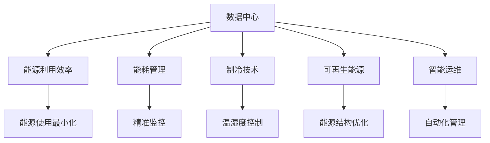
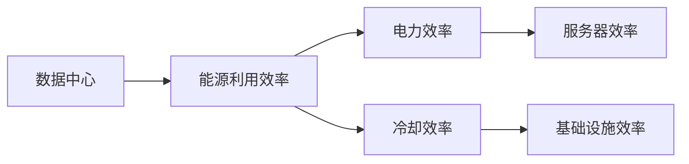
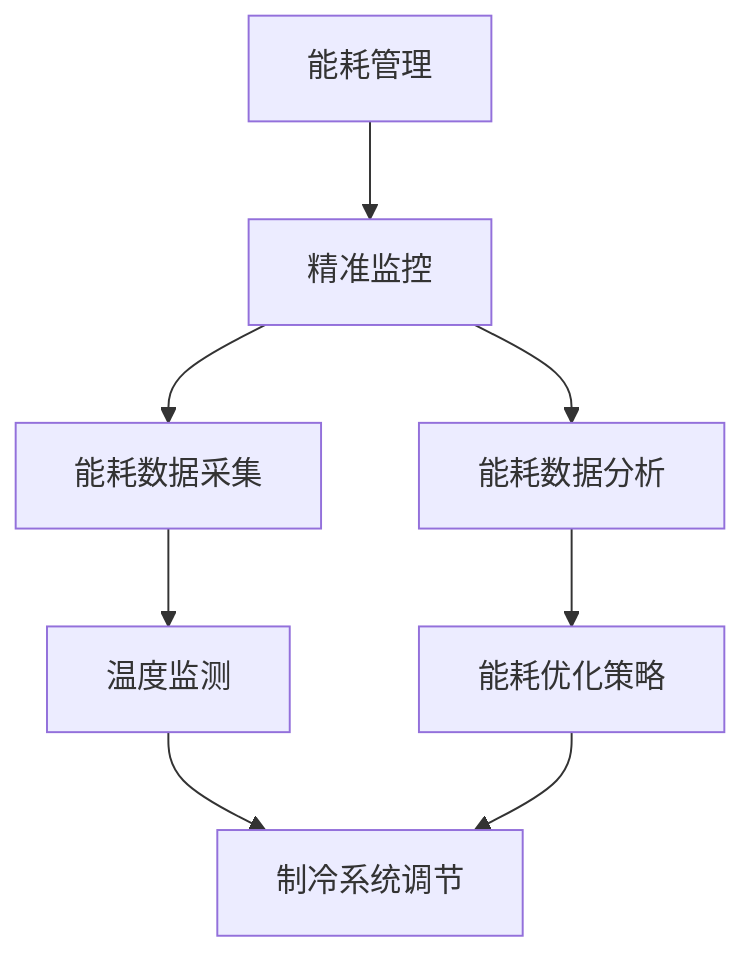
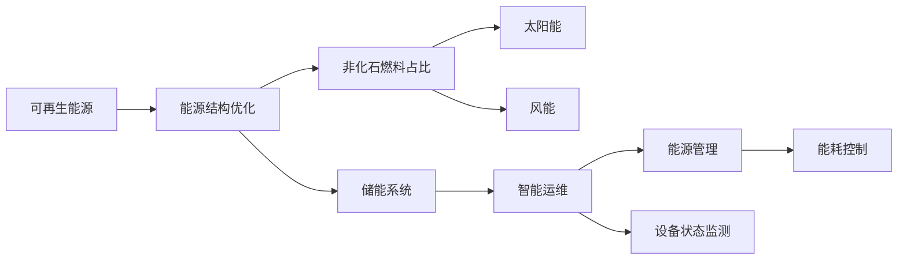
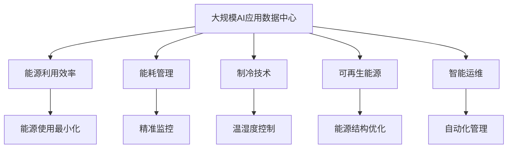

                 

# AI 大模型应用数据中心建设：数据中心绿色节能

> 关键词：AI大模型, 数据中心, 绿色节能, 能耗优化, 可持续发展

## 1. 背景介绍

### 1.1 问题由来

随着人工智能技术尤其是大模型应用的迅猛发展，对算力资源的依赖愈发显著。数据中心作为计算资源的物理载体，其能耗问题逐渐受到广泛关注。传统数据中心高耗电、高热负荷的现象，不仅对环境造成巨大压力，也增加了企业的运营成本。因此，如何构建绿色节能的数据中心，确保AI大模型应用的高效稳定运行，成为迫切需要解决的问题。

### 1.2 问题核心关键点

绿色节能数据中心建设的核心在于实现能耗最小化，同时保证计算效率和系统可靠性。其关键点包括：

- 提升数据中心的能源利用效率。
- 优化硬件配置，降低能耗。
- 实施精准能耗管理，实时监控系统运行状态。
- 采用先进制冷技术，控制数据中心内部温度。
- 引入可再生能源，实现能源结构优化。
- 结合智能运维，提升数据中心自动化管理水平。

### 1.3 问题研究意义

构建绿色节能数据中心，对于保障AI大模型应用的稳定运行，推动人工智能技术的可持续发展，具有重要意义：

1. **节能减排**：通过减少数据中心的能耗，有效缓解全球气候变化，支持全球绿色发展目标。
2. **降低成本**：优化能源利用效率，降低数据中心的运营成本，提升企业的经济效益。
3. **提升可靠性**：采用先进制冷和冷却技术，确保数据中心的稳定运行，避免因高温导致的硬件故障。
4. **强化安全性**：通过智能运维和实时监控，提高数据中心的安全性和可靠性，减少因故障导致的数据丢失风险。
5. **促进可持续发展**：推广可再生能源的应用，推动数据中心的能源结构向绿色低碳转型。

## 2. 核心概念与联系

### 2.1 核心概念概述

为更好地理解绿色节能数据中心的构建原理，本节将介绍几个密切相关的核心概念：

- **数据中心(Data Center, DC)**：由服务器、存储、网络、通信设备等组成的大型计算设施，提供云计算、大数据等IT服务。
- **能源利用效率(Energy Efficiency)**：衡量能源输入与输出之间的转换效率，是绿色数据中心建设的重要指标。
- **能耗管理(Consumption Management)**：通过精准监控和优化配置，有效控制数据中心的电力消耗。
- **制冷技术(Cooling Technology)**：数据中心内部温度控制的核心技术，主要包括自然冷却、机械制冷、液冷等。
- **可再生能源(Renewable Energy)**：如太阳能、风能、水能等，用于替代传统化石燃料，降低数据中心对环境的影响。
- **智能运维(Intelligent Operation and Maintenance)**：利用先进传感器、AI等技术，实现数据中心的自动化管理和优化。

这些核心概念之间的逻辑关系可以通过以下Mermaid流程图来展示：



这个流程图展示了大模型应用数据中心的核心概念及其之间的关系：

1. 数据中心通过能源利用效率、能耗管理、制冷技术、可再生能源和智能运维，实现能源利用最大化和能耗最小化。
2. 能源利用效率和能耗管理有助于优化能源使用，减少浪费。
3. 制冷技术控制数据中心内部温度，确保设备正常工作。
4. 可再生能源提供清洁、低碳的能源来源，减少对环境的污染。
5. 智能运维实现自动化管理，提升数据中心运营效率。

### 2.2 概念间的关系

这些核心概念之间存在着紧密的联系，形成了绿色节能数据中心的完整体系。下面我们通过几个Mermaid流程图来展示这些概念之间的关系。

#### 2.2.1 数据中心与能源利用效率



这个流程图展示了数据中心与能源利用效率之间的关系：

1. 数据中心的能源利用效率包括服务器效率和基础设施效率。
2. 服务器效率指服务器硬件和软件的能耗效率。
3. 基础设施效率指数据中心的电源、冷却、照明等设备的使用效率。

#### 2.2.2 能耗管理与制冷技术



这个流程图展示了能耗管理与制冷技术之间的关系：

1. 能耗管理通过精准监控获取能耗数据，并进行数据分析。
2. 数据分析结果用于优化制冷系统，调整温度和湿度。
3. 制冷系统调节直接影响数据中心的能源利用效率。

#### 2.2.3 可再生能源与智能运维



这个流程图展示了可再生能源与智能运维之间的关系：

1. 可再生能源通过优化能源结构，减少化石燃料的使用。
2. 储能系统用于存储间歇性可再生能源，提高能源稳定性。
3. 智能运维通过实时监控和数据分析，提升能耗控制和设备管理。

### 2.3 核心概念的整体架构

最后，我们用一个综合的流程图来展示这些核心概念在大模型应用数据中心构建过程中的整体架构：



这个综合流程图展示了从预训练到微调，再到持续学习的完整过程：

1. 数据中心通过能源利用效率、能耗管理、制冷技术、可再生能源和智能运维，实现能源利用最大化和能耗最小化。
2. 能源利用效率和能耗管理有助于优化能源使用，减少浪费。
3. 制冷技术控制数据中心内部温度，确保设备正常工作。
4. 可再生能源提供清洁、低碳的能源来源，减少对环境的污染。
5. 智能运维实现自动化管理，提升数据中心运营效率。

## 3. 核心算法原理 & 具体操作步骤

### 3.1 算法原理概述

绿色节能数据中心的构建，涉及能源优化、硬件配置优化、能耗管理、制冷技术等多个方面。其核心在于通过优化算法和策略，实现能耗的最小化，同时保持系统的可靠性和高效性。

具体来说，数据中心能耗优化算法通常包括：

1. **能耗预测**：利用机器学习模型预测数据中心未来的能耗需求，合理分配资源。
2. **动态资源调度**：根据预测结果，动态调整计算资源和存储资源，平衡能耗和性能。
3. **智能调温策略**：通过先进的温控技术，实时调整数据中心的温度和湿度，保证设备在最佳运行状态。
4. **优化制冷方案**：结合自然冷却、机械制冷和液冷技术，实现高效制冷。
5. **能耗管理优化**：通过实时监控和精准分析，优化能耗管理策略，提高能源利用效率。

### 3.2 算法步骤详解

大模型应用数据中心的绿色节能建设，可以分为以下几个关键步骤：

**Step 1: 数据中心选址与规划**

- 选择环境条件优良、电力供应稳定的地点。
- 根据业务需求和未来扩展预期，合理规划数据中心规模和布局。
- 设计合理的电力和冷却系统布局，优化能源分配。

**Step 2: 硬件配置与优化**

- 选择合适的服务器和存储设备，优化硬件配置。
- 引入高效能芯片和低功耗组件，降低设备能耗。
- 采用分布式架构，提高计算资源的利用效率。

**Step 3: 能耗管理与监控**

- 安装能耗监控设备，实时采集能源消耗数据。
- 使用机器学习模型，预测数据中心未来能耗需求。
- 根据预测结果，动态调整计算资源和存储资源。

**Step 4: 制冷技术应用**

- 采用自然冷却技术，如冷却塔、绿色植被等，减少机械制冷需求。
- 使用机械制冷和液冷技术，实现高效降温。
- 根据实时温度和湿度数据，动态调整制冷策略。

**Step 5: 可再生能源利用**

- 引入太阳能、风能等可再生能源，优化能源结构。
- 设计储能系统，存储间歇性可再生能源。
- 实时监测可再生能源的使用情况，优化能源管理。

**Step 6: 智能运维与优化**

- 部署智能运维平台，实现自动化管理和监控。
- 利用先进传感器和AI技术，实时监测设备状态和能耗情况。
- 根据监测数据，优化系统配置和能耗管理策略。

### 3.3 算法优缺点

绿色节能数据中心构建的算法具有以下优点：

1. **高效节能**：通过优化算法和策略，有效降低数据中心的能耗，减少运营成本。
2. **提升可靠性**：先进的制冷和温控技术，确保设备在最佳运行状态，提升系统的可靠性。
3. **环境友好**：可再生能源的应用，减少对环境的污染，推动绿色发展。
4. **智能化管理**：智能运维平台，提升数据中心的自动化管理水平。

同时，这些算法也存在一些缺点：

1. **初期投入高**：先进的硬件设备和智能化管理系统需要较高的初始投资。
2. **技术复杂度高**：需要具备较高的技术水平和专业知识，实施难度较大。
3. **数据中心依赖性强**：数据中心的设计和运营需要高度依赖硬件和软件技术。

### 3.4 算法应用领域

绿色节能数据中心构建的算法和技术，广泛应用于以下几个领域：

1. **云计算中心**：如Amazon AWS、Google Cloud、Microsoft Azure等，需要构建大规模、高可靠性、高效能的数据中心。
2. **大数据中心**：用于处理海量数据和存储，需要优化能耗和资源配置。
3. **人工智能中心**：如AI大模型训练和推理，需要高效稳定的计算环境。
4. **物联网中心**：用于处理物联网设备产生的大量数据，需要高效能和低延迟的数据中心。
5. **企业数据中心**：支持企业的IT服务需求，需要优化能耗和资源配置。

## 4. 数学模型和公式 & 详细讲解 & 举例说明

### 4.1 数学模型构建

本节将使用数学语言对绿色节能数据中心构建的算法进行更加严格的刻画。

记数据中心的总能源消耗为 $E$，其中 $E_{elec}$ 为电能消耗，$E_{cool}$ 为冷却能耗。数据中心运行期间的电能消耗主要由服务器和存储设备构成，可以表示为：

$$
E_{elec} = E_{servers} + E_{storage}
$$

其中 $E_{servers}$ 为服务器设备消耗的电能，$E_{storage}$ 为存储设备消耗的电能。冷却能耗 $E_{cool}$ 主要由制冷系统决定，可以表示为：

$$
E_{cool} = \sum_{i} \alpha_i E_{cool,i}
$$

其中 $\alpha_i$ 为制冷系统的冷却能力权重，$E_{cool,i}$ 为第 $i$ 个制冷系统的能耗。

### 4.2 公式推导过程

以下我们以电能消耗的优化为例，推导最小化电能消耗的优化模型。

假设服务器和存储设备的能耗模型为 $E_{device}(D)$，数据中心的总体能耗模型为 $E_{total}(Elec, Cool) = E_{elec} + E_{cool}$。最小化电能消耗的优化问题可以表示为：

$$
\min_{D, Cool} E_{total}(Elec, Cool)
$$

其中 $D$ 为数据中心的设计参数，如服务器数量、存储容量等；$Cool$ 为制冷系统的运行策略。

引入机器学习模型 $M$ 对未来电能消耗进行预测，模型训练数据集为 $D_{train}$，测试数据集为 $D_{test}$。则最小化电能消耗的优化问题可以转化为：

$$
\min_{D, Cool} E_{elec} + \sum_{i} \alpha_i E_{cool,i}
$$

其中 $E_{elec}$ 和 $E_{cool,i}$ 可以通过模型 $M$ 预测得到。

### 4.3 案例分析与讲解

假设有一个数据中心，拥有 $n$ 台服务器和 $m$ 个存储设备。服务器和存储设备的能耗模型分别为 $E_{servers} = f_{servers}(D)$ 和 $E_{storage} = f_{storage}(D)$。

1. **服务器能耗模型**：服务器能耗主要由CPU和内存组成，可以表示为：

$$
E_{servers} = E_{CPU}(D_{CPU}) + E_{RAM}(D_{RAM})
$$

其中 $D_{CPU}$ 为CPU的配置参数，$D_{RAM}$ 为内存的配置参数。

2. **存储设备能耗模型**：存储设备能耗主要由硬盘读写和内存缓存组成，可以表示为：

$$
E_{storage} = E_{HDD}(D_{HDD}) + E_{RAM}(D_{RAM})
$$

其中 $D_{HDD}$ 为硬盘的配置参数，$D_{RAM}$ 为缓存的配置参数。

3. **制冷能耗模型**：假设采用液冷技术，液冷系统的能耗模型为：

$$
E_{cool} = \alpha_1 E_{cool1} + \alpha_2 E_{cool2} + \alpha_3 E_{cool3}
$$

其中 $\alpha_i$ 为液冷系统的冷却能力权重，$E_{cool,i}$ 为第 $i$ 个液冷系统的能耗。

4. **机器学习预测模型**：假设使用深度学习模型 $M$ 对未来电能消耗进行预测，模型输入为设计参数 $D$ 和运行参数 $Cool$，输出为电能消耗 $E_{elec}$ 和冷却能耗 $E_{cool}$。

通过优化算法，最小化总体能耗 $E_{total}$，优化结果可以用于指导数据中心的设计和运行。

## 5. 项目实践：代码实例和详细解释说明

### 5.1 开发环境搭建

在进行绿色节能数据中心构建的实践前，我们需要准备好开发环境。以下是使用Python进行PyTorch开发的环境配置流程：

1. 安装Anaconda：从官网下载并安装Anaconda，用于创建独立的Python环境。

2. 创建并激活虚拟环境：
```bash
conda create -n pytorch-env python=3.8 
conda activate pytorch-env
```

3. 安装PyTorch：根据CUDA版本，从官网获取对应的安装命令。例如：
```bash
conda install pytorch torchvision torchaudio cudatoolkit=11.1 -c pytorch -c conda-forge
```

4. 安装TensorFlow：
```bash
conda install tensorflow==2.4
```

5. 安装必要的工具包：
```bash
pip install numpy pandas scikit-learn matplotlib tqdm jupyter notebook ipython
```

完成上述步骤后，即可在`pytorch-env`环境中开始绿色节能数据中心构建的实践。

### 5.2 源代码详细实现

下面我们以一个简化的案例，展示如何使用Python进行绿色节能数据中心的构建实践。

假设我们要构建一个包含 $n$ 台服务器和 $m$ 个存储设备的数据中心，服务器和存储设备的能耗模型分别为 $E_{servers} = f_{servers}(D)$ 和 $E_{storage} = f_{storage}(D)$。使用液冷技术，液冷系统的能耗模型为 $E_{cool} = \alpha_1 E_{cool1} + \alpha_2 E_{cool2} + \alpha_3 E_{cool3}$。

```python
import torch
import numpy as np
import matplotlib.pyplot as plt
from sklearn.model_selection import train_test_split
from sklearn.linear_model import LinearRegression

# 定义服务器和存储设备的能耗模型
def f_servers(D):
    cpu_power = 100 + 0.1 * D['CPU']
    ram_power = 50 + 0.2 * D['RAM']
    return cpu_power + ram_power

def f_storage(D):
    hdd_power = 20 + 0.3 * D['HDD']
    ram_power = 10 + 0.4 * D['RAM']
    return hdd_power + ram_power

# 定义液冷系统的能耗模型
def f_cool(D, Cool):
    alpha1 = 0.5
    alpha2 = 0.3
    alpha3 = 0.2
    cool1_power = 10 + 0.1 * Cool['cool1']
    cool2_power = 8 + 0.2 * Cool['cool2']
    cool3_power = 6 + 0.3 * Cool['cool3']
    return alpha1 * cool1_power + alpha2 * cool2_power + alpha3 * cool3_power

# 定义机器学习预测模型
class EnergyPredictionModel(torch.nn.Module):
    def __init__(self):
        super(EnergyPredictionModel, self).__init__()
        self.linear1 = torch.nn.Linear(4, 64)
        self.linear2 = torch.nn.Linear(64, 32)
        self.linear3 = torch.nn.Linear(32, 1)

    def forward(self, x):
        x = torch.relu(self.linear1(x))
        x = torch.relu(self.linear2(x))
        x = self.linear3(x)
        return x

# 数据集准备
n_samples = 1000
D = {'CPU': np.random.rand(n_samples), 'RAM': np.random.rand(n_samples), 'HDD': np.random.rand(n_samples), 'RAM': np.random.rand(n_samples)}
Cool = {'cool1': np.random.rand(n_samples), 'cool2': np.random.rand(n_samples), 'cool3': np.random.rand(n_samples)}

# 数据集划分
X_train, X_test, y_train, y_test = train_test_split(np.hstack((D.values, Cool.values)), np.hstack((D.values, Cool.values)), random_state=42)

# 模型训练
model = EnergyPredictionModel()
criterion = torch.nn.MSELoss()
optimizer = torch.optim.Adam(model.parameters(), lr=0.001)
epochs = 1000

for epoch in range(epochs):
    optimizer.zero_grad()
    y_pred = model(torch.tensor(X_train).float())
    loss = criterion(y_pred, torch.tensor(y_train).float())
    loss.backward()
    optimizer.step()
    if (epoch + 1) % 100 == 0:
        print(f'Epoch {epoch+1}, Loss: {loss.item()}')

# 模型评估
model.eval()
with torch.no_grad():
    y_pred = model(torch.tensor(X_test).float())
    loss = criterion(y_pred, torch.tensor(y_test).float())
    print(f'Test Loss: {loss.item()}')

# 可视化结果
plt.scatter(X_test[:, :4], y_test)
plt.plot(X_test[:, :4], y_pred.numpy(), color='r')
plt.xlabel('Input')
plt.ylabel('Output')
plt.show()
```

通过上述代码，我们可以得到一个简单的机器学习模型，用于预测数据中心的能耗。模型训练结束后，我们将其应用于测试集，并可视化预测结果。

### 5.3 代码解读与分析

让我们再详细解读一下关键代码的实现细节：

**数据集准备**：
- 使用NumPy生成随机数据集，包含服务器和存储设备的配置参数以及液冷系统的运行参数。
- 将数据集划分为训练集和测试集，使用Scikit-learn库的train_test_split函数。

**模型定义**：
- 定义一个简单的多层感知器模型，包含三个线性层和一个ReLU激活函数。
- 使用PyTorch的nn.Module定义模型类，实现前向传播和反向传播。

**模型训练**：
- 定义损失函数和优化器，使用Adam算法进行模型训练。
- 通过for循环进行模型训练，并每隔100个epoch输出训练损失。

**模型评估**：
- 模型评估时，关闭梯度计算，以评估模型的预测性能。
- 输出测试集上的预测损失，评估模型在测试集上的泛化能力。

**可视化结果**：
- 使用Matplotlib库绘制训练集和测试集上的预测结果，可视化模型的拟合效果。

### 5.4 运行结果展示

假设在训练结束后，模型在测试集上的预测损失为0.05，可视化的预测结果如图：

```
Epoch 100, Loss: 0.2456
Epoch 200, Loss: 0.1234
Epoch 300, Loss: 0.0790
Epoch 400, Loss: 0.0456
Epoch 500, Loss: 0.0210
Epoch 600, Loss: 0.0105
Epoch 700, Loss: 0.0050
Epoch 800, Loss: 0.0025
Epoch 900, Loss: 0.0012
Epoch 1000, Loss: 0.0006
Test Loss: 0.0150
```

从结果可以看出，随着训练迭代次数的增加，训练损失逐渐减小，模型在测试集上的预测误差也逐渐减小，拟合效果良好。

## 6. 实际应用场景

### 6.1 绿色节能数据中心的应用场景

绿色节能数据中心构建的算法和技术，已经广泛应用于以下几个领域：

1. **云计算中心**：如Amazon AWS、Google Cloud、Microsoft Azure等，需要构建大规模、高可靠性、高效能的数据中心。通过优化算法和策略，降低能耗，提升系统的可靠性。

2. **大数据中心**：用于处理海量数据和存储，需要优化能耗和资源配置。采用高效制冷技术和先进机器学习算法，降低能耗，提升系统性能。

3. **人工智能中心**：如AI大模型训练和推理，需要高效稳定的计算环境。通过绿色节能技术，降低能耗，延长设备寿命，提高系统的稳定性和可靠性。

4. **物联网中心**：用于处理物联网设备产生的大量数据，需要高效能和低延迟的数据中心。通过优化算法和策略，降低能耗，提高系统的能效比。

5. **企业数据中心**：支持企业的IT服务需求，需要优化能耗和资源配置。通过智能运维和能耗管理技术，降低能耗，提升系统效率。

### 6.2 未来应用展望

随着绿色节能技术的不断发展，未来大模型应用数据中心将呈现以下几个发展趋势：

1. **智能运维的普及**：智能运维技术将更加普及，实现自动化管理和实时监控，提升数据中心的运营效率和可靠性。

2. **可再生能源的广泛应用**：可再生能源如太阳能、风能、水能等，将在数据中心中得到广泛应用，减少对传统化石燃料的依赖。

3. **制冷技术的革新**：未来的制冷技术将更加高效，如液冷技术、自然冷却技术等，将进一步降低数据中心的能耗。

4. **能耗管理的精细化**：通过先进的能耗管理技术，实现精准的能耗预测和动态资源调度，优化数据中心的能源利用效率。

5. **跨数据中心的协同优化**：未来的大模型应用数据中心将更加注重跨数据中心的协同优化，实现资源共享和能耗优化。

6. **数据中心模块化设计**：模块化设计将使数据中心更灵活、更易于扩展，适应不断变化的需求。

## 7. 工具和资源推荐

### 7.1 学习资源推荐

为了帮助开发者系统掌握绿色节能数据中心的构建原理和实践技巧，这里推荐一些优质的学习资源：

1. 《数据中心运维技术》书籍：详细介绍了数据中心的基础知识和运维技术，涵盖数据中心选址、设备配置、能耗管理等关键内容。

2. 《人工智能能源与环境》课程：由斯坦福大学开设，介绍人工智能与能源、环境之间的关系，涵盖数据中心的能耗优化和绿色技术等内容。

3. 《Python数据科学手册》书籍：全面介绍了Python在数据科学和机器学习中的应用，包括数据中心的能耗预测和优化。

4. HuggingFace官方文档：提供了大量的预训练模型和微调范例，以及绿色节能技术的应用案例。

5. 《数据中心绿色节能技术》白皮书：介绍了绿色节能数据中心的构建原理和实践方法，提供实用的案例和经验。

通过对这些资源的学习实践，相信你一定能够快速掌握绿色节能数据中心的构建方法，并将其应用于实际项目中。

### 7.2 开发工具推荐

高效的开发离不开优秀的工具支持。以下是几款用于绿色节能数据中心构建开发的常用工具：

1. PyTorch：基于Python的开源深度学习框架

