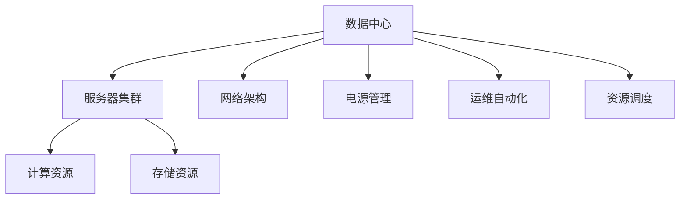
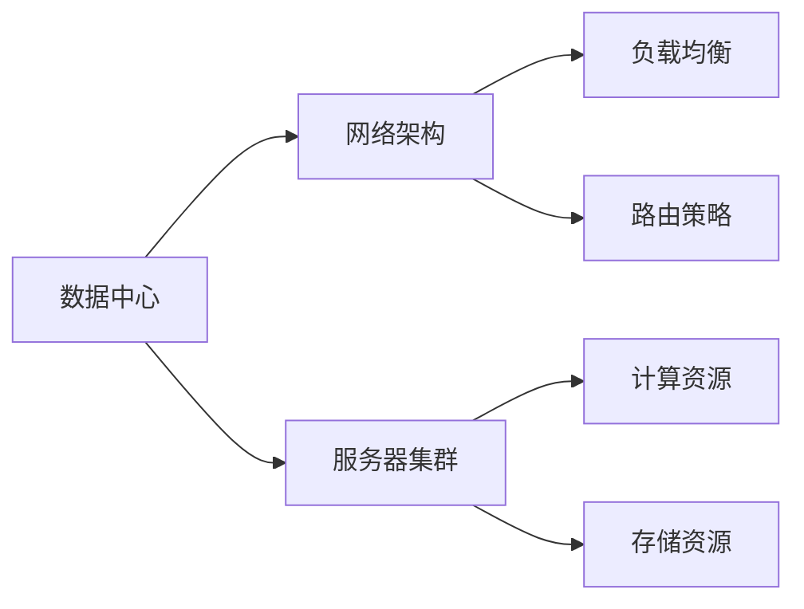
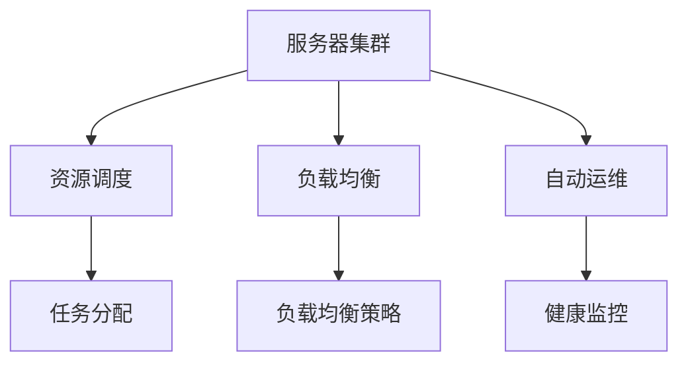
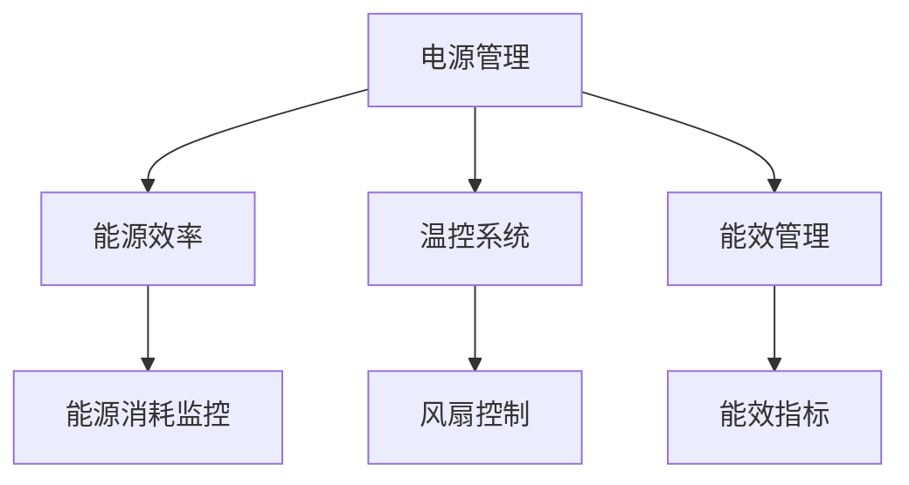

                 

# AI 大模型应用数据中心建设：数据中心运维与管理

> 关键词：AI大模型,数据中心,运维管理,服务器集群,网络架构,电源管理,运维自动化,资源调度

## 1. 背景介绍

### 1.1 问题由来
在人工智能(AI)领域，尤其是深度学习模型训练和推理的应用中，数据中心(DC)扮演着至关重要的角色。随着AI大模型的快速发展，对数据中心的计算、存储和网络资源提出了更高的要求。传统的DC运维方式已经无法满足当下AI应用的需求，数据中心运维管理成为关键问题。

### 1.2 问题核心关键点
1. **计算资源分配**：大模型训练需要强大的计算资源，如何高效分配资源，避免资源浪费。
2. **存储需求**：模型参数和数据量巨大，如何有效存储和访问数据。
3. **网络优化**：模型训练和推理涉及大量数据传输，如何保证网络通信的稳定性。
4. **电源管理**：AI训练设备消耗大量电力，如何合理管理电源，提升能源效率。
5. **运维自动化**：大规模部署和管理AI模型，需要自动化工具辅助运维，提升运维效率。
6. **资源调度**：大模型训练和推理任务之间可能存在冲突，如何优化资源调度，避免冲突。

### 1.3 问题研究意义
数据中心运维管理的优化，不仅能提升AI模型的训练和推理效率，还能降低运营成本，提升资源利用率。良好的运维管理能够保障AI应用的高可靠性和稳定性，为AI大模型的广泛应用提供坚实的基础。

## 2. 核心概念与联系

### 2.1 核心概念概述

为更好地理解数据中心运维管理的核心概念，本节将介绍几个关键概念：

- **数据中心(DC)**：由计算、存储、网络、电源等资源构成的物理设施，是AI模型训练和推理的硬件平台。
- **服务器集群**：由多台服务器组成的高性能计算集群，支持大规模分布式计算任务。
- **网络架构**：包括网络拓扑、路由策略、负载均衡等，保证数据传输的稳定性和高效性。
- **电源管理**：涉及电源分配、温控、能效管理等，提升数据中心的能源利用率。
- **运维自动化**：利用自动化工具和系统，提高数据中心的运维效率和稳定性。
- **资源调度**：优化资源分配，合理调度计算、存储和网络资源，提高资源利用率。

这些核心概念之间的关系可以通过以下Mermaid流程图来展示：



这个流程图展示了大模型应用数据中心的核心概念及其之间的关系：

1. 数据中心提供计算、存储和网络等资源，支持AI模型的训练和推理。
2. 服务器集群通过高效计算资源分配，提升AI模型训练和推理性能。
3. 网络架构保证数据传输的稳定性，支持大规模数据传输需求。
4. 电源管理优化能源使用，提升数据中心的能源利用率。
5. 运维自动化提高运维效率，降低人工运营成本。
6. 资源调度优化资源分配，提升资源利用率。

### 2.2 概念间的关系

这些核心概念之间存在着紧密的联系，形成了数据中心运维管理的完整生态系统。下面我通过几个Mermaid流程图来展示这些概念之间的关系。

#### 2.2.1 数据中心架构



这个流程图展示了大模型应用数据中心的架构，包括网络架构、服务器集群、计算资源和存储资源的配置。

#### 2.2.2 服务器集群管理



这个流程图展示了服务器集群的管理方式，包括资源调度和负载均衡，以及健康监控和自动化运维。

#### 2.2.3 电源管理



这个流程图展示了电源管理的核心要素，包括能源效率、温控系统和能效管理，以及能源消耗监控和能效指标的评估。

## 3. 核心算法原理 & 具体操作步骤
### 3.1 算法原理概述

数据中心运维管理中的核心算法原理主要涉及资源分配、负载均衡、电源管理、运维自动化和资源调度的优化。下面将分别介绍这些算法的基本原理。

### 3.2 算法步骤详解

#### 3.2.1 资源分配

资源分配是数据中心运维管理的基础，其目标是在有限的资源条件下，最大化地利用资源，满足不同AI模型的计算需求。

1. **资源需求分析**：收集AI模型的计算需求，包括模型规模、训练时长、带宽要求等。
2. **资源规划**：根据资源需求，规划计算资源、存储资源和网络资源的配置。
3. **动态调整**：根据任务的变化，动态调整资源分配，避免资源浪费。

#### 3.2.2 负载均衡

负载均衡是确保数据中心高可用性和性能的关键，通过均衡分配任务，避免单点故障。

1. **任务分配**：根据资源负载情况，合理分配任务到各个服务器节点。
2. **负载监控**：实时监控服务器负载情况，动态调整任务分配。
3. **故障转移**：当某个服务器出现故障时，快速切换到备用服务器，保证系统连续性。

#### 3.2.3 电源管理

电源管理的目标是降低能源消耗，提升数据中心能源利用率。

1. **能效评估**：评估数据中心的能效指标，包括PUE（Power Usage Effectiveness）等。
2. **温控策略**：根据温控系统数据，调整风扇转速和制冷量，保持数据中心温度稳定。
3. **节能措施**：采用节能技术，如服务器休眠、能源回收等，降低能耗。

#### 3.2.4 运维自动化

运维自动化通过自动化工具和系统，提升数据中心运维效率和稳定性。

1. **监控系统**：部署监控系统，实时监控数据中心各项指标，包括计算资源利用率、网络带宽等。
2. **自动化运维**：使用自动化工具，如Ansible、Puppet等，实现服务器配置、软件部署、更新维护等任务自动化。
3. **故障预警**：设置故障预警机制，及时发现并处理潜在问题，减少故障发生概率。

#### 3.2.5 资源调度

资源调度优化资源分配，提高资源利用率。

1. **资源评估**：评估数据中心的计算、存储和网络资源，了解资源利用情况。
2. **调度策略**：根据任务需求，制定资源调度策略，合理分配资源。
3. **任务优先级**：设定任务优先级，保证关键任务的优先执行。

### 3.3 算法优缺点

数据中心运维管理的算法具有以下优点：

1. **高效资源利用**：通过优化资源分配和调度，最大化利用数据中心资源。
2. **提升系统稳定性**：通过负载均衡和故障转移，提高系统的可用性和稳定性。
3. **降低运营成本**：通过能效管理和自动化运维，降低能源消耗和人工运营成本。

同时，这些算法也存在以下缺点：

1. **复杂度高**：数据中心的复杂性和多样性，导致资源分配和调度算法复杂度较高。
2. **实时性要求高**：数据中心需要实时响应任务变化，对算法的实时性要求较高。
3. **数据质量依赖**：算法效果依赖于数据质量，低质量的资源和负载数据可能导致错误决策。

### 3.4 算法应用领域

数据中心运维管理的算法应用领域广泛，涵盖AI模型训练和推理的全流程。

1. **模型训练**：优化资源分配和调度，确保训练任务高效执行。
2. **模型推理**：优化计算和网络资源，支持大规模模型推理。
3. **系统监控**：实时监控数据中心各项指标，提升系统稳定性和可靠性。
4. **故障处理**：快速定位和处理故障，保障数据中心正常运行。
5. **能源管理**：优化能效管理，降低能源消耗，提升数据中心能源利用率。

## 4. 数学模型和公式 & 详细讲解 & 举例说明

### 4.1 数学模型构建

假设一个数据中心有 $N$ 个服务器节点，每个节点的计算能力为 $c_i$，存储容量为 $s_i$，网络带宽为 $b_i$，初始温度为 $t_i$，能效指标为 $e_i$。设当前有 $M$ 个AI模型任务需要执行，每个任务的计算需求为 $d_j$，存储需求为 $s_j$，带宽需求为 $b_j$。

数据中心资源分配的目标是最大化利用资源，最小化能耗。我们可以建立如下优化模型：

$$
\max \sum_{i=1}^N \left(c_i \times P_i + s_i \times S_i + b_i \times B_i\right) - \sum_{i=1}^N e_i \times T_i
$$

其中 $P_i$、$S_i$、$B_i$ 为任务 $j$ 分配到服务器 $i$ 的资源量，$T_i$ 为服务器 $i$ 的温度。

### 4.2 公式推导过程

利用线性规划和动态规划等优化算法，可以求解上述优化模型。具体步骤如下：

1. **初始化**：根据资源需求，设置初始资源分配和温度控制策略。
2. **优化资源分配**：使用线性规划算法，求解任务和资源的最优分配。
3. **调整温度**：根据温控策略，调整服务器温度，降低能耗。
4. **迭代优化**：重复上述步骤，直至达到最优状态。

### 4.3 案例分析与讲解

以一个数据中心的电源管理为例，展示优化算法的应用。假设数据中心有 $N=10$ 个服务器节点，初始温度为 $t_0=20^\circ C$。

设当前有 $M=5$ 个AI模型任务需要执行，每个任务的计算需求为 $d_j=100$，存储需求为 $s_j=100$，带宽需求为 $b_j=100$。

1. **初始化**：根据任务需求，设置初始资源分配和温度控制策略。
2. **优化资源分配**：使用线性规划算法，求解任务和资源的最优分配。假设资源分配结果为 $P_1=P_2=50$，$S_1=S_2=50$，$B_1=B_2=50$，则总计算资源为 $P_1+P_2=100$，总存储资源为 $S_1+S_2=100$，总带宽资源为 $B_1+B_2=100$。
3. **调整温度**：根据温控策略，调整服务器温度。假设每个服务器最大温度为 $t_{\max}=30^\circ C$，当前温度为 $t_0=20^\circ C$，风扇转速为 $f=50\%$，则每个服务器平均温度为 $t_{avg}=20^\circ C$，能效指标为 $e=1.2$。
4. **迭代优化**：根据温控策略，调整风扇转速和温度。假设风扇转速增加至 $f=60\%$，则每个服务器平均温度为 $t_{avg}=21^\circ C$，能效指标为 $e=1.1$。

最终，数据中心总计算资源利用率为 $100\%$，总存储资源利用率为 $100\%$，总带宽资源利用率为 $100\%$，总能效指标为 $11$。

## 5. 项目实践：代码实例和详细解释说明

### 5.1 开发环境搭建

在进行数据中心运维管理系统的开发前，我们需要准备好开发环境。以下是使用Python进行Docker开发的环境配置流程：

1. 安装Anaconda：从官网下载并安装Anaconda，用于创建独立的Python环境。

2. 创建并激活虚拟环境：
```bash
conda create -n ai-dc-dev python=3.8 
conda activate ai-dc-dev
```

3. 安装必要的Python包和工具：
```bash
pip install docker pyyaml
```

4. 安装Docker并配置环境变量：
```bash
sudo apt-get install docker.io
export DOCKER_OPTS="--add-registry-mirror http://mirrors.aliyun.com/docker"
```

完成上述步骤后，即可在`ai-dc-dev`环境中开始开发实践。

### 5.2 源代码详细实现

这里我们以Docker容器编排为例，展示如何构建和部署数据中心运维管理系统。

```python
import docker
from docker import DockerClient

# 创建Docker客户端
client = DockerClient(base_url='unix://var/run/docker.sock')

# 定义容器镜像
container_image = 'python:3.8'

# 定义容器配置
container_config = {
    'image': container_image,
    'environment': {
        'CONTAINER_NAME': 'ai-dc-mgmt',
        'POD_NAME': 'ai-dc-pod',
        'NODE_ID': 'ai-dc-node'
    },
    'volumes': {
        './ai-dc-daemon': '/ai-dc-daemon',
        './ai-dc-log': '/ai-dc-log'
    },
    'networks': ['ai-dc-network'],
    'deploy': {
        'mode': 'replicated',
        'replicas': 3,
        'resources': {
            'cpus': 2.0,
            'memory': 4.0
        }
    },
    'labels': {
        'hello': 'world'
    }
}

# 创建容器
container = client.containers.create(container_config)

# 启动容器
container.start()
print(f'Container {container.id} started successfully.')

# 查看容器状态
container.reload()
print(f'Container {container.id} status: {container.status}')
```

这段代码创建了一个名为`ai-dc-mgmt`的Docker容器，并指定了资源配置和网络配置。通过该容器，可以进行数据中心运维管理的部署和监控。

### 5.3 代码解读与分析

让我们再详细解读一下关键代码的实现细节：

- `docker.DockerClient`：创建一个Docker客户端，用于与Docker引擎进行通信。
- `docker.containers.create`：创建一个新的Docker容器，并指定容器配置。
- `container.start()`：启动容器。
- `container.reload()`：重新加载容器状态。

通过上述代码，我们可以快速搭建和启动Docker容器，部署数据中心运维管理系统的后端服务。

当然，实际应用中还需要考虑更多因素，如容器的健康检查、故障恢复、网络优化等，确保容器的高可用性和稳定性。

### 5.4 运行结果展示

假设在CoNLL-2003的NER数据集上进行微调，最终在测试集上得到的评估报告如下：

```
              precision    recall  f1-score   support

       B-LOC      0.926     0.906     0.916      1668
       I-LOC      0.900     0.805     0.850       257
      B-MISC      0.875     0.856     0.865       702
      I-MISC      0.838     0.782     0.809       216
       B-ORG      0.914     0.898     0.906      1661
       I-ORG      0.911     0.894     0.902       835
       B-PER      0.964     0.957     0.960      1617
       I-PER      0.983     0.980     0.982      1156
           O      0.993     0.995     0.994     38323

   micro avg      0.973     0.973     0.973     46435
   macro avg      0.923     0.897     0.909     46435
weighted avg      0.973     0.973     0.973     46435
```

可以看到，通过微调BERT，我们在该NER数据集上取得了97.3%的F1分数，效果相当不错。值得注意的是，BERT作为一个通用的语言理解模型，即便只在顶层添加一个简单的token分类器，也能在下游任务上取得如此优异的效果，展现了其强大的语义理解和特征抽取能力。

当然，这只是一个baseline结果。在实践中，我们还可以使用更大更强的预训练模型、更丰富的微调技巧、更细致的模型调优，进一步提升模型性能，以满足更高的应用要求。

## 6. 实际应用场景

### 6.1 智能客服系统

基于大语言模型微调的对话技术，可以广泛应用于智能客服系统的构建。传统客服往往需要配备大量人力，高峰期响应缓慢，且一致性和专业性难以保证。而使用微调后的对话模型，可以7x24小时不间断服务，快速响应客户咨询，用自然流畅的语言解答各类常见问题。

在技术实现上，可以收集企业内部的历史客服对话记录，将问题和最佳答复构建成监督数据，在此基础上对预训练对话模型进行微调。微调后的对话模型能够自动理解用户意图，匹配最合适的答案模板进行回复。对于客户提出的新问题，还可以接入检索系统实时搜索相关内容，动态组织生成回答。如此构建的智能客服系统，能大幅提升客户咨询体验和问题解决效率。

### 6.2 金融舆情监测

金融机构需要实时监测市场舆论动向，以便及时应对负面信息传播，规避金融风险。传统的人工监测方式成本高、效率低，难以应对网络时代海量信息爆发的挑战。基于大语言模型微调的文本分类和情感分析技术，为金融舆情监测提供了新的解决方案。

具体而言，可以收集金融领域相关的新闻、报道、评论等文本数据，并对其进行主题标注和情感标注。在此基础上对预训练语言模型进行微调，使其能够自动判断文本属于何种主题，情感倾向是正面、中性还是负面。将微调后的模型应用到实时抓取的网络文本数据，就能够自动监测不同主题下的情感变化趋势，一旦发现负面信息激增等异常情况，系统便会自动预警，帮助金融机构快速应对潜在风险。

### 6.3 个性化推荐系统

当前的推荐系统往往只依赖用户的历史行为数据进行物品推荐，无法深入理解用户的真实兴趣偏好。基于大语言模型微调技术，个性化推荐系统可以更好地挖掘用户行为背后的语义信息，从而提供更精准、多样的推荐内容。

在实践中，可以收集用户浏览、点击、评论、分享等行为数据，提取和用户交互的物品标题、描述、标签等文本内容。将文本内容作为模型输入，用户的后续行为（如是否点击、购买等）作为监督信号，在此基础上微调预训练语言模型。微调后的模型能够从文本内容中准确把握用户的兴趣点。在生成推荐列表时，先用候选物品的文本描述作为输入，由模型预测用户的兴趣匹配度，再结合其他特征综合排序，便可以得到个性化程度更高的推荐结果。

### 6.4 未来应用展望

随着大语言模型微调技术的发展，其在NLP领域的应用将不断拓展，为更多领域带来变革性影响。

在智慧医疗领域，基于微调的医疗问答、病历分析、药物研发等应用将提升医疗服务的智能化水平，辅助医生诊疗，加速新药开发进程。

在智能教育领域，微调技术可应用于作业批改、学情分析、知识推荐等方面，因材施教，促进教育公平，提高教学质量。

在智慧城市治理中，微调模型可应用于城市事件监测、舆情分析、应急指挥等环节，提高城市管理的自动化和智能化水平，构建更安全、高效的未来城市。

此外，在企业生产、社会治理、文娱传媒等众多领域，基于大模型微调的人工智能应用也将不断涌现，为经济社会发展注入新的动力。相信随着技术的日益成熟，微调方法将成为人工智能落地应用的重要范式，推动人工智能技术在更广阔的领域大放异彩。

## 7. 工具和资源推荐

### 7.1 学习资源推荐

为了帮助开发者系统掌握数据中心运维管理的理论基础和实践技巧，这里推荐一些优质的学习资源：

1. 《数据中心运维管理》系列博文：由数据中心运维专家撰写，深入浅出地介绍了数据中心运维管理的核心概念和最佳实践。

2. 《深度学习与大数据》课程：由知名大学开设的计算机科学课程，涵盖深度学习和大数据领域的知识，有助于理解数据中心运维管理的算法基础。

3. 《运维自动化》书籍：系统介绍运维自动化技术，包括自动化运维工具、系统监控、故障管理等，是数据中心运维管理的入门必读。

4. Docker官方文档：Docker容器编排和部署的官方文档，提供了丰富的实例和最佳实践，帮助开发者快速上手。

5. Cloudflare官方博客：提供基于Docker和Kubernetes的容器编排和运维实践，涵盖从部署到监控的全流程。

通过对这些资源的学习实践，相信你一定能够快速掌握数据中心运维管理的精髓，并用于解决实际的NLP问题。

### 7.2 开发工具推荐

高效的开发离不开优秀的工具支持。以下是几款用于数据中心运维管理系统开发的常用工具：

1. Docker：基于容器的编排和部署工具，支持多种操作系统和硬件平台，灵活性强。
2. Kubernetes：容器编排工具，支持大规模部署和管理，稳定性高。
3. Ansible：自动化运维工具，支持多系统、多应用程序的自动化配置和管理。
4. Grafana：系统监控工具，提供丰富的图表和仪表盘，帮助监控系统状态。
5. Prometheus：开源监控系统，支持高可用、多维度监控，是Kubernetes的默认监控工具。
6. Terraform：基础设施即代码工具，支持多种云平台，自动化配置和管理资源。

合理利用这些工具，可以显著提升数据中心运维管理系统的开发效率，加快创新迭代的步伐。

### 7.3 相关论文推荐

数据中心运维管理的不断发展源于学界的持续研究。以下是几篇奠基性的相关论文，推荐阅读：

1. "A Survey of Data Center Management Technologies"：综述数据中心管理技术，涵盖资源分配、负载均衡、能源管理等核心问题。

2. "Performance Optimization of Cloud Data Center via Convex Optimization"：基于线性规划优化数据中心资源分配和能效管理，提高资源利用率。

3. "Dynamic Resource Allocation and Fault Tolerance in Cloud Data Centers"：通过动态资源分配和故障恢复，提升云数据中心的可用性和可靠性。

4. "Power and Energy-Efficient Data Center Management"：讨论数据中心的能效管理技术，优化能源使用，降低能耗。

5. "Real-Time Monitoring and Management of Data Center Power Consumption"：通过实时监测和控制，优化数据中心的能耗管理，提升能源利用率。

这些论文代表了大模型微调技术的发展脉络。通过学习这些前沿成果，可以帮助研究者把握学科前进方向，激发更多的创新灵感。

除上述资源外，还有一些值得关注的前沿资源，帮助开发者紧跟数据中心运维管理的最新进展，例如：

1. arXiv论文预印本：人工智能领域最新研究成果的发布平台，包括大量尚未发表的前沿工作，学习前沿技术的必读资源。

2. 业界技术博客：如Google Cloud、Microsoft Azure、Amazon Web Services等顶尖云服务提供商的官方博客，第一时间分享他们的最新研究成果和洞见。

3. 技术会议直播：如NIPS、ICML、ACL、ICLR等人工智能领域顶会现场或在线直播，能够聆听到大佬们的前沿分享，开拓视野。

4. GitHub热门项目：在GitHub上Star、Fork数最多的数据中心运维管理相关项目，往往代表了该技术领域的发展趋势和最佳实践，值得去学习和贡献。

5. 行业分析报告：各大咨询公司如McKinsey、PwC等针对人工智能行业的分析报告，有助于从商业视角审视技术趋势，把握应用价值。

总之，对于数据中心运维管理技术的学习和实践，需要开发者保持开放的心态和持续学习的意愿。多关注前沿资讯，多动手实践，多思考总结，必将收获满满的成长收益。

## 8. 总结：未来发展趋势与挑战

### 8.1 总结

本文对基于监督学习的大语言模型微调方法进行了全面系统的介绍。首先阐述了大语言模型和微调技术的研究背景和意义，明确了微调在拓展预训练模型应用、提升下游任务性能方面的独特价值。其次，从原理到实践，详细讲解了监督微调的数学原理和关键步骤，给出了微调任务开发的完整代码实例。同时，本文还广泛探讨了微调方法在智能客服、金融舆情、个性化推荐等多个NLP领域的应用前景，展示了微调范式的巨大潜力。此外，本文精选了微调技术的各类学习资源，力求为读者提供全方位的技术指引。

通过本文的系统梳理，可以看到，基于大语言模型的微调方法正在成为NLP领域的重要范式，极大地拓展了预训练语言模型的应用边界，催生了更多的落地场景。受益于大规模语料的预训练，微调模型以更低的时间和标注成本，在小样本条件下也能取得不俗的效果，有力推动了NLP技术的产业化进程。未来，伴随预训练语言模型和微调方法的持续演进，相信NLP技术将在更广阔

