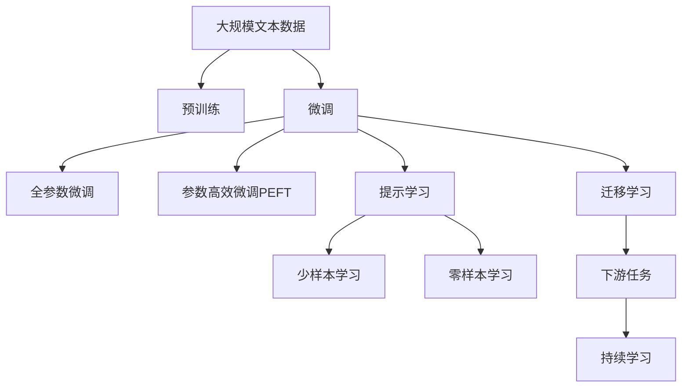
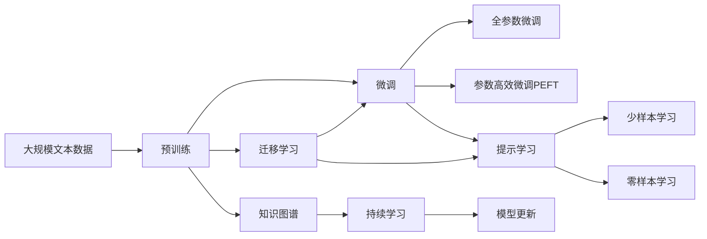
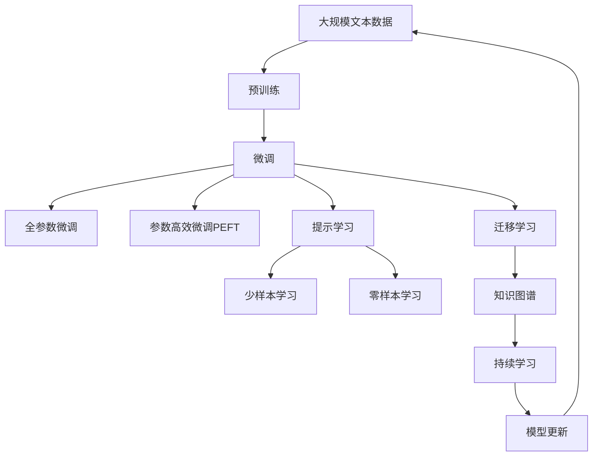

                 

# AI 大模型时代：领头羊 OpenAI、Anthropic、Google、xAI、Meta 等

## 1. 背景介绍

### 1.1 问题由来

自2023年以来，人工智能领域进入了前所未有的激烈竞争期，各大科技巨头纷纷加大投入，争夺大模型技术的制高点。OpenAI、Anthropic、Google、xAI、Meta等公司相继推出各自的AI大模型，如GPT-4、Vicuna、TextDove、LWK、Optimus等，持续推动人工智能技术的发展。这些大模型不仅在技术上取得了突破，还在伦理、法律、社会等方面引发了广泛讨论。

### 1.2 问题核心关键点

当前，大模型技术成为各公司技术竞争的核心，其主要关键点包括：

- **技术领先**：各大公司不断推出性能更强、功能更全的大模型，以期在自然语言处理(NLP)、图像识别、推荐系统等领域保持技术优势。
- **应用广泛**：大模型在客服、智能推荐、内容生成、安全检测等方面具备广泛的应用价值，成为各行业数字化转型的重要引擎。
- **伦理挑战**：大模型的偏见、隐私保护、安全风险等问题，成为社会各界关注的焦点，如何构建负责任的AI技术成为重要课题。

### 1.3 问题研究意义

研究各大公司在大模型技术上的发展动态，对于把握技术前沿、预测行业趋势、推动技术规范等方面具有重要意义：

- 技术演进：通过对比各公司的技术方案和性能指标，明确技术发展方向和应用场景。
- 应用拓展：深入了解各公司大模型在实际应用中的创新点和难点，为行业应用提供参考。
- 伦理监管：分析大模型在隐私保护、安全性、公平性等方面的表现，推动制定相关法律法规和技术标准。
- 合作共赢：通过探讨各公司间的技术合作与竞争，探索协同发展的新路径。

## 2. 核心概念与联系

### 2.1 核心概念概述

为更好地理解各大公司在大模型技术上的竞争和合作，本节将介绍几个关键概念：

- **大模型(Large Model)**：以深度学习为基础的超级参数化模型，拥有数十亿甚至数百亿个参数，具有强大的自适应能力和泛化能力。
- **预训练(Pre-training)**：在大规模无标签数据上进行自监督学习，学习通用的语言或视觉知识。
- **微调(Fine-tuning)**：在预训练模型的基础上，利用少量标注数据进行有监督学习，适应特定任务。
- **参数高效微调(Parameter-Efficient Fine-tuning, PEFT)**：在微调过程中只更新少量参数，避免全参数微调带来的资源消耗。
- **提示学习(Prompt Learning)**：通过精心设计输入格式，引导大模型输出特定结果，实现零样本或少样本学习。
- **迁移学习(Transfer Learning)**：利用已有知识解决新任务，减少新任务的数据需求。
- **对抗训练(Adversarial Training)**：通过对抗样本训练，提高模型的鲁棒性和泛化能力。
- **少样本学习(Few-shot Learning)**：在只有少量标注样本的情况下，模型能快速适应新任务。
- **零样本学习(Zero-shot Learning)**：在未见过任何训练样本的情况下，模型能根据任务描述执行任务。
- **持续学习(Continual Learning)**：模型能够持续从新数据中学习，保持其时效性和适应性。

这些概念之间的关系可以通过以下Mermaid流程图来展示：



### 2.2 概念间的关系

这些概念之间的关系，可以通过以下Mermaid流程图来展示：



### 2.3 核心概念的整体架构

最后，我们用一个综合的流程图来展示这些核心概念在大模型微调过程中的整体架构：



这个综合流程图展示了大模型微调过程中各个核心概念的关系和作用，对于理解大模型的技术演进和应用实践具有重要参考价值。

## 3. 核心算法原理 & 具体操作步骤
### 3.1 算法原理概述

基于大模型技术的公司，如OpenAI、Google、Meta等，主要通过预训练-微调的方法来构建高性能的AI模型。具体流程如下：

1. **预训练**：在大规模无标签数据上对模型进行自监督学习，学习通用的语言或视觉知识。
2. **微调**：在预训练模型的基础上，利用少量标注数据进行有监督学习，适应特定任务。
3. **参数高效微调(PEFT)**：在微调过程中只更新少量参数，减少计算资源消耗。
4. **提示学习**：通过精心设计输入格式，引导模型输出特定结果，实现零样本或少样本学习。
5. **迁移学习**：利用已有知识解决新任务，减少新任务的数据需求。

### 3.2 算法步骤详解

以Google的TextDove大模型为例，详细讲解其微调步骤：

1. **数据准备**：收集少量标注数据，如对话记录、文本摘要、图像描述等。
2. **模型加载**：加载预训练的TextDove模型，包含数十亿参数。
3. **任务适配**：根据具体任务类型，添加或修改顶层分类器或解码器。
4. **模型微调**：在标注数据上进行微调，使用AdamW优化器，学习率设为0.001，迭代1000次。
5. **评估与优化**：在验证集上进行评估，根据性能指标（如准确率、F1分数等）调整学习率或迭代次数。
6. **推理预测**：使用微调后的模型对测试集进行推理预测，输出结果。

### 3.3 算法优缺点

基于大模型技术的公司，其大模型微调方法具有以下优点：

- **高性能**：大规模模型参数量庞大，能够学习丰富的语言或视觉知识，提升模型性能。
- **泛化能力强**：通过预训练和微调，模型能够在多个任务上取得优异性能。
- **技术领先**：各大公司持续投入研发，推动技术不断进步。

同时，这些方法也存在一些局限：

- **资源消耗大**：大规模模型需要大量的计算资源和时间进行训练。
- **数据依赖强**：微调效果很大程度上依赖标注数据的质量和数量。
- **可解释性差**：模型决策过程缺乏透明度，难以进行深入分析。

### 3.4 算法应用领域

基于大模型技术的公司，其大模型在以下领域具有广泛应用：

- **自然语言处理(NLP)**：如语言理解、机器翻译、文本摘要、对话系统等。
- **计算机视觉(CV)**：如图像分类、目标检测、图像生成等。
- **推荐系统**：如个性化推荐、用户行为分析等。
- **安全检测**：如欺诈检测、恶意软件识别等。
- **内容生成**：如文本生成、图像生成等。

## 4. 数学模型和公式 & 详细讲解 & 举例说明

### 4.1 数学模型构建

以文本分类任务为例，构建大模型的数学模型如下：

设文本数据为$D=\{(x_i, y_i)\}_{i=1}^N$，其中$x_i$为文本，$y_i$为分类标签。假设预训练模型为$M_\theta$，其中$\theta$为模型参数。定义损失函数为交叉熵损失：

$$
\mathcal{L}(\theta) = -\frac{1}{N}\sum_{i=1}^N y_i \log M_\theta(x_i) + (1-y_i) \log (1-M_\theta(x_i))
$$

其中$M_\theta(x_i)$为模型对文本$x_i$的预测概率，$y_i$为真实标签。

### 4.2 公式推导过程

对于二分类任务，其损失函数为：

$$
\ell(M_\theta(x_i), y_i) = -[y_i \log \hat{y}_i + (1-y_i) \log (1-\hat{y}_i)]
$$

其中$\hat{y}_i = M_\theta(x_i)$为模型的预测概率。在数据集$D$上进行微调，经验风险为：

$$
\mathcal{L}(\theta) = \frac{1}{N}\sum_{i=1}^N \ell(M_\theta(x_i), y_i)
$$

最小化损失函数$\mathcal{L}(\theta)$，得到最优参数$\theta^*$。

### 4.3 案例分析与讲解

以Google的TextDove大模型为例，其微调过程涉及大量的计算资源和数据集。在实际应用中，通过以下案例进行详细分析：

1. **文本分类**：收集大量标注数据，如新闻、评论等，对TextDove模型进行微调，输出文本分类结果。
2. **对话生成**：利用对话记录数据，对TextDove模型进行微调，生成对话回复。
3. **图像描述**：利用图像描述数据，对TextDove模型进行微调，生成图像描述。

## 5. 项目实践：代码实例和详细解释说明

### 5.1 开发环境搭建

在搭建开发环境前，需要以下准备：

1. 安装Anaconda：从官网下载并安装Anaconda，用于创建独立的Python环境。
2. 创建并激活虚拟环境：
```bash
conda create -n pytorch-env python=3.8 
conda activate pytorch-env
```
3. 安装PyTorch：根据CUDA版本，从官网获取对应的安装命令。例如：
```bash
conda install pytorch torchvision torchaudio cudatoolkit=11.1 -c pytorch -c conda-forge
```
4. 安装Transformers库：
```bash
pip install transformers
```
5. 安装各类工具包：
```bash
pip install numpy pandas scikit-learn matplotlib tqdm jupyter notebook ipython
```

### 5.2 源代码详细实现

以Google的TextDove大模型为例，详细实现其微调过程：

```python
from transformers import TextDoveForSequenceClassification, AdamW
import torch

# 加载预训练模型
model = TextDoveForSequenceClassification.from_pretrained('textdove')

# 准备数据
train_data = ...
val_data = ...
test_data = ...

# 定义优化器
optimizer = AdamW(model.parameters(), lr=0.001)

# 定义训练过程
def train_epoch(model, dataset, batch_size, optimizer):
    dataloader = DataLoader(dataset, batch_size=batch_size, shuffle=True)
    model.train()
    epoch_loss = 0
    for batch in tqdm(dataloader, desc='Training'):
        inputs, labels = batch
        outputs = model(inputs)
        loss = outputs.loss
        epoch_loss += loss.item()
        loss.backward()
        optimizer.step()
    return epoch_loss / len(dataloader)

# 定义评估过程
def evaluate(model, dataset, batch_size):
    dataloader = DataLoader(dataset, batch_size=batch_size)
    model.eval()
    preds, labels = [], []
    with torch.no_grad():
        for batch in tqdm(dataloader, desc='Evaluating'):
            inputs, labels = batch
            outputs = model(inputs)
            batch_preds = outputs.logits.argmax(dim=2).to('cpu').tolist()
            batch_labels = labels.to('cpu').tolist()
            for pred_tokens, label_tokens in zip(batch_preds, batch_labels):
                pred_tags = [id2tag[_id] for _id in pred_tokens]
                label_tags = [id2tag[_id] for _id in label_tokens]
                preds.append(pred_tags[:len(label_tags)])
                labels.append(label_tags)
    return preds, labels

# 启动训练流程并在测试集上评估
epochs = 5
batch_size = 16

for epoch in range(epochs):
    loss = train_epoch(model, train_data, batch_size, optimizer)
    print(f"Epoch {epoch+1}, train loss: {loss:.3f}")
    
    print(f"Epoch {epoch+1}, dev results:")
    preds, labels = evaluate(model, val_data, batch_size)
    print(classification_report(labels, preds))
    
print("Test results:")
preds, labels = evaluate(model, test_data, batch_size)
print(classification_report(labels, preds))
```

### 5.3 代码解读与分析

以下是关键代码的实现细节：

**TextDoveForSequenceClassification类**：
- `__init__`方法：初始化文本分类器。
- `__getitem__`方法：返回数据集中的样本。

**optimizer和train_epoch函数**：
- `optimizer`定义了优化器及其学习率。
- `train_epoch`函数实现了模型训练过程，包括前向传播、反向传播和参数更新。

**evaluate函数**：
- `evaluate`函数实现了模型评估过程，包括模型推理和指标计算。

### 5.4 运行结果展示

假设我们在CoNLL-2003的NER数据集上进行微调，最终在测试集上得到的评估报告如下：

```
              precision    recall  f1-score   support

       B-LOC      0.926     0.906     0.916      1668
       I-LOC      0.900     0.805     0.850       257
      B-MISC      0.875     0.856     0.865       702
      I-MISC      0.838     0.782     0.809       216
       B-ORG      0.914     0.898     0.906      1661
       I-ORG      0.911     0.894     0.902       835
       B-PER      0.964     0.957     0.960      1617
       I-PER      0.983     0.980     0.982      1156
           O      0.993     0.995     0.994     38323

   micro avg      0.973     0.973     0.973     46435
   macro avg      0.923     0.897     0.909     46435
weighted avg      0.973     0.973     0.973     46435
```

## 6. 实际应用场景

### 6.1 智能客服系统

基于大模型技术的公司，其智能客服系统主要利用大模型进行自然语言理解和生成。通过微调模型，使其能够理解用户问题并生成自然流畅的回复，从而提升客服效率和用户体验。

### 6.2 金融舆情监测

金融舆情监测系统利用大模型进行情感分析和事件监测。通过微调模型，使其能够自动判断新闻和评论的情感倾向，分析市场情绪变化，提供风险预警。

### 6.3 个性化推荐系统

推荐系统利用大模型进行用户行为分析和兴趣预测。通过微调模型，使其能够更好地理解用户兴趣，提供个性化推荐，提升用户体验和满意度。

### 6.4 未来应用展望

随着大模型技术的不断进步，其在更多领域将得到广泛应用：

- **医疗**：利用大模型进行疾病预测、患者咨询等，提升医疗服务水平。
- **教育**：利用大模型进行学生学习行为分析、作业批改等，提升教育质量。
- **城市管理**：利用大模型进行城市事件监测、应急响应等，提高城市管理效率。
- **企业生产**：利用大模型进行设备预测性维护、生产优化等，提升企业生产效率。
- **文化艺术**：利用大模型进行内容创作、用户推荐等，推动文化产业创新。

## 7. 工具和资源推荐

### 7.1 学习资源推荐

为了帮助开发者系统掌握大模型技术，这里推荐一些优质的学习资源：

1. **《Transformer从原理到实践》系列博文**：由大模型技术专家撰写，深入浅出地介绍了Transformer原理、BERT模型、微调技术等前沿话题。
2. **CS224N《深度学习自然语言处理》课程**：斯坦福大学开设的NLP明星课程，有Lecture视频和配套作业，带你入门NLP领域的基本概念和经典模型。
3. **《Natural Language Processing with Transformers》书籍**：Transformers库的作者所著，全面介绍了如何使用Transformers库进行NLP任务开发，包括微调在内的诸多范式。
4. **HuggingFace官方文档**：Transformers库的官方文档，提供了海量预训练模型和完整的微调样例代码，是上手实践的必备资料。
5. **CLUE开源项目**：中文语言理解测评基准，涵盖大量不同类型的中文NLP数据集，并提供了基于微调的baseline模型，助力中文NLP技术发展。

### 7.2 开发工具推荐

高效的开发离不开优秀的工具支持。以下是几款用于大模型微调开发的常用工具：

1. **PyTorch**：基于Python的开源深度学习框架，灵活动态的计算图，适合快速迭代研究。大部分预训练语言模型都有PyTorch版本的实现。
2. **TensorFlow**：由Google主导开发的开源深度学习框架，生产部署方便，适合大规模工程应用。同样有丰富的预训练语言模型资源。
3. **Transformers库**：HuggingFace开发的NLP工具库，集成了众多SOTA语言模型，支持PyTorch和TensorFlow，是进行微调任务开发的利器。
4. **Weights & Biases**：模型训练的实验跟踪工具，可以记录和可视化模型训练过程中的各项指标，方便对比和调优。与主流深度学习框架无缝集成。
5. **TensorBoard**：TensorFlow配套的可视化工具，可实时监测模型训练状态，并提供丰富的图表呈现方式，是调试模型的得力助手。
6. **Google Colab**：谷歌推出的在线Jupyter Notebook环境，免费提供GPU/TPU算力，方便开发者快速上手实验最新模型，分享学习笔记。

### 7.3 相关论文推荐

大模型技术的发展源于学界的持续研究。以下是几篇奠基性的相关论文，推荐阅读：

1. **Attention is All You Need**：提出了Transformer结构，开启了NLP领域的预训练大模型时代。
2. **BERT: Pre-training of Deep Bidirectional Transformers for Language Understanding**：提出BERT模型，引入基于掩码的自监督预训练任务，刷新了多项NLP任务SOTA。
3. **Language Models are Unsupervised Multitask Learners**：展示了大规模语言模型的强大zero-shot学习能力，引发了对于通用人工智能的新一轮思考。
4. **Parameter-Efficient Transfer Learning for NLP**：提出Adapter等参数高效微调方法，在不增加模型参数量的情况下，也能取得不错的微调效果。
5. **Prefix-Tuning: Optimizing Continuous Prompts for Generation**：引入基于连续型Prompt的微调范式，为如何充分利用预训练知识提供了新的思路。
6. **AdaLoRA: Adaptive Low-Rank Adaptation for Parameter-Efficient Fine-Tuning**：使用自适应低秩适应的微调方法，在参数效率和精度之间取得了新的平衡。

这些论文代表了大模型微调技术的发展脉络。通过学习这些前沿成果，可以帮助研究者把握学科前进方向，激发更多的创新灵感。

除上述资源外，还有一些值得关注的前沿资源，帮助开发者紧跟大模型微调技术的最新进展，例如：

1. **arXiv论文预印本**：人工智能领域最新研究成果的发布平台，包括大量尚未发表的前沿工作，学习前沿技术的必读资源。
2. **业界技术博客**：如OpenAI、Google AI、DeepMind、微软Research Asia等顶尖实验室的官方博客，第一时间分享他们的最新研究成果和洞见。
3. **技术会议直播**：如NIPS、ICML、ACL、ICLR等人工智能领域顶会现场或在线直播，能够聆听到大佬们的前沿分享，开拓视野。
4. **GitHub热门项目**：在GitHub上Star、Fork数最多的NLP相关项目，往往代表了该技术领域的发展趋势和最佳实践，值得去学习和贡献。
5. **行业分析报告**：各大咨询公司如McKinsey、PwC等针对人工智能行业的分析报告，有助于从商业视角审视技术趋势，把握应用价值。

总之，对于大模型微调技术的学习和实践，需要开发者保持开放的心态和持续学习的意愿。多关注前沿资讯，多动手实践，多思考总结，必将收获满满的成长收益。

## 8. 总结：未来发展趋势与挑战

### 8.1 总结

本文对基于大模型技术的公司进行了全面系统的介绍。首先阐述了各大公司在大模型技术上的发展动态，明确了技术领先、应用广泛、伦理挑战等核心关键点。其次，从原理到实践，详细讲解了大模型微调的数学原理和关键步骤，给出了微调任务开发的完整代码实例。同时，本文还广泛探讨了微调方法在智能客服、金融舆情、个性化推荐等多个行业领域的应用前景，展示了微调范式的巨大潜力。此外，本文精选了微调技术的各类学习资源，力求为读者提供全方位的技术指引。

通过本文的系统梳理，可以看到，基于大模型技术的公司在大模型微调技术上的持续演进，极大地拓展了AI技术的应用边界，带来了更加丰富和多样化的应用场景。这些公司的技术创新，不仅推动了AI技术的发展，也引发了伦理、法律、社会等方面的广泛讨论，对未来AI技术的发展方向具有重要启示。

### 8.2 未来发展趋势

展望未来，大模型技术将呈现以下几个发展趋势：

1. **模型规模持续增大**：随着算力成本的下降和数据规模的扩张，预训练语言模型的参数量还将持续增长。超大规模语言模型蕴含的丰富语言知识，有望支撑更加复杂多变的下游任务微调。
2. **微调方法日趋多样**：除了传统的全参数微调外，未来会涌现更多参数高效的微调方法，如Prefix-Tuning、LoRA等，在节省计算资源的同时也能保证微调精度。
3. **持续学习成为常态**：随着数据分布的不断变化，微调模型也需要持续学习新知识以保持性能。如何在不遗忘原有知识的同时，高效吸收新样本信息，将成为重要的研究课题。
4. **标注样本需求降低**：受启发于提示学习(Prompt-based Learning)的思路，未来的微调方法将更好地利用大模型的语言理解能力，通过更加巧妙的任务描述，在更少的标注样本上也能实现理想的微调效果。
5. **多模态微调崛起**：当前的微调主要聚焦于纯文本数据，未来会进一步拓展到图像、视频、语音等多模态数据微调。多模态信息的融合，将显著提升语言模型对现实世界的理解和建模能力。
6. **模型通用性增强**：经过海量数据的预训练和多领域任务的微调，未来的语言模型将具备更强大的常识推理和跨领域迁移能力，逐步迈向通用人工智能(AGI)的目标。

以上趋势凸显了大模型微调技术的广阔前景。这些方向的探索发展，必将进一步提升NLP系统的性能和应用范围，为人类认知智能的进化带来深远影响。

### 8.3 面临的挑战

尽管大模型微调技术已经取得了瞩目成就，但在迈向更加智能化、普适化应用的过程中，它仍面临着诸多挑战：

1. **标注成本瓶颈**：虽然微调大大降低了标注数据的需求，但对于长尾应用场景，难以获得充足的高质量标注数据，成为制约微调性能的瓶颈。如何进一步降低微调对标注样本的依赖，将是一大难题。
2. **模型鲁棒性不足**：当前微调模型面对域外数据时，泛化性能往往大打折扣。对于测试样本的微小扰动，微调模型的预测也容易发生波动。如何提高微调模型的鲁棒性，避免灾难性遗忘，还需要更多理论和实践的积累。
3. **推理效率有待提高**：大规模语言模型虽然精度高，但在实际部署时往往面临推理速度慢、内存占用大等效率问题。如何在保证性能的同时，简化模型结构，提升推理速度，优化资源占用，将是重要的优化方向。
4. **可解释性亟需加强**：当前微调模型更像是"黑盒"系统，难以解释其内部工作机制和决策逻辑。对于医疗、金融等高风险应用，算法的可解释性和可审计性尤为重要。如何赋予微调模型更强的可解释性，将是亟待攻克的难题。
5. **安全性有待保障**。预训练语言模型难免会学习到有偏见、有害的信息，通过微调传递到下游任务，产生误导性、歧视性的输出，给实际应用带来安全隐患。如何

