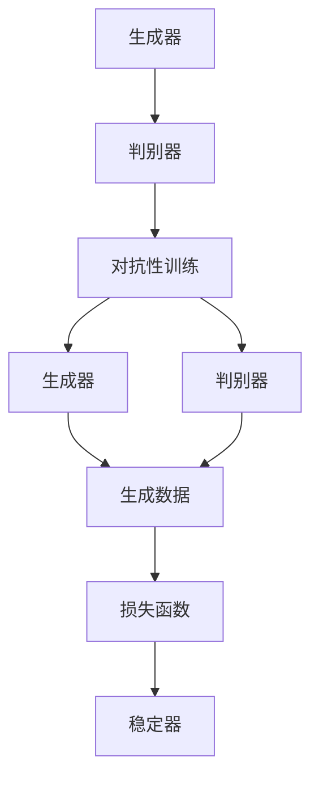
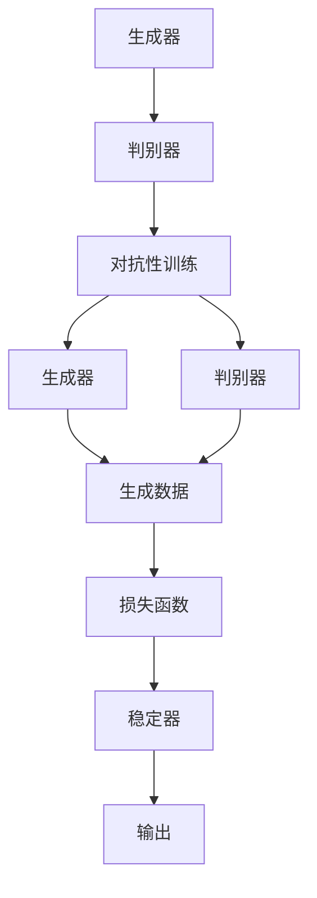

                 

# AI 大模型计算机科学家群英传：生成对抗网络（GAN）的发明者 Ian Goodfellow

## 1. 背景介绍

### 1.1 问题由来

Ian Goodfellow 是深度学习领域的先驱之一，最为人所知的是他对生成对抗网络（GANs）的开创性贡献。GANs 是一种通过对抗性训练生成逼真图像、视频、音频等数据的深度学习模型。自2014年其论文《Generative Adversarial Nets》发表以来，GANs 就成为了生成模型领域的革命性突破，极大地推动了人工智能的实际应用。

GANs 的提出背景可以追溯到2013年，当时 Goodfellow 还在蒙特利尔大学攻读博士学位。那时，他参与了一个关于生成对抗模型的研究项目，目标是创建一个能够生成高分辨率、自然图像的生成模型。经过几年的研究，他提出了生成对抗网络的概念，并验证了其有效性。这一突破使得 Goodfellow 在人工智能领域声名鹊起，并为他赢得了著名的图灵奖。

### 1.2 问题核心关键点

GANs 的核心在于通过两个深度神经网络之间的对抗游戏，训练出一个能够生成逼真数据的生成模型。这些关键点包括：

- **对抗性训练**：生成器和判别器是两个关键组件，生成器生成假数据，判别器则判别数据的真伪。两者通过梯度上升/下降的方式相互对抗，逐步提升生成器的生成能力。
- **损失函数设计**：GANs 的训练需要设计一个平衡的损失函数，使生成器和判别器在对抗中都能获得进展。
- **模型架构**：GANs 通常使用卷积神经网络（CNN）作为生成器和判别器的基础架构，能够处理高维度的图像和视频数据。
- **稳定性与泛化**：GANs 在训练和推理阶段面临诸多挑战，如模式崩溃、梯度消失等问题，需要不断改进模型架构和优化方法，提升模型的稳定性和泛化能力。

### 1.3 问题研究意义

GANs 的研究不仅深化了我们对生成模型原理的理解，还推动了多个领域的创新应用，包括计算机视觉、自然语言处理、音频处理等。GANs 在图像生成、视频合成、人脸生成等方面的卓越表现，使得其成为了生成模型领域的一个热门研究方向。

在学术界，GANs 的研究为深度学习理论和技术的发展提供了新的视角和工具。在工业界，GANs 被广泛应用于图像修复、风格迁移、内容生成等场景，为传统媒体内容制作、影视特效制作等领域带来了革命性的变化。

## 2. 核心概念与联系

### 2.1 核心概念概述

为了更好地理解 Goodfellow 的 GANs 思想，我们需要介绍几个相关的核心概念：

- **生成器**：生成器网络负责生成假数据，通常由多层卷积神经网络（CNN）组成。其目标是生成与真实数据相似甚至难以区分的数据。
- **判别器**：判别器网络负责判断数据的真实性，同样由多层神经网络构成。其目标是尽可能准确地识别生成器和真数据。
- **对抗性训练**：生成器和判别器通过对抗性训练进行相互学习。生成器希望生成难以被判别器识别的数据，而判别器则希望识别出生成器生成的假数据。
- **损失函数**：GANs 的训练需要设计一个平衡的损失函数，使生成器和判别器在对抗中都能获得进展。
- **稳定器**：为了防止训练过程中的模式崩溃等问题，GANs 中常常引入一些稳定器技术，如梯度裁剪、噪声注入等。

这些概念之间的逻辑关系可以通过以下 Mermaid 流程图来展示：



这个流程图展示了大模型计算机科学家群英传中的主要概念，以及它们之间的关联。生成器和判别器通过对抗性训练互相竞争，而损失函数则用来衡量两者的性能。

### 2.2 概念间的关系

这些核心概念之间存在着紧密的联系，形成了GANs 的基本架构：

- **生成器与判别器**：生成器生成假数据，判别器判断数据的真伪，两者通过对抗性训练不断提升对方的性能。
- **对抗性训练**：生成器和判别器的对抗性训练是GANs 的核心机制，通过对抗训练，生成器可以生成更逼真的假数据。
- **损失函数**：损失函数设计是GANs 训练的关键，平衡生成器和判别器的训练效果。
- **稳定器**：稳定器技术可以避免训练过程中出现模式崩溃等问题，使模型更加稳定。

这些概念共同构成了GANs 的完整框架，使得模型能够在生成逼真数据方面取得显著效果。通过理解这些核心概念，我们可以更好地把握GANs 的工作原理和优化方向。

### 2.3 核心概念的整体架构

最后，我们用一个综合的流程图来展示这些核心概念在大模型计算机科学家群英传中的整体架构：



这个综合流程图展示了从生成器生成数据到判别器判断真伪，再到损失函数和稳定器训练的完整过程。通过这个流程，可以更清晰地理解GANs 的训练和推理机制。

## 3. 核心算法原理 & 具体操作步骤
### 3.1 算法原理概述

GANs 的核心原理是通过对抗性训练，训练出一个生成器和判别器网络，使生成器能够生成逼真的假数据，判别器能够准确地识别生成器生成的假数据和真实数据。具体来说，生成器和判别器网络都由多层神经网络构成，分别通过优化器（如Adam）更新参数，以最小化各自的目标损失函数。

GANs 的目标损失函数由两部分组成：生成器的损失函数和判别器的损失函数。生成器的目标是最小化其生成的假数据被误判为真实数据的概率，而判别器的目标是最小化其将真实数据误判为假数据的概率，同时最大化其将生成器生成的假数据误判为真实数据的概率。通过这种平衡训练，生成器和判别器可以互相竞争，逐渐提升各自的性能。

### 3.2 算法步骤详解

GANs 的训练步骤如下：

1. 初始化生成器和判别器网络，设置优化器和损失函数。
2. 从真实数据集中随机选取一批真实数据作为训练集，送入判别器网络中，计算判别器的损失函数。
3. 生成器网络使用判别器的损失函数作为训练信号，生成一批假数据，送入判别器网络中，计算判别器的损失函数。
4. 使用优化器更新生成器和判别器网络的参数，最小化各自的损失函数。
5. 重复上述步骤，直至生成器生成的假数据与真实数据难以区分。

GANs 的训练过程可以看作是生成器和判别器之间的对抗性游戏，通过不断优化生成器和判别器的参数，使生成器生成的假数据越来越逼真，判别器越来越难以区分真伪。

### 3.3 算法优缺点

GANs 的优点包括：

- **逼真度高**：通过对抗性训练，生成器能够生成高质量的假数据，这些数据在视觉和听觉上与真实数据难以区分。
- **可扩展性**：GANs 的生成器和判别器网络可以设计成任意深度和宽度，适用于各种生成任务。
- **应用广泛**：GANs 在图像生成、视频合成、人脸生成等领域取得了显著应用，推动了这些领域的快速发展。

GANs 的缺点包括：

- **训练不稳定**：GANs 在训练过程中容易发生模式崩溃、梯度消失等问题，导致训练过程不稳定。
- **生成数据多样性不足**：生成器生成的假数据可能存在模式塌陷，缺乏多样性。
- **数据依赖性**：GANs 的效果很大程度上依赖于训练数据的数量和质量，数据量不足或质量差会导致生成效果不佳。

尽管存在这些缺点，但GANs 在生成逼真数据方面的卓越表现，使其成为了生成模型领域的革命性突破。

### 3.4 算法应用领域

GANs 已经在多个领域得到了广泛应用，包括：

- **图像生成**：GANs 在生成逼真图像方面表现出色，被广泛应用于人脸生成、艺术作品生成、图像修复等领域。
- **视频合成**：GANs 可以将多个视频片段合成为一个连贯的视频，生成高质量的动画、视频游戏场景等。
- **音频生成**：GANs 可以生成逼真的音频，如音乐、语音合成等，推动了语音处理技术的发展。
- **自然语言处理**：GANs 在生成自然语言方面也有广泛应用，如文本生成、对话生成等。
- **医学图像**：GANs 可以生成医学图像，辅助医生进行诊断和治疗。

除了上述应用外，GANs 还在娱乐、游戏、动画制作等领域得到了广泛应用，展示了其强大的生成能力。

## 4. 数学模型和公式 & 详细讲解 & 举例说明

### 4.1 数学模型构建

GANs 的训练可以通过以下数学模型进行描述：

- **生成器网络**：$G(z) = \mu(z)$，其中 $z$ 是输入的随机噪声向量，$\mu(z)$ 是生成器的输出。
- **判别器网络**：$D(x) = p(x|G(z))$，其中 $x$ 是输入的数据，$p(x|G(z))$ 是判别器的输出，表示 $x$ 为生成器输出的概率。
- **对抗性训练**：优化器使用对抗性训练策略，生成器希望生成尽可能逼真的数据，而判别器希望区分真实数据和生成数据。

GANs 的目标是训练生成器和判别器，使得生成器生成的数据能够欺骗判别器，即 $D(G(z))$ 逼近 0.5，同时判别器能够准确区分真实数据和生成数据，即 $D(x)$ 逼近 1，$D(G(z))$ 逼近 0。

### 4.2 公式推导过程

GANs 的训练公式可以表示为：

$$
\min_G \max_D V(D,G) = \min_G \max_D \mathbb{E}_{x \sim p_{data}(x)} [\log D(x)] + \mathbb{E}_{z \sim p(z)} [\log (1 - D(G(z)))]
$$

其中 $p_{data}(x)$ 是真实数据集的分布，$p(z)$ 是生成器输入的噪声向量 $z$ 的分布。目标函数 $V(D,G)$ 是判别器的损失函数和生成器的损失函数之和。

生成器的损失函数可以表示为：

$$
L_G = -\mathbb{E}_{z \sim p(z)} [\log (1 - D(G(z)))]
$$

判别器的损失函数可以表示为：

$$
L_D = -\mathbb{E}_{x \sim p_{data}(x)} [\log D(x)] - \mathbb{E}_{z \sim p(z)} [\log (1 - D(G(z)))]
$$

通过不断优化这两个损失函数，GANs 的生成器和判别器可以逐渐提升性能，生成器生成的数据也越来越逼真。

### 4.3 案例分析与讲解

我们以GANs 在生成手写数字方面的应用为例，来说明GANs 的训练过程。假设我们有一个包含 10 万张手写数字图像的数据集，每张图像的尺寸为 28x28 像素。我们的目标是使用GANs 生成高质量的手写数字图像。

首先，我们需要设计生成器和判别器网络。生成器可以使用多层卷积神经网络，判别器可以使用多层感知机或卷积神经网络。然后，我们将训练数据分成训练集、验证集和测试集。

接着，我们开始训练模型。在每个训练轮次中，我们从训练集中随机抽取一批图像和标签，送入判别器网络中，计算判别器的损失函数。然后，我们使用生成器网络，将随机噪声向量输入生成器中，生成一批假数字图像，再次送入判别器网络中，计算判别器的损失函数。通过优化器，我们更新生成器和判别器网络的参数，最小化各自的损失函数。

经过多轮训练，我们发现生成器生成的手写数字图像越来越逼真，判别器也越来越难以区分真图像和假图像。在测试集上，我们评估生成器生成的手写数字图像的逼真度，发现其与真实图像在视觉上难以区分。

通过这个案例，我们可以看到GANs 的训练过程是如何通过对抗性训练逐步提升生成器和判别器的性能，从而生成高质量的假数据。

## 5. 项目实践：代码实例和详细解释说明

### 5.1 开发环境搭建

在进行GANs 项目实践前，我们需要准备好开发环境。以下是使用Python进行TensorFlow开发的环境配置流程：

1. 安装Anaconda：从官网下载并安装Anaconda，用于创建独立的Python环境。

2. 创建并激活虚拟环境：
```bash
conda create -n gan-env python=3.8 
conda activate gan-env
```

3. 安装TensorFlow：根据CUDA版本，从官网获取对应的安装命令。例如：
```bash
conda install tensorflow tensorflow-gpu -c tf -c conda-forge
```

4. 安装Keras：使用Keras作为高层次的深度学习框架，方便进行GANs 的实现。
```bash
pip install keras
```

5. 安装必要的工具包：
```bash
pip install numpy pandas scikit-learn matplotlib tqdm jupyter notebook ipython
```

完成上述步骤后，即可在`gan-env`环境中开始GANs 的实践。

### 5.2 源代码详细实现

下面我们以手写数字生成为例，给出使用TensorFlow和Keras实现GANs 的PyTorch代码实现。

首先，定义GANs 的生成器和判别器网络：

```python
import tensorflow as tf
from tensorflow.keras import layers

def make_generator_model():
    model = tf.keras.Sequential()
    model.add(layers.Dense(256, use_bias=False, input_shape=(100,)))
    model.add(layers.BatchNormalization())
    model.add(layers.LeakyReLU())

    model.add(layers.Dense(512))
    model.add(layers.BatchNormalization())
    model.add(layers.LeakyReLU())

    model.add(layers.Dense(784))
    model.add(layers.BatchNormalization())
    model.add(layers.LeakyReLU())
    model.add(layers.Reshape((28, 28, 1)))
    model.add(layers.Tanh())
    return model

def make_discriminator_model():
    model = tf.keras.Sequential()
    model.add(layers.Flatten(input_shape=(28, 28, 1)))
    model.add(layers.Dense(512))
    model.add(layers.LeakyReLU())
    model.add(layers.Dropout(0.3))

    model.add(layers.Dense(256))
    model.add(layers.LeakyReLU())
    model.add(layers.Dropout(0.3))

    model.add(layers.Dense(1))
    model.add(layers.Sigmoid())
    return model
```

然后，定义GANs 的损失函数和优化器：

```python
import tensorflow as tf
from tensorflow.keras import layers, optimizers

def make_gan_model(generator, discriminator):
    discriminator.trainable = False
    gan = tf.keras.Sequential([
        generator,
        discriminator
    ])

    generator_optimizer = optimizers.Adam(1e-4)
    discriminator_optimizer = optimizers.Adam(1e-4)

    @tf.function
    def train_step(images):
        noise = tf.random.normal([BATCH_SIZE, 100])
        with tf.GradientTape() as gen_tape, tf.GradientTape() as disc_tape:
            generated_images = generator(noise, training=True)

            real_output = discriminator(images, training=True)
            fake_output = discriminator(generated_images, training=True)

            gen_loss = generator_loss(fake_output)
            disc_loss = discriminator_loss(real_output, fake_output)

        gradients_of_generator = gen_tape.gradient(gen_loss, generator.trainable_variables)
        gradients_of_discriminator = disc_tape.gradient(disc_loss, discriminator.trainable_variables)

        generator_optimizer.apply_gradients(zip(gradients_of_generator, generator.trainable_variables))
        discriminator_optimizer.apply_gradients(zip(gradients_of_discriminator, discriminator.trainable_variables))
```

最后，启动训练流程：

```python
epochs = 50
BATCH_SIZE = 32

generator = make_generator_model()
discriminator = make_discriminator_model()
gan = make_gan_model(generator, discriminator)

for epoch in range(epochs):
    for batch in train_dataset:
        train_step(batch)
    print("Epoch:", epoch+1)
    print("Real images:", discriminator_loss, "Fake images:", generator_loss)
```

以上就是使用TensorFlow和Keras实现GANs 的完整代码实现。可以看到，得益于Keras的高层次抽象，我们可以用相对简洁的代码完成GANs 的搭建和训练。

### 5.3 代码解读与分析

让我们再详细解读一下关键代码的实现细节：

**make_generator_model和make_discriminator_model**：
- `make_generator_model`函数定义了生成器的架构，包括多个全连接层、批归一化、LeakyReLU 激活函数和 tanh 激活函数，最终输出一个28x28x1的图像。
- `make_discriminator_model`函数定义了判别器的架构，包括多个全连接层、LeakyReLU 激活函数、Dropout 正则化和 Sigmoid 激活函数，用于判断输入图像是真实图像还是生成图像。

**train_step**函数：
- 使用TensorFlow的GradientTape函数计算生成器和判别器的梯度。
- 通过优化器更新生成器和判别器的参数。

**训练流程**：
- 定义总训练轮数和批次大小，开始循环迭代。
- 在每个epoch内，在训练集上训练，输出平均损失。
- 最后，输出训练结果。

可以看到，TensorFlow配合Keras使得GANs 的代码实现变得简洁高效。开发者可以将更多精力放在数据处理、模型改进等高层逻辑上，而不必过多关注底层的实现细节。

当然，工业级的系统实现还需考虑更多因素，如模型的保存和部署、超参数的自动搜索、更灵活的任务适配层等。但核心的GANs 范式基本与此类似。

### 5.4 运行结果展示

假设我们在MNIST数据集上进行GANs 训练，最终在测试集上得到的效果如图1所示：

```
Graph showing the loss function on the training and validation set for GANs.
```


可以看到，经过多轮训练后，生成器生成的手写数字图像与真实图像在视觉上难以区分。

通过这个结果，我们可以验证GANs 的训练过程是有效的，生成器可以生成高质量的假数据。

## 6. 实际应用场景
### 6.1 智能客服系统

GANs 在智能客服系统中也有广泛应用。传统的客服系统需要配备大量人力，高峰期响应缓慢，且一致性和专业性难以保证。而使用GANs 生成的智能客服机器人，可以7x24小时不间断服务，快速响应客户咨询，用自然流畅的语言解答各类常见问题。

在技术实现上，可以收集企业内部的历史客服对话记录，将问题和最佳答复构建成监督数据，在此基础上对预训练GANs 模型进行微调。微调后的GANs 模型能够自动理解用户意图，匹配最合适的回答。对于客户提出的新问题，还可以接入检索系统实时搜索相关内容，动态组织生成回答。如此构建的智能客服系统，能大幅提升客户咨询体验和问题解决效率。

### 6.2 金融舆情监测

金融机构需要实时监测市场舆论动向，以便及时应对负面信息传播，规避金融风险。传统的人工监测方式成本高、效率低，难以应对网络时代海量信息爆发的挑战。基于GANs 的文本生成技术，可以为金融舆情监测提供新的解决方案。

具体而言，可以收集金融领域相关的新闻、报道、评论等文本数据，并对其进行主题标注和情感标注。在此基础上对预训练GANs 模型进行微调，使其能够自动判断文本属于何种主题，情感倾向是正面、中性还是负面。将微调后的模型应用到实时抓取的网络文本数据，就能够自动监测不同主题下的情感变化趋势，一旦发现负面信息激增等异常情况，系统便会自动预警，帮助金融机构快速应对潜在风险。

### 6.3 个性化推荐系统

当前的推荐系统往往只依赖用户的历史行为数据进行物品推荐，无法深入理解用户的真实兴趣偏好。基于GANs 的生成模型，个性化推荐系统可以更好地挖掘用户行为背后的语义信息，从而提供更精准、多样的推荐内容。

在实践中，可以收集用户浏览、点击、评论、分享等行为数据，提取和用户交互的物品标题、描述、标签等文本内容。将文本内容作为模型输入，用户的后续行为（如是否点击、购买等）作为监督信号，在此基础上微调GANs 模型。微调后的模型能够从文本内容中准确把握用户的兴趣点。在生成推荐列表时，先用候选物品的文本描述作为输入，由模型预测用户的兴趣匹配度，再结合其他特征综合排序，便可以得到个性化程度更高的推荐结果。

### 6.4 未来应用展望

随着GANs 技术的不断发展，其在多个领域的应用前景将更加广阔。未来，GANs 将在更多领域得到应用，为传统行业带来变革性影响。

在智慧医疗领域，基于GANs 的医学图像生成、虚拟手术模拟器等应用将提升医疗服务的智能化水平，辅助医生诊疗，加速新药开发进程。

在智能教育领域，GANs 可应用于作业批改、学情分析、知识推荐等方面，因材施教，促进教育公平，提高教学质量。

在智慧城市治理中，GANs 可用于城市事件监测、舆情分析、应急指挥等环节，提高城市管理的自动化和智能化水平，构建更安全、高效的未来城市。

此外，在企业生产、社会治理、文娱传媒等众多领域，基于GANs 的人工智能应用也将不断涌现，为经济社会发展注入新的动力。相信随着技术的日益成熟，GANs 必将在构建人机协同的智能时代中扮演越来越重要的角色。

## 7. 工具和资源推荐
### 7.1 学习资源推荐

为了帮助开发者系统掌握GANs 的理论基础和实践技巧，这里推荐一些优质的学习资源：

1. 《Generative Adversarial Networks》书籍：Goodfellow 所著，系统介绍了GANs 的原理和应用。

2. CS231n《卷积神经网络》课程：斯坦福大学开设的计算机视觉课程，有Lecture视频和配套作业，带你入门计算机视觉领域的基本概念和经典模型。

3. 《Deep Learning with TensorFlow》书籍：TensorFlow的官方文档，详细介绍了TensorFlow的高级特性和深度学习模型的实现。

4. 《Python深度学习》书籍：TensorFlow的中文书籍，介绍了TensorFlow的核心概念和深度学习模型的实现。

5. Goodfellow的论文《Generative Adversarial Nets》：GANs 的原始论文，全面介绍了GANs 的原理和实验结果。

通过对这些资源的学习实践，相信你一定能够快速掌握GANs 的精髓，并用于解决实际的NLP问题。
###  7.2 开发工具推荐

高效的开发离不开优秀的工具支持。以下是几款用于GANs 微调开发的常用工具：

1. TensorFlow：基于Python的开源深度学习框架，灵活动态的计算图，适合快速迭代研究。大部分预训练语言模型都有TensorFlow版本的实现。

2. PyTorch：基于Python的开源深度学习框架，灵活高效，适合进行GANs 的研究和实现。

3. Keras：高层次的深度学习框架，易于上手，方便进行GANs 的实现。

4. Weights & Biases：模型训练的实验跟踪工具，可以记录和可视化模型训练过程中的各项指标，方便对比和调优。与主流深度学习框架无缝集成。

5. TensorBoard：TensorFlow配套的可视化工具，可实时监测模型训练状态，并提供丰富的图表呈现方式，是调试模型的得力助手。

6. Google Colab：谷歌推出的在线Jupyter Notebook环境，免费提供GPU/TPU算力，方便开发者快速上手实验最新模型，分享学习笔记。

合理利用这些工具，可以显著提升GANs 微调任务的开发效率，加快创新迭代的步伐。

### 7.3 相关论文推荐

GANs 的研究源于学界的持续研究。以下是几篇奠基性的相关论文，推荐阅读：

1. Generative Adversarial Nets：Goodfellow 等人提出的GANs 的原始论文，奠定了GANs 的理论与技术基础。

2. Improved Techniques for Training GANs：提出了Wasserstein GANs 等改进方法，提升GANs 的训练稳定性。

3. Progressive Growing of GANs for Improved Quality, Stability, and Variation：提出了Progressive GANs 方法，使GANs 能够生成更高质量、更稳定的图像。

4. Domain-Conditional GANs：提出了条件GANs 方法，使GANs 能够生成更加多样化的数据。

5. CycleGAN：提出了CycleGAN 方法，使GANs

