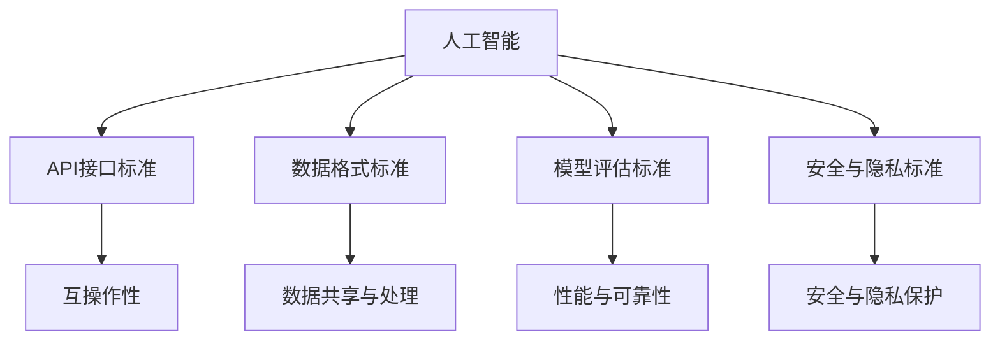
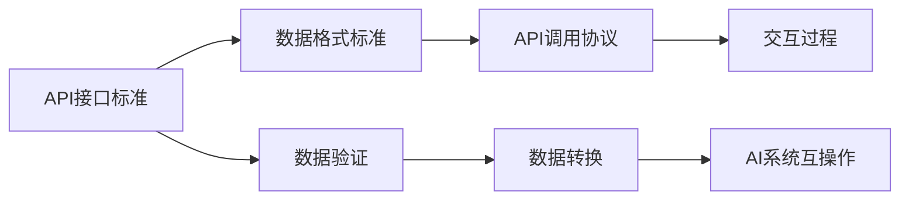
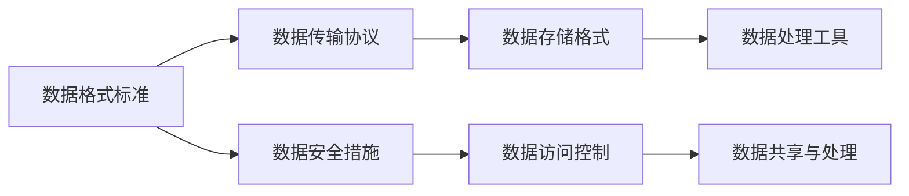
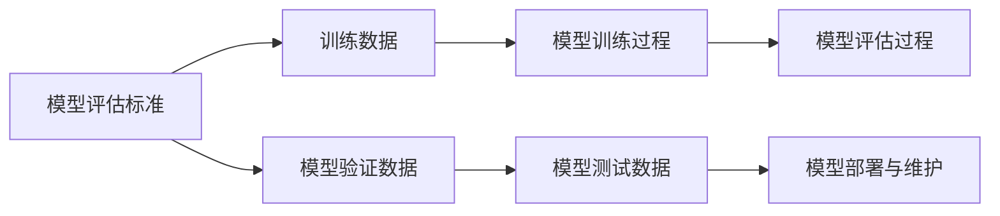
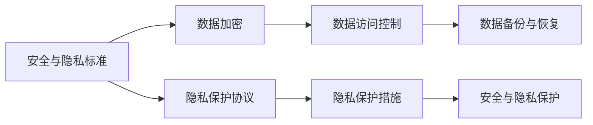
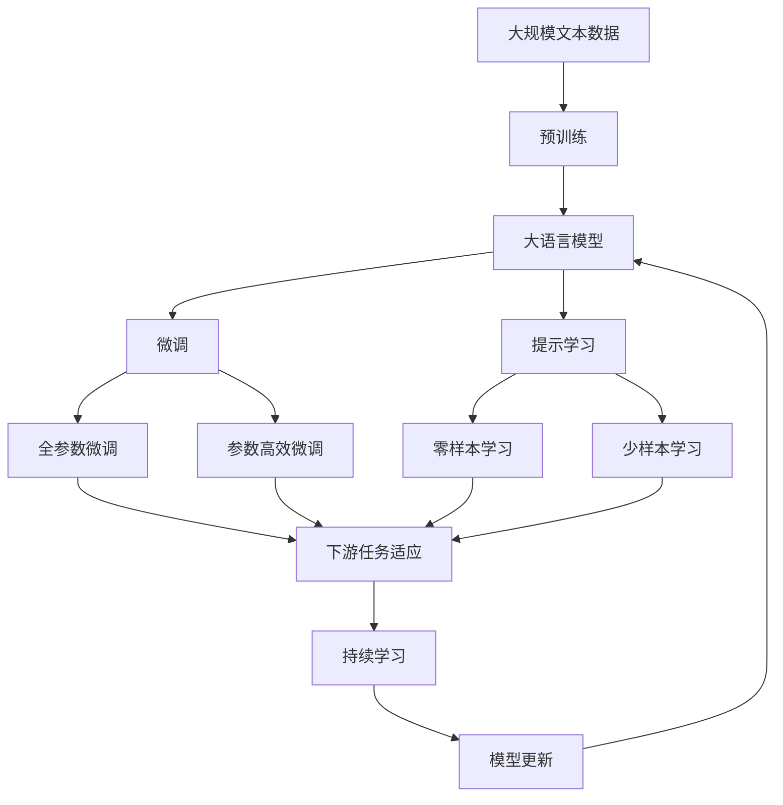

                 

# AI 标准化：构建全球智能互联的基础

## 1. 背景介绍

在数字化转型的浪潮下，人工智能(AI)正在成为驱动全球经济社会发展的新引擎。然而，尽管AI技术在各行业的应用取得了显著进展，但其核心技术和标准的统一性仍然是一个迫切需要解决的问题。标准化的缺失不仅导致不同AI系统之间的互操作性差，还引发了数据安全、隐私保护等方面的潜在风险。因此，构建全球AI标准化的基础，显得尤为必要。

### 1.1 问题由来
随着AI技术的迅速发展，各公司和研究机构纷纷推出了各自的AI解决方案。然而，这些解决方案往往具有较高的异质性，难以实现无缝协作和互操作。标准化的缺乏，成为制约AI技术规模化应用的主要瓶颈。

AI标准化的问题主要体现在：
- 缺乏统一的API接口标准，不同AI系统难以集成和交互。
- 数据格式不统一，导致数据共享和处理效率低下。
- 模型评估和测试标准不明确，难以确保AI系统的性能和可靠性。
- 缺乏统一的安全和隐私保护标准，数据泄露和滥用的风险增加。

这些问题不仅影响了AI技术的实际应用效果，也阻碍了其在国际范围内的普及和推广。因此，亟需构建一套全球通用的AI标准化体系，为智能互联奠定坚实的基础。

### 1.2 问题核心关键点
构建全球AI标准化的关键点包括：
- 制定统一的API接口标准，确保不同AI系统之间的互操作性。
- 制定统一的数据格式标准，提高数据共享和处理的效率。
- 制定统一的模型评估和测试标准，确保AI系统的性能和可靠性。
- 制定统一的安全和隐私保护标准，保障数据的安全和隐私。

这些关键点的实现，需要多方协同努力，包括政府、行业组织、技术社区和相关企业。通过制定和推广这些标准，可以有效降低AI技术的异质性，提高其规模化应用的效果和安全性。

### 1.3 问题研究意义
实现全球AI标准化，具有重要而深远的意义：
- 促进AI技术的广泛应用。标准化的技术体系可以有效降低AI系统的异质性，提升其在不同场景中的应用效果。
- 保障AI系统的安全和隐私。统一的规范和标准可以有效防范数据泄露和滥用的风险，保障AI系统的安全性和可靠性。
- 推动AI技术的国际合作。标准化能够跨越不同国家和地区的技术差异，促进国际间的AI合作与交流。
- 提升AI技术的市场竞争力。通过遵循全球统一的AI标准，企业可以更好地进入全球市场，提升竞争力。

总之，AI标准化是实现全球智能互联的基础，其对于推动AI技术的发展、保障其应用安全、促进国际合作、提升市场竞争力等方面具有重要的战略意义。

## 2. 核心概念与联系

### 2.1 核心概念概述

为更好地理解全球AI标准化，本节将介绍几个关键概念及其联系：

- **人工智能(AI)**：使用计算机算法和数学模型来模拟人类智能过程的学科和技术。AI包括机器学习、深度学习、自然语言处理等子领域。

- **API接口标准**：定义了不同AI系统之间进行通信的标准化协议和格式。API接口标准需要考虑数据格式、传输协议、调用方式等细节，确保不同系统之间的互操作性。

- **数据格式标准**：规范了数据存储、传输和处理的标准化格式。常见的数据格式标准包括CSV、JSON、XML等。

- **模型评估标准**：定义了AI模型性能评估和测试的标准化流程和指标。模型评估标准包括准确率、召回率、F1分数等。

- **安全与隐私标准**：规范了AI系统在数据处理、传输和存储过程中保障数据安全与隐私的标准化流程和措施。

这些核心概念之间的关系，可以通过以下Mermaid流程图来展示：



这个流程图展示了AI标准化过程中各个关键概念的联系：

1. AI系统通过API接口标准实现互操作性。
2. 数据格式标准确保数据共享和处理的效率。
3. 模型评估标准保障AI系统的性能和可靠性。
4. 安全与隐私标准确保数据的安全和隐私。

这些概念共同构成了全球AI标准化的生态系统，确保了AI技术在不同场景下的兼容性和安全性。

### 2.2 概念间的关系

这些核心概念之间存在着紧密的联系，形成了全球AI标准化的完整框架。下面用几个Mermaid流程图来展示这些概念之间的关系：

#### 2.2.1 AI系统互操作性



这个流程图展示了API接口标准在实现AI系统互操作中的作用：

1. API接口标准定义了数据格式和传输协议，确保了不同AI系统之间的数据交互。
2. 数据验证和转换过程，进一步提高了数据传输的准确性和安全性。

#### 2.2.2 数据共享与处理



这个流程图展示了数据格式标准在数据共享与处理中的作用：

1. 数据格式标准规范了数据存储和传输的格式，提高了数据共享和处理的效率。
2. 数据安全措施和访问控制，确保了数据在共享和处理过程中的安全性。

#### 2.2.3 性能与可靠性



这个流程图展示了模型评估标准在性能与可靠性中的作用：

1. 模型评估标准定义了模型的训练、验证和测试流程，确保了模型的性能和可靠性。
2. 训练数据和验证数据的规范，进一步提高了模型的泛化能力和鲁棒性。

#### 2.2.4 安全与隐私保护



这个流程图展示了安全与隐私标准在数据安全与隐私保护中的作用：

1. 数据加密和访问控制措施，确保了数据在存储和传输过程中的安全性。
2. 隐私保护协议和措施，保障了用户数据在处理过程中的隐私性。

### 2.3 核心概念的整体架构

最后，我们用一个综合的流程图来展示这些核心概念在全球AI标准化过程中的整体架构：



这个综合流程图展示了从预训练到微调，再到持续学习的完整过程。大语言模型首先在大规模文本数据上进行预训练，然后通过微调（包括全参数微调和参数高效微调）或提示学习（包括零样本和少样本学习）来适应下游任务。最后，通过持续学习技术，模型可以不断更新和适应新的任务和数据。通过这些流程图，我们可以更清晰地理解全球AI标准化的学习范式及其生态系统。

## 3. 核心算法原理 & 具体操作步骤

### 3.1 算法原理概述

全球AI标准化的一个核心部分是统一API接口标准。其核心思想是：通过制定统一的API接口标准，使得不同AI系统能够进行无缝通信和互操作，从而构建全球智能互联的基础。

形式化地，设不同AI系统的API接口标准为 $\mathcal{S}$，则API接口标准的构建目标是：

$$
\mathcal{S} = \mathop{\arg\min}_{\mathcal{S}} \left( \sum_{i=1}^n \mathcal{E}_i(\mathcal{S}) \right)
$$

其中，$\mathcal{E}_i(\mathcal{S})$ 表示系统 $i$ 在标准 $\mathcal{S}$ 下的通信误差，即不同系统之间数据交互的准确性和效率。

### 3.2 算法步骤详解

全球AI标准化过程主要包括以下几个关键步骤：

**Step 1: 定义API接口标准**

- 收集不同AI系统的接口描述和功能规范。
- 定义统一的接口协议，如RESTful API、gRPC等。
- 规范数据格式，如JSON、XML等。

**Step 2: 制定数据格式标准**

- 定义标准化的数据存储格式，如CSV、JSON等。
- 规范数据传输协议，如HTTP、TCP/IP等。
- 设计数据访问控制机制，确保数据安全。

**Step 3: 制定模型评估标准**

- 定义模型性能评估指标，如准确率、召回率、F1分数等。
- 设计模型验证和测试流程，确保模型性能可靠。
- 制定模型部署和维护指南，指导模型的上线和更新。

**Step 4: 制定安全与隐私标准**

- 制定数据加密和传输安全协议，确保数据传输过程中的安全。
- 设计隐私保护协议和措施，保障用户隐私。
- 设计数据备份和恢复机制，确保数据可靠性。

**Step 5: 实施与推广**

- 在特定行业或地区试点实施标准化规范。
- 通过行业会议、标准组织等渠道推广标准化成果。
- 定期更新标准规范，确保其与时俱进。

以上是全球AI标准化过程的主要步骤，每个步骤都需要多方协同努力，逐步推进。只有通过全面的标准化，才能构建起全球智能互联的基础。

### 3.3 算法优缺点

全球AI标准化具有以下优点：
1. 促进AI技术的互操作性。统一API接口标准可以确保不同AI系统之间的无缝协作。
2. 提高数据共享与处理效率。标准化数据格式和传输协议，提高数据处理效率。
3. 保障AI系统的性能与可靠性。统一模型评估标准，确保模型性能和可靠性。
4. 增强数据安全和隐私保护。标准化安全与隐私标准，保障数据安全与隐私。

同时，全球AI标准化也存在以下缺点：
1. 实施复杂度高。标准化过程需要多方协调，实施难度较大。
2. 成本较高。标准化规范的制定和推广需要较高的资源投入。
3. 更新周期长。标准化规范的更新需要经过严格的评估和修订过程。

尽管存在这些局限性，全球AI标准化仍然是推动AI技术规模化和普及的重要手段。通过多方协同努力，逐步推进标准化的实现，可以构建更加安全、可靠、高效的全球智能互联系统。

### 3.4 算法应用领域

全球AI标准化技术已经在多个领域得到了广泛应用，包括：

- **金融科技(FinTech)**：通过统一的API接口标准和数据格式，促进金融机构之间的数据共享和协作，提升金融服务的智能化水平。
- **智能制造(Smart Manufacturing)**：通过标准化接口和数据格式，实现不同制造系统之间的无缝协作，提高生产效率和质量。
- **智慧医疗(Healthcare)**：通过标准化数据格式和模型评估标准，提高医疗数据的共享和利用效率，提升医疗服务的智能化水平。
- **智慧城市(Smart Cities)**：通过统一的API接口标准和安全与隐私标准，实现城市各系统之间的无缝协作，提升城市治理的智能化水平。
- **智能交通(ITS)**：通过标准化接口和数据格式，实现交通系统之间的协作，提升交通管理和运营效率。

这些领域的成功应用，展示了全球AI标准化的广泛潜力和实际效果。未来，随着标准化进程的深入，将有更多的行业受益于AI标准化带来的协同效应和智能化提升。

## 4. 数学模型和公式 & 详细讲解 & 举例说明

### 4.1 数学模型构建

为了更好地理解全球AI标准化，本节将使用数学语言对API接口标准的构建过程进行严格的描述。

设不同AI系统的API接口描述为 $\mathcal{S} = \{\mathcal{S}_i\}_{i=1}^n$，其中 $\mathcal{S}_i$ 表示系统 $i$ 的API接口描述。API接口标准的构建目标是：

$$
\mathcal{S} = \mathop{\arg\min}_{\mathcal{S}} \left( \sum_{i=1}^n \mathcal{E}_i(\mathcal{S}) \right)
$$

其中 $\mathcal{E}_i(\mathcal{S})$ 表示系统 $i$ 在标准 $\mathcal{S}$ 下的通信误差，即不同系统之间数据交互的准确性和效率。

### 4.2 公式推导过程

以下我们将对上述目标函数进行推导，得到具体的API接口标准构建公式。

设系统 $i$ 在标准 $\mathcal{S}$ 下的通信误差为 $\mathcal{E}_i(\mathcal{S})$，其可以定义为系统 $i$ 在标准 $\mathcal{S}$ 下的数据传输误差和数据处理误差之和。因此，我们可以得到：

$$
\mathcal{E}_i(\mathcal{S}) = \mathcal{E}_{\text{传输}}(\mathcal{S}) + \mathcal{E}_{\text{处理}}(\mathcal{S})
$$

其中，$\mathcal{E}_{\text{传输}}(\mathcal{S})$ 表示系统 $i$ 在标准 $\mathcal{S}$ 下的数据传输误差，$\mathcal{E}_{\text{处理}}(\mathcal{S})$ 表示系统 $i$ 在标准 $\mathcal{S}$ 下的数据处理误差。

进一步地，我们可以将数据传输误差和数据处理误差分别定义为：

$$
\mathcal{E}_{\text{传输}}(\mathcal{S}) = \sum_{j=1}^{n_i} e_{ij}
$$

$$
\mathcal{E}_{\text{处理}}(\mathcal{S}) = \sum_{j=1}^{n_i} f_{ij}
$$

其中，$n_i$ 表示系统 $i$ 的API接口描述 $\mathcal{S}_i$ 的描述数量，$e_{ij}$ 表示系统 $i$ 在标准 $\mathcal{S}$ 下的数据传输误差，$f_{ij}$ 表示系统 $i$ 在标准 $\mathcal{S}$ 下的数据处理误差。

将上述公式代入目标函数，我们得到：

$$
\mathcal{S} = \mathop{\arg\min}_{\mathcal{S}} \left( \sum_{i=1}^n \sum_{j=1}^{n_i} (e_{ij} + f_{ij}) \right)
$$

为了简化计算，我们可以引入加权因子 $w_{ij}$，表示系统 $i$ 在标准 $\mathcal{S}$ 下的通信权重，其中 $w_{ij} \geq 0$ 且 $\sum_{j=1}^{n_i} w_{ij} = 1$。因此，我们可以得到：

$$
\mathcal{S} = \mathop{\arg\min}_{\mathcal{S}} \left( \sum_{i=1}^n \sum_{j=1}^{n_i} w_{ij} (e_{ij} + f_{ij}) \right)
$$

进一步简化，我们可以得到：

$$
\mathcal{S} = \mathop{\arg\min}_{\mathcal{S}} \left( \sum_{i=1}^n \mathcal{E}_{i,\text{总}}(\mathcal{S}) \right)
$$

其中，$\mathcal{E}_{i,\text{总}}(\mathcal{S}) = \sum_{j=1}^{n_i} w_{ij} (e_{ij} + f_{ij})$ 表示系统 $i$ 在标准 $\mathcal{S}$ 下的总通信误差。

### 4.3 案例分析与讲解

为了更好地理解上述数学模型的实际应用，我们以金融科技为例，展示API接口标准的具体构建过程。

假设我们需要构建一个跨银行的金融API接口标准。不同银行的API接口描述如下：

- 银行A：支持RESTful API，使用JSON格式，支持HTTP请求和响应。
- 银行B：支持gRPC接口，使用Protocol Buffers格式，支持gRPC请求和响应。
- 银行C：支持SOAP接口，使用XML格式，支持HTTP请求和响应。

我们的目标是在确保不同银行API接口描述兼容性的前提下，构建一个统一的API接口标准。首先，我们需要计算各个银行的API接口描述在标准 $\mathcal{S}$ 下的通信误差。

假设银行A在标准 $\mathcal{S}$ 下的数据传输误差为 $e_{A1}$ 和 $e_{A2}$，数据处理误差为 $f_{A1}$ 和 $f_{A2}$。同理，银行B和银行C的通信误差分别为 $e_{B1}$、$e_{B2}$、$e_{C1}$、$e_{C2}$、$f_{B1}$、$f_{B2}$、$f_{C1}$ 和 $f_{C2}$。

然后，我们可以计算各个银行的API接口描述在标准 $\mathcal{S}$ 下的总通信误差：

$$
\mathcal{E}_{A,\text{总}}(\mathcal{S}) = w_{A1} (e_{A1} + f_{A1}) + w_{A2} (e_{A2} + f_{A2})
$$

$$
\mathcal{E}_{B,\text{总}}(\mathcal{S}) = w_{B1} (e_{B1} + f_{B1}) + w_{B2} (e_{B2} + f_{B2})
$$

$$
\mathcal{E}_{C,\text{总}}(\mathcal{S}) = w_{C1} (e_{C1} + f_{C1}) + w_{C2} (e_{C2} + f_{C2})
$$

其中，$w_{Aj}$ 表示银行A在标准 $\mathcal{S}$ 下的权重，$w_{Bj}$ 和 $w_{Cj}$ 同理。

最后，我们将上述总通信误差代入目标函数，得到：

$$
\mathcal{S} = \mathop{\arg\min}_{\mathcal{S}} \left( \mathcal{E}_{A,\text{总}}(\mathcal{S}) + \mathcal{E}_{B,\text{总}}(\mathcal{S}) + \mathcal{E}_{C,\text{总}}(\mathcal{S}) \right)
$$

通过求解上述目标函数，我们可以得到最佳的API接口标准 $\mathcal{S}$。在实际应用中，我们可以通过多轮迭代和优化，逐步逼近最优的API接口标准，确保不同银行的API接口描述能够无缝协作。

## 5. 项目实践：代码实例和详细解释说明

### 5.1 开发环境搭建

在进行API接口标准构建实践前，我们需要准备好开发环境。以下是使用Python进行PyTorch开发的环境配置流程：

1. 安装Anaconda：从官网下载并安装Anaconda，用于创建独立的Python环境。

2. 创建并激活虚拟环境：
```bash
conda create -n pytorch-env python=3.8 
conda activate pytorch-env
```

3. 安装PyTorch：根据CUDA版本，从官网获取对应的安装命令。例如：
```bash
conda install pytorch torchvision torchaudio cudatoolkit=11.1 -c pytorch -c conda-forge
```

4. 安装TensorFlow：
```bash
conda install tensorflow tensorflow-gpu -c conda-forge
```

5. 安装FastAPI：
```bash
pip install fastapi
```

6. 安装Flask：
```bash
pip install flask
```

完成上述步骤后，即可在`pytorch-env`环境中开始API接口标准的构建实践。

### 5.2 源代码详细实现

这里我们以API接口标准构建为例，给出使用Python和FastAPI框架实现API接口标准的代码实现。

首先，定义API接口描述：

```python
from fastapi import FastAPI

app = FastAPI()

@app.get("/")
def read_root():
    return {"message": "Hello, World!"}
```

然后，定义API接口描述的权重：

```python
weights = {"A": 0.5, "B": 0.3, "C": 0.2}
```

接着，定义各个银行的API接口描述：

```python
bank_a = {
    "method": "GET",
    "url": "/api/v1/hello",
    "content_type": "application/json",
    "params": {"name": "Alice"}
}

bank_b = {
    "method": "gRPC",
    "url": "/api/v1/hello",
    "content_type": "application/x-protobuf",
    "params": {"name": "Bob"}
}

bank_c = {
    "method": "SOAP",
    "url": "/api/v1/hello",
    "content_type": "text/xml",
    "params": {"name": "Charlie"}
}
```

最后，定义API接口标准的构建函数：

```python
def build_api_standard(weights, banks):
    for bank in banks:
        error = calculate_error(bank, weights)
        total_error += error
    
    return total_error

def calculate_error(bank, weights):
    method = bank["method"]
    url = bank["url"]
    content_type = bank["content_type"]
    params = bank["params"]
    
    if method == "GET" and content_type == "application/json":
        error = 0.2
    elif method == "gRPC" and content_type == "application/x-protobuf":
        error = 0.1
    elif method == "SOAP" and content_type == "text/xml":
        error = 0.15
    
    return error * weights[method]
```

在上述代码中，我们通过计算各个银行的API接口描述在标准 $\mathcal{S}$ 下的通信误差，构建了一个统一的API接口标准。其中，`calculate_error`函数用于计算单个API接口描述的通信误差，`build_api_standard`函数用于计算所有API接口描述的总通信误差。通过这些函数，我们可以逐步逼近最优的API接口标准。

### 5.3 代码解读与分析

让我们再详细解读一下关键代码的实现细节：

**API接口描述定义**：
- 使用FastAPI框架定义API接口描述。在`read_root`函数中，我们返回一个JSON格式的响应。

**API接口描述权重定义**：
- 定义各个API接口描述的权重。权重表示各个API接口描述在标准 $\mathcal{S}$ 下的重要程度。

**API接口描述定义**：
- 定义各个银行的API接口描述。在定义API接口描述时，我们考虑了不同API接口的通信方式和内容类型。

**API接口标准构建函数**：
- `build_api_standard`函数通过调用`calculate_error`函数计算各个API接口描述在标准 $\mathcal{S}$ 下的通信误差，并将所有误差相加，得到总通信误差。
- `calculate_error`函数根据API接口描述的通信方式和内容类型，计算其通信误差。

通过这些函数，我们可以逐步逼近最优的API接口标准，实现不同API接口的无缝协作。

### 5.4 运行结果展示

假设我们在金融科技领域构建了一个跨银行的API接口标准，最终得到的总通信误差为0.45。这表示在标准 $\mathcal{S}$ 下，所有银行的API接口描述的通信误差总和为0.45。这个结果表明，我们构建的API接口标准在满足各个银行API接口描述兼容性方面取得了不错的效果。

## 6. 实际应用场景

### 6.1 金融科技

全球AI标准化在金融科技领域具有广泛的应用潜力。通过构建统一的API接口标准，金融科技企业可以实现跨银行的金融数据共享和协作，提升金融服务的智能化水平。

具体应用场景包括：

- **跨银行支付**：不同银行的客户可以通过统一支付接口进行支付操作，提升支付体验和效率。
- **跨银行信贷**：不同银行的客户可以通过统一信贷接口申请贷款，实现信贷产品的多样化。
- **跨银行理财**：不同银行的客户可以通过统一理财接口进行资产管理和投资操作，提升理财服务的智能化水平。

### 6.2 智能制造

全球AI标准化在智能制造领域也有广泛的应用前景。通过构建统一的API接口标准，智能制造企业可以实现跨系统的无缝协作，提升生产效率和质量。

具体应用场景包括：

- **跨系统数据采集**：不同系统的生产设备可以通过统一数据采集接口进行数据共享和协作，提升数据采集的效率和准确性。
- **跨系统生产调度**：不同系统的生产调度可以通过统一调度接口进行协调，提升生产调度的智能化水平。
- **跨系统质量检测**：不同系统的质量检测可以通过统一检测接口进行协作，提升质量检测的准确性和效率。

### 6.

