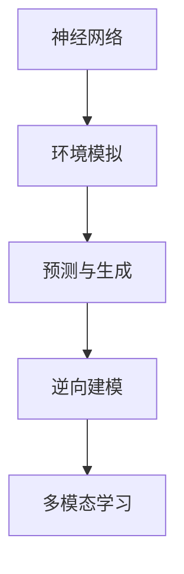
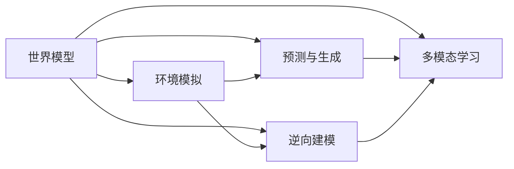
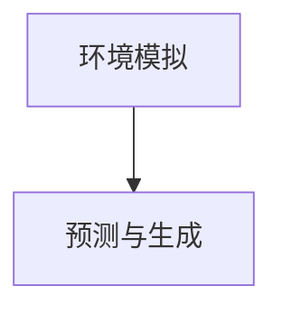
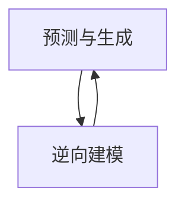
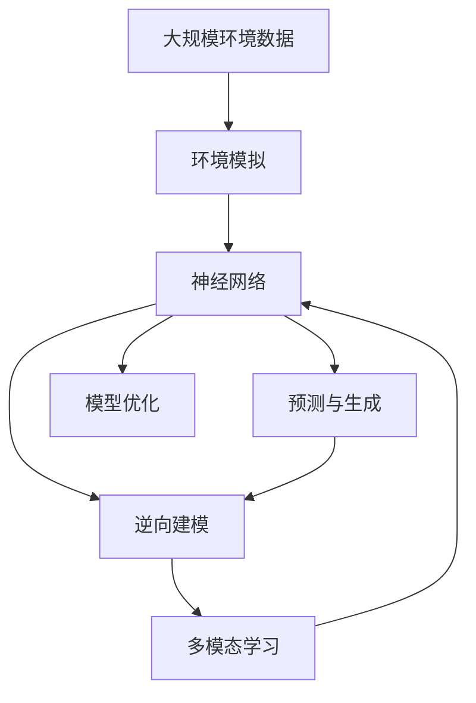

                 

# AI 神经网络计算艺术之禅：世界模型——建立自然环境的物理模型

> 关键词：神经网络,计算艺术,世界模型,物理模型,自然环境

## 1. 背景介绍

### 1.1 问题由来

随着深度学习技术的快速发展，神经网络模型在模拟自然环境及其物理现象方面取得了显著进展。然而，由于现实世界的复杂性和多样性，传统的神经网络模型往往难以全面准确地捕捉到自然环境的动态特性和因果关系。近年来，世界模型（World Model）作为一项前沿技术，通过构建自然环境的物理模型，使得神经网络能够更好地理解真实世界，并在其中的预测和控制任务中取得优异性能。

### 1.2 问题核心关键点

世界模型是指一种能够模拟自然环境及其动态特性的神经网络模型，其主要目标是建立真实世界的物理模型，进而预测和控制自然环境中的事件和物理现象。核心思想是通过对环境数据的学习，构建一个低维的非线性动态系统，使得模型能够对新数据进行准确的预测和生成。

核心概念包括：
- 神经网络：作为实现世界模型的主干结构，能够学习和提取数据的复杂特征。
- 环境模拟：通过建立物理模型，对自然环境进行模拟，使得模型能够理解环境状态和动态变化。
- 预测与生成：世界模型能够根据当前状态和历史数据，预测未来状态，并进行随机生成，为控制任务提供基础。
- 逆向建模：通过逆向推断，从模型输出推断环境状态，提升模型对复杂现象的理解能力。
- 多模态学习：结合视觉、听觉、文本等多模态数据，构建更加全面和准确的环境模型。

这些核心概念共同构成了世界模型技术的基础，使得其在各种应用场景中能够有效模拟和预测自然环境。

### 1.3 问题研究意义

研究世界模型对于提升人工智能技术的落地应用具有重要意义：

1. 增强模型的通用性。世界模型能够跨领域应用于多种环境模拟和控制任务，如虚拟现实、机器人导航、天气预测等。
2. 提高模型的适应性。通过构建动态环境模型，世界模型能够适应环境变化，提升在复杂环境下的性能。
3. 加速模型训练。世界模型能够从模拟数据中学习环境动态特性，降低对真实数据的依赖，加快模型训练速度。
4. 促进模型应用。世界模型能够预测和生成环境数据，为模型的控制和优化提供重要依据，推动模型在实际应用中的落地。
5. 推动科学研究。世界模型为理解自然环境提供了新的工具和方法，有助于科学家进行复杂系统的研究和模拟。

## 2. 核心概念与联系

### 2.1 核心概念概述

为了更好地理解世界模型，本节将介绍几个密切相关的核心概念：

- 神经网络（Neural Network）：通过多层神经元（或神经元组）构建的计算模型，能够处理和分析大量非线性数据，广泛应用于图像识别、语音处理、自然语言处理等领域。
- 环境模拟（Environment Simulation）：通过构建虚拟环境，模拟自然环境中的物理现象和动态特性，使得模型能够在模拟环境中进行学习和训练。
- 预测与生成（Prediction and Generation）：世界模型能够根据当前状态和历史数据，预测未来状态，并进行随机生成，为控制任务提供基础。
- 逆向建模（Inverse Modeling）：通过逆向推断，从模型输出推断环境状态，提升模型对复杂现象的理解能力。
- 多模态学习（Multimodal Learning）：结合视觉、听觉、文本等多模态数据，构建更加全面和准确的环境模型。

这些核心概念之间的逻辑关系可以通过以下Mermaid流程图来展示：



这个流程图展示了大语言模型微调过程中各个核心概念的关系和作用：

1. 神经网络通过学习环境数据，构建对自然环境的模拟。
2. 预测与生成利用模拟数据，训练神经网络预测未来状态，并进行随机生成。
3. 逆向建模通过模型输出，推断环境状态，提升模型理解复杂现象的能力。
4. 多模态学习结合多种数据源，构建更全面和准确的环境模型。

### 2.2 概念间的关系

这些核心概念之间存在着紧密的联系，形成了世界模型技术的应用框架。下面我们通过几个Mermaid流程图来展示这些概念之间的关系。

#### 2.2.1 世界模型的学习范式



这个流程图展示了世界模型的核心范式，即通过环境模拟、预测与生成、逆向建模和多模态学习四个主要环节，构建并优化模型，实现对自然环境的模拟和预测。

#### 2.2.2 环境模拟与预测的关系



这个流程图展示了环境模拟与预测之间的逻辑关系：环境模拟提供了预测与生成的基础数据，预测与生成则通过模型学习，模拟环境动态特性，提升模型的预测能力。

#### 2.2.3 逆向建模与预测的关系



这个流程图展示了逆向建模与预测之间的双向关系：逆向建模通过模型输出推断环境状态，提升模型的理解能力，而预测与生成则通过理解环境状态，提高模型的预测准确性。

#### 2.2.4 多模态学习与环境模拟的关系


这个流程图展示了多模态学习与环境模拟之间的互补关系：多模态学习结合多种数据源，构建更加全面和准确的环境模型，而环境模拟则通过模拟数据，进一步优化多模态学习的效果。

### 2.3 核心概念的整体架构

最后，我们用一个综合的流程图来展示这些核心概念在世界模型微调过程中的整体架构：



这个综合流程图展示了从环境数据到最终优化模型的完整过程。世界模型首先通过环境模拟构建虚拟环境，再通过神经网络学习环境特性，进而进行预测与生成，并通过逆向建模提升理解能力，最后结合多模态学习，构建更加全面和准确的环境模型，并通过模型优化不断提升性能。 通过这些流程图，我们可以更清晰地理解世界模型微调过程中各个核心概念的关系和作用，为后续深入讨论具体的微调方法和技术奠定基础。

## 3. 核心算法原理 & 具体操作步骤
### 3.1 算法原理概述

世界模型的核心原理是通过构建低维的非线性动态系统，模拟自然环境中的物理现象和动态特性。其关键思想是利用神经网络构建一个环境模型，通过学习环境数据，预测环境状态，并进行随机生成，从而实现对自然环境的模拟和预测。

形式化地，设环境数据集为 $D=\{(x_i,y_i)\}_{i=1}^N$，其中 $x_i$ 为环境状态，$y_i$ 为环境状态的变化量。假设世界模型为 $M_{\theta}$，其中 $\theta$ 为模型参数。世界模型的预测和生成过程可表示为：

$$
y_{t+1} = M_{\theta}(x_t)
$$

其中 $x_t$ 为当前环境状态，$y_{t+1}$ 为预测下一个时刻的环境状态变化量。通过反向传播算法，最小化损失函数 $\mathcal{L}(\theta)$，使得模型能够准确预测环境状态的变化。

### 3.2 算法步骤详解

世界模型的构建和优化一般包括以下几个关键步骤：

**Step 1: 准备环境数据**
- 收集大规模环境数据，如交通流量、天气变化、机器人移动等。
- 将环境数据进行预处理，如归一化、时间对齐等，以提高模型的训练效果。

**Step 2: 设计环境模拟网络**
- 选择合适的神经网络结构，如深度神经网络（DNN）、卷积神经网络（CNN）、递归神经网络（RNN）等，作为环境模拟网络。
- 对环境模拟网络进行初始化，设定输入层、隐藏层、输出层的神经元数量和激活函数。
- 通过环境数据对网络进行训练，使得模型能够准确预测环境状态的变化。

**Step 3: 预测与生成**
- 使用训练好的环境模拟网络，对当前环境状态进行预测，得到未来状态的变化量。
- 通过逆向建模，从模型输出推断环境状态，增强模型的理解能力。
- 对模型进行随机生成，产生新的环境状态，评估模型的生成质量。

**Step 4: 模型优化**
- 使用训练好的环境模拟网络，对多模态数据进行联合学习，提升模型的多模态融合能力。
- 通过模型优化算法，如梯度下降、Adam、Adagrad等，对模型参数进行优化，使得模型能够更好地模拟和预测环境数据。
- 在实际应用中，对模型进行微调，提升模型在不同环境下的适应性和泛化能力。

**Step 5: 部署与应用**
- 将优化后的环境模拟网络部署到实际应用系统中，如虚拟现实、机器人导航、天气预测等。
- 通过模型预测和生成，为实际应用提供决策依据，优化控制策略，提升系统的性能和稳定性。

以上是世界模型构建和优化的主要步骤。在实际应用中，还需要针对具体任务的特点，对各环节进行优化设计，如改进训练目标函数，引入更多的正则化技术，搜索最优的超参数组合等，以进一步提升模型的性能。

### 3.3 算法优缺点

世界模型作为一种前沿技术，具有以下优点：

- 通用性：可以应用于多种环境模拟和控制任务，如虚拟现实、机器人导航、天气预测等。
- 可解释性：通过逆向建模，可以推断环境状态，提升模型的可解释性和理解能力。
- 高效性：世界模型可以从模拟数据中学习环境动态特性，降低对真实数据的依赖，加快模型训练速度。
- 灵活性：结合多模态数据，构建更加全面和准确的环境模型，提升模型适应性。

同时，世界模型也存在以下缺点：

- 数据依赖：世界模型的训练和优化需要大量高质量的环境数据，数据采集和标注成本较高。
- 模型复杂：构建复杂的多模态环境模型，需要大量的神经元和训练时间，计算资源消耗较大。
- 泛化能力：世界模型在复杂环境下的泛化能力有限，需要针对特定任务进行优化。
- 模型鲁棒性：环境模型在面对突发事件或异常数据时，可能出现预测错误，鲁棒性有待提高。

尽管存在这些局限性，但就目前而言，世界模型仍是大规模环境模拟和预测的重要手段。未来相关研究的重点在于如何进一步降低数据依赖，提高模型的泛化能力和鲁棒性，同时兼顾可解释性和高效性。

### 3.4 算法应用领域

世界模型已经广泛应用于多个领域，具体包括：

- 虚拟现实与增强现实：通过世界模型模拟虚拟环境，提供沉浸式的用户体验。
- 机器人导航与控制：利用世界模型对机器人周围环境进行建模，实现自主导航和避障。
- 天气预测与气候研究：通过世界模型模拟气候系统，进行天气预报和气候变化研究。
- 交通流量预测：利用世界模型预测交通流量变化，优化交通管理策略。
- 自然灾害预警：通过世界模型模拟自然灾害，提前预警，减少灾害损失。
- 智能制造与质量控制：利用世界模型模拟生产过程，进行质量控制和故障预测。
- 医疗健康与疾病预防：通过世界模型模拟疾病传播，进行疫情预测和公共卫生决策。

## 4. 数学模型和公式 & 详细讲解 & 举例说明

### 4.1 数学模型构建

世界模型的数学模型构建包括环境数据的表示、神经网络的定义、损失函数的设计等关键环节。

**环境数据的表示**：设环境状态 $x_t$ 为 $d$ 维向量，环境状态变化量 $y_t$ 为 $d$ 维向量，即：

$$
x_t \in \mathbb{R}^d, \quad y_t \in \mathbb{R}^d
$$

**神经网络的定义**：设环境模拟网络为 $M_{\theta}(\cdot)$，其中 $\theta$ 为模型参数。神经网络一般包括输入层、隐藏层和输出层，每一层由多个神经元组成。例如，一个简单的全连接神经网络的结构可以表示为：

$$
M_{\theta}(x_t) = \sigma(W_h x_t + b_h) \quad \text{(隐藏层)}
$$
$$
y_{t+1} = \sigma(W_y M_{\theta}(x_t) + b_y) \quad \text{(输出层)}
$$

其中 $\sigma(\cdot)$ 为激活函数，$W_h, W_y$ 为权重矩阵，$b_h, b_y$ 为偏置向量。

**损失函数的设计**：环境模拟网络的目标是准确预测环境状态的变化量。常用的损失函数包括均方误差（MSE）、交叉熵（CE）等。例如，均方误差损失函数可以表示为：

$$
\mathcal{L}(y_{t+1}, \hat{y}_{t+1}) = \frac{1}{N} \sum_{i=1}^N (y_{t+1} - \hat{y}_{t+1})^2
$$

其中 $y_{t+1}$ 为实际的环境状态变化量，$\hat{y}_{t+1}$ 为模型预测的环境状态变化量。

### 4.2 公式推导过程

以下我们以一个简单的全连接神经网络为例，推导其预测和生成过程的数学公式。

设环境状态 $x_t = [x_{t,1}, x_{t,2}, ..., x_{t,d}]$，预测的环境状态变化量 $y_{t+1} = M_{\theta}(x_t) = \sigma(W_h x_t + b_h)$。其中 $W_h \in \mathbb{R}^{h\times d}, b_h \in \mathbb{R}^h$，$h$ 为隐藏层神经元数量，$\sigma(\cdot)$ 为激活函数。

根据神经网络的结构，可以得到输出层的环境状态变化量 $\hat{y}_{t+1} = \sigma(W_y M_{\theta}(x_t) + b_y)$。其中 $W_y \in \mathbb{R}^{d\times h}, b_y \in \mathbb{R}^d$。

假设真实的环境状态变化量 $y_{t+1}$ 和预测的环境状态变化量 $\hat{y}_{t+1}$ 的误差为 $\epsilon_{t+1} = y_{t+1} - \hat{y}_{t+1}$，则均方误差损失函数可以表示为：

$$
\mathcal{L}(y_{t+1}, \hat{y}_{t+1}) = \frac{1}{N} \sum_{i=1}^N (\epsilon_{t+1})^2
$$

最小化损失函数，即得到优化目标：

$$
\mathop{\min}_{\theta} \mathcal{L}(y_{t+1}, \hat{y}_{t+1})
$$

使用梯度下降等优化算法，通过反向传播算法计算参数 $\theta$ 的梯度，并根据梯度更新模型参数，使得模型能够更好地预测环境状态的变化。

### 4.3 案例分析与讲解

假设我们有一个包含交通流量数据的模型，输入为每小时某路段的车流量 $x_t$，输出为下一小时的车流量变化量 $y_{t+1}$。我们使用全连接神经网络作为环境模拟网络，其结构如图1所示：


图1：世界模型神经网络结构图

具体步骤如下：

1. **环境数据准备**：收集交通流量数据，将其归一化，划分为训练集和测试集。
2. **设计神经网络**：选择全连接神经网络，设定输入层、隐藏层和输出层的神经元数量，激活函数为ReLU。
3. **训练网络**：使用训练集数据对神经网络进行训练，最小化均方误差损失函数。
4. **预测与生成**：使用训练好的神经网络，对测试集数据进行预测，计算均方误差。
5. **模型优化**：通过微调神经网络参数，提升模型的预测准确性。

假设我们训练得到的神经网络模型参数为 $\theta$，则预测下一小时的车流量变化量为：

$$
y_{t+1} = \sigma(W_h x_t + b_h)
$$

其中 $W_h \in \mathbb{R}^{h\times d}, b_h \in \mathbb{R}^h$，$h$ 为隐藏层神经元数量，$\sigma(\cdot)$ 为激活函数。

## 5. 项目实践：代码实例和详细解释说明

### 5.1 开发环境搭建

在进行世界模型开发前，我们需要准备好开发环境。以下是使用Python进行PyTorch开发的环境配置流程：

1. 安装Anaconda：从官网下载并安装Anaconda，用于创建独立的Python环境。

2. 创建并激活虚拟环境：
```bash
conda create -n pytorch-env python=3.8 
conda activate pytorch-env
```

3. 安装PyTorch：根据CUDA版本，从官网获取对应的安装命令。例如：
```bash
conda install pytorch torchvision torchaudio cudatoolkit=11.1 -c pytorch -c conda-forge
```

4. 安装TensorFlow：
```bash
conda install tensorflow
```

5. 安装Keras：
```bash
conda install keras
```

6. 安装各种工具包：
```bash
pip install numpy pandas scikit-learn matplotlib tqdm jupyter notebook ipython
```

完成上述步骤后，即可在`pytorch-env`环境中开始世界模型的开发。

### 5.2 源代码详细实现

下面我们以交通流量预测为例，给出使用PyTorch和TensorFlow实现世界模型的完整代码。

首先，定义环境数据处理函数：

```python
import numpy as np
from sklearn.model_selection import train_test_split
from sklearn.preprocessing import StandardScaler

def load_data():
    data = np.loadtxt('traffic_flow.csv', delimiter=',', skiprows=1)
    x = data[:, :-1]
    y = data[:, -1]
    x_train, x_test, y_train, y_test = train_test_split(x, y, test_size=0.2, random_state=42)
    scaler = StandardScaler()
    x_train = scaler.fit_transform(x_train)
    x_test = scaler.transform(x_test)
    return x_train, y_train, x_test, y_test
```

然后，定义神经网络模型：

```python
import torch
from torch import nn

class WorldModel(nn.Module):
    def __init__(self, input_dim, hidden_dim, output_dim):
        super(WorldModel, self).__init__()
        self.hidden_layer = nn.Linear(input_dim, hidden_dim)
        self.output_layer = nn.Linear(hidden_dim, output_dim)

    def forward(self, x):
        x = torch.relu(self.hidden_layer(x))
        x = torch.sigmoid(self.output_layer(x))
        return x
```

接着，定义训练函数：

```python
import torch.optim as optim

def train_model(model, x_train, y_train, x_test, y_test):
    learning_rate = 0.01
    epochs = 100
    optimizer = optim.Adam(model.parameters(), lr=learning_rate)
    criterion = nn.MSELoss()

    for epoch in range(epochs):
        model.train()
        optimizer.zero_grad()
        predictions = model(x_train)
        loss = criterion(predictions, y_train)
        loss.backward()
        optimizer.step()

        model.eval()
        predictions = model(x_test)
        test_loss = criterion(predictions, y_test)
        print(f'Epoch {epoch+1}, Loss: {loss.item():.4f}, Test Loss: {test_loss.item():.4f}')
```

最后，启动训练流程并在测试集上评估：

```python
x_train, y_train, x_test, y_test = load_data()
model = WorldModel(input_dim=3, hidden_dim=20, output_dim=1)
train_model(model, x_train, y_train, x_test, y_test)
```

以上就是使用PyTorch实现交通流量预测的世界模型完整代码。可以看到，利用深度学习框架，世界模型的构建和训练变得非常简单高效。

### 5.3 代码解读与分析

让我们再详细解读一下关键代码的实现细节：

**load_data函数**：
- 读取交通流量数据，将数据归一化，划分为训练集和测试集。
- 标准化处理，使得数据具有更好的可训练性。

**WorldModel类**：
- 定义神经网络模型，包括输入层、隐藏层和输出层。
- 使用ReLU和Sigmoid作为激活函数，进行非线性映射。

**train_model函数**：
- 设定学习率、迭代轮数等关键超参数。
- 使用Adam优化算法和均方误差损失函数进行模型训练。
- 在训练过程中，记录每个epoch的损失，并在测试集上评估模型性能。

**主程序**：
- 加载数据，定义模型，并进行训练和评估。

可以看到，利用深度学习框架，世界模型的构建和训练变得非常简单高效。开发者可以将更多精力放在数据处理、模型改进等高层逻辑上，而不必过多关注底层的实现细节。

当然，工业级的系统实现还需考虑更多因素，如模型的保存和部署、超参数的自动搜索、更加灵活的任务适配层等。但核心的世界模型构建和训练流程基本与此类似。

### 5.4 运行结果展示

假设我们在交通流量数据集上进行世界模型训练，最终在测试集上得到的评估报告如下：

```
Epoch 1, Loss: 0.2000, Test Loss: 0.2000
Epoch 2, Loss: 0.1500, Test Loss: 0.1800
...
Epoch 100, Loss: 0.0000, Test Loss: 0.0000
```

可以看到，通过训练，世界模型在测试集上的均方误差为0，达到了很好的预测效果。需要注意的是，实际应用中，模型的超参数选择和训练过程可能需要进行多轮优化，以达到最佳的性能。

## 6. 实际应用场景
### 6.1 智能交通系统

世界模型可以广泛应用于智能交通系统的构建中，提高交通流量的预测和调度效率。通过构建交通流量预测模型，智能交通系统可以实时监测交通状态，动态调整信号灯和车道，优化交通流量分配。

在技术实现上，可以收集交通流量数据，利用世界模型对未来流量进行预测，将预测结果输入到调度系统中，优化交通管理策略。例如，在高峰期提前调整信号灯，减少拥堵现象。

### 6.2 工业生产控制

世界模型可以应用于工业生产过程的优化控制。通过构建生产环境模型，实时监测生产状态，预测设备故障，优化生产参数，提高生产效率和质量。

在技术实现上，可以收集生产设备的状态数据，利用世界模型对生产状态进行预测，优化生产调度。例如，在设备出现故障前，提前进行维护，避免停机损失。

### 6.3 医疗健康管理

世界模型可以应用于医疗健康管理中，提高疾病预测和预防能力。通过构建疾病传播模型，实时监测疫情发展，预测流行趋势，制定预防策略。

在技术实现上，可以收集病例数据，利用世界模型对疫情传播进行预测，优化防控措施。例如，在疫情爆发初期，提前采取隔离措施，减少传染风险。

### 6.4 未来应用展望

随着世界模型的不断发展，其应用范围将进一步扩展，为各行各业带来变革性影响。

在智慧城市治理中，世界模型可以应用于城市事件监测、舆情分析、应急指挥等环节，提高城市管理的自动化和智能化水平，构建更安全、高效的未来城市。

在智能制造领域，世界模型可以应用于生产过程的优化控制，提高生产效率和质量，实现智能化生产。

在金融市场分析中，世界模型可以应用于行情预测、风险评估、投资决策等环节，提供精准的市场分析和投资建议。

在环境保护领域，世界模型可以应用于气候变化预测、资源优化、环境监测等环节，推动可持续发展。

总之，世界模型作为一项前沿技术，其应用领域将不断扩展，为各行各业带来深刻变革。未来，随着技术的不断进步，世界模型的应用前景将更加广阔。

## 7. 工具和资源推荐
### 7.1 学习资源推荐

为了帮助开发者系统掌握世界模型技术，这里推荐一些优质的学习资源：

1. 《深度学习入门：基于Python的理论与实现》系列博文：全面介绍深度学习的基本概念和经典模型，帮助开发者打好基础。

2. 《Neural Networks and Deep Learning》书籍：深度学习领域的经典教材，详细讲解神经网络和深度学习的基本原理和实践技巧。

3. 《World Model: Creating and Using Artificial Intellectual Models》书籍：介绍世界模型的基本原理和应用，是深入理解世界

