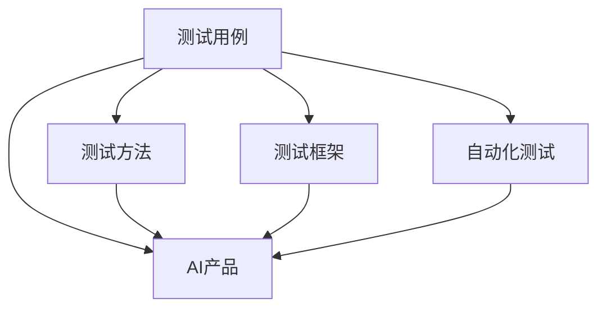
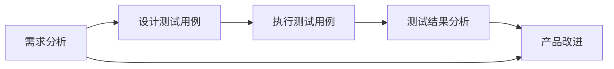

                 

# AI 设计产品测试用例

> 关键词：测试用例设计, AI 产品测试, 自然语言处理, 软件工程, 自动化测试

## 1. 背景介绍

随着人工智能技术的迅猛发展，越来越多的AI产品进入了我们的生活和工作。然而，尽管AI产品的智能化水平在不断提升，其质量和可靠性仍然需要严格的测试验证。测试用例的设计与执行是确保AI产品性能、稳定性和安全性至关重要的环节。本文旨在深入探讨如何设计高效、全面的AI产品测试用例，以助力AI产品的成功落地。

### 1.1 问题由来

在过去，传统的软件测试方法往往依赖于人工编写和执行测试用例，这种方法既耗时又容易出错。随着AI技术的兴起，测试用例的设计和执行面临新的挑战：

1. **复杂性增加**：AI产品的功能复杂，涉及机器学习、深度学习、自然语言处理等多领域技术，测试用例的设计需要综合考虑多种因素。
2. **数据多样性**：AI产品需要处理多种数据类型，包括结构化数据、非结构化数据和多媒体数据，测试用例需要覆盖不同数据源。
3. **动态变化**：AI产品的算法和模型不断更新，测试用例需要持续更新以适应新的变化。
4. **自动化需求**：测试用例的执行需要高度自动化，以提高测试效率和覆盖率。

### 1.2 问题核心关键点

为了有效设计和使用测试用例，我们需要关注以下几个关键点：

1. **全面性**：测试用例需要覆盖AI产品的所有功能和模块，确保产品各项性能指标符合预期。
2. **可重复性**：测试用例的设计需要规范化和标准化，确保测试结果的可重复性和可验证性。
3. **高效性**：测试用例的设计需要兼顾效率和成本，确保在有限的时间内完成全面的测试。
4. **适应性**：测试用例的设计需要具备一定的灵活性，以适应AI产品动态变化的特性。
5. **自动化**：测试用例的执行需要高度自动化，以提高测试效率和覆盖率。

## 2. 核心概念与联系

### 2.1 核心概念概述

在进行AI产品测试用例设计时，我们需要理解以下几个关键概念：

1. **测试用例**：一组明确的条件和预期结果，用于验证软件或系统的功能是否正确。
2. **AI产品**：基于人工智能技术开发的软件或系统，包括但不限于机器学习、深度学习、自然语言处理等。
3. **测试方法**：用于设计、执行和验证测试用例的方法和工具。
4. **测试框架**：一个用于管理、组织和执行测试用例的框架。
5. **自动化测试**：使用自动化工具执行测试用例，提高测试效率和覆盖率。

这些概念之间的关系可以通过以下Mermaid流程图来展示：



### 2.2 概念间的关系

上述概念之间存在着紧密的联系，形成了一个完整的测试用例设计和执行系统。

1. **测试用例与AI产品**：测试用例的设计和执行是验证AI产品性能和可靠性的关键。
2. **测试用例与测试方法**：测试方法指导测试用例的设计，确保测试用例的有效性和覆盖率。
3. **测试用例与测试框架**：测试框架提供了管理和执行测试用例的平台和工具，支持自动化测试的实施。
4. **测试用例与自动化测试**：自动化测试提高了测试效率和覆盖率，降低了人工操作的错误率。

### 2.3 核心概念的整体架构

接下来，我们用一个综合的流程图来展示测试用例设计、执行和评估的整体架构：



这个综合流程图展示了从需求分析到测试结果分析的整个测试流程：

1. **需求分析**：根据产品的功能需求和性能指标，制定测试目标。
2. **设计测试用例**：设计满足测试目标的测试用例，确保覆盖所有功能和模块。
3. **执行测试用例**：使用自动化工具执行测试用例，验证产品功能和性能。
4. **测试结果分析**：分析测试结果，识别问题，提出改进建议。
5. **产品改进**：根据测试结果，改进产品功能和性能，确保产品符合用户需求。

## 3. 核心算法原理 & 具体操作步骤
### 3.1 算法原理概述

测试用例的设计需要基于一定的算法和原理，其核心思想是通过设计一组特定的输入数据和预期输出结果，验证AI产品的功能和性能是否满足预期。这一过程通常包括以下几个步骤：

1. **需求分析**：明确测试目标和预期结果。
2. **用例设计**：设计满足测试目标的测试用例，包括输入数据、处理逻辑和预期输出。
3. **用例执行**：执行测试用例，验证预期输出是否符合预期。
4. **结果分析**：分析测试结果，识别问题，提出改进建议。

### 3.2 算法步骤详解

以下详细讲解测试用例设计的具体步骤：

**Step 1: 需求分析**
- 明确测试目标，包括功能、性能和安全性等。
- 确定测试覆盖范围，包括各个模块和功能。
- 定义预期结果，确保测试用例能够验证预期结果。

**Step 2: 用例设计**
- 选择用例类型，包括功能测试、性能测试、安全测试等。
- 设计用例数据，包括输入数据和输出结果。
- 编写用例描述，包括用例编号、描述、预期结果等。
- 使用工具生成测试脚本，确保用例的可执行性和可重复性。

**Step 3: 用例执行**
- 使用自动化测试工具执行测试用例。
- 收集测试结果，包括通过和失败的测试用例。
- 分析测试结果，识别问题，生成测试报告。

**Step 4: 结果分析**
- 分析测试结果，识别问题的根本原因。
- 提出改进建议，包括代码修改、数据调整等。
- 验证改进效果，确保问题解决。

### 3.3 算法优缺点

测试用例设计具有以下优点：

1. **系统性**：通过设计全面的测试用例，可以系统性地验证AI产品的各个功能和模块。
2. **可重复性**：测试用例的设计和执行规范化和标准化，确保测试结果的可重复性和可验证性。
3. **高效性**：使用自动化测试工具，提高测试效率和覆盖率。

同时，测试用例设计也存在一些缺点：

1. **高成本**：测试用例的设计和执行需要大量的时间和人力资源。
2. **复杂性**：测试用例的设计需要考虑多种因素，包括功能、性能、安全性等。
3. **动态变化**：AI产品的算法和模型不断更新，测试用例需要持续更新以适应新的变化。

### 3.4 算法应用领域

测试用例设计在AI产品测试中得到了广泛应用，涵盖以下领域：

1. **机器学习模型测试**：验证模型的准确性、鲁棒性和泛化能力。
2. **深度学习模型测试**：验证模型的训练和推理过程，确保模型性能稳定。
3. **自然语言处理测试**：验证NLP模型的语言理解和生成能力。
4. **计算机视觉测试**：验证图像识别和处理模型的准确性和鲁棒性。
5. **软件工程测试**：验证软件系统各个模块和功能的协同工作能力。

## 4. 数学模型和公式 & 详细讲解  
### 4.1 数学模型构建

测试用例的设计和执行通常涉及数学模型和公式。以下以机器学习模型的测试用例设计为例，构建数学模型。

假设我们有一个训练好的机器学习模型，用于预测二分类问题。设模型的输入为 $x$，输出为 $y$，模型预测结果为 $\hat{y}$。测试用例的设计和执行可以基于以下数学模型：

- 模型的预测准确度（Accuracy）：$\frac{1}{N}\sum_{i=1}^N I(y_i = \hat{y}_i)$
- 模型的精确度（Precision）：$\frac{\sum_{i=1}^N I(y_i = \hat{y}_i \text{ and } \hat{y}_i = 1)}{\sum_{i=1}^N I(\hat{y}_i = 1)}$
- 模型的召回率（Recall）：$\frac{\sum_{i=1}^N I(y_i = \hat{y}_i \text{ and } y_i = 1)}{\sum_{i=1}^N I(y_i = 1)}$
- 模型的F1分数（F1 Score）：$2 \times \frac{Precision \times Recall}{Precision + Recall}$

### 4.2 公式推导过程

接下来，我们以精确度和召回率的计算公式为例，进行详细推导：

设模型的输入为 $x$，输出为 $y$，模型预测结果为 $\hat{y}$。设 $T$ 为正样本集合，$F$ 为负样本集合。则精确度和召回率的计算公式如下：

精确度（Precision）：
$$
Precision = \frac{\sum_{i \in T} I(\hat{y}_i = 1)}{\sum_{i=1}^N I(\hat{y}_i = 1)}
$$
其中 $I$ 为指示函数，当条件成立时取1，否则取0。

召回率（Recall）：
$$
Recall = \frac{\sum_{i \in T} I(y_i = \hat{y}_i)}{\sum_{i=1}^N I(y_i = 1)}
$$

### 4.3 案例分析与讲解

以一个简单的二分类问题为例，假设模型预测结果为：

- 输入 $x_1$，真实标签 $y_1 = 1$，预测标签 $\hat{y}_1 = 1$
- 输入 $x_2$，真实标签 $y_2 = 1$，预测标签 $\hat{y}_2 = 0$
- 输入 $x_3$，真实标签 $y_3 = 0$，预测标签 $\hat{y}_3 = 0$

根据上述计算公式，可以得到精确度为：
$$
Precision = \frac{1 + 0}{1 + 0} = 1
$$

召回率为：
$$
Recall = \frac{1 + 0}{1 + 1} = 0.5
$$

### 5. 项目实践：代码实例和详细解释说明
### 5.1 开发环境搭建

在进行测试用例设计和执行时，我们需要准备好开发环境。以下是使用Python进行JUnit测试的环境配置流程：

1. 安装JDK：从官网下载并安装JDK，用于运行Java程序。
2. 安装Maven：使用Maven进行Java项目的构建和管理。
3. 安装JUnit：使用JUnit进行测试用例的编写和执行。
4. 配置测试运行环境：设置测试用例的运行路径和JVM参数。

完成上述步骤后，即可在JDK和JUnit环境下进行测试用例的设计和执行。

### 5.2 源代码详细实现

下面我们以一个简单的Java程序为例，展示测试用例的编写和执行：

```java
import org.junit.Test;
import static org.junit.Assert.*;

public class TestExample {
    @Test
    public void testExample() {
        // 准备测试数据
        int[] data = {1, 2, 3, 4, 5};

        // 执行测试用例
        assertEquals(3, sum(data));

        // 输出测试结果
        System.out.println("Test passed!");
    }

    public int sum(int[] data) {
        int result = 0;
        for (int i = 0; i < data.length; i++) {
            result += data[i];
        }
        return result;
    }
}
```

在这个例子中，我们编写了一个简单的测试用例，用于验证Java程序的sum方法是否正确计算数组的总和。

### 5.3 代码解读与分析

让我们再详细解读一下关键代码的实现细节：

**TestExample类**：
- 继承JUnit的Test类，实现测试方法。
- 使用@Test注解标记测试方法，告诉JUnit进行测试。
- 编写测试数据和预期结果。

**sum方法**：
- 编写需要测试的Java方法，计算数组的总和。

**@Test方法**：
- 编写测试用例，设置测试数据和预期结果，调用需要测试的方法，并使用JUnit的assertEquals方法进行测试结果的验证。

### 5.4 运行结果展示

假设我们运行上述代码，输出结果如下：

```
Test passed!
```

这表示测试用例通过了，sum方法正确计算了数组的总和。如果sum方法的结果不正确，JUnit会自动抛出AssertionError异常，提示测试失败。

## 6. 实际应用场景
### 6.1 智能客服系统

智能客服系统是AI产品在实际应用中的典型场景。测试用例设计对于智能客服系统的性能和可靠性至关重要。

具体而言，测试用例可以包括以下几个方面：

1. **用户意图测试**：测试系统能否正确理解用户的意图，并给出合适的回答。
2. **问题解答测试**：测试系统能否根据用户的提问，生成正确的答案。
3. **多轮对话测试**：测试系统能否在多轮对话中正确理解上下文，并生成连贯的回答。
4. **错误处理测试**：测试系统在遇到错误输入或异常情况时的处理能力。

### 6.2 金融舆情监测系统

金融舆情监测系统是AI产品在金融领域的典型应用。测试用例设计对于系统的准确性和鲁棒性至关重要。

具体而言，测试用例可以包括以下几个方面：

1. **文本分类测试**：测试系统能否正确分类金融新闻和报道的情感倾向。
2. **事件识别测试**：测试系统能否识别出金融事件的关键词和关键信息。
3. **预测准确度测试**：测试系统能否预测金融市场走势，并提供合理的投资建议。

### 6.3 个性化推荐系统

个性化推荐系统是AI产品在电商领域的典型应用。测试用例设计对于系统的个性化能力和推荐效果至关重要。

具体而言，测试用例可以包括以下几个方面：

1. **用户行为测试**：测试系统能否准确理解用户的行为和偏好。
2. **推荐结果测试**：测试系统能否根据用户行为，生成合适的推荐结果。
3. **推荐效果测试**：测试系统的推荐结果能否提高用户的购买率和满意度。

### 6.4 未来应用展望

随着AI技术的不断发展和应用领域的扩展，测试用例设计将面临更多的挑战和机遇：

1. **大数据和复杂系统**：AI产品的数据量和复杂性不断增加，测试用例设计需要更多的大数据处理和复杂系统测试方法。
2. **跨领域融合**：AI产品往往涉及多个领域，测试用例设计需要跨领域融合，涵盖多种技术和应用场景。
3. **自动化和智能化**：测试用例执行需要高度自动化和智能化，以提高测试效率和覆盖率。
4. **安全性和伦理**：测试用例设计需要考虑安全性、隐私和伦理等因素，确保AI产品的可靠性和合法性。

## 7. 工具和资源推荐
### 7.1 学习资源推荐

为了帮助开发者系统掌握测试用例设计的理论基础和实践技巧，这里推荐一些优质的学习资源：

1. **《软件测试基础教程》**：介绍测试用例设计的原理、方法和工具，适合初学者入门。
2. **《测试驱动开发实践》**：详细介绍测试驱动开发（TDD）的理念和方法，有助于提升测试用例设计的质量和效率。
3. **《自动化测试工具指南》**：介绍常用的自动化测试工具和框架，如JUnit、Selenium等，适合实际操作练习。
4. **《AI 产品测试最佳实践》**：汇集AI产品测试的最新实践和经验，适合行业专家参考。

通过对这些资源的学习实践，相信你一定能够快速掌握测试用例设计的精髓，并用于解决实际的AI产品测试问题。

### 7.2 开发工具推荐

高效的测试用例设计离不开优秀的工具支持。以下是几款用于测试用例设计和执行的常用工具：

1. **JUnit**：JUnit是一个Java测试框架，广泛用于Java项目的测试用例设计和执行。
2. **Selenium**：Selenium是一个自动化测试工具，用于测试Web应用程序的用户界面。
3. **Postman**：Postman是一个API测试工具，用于测试API接口的请求和响应。
4. **Apache JMeter**：Apache JMeter是一个性能测试工具，用于测试Web应用程序的负载和响应时间。
5. **Robot Framework**：Robot Framework是一个通用测试框架，支持多种测试类型和语言。

合理利用这些工具，可以显著提升测试用例设计的效率和准确性，加快创新迭代的步伐。

### 7.3 相关论文推荐

测试用例设计在AI产品测试中的应用得到了学界的广泛关注，以下是几篇奠基性的相关论文，推荐阅读：

1. **《软件测试用例设计技术》**：详细介绍测试用例设计的理论和方法，适合初学者和专业人士。
2. **《自动化测试的挑战与展望》**：探讨自动化测试的现状和未来发展方向，适合测试工程师参考。
3. **《测试用例设计自动化工具研究》**：研究测试用例设计自动化工具的开发和应用，适合测试工具开发者参考。

这些论文代表了大规模测试用例设计的研究脉络。通过学习这些前沿成果，可以帮助研究者把握学科前进方向，激发更多的创新灵感。

除上述资源外，还有一些值得关注的前沿资源，帮助开发者紧跟测试用例设计的最新进展，例如：

1. **arXiv论文预印本**：人工智能领域最新研究成果的发布平台，包括大量尚未发表的前沿工作，学习前沿技术的必读资源。
2. **业界技术博客**：如Google、Microsoft、Amazon等顶尖实验室的官方博客，第一时间分享他们的最新研究成果和洞见。
3. **技术会议直播**：如IEEE、ACM、SIGGRAPH等顶级会议现场或在线直播，能够聆听到专家们的分享，开拓视野。
4. **GitHub热门项目**：在GitHub上Star、Fork数最多的测试相关项目，往往代表了该技术领域的发展趋势和最佳实践，值得去学习和贡献。
5. **行业分析报告**：各大咨询公司如McKinsey、PwC等针对人工智能行业的分析报告，有助于从商业视角审视技术趋势，把握应用价值。

总之，对于测试用例设计的研究和实践，需要开发者保持开放的心态和持续学习的意愿。多关注前沿资讯，多动手实践，多思考总结，必将收获满满的成长收益。

## 8. 总结：未来发展趋势与挑战
### 8.1 总结

本文对测试用例设计和执行进行了全面系统的介绍。首先阐述了测试用例设计在AI产品中的应用背景和重要性，明确了测试用例设计在确保AI产品性能、稳定性和安全性方面的关键作用。其次，从原理到实践，详细讲解了测试用例设计的数学模型和算法步骤，给出了测试用例设计任务的完整代码实例。同时，本文还探讨了测试用例在智能客服、金融舆情、个性化推荐等实际应用场景中的应用前景，展示了测试用例设计的广泛应用价值。此外，本文精选了测试用例设计的各类学习资源，力求为读者提供全方位的技术指引。

通过本文的系统梳理，可以看到，测试用例设计在AI产品测试中扮演着不可或缺的角色，是大规模AI产品开发和部署的基础。未来，伴随AI技术的不断发展，测试用例设计将面临更多的挑战和机遇，成为AI产品开发中不可或缺的重要环节。

### 8.2 未来发展趋势

展望未来，测试用例设计将呈现以下几个发展趋势：

1. **大数据处理能力增强**：随着数据量的不断增加，测试用例设计需要具备更好的大数据处理能力，以应对海量数据带来的挑战。
2. **智能化和自动化**：测试用例设计将更多地采用智能化和自动化手段，提高测试效率和覆盖率。
3. **跨领域融合**：测试用例设计将涉及更多跨领域的融合，涵盖机器学习、深度学习、自然语言处理等多领域技术。
4. **安全性和伦理**：测试用例设计需要更多考虑安全性和伦理问题，确保AI产品的可靠性和合法性。

### 8.3 面临的挑战

尽管测试用例设计在AI产品测试中扮演着不可或缺的角色，但在迈向更加智能化、普适化应用的过程中，它仍面临诸多挑战：

1. **数据多样性**：AI产品需要处理多种数据类型，测试用例设计需要覆盖不同数据源。
2. **动态变化**：AI产品的算法和模型不断更新，测试用例需要持续更新以适应新的变化。
3. **复杂性增加**：AI产品的功能复杂，涉及多种技术和应用场景，测试用例设计需要考虑多种因素。
4. **资源消耗大**：测试用例的设计和执行需要大量的时间和人力资源，测试成本较高。

### 8.4 未来突破

面对测试用例设计面临的挑战，未来的研究需要在以下几个方面寻求新的突破：

1. **大数据处理技术**：开发更加高效的大数据处理技术，提升测试用例设计的处理能力。
2. **智能化工具**：开发更加智能化的测试工具，提高测试效率和覆盖率。
3. **跨领域融合技术**：研究跨领域的测试用例设计技术，涵盖多种技术和应用场景。
4. **自动化测试框架**：构建更加自动化和模块化的测试框架，降低测试成本。
5. **安全性和伦理工具**：开发更多安全性和伦理测试工具，确保AI产品的可靠性和合法性。

这些研究方向的探索，必将引领测试用例设计技术迈向更高的台阶，为AI产品的成功落地提供坚实的基础。面向未来，测试用例设计需要从多个维度协同发力，不断优化测试方法和工具，确保AI产品的质量和安全。

## 9. 附录：常见问题与解答
----------------------------------------------------------------

**Q1：如何设计高效、全面的测试用例？**

A: 设计高效、全面的测试用例需要考虑以下几个因素：

1. **覆盖范围**：测试用例需要覆盖AI产品的所有功能和模块，确保产品各项性能指标符合预期。
2. **数据多样性**：测试用例需要涵盖多种数据类型，包括结构化数据、非结构化数据和多媒体数据。
3. **动态变化**：测试用例需要具备一定的灵活性，以适应AI产品动态变化的特性。
4. **自动化**：测试用例的执行需要高度自动化，以提高测试效率和覆盖率。

**Q2：如何评估测试用例的覆盖率？**

A: 评估测试用例的覆盖率需要考虑以下几个因素：

1. **代码覆盖率**：测试用例需要覆盖产品代码的各个部分，确保每个代码行都被测试到。
2. **功能覆盖率**：测试用例需要覆盖产品的所有功能和模块，确保每个功能都被测试到。
3. **数据覆盖率**：测试用例需要覆盖产品处理的所有数据类型和数据源，确保每个数据都被测试到。

**Q3：如何处理测试用例的缺陷？**

A: 处理测试用例的缺陷需要考虑以下几个步骤：

1. **定位问题**：根据测试结果，定位缺陷的具体位置和原因。
2. **修复问题**：根据缺陷的具体情况，修复代码或数据。
3. **验证修复**：使用相同的测试用例重新执行，验证修复是否成功。

**Q4：如何提高测试用例的复用性？**

A: 提高测试用例的复用性需要考虑以下几个方面：

1. **模块化设计**：将测试用例设计成模块化的形式，便于组合和复用。
2. **参数化测试**：使用参数化的方式设计测试用例，方便复用和扩展。
3. **数据共享**：将测试数据设计成通用的形式，便于在不同场景下复用。

**Q5：如何提高测试用例的可维护性？**

A: 提高测试用例的可维护性需要考虑以下几个方面：

1. **清晰命名**：使用清晰、描述性的名称，便于理解和维护。
2. **注释说明**：编写详细的注释，说明测试用例的设计思路和预期结果。
3. **版本控制**：使用版本控制工具，记录测试用例的变更历史，便于跟踪和维护。

总之，测试用例的设计和执行是确保AI产品性能和可靠性的关键环节。通过深入理解测试用例设计的原理和步骤，合理选择和使用测试工具，不断优化测试方法和工具，可以有效提升AI产品的质量和可靠性，确保其成功落地。

