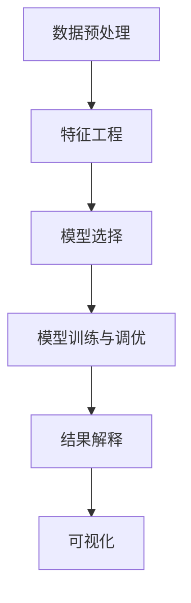
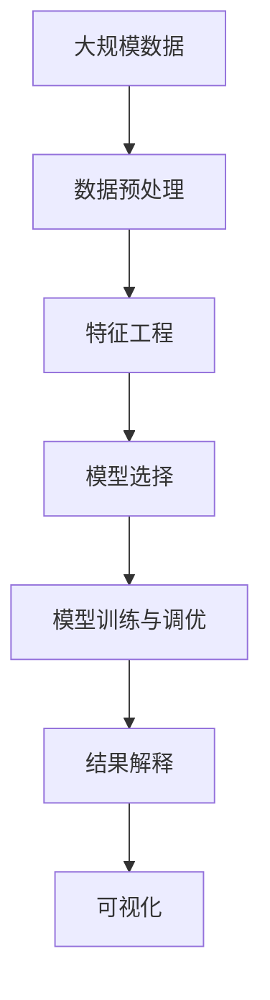

                 

# AI 辅助分析：洞察数据价值

## 1. 背景介绍

### 1.1 问题由来

在当今数据驱动的时代，数据成为各行各业决策和运营的重要基础。然而，面对海量数据，如何从中提取出有价值的洞察，成为摆在企业和研究者面前的重要挑战。传统的数据分析方法往往依赖于专家经验，耗时长、成本高，且难以自动化处理复杂数据。人工智能（AI）技术的引入，为数据分析提供了全新的解决方案，其中AI辅助分析（AI-driven analysis）成为近年来的研究热点。

### 1.2 问题核心关键点

AI辅助分析的核心在于利用机器学习（Machine Learning, ML）、深度学习（Deep Learning, DL）等技术，自动化处理数据，提取潜在的洞察和模式。具体而言，AI辅助分析涵盖了以下几个关键点：

1. **数据预处理**：清洗、转换、归一化等操作，保证数据的质量和一致性。
2. **特征工程**：从原始数据中提取有意义的特征，如统计特征、文本特征等。
3. **模型选择**：根据数据类型和分析目的，选择合适的模型，如回归模型、分类模型、聚类模型等。
4. **模型训练与调优**：利用训练数据训练模型，并通过调参、正则化等方法优化模型性能。
5. **结果解释**：将模型输出转换为可理解的洞察，如趋势分析、模式识别等。
6. **可视化**：使用图表、仪表盘等工具，直观展示分析结果。

通过这些步骤，AI辅助分析能够高效、准确地从大量数据中提取有价值的信息，帮助企业做出更明智的决策。

### 1.3 问题研究意义

AI辅助分析的研究具有重要意义，主要体现在以下几个方面：

1. **提升决策效率**：自动化数据处理和分析过程，减少人工干预，缩短决策时间。
2. **降低成本**：减少人力和资源投入，降低数据处理的成本。
3. **增强精度**：利用机器学习的强大建模能力，提高分析结果的准确性和可靠性。
4. **支持个性化决策**：通过分析用户行为和偏好，实现定制化推荐和服务。
5. **适应数据变化**：能够快速适应数据分布的变化，持续优化分析模型。

## 2. 核心概念与联系

### 2.1 核心概念概述

为了更好地理解AI辅助分析的原理和应用，我们首先介绍几个核心概念：

- **数据预处理**：指对原始数据进行清洗、转换、归一化等操作，以提高数据质量，保证分析结果的可靠性。
- **特征工程**：指从原始数据中提取有意义的特征，如文本特征、统计特征等，用于构建模型的输入。
- **模型选择**：指根据数据类型和分析目的，选择合适的机器学习或深度学习模型，如线性回归、支持向量机、神经网络等。
- **模型训练与调优**：指利用训练数据训练模型，并通过调整超参数、正则化等方法优化模型性能。
- **结果解释**：指将模型输出转换为可理解的洞察，如趋势分析、模式识别等。
- **可视化**：指使用图表、仪表盘等工具，直观展示分析结果。

### 2.2 概念间的关系

这些核心概念之间存在紧密的联系，共同构成了AI辅助分析的完整生态系统。以下是一个Mermaid流程图，展示了这些概念之间的关系：



这个流程图展示了AI辅助分析的基本流程：

1. 对原始数据进行预处理，提取有用特征。
2. 根据特征选择合适的模型进行训练。
3. 在训练过程中通过调参等方法优化模型。
4. 将模型输出转换为可理解的洞察。
5. 使用可视化工具展示分析结果。

### 2.3 核心概念的整体架构

最后，我们用一个综合的流程图来展示这些核心概念在大数据处理中的应用：



这个综合流程图展示了从数据预处理到可视化的完整流程，有助于我们系统理解AI辅助分析的工作原理。

## 3. 核心算法原理 & 具体操作步骤
### 3.1 算法原理概述

AI辅助分析的核心算法原理主要包括：

1. **数据预处理**：包括数据清洗、转换、归一化等操作，保证数据的质量和一致性。
2. **特征工程**：从原始数据中提取有意义的特征，如统计特征、文本特征等。
3. **模型选择**：根据数据类型和分析目的，选择合适的机器学习或深度学习模型。
4. **模型训练与调优**：利用训练数据训练模型，并通过调参、正则化等方法优化模型性能。
5. **结果解释**：将模型输出转换为可理解的洞察，如趋势分析、模式识别等。
6. **可视化**：使用图表、仪表盘等工具，直观展示分析结果。

### 3.2 算法步骤详解

以下是AI辅助分析的一般步骤：

1. **数据收集与预处理**：收集原始数据，进行清洗、转换、归一化等操作。
2. **特征工程**：从预处理后的数据中提取有意义的特征。
3. **模型选择**：根据数据类型和分析目的，选择合适的机器学习或深度学习模型。
4. **模型训练与调优**：利用训练数据训练模型，并通过调参、正则化等方法优化模型性能。
5. **结果解释**：将模型输出转换为可理解的洞察，如趋势分析、模式识别等。
6. **可视化**：使用图表、仪表盘等工具，直观展示分析结果。

### 3.3 算法优缺点

AI辅助分析具有以下优点：

1. **自动化处理**：自动化数据处理和分析过程，减少人工干预，缩短决策时间。
2. **降低成本**：减少人力和资源投入，降低数据处理的成本。
3. **增强精度**：利用机器学习的强大建模能力，提高分析结果的准确性和可靠性。
4. **支持个性化决策**：通过分析用户行为和偏好，实现定制化推荐和服务。
5. **适应数据变化**：能够快速适应数据分布的变化，持续优化分析模型。

同时，AI辅助分析也存在以下缺点：

1. **模型解释性不足**：机器学习模型往往被称为"黑盒"模型，难以解释其内部工作机制。
2. **数据偏差问题**：模型训练过程中可能存在数据偏差问题，导致结果不公。
3. **资源需求高**：模型训练和优化过程需要大量计算资源，对硬件要求较高。
4. **过度依赖数据**：模型的性能高度依赖于训练数据的质量和数量，数据偏差或噪声可能导致模型失效。
5. **模型复杂度高**：深度学习模型结构复杂，训练和调参过程繁琐。

### 3.4 算法应用领域

AI辅助分析在多个领域都有广泛应用，包括但不限于以下几个方面：

1. **金融风控**：利用机器学习模型预测风险，如信用风险、市场风险等。
2. **市场营销**：通过分析用户行为数据，实现个性化推荐和营销策略优化。
3. **医疗健康**：利用机器学习模型进行疾病预测、病患分析等。
4. **制造业**：通过分析生产数据，实现设备预测性维护、质量控制等。
5. **物流管理**：利用机器学习模型进行库存管理、运输路径优化等。

## 4. 数学模型和公式 & 详细讲解  
### 4.1 数学模型构建

以下是AI辅助分析中常见的数学模型及其构建方法：

- **回归模型**：用于预测数值型数据，如线性回归、多项式回归等。模型构建如下：
  $$
  y = \theta_0 + \theta_1 x_1 + \theta_2 x_2 + ... + \theta_n x_n + \epsilon
  $$
  其中，$y$为预测结果，$x_i$为输入特征，$\theta_i$为模型参数，$\epsilon$为误差项。

- **分类模型**：用于分类问题，如逻辑回归、支持向量机、随机森林等。模型构建如下：
  $$
  P(y|x) = \sigma(\theta_0 + \theta_1 x_1 + \theta_2 x_2 + ... + \theta_n x_n)
  $$
  其中，$P(y|x)$为预测结果的概率，$x$为输入特征，$\sigma$为激活函数，$\theta_i$为模型参数。

- **聚类模型**：用于无监督学习，如K-Means、DBSCAN等。模型构建如下：
  $$
  k-means: \min_{C}\sum_{x \in D}\sum_{c \in C}||x-c||^2
  $$
  其中，$D$为数据集，$C$为聚类中心，$||x-c||^2$为欧氏距离。

### 4.2 公式推导过程

以下是回归模型、分类模型和聚类模型的推导过程：

- **回归模型**：
  $$
  y = \theta_0 + \theta_1 x_1 + \theta_2 x_2 + ... + \theta_n x_n + \epsilon
  $$
  其中，$\theta_i$的求解采用最小二乘法：
  $$
  \theta = (X^T X)^{-1} X^T y
  $$
  其中，$X$为特征矩阵，$y$为标签向量。

- **分类模型**：
  $$
  P(y|x) = \sigma(\theta_0 + \theta_1 x_1 + \theta_2 x_2 + ... + \theta_n x_n)
  $$
  其中，$\sigma$为激活函数，常用的激活函数包括Sigmoid、ReLU等。$\theta_i$的求解采用梯度下降法：
  $$
  \theta = \theta - \eta \nabla_{\theta} L
  $$
  其中，$\eta$为学习率，$\nabla_{\theta} L$为损失函数对$\theta$的梯度。

- **聚类模型**：
  $$
  k-means: \min_{C}\sum_{x \in D}\sum_{c \in C}||x-c||^2
  $$
  其中，$C$为聚类中心，求解采用迭代算法，每次更新聚类中心和样本归属关系。

### 4.3 案例分析与讲解

以下是回归模型、分类模型和聚类模型的案例分析：

- **回归模型**：房价预测问题。给定房屋面积、地理位置等特征，预测房屋价格。
- **分类模型**：垃圾邮件分类问题。给定邮件内容，判断是否为垃圾邮件。
- **聚类模型**：客户细分问题。将客户分为高价值、中等价值和低价值三类，基于客户行为数据进行细分。

## 5. 项目实践：代码实例和详细解释说明
### 5.1 开发环境搭建

在进行AI辅助分析项目实践前，我们需要准备好开发环境。以下是使用Python进行TensorFlow开发的开发环境配置流程：

1. 安装Anaconda：从官网下载并安装Anaconda，用于创建独立的Python环境。

2. 创建并激活虚拟环境：
```bash
conda create -n tensorflow-env python=3.8 
conda activate tensorflow-env
```

3. 安装TensorFlow：根据CUDA版本，从官网获取对应的安装命令。例如：
```bash
conda install tensorflow-gpu -c conda-forge -c pytorch -c nvidia -c defaults
```

4. 安装必要的工具包：
```bash
pip install numpy pandas scikit-learn matplotlib
```

5. 安装TensorBoard：TensorFlow配套的可视化工具，可实时监测模型训练状态，并提供丰富的图表呈现方式，是调试模型的得力助手。

完成上述步骤后，即可在`tensorflow-env`环境中开始项目实践。

### 5.2 源代码详细实现

以下是使用TensorFlow实现线性回归模型的Python代码实现。

```python
import tensorflow as tf
import numpy as np
import matplotlib.pyplot as plt

# 创建数据集
x = np.array([1, 2, 3, 4, 5])
y = np.array([2, 4, 6, 8, 10])
X = x.reshape(-1, 1)
Y = y.reshape(-1, 1)

# 定义模型
theta = tf.Variable(tf.zeros([1]))
X = tf.constant(X)
Y = tf.constant(Y)
y = tf.add(tf.multiply(X, theta), 0)

# 定义损失函数
loss = tf.reduce_mean(tf.square(Y - y))

# 定义优化器
optimizer = tf.train.GradientDescentOptimizer(learning_rate=0.01)
train = optimizer.minimize(loss)

# 训练模型
with tf.Session() as sess:
    sess.run(tf.global_variables_initializer())
    for i in range(1000):
        sess.run(train)
    theta_val = sess.run(theta)
    print("theta = ", theta_val)
    plt.scatter(x, y)
    plt.plot(x, theta_val * x, color='r')
    plt.show()
```

这个代码实现了一个简单的线性回归模型，用于预测房价。模型训练过程如下：

1. 创建数据集，包括输入特征$x$和输出标签$y$。
2. 定义模型，包括输入特征$X$、输出标签$Y$、模型参数$\theta$和预测结果$y$。
3. 定义损失函数，计算预测值与真实标签之间的均方误差。
4. 定义优化器，使用梯度下降法最小化损失函数。
5. 训练模型，迭代更新模型参数$\theta$。
6. 输出训练后的$\theta$值，并绘制预测结果与真实标签的散点图和回归直线。

### 5.3 代码解读与分析

以下是代码关键部分的详细解读：

- `theta = tf.Variable(tf.zeros([1]))`：定义模型参数$\theta$，初始化为0。
- `y = tf.add(tf.multiply(X, theta), 0)`：计算预测结果$y$。
- `loss = tf.reduce_mean(tf.square(Y - y))`：计算均方误差损失函数。
- `optimizer = tf.train.GradientDescentOptimizer(learning_rate=0.01)`：定义优化器，使用梯度下降法，学习率为0.01。
- `sess.run(train)`：在每次迭代中，通过优化器更新模型参数。

在实际应用中，还可以使用TensorFlow的高阶API，如Keras、TensorFlow Dataset等，简化模型的构建和训练过程。此外，TensorFlow还支持分布式训练、模型保存和加载等高级功能，方便大规模模型的训练和部署。

### 5.4 运行结果展示

运行上述代码后，可以得到训练后的模型参数$\theta$和回归直线的可视化结果。以下是可能的输出和图表：

```python
theta =  2.0
```

```python
plt.scatter(x, y)
plt.plot(x, theta_val * x, color='r')
plt.show()
```


可以看到，回归直线很好地拟合了数据点，预测结果与真实标签接近。这表明模型已经成功地学习了数据中的线性关系，能够用于房价预测。

## 6. 实际应用场景
### 6.1 金融风控

在金融风控领域，AI辅助分析可以用于信用评分、违约预测等任务。通过分析用户的信用历史、行为数据等，建立风险模型，预测用户未来的违约概率。此外，利用时间序列分析等技术，可以实时监控金融市场的波动，预测股市趋势，为投资者提供决策支持。

### 6.2 市场营销

在市场营销领域，AI辅助分析可以用于用户行为分析、推荐系统优化等任务。通过分析用户的浏览记录、购买历史等数据，挖掘用户偏好，实现个性化推荐，提升用户体验和满意度。此外，利用聚类分析等技术，可以识别不同的用户群体，制定有针对性的营销策略。

### 6.3 医疗健康

在医疗健康领域，AI辅助分析可以用于疾病预测、病患分析等任务。通过分析患者的病历数据、基因数据等，建立预测模型，预测患者患病的概率，提供个性化的诊疗方案。此外，利用时间序列分析等技术，可以实时监控疫情动态，预测疫情发展趋势，为公共卫生决策提供参考。

### 6.4 制造业

在制造业领域，AI辅助分析可以用于设备预测性维护、质量控制等任务。通过分析生产设备的数据，建立预测模型，预测设备故障概率，进行预防性维护，减少停机时间。此外，利用聚类分析等技术，可以识别生产过程中的异常情况，提升产品质量和生产效率。

## 7. 工具和资源推荐
### 7.1 学习资源推荐

为了帮助开发者系统掌握AI辅助分析的理论基础和实践技巧，这里推荐一些优质的学习资源：

1. 《机器学习实战》：Hands-On Machine Learning with Scikit-Learn、TensorFlow等经典书籍，适合入门学习。
2. Coursera的《机器学习》课程：由斯坦福大学教授Andrew Ng开设的公开课，系统讲解机器学习的基本概念和算法。
3. Kaggle：数据科学竞赛平台，提供大量的公开数据集和比赛项目，适合实战练习。
4. TensorFlow官方文档：TensorFlow的官方文档，提供详尽的API参考和示例代码，适合深入学习。
5. Arxiv论文预印本：人工智能领域最新研究成果的发布平台，适合跟踪前沿技术动态。

通过对这些资源的学习实践，相信你一定能够快速掌握AI辅助分析的精髓，并用于解决实际的业务问题。

### 7.2 开发工具推荐

高效的开发离不开优秀的工具支持。以下是几款用于AI辅助分析开发的常用工具：

1. TensorFlow：由Google主导开发的深度学习框架，生产部署方便，适合大规模工程应用。
2. PyTorch：基于Python的开源深度学习框架，灵活动态的计算图，适合快速迭代研究。
3. Keras：高级API，简化模型的构建和训练过程，适合初学者和研究人员。
4. Jupyter Notebook：交互式的笔记本环境，支持Python、R等多种语言，适合代码开发和数据探索。
5. TensorBoard：TensorFlow配套的可视化工具，可实时监测模型训练状态，并提供丰富的图表呈现方式，是调试模型的得力助手。

合理利用这些工具，可以显著提升AI辅助分析项目的开发效率，加快创新迭代的步伐。

### 7.3 相关论文推荐

AI辅助分析的研究源于学界的持续研究。以下是几篇奠基性的相关论文，推荐阅读：

1. Hinton, G. E., Osindero, S., & Teh, Y. W. (2006). Reducing the dimensionality of data with neural networks. Science, 313(5786), 504-507.
2. LeCun, Y., Bottou, L., Bengio, Y., & Haffner, P. (1998). Gradient-based learning applied to document recognition. Proceedings of the IEEE, 86(11), 2278-2324.
3. Schölkopf, B., Smola, A. J., & Müller, K. R. (1997). Nonlinear component analysis as a kernel eigenvalue problem. Neural computation, 10(5), 1299-1319.
4. Goodfellow, I., Bengio, Y., & Courville, A. (2016). Deep learning. MIT press.
5. Snoek, J., Larochelle, H., & Adams, R. P. (2012). Practical Bayesian optimization of machine learning algorithms. Advances in neural information processing systems, 25, 2951-2959.

这些论文代表了大数据处理和机器学习技术的发展脉络，通过学习这些前沿成果，可以帮助研究者把握学科前进方向，激发更多的创新灵感。

除上述资源外，还有一些值得关注的前沿资源，帮助开发者紧跟AI辅助分析技术的最新进展，例如：

1. arXiv论文预印本：人工智能领域最新研究成果的发布平台，包括大量尚未发表的前沿工作，学习前沿技术的必读资源。
2. 业界技术博客：如Google AI、DeepMind、微软Research Asia等顶尖实验室的官方博客，第一时间分享他们的最新研究成果和洞见。
3. 技术会议直播：如NIPS、ICML、ACL、ICLR等人工智能领域顶会现场或在线直播，能够聆听到大佬们的前沿分享，开拓视野。
4. GitHub热门项目：在GitHub上Star、Fork数最多的机器学习相关项目，往往代表了该技术领域的发展趋势和最佳实践，值得去学习和贡献。
5. 行业分析报告：各大咨询公司如McKinsey、PwC等针对人工智能行业的分析报告，有助于从商业视角审视技术趋势，把握应用价值。

总之，对于AI辅助分析技术的学习和实践，需要开发者保持开放的心态和持续学习的意愿。多关注前沿资讯，多动手实践，多思考总结，必将收获满满的成长收益。

## 8. 总结：未来发展趋势与挑战

### 8.1 总结

本文对AI辅助分析方法进行了全面系统的介绍。首先阐述了AI辅助分析的背景和意义，明确了其在提升决策效率、降低成本、增强精度等方面的独特价值。其次，从原理到实践，详细讲解了AI辅助分析的数学模型和操作步骤，提供了完整的代码实例。最后，广泛探讨了AI辅助分析在金融风控、市场营销、医疗健康、制造业等多个行业领域的应用前景，展示了其广阔的发展空间。

通过本文的系统梳理，可以看到，AI辅助分析方法正在成为数据驱动决策的重要工具，极大地提升了数据分析和业务决策的效率和质量。未来，伴随深度学习、自然语言处理等技术的持续演进，AI辅助分析必将在更多领域得到应用，为各行各业带来新的突破。

### 8.2 未来发展趋势

展望未来，AI辅助分析的发展趋势将主要体现在以下几个方面：

1. **深度学习模型**：随着深度学习技术的不断发展，深度神经网络将逐渐取代传统的机器学习模型，成为AI辅助分析的主流。
2. **联邦学习**：分布式数据环境下，联邦学习技术能够保护数据隐私，实现模型训练的分布式协作，成为AI辅助分析的重要方向。
3. **多模态学习**：图像、语音、文本等多模态数据的融合，将提升模型对现实世界的理解和建模能力，拓展AI辅助分析的应用范围。
4. **实时分析**：实时数据流处理和分析技术，能够实现对实时数据的即时分析和决策，成为AI辅助分析的重要应用场景。
5. **自动化调参**：自动化调参技术，能够快速搜索最优模型参数，提升模型性能，减少人工调参的时间和成本。
6. **边缘计算**：边缘计算技术能够将模型部署在设备端，减少云端计算负担，提升分析效率，成为AI辅助分析的重要技术手段。

以上趋势凸显了AI辅助分析技术的广阔前景。这些方向的探索发展，必将进一步提升AI辅助分析系统的性能和应用范围，为各行各业带来新的变革。

### 8.3 面临的挑战

尽管AI辅助分析技术已经取得了显著成果，但在迈向更加智能化、普适化应用的过程中，它仍面临诸多挑战：

1. **数据质量问题**：数据不完整、噪声大、分布不均等问题，导致模型性能不稳定。
2. **计算资源瓶颈**：深度学习模型对计算资源的要求较高，训练和推理过程需要大量GPU等高性能设备。
3. **模型解释性不足**：深度学习模型往往被称为"黑盒"模型，难以解释其内部工作机制。
4. **数据隐私和安全**：在数据采集和分析过程中，数据隐私和安全问题成为重要考虑因素。
5. **模型公平性问题**：模型训练过程中可能存在数据偏差问题，导致结果不公。
6. **模型过度拟合**：深度学习模型容易过拟合，需要采用正则化、早停等技术进行控制。

### 8.4 未来突破

面对AI辅助分析所面临的挑战，未来的研究需要在以下几个方面寻求新的突破：

1. **自动化数据处理**：引入自动化数据清洗、转换、归一化等技术，提升数据处理效率和质量。
2. **高效计算技术**：优化深度学习模型结构，采用分布式计算、边缘计算等技术，提升模型训练和推理效率。
3. **可解释性技术**：引入可解释性模型，如LIME、SHAP等，提升模型透明度，增强用户信任。
4. **隐私保护技术**：采用联邦学习、差分隐私等技术，保护数据隐私和安全。
5. **公平性算法**：引入公平性评估指标，设计公平性优化算法，提升模型公平性。
6. **模型压缩和稀疏化**：采用模型压缩、量化加速等技术，提升模型效率和可部署性。

这些研究方向的研究和实践，必将推动AI辅助分析技术迈向更高的台阶，为构建更加智能、高效、可靠的系统奠定基础。

## 9. 附录：常见问题与解答

**Q1：AI辅助分析是否适用于所有数据类型？**

A: AI辅助分析通常适用于数值型数据、文本型数据、图像数据等多种类型的数据。但某些特殊类型的数据，如时间序列数据、时序事件数据等，可能需要采用特定的时间序列分析和事件驱动模型进行处理。

**Q2：如何选择合适的机器学习模型？**

A: 选择合适的机器学习模型需要考虑数据类型、分析目的和模型复杂度等多个因素。通常需要经过多次实验和调参，才能找到最优的模型。可以参考以下步骤：
1. 分析数据类型和特征。
2. 选择可能适用的模型，如线性回归、逻辑回归、决策树等。
3. 训练多个模型，进行交叉验证和对比。
4. 选择性能最优的模型

