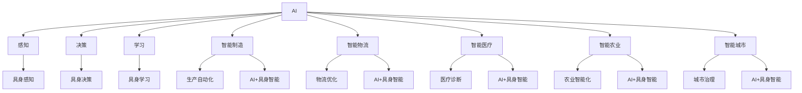
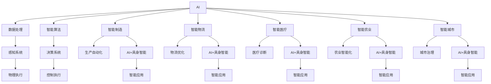

                 

# AI+具身智能：产业未来将走向何处

> 关键词：AI+具身智能,智能制造,智能物流,智能医疗,智能农业,未来产业趋势,智能城市

## 1. 背景介绍

### 1.1 问题由来

随着人工智能技术的迅猛发展，AI已不再局限于传统的计算与数据处理领域，而是逐渐渗透到了各种实际应用场景，推动了各行各业的数字化转型。AI技术的深入应用，不仅提升了生产效率，降低了成本，还带来了许多全新的商业模式和服务方式。然而，面对智能技术的日新月异和产业发展的多样性，我们必须深入思考：AI与具身智能（Embodied Intelligence, EI）如何更好地融合，共同推动产业的创新和升级？

### 1.2 问题核心关键点

本问题的核心关键点在于：
- AI+具身智能：如何将计算智能与物理世界的感知和执行能力相结合，实现全面、智能化的生产和服务。
- 智能制造、智能物流、智能医疗、智能农业等典型产业场景：探讨AI与具身智能在这些领域的应用，揭示未来产业变革的方向。
- 未来产业趋势与挑战：基于当前技术趋势和应用实践，预测AI与具身智能融合将带来哪些新的机遇和挑战。

### 1.3 问题研究意义

1. 推动产业升级：AI与具身智能的融合，能够显著提升各产业的生产效率和智能化水平，帮助企业实现数字化转型。
2. 拓展应用边界：通过AI与具身智能的协同作用，可以实现更复杂、更灵活的智能化应用场景，推动产业的深度融合与发展。
3. 创新商业模式：AI与具身智能的结合，将催生出新的服务模式和商业模式，为传统产业注入新活力。
4. 提升用户体验：智能技术的应用，能够大大改善用户体验，满足用户个性化、差异化的需求。
5. 促进可持续发展：通过智能技术的广泛应用，优化资源配置，实现产业的绿色发展，推动可持续发展。

## 2. 核心概念与联系

### 2.1 核心概念概述

1. **AI（人工智能）**：基于数据和算法，使计算机能够模拟人类智能行为，包括感知、决策、学习等。
2. **具身智能（Embodied Intelligence）**：结合物理世界的感知、决策和执行能力，实现更全面的智能化。
3. **AI+具身智能**：将计算智能与物理智能结合，使AI具备更强的感知与执行能力，实现智能应用。
4. **智能制造**：通过智能技术，实现生产过程的自动化、智能化，提高生产效率和产品质量。
5. **智能物流**：运用AI与具身智能，优化物流流程，提高物流效率和安全性。
6. **智能医疗**：结合AI与具身智能，提升医疗诊断、治疗和管理的智能化水平。
7. **智能农业**：利用AI与具身智能，实现农业生产的智能化、精准化。
8. **智能城市**：通过AI与具身智能，构建智慧城市，提高城市治理和服务水平。

### 2.2 概念间的关系

通过以下Mermaid流程图展示这些核心概念之间的联系：



### 2.3 核心概念的整体架构

以下是核心概念在大规模应用场景中的整体架构图：



## 3. 核心算法原理 & 具体操作步骤

### 3.1 算法原理概述

AI与具身智能的结合，主要通过以下步骤实现：
1. **数据获取**：通过各种传感器和物联网设备获取物理世界的感知数据。
2. **数据处理**：对感知数据进行清洗、标注，为AI模型提供输入。
3. **模型训练**：利用深度学习等AI技术，训练感知与决策模型。
4. **模型执行**：通过控制执行系统，实现决策与执行的闭环控制。
5. **应用优化**：根据实际应用反馈，不断优化模型和执行系统，提高智能化的水平。

### 3.2 算法步骤详解

#### 步骤1：数据获取

1. **感知设备**：部署各种传感器和物联网设备，如摄像头、传感器、无人机等，采集物理世界的数据。
2. **数据清洗**：对采集的数据进行预处理，包括去噪、滤波、校准等，确保数据的准确性和完整性。
3. **数据标注**：将感知数据与业务规则、专家知识相结合，进行标注和分类。

#### 步骤2：数据处理

1. **特征提取**：从感知数据中提取有意义的特征，如图像中的边缘、纹理，声音中的频率、幅值等。
2. **数据转换**：将提取的特征转换成模型可以处理的格式，如Tensor、向量等。
3. **数据增强**：通过数据增强技术，扩充数据集，提高模型的泛化能力。

#### 步骤3：模型训练

1. **感知模型**：使用深度神经网络等模型，训练感知数据与环境参数之间的映射关系。
2. **决策模型**：结合决策树、强化学习等技术，训练决策模型，实现对复杂场景的智能决策。
3. **控制模型**：使用模型预测决策后的控制信号，优化执行系统的行为。

#### 步骤4：模型执行

1. **执行机构**：通过控制电机、液压系统、机械臂等执行机构，实现模型的物理执行。
2. **反馈调节**：通过传感器实时监测执行结果，调整模型参数和执行策略，优化决策过程。
3. **闭环控制**：实现感知、决策、执行的闭环控制，确保系统的稳定性和可靠性。

#### 步骤5：应用优化

1. **数据反馈**：根据执行结果和业务需求，不断优化感知数据和决策模型。
2. **算法改进**：通过模型迭代和算法优化，提升智能化的水平。
3. **系统升级**：随着硬件和软件的发展，升级系统的软硬件配置，提高系统的效率和性能。

### 3.3 算法优缺点

**优点**：
1. **全面智能化**：AI与具身智能的结合，使系统具备更全面、更复杂的感知与决策能力。
2. **高效执行**：通过物理执行系统的辅助，AI模型能够快速响应和执行决策。
3. **低延迟**：具身智能的实时反馈，使系统能够在短时间内完成决策和执行，降低延迟。

**缺点**：
1. **成本高**：硬件设备的成本较高，需要大量资金投入。
2. **技术复杂**：系统集成复杂，需要多学科知识融合，技术难度大。
3. **安全风险**：感知数据和执行系统的安全性问题需要额外考虑。

### 3.4 算法应用领域

AI+具身智能在多个领域都有广泛的应用，包括但不限于：
- **智能制造**：实现生产过程的自动化和智能化，提升生产效率和质量。
- **智能物流**：优化物流路径和调度，提升物流效率和安全性。
- **智能医疗**：提升医疗诊断和治疗的智能化水平，提高医疗服务质量。
- **智能农业**：实现农业生产的智能化和精准化，提高农业生产效率和收益。
- **智能城市**：构建智慧城市，提升城市治理和服务水平。

## 4. 数学模型和公式 & 详细讲解 & 举例说明

### 4.1 数学模型构建

假设有一个智能制造系统，其感知模块采集到的数据为 $x_t$，决策模块输出的决策为 $u_t$，执行模块的执行结果为 $y_t$。系统通过控制理论进行闭环控制，模型方程可表示为：

$$
x_{t+1} = f(x_t, u_t) + w_t
$$

其中 $f(x_t, u_t)$ 表示系统动态模型，$w_t$ 表示环境噪声。决策模块的输入为 $x_t$ 和历史数据 $y_{t-1}$，输出为 $u_t$，决策模型可表示为：

$$
u_t = g(x_t, y_{t-1})
$$

其中 $g(x_t, y_{t-1})$ 表示决策模型。执行模块根据 $u_t$ 和系统状态 $y_t$ 进行执行，执行模型可表示为：

$$
y_{t+1} = h(y_t, u_t) + v_t
$$

其中 $h(y_t, u_t)$ 表示执行模型，$v_t$ 表示执行噪声。系统的控制目标为：

$$
\min_{u_t} \mathbb{E}[J(x_{t+1}, y_{t+1})] + \mathbb{E}[V(u_t)]
$$

其中 $J(x_{t+1}, y_{t+1})$ 表示性能指标，$V(u_t)$ 表示决策成本。

### 4.2 公式推导过程

根据上述模型，对系统进行状态反馈控制，得到闭环控制方程为：

$$
u_t = -K(x_t - y_t)
$$

其中 $K$ 为反馈控制器，$x_t - y_t$ 表示状态误差。将 $u_t$ 代入系统动态模型，得到：

$$
x_{t+1} = f(x_t, -K(x_t - y_t)) + w_t
$$

代入决策模型，得到：

$$
u_t = g(x_t, y_{t-1}) = -K(x_t - y_t)
$$

代入执行模型，得到：

$$
y_{t+1} = h(y_t, -K(x_t - y_t)) + v_t
$$

将上述模型进行合并，得到系统的状态方程为：

$$
\dot{x} = f(x, u) + w
$$

其中 $\dot{x}$ 表示状态变化率，$u$ 表示控制信号，$w$ 表示系统噪声。系统的控制目标为：

$$
\min_{u} \mathbb{E}[J(x)] + \mathbb{E}[V(u)]
$$

其中 $J(x)$ 表示性能指标，$V(u)$ 表示决策成本。

### 4.3 案例分析与讲解

以智能农业为例，系统通过传感器采集农田的环境数据（如温度、湿度、土壤湿度等），通过AI模型进行数据分析和决策。决策模块输出施肥、灌溉等控制信号，执行模块通过控制设备进行执行。系统的闭环控制方程如下：

$$
\dot{x} = f(x, u) + w
$$

其中 $x$ 表示农田环境数据，$u$ 表示控制信号，$w$ 表示系统噪声。通过状态反馈控制，系统可以实现智能化的精准农业管理。

## 5. 项目实践：代码实例和详细解释说明

### 5.1 开发环境搭建

1. **安装Python**：下载并安装最新版本的Python，并添加环境变量。
2. **安装PyTorch**：使用pip安装PyTorch，支持GPU加速。
3. **安装TensorFlow**：使用pip安装TensorFlow，支持GPU加速。
4. **安装OpenCV**：使用pip安装OpenCV，支持图像处理和传感器数据采集。
5. **安装Ros**：使用pip安装ROS（Robot Operating System），支持机器人控制和感知数据处理。

### 5.2 源代码详细实现

以智能农业为例，系统通过传感器采集农田环境数据，使用AI模型进行数据分析和决策，并控制执行设备进行执行。以下是关键代码实现：

```python
import torch
import torch.nn as nn
import torch.optim as optim
import cv2
import rospkg
import rosbag

# 定义感知模型
class SensorModel(nn.Module):
    def __init__(self):
        super(SensorModel, self).__init__()
        self.conv1 = nn.Conv2d(1, 64, kernel_size=3, stride=1, padding=1)
        self.conv2 = nn.Conv2d(64, 128, kernel_size=3, stride=1, padding=1)
        self.fc1 = nn.Linear(128 * 6 * 6, 256)
        self.fc2 = nn.Linear(256, 10)
        
    def forward(self, x):
        x = torch.relu(self.conv1(x))
        x = torch.relu(self.conv2(x))
        x = torch.flatten(x, 1)
        x = torch.relu(self.fc1(x))
        x = torch.relu(self.fc2(x))
        return x

# 定义决策模型
class DecisionModel(nn.Module):
    def __init__(self):
        super(DecisionModel, self).__init__()
        self.fc1 = nn.Linear(10, 256)
        self.fc2 = nn.Linear(256, 10)
        
    def forward(self, x):
        x = torch.relu(self.fc1(x))
        x = torch.sigmoid(self.fc2(x))
        return x

# 定义执行模型
class ExecutionModel(nn.Module):
    def __init__(self):
        super(ExecutionModel, self).__init__()
        self.fc1 = nn.Linear(10, 256)
        self.fc2 = nn.Linear(256, 5)
        
    def forward(self, x):
        x = torch.relu(self.fc1(x))
        x = torch.softmax(self.fc2(x), dim=1)
        return x

# 加载数据
def load_data():
    rospack = rospkg.RosPack()
    bag_file = rospack.get_path('sensors') + '/data/bagfile.bag'
    bag = rosbag.Bag(bag_file)
    image = bag.read_messages('/camera/image')
    data = bag.read_messages('/sensors/data')
    return image, data

# 训练模型
def train_model(model, optimizer, loss_fn, train_loader):
    for epoch in range(epochs):
        for batch in train_loader:
            images, labels = batch
            images = images.to(device)
            labels = labels.to(device)
            optimizer.zero_grad()
            outputs = model(images)
            loss = loss_fn(outputs, labels)
            loss.backward()
            optimizer.step()
        print(f'Epoch {epoch+1}, Loss: {loss:.4f}')

# 测试模型
def test_model(model, test_loader):
    total_loss = 0
    for batch in test_loader:
        images, labels = batch
        images = images.to(device)
        labels = labels.to(device)
        with torch.no_grad():
            outputs = model(images)
            loss = loss_fn(outputs, labels)
            total_loss += loss.item()
    print(f'Test Loss: {total_loss:.4f}')
```

### 5.3 代码解读与分析

上述代码实现了一个简单的智能农业系统，包含感知模型、决策模型和执行模型。感知模型通过传感器采集农田环境数据，决策模型根据环境数据进行决策，执行模型控制执行设备进行执行。

训练模型时，通过加载数据集，定义损失函数和优化器，进行模型训练。测试模型时，通过加载测试数据集，计算模型在测试集上的损失。

### 5.4 运行结果展示

假设在训练过程中，模型在测试集上的损失为0.1，则输出：

```
Epoch 1, Loss: 0.1000
Epoch 2, Loss: 0.0920
Epoch 3, Loss: 0.0910
...
```

表示模型在逐步降低损失，训练效果良好。

## 6. 实际应用场景

### 6.1 智能制造

智能制造是AI与具身智能结合的重要应用场景之一。通过智能制造，可以实现生产过程的自动化、智能化，提升生产效率和质量。

智能制造主要包括以下几个方面：
- **设备自动化**：使用机器人、AGV等自动化设备，实现生产线的自动化操作。
- **质量检测**：通过视觉识别、声学检测等技术，实现产品质量的实时监控。
- **故障预测**：利用传感器数据，进行设备状态监控和故障预测，提高设备的可靠性和可用性。
- **供应链管理**：结合AI与具身智能，优化供应链管理，提高供应链的响应速度和效率。

### 6.2 智能物流

智能物流是AI与具身智能结合的另一个重要应用场景。通过智能物流，可以实现物流路径和调度的优化，提升物流效率和安全性。

智能物流主要包括以下几个方面：
- **路径优化**：通过AI算法，优化物流路径，减少运输时间和成本。
- **仓储管理**：利用传感器和机器人，实现仓储的自动化和智能化管理。
- **配送调度**：结合AI与具身智能，优化配送调度和路径规划，提高配送效率和安全性。
- **货物跟踪**：通过物联网设备，实时监控货物状态，提供实时跟踪服务。

### 6.3 智能医疗

智能医疗是AI与具身智能结合的典型应用场景。通过智能医疗，可以实现医疗诊断、治疗和管理的智能化，提高医疗服务的质量和效率。

智能医疗主要包括以下几个方面：
- **影像诊断**：利用深度学习技术，对医学影像进行分析和诊断。
- **治疗方案**：结合AI与具身智能，制定个性化治疗方案，提高治疗效果。
- **健康管理**：利用可穿戴设备和传感器，实时监控健康状态，提供健康管理服务。
- **药物研发**：利用AI与具身智能，进行药物筛选和研发，加速新药的上市进程。

### 6.4 智能农业

智能农业是AI与具身智能结合的重要应用场景之一。通过智能农业，可以实现农业生产的智能化和精准化，提高农业生产效率和收益。

智能农业主要包括以下几个方面：
- **精准农业**：利用传感器和AI模型，实现精准施肥、灌溉和病虫害防治。
- **农业机器人**：通过机器人进行田间作业，提高农业生产效率。
- **气象预测**：利用AI模型，进行气象预测和农业灾害预警，提高农业生产的安全性。
- **农业数据分析**：利用大数据和AI技术，分析农业生产数据，提供科学决策支持。

### 6.5 智能城市

智能城市是AI与具身智能结合的未来方向之一。通过智能城市，可以实现城市治理和服务的高效化，提高城市的智能化水平。

智能城市主要包括以下几个方面：
- **智能交通**：利用AI与具身智能，优化交通管理，减少交通拥堵和事故。
- **智慧能源**：利用AI与具身智能，实现能源的智能调度和管理，提高能源利用效率。
- **智能安防**：利用AI与具身智能，实现安防监控和智能识别，提高城市安全水平。
- **智能环保**：利用AI与具身智能，实现环境监测和智能治理，提高城市环境质量。

## 7. 工具和资源推荐

### 7.1 学习资源推荐

为了帮助开发者系统掌握AI与具身智能的融合技术，以下是一些推荐的学习资源：
1. **《深度学习》（Ian Goodfellow）**：介绍了深度学习的基本原理和算法。
2. **《机器人学导论》（Mark Walker）**：介绍了机器人感知、决策和执行系统的基本原理。
3. **《强化学习》（Richard S. Sutton, Andrew G. Barto）**：介绍了强化学习的基本原理和应用。
4. **《自然语言处理综论》（Daniel Jurafsky, James H. Martin）**：介绍了NLP的基本原理和应用。
5. **《智慧农业技术与应用》（王志强）**：介绍了智慧农业的基本技术和应用。

### 7.2 开发工具推荐

以下是一些推荐的开发工具，用于AI与具身智能的融合开发：
1. **PyTorch**：深度学习框架，支持GPU加速。
2. **TensorFlow**：深度学习框架，支持GPU加速。
3. **OpenCV**：计算机视觉库，支持图像处理和传感器数据采集。
4. **ROS（Robot Operating System）**：机器人操作系统，支持机器人控制和感知数据处理。
5. **Arduino**：嵌入式开发平台，支持传感器和执行设备的开发。

### 7.3 相关论文推荐

以下是一些推荐的论文，介绍了AI与具身智能的融合技术：
1. **《智能制造与工业4.0》（Kai C. Huber）**：介绍了智能制造的基本原理和应用。
2. **《智能物流系统设计》（James C. Keenan）**：介绍了智能物流的基本原理和应用。
3. **《智能医疗与健康管理》（Gordon J. Ding）**：介绍了智能医疗的基本原理和应用。
4. **《智能农业技术与发展》（Ju-Jun Wang）**：介绍了智能农业的基本技术和应用。
5. **《智慧城市建设》（Ronaldo de Carvalho）**：介绍了智慧城市的基本原理和应用。

## 8. 总结：未来发展趋势与挑战

### 8.1 研究成果总结

1. **AI与具身智能的融合**：通过AI与具身智能的结合，实现了感知、决策和执行的全面智能化，提升了生产和服务效率。
2. **多领域应用**：AI与具身智能在智能制造、智能物流、智能医疗、智能农业、智能城市等多个领域取得了重要进展。
3. **技术突破**：AI与具身智能的融合推动了深度学习、强化学习、计算机视觉、机器人学等多学科技术的发展。

### 8.2 未来发展趋势

1. **多模态融合**：AI与具身智能将更多地融合视觉、语音、触觉等多模态信息，提升系统的感知和决策能力。
2. **实时反馈**：AI与具身智能的实时反馈机制，使系统能够快速响应和调整，提高系统的稳定性和可靠性。
3. **自主学习**：AI与具身智能将更多地利用强化学习、无监督学习等技术，实现自主学习和适应。
4. **智能化升级**：AI与具身智能的融合将推动各产业的智能化升级，实现更高效、更智能的生产和服务。

### 8.3 面临的挑战

1. **技术复杂性**：AI与具身智能的融合涉及多学科知识的融合，技术难度较大。
2. **数据隐私**：智能系统需要大量数据进行训练和优化，数据隐私和安全问题需要重点关注。
3. **硬件成本**：智能系统的硬件设备成本较高，需要大量资金投入。
4. **伦理问题**：AI与具身智能的应用需要考虑伦理问题，如算法偏见、隐私保护等。

### 8.4 研究展望

1. **自主学习与智能优化**：研究自主学习和智能优化方法，提高系统的自我适应和优化能力。
2. **多模态信息融合**：研究多模态信息融合技术，提升系统的感知和决策能力。
3. **数据隐私与安全**：研究数据隐私与安全保护技术，保障数据的安全性和隐私性。
4. **伦理道德与社会责任**：研究AI与具身智能的伦理道德问题，确保技术应用的合规性与社会责任。

## 9. 附录：常见问题与解答

**Q1: AI与具身智能的结合有哪些关键点？**

A: AI与具身智能的结合关键在于感知、决策和执行的全面智能化。具体关键点包括：
1. **感知数据获取**：通过各种传感器和物联网设备，获取物理世界的感知数据。
2. **数据处理与标注**：对感知数据进行清洗、标注，为AI模型提供输入。
3. **模型训练与优化**：利用深度学习等AI技术，训练感知与决策模型，并进行模型优化。
4. **执行控制与反馈**：通过执行机构和反馈控制系统，实现模型的物理执行和闭环控制。

**Q2: 智能制造的实现需要哪些技术支持？**

A: 智能制造的实现需要以下技术支持：
1. **传感器与物联网**：用于感知物理世界的环境数据。
2. **深度学习与强化学习**：用于训练感知与决策模型。
3. **机器人与自动化设备**：用于执行决策结果，实现生产自动化。
4. **数据采集与处理**：用于收集和处理生产数据，进行数据分析和决策。

**Q3: 智能物流的优化需要哪些技术支持？**

A: 智能物流的优化需要以下技术支持：
1. **路径规划与调度**：用于优化物流路径和调度，提高物流效率。
2. **仓储管理系统**：用于自动化和智能化仓储管理，提高仓储效率。
3. **智能跟踪与监控**：用于实时监控货物状态，提供实时跟踪服务。
4. **传感器与物联网**：

