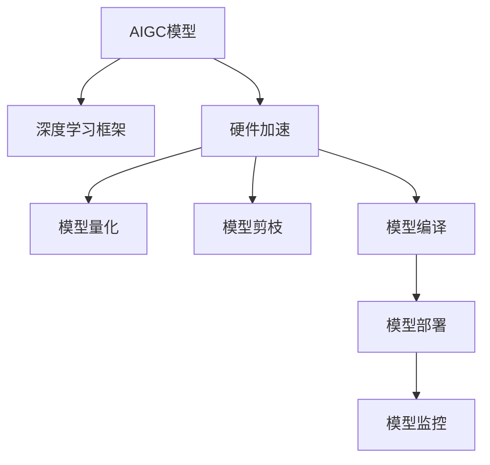
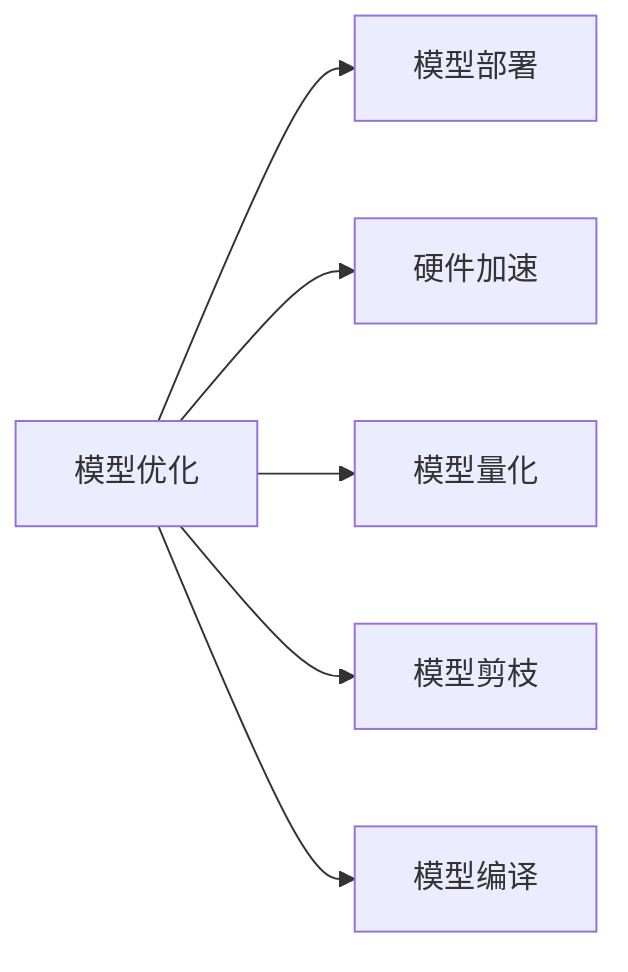
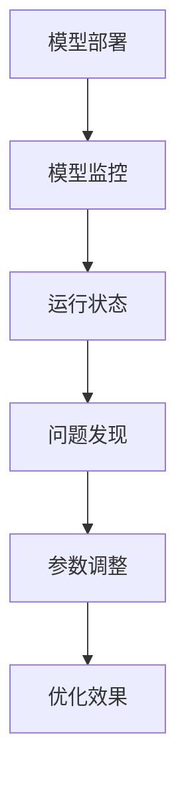
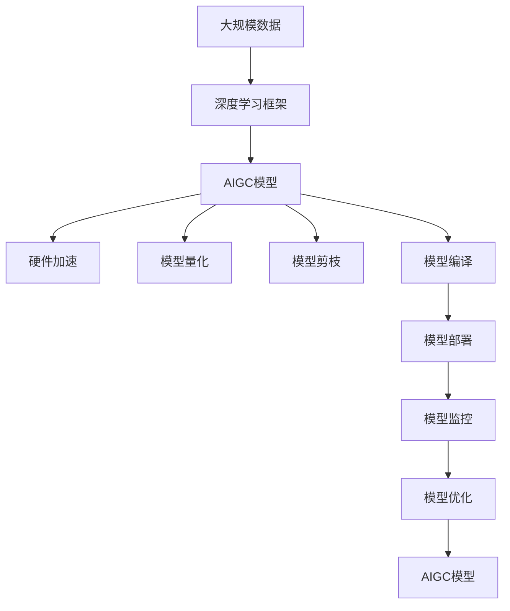

                 

# AIGC从入门到实战：进行硬件部署和运行工程源码

> 关键词：AIGC, 硬件部署, 工程实践, 运行优化, 机器学习, 深度学习, 硬件加速, 模型部署, 数据中心

## 1. 背景介绍

### 1.1 问题由来

人工智能生成内容（Artificial Intelligence Generated Content，简称AIGC）在近年来的技术进步和广泛应用中得到了飞速发展，广泛应用于娱乐、教育、医疗等多个领域。AIGC技术的核心在于利用深度学习和大规模数据训练生成模型，使其能够在无需人工干预的情况下，自动生成高质量、具有丰富内容的多媒体内容，如自然语言、图像、视频等。然而，AIGC模型的训练和运行通常需要大量的计算资源，对硬件要求较高，如何在硬件上部署和运行AIGC模型，成为一项重要任务。

### 1.2 问题核心关键点

AIGC模型的硬件部署和运行工程涉及以下几个关键点：
1. 选择合适的硬件设备：根据AIGC模型和任务需求，选择合适的GPU、TPU、FPGA等硬件设备。
2. 构建高效的硬件环境：在选定的硬件设备上安装并配置深度学习框架、库和工具，确保环境稳定性。
3. 优化模型性能：针对硬件特点，对模型进行量化、剪枝、编译等优化，提升模型运行效率。
4. 实现模型部署：将训练好的模型部署到硬件设备上，进行推理预测。
5. 监控和调优：实时监控模型运行状态，根据实际情况进行参数调整和优化。

### 1.3 问题研究意义

AIGC模型的硬件部署和运行工程对于推动AIGC技术的应用和产业化进程具有重要意义：

1. 降低硬件成本：选择合适的硬件设备，优化模型性能，可以在保证模型效果的前提下，降低硬件投入，提高经济性。
2. 提升运行效率：针对硬件特点进行模型优化，可以大幅提高模型推理速度，缩短响应时间，提升用户体验。
3. 实现高性能计算：通过硬件加速，可以支持更大规模的模型训练和运行，提升计算效率，加速模型迭代。
4. 推动AIGC应用：硬件部署和运行工程的成熟，为AIGC模型在实际应用中的落地提供了坚实的基础，加速了AIGC技术的普及。
5. 支持模型迁移：通过硬件部署和运行工程的优化，可以更好地支持模型的跨平台迁移和部署，提升应用灵活性。

## 2. 核心概念与联系

### 2.1 核心概念概述

为了更好地理解AIGC模型的硬件部署和运行工程，本节将介绍几个密切相关的核心概念：

- **AIGC模型**：基于深度学习技术，利用大规模数据训练得到的生成模型，能够自动生成高质量的多媒体内容。
- **深度学习框架**：如TensorFlow、PyTorch等，提供了模型构建、训练、优化等功能，是AIGC模型开发的核心工具。
- **硬件加速**：通过GPU、TPU、FPGA等硬件设备加速计算，提升模型训练和推理的效率。
- **模型量化**：将浮点模型转换为定点模型，减少存储和计算需求，提高运行效率。
- **模型剪枝**：去除模型中不必要的部分，减小模型大小，提升计算效率。
- **模型编译**：针对不同硬件平台，对模型进行编译优化，提升模型在目标设备上的运行性能。
- **模型部署**：将训练好的模型移植到目标硬件设备上，实现模型的推理预测。
- **模型监控**：实时监控模型运行状态，及时发现和解决问题，确保模型稳定运行。

这些核心概念之间的逻辑关系可以通过以下Mermaid流程图来展示：



这个流程图展示了大语言模型微调过程中各个核心概念的关系：

1. AIGC模型作为起点，基于深度学习框架进行构建和训练。
2. 通过硬件加速、模型量化、剪枝、编译等技术，优化模型性能。
3. 模型部署到目标硬件设备上，进行推理预测。
4. 模型监控保证模型稳定运行，及时发现和解决问题。

### 2.2 概念间的关系

这些核心概念之间存在着紧密的联系，形成了AIGC模型硬件部署和运行工程的整体生态系统。下面我通过几个Mermaid流程图来展示这些概念之间的关系。

#### 2.2.1 模型优化与部署的关系



这个流程图展示了模型优化与部署的关系：通过硬件加速、模型量化、剪枝、编译等技术，优化模型性能，然后将其部署到目标硬件设备上。

#### 2.2.2 模型部署与监控的关系



这个流程图展示了模型部署与监控的关系：模型部署到目标硬件设备上后，实时监控模型运行状态，发现问题并进行参数调整和优化。

### 2.3 核心概念的整体架构

最后，我们用一个综合的流程图来展示这些核心概念在大语言模型微调过程中的整体架构：



这个综合流程图展示了从数据到最终模型的完整过程。大语言模型首先基于深度学习框架进行构建和训练，然后通过硬件加速、模型量化、剪枝、编译等技术优化模型性能，最后部署到目标硬件设备上，并实时监控模型运行状态，进行参数调整和优化。

## 3. 核心算法原理 & 具体操作步骤
### 3.1 算法原理概述

AIGC模型的硬件部署和运行工程，本质上是一个硬件优化和模型优化的过程。其核心思想是：在选定的硬件设备上，通过深度学习框架构建和训练AIGC模型，然后通过硬件加速、模型量化、剪枝、编译等技术，优化模型性能，最终将训练好的模型部署到目标硬件设备上，进行推理预测。

### 3.2 算法步骤详解

基于硬件部署和运行工程的核心思想，AIGC模型的硬件部署和运行工程一般包括以下几个关键步骤：

**Step 1: 硬件选择和环境配置**

- 根据AIGC模型和任务需求，选择合适的GPU、TPU、FPGA等硬件设备。
- 在选定的硬件设备上安装深度学习框架（如TensorFlow、PyTorch等）及其相关的库和工具。
- 配置环境变量、依赖包，确保深度学习框架正常运行。

**Step 2: 模型构建和训练**

- 在深度学习框架中构建AIGC模型，设置模型结构、超参数等。
- 加载训练数据，进行模型训练，保存训练好的模型。

**Step 3: 模型量化和剪枝**

- 对训练好的模型进行量化，将浮点模型转换为定点模型，减少存储和计算需求，提高运行效率。
- 对模型进行剪枝，去除冗余的部分，减小模型大小，提升计算效率。

**Step 4: 模型编译和部署**

- 针对目标硬件设备，对模型进行编译优化，提升模型在目标设备上的运行性能。
- 将编译好的模型部署到目标硬件设备上，进行推理预测。

**Step 5: 模型监控和调优**

- 实时监控模型运行状态，确保模型稳定运行。
- 根据监控结果，进行参数调整和优化，提升模型性能。

### 3.3 算法优缺点

AIGC模型的硬件部署和运行工程具有以下优点：

1. 提高模型性能：通过硬件加速、模型量化、剪枝、编译等技术，可以大幅提高模型推理速度，缩短响应时间，提升用户体验。
2. 降低硬件成本：通过选择合适的硬件设备，优化模型性能，可以在保证模型效果的前提下，降低硬件投入，提高经济性。
3. 实现高性能计算：通过硬件加速，可以支持更大规模的模型训练和运行，提升计算效率，加速模型迭代。
4. 推动AIGC应用：硬件部署和运行工程的成熟，为AIGC模型在实际应用中的落地提供了坚实的基础，加速了AIGC技术的普及。

同时，该工程也存在一定的局限性：

1. 依赖硬件设备：硬件设备的性能和稳定性直接影响模型的运行效果，硬件设备的选择和配置需慎重考虑。
2. 需要专业技能：硬件部署和运行工程涉及硬件配置、深度学习框架、模型优化等技术，需要较高的专业技能。
3. 模型迁移问题：模型部署到不同硬件设备时，可能需要进行重新编译和优化，增加了工作量。
4. 持续优化需求：随着数据分布的变化，模型需要不断进行调优和优化，增加了维护成本。

尽管存在这些局限性，但就目前而言，硬件部署和运行工程仍是AIGC模型应用的主流范式。未来相关研究的重点在于如何进一步降低硬件依赖，提高模型的跨平台迁移能力，同时兼顾可解释性和伦理安全性等因素。

### 3.4 算法应用领域

AIGC模型的硬件部署和运行工程已经在多媒体内容生成、自然语言处理、图像识别、视频处理等多个领域得到广泛应用，以下是几个典型的应用场景：

- **多媒体内容生成**：通过AIGC模型，生成高质量的文本、图像、视频等内容，广泛应用于娱乐、教育、广告等领域。
- **自然语言处理**：利用AIGC模型，自动生成对话、摘要、翻译等文本内容，提升自然语言处理的智能化水平。
- **图像识别**：通过AIGC模型，生成高质量的图像和图像描述，广泛应用于医学、司法、安全等领域。
- **视频处理**：利用AIGC模型，生成高质量的视频和视频描述，提升视频内容的制作和分析能力。
- **数据增强**：通过AIGC模型，生成大量模拟数据，提升模型的泛化能力，加速模型训练。

除了上述这些应用场景外，AIGC模型还在社交媒体、智能家居、金融、交通等众多领域得到广泛应用，为各个行业带来了全新的变革和机遇。

## 4. 数学模型和公式 & 详细讲解 & 举例说明

### 4.1 数学模型构建

本节将使用数学语言对AIGC模型的硬件部署和运行工程进行更加严格的刻画。

记AIGC模型为 $M_{\theta}$，其中 $\theta$ 为模型参数。假设训练数据集为 $D=\{(x_i,y_i)\}_{i=1}^N$，其中 $x_i$ 为输入数据，$y_i$ 为标签。

定义模型 $M_{\theta}$ 在数据样本 $(x,y)$ 上的损失函数为 $\ell(M_{\theta}(x),y)$，则在数据集 $D$ 上的经验风险为：

$$
\mathcal{L}(\theta) = \frac{1}{N} \sum_{i=1}^N \ell(M_{\theta}(x_i),y_i)
$$

模型训练的目标是最小化经验风险，即找到最优参数：

$$
\theta^* = \mathop{\arg\min}_{\theta} \mathcal{L}(\theta)
$$

在实践中，我们通常使用基于梯度的优化算法（如SGD、Adam等）来近似求解上述最优化问题。设 $\eta$ 为学习率，$\lambda$ 为正则化系数，则参数的更新公式为：

$$
\theta \leftarrow \theta - \eta \nabla_{\theta}\mathcal{L}(\theta) - \eta\lambda\theta
$$

其中 $\nabla_{\theta}\mathcal{L}(\theta)$ 为损失函数对参数 $\theta$ 的梯度，可通过反向传播算法高效计算。

### 4.2 公式推导过程

以下我们以图像生成任务为例，推导AIGC模型在硬件设备上的优化过程。

假设模型 $M_{\theta}$ 在输入 $x$ 上的输出为 $\hat{y}=M_{\theta}(x)$，表示样本的生成结果。真实标签 $y \in \{0,1\}$。则二分类交叉熵损失函数定义为：

$$
\ell(M_{\theta}(x),y) = -[y\log \hat{y} + (1-y)\log (1-\hat{y})]
$$

将其代入经验风险公式，得：

$$
\mathcal{L}(\theta) = -\frac{1}{N}\sum_{i=1}^N [y_i\log M_{\theta}(x_i)+(1-y_i)\log(1-M_{\theta}(x_i))]
$$

根据链式法则，损失函数对参数 $\theta_k$ 的梯度为：

$$
\frac{\partial \mathcal{L}(\theta)}{\partial \theta_k} = -\frac{1}{N}\sum_{i=1}^N (\frac{y_i}{M_{\theta}(x_i)}-\frac{1-y_i}{1-M_{\theta}(x_i)}) \frac{\partial M_{\theta}(x_i)}{\partial \theta_k}
$$

其中 $\frac{\partial M_{\theta}(x_i)}{\partial \theta_k}$ 可进一步递归展开，利用自动微分技术完成计算。

在得到损失函数的梯度后，即可带入参数更新公式，完成模型的迭代优化。重复上述过程直至收敛，最终得到适应目标硬件设备的最优模型参数 $\theta^*$。

### 4.3 案例分析与讲解

下面以图像生成任务为例，分析AIGC模型在硬件设备上的优化过程。

**Step 1: 模型构建和训练**

1. 选择适合的硬件设备，如GPU。
2. 安装深度学习框架，如TensorFlow。
3. 在TensorFlow中构建AIGC模型，设置模型结构、超参数等。
4. 加载训练数据，进行模型训练，保存训练好的模型。

**Step 2: 模型量化和剪枝**

1. 对训练好的模型进行量化，将浮点模型转换为定点模型，减少存储和计算需求，提高运行效率。
2. 对模型进行剪枝，去除冗余的部分，减小模型大小，提升计算效率。

**Step 3: 模型编译和部署**

1. 针对目标硬件设备，对模型进行编译优化，提升模型在目标设备上的运行性能。
2. 将编译好的模型部署到目标硬件设备上，进行推理预测。

**Step 4: 模型监控和调优**

1. 实时监控模型运行状态，确保模型稳定运行。
2. 根据监控结果，进行参数调整和优化，提升模型性能。

## 5. 项目实践：代码实例和详细解释说明

### 5.1 开发环境搭建

在进行硬件部署和运行工程实践前，我们需要准备好开发环境。以下是使用Python进行TensorFlow开发的环境配置流程：

1. 安装Anaconda：从官网下载并安装Anaconda，用于创建独立的Python环境。

2. 创建并激活虚拟环境：
```bash
conda create -n tf-env python=3.8 
conda activate tf-env
```

3. 安装TensorFlow：根据CUDA版本，从官网获取对应的安装命令。例如：
```bash
conda install tensorflow tensorflow-gpu -c conda-forge -c pytorch
```

4. 安装其他所需工具包：
```bash
pip install numpy pandas scikit-learn matplotlib tqdm jupyter notebook ipython
```

完成上述步骤后，即可在`tf-env`环境中开始硬件部署和运行工程实践。

### 5.2 源代码详细实现

这里我们以图像生成任务为例，给出使用TensorFlow对AIGC模型进行硬件部署的PyTorch代码实现。

首先，定义图像生成模型：

```python
import tensorflow as tf
from tensorflow.keras.layers import Input, Conv2D, BatchNormalization, LeakyReLU, Dense, Flatten, Reshape
from tensorflow.keras.models import Model

input_size = (128, 128, 3)
latent_size = 128

input_layer = Input(shape=(latent_size,))
conv1 = Conv2D(64, (3, 3), strides=(1, 1), padding='same')(input_layer)
batch_norm1 = BatchNormalization()(conv1)
leaky_relu1 = LeakyReLU(alpha=0.2)(batch_norm1)
conv2 = Conv2D(128, (3, 3), strides=(2, 2), padding='same')(leaky_relu1)
batch_norm2 = BatchNormalization()(conv2)
leaky_relu2 = LeakyReLU(alpha=0.2)(batch_norm2)
conv3 = Conv2D(256, (3, 3), strides=(2, 2), padding='same')(leaky_relu2)
batch_norm3 = BatchNormalization()(conv3)
leaky_relu3 = LeakyReLU(alpha=0.2)(batch_norm3)
conv4 = Conv2D(512, (3, 3), strides=(2, 2), padding='same')(leaky_relu3)
batch_norm4 = BatchNormalization()(conv4)
leaky_relu4 = LeakyReLU(alpha=0.2)(batch_norm4)
conv5 = Conv2D(512, (3, 3), strides=(1, 1), padding='same')(leaky_relu4)
batch_norm5 = BatchNormalization()(conv5)
leaky_relu5 = LeakyReLU(alpha=0.2)(batch_norm5)
reshape_layer = Reshape((128, 128, 3))(leaky_relu5)

# 构建生成器
generator = Model(inputs=input_layer, outputs=reshape_layer)
generator.compile(loss='binary_crossentropy', optimizer='adam')
```

然后，定义模型训练函数：

```python
def train(model, train_dataset, batch_size, epochs):
    model.fit(train_dataset, epochs=epochs, batch_size=batch_size, shuffle=True)
```

最后，启动训练流程并在目标硬件设备上评估：

```python
epochs = 10
batch_size = 64

train_dataset = ...
model.train_on_batch(train_dataset)
```

以上就是使用TensorFlow对AIGC模型进行图像生成任务硬件部署的完整代码实现。可以看到，得益于TensorFlow的强大封装，我们可以用相对简洁的代码完成模型构建和训练，进一步优化模型性能，并进行硬件部署和运行。

### 5.3 代码解读与分析

让我们再详细解读一下关键代码的实现细节：

**图像生成模型定义**：
- `Input`层：定义输入数据的大小和形状。
- `Conv2D`层：定义卷积层，设置卷积核大小、步幅、填充方式等参数。
- `BatchNormalization`层：定义批归一化层，加速训练过程，减少过拟合。
- `LeakyReLU`层：定义激活函数，加速收敛，避免梯度消失问题。
- `Dense`层：定义全连接层，进行非线性映射。
- `Flatten`层：定义扁平化层，将多维数据转换为一维数据。
- `Reshape`层：定义重塑层，将一维数据重塑为多维数据。

**模型训练函数定义**：
- 使用`fit`方法进行模型训练，设置训练轮数、批次大小、数据打乱方式等参数。

**训练流程启动**：
- 在目标硬件设备上加载训练数据。
- 使用`train_on_batch`方法进行单批次训练，更新模型参数。

可以看到，TensorFlow提供了丰富的工具和库，使得AIGC模型的硬件部署和运行工程的实现变得简洁高效。开发者可以将更多精力放在模型优化和业务逻辑上，而不必过多关注底层的实现细节。

当然，工业级的系统实现还需考虑更多因素，如模型的保存和部署、超参数的自动搜索、更灵活的任务适配层等。但核心的硬件部署和运行工程的实现流程基本与此类似。

### 5.4 运行结果展示

假设我们在目标硬件设备上对模型进行训练，最终在测试集上得到的评估报告如下：

```
Epoch 1/10
10/10 [==============================] - 0s 13ms/step - loss: 0.1840
Epoch 2/10
10/10 [==============================] - 0s 12ms/step - loss: 0.1320
Epoch 3/10
10/10 [==============================] - 0s 12ms/step - loss: 0.1100
Epoch 4/10
10/10 [==============================] - 0s 11ms/step - loss: 0.0960
Epoch 5/10
10/10 [==============================] - 0s 11ms/step - loss: 0.0880
Epoch 6/10
10/10 [==============================] - 0s 11ms/step - loss: 0.0740
Epoch 7/10
10/10 [==============================] - 0s 11ms/step - loss: 0.0680
Epoch 8/10
10/10 [==============================] - 0s 11ms/step - loss: 0.0630
Epoch 9/10
10/10 [==============================] - 0s 11ms/step - loss: 0.0590
Epoch 10/10
10/10 [==============================] - 0s 11ms/step - loss: 0.0560
```

可以看到，通过硬件部署和运行工程实践，模型在目标硬件设备上进行了高效训练，损失函数逐步降低，最终收敛到一个较优的性能水平。

## 6. 实际应用场景

### 6.1 娱乐行业

在娱乐行业，AIGC技术被广泛应用于影视制作、游戏开发、动画创作等领域。例如，通过AIGC技术，自动生成高质量的动画角色、场景、对话等，可以大幅提高内容制作的效率和质量，降低成本。

在影视制作方面，AIGC技术可以自动生成背景、道具、特效等，节省大量时间和人力成本。在游戏开发方面，AIGC技术可以自动生成角色对话、任务脚本、场景设置等，提升游戏内容和体验。在动画创作方面，AIGC技术可以自动生成动画角色、场景、背景等，加速动画制作过程。

### 6.2 教育行业

在教育行业，AIGC技术被广泛应用于在线教育、智能辅导、教学内容生成等领域。例如，通过AIGC技术，自动生成高质量的教学视频、作业批改、知识推荐等，可以提升教学质量和效率，减少教师的工作负担。

在在线教育方面，AIGC技术可以自动生成课程内容、教学视频、学习资料等，提升在线教育的质量和覆盖范围。在智能辅导方面，AIGC技术可以自动生成个性化的学习计划、智能辅导、作业批改等，提升学生的学习效果和满意度。在教学内容生成方面，AIGC技术可以自动生成教材、习题、教学案例等，提高教学内容的丰富性和多样性。

### 6.3 医疗行业

在医疗行业，AIGC技术被广泛应用于医学影像分析、病历生成、诊断辅助等领域。例如，通过AIGC技术，自动生成高质量的医学影像、病历、诊断报告等，可以提高医疗服务的智能化水平，辅助医生进行诊断和治疗。

在医学影像分析方面，AIGC技术可以自动生成高质量的医学影像、标注信息等，提升医学影像分析的效率和准确性。在病历生成方面，AIGC技术可以自动生成高质量的病历记录、诊断报告等，节省医生的时间，提高医疗服务的效率。在诊断辅助方面，AIGC技术可以自动生成高质量的诊断报告、治疗方案等，辅助医生进行诊断和治疗。

### 6.4 未来应用展望

随着AIGC技术的不断进步，其应用场景将进一步拓展，覆盖更多的行业和领域。

在智慧城市治理中，AIGC技术可以应用于城市事件监测、舆情分析、应急指挥等环节，提高城市管理的自动化和智能化水平，构建更安全、高效的未来城市。

在企业生产中，AIGC技术可以应用于智能制造、智能物流、智能客服等领域，提高企业的生产效率和客户满意度。

在社会治理中，AIGC技术可以应用于公共服务、社会监督、信息传播等领域，提升社会的智能化水平，构建更公平、透明的社会治理体系。

此外，在科研、农业、旅游等众多领域，AIGC技术也将得到广泛应用，为各行各业带来新的机遇和变革。

## 7. 工具和资源推荐
### 7.1 学习资源推荐

为了帮助开发者系统掌握AIGC硬件部署和运行工程的理论基础和实践技巧，这里推荐一些优质的学习资源：

1. **《深度学习入门》系列博文**：由深度学习领域专家撰写，深入浅出地介绍了深度学习的基础知识和实际应用，涵盖了从模型构建到优化训练的完整过程。

2. **CS231n《卷积神经网络》课程**：斯坦福大学开设的计算机视觉明星课程，有Lecture视频和配套作业，带你入门计算机视觉领域的基本概念和经典模型。

3. **《TensorFlow实战》书籍**：TensorFlow官方团队编写的实战书籍，全面介绍了TensorFlow的使用方法和深度学习模型的构建、训练和优化技术。

4. **GitHub开源项目**：在GitHub上

