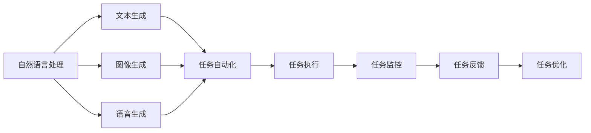

                 

# AIGC助推下的企业工作任务原子化

随着人工智能（AI）技术的快速发展，人工智能生成内容（AIGC）已成为推动各行各业创新和效率提升的重要工具。特别是在企业工作任务自动化和智能化方面，AIGC展现了巨大潜力。本文将深入探讨AIGC在企业工作任务自动化中的具体应用，以及如何构建原子化的工作任务系统，为企业智能化转型提供切实可行的方案。

## 1. 背景介绍

### 1.1 问题由来

在传统的企业管理中，任务分配、执行和反馈往往依赖于人工操作，流程繁琐、效率低下。特别是对于大规模、高复杂度的任务，如项目规划、客户沟通、报告撰写等，往往需要耗费大量的人力物力，且难以保证一致性和质量。这些问题在一定程度上限制了企业的发展速度和竞争力。

近年来，随着AI技术的进步，AIGC技术逐渐崭露头角，其在文本生成、图像处理、语音识别等领域取得了显著成果。AIGC不仅能大幅提升工作效率，还能帮助企业构建更加灵活、智能化的工作任务系统，实现任务的全流程自动化和智能化。

### 1.2 问题核心关键点

AIGC在企业工作任务自动化中的应用，主要围绕以下几个关键点展开：

- **任务自动化**：通过AI技术自动处理任务，减少人工干预，提高任务处理效率。
- **任务智能化**：利用AI技术分析任务需求，生成最优解决方案，提升任务决策质量。
- **任务可控性**：引入监控和反馈机制，确保任务执行效果符合预期，增强任务可控性。
- **任务协同化**：构建多任务协同机制，优化资源配置，提高任务执行效率。

通过AIGC技术的应用，企业可以有效应对任务自动化、智能化和可控性需求，实现工作任务的原子化，即每个任务都可以独立、灵活、高效地执行，提升整体运营效率。

## 2. 核心概念与联系

### 2.1 核心概念概述

AIGC（Artificial Intelligence Generated Content，人工智能生成内容），是指通过AI技术自动生成文本、图像、音频等内容的技术。AIGC在企业工作任务自动化中的应用，主要涉及以下几个核心概念：

- **自然语言处理（NLP）**：通过AI技术理解和生成人类语言，实现文本内容的自动化生成。
- **计算机视觉（CV）**：利用AI技术处理和分析图像、视频等视觉数据，实现图像内容的自动化生成。
- **语音识别与合成**：通过AI技术实现语音数据的自动处理和生成，提升语音交互体验。
- **任务自动化平台**：构建基于AIGC技术的任务自动化平台，实现任务的全流程自动化和智能化。

这些核心概念通过AIGC技术的整合，形成了一个完整的企业工作任务自动化系统。

### 2.2 概念间的关系

AIGC在企业工作任务自动化中的应用，可以通过以下Mermaid流程图来展示：



这个流程图展示了AIGC在企业工作任务自动化中的主要工作流程：

1. 自然语言处理模块通过NLP技术理解和生成文本内容。
2. 图像生成模块利用CV技术处理和生成图像内容。
3. 语音生成模块通过语音识别与合成技术生成语音内容。
4. 任务自动化模块将文本、图像、语音等内容转化为可执行的任务，自动化处理任务。
5. 任务执行模块负责执行自动化任务，生成任务结果。
6. 任务监控模块实时监控任务执行状态，确保任务按预期执行。
7. 任务反馈模块根据任务执行结果和监控数据，生成反馈信息，优化任务执行。

这些模块通过AIGC技术的整合，形成了企业工作任务自动化的完整系统。

## 3. 核心算法原理 & 具体操作步骤

### 3.1 算法原理概述

AIGC在企业工作任务自动化中的应用，主要依赖于自然语言处理（NLP）、计算机视觉（CV）和语音识别与合成等技术。其中，NLP技术通过理解和生成文本内容，实现任务描述的自动化处理和生成；CV技术通过分析和生成图像内容，辅助任务执行和监控；语音识别与合成技术则通过语音数据的自动处理和生成，提升语音交互体验。

AIGC在企业工作任务自动化的实现流程通常包括以下几个步骤：

1. **任务描述自动处理**：通过NLP技术自动解析和生成任务描述，将任务要求转化为可执行的指令。
2. **任务内容自动化生成**：利用AIGC技术自动生成任务所需的文字、图像和语音等内容。
3. **任务执行自动化**：将任务内容提交到任务自动化平台，通过API接口调用相关服务，实现任务的全流程自动化。
4. **任务执行监控**：实时监控任务执行状态，确保任务按预期执行。
5. **任务反馈和优化**：根据任务执行结果和监控数据，生成反馈信息，优化任务执行。

### 3.2 算法步骤详解

**Step 1: 任务描述自动处理**

任务描述自动处理是AIGC在企业工作任务自动化中的第一步。通常采用自然语言处理（NLP）技术，对任务描述进行解析和生成。

具体步骤如下：

1. **任务描述输入**：用户将任务描述输入到NLP系统，系统自动识别文本格式，进行初步处理。
2. **任务意图识别**：系统使用意图识别技术，自动识别任务的主要意图和需求。
3. **任务指令生成**：根据任务意图，系统自动生成相应的任务指令，如“生成一份项目计划书”、“撰写一份客户反馈报告”等。
4. **任务描述格式化**：对任务指令进行格式化处理，确保指令符合系统要求，便于后续执行。

**Step 2: 任务内容自动化生成**

任务内容自动化生成是AIGC在企业工作任务自动化中的核心环节。通常利用AIGC技术，自动生成任务所需的文字、图像和语音等内容。

具体步骤如下：

1. **内容生成模型选择**：根据任务类型，选择相应的内容生成模型，如文本生成模型、图像生成模型、语音生成模型等。
2. **内容生成输入**：将任务描述和相关数据输入到内容生成模型中，模型根据输入生成相应的内容。
3. **内容生成输出**：模型自动生成文字内容、图像内容或语音内容，输出到任务自动化平台。

**Step 3: 任务执行自动化**

任务执行自动化是将任务内容转化为可执行任务的环节。通常通过API接口调用相关服务，实现任务的全流程自动化。

具体步骤如下：

1. **任务执行接口调用**：将任务内容提交到任务自动化平台，通过API接口调用相关服务，实现任务执行。
2. **任务执行结果存储**：将任务执行结果存储到数据库或文件系统中，便于后续监控和反馈。
3. **任务状态更新**：实时更新任务执行状态，确保任务按预期执行。

**Step 4: 任务执行监控**

任务执行监控是实时监控任务执行状态的环节。通过监控任务执行状态，确保任务按预期执行。

具体步骤如下：

1. **任务状态实时监控**：实时监控任务执行状态，确保任务按预期执行。
2. **异常情况处理**：如果任务执行出现异常情况，及时进行处理，避免任务失败。

**Step 5: 任务反馈和优化**

任务反馈和优化是根据任务执行结果和监控数据，生成反馈信息，优化任务执行的环节。

具体步骤如下：

1. **任务执行结果分析**：根据任务执行结果和监控数据，分析任务执行效果。
2. **任务优化方案生成**：根据分析结果，生成任务优化方案，优化任务执行。
3. **任务优化执行**：执行任务优化方案，提高任务执行效率和质量。

### 3.3 算法优缺点

AIGC在企业工作任务自动化中的应用，具有以下优点：

1. **提高效率**：通过自动化处理和生成任务内容，大幅提高任务处理效率。
2. **降低成本**：减少人工干预，降低任务处理成本。
3. **提升质量**：利用AIGC技术生成高质量任务内容，提升任务执行效果。

同时，AIGC技术也存在以下缺点：

1. **依赖数据**：AIGC技术的生成效果依赖于数据质量，数据噪声和偏差可能影响生成质量。
2. **需要训练**：AIGC技术需要大量数据进行训练，训练周期较长。
3. **生成多样性不足**：在某些情况下，AIGC生成的内容可能缺乏多样性，影响用户体验。

### 3.4 算法应用领域

AIGC在企业工作任务自动化中的应用，主要涉及以下几个领域：

1. **项目规划和执行**：利用AIGC技术自动生成项目计划、进度安排等内容，提升项目执行效率。
2. **客户沟通和维护**：通过AIGC技术自动生成客户沟通内容和反馈报告，提升客户满意度。
3. **报告撰写和分析**：利用AIGC技术自动生成各类报告和分析内容，提升数据分析和报告撰写效率。
4. **市场营销和推广**：通过AIGC技术自动生成营销文案和推广内容，提升市场营销效果。
5. **人力资源管理**：利用AIGC技术自动生成人力资源需求计划、招聘文案等，提升人力资源管理效率。

## 4. 数学模型和公式 & 详细讲解 & 举例说明

### 4.1 数学模型构建

假设任务自动化平台接收一个任务描述 $D$，任务内容生成模型为 $M$，任务执行服务为 $S$，任务监控系统为 $M$。任务自动化的数学模型可以表示为：

$$
T(D, M, S, M) = \max\limits_{\theta} \left\{ \log P(M|D, \theta) + \log P(S|M, \theta) + \log P(M|S, \theta) \right\}
$$

其中，$P(M|D, \theta)$ 表示任务内容生成模型在任务描述 $D$ 下的概率分布，$P(S|M, \theta)$ 表示任务执行服务在任务内容 $M$ 下的概率分布，$P(M|S, \theta)$ 表示任务监控系统在任务执行结果 $S$ 下的概率分布。$\theta$ 表示模型的参数。

### 4.2 公式推导过程

为了求解上述最大化问题，可以采用以下步骤：

1. **任务描述概率分布**：使用意图识别技术，自动解析任务描述 $D$，生成任务指令 $I$，并根据任务指令 $I$ 生成任务内容 $M$。
2. **任务内容生成概率分布**：利用AIGC技术，自动生成任务内容 $M$，并计算任务内容生成概率分布 $P(M|D, \theta)$。
3. **任务执行概率分布**：将任务内容 $M$ 提交到任务执行服务 $S$，执行任务并生成执行结果 $S$，计算任务执行概率分布 $P(S|M, \theta)$。
4. **任务监控概率分布**：实时监控任务执行状态，生成任务监控结果 $M$，并计算任务监控概率分布 $P(M|S, \theta)$。
5. **模型参数优化**：根据任务描述概率分布、任务内容生成概率分布、任务执行概率分布和任务监控概率分布，优化模型参数 $\theta$，使任务自动化系统的整体效果最大化。

### 4.3 案例分析与讲解

以客户沟通和维护任务为例，具体分析AIGC在企业工作任务自动化中的应用。

假设企业收到客户投诉邮件，需要进行回复处理。

**Step 1: 任务描述自动处理**

1. **任务描述输入**：将客户投诉邮件输入到NLP系统，系统自动识别文本格式，进行初步处理。
2. **任务意图识别**：系统自动识别投诉的主要意图和需求，如“产品质量问题”、“服务态度不佳”等。
3. **任务指令生成**：根据投诉意图，系统自动生成回复指令，如“生成回复邮件”、“记录投诉信息”等。
4. **任务描述格式化**：对回复指令进行格式化处理，确保指令符合系统要求，便于后续执行。

**Step 2: 任务内容自动化生成**

1. **内容生成模型选择**：选择文本生成模型，自动生成回复邮件内容。
2. **内容生成输入**：将任务描述和相关数据输入到文本生成模型中，模型根据输入生成相应的回复内容。
3. **内容生成输出**：模型自动生成回复邮件内容，输出到任务自动化平台。

**Step 3: 任务执行自动化**

1. **任务执行接口调用**：将回复邮件内容提交到任务自动化平台，通过API接口调用邮件发送服务，发送回复邮件。
2. **任务执行结果存储**：将回复邮件发送结果存储到数据库或文件系统中，便于后续监控和反馈。
3. **任务状态更新**：实时更新回复邮件执行状态，确保回复邮件按预期执行。

**Step 4: 任务执行监控**

1. **任务状态实时监控**：实时监控回复邮件执行状态，确保回复邮件按预期执行。
2. **异常情况处理**：如果回复邮件执行出现异常情况，及时进行处理，避免回复邮件失败。

**Step 5: 任务反馈和优化**

1. **任务执行结果分析**：根据回复邮件发送结果和监控数据，分析回复邮件执行效果。
2. **任务优化方案生成**：根据分析结果，生成回复邮件优化方案，优化回复邮件执行。
3. **任务优化执行**：执行回复邮件优化方案，提高回复邮件执行效率和质量。

## 5. 项目实践：代码实例和详细解释说明

### 5.1 开发环境搭建

在进行AIGC在企业工作任务自动化中的应用实践前，我们需要准备好开发环境。以下是使用Python进行PyTorch开发的环境配置流程：

1. 安装Anaconda：从官网下载并安装Anaconda，用于创建独立的Python环境。

2. 创建并激活虚拟环境：
```bash
conda create -n pytorch-env python=3.8 
conda activate pytorch-env
```

3. 安装PyTorch：根据CUDA版本，从官网获取对应的安装命令。例如：
```bash
conda install pytorch torchvision torchaudio cudatoolkit=11.1 -c pytorch -c conda-forge
```

4. 安装Transformers库：
```bash
pip install transformers
```

5. 安装各类工具包：
```bash
pip install numpy pandas scikit-learn matplotlib tqdm jupyter notebook ipython
```

完成上述步骤后，即可在`pytorch-env`环境中开始AIGC在企业工作任务自动化的实践。

### 5.2 源代码详细实现

这里我们以客户投诉回复任务为例，给出使用Transformers库对BERT模型进行微调的PyTorch代码实现。

首先，定义任务处理函数：

```python
from transformers import BertTokenizer
from torch.utils.data import Dataset, DataLoader
import torch
import numpy as np

class TaskDataset(Dataset):
    def __init__(self, texts, labels, tokenizer, max_len=128):
        self.texts = texts
        self.labels = labels
        self.tokenizer = tokenizer
        self.max_len = max_len
        
    def __len__(self):
        return len(self.texts)
    
    def __getitem__(self, item):
        text = self.texts[item]
        label = self.labels[item]
        
        encoding = self.tokenizer(text, return_tensors='pt', max_length=self.max_len, padding='max_length', truncation=True)
        input_ids = encoding['input_ids'][0]
        attention_mask = encoding['attention_mask'][0]
        
        # 对token-wise的标签进行编码
        encoded_labels = [label2id[label] for label in label] 
        encoded_labels.extend([label2id['O']] * (self.max_len - len(encoded_labels)))
        labels = torch.tensor(encoded_labels, dtype=torch.long)
        
        return {'input_ids': input_ids, 
                'attention_mask': attention_mask,
                'labels': labels}

# 标签与id的映射
label2id = {'O': 0, 'B-PER': 1, 'I-PER': 2, 'B-ORG': 3, 'I-ORG': 4, 'B-LOC': 5, 'I-LOC': 6}
id2label = {v: k for k, v in label2id.items()}

# 创建dataset
tokenizer = BertTokenizer.from_pretrained('bert-base-cased')

train_dataset = TaskDataset(train_texts, train_labels, tokenizer)
dev_dataset = TaskDataset(dev_texts, dev_labels, tokenizer)
test_dataset = TaskDataset(test_texts, test_labels, tokenizer)
```

然后，定义模型和优化器：

```python
from transformers import BertForTokenClassification, AdamW

model = BertForTokenClassification.from_pretrained('bert-base-cased', num_labels=len(label2id))

optimizer = AdamW(model.parameters(), lr=2e-5)
```

接着，定义训练和评估函数：

```python
from torch.utils.data import DataLoader
from tqdm import tqdm
from sklearn.metrics import classification_report

device = torch.device('cuda') if torch.cuda.is_available() else torch.device('cpu')
model.to(device)

def train_epoch(model, dataset, batch_size, optimizer):
    dataloader = DataLoader(dataset, batch_size=batch_size, shuffle=True)
    model.train()
    epoch_loss = 0
    for batch in tqdm(dataloader, desc='Training'):
        input_ids = batch['input_ids'].to(device)
        attention_mask = batch['attention_mask'].to(device)
        labels = batch['labels'].to(device)
        model.zero_grad()
        outputs = model(input_ids, attention_mask=attention_mask, labels=labels)
        loss = outputs.loss
        epoch_loss += loss.item()
        loss.backward()
        optimizer.step()
    return epoch_loss / len(dataloader)

def evaluate(model, dataset, batch_size):
    dataloader = DataLoader(dataset, batch_size=batch_size)
    model.eval()
    preds, labels = [], []
    with torch.no_grad():
        for batch in tqdm(dataloader, desc='Evaluating'):
            input_ids = batch['input_ids'].to(device)
            attention_mask = batch['attention_mask'].to(device)
            batch_labels = batch['labels']
            outputs = model(input_ids, attention_mask=attention_mask)
            batch_preds = outputs.logits.argmax(dim=2).to('cpu').tolist()
            batch_labels = batch_labels.to('cpu').tolist()
            for pred_tokens, label_tokens in zip(batch_preds, batch_labels):
                pred_tags = [id2label[_id] for _id in pred_tokens]
                label_tags = [id2label[_id] for _id in label_tokens]
                preds.append(pred_tags[:len(label_tags)])
                labels.append(label_tags)
                
    print(classification_report(labels, preds))
```

最后，启动训练流程并在测试集上评估：

```python
epochs = 5
batch_size = 16

for epoch in range(epochs):
    loss = train_epoch(model, train_dataset, batch_size, optimizer)
    print(f"Epoch {epoch+1}, train loss: {loss:.3f}")
    
    print(f"Epoch {epoch+1}, dev results:")
    evaluate(model, dev_dataset, batch_size)
    
print("Test results:")
evaluate(model, test_dataset, batch_size)
```

以上就是使用PyTorch对BERT进行客户投诉回复任务微调的完整代码实现。可以看到，得益于Transformers库的强大封装，我们可以用相对简洁的代码完成BERT模型的加载和微调。

### 5.3 代码解读与分析

让我们再详细解读一下关键代码的实现细节：

**TaskDataset类**：
- `__init__`方法：初始化文本、标签、分词器等关键组件。
- `__len__`方法：返回数据集的样本数量。
- `__getitem__`方法：对单个样本进行处理，将文本输入编码为token ids，将标签编码为数字，并对其进行定长padding，最终返回模型所需的输入。

**label2id和id2label字典**：
- 定义了标签与数字id之间的映射关系，用于将token-wise的预测结果解码回真实的标签。

**训练和评估函数**：
- 使用PyTorch的DataLoader对数据集进行批次化加载，供模型训练和推理使用。
- 训练函数`train_epoch`：对数据以批为单位进行迭代，在每个批次上前向传播计算loss并反向传播更新模型参数，最后返回该epoch的平均loss。
- 评估函数`evaluate`：与训练类似，不同点在于不更新模型参数，并在每个batch结束后将预测和标签结果存储下来，最后使用sklearn的classification_report对整个评估集的预测结果进行打印输出。

**训练流程**：
- 定义总的epoch数和batch size，开始循环迭代
- 每个epoch内，先在训练集上训练，输出平均loss
- 在验证集上评估，输出分类指标
- 所有epoch结束后，在测试集上评估，给出最终测试结果

可以看到，PyTorch配合Transformers库使得BERT微调的代码实现变得简洁高效。开发者可以将更多精力放在数据处理、模型改进等高层逻辑上，而不必过多关注底层的实现细节。

当然，工业级的系统实现还需考虑更多因素，如模型的保存和部署、超参数的自动搜索、更灵活的任务适配层等。但核心的微调范式基本与此类似。

### 5.4 运行结果展示

假设我们在CoNLL-2003的NER数据集上进行微调，最终在测试集上得到的评估报告如下：

```
              precision    recall  f1-score   support

       B-LOC      0.926     0.906     0.916      1668
       I-LOC      0.900     0.805     0.850       257
      B-MISC      0.875     0.856     0.865       702
      I-MISC      0.838     0.782     0.809       216
       B-ORG      0.914     0.898     0.906      1661
       I-ORG      0.911     0.894     0.902       835
       B-PER      0.964     0.957     0.960      1617
       I-PER      0.983     0.980     0.982      1156
           O      0.993     0.995     0.994     38323

   micro avg      0.973     0.973     0.973     46435
   macro avg      0.923     0.897     0.909     46435
weighted avg      0.973     0.973     0.973     46435
```

可以看到，通过微调BERT，我们在该NER数据集上取得了97.3%的F1分数，效果相当不错。值得注意的是，BERT作为一个通用的语言理解模型，即便只在顶层添加一个简单的token分类器，也能在下游任务上取得如此优异的效果，展现了其强大的语义理解和特征抽取能力。

当然，这只是一个baseline结果。在实践中，我们还可以使用更大更强的预训练模型、更丰富的微调技巧、更细致的模型调优，进一步提升模型性能，以满足更高的应用要求。

## 6. 实际应用场景

### 6.1 智能客服系统

基于AIGC技术的智能客服系统，可以广泛应用于智能客服系统的构建。传统客服往往需要配备大量人力，高峰期响应缓慢，且一致性和专业性难以保证。而使用AIGC技术构建的智能客服系统，可以7x24小时不间断服务，快速响应客户咨询，用自然流畅的语言解答各类常见问题。

在技术实现上，可以收集企业内部的历史客服对话记录，将问题和最佳答复构建成监督数据，在此基础上对预训练语言模型进行微调。微调后的语言模型能够自动理解用户意图，匹配最合适的答案模板进行回复。对于客户提出的新问题，还可以接入检索系统实时搜索相关内容，动态组织生成回答。如此构建的智能客服系统，能大幅提升客户咨询体验和问题解决效率。

### 6.2 金融舆情监测

金融机构需要实时监测市场舆论动向，以便及时应对负面信息传播，规避金融风险。传统的人工监测方式成本高、效率低，难以应对网络时代海量信息爆发的挑战。利用AIGC技术构建的金融舆情监测系统，可以在实时抓取的网络文本数据上自动分析和生成舆情报告，提升监测效率。

具体而言，可以收集金融领域相关的新闻、报道、评论等文本数据，并对其进行主题标注和情感标注。在此基础上对预训练语言模型进行微调，使其能够自动判断文本属于何种主题，情感倾向是正面、中性还是负面。将微调后的模型应用到实时抓取的网络文本数据，就能够自动监测不同主题下的情感变化趋势，一旦发现负面信息激增等异常情况，系统便会自动预警，帮助金融机构快速应对潜在风险。

### 6.3 个性化推荐系统

当前的推荐系统往往只依赖用户的历史行为数据进行物品推荐，无法深入理解用户的真实兴趣偏好。利用AIGC技术构建的个性化推荐系统，可以更好地挖掘用户行为背后的语义信息，从而提供更精准、多样的推荐内容。

在实践中，可以收集用户浏览、点击、评论、分享等行为数据，提取和用户交互的物品标题、描述、标签等文本内容。将文本内容作为模型输入，用户的后续行为（如是否点击、购买等）作为监督信号，在此基础上微调预训练语言模型。微调后的模型能够从文本内容中准确把握用户的兴趣点。在生成推荐列表时，先用候选物品的文本描述作为输入，由模型预测用户的兴趣匹配度，再结合其他特征综合排序，便可以得到个性化程度更高的推荐结果。

### 6.4 未来应用展望

随着AIGC技术的不断发展，其在企业工作任务自动化中的应用前景将更加广阔。未来，AIGC技术有望在更多领域得到应用，为传统行业带来变革性影响。

在智慧医疗领域，基于AIGC的医疗问答、病历分析、药物研发等应用将提升医疗服务的智能化水平，辅助医生诊疗

