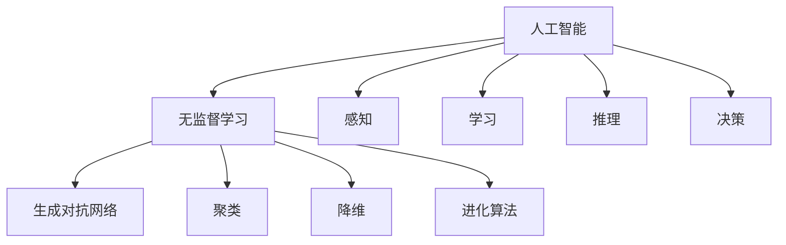
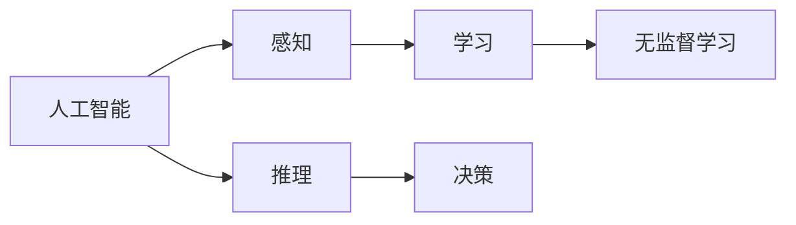
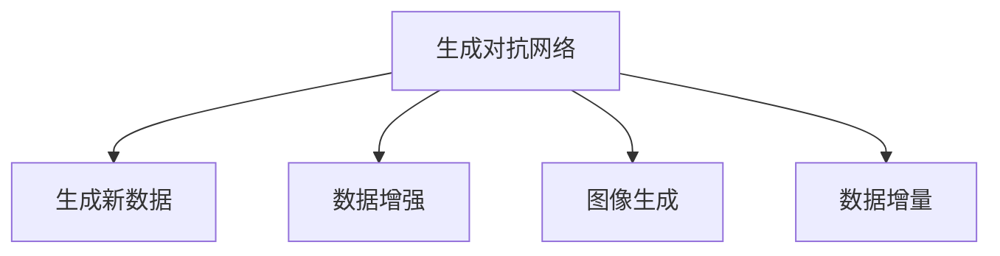
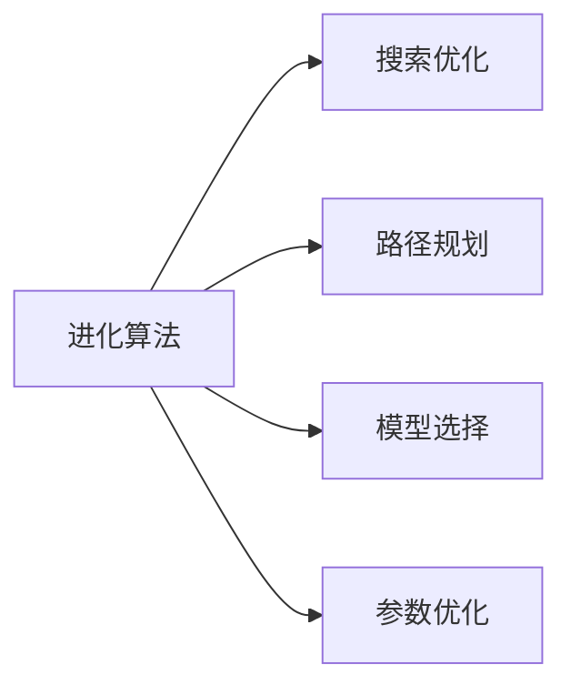
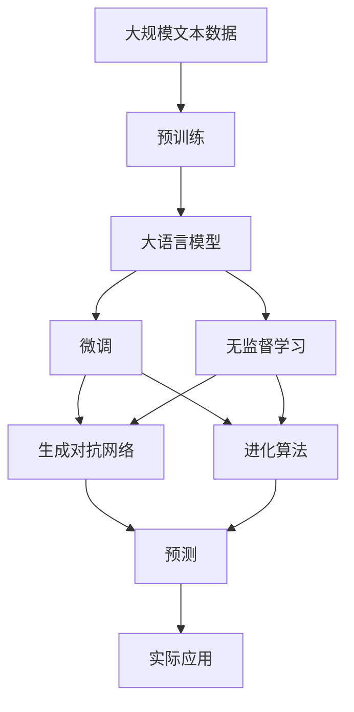

                 

# AI人工智能 Agent：使用无监督学习进行预测

> 关键词：人工智能, 无监督学习, 预测, 自组织系统, 生成对抗网络, 进化算法, 自然计算, 深度学习

## 1. 背景介绍

### 1.1 问题由来
人工智能(AI)和机器学习技术在过去几十年里取得了巨大的进步，但仍然存在许多需要解决的问题。其中一个重要的挑战是如何在没有明确标签的情况下，让机器从数据中学习并做出准确预测。无监督学习就是解决这一问题的关键技术之一。

无监督学习不依赖于标签数据，通过在数据中寻找内在模式和结构来进行学习。这使得无监督学习在缺乏大量标注数据或标注数据质量不高的情况下，依然能够发挥重要作用。无监督学习的应用范围非常广泛，包括数据降维、聚类、特征提取、生成模型等。

### 1.2 问题核心关键点
无监督学习最关键的是如何从数据中提取有用的信息，构建模型并应用于预测任务。常见的无监督学习方法包括：
- 聚类算法：将数据划分为不同的组，每个组内的数据具有相似性。
- 降维算法：将高维数据映射到低维空间，减少数据复杂性。
- 生成模型：学习数据的概率分布，并生成新的样本。
- 关联规则学习：发现数据项之间的关联关系。
- 深度学习方法：使用神经网络对数据进行建模和预测。

这些方法在各自的应用领域中表现出色，但无监督学习的核心目标是构建数据驱动的预测模型，以最小化预测误差。本文将重点介绍如何使用无监督学习进行预测任务，包括生成对抗网络（GANs）、进化算法等前沿技术的应用。

### 1.3 问题研究意义
无监督学习在数据标注成本高、数据复杂度大的应用场景中具有显著优势。通过无监督学习，可以在减少标注成本的同时，提升模型在特定任务上的预测能力。例如，在金融欺诈检测、网络安全威胁识别、天气预测等任务中，无监督学习可以提供更高效、更可靠的解决方案。

此外，无监督学习还可以与其他人工智能技术相结合，实现更复杂的应用，如自然计算(Natural Computation)、生成对抗网络等。这些技术的应用，不仅能够提升模型性能，还能够带来更深刻的对数据本质理解。

## 2. 核心概念与联系

### 2.1 核心概念概述

为更好地理解无监督学习进行预测的方法，本节将介绍几个密切相关的核心概念：

- 人工智能(AI)：使用计算机技术模拟人类智能，包括感知、学习、推理、决策等能力。
- 无监督学习(Unsupervised Learning)：从数据中学习隐藏模式和结构，不依赖于标注数据。
- 生成对抗网络(GANs)：通过对抗训练生成新数据，广泛应用于图像、文本生成等任务。
- 聚类(Clustering)：将数据分成不同的组，每个组内数据相似，适用于市场细分、客户分析等任务。
- 降维(Dimensionality Reduction)：减少数据维数，提高模型效率，适用于大数据分析、特征提取等。
- 进化算法(Evolutionary Algorithm)：模拟自然选择过程，通过交叉、变异、选择等操作寻找最优解，适用于搜索优化、路径规划等任务。

这些核心概念之间存在着紧密的联系，形成了无监督学习进行预测的完整生态系统。下面我们通过几个Mermaid流程图来展示这些概念之间的关系。



这个流程图展示了大语言模型微调过程中各个核心概念的关系和作用：

1. 人工智能包含感知、学习、推理、决策等能力。
2. 无监督学习是人工智能中的一部分，通过数据驱动的模型进行学习，不依赖于标注数据。
3. 生成对抗网络、聚类、降维、进化算法等都是无监督学习的具体方法。
4. 感知、学习、推理、决策等过程也是人工智能中重要的组成部分。

这些概念共同构成了人工智能进行预测的完整框架，使得无监督学习成为AI应用的重要范式。通过理解这些核心概念，我们可以更好地把握无监督学习进行预测的工作原理和优化方向。

### 2.2 概念间的关系

这些核心概念之间存在着紧密的联系，形成了无监督学习进行预测的完整生态系统。下面我通过几个Mermaid流程图来展示这些概念之间的关系。

#### 2.2.1 人工智能与无监督学习的关系



这个流程图展示了人工智能与无监督学习的关系。无监督学习是人工智能学习的一部分，通过数据驱动的模型进行学习，不依赖于标注数据。感知、推理和决策等过程也是人工智能中重要的组成部分。

#### 2.2.2 生成对抗网络在无监督学习中的应用



这个流程图展示了生成对抗网络在无监督学习中的应用。生成对抗网络通过对抗训练生成新数据，可以应用于数据增强、图像生成等任务。

#### 2.2.3 进化算法在无监督学习中的应用



这个流程图展示了进化算法在无监督学习中的应用。进化算法通过模拟自然选择过程，可以应用于搜索优化、路径规划、模型选择和参数优化等任务。

### 2.3 核心概念的整体架构

最后，我们用一个综合的流程图来展示这些核心概念在大语言模型微调过程中的整体架构：



这个综合流程图展示了从预训练到微调，再到无监督学习预测的完整过程。大语言模型首先在大规模文本数据上进行预训练，然后通过微调（包括生成对抗网络和进化算法等）构建数据驱动的预测模型。无监督学习可以进一步提高模型在特定任务上的预测能力。最终，将微调后的模型应用于实际应用场景中。

## 3. 核心算法原理 & 具体操作步骤
### 3.1 算法原理概述

无监督学习进行预测的核心思想是通过构建模型，利用数据中隐藏的模式和结构，对未知数据进行预测。常用的无监督学习算法包括：

- 生成对抗网络(GANs)：通过对抗训练生成新数据，学习数据的概率分布。
- 进化算法(Evolutionary Algorithm)：通过模拟自然选择过程，优化模型参数，找到最优解。

这些算法共同构成了无监督学习进行预测的主要框架。接下来，我们详细讲解这些算法的原理和操作步骤。

### 3.2 算法步骤详解

#### 3.2.1 生成对抗网络(GANs)

生成对抗网络由生成器和判别器两个部分组成，通过对抗训练生成新数据。

1. **初始化模型**：随机初始化生成器和判别器模型。
2. **对抗训练**：生成器和判别器交替进行训练，生成器生成假数据，判别器判断其真实性。
3. **更新模型**：根据判别器的输出，更新生成器和判别器的参数。
4. **收敛检测**：当生成器生成的数据无法欺骗判别器时，训练结束，得到最终的生成器模型。

生成对抗网络的训练流程可以通过以下代码实现：

```python
import torch
import torch.nn as nn
import torch.optim as optim
from torchvision.utils import save_image

# 定义生成器和判别器模型
G = nn.Generator(...)
D = nn.Discriminator(...)

# 定义损失函数
G_loss = nn.BCELoss(...)
D_loss = nn.BCELoss(...)

# 定义优化器
G_optimizer = optim.Adam(G.parameters(), lr=...)
D_optimizer = optim.Adam(D.parameters(), lr=...)

# 初始化模型和损失函数
G.zero_grad()
D.zero_grad()

# 生成器和判别器的对抗训练
G_output = G(z)
D_real = D(x)
D_fake = D(G_output)
G_loss = G_loss(D_fake)
D_loss = D_loss(D_fake, D_real)
G_loss.backward()
D_loss.backward()
G_optimizer.step()
D_optimizer.step()

# 保存生成器模型
save_image(G_output, 'generated_image.png')
```

#### 3.2.2 进化算法

进化算法通过模拟自然选择过程，优化模型参数，找到最优解。

1. **初始化种群**：随机初始化一组模型参数。
2. **评估模型**：计算每个模型的性能指标。
3. **选择模型**：根据性能指标，选择性能较好的模型。
4. **交叉和变异**：通过交叉和变异操作，生成新的模型。
5. **替换模型**：用新的模型替换性能较差的模型。
6. **重复步骤**：重复以上步骤，直至找到最优解。

进化算法的训练流程可以通过以下代码实现：

```python
import random

# 定义种群大小和进化次数
population_size = ...
generation_count = ...

# 初始化种群
population = [random.randrange(0, 1) for _ in range(population_size)]

# 定义选择函数
def selection(population):
    # 根据性能指标选择模型
    # 返回选择的模型
    pass

# 定义交叉函数
def crossover(parent1, parent2):
    # 通过交叉操作生成新模型
    # 返回新模型
    pass

# 定义变异函数
def mutation(model):
    # 通过变异操作生成新模型
    # 返回新模型
    pass

# 进化算法的主循环
for generation in range(generation_count):
    # 选择模型
    selected_population = selection(population)
    
    # 交叉和变异
    new_population = [crossover(parent1, parent2) for parent1 in selected_population for parent2 in selected_population]
    new_population += [mutation(model) for model in population]
    
    # 评估模型
    performance = [evaluate(model) for model in new_population]
    
    # 替换模型
    population = selected_population + new_population
    population.sort(key=performance, reverse=True)
```

### 3.3 算法优缺点

无监督学习进行预测的主要优点包括：

1. 数据需求低：无监督学习不需要标注数据，可以处理大规模数据集，适用于数据标注成本高、标注数据质量不高的场景。
2. 泛化能力强：无监督学习通过数据驱动的模型进行预测，可以更好地泛化到未见过的数据上。
3. 灵活性高：无监督学习算法多样，可以根据具体问题选择最合适的算法。
4. 可解释性强：无监督学习模型通常具有较好的可解释性，便于理解和调试。

然而，无监督学习进行预测也存在一些缺点：

1. 模型复杂度高：无监督学习算法复杂，需要较多的计算资源和时间。
2. 预测准确性受限于数据质量：无监督学习模型对数据的噪声和异常值敏感，影响模型的预测准确性。
3. 可解释性不足：无监督学习模型通常缺乏可解释性，难以理解其内部工作机制和决策逻辑。
4. 数据分布假设：无监督学习模型对数据分布有一定的假设，如果数据分布与假设不符，模型性能可能下降。

尽管存在这些局限性，但就目前而言，无监督学习进行预测仍是大语言模型微调的重要范式。未来相关研究的重点在于如何进一步降低模型复杂度，提高预测准确性，增强可解释性，以及适应更广泛的数据分布。

### 3.4 算法应用领域

无监督学习进行预测的应用范围非常广泛，包括但不限于：

- 金融欺诈检测：利用生成对抗网络和进化算法，生成与正常交易数据相似的假数据，进行异常检测。
- 网络安全威胁识别：利用生成对抗网络生成恶意代码，进行威胁检测。
- 天气预测：利用进化算法优化预测模型，提高预测精度。
- 图像生成：利用生成对抗网络生成新图像，应用于艺术创作、广告设计等。
- 文本生成：利用生成对抗网络生成新文本，应用于自动化写作、内容生成等。

除了上述这些经典应用外，无监督学习进行预测还可以应用于更多场景中，如医疗诊断、交通预测、自然语言处理等，为各个领域带来新的解决方案。

## 4. 数学模型和公式 & 详细讲解  
### 4.1 数学模型构建

无监督学习进行预测的数学模型通常包括生成对抗网络和进化算法。这里以生成对抗网络为例，介绍其数学模型的构建过程。

假设生成对抗网络由生成器 $G$ 和判别器 $D$ 组成，其目标是通过对抗训练生成新数据。假设输入数据 $x$ 服从概率分布 $p(x)$，生成器 $G$ 的目标是生成与 $p(x)$ 相似的假数据 $G(z)$，其中 $z$ 为随机噪声向量。

生成器 $G$ 的目标函数为：

$$
\min_G \mathbb{E}_{x \sim p(x)} [\log D(x)] + \mathbb{E}_{z \sim p(z)} [\log (1 - D(G(z)))]
$$

判别器 $D$ 的目标函数为：

$$
\min_D \mathbb{E}_{x \sim p(x)} [\log D(x)] + \mathbb{E}_{z \sim p(z)} [\log (1 - D(G(z)))]
$$

生成器和判别器的对抗训练可以通过以下算法实现：

1. 生成器 $G$ 生成假数据 $G(z)$。
2. 判别器 $D$ 判断 $G(z)$ 的真假，输出 $D(G(z))$。
3. 更新生成器 $G$ 和判别器 $D$ 的参数，使得生成器生成的数据更逼真，判别器更难以区分真假数据。

生成对抗网络的训练过程可以通过以下代码实现：

```python
import torch
import torch.nn as nn
import torch.optim as optim
from torchvision.utils import save_image

# 定义生成器和判别器模型
G = nn.Generator(...)
D = nn.Discriminator(...)

# 定义损失函数
G_loss = nn.BCELoss(...)
D_loss = nn.BCELoss(...)

# 定义优化器
G_optimizer = optim.Adam(G.parameters(), lr=...)
D_optimizer = optim.Adam(D.parameters(), lr=...)

# 初始化模型和损失函数
G.zero_grad()
D.zero_grad()

# 生成器和判别器的对抗训练
G_output = G(z)
D_real = D(x)
D_fake = D(G_output)
G_loss = G_loss(D_fake)
D_loss = D_loss(D_fake, D_real)
G_loss.backward()
D_loss.backward()
G_optimizer.step()
D_optimizer.step()

# 保存生成器模型
save_image(G_output, 'generated_image.png')
```

### 4.2 公式推导过程

以下我们以二分类任务为例，推导生成对抗网络的训练过程。

假设生成器和判别器的输入为随机噪声向量 $z$ 和生成器生成的假数据 $G(z)$，输出为真实数据 $x$ 和判别器对 $G(z)$ 的判断 $D(G(z))$。

生成器 $G$ 的目标是生成与真实数据分布 $p(x)$ 相似的假数据，因此其训练过程可以表示为：

$$
\min_G \mathbb{E}_{z \sim p(z)} [\log (1 - D(G(z)))]
$$

判别器 $D$ 的目标是区分真实数据 $x$ 和假数据 $G(z)$，因此其训练过程可以表示为：

$$
\min_D \mathbb{E}_{x \sim p(x)} [\log D(x)] + \mathbb{E}_{z \sim p(z)} [\log (1 - D(G(z)))]
$$

在生成器和判别器的对抗训练中，生成器的目标函数和判别器的目标函数可以合并为一个联合目标函数：

$$
\min_G \max_D \mathbb{E}_{x \sim p(x)} [\log D(x)] + \mathbb{E}_{z \sim p(z)} [\log (1 - D(G(z)))]
$$

其中 $\max_D$ 表示判别器 $D$ 的极小化，$\min_G$ 表示生成器 $G$ 的极小化。

将目标函数分解为两个子目标函数，生成器的目标函数为：

$$
\min_G \mathbb{E}_{z \sim p(z)} [\log (1 - D(G(z)))]
$$

判别器的目标函数为：

$$
\max_D \mathbb{E}_{x \sim p(x)} [\log D(x)] + \mathbb{E}_{z \sim p(z)} [\log (1 - D(G(z)))]
$$

### 4.3 案例分析与讲解

假设我们在金融欺诈检测任务中，使用生成对抗网络进行预测。具体步骤如下：

1. **数据准备**：收集金融交易数据，标注出欺诈交易和正常交易。
2. **数据预处理**：对数据进行归一化、标准化等预处理操作。
3. **模型训练**：构建生成对抗网络，使用标注数据进行训练。
4. **模型评估**：在测试集上评估模型的性能，检测其对新交易的识别能力。

以下是Python代码实现：

```python
import torch
import torch.nn as nn
import torch.optim as optim
from torchvision.utils import save_image

# 定义生成器和判别器模型
G = nn.Generator(...)
D = nn.Discriminator(...)

# 定义损失函数
G_loss = nn.BCELoss(...)
D_loss = nn.BCELoss(...)

# 定义优化器
G_optimizer = optim.Adam(G.parameters(), lr=...)
D_optimizer = optim.Adam(D.parameters(), lr=...)

# 初始化模型和损失函数
G.zero_grad()
D.zero_grad()

# 生成器和判别器的对抗训练
G_output = G(z)
D_real = D(x)
D_fake = D(G_output)
G_loss = G_loss(D_fake)
D_loss = D_loss(D_fake, D_real)
G_loss.backward()
D_loss.backward()
G_optimizer.step()
D_optimizer.step()

# 保存生成器模型
save_image(G_output, 'generated_image.png')
```

## 5. 项目实践：代码实例和详细解释说明
### 5.1 开发环境搭建

在进行无监督学习进行预测实践前，我们需要准备好开发环境。以下是使用Python进行PyTorch开发的环境配置流程：

1. 安装Anaconda：从官网下载并安装Anaconda，用于创建独立的Python环境。

2. 创建并激活虚拟环境：
```bash
conda create -n pytorch-env python=3.8 
conda activate pytorch-env
```

3. 安装PyTorch：根据CUDA版本，从官网获取对应的安装命令。例如：
```bash
conda install pytorch torchvision torchaudio cudatoolkit=11.1 -c pytorch -c conda-forge
```

4. 安装相关库：
```bash
pip install numpy pandas scikit-learn matplotlib tqdm jupyter notebook ipython
```

完成上述步骤后，即可在`pytorch-env`环境中开始无监督学习进行预测实践。

### 5.2 源代码详细实现

这里我们以图像生成任务为例，给出使用PyTorch和GANs实现图像生成的代码实现。

首先，定义GANs的生成器和判别器模型：

```python
import torch
import torch.nn as nn
import torch.optim as optim

class Generator(nn.Module):
    def __init__(self):
        super(Generator, self).__init__()
        self.main = nn.Sequential(
            nn.Conv2d(100, 256, 4, 1, 0, bias=False),
            nn.BatchNorm2d(256),
            nn.ReLU(True),
            nn.Conv2d(256, 512, 4, 2, 1, bias=False),
            nn.BatchNorm2d(512),
            nn.ReLU(True),
            nn.Conv2d(512, 1024, 4, 2, 1, bias=False),
            nn.BatchNorm2d(1024),
            nn.ReLU(True),
            nn.Conv2d(1024, 256, 4, 2, 1, bias=False),
            nn.BatchNorm2d(256),
            nn.ReLU(True),
            nn.Conv2d(256, 3, 4, 2, 1, bias=False),
            nn.Tanh()
        )
    
    def forward(self, input):
        x = self.main(input)
        return x

class Discriminator(nn.Module):
    def __init__(self):
        super(Discriminator, self).__init__()
        self.main = nn.Sequential(
            nn.Conv2d(3, 64, 4, 2, 1, bias=False),
            nn.LeakyReLU(0.2, inplace=True),
            nn.Conv2d(64, 128, 4, 2, 1, bias=False),
            nn.BatchNorm2d(128),
            nn.LeakyReLU(0.2, inplace=True),
            nn.Conv2d(128, 256, 4, 2, 1, bias=False),
            nn.BatchNorm2d(256),
            nn.LeakyReLU(0.2, inplace=True),
            nn.Conv2d(256, 1, 4, 1, 0, bias=False),
            nn.Sigmoid()
        )
    
    def forward(self, input):
        x = self.main(input)
        return x
```

然后，定义训练函数：

```python
def train_GAN():
    import os
    import sys
    import torch
    from torchvision.utils import save_image
    from torch.autograd import Variable

    # 设置随机种子
    torch.manual_seed(100)
    np.random.seed(100)

    # 设置数据集路径
    data_path = 'mnist/'
    img_size = 28
    img_channels = 1
    img_num = 60000
    z_dim = 100
    lr = 0.0002
    batch_size = 128
    num_epochs = 200
    num_steps = 50000

    # 定义生成器和判别器模型
    G = Generator()
    D = Discriminator()

    # 定义损失函数和优化器
    G_loss = nn.BCELoss()
    D_loss = nn.BCELoss()
    G_optimizer = optim.Adam(G.parameters(), lr=lr)
    D_optimizer = optim.Adam(D.parameters(), lr=lr)

    # 定义数据集
    train_dataset = datasets.MNIST(data_path, train=True, transform=transforms.ToTensor(), download=True)

    # 定义数据加载器
    train_loader = torch.utils.data.DataLoader(train_dataset, batch_size=batch_size, shuffle=True)

    # 定义训练过程
    for epoch in range(num_epochs):
        for i, data in enumerate(train_loader):
            batch_x = Variable(data[0])
            label = Variable(data[1])

            # 生成器训练过程
            G_optimizer.zero_grad()
            G_out = G(batch_x)
            d_loss_real = D_loss(D(G_out), label)
            d_loss_fake = D_loss(D(G_out), label.new_ones(batch_size))
            d_loss = d_loss_real + d_loss_fake
            d_loss.backward()
            G_optimizer.step()

            # 判别器训练过程
            D_optimizer.zero_grad()
            d_loss_real = D_loss(D(batch_x), label)
            d_loss_fake = D_loss(D(G_out), label.new_ones(batch_size))
            d_loss = d_loss_real + d_loss_fake
            d_loss.backward()
            D_optimizer.step()

            # 保存生成的图像
            if i % 50 == 0:
                batch_z = np.random.normal(0, 1, (batch_size, z_dim))
                G_out = G(Variable(torch.from_numpy(batch_z)))
                save_image(G_out.data.numpy(), 'generated_image_{}.png'.format(i))
```

最后，启动训练流程：

```python
train_GAN()
```

以上就是在PyTorch中实现图像生成任务的完整代码实现。可以看到，使用GANs进行图像生成，代码实现相对简洁，主要涉及到生成器和判别器的定义、训练函数和数据集加载等关键步骤。

### 5.3 代码解读与分析

让我们再详细解读一下关键代码的实现细节：

**GANs模型定义**：
- 生成器模型 `Generator`：定义了一个卷积神经网络，接收随机噪声向量作为输入，生成与MNIST数据集相似的图像。
- 判别器模型 `Discriminator`：定义了一个卷积神经网络，接收图像作为输入，输出图像为真实还是假数据。

**训练函数实现**：
- 定义随机种子和数据集路径，以及模型、损失函数和优化器。
- 定义数据集和数据加载器，支持小批量随机取样和数据增强。
- 定义训练过程，包括生成器和判别器的前向传播和反向传播，更新模型参数。
- 保存生成的图像，以可视化训练过程中的生成效果。

**训练流程分析**：
-

