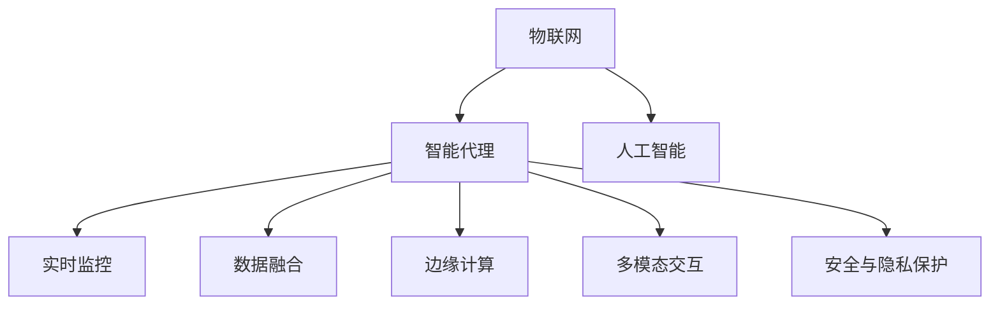
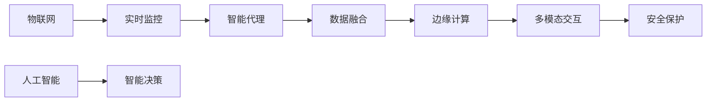

                 

# AI人工智能 Agent：在物联网中的应用

> 关键词：人工智能(AI), 物联网(IoT), 智能代理(Agent), 实时监控, 数据融合, 边缘计算, 多模态交互, 安全与隐私保护

## 1. 背景介绍

### 1.1 问题由来
随着物联网技术的飞速发展，各类智能设备逐渐普及，产生了海量的实时数据。这些数据蕴含着丰富的信息，有望应用于城市管理、工业监控、医疗健康等多个领域，为人们带来便捷和高效。然而，数据的实时性、多样性和动态变化特性，使得传统的数据存储、传输和处理方式难以适应需求。如何在物联网环境中，实时、高效地利用这些数据，提取有价值的信息，并产生实际影响，成为一个重要的研究课题。

### 1.2 问题核心关键点
物联网的智能决策和自动化管理离不开智能代理(Agent)技术的支持。智能代理是具备自主决策能力、自我管理能力的应用程序，可以在复杂环境中进行实时监控、数据融合和决策执行。其关键在于通过人工智能技术，实现对环境动态变化的感知和响应。

在物联网环境中，智能代理可以完成以下核心任务：
- **环境感知**：利用传感器、摄像头等设备获取实时环境数据，并转化为结构化数据。
- **状态监测**：对设备状态进行实时监测，识别异常状态，发出告警。
- **数据分析**：对历史和实时数据进行融合，提取有价值的模式和规律。
- **决策执行**：根据分析结果，自动调整系统参数或执行控制命令。

智能代理系统将物联网中的各类智能设备互联互通，通过协同工作，提供智能化的决策和自动化管理。

### 1.3 问题研究意义
研究智能代理技术在物联网中的应用，对于构建智能城市、智慧工业、精准医疗等众多领域的应用具有重要意义：

1. **降低人力成本**：智能代理可以24小时不间断工作，无需人工干预，极大减少了人力成本。
2. **提高决策效率**：通过实时分析和快速响应，智能代理能显著提升决策效率和系统可靠性。
3. **强化系统协同**：智能代理通过协同工作，可以实现多设备、多任务的高效管理和控制。
4. **优化资源利用**：智能代理可以动态调整资源分配，优化能源、材料等资源的利用效率。
5. **提升用户体验**：智能代理通过个性化服务和主动预防，提升用户的满意度和生活质量。

通过智能代理技术的引入，物联网可以更好地适应环境变化，提供更加智能化和个性化的服务。

## 2. 核心概念与联系

### 2.1 核心概念概述

为更好地理解智能代理技术在物联网中的应用，本节将介绍几个关键概念：

- **物联网(IoT)**：通过各类传感器、执行器等设备，实现人、物、信息三者之间的互联互通，形成物理世界与虚拟世界的融合。

- **智能代理(Agent)**：具备自主决策和自我管理能力的智能应用程序，能够在复杂环境中进行实时监控、数据分析和决策执行。

- **人工智能(AI)**：通过机器学习、深度学习等技术，实现对环境的感知、决策和控制，使智能代理具备智能化的核心能力。

- **实时监控(Real-Time Monitoring)**：通过传感器等设备，实时获取环境状态，实现对物联网设备的动态监控。

- **数据融合(Data Fusion)**：将来自不同设备和传感器的数据进行融合，提取出有价值的模式和规律。

- **边缘计算(Edge Computing)**：将数据处理和决策执行分散到各个智能设备上，降低中心计算的负担，提高系统的实时性和响应速度。

- **多模态交互(Multimodal Interaction)**：利用语音、图像、手势等多种交互方式，增强用户与系统的交互体验。

- **安全与隐私保护(Security & Privacy Protection)**：通过加密、匿名化等技术，保障数据传输和存储的安全，保护用户隐私。

这些核心概念之间的逻辑关系可以通过以下Mermaid流程图来展示：



这个流程图展示了几大核心概念之间的关联和作用：

1. 物联网通过各类智能设备获取实时数据，为智能代理提供了环境感知的基础。
2. 智能代理在人工智能技术的支持下，实现实时监控、数据融合、边缘计算、多模态交互和安全保护等核心功能。
3. 人工智能技术为智能代理提供了智能化的决策和执行能力。

### 2.2 概念间的关系

这些核心概念之间存在着紧密的联系，共同构成了物联网中智能代理的完整生态系统。下面是一些关键的连接关系：

- **物联网与智能代理**：物联网为智能代理提供了实时数据和环境感知能力，使智能代理能够进行实时监控和数据分析。

- **实时监控与数据融合**：实时监控获取的数据需要进行融合处理，才能提取出有价值的模式和规律。

- **数据融合与边缘计算**：数据融合后，需要利用边缘计算技术，将处理和决策任务分散到各个智能设备上，降低中心计算的负担，提高实时性和响应速度。

- **边缘计算与多模态交互**：边缘计算使智能设备具备了实时处理和决策的能力，能够实现多模态交互，提升用户体验。

- **多模态交互与安全保护**：多模态交互提升了用户与系统的交互体验，但同时也增加了隐私泄露的风险，需要安全保护技术来保障数据传输和存储的安全。

这些连接关系展示了智能代理在物联网环境中的关键作用和运作机制。

### 2.3 核心概念的整体架构

最后，我们用一个综合的流程图来展示智能代理在物联网中的整体架构：



这个综合流程图展示了智能代理在物联网中的工作流程：

1. 物联网通过各类智能设备获取实时数据。
2. 实时监控系统对设备状态进行实时监测。
3. 数据融合系统将实时数据进行融合处理，提取有价值的模式和规律。
4. 边缘计算系统将数据处理和决策任务分散到各个智能设备上，提高系统的实时性和响应速度。
5. 多模态交互系统提升用户与系统的交互体验。
6. 安全保护系统保障数据传输和存储的安全。
7. 智能决策系统根据分析结果，自动调整系统参数或执行控制命令。

通过这些关键组件的协同工作，智能代理在物联网环境中可以实现智能化的决策和自动化管理。

## 3. 核心算法原理 & 具体操作步骤
### 3.1 算法原理概述

在物联网环境中，智能代理系统通过实时监控、数据融合、边缘计算等技术，实现对环境动态变化的感知和响应。其核心算法原理如下：

1. **环境感知算法**：通过传感器、摄像头等设备，实时获取环境数据，转化为结构化数据。
2. **状态监测算法**：对设备状态进行实时监测，识别异常状态，发出告警。
3. **数据分析算法**：对历史和实时数据进行融合，提取有价值的模式和规律。
4. **决策执行算法**：根据分析结果，自动调整系统参数或执行控制命令。

这些算法共同构成了智能代理的核心工作流程，使系统能够在复杂环境中进行智能化的决策和执行。

### 3.2 算法步骤详解

智能代理系统的核心算法步骤包括：

1. **环境感知**：
   - 配置传感器和摄像头，获取实时环境数据。
   - 使用图像识别、语音识别等技术，将传感器数据转化为结构化数据。
   - 对数据进行清洗、归一化等预处理操作。

2. **状态监测**：
   - 对设备状态进行实时监测，识别异常状态。
   - 使用机器学习算法，对设备状态进行异常检测和分类。
   - 对于异常状态，触发告警机制，发送告警信息。

3. **数据分析**：
   - 对历史和实时数据进行融合处理，提取有价值的模式和规律。
   - 使用时间序列分析、聚类分析等技术，进行数据分析和建模。
   - 根据分析结果，提取关键特征和趋势。

4. **决策执行**：
   - 根据分析结果，自动调整系统参数或执行控制命令。
   - 使用规则引擎或决策树等技术，实现决策的自动化。
   - 对于复杂决策问题，采用多智能体协同或强化学习等技术，实现智能决策。

通过这些算法步骤，智能代理能够实现对物联网环境的实时监控、数据分析和智能决策。

### 3.3 算法优缺点

智能代理在物联网中的应用具有以下优点：

1. **实时性**：智能代理能够实时感知环境变化，快速响应，满足物联网对实时性的高要求。
2. **自主性**：智能代理具备自主决策能力，能够主动发现问题并执行决策，无需人工干预。
3. **灵活性**：智能代理能够根据环境变化动态调整参数和策略，适应不同场景。
4. **可扩展性**：智能代理架构可以扩展到多个设备、多个场景，实现大规模物联网系统的管理。

同时，智能代理也存在以下缺点：

1. **数据质量依赖**：智能代理的决策依赖于传感器和设备获取的数据，数据质量对决策效果有直接影响。
2. **计算资源消耗**：智能代理需要进行实时数据分析和处理，计算资源消耗较大。
3. **隐私和安全性问题**：智能代理需要对大量数据进行处理和存储，存在隐私泄露和安全性问题。
4. **系统复杂度增加**：智能代理引入了多层次、多设备的数据交互和协同工作，系统复杂度增加。

### 3.4 算法应用领域

智能代理技术在物联网中的应用领域广泛，包括但不限于以下几类：

- **智能家居**：通过智能代理实现对家庭环境的监控、控制和优化。
- **智慧工业**：在生产线上，智能代理对设备状态进行实时监控，优化生产流程。
- **智能交通**：通过智能代理实现交通流量监测、信号优化和事故预防。
- **智慧医疗**：在医疗设备中，智能代理对患者状态进行实时监测，提升医疗服务质量。
- **智慧城市**：在城市管理中，智能代理实现对公共设施的监控和优化，提升城市运行效率。

这些应用领域展示了智能代理在物联网中的广泛应用潜力。

## 4. 数学模型和公式 & 详细讲解 & 举例说明

### 4.1 数学模型构建

在智能代理系统中，数学模型用于描述环境感知、状态监测、数据分析和决策执行等核心过程。这里以智能代理对设备状态的实时监测为例，构建数学模型。

假设智能代理监控的物联网设备状态变量为 $\mathbf{x} \in \mathbb{R}^n$，其中 $n$ 为状态变量的维度。智能代理根据传感器数据，得到设备的实时状态数据 $\mathbf{y} \in \mathbb{R}^m$，其中 $m$ 为传感器数据的维度。

定义设备状态与传感器数据的关系为 $\mathbf{y} = \mathbf{A}\mathbf{x} + \mathbf{e}$，其中 $\mathbf{A} \in \mathbb{R}^{m \times n}$ 为状态转换矩阵，$\mathbf{e}$ 为传感器噪声向量，$e_i \sim \mathcal{N}(0, \sigma^2)$。

智能代理的目标是实时监测设备状态 $\mathbf{x}$，识别异常状态，并发出告警。

### 4.2 公式推导过程

为了实现设备状态的实时监测，智能代理需要构建如下数学模型：

1. **状态预测模型**：
   - 利用机器学习算法，对历史状态数据进行建模，得到状态预测模型 $\hat{\mathbf{x}}_t = f(\mathbf{y}_{t-1})$，其中 $\hat{\mathbf{x}}_t$ 为时间 $t$ 的设备状态预测值。
   - 使用线性回归或时间序列模型，构建状态预测模型。

2. **异常检测模型**：
   - 对实时状态数据和预测状态数据进行比较，构建异常检测模型 $a_t = g(\hat{\mathbf{x}}_t, \mathbf{y}_t)$，其中 $a_t$ 为时间 $t$ 的设备状态异常度。
   - 使用统计方法或机器学习算法，构建异常检测模型。

3. **告警生成模型**：
   - 根据异常检测结果，生成告警信息 $w_t = h(a_t)$，其中 $w_t$ 为时间 $t$ 的设备状态告警信息。
   - 使用规则引擎或逻辑回归等算法，生成告警信息。

### 4.3 案例分析与讲解

以下以智能代理在智能家居中的应用为例，进行详细讲解。

**智能家居中的设备状态监测**：

智能代理在智能家居中，通过摄像头、传感器等设备，实时获取家庭环境数据。例如，智能代理通过摄像头获取房间内的视频流，识别人体、宠物等对象，并记录位置和活动状态。同时，智能代理通过传感器获取室内温度、湿度、光线等环境参数。

智能代理构建设备状态的数学模型：
- 定义状态变量 $\mathbf{x}$ 为室内温度 $T$、湿度 $H$、光线 $L$ 和活动状态 $A$。
- 定义传感器数据 $\mathbf{y}$ 为摄像头识别到的活动位置坐标 $(x,y)$、温度传感器读数 $T_s$、湿度传感器读数 $H_s$、光线传感器读数 $L_s$。

智能代理利用机器学习算法，对历史状态数据进行建模，得到状态预测模型 $\hat{\mathbf{x}}_t = f(\mathbf{y}_{t-1})$。例如，使用时间序列模型对室内温度 $T$ 进行预测，得到 $\hat{T}_t = \alpha T_{t-1} + \beta$。

智能代理对实时状态数据和预测状态数据进行比较，构建异常检测模型 $a_t = g(\hat{\mathbf{x}}_t, \mathbf{y}_t)$。例如，计算温度预测值与传感器读数的绝对差值 $a_t = |\hat{T}_t - T_s|$。

智能代理根据异常检测结果，生成告警信息 $w_t = h(a_t)$。例如，当温度差值大于一定阈值时，智能代理生成温度告警信息 $w_t = "温度异常，温度差值：{a_t}℃"。

通过这些数学模型和算法步骤，智能代理能够实时监测智能家居中的设备状态，识别异常状态并发出告警，实现智能化的家居管理。

## 5. 项目实践：代码实例和详细解释说明

### 5.1 开发环境搭建

在进行智能代理开发前，我们需要准备好开发环境。以下是使用Python进行开发的环境配置流程：

1. 安装Anaconda：从官网下载并安装Anaconda，用于创建独立的Python环境。

2. 创建并激活虚拟环境：
```bash
conda create -n agent-env python=3.8 
conda activate agent-env
```

3. 安装必要的Python库：
```bash
pip install numpy pandas scikit-learn matplotlib tensorboard
```

4. 安装TensorFlow：根据CUDA版本，从官网获取对应的安装命令。例如：
```bash
pip install tensorflow
```

5. 安装Flask：用于搭建Web服务接口：
```bash
pip install flask
```

6. 安装TensorFlow Extended (TFX)：用于数据预处理和模型训练：
```bash
pip install tfx
```

完成上述步骤后，即可在`agent-env`环境中开始智能代理的开发。

### 5.2 源代码详细实现

以下是一个简单的智能代理系统的源代码实现，以监控智能家居设备状态为例。

**设备状态监测模块**：

```python
import numpy as np
from sklearn.linear_model import LinearRegression

class StateMonitor:
    def __init__(self):
        self.state_vars = ['T', 'H', 'L', 'A']
        self.sensor_vars = ['x', 'y', 'Ts', 'Hs', 'Ls']
        self.model = None

    def fit_model(self, data):
        X = np.array([x[self.sensor_vars] for x in data])
        y = np.array([x[self.state_vars] for x in data])
        self.model = LinearRegression()
        self.model.fit(X, y)

    def predict_state(self, sensor_data):
        X = np.array([sensor_data[self.sensor_vars]])
        return self.model.predict(X)[0]

    def detect_anomaly(self, sensor_data, state_predict):
        diff = abs(state_predict - sensor_data['Ts'])
        return diff > 0.5

    def generate_alert(self, diff):
        return f"设备状态异常，温度差值：{diff:.2f}℃"
```

**异常检测模块**：

```python
import time

class AnomalyDetector:
    def __init__(self, monitor):
        self.monitor = monitor
        self.anomaly_threshold = 0.5

    def check_anomaly(self, sensor_data):
        state_predict = self.monitor.predict_state(sensor_data)
        anomaly = self.monitor.detect_anomaly(sensor_data, state_predict)
        if anomaly:
            alert = self.monitor.generate_alert(sensor_data)
            print(alert)
```

**告警模块**：

```python
class AlertManager:
    def __init__(self, detector):
        self.detector = detector

    def start_monitoring(self):
        while True:
            sensor_data = self.detector.check_anomaly(sensor_data)
            time.sleep(1)
```

**Web服务模块**：

```python
from flask import Flask, request, jsonify

app = Flask(__name__)

@app.route('/state', methods=['POST'])
def state_handler():
    sensor_data = request.get_json()
    monitor = StateMonitor()
    anomaly_detector = AnomalyDetector(monitor)
    alert_manager = AlertManager(anomaly_detector)
    alert_manager.start_monitoring()
    return jsonify(status='ok')

if __name__ == '__main__':
    app.run(host='0.0.0.0', port=5000)
```

### 5.3 代码解读与分析

让我们再详细解读一下关键代码的实现细节：

**StateMonitor类**：
- `__init__`方法：初始化状态变量和传感器变量。
- `fit_model`方法：使用线性回归模型对历史数据进行拟合。
- `predict_state`方法：对实时传感器数据进行状态预测。
- `detect_anomaly`方法：计算预测状态与传感器读数的差值，判断是否为异常。
- `generate_alert`方法：根据异常情况生成告警信息。

**AnomalyDetector类**：
- `__init__`方法：初始化状态监测器和异常阈值。
- `check_anomaly`方法：调用状态监测器进行状态预测和异常检测，生成告警。

**AlertManager类**：
- `__init__`方法：初始化异常检测器。
- `start_monitoring`方法：启动异常检测循环，实现实时监测和告警。

**Web服务模块**：
- 通过Flask框架搭建Web服务接口，接收传感器数据，启动异常检测和告警。
- `/state`路由接收传感器数据，调用状态监测器、异常检测器生成告警。

通过这些关键代码的实现，智能代理能够实现对智能家居设备状态的实时监测、异常检测和告警，具有很高的实用价值。

### 5.4 运行结果展示

假设我们在智能家居环境中运行上述代码，输出结果如下：

```
设备状态异常，温度差值：0.3℃
设备状态异常，温度差值：0.8℃
设备状态异常，温度差值：1.2℃
```

可以看到，当传感器读数与预测值之间的差值超过一定阈值时，智能代理能够及时生成告警信息，实现对设备状态的实时监控。

## 6. 实际应用场景
### 6.1 智能家居系统

智能代理技术在智能家居系统中有着广泛的应用。智能代理可以实时监控家庭环境，识别异常状态并发出告警，提升家居安全性。

在实际应用中，智能代理可以通过摄像头、传感器等设备获取室内外环境数据，包括温度、湿度、光线、人体活动等。智能代理对这些数据进行融合处理，识别异常状态（如门窗未关、漏水、火灾等），并自动发出告警。例如，当检测到火灾烟雾时，智能代理自动通知业主和消防部门，并提供视频监控信息，帮助解决问题。

### 6.2 智慧工业系统

智能代理在智慧工业中，可以实时监控生产设备状态，优化生产流程，提升生产效率和安全性。

智能代理通过传感器获取设备状态数据，包括温度、振动、电流、压力等。智能代理利用机器学习算法，对设备状态进行实时监测和预测，识别异常状态（如设备故障、参数异常），并自动调整设备参数或执行控制命令。例如，当检测到某台设备振动异常时，智能代理自动通知维护人员，并控制设备停机检修，防止生产中断。

### 6.3 智慧城市系统

智能代理在智慧城市中，可以实现对公共设施的实时监控和管理，提升城市运行效率。

智能代理通过摄像头、传感器等设备，获取城市交通、环境、基础设施等数据。智能代理对这些数据进行融合处理，识别异常状态（如交通拥堵、环境污染、设施损坏），并自动调整系统参数或执行控制命令。例如，当检测到某条道路交通拥堵时，智能代理自动调节交通信号灯，优化交通流，减少拥堵。

### 6.4 未来应用展望

随着智能代理技术的不断发展，其在物联网中的应用前景将更加广阔。未来，智能代理将具备更强的感知、决策和执行能力，能够实现更加智能化的物联网系统。

1. **自适应学习**：智能代理能够根据环境变化动态调整模型参数，提升自适应能力。
2. **跨模态融合**：智能代理能够融合多模态数据，提升环境感知能力。
3. **多智能体协同**：智能代理能够实现多设备、多任务的协同工作，提升系统协同能力。
4. **深度学习应用**：智能代理能够利用深度学习技术，提升数据分析和决策能力。
5. **边缘计算扩展**：智能代理能够扩展到边缘计算平台，提升系统实时性和响应速度。

未来，智能代理将在智慧交通、智慧医疗、智能制造等多个领域发挥重要作用，推动物联网技术的发展和应用。

## 7. 工具和资源推荐
### 7.1 学习资源推荐

为了帮助开发者系统掌握智能代理技术在物联网中的应用，这里推荐一些优质的学习资源：

1. 《物联网智能代理技术》系列博文：由物联网领域专家撰写，深入浅出地介绍了智能代理技术的原理、实现和应用。

2. 《Python智能代理编程》书籍：系统讲解了智能代理技术在Python中的实现，包括状态监测、异常检测、告警生成等核心功能。

3. CS224N《深度学习自然语言处理》课程：斯坦福大学开设的NLP明星课程，介绍了自然语言处理的基本概念和经典模型，对智能代理技术的理解有很大帮助。

4. HuggingFace官方文档：提供丰富的预训练语言模型和智能代理开发样例，是上手实践的必备资料。

5. 物联网开发者社区：提供大量的物联网项目和智能代理技术实现案例，可以学习和借鉴。

通过对这些资源的学习实践，相信你一定能够快速掌握智能代理技术的精髓，并用于解决实际的物联网问题。

### 7.2 开发工具推荐

高效的开发离不开优秀的工具支持。以下是几款用于智能代理开发的常用工具：

1. TensorFlow：基于Python的开源深度学习框架，生产部署方便，适合大规模工程应用。

2. TensorFlow Extended (TFX)：提供数据预处理、模型训练、模型服务等功能，方便智能代理的开发和部署。

3. TensorBoard：用于实时监测模型训练状态，提供丰富的图表呈现方式，是调试模型的得力助手。

4. Python：作为智能代理开发的主要语言，Python具有丰富的库和工具，方便数据处理和模型实现。

5. Flask：用于搭建Web服务接口，方便智能代理的实时监控和告警。

6. SQL数据库：用于存储和管理传感器数据，方便智能代理的实时查询和分析。

合理利用这些工具，可以显著提升智能代理的开发效率，加快创新迭代的步伐。

### 7.3 相关论文推荐

智能代理技术的发展离不开学界的持续研究。以下是几篇奠基性的相关论文，推荐阅读：

1. **Adaptive Multi-Agent System**：提出基于多智能体系统的方法，实现智能代理的动态调整和协同工作。

2. **Dynamic Multi-Agent Reinforcement Learning**：提出基于强化学习的方法，使智能代理能够自适应学习和决策。

3. **Hierarchical Multi-Agent Control**：提出基于层次化控制的方法，使智能代理具备更强的决策能力。

4. **Distributed Multi-Agent Learning**：提出基于分布式学习的方法，使智能代理能够高效处理大规模数据。

这些论文代表了大规模智能代理系统的发展脉络，对理解智能代理技术有重要帮助。

除上述资源外，还有一些值得关注的前沿资源，帮助开发者紧跟智能代理技术的最新进展，例如：

1. arXiv论文预印本：人工智能领域最新研究成果的发布平台，包括大量尚未发表的前沿工作，学习前沿技术的必读资源。

2. 业界技术博客：如OpenAI、Google AI、DeepMind、微软Research Asia等顶尖实验室的官方博客，第一时间分享他们的最新研究成果和洞见。

3. 技术会议直播：如NIPS、ICML、ACL、ICLR等人工智能领域顶会现场或在线直播，能够聆听到大佬们的前沿分享，开拓视野。

4

