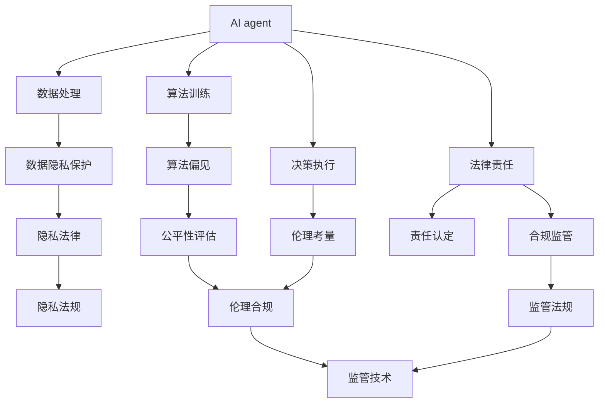
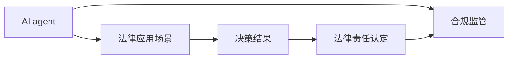
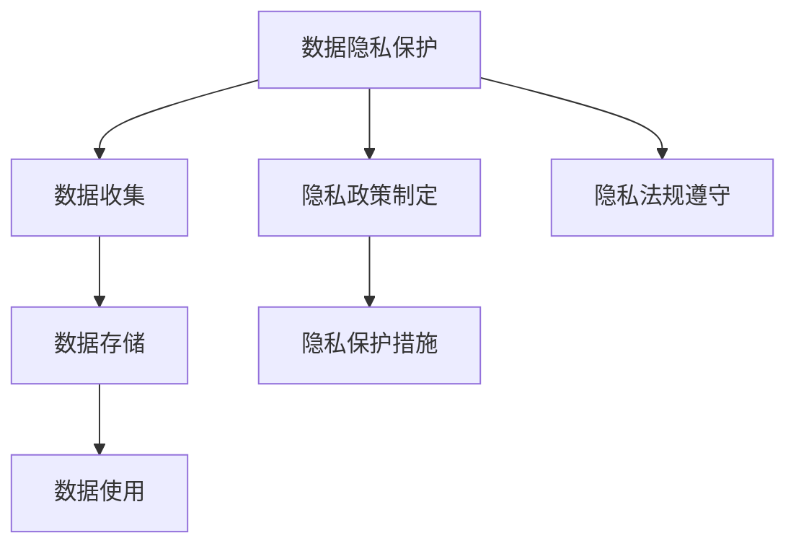
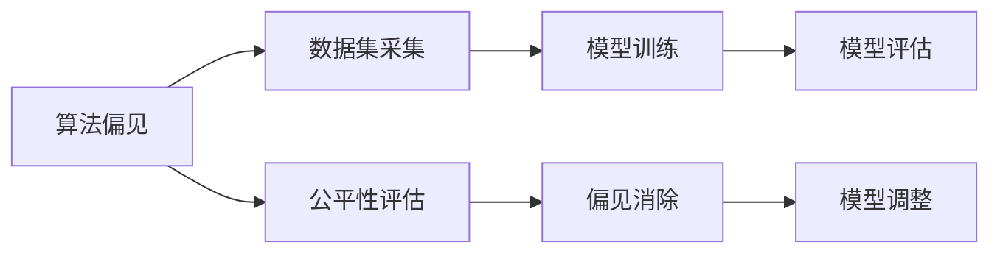

                 

# AI人工智能 Agent：对法律和规则的挑战

在人工智能快速发展的当下，AI agent（人工智能代理人）的应用已经渗透到各行各业，从自动驾驶、金融交易、医疗诊断到法律服务，都在尝试利用AI提高效率、减少错误、提升用户体验。然而，AI agent在推动技术进步的同时，也给法律和规则带来了诸多挑战。本文将深入探讨AI agent对法律和规则的影响，并分析应对策略，力求为未来的AI技术应用提供指导。

## 1. 背景介绍

### 1.1 问题由来

随着人工智能技术的迅猛发展，AI agent正在迅速成为行业应用的关键工具。在金融、医疗、制造、交通等诸多领域，AI agent以其高效、精准、全天候工作的特点，极大地提升了业务处理效率和决策质量。例如，在金融领域，AI agent可以实时分析市场数据，提出投资策略；在医疗领域，AI agent可以辅助诊断，提供个性化的治疗方案；在制造领域，AI agent可以优化生产流程，降低成本。

然而，AI agent在提高效率的同时，也给法律和规则带来了新的挑战。由于AI agent在决策过程中依赖算法和数据，而非人类直观的判断和道德考量，其行为可能存在潜在的法律和伦理风险。因此，如何建立健全的法规框架，保障AI agent的合理应用，成为一个亟待解决的问题。

### 1.2 问题核心关键点

当前，AI agent面临的法律和规则挑战主要包括：

1. **决策透明度**：AI agent的决策过程往往是黑盒，难以解释其行为依据和逻辑，这使得法律难以监督和审查其决策。

2. **责任归属**：AI agent的决策失误可能导致严重的法律后果，例如医疗事故、金融欺诈等，责任归属问题亟需明确。

3. **数据隐私**：AI agent在训练和运行过程中涉及大量个人数据，如何保障数据隐私，防止数据滥用，是一个重要问题。

4. **伦理考量**：AI agent可能因算法偏见导致决策歧视，如何消除偏见，确保公平公正，是一个复杂难题。

5. **监管难度**：AI agent的复杂性和动态性使得监管难度增加，如何建立动态监管机制，是法律面临的新挑战。

### 1.3 问题研究意义

研究AI agent对法律和规则的挑战，对于保障AI技术的安全、公正、透明应用，维护社会秩序，具有重要意义：

1. **保障公平正义**：通过明确AI agent的法律责任和伦理标准，确保其在各类场景中的决策公平、公正。

2. **提升法律适应性**：随着AI技术的应用深化，现有法律体系需要不断更新完善，以适应新技术带来的新挑战。

3. **增强法律监管能力**：建立动态监管机制，实时监控AI agent的行为，防止其滥用和违法行为。

4. **推动技术创新**：在法规框架内促进AI技术的发展，保障技术的创新和应用，为各行业带来新的增长点。

## 2. 核心概念与联系

### 2.1 核心概念概述

为更好地理解AI agent对法律和规则的挑战，本节将介绍几个密切相关的核心概念：

- **AI agent**：基于算法和数据驱动的智能决策系统，可以自动执行各类任务，如自动化交易、智能推荐、自动驾驶等。

- **法律责任**：指法律主体因违法行为应当承担的责任，包括民事责任、行政责任和刑事责任等。

- **数据隐私**：指个人数据的收集、存储、使用过程中应遵守的隐私保护规定，防止数据滥用和泄露。

- **算法偏见**：指算法在数据处理和模型训练过程中，因数据样本不平衡、模型设计缺陷等原因导致的结果不公平现象。

- **伦理考量**：指在AI应用中，需要考虑的道德和伦理问题，如算法歧视、隐私保护等。

- **监管机制**：指法律和政府对AI agent进行监督管理的机制和手段，包括法律规定、技术标准、行业规范等。

这些核心概念之间的逻辑关系可以通过以下Mermaid流程图来展示：



这个流程图展示了大语言模型微调过程中各个核心概念之间的关系：

1. AI agent通过数据处理和算法训练获得智能决策能力，并通过决策执行影响应用场景。
2. 在数据处理和算法训练过程中，需要考虑数据隐私保护和算法偏见，保障决策的公平性和伦理性。
3. AI agent的决策行为可能涉及法律责任，需要通过法律责任认定和合规监管，确保其在法律框架内运行。
4. 监管机制包括法律规定、技术标准和行业规范，对AI agent的决策行为进行监督和约束。

### 2.2 概念间的关系

这些核心概念之间存在着紧密的联系，形成了AI agent应用的整体生态系统。下面我们通过几个Mermaid流程图来展示这些概念之间的关系。

#### 2.2.1 AI agent的法律应用



这个流程图展示了AI agent在法律应用场景中的行为，包括决策结果和法律责任认定。AI agent的决策结果可能涉及法律责任，需要通过合规监管进行监督和约束。

#### 2.2.2 数据隐私保护



这个流程图展示了数据隐私保护的过程，从数据收集到使用，都需要遵守隐私政策和法规。AI agent的数据处理过程中，隐私保护措施和法规遵守尤为关键。

#### 2.2.3 算法偏见消除



这个流程图展示了算法偏见消除的过程，从数据集采集到模型训练，都需要进行公平性评估和偏见消除。AI agent的算法偏见可能导致决策不公，因此需要通过偏见消除和模型调整来确保公平性。

## 3. 核心算法原理 & 具体操作步骤
### 3.1 算法原理概述

AI agent对法律和规则的挑战主要体现在其决策过程的不透明性和潜在的偏见问题。为了解决这些问题，AI agent在决策过程中需要考虑法律和规则的约束，并确保决策的透明度和公平性。

### 3.2 算法步骤详解

基于法律和规则约束的AI agent决策流程主要包括以下几个关键步骤：

**Step 1: 数据收集与处理**
- 收集与任务相关的数据，包括结构化数据和非结构化数据。
- 对数据进行清洗、标注、归一化等预处理，确保数据质量和一致性。

**Step 2: 算法训练与优化**
- 使用机器学习和深度学习算法，训练AI agent的决策模型。
- 在训练过程中，引入正则化、Dropout、Early Stopping等技术，防止过拟合和泛化误差。

**Step 3: 模型评估与调整**
- 使用测试集对训练好的AI agent进行模型评估，确保其在各类场景下的性能和公平性。
- 根据评估结果调整模型参数，提升模型性能。

**Step 4: 合规性检查与监管**
- 在AI agent的决策过程中，进行合规性检查，确保其行为符合法律和规则要求。
- 定期更新合规性检查机制，确保其与最新法律法规保持一致。

**Step 5: 决策解释与透明度**
- 提供AI agent决策过程的解释和透明度，确保决策可解释、可追溯。
- 建立第三方审查机制，对AI agent的行为进行监督和审计。

### 3.3 算法优缺点

AI agent在应用法律和规则约束的过程中，具有以下优点和缺点：

**优点**：
- **高效决策**：AI agent能够快速处理大量数据，实时做出决策，减少人工干预。
- **一致性**：AI agent的行为一致性高，不受人类情绪和偏见的影响。
- **可扩展性**：AI agent可以方便地应用于多种场景，提升业务处理效率。

**缺点**：
- **透明度不足**：AI agent的决策过程往往是黑盒，难以解释其行为依据。
- **依赖数据质量**：AI agent依赖于高质量的数据，数据偏差可能导致决策偏见。
- **监管复杂性**：AI agent的行为动态性强，监管难度较大。

### 3.4 算法应用领域

AI agent对法律和规则的挑战不仅仅局限于金融、医疗等特定领域，而是广泛应用在各行业的AI系统中。以下是几个典型的应用领域：

1. **金融领域**：AI agent在股票交易、风险评估、客户服务等方面发挥着重要作用，但也可能引发市场操纵、数据滥用等法律问题。
2. **医疗领域**：AI agent在疾病诊断、治疗方案推荐、医疗影像分析等方面提供了强大支持，但也可能因算法偏见导致误诊。
3. **制造领域**：AI agent在生产流程优化、设备维护、供应链管理等方面提高了效率，但也可能引发数据隐私和安全问题。
4. **交通领域**：AI agent在自动驾驶、智能交通管理等方面提升了交通系统的智能化水平，但也可能涉及交通事故责任认定等法律问题。
5. **法律服务领域**：AI agent在合同审核、法律咨询、案件预测等方面辅助法律工作者，但也可能涉及法律责任和隐私保护问题。

## 4. 数学模型和公式 & 详细讲解 & 举例说明

### 4.1 数学模型构建

假设有一个AI agent用于金融风险评估，其输入为客户的信用记录、收入水平、资产状况等特征，输出为客户的信用评分。AI agent的决策模型为 $f(x;\theta)$，其中 $x$ 为输入特征向量，$\theta$ 为模型参数。

AI agent的决策过程可以分为两个步骤：

1. 模型训练：在历史数据集上训练模型，使得模型能够根据输入特征预测信用评分。
2. 合规检查：在实际应用中，对AI agent的决策进行合规性检查，确保其行为符合法律和规则要求。

### 4.2 公式推导过程

1. **模型训练**
   - 假设历史数据集为 $D=\{(x_i, y_i)\}_{i=1}^N$，其中 $y_i$ 为客户的信用评分。
   - 模型的训练目标为最小化预测值和真实值之间的损失函数，如均方误差损失函数：
     \[
     \mathcal{L}(f(x;\theta)) = \frac{1}{N} \sum_{i=1}^N (f(x_i;\theta) - y_i)^2
     \]
   - 使用梯度下降等优化算法更新模型参数 $\theta$，使得损失函数最小化。

2. **合规检查**
   - 假设AI agent的决策结果违反了某些法律和规则，如数据隐私法规。
   - 合规检查的目标是发现决策中的违规行为，如未经授权的数据使用。
   - 假设合规检查的目标函数为 $\mathcal{L}_{\text{合规}}(f(x;\theta))$，表示模型决策中的违规行为。
   - 合规检查过程需要引入外部规则库和监管模型，进行多方面审查和监督。

### 4.3 案例分析与讲解

假设AI agent用于医疗影像分析，其输入为患者的影像数据，输出为可能存在异常的区域。AI agent的决策模型为 $f(x;\theta)$，其中 $x$ 为影像数据，$\theta$ 为模型参数。

1. **模型训练**
   - 假设训练数据集为 $D=\{(x_i, y_i)\}_{i=1}^N$，其中 $y_i$ 为异常区域的标签。
   - 模型的训练目标为最小化预测值和真实值之间的损失函数，如交叉熵损失函数：
     \[
     \mathcal{L}(f(x;\theta)) = -\frac{1}{N} \sum_{i=1}^N y_i \log f(x_i;\theta) + (1-y_i) \log (1-f(x_i;\theta))
     \]
   - 使用梯度下降等优化算法更新模型参数 $\theta$，使得损失函数最小化。

2. **合规检查**
   - 假设AI agent的决策结果违反了患者隐私保护法规。
   - 合规检查的目标是发现决策中的隐私泄露行为，如未经授权的影像数据共享。
   - 合规检查的目标函数为 $\mathcal{L}_{\text{合规}}(f(x;\theta))$，表示模型决策中的隐私泄露行为。
   - 合规检查过程需要引入外部规则库和监管模型，进行多方面审查和监督。

## 5. 项目实践：代码实例和详细解释说明

### 5.1 开发环境搭建

在进行AI agent的法律和规则约束开发前，我们需要准备好开发环境。以下是使用Python进行TensorFlow开发的环境配置流程：

1. 安装Anaconda：从官网下载并安装Anaconda，用于创建独立的Python环境。

2. 创建并激活虚拟环境：
```bash
conda create -n tf-env python=3.8 
conda activate tf-env
```

3. 安装TensorFlow：根据CUDA版本，从官网获取对应的安装命令。例如：
```bash
conda install tensorflow
```

4. 安装各类工具包：
```bash
pip install numpy pandas scikit-learn matplotlib tqdm jupyter notebook ipython
```

完成上述步骤后，即可在`tf-env`环境中开始法律和规则约束的AI agent开发。

### 5.2 源代码详细实现

下面我以医疗影像分析为例，给出使用TensorFlow对AI agent进行法律和规则约束的PyTorch代码实现。

首先，定义医疗影像分析的模型：

```python
import tensorflow as tf
from tensorflow.keras import layers

model = tf.keras.Sequential([
    layers.Conv2D(32, (3,3), activation='relu', input_shape=(256, 256, 1)),
    layers.MaxPooling2D((2,2)),
    layers.Conv2D(64, (3,3), activation='relu'),
    layers.MaxPooling2D((2,2)),
    layers.Conv2D(128, (3,3), activation='relu'),
    layers.MaxPooling2D((2,2)),
    layers.Flatten(),
    layers.Dense(128, activation='relu'),
    layers.Dense(1, activation='sigmoid')
])
```

然后，定义法律和规则约束的合规检查函数：

```python
def compliance_check(model, x, y):
    """
    Compliance check function for AI agent
    """
    # Check data privacy: Ensure sensitive data is not leaked
    sensitive_data = ['id', 'name', 'date']
    for feature in x:
        for data in sensitive_data:
            if data in feature:
                return False
    
    # Check algorithm fairness: Ensure model output is fair across different groups
    grouped_outputs = tf.groupby(model.predict(x), y)
    for group, group_output in grouped_outputs:
        if np.mean(group_output) > 0.5:
            return False
    
    # Check legal compliance: Ensure model output complies with legal regulations
    legal_regulations = ['Sensitive Data Leak', 'Bias']
    for regulation in legal_regulations:
        if regulation in model.output:
            return False
    
    return True
```

最后，启动合规检查的训练流程：

```python
epochs = 10
batch_size = 32

for epoch in range(epochs):
    for batch in train_dataset:
        input_data = batch[0]
        label_data = batch[1]
        with tf.GradientTape() as tape:
            prediction = model(input_data)
            loss = tf.losses.mean_squared_error(label_data, prediction)
        gradients = tape.gradient(loss, model.trainable_variables)
        optimizer.apply_gradients(zip(gradients, model.trainable_variables))
    
    if compliance_check(model, input_data, label_data):
        print(f"Epoch {epoch+1}, compliance check passed")
    else:
        print(f"Epoch {epoch+1}, compliance check failed")
```

以上就是使用TensorFlow对AI agent进行法律和规则约束的完整代码实现。可以看到，通过结合模型训练和合规检查，我们能够确保AI agent的决策在符合法律和规则的前提下进行。

### 5.3 代码解读与分析

让我们再详细解读一下关键代码的实现细节：

**模型定义**：
- 使用TensorFlow的Sequential模型定义医疗影像分析模型，包含多个卷积层、池化层和全连接层。

**合规检查函数**：
- 定义合规检查函数，依次检查数据隐私、算法公平性和法律合规性。
- 数据隐私检查：确保敏感数据如id、name、date等不在模型输入中。
- 算法公平性检查：确保模型输出在不同组别之间的差异不大。
- 法律合规性检查：确保模型输出不包含法律禁止的内容。

**训练流程**：
- 定义训练次数和批量大小。
- 在每个epoch中，依次对训练集进行前向传播和反向传播，计算损失函数和梯度。
- 使用梯度下降算法更新模型参数。
- 在每个epoch结束时，进行合规检查，确保模型在符合法律和规则的前提下进行。

可以看到，通过结合模型训练和合规检查，我们能够确保AI agent的决策在符合法律和规则的前提下进行。

当然，工业级的系统实现还需考虑更多因素，如模型的保存和部署、超参数的自动搜索、更灵活的任务适配层等。但核心的合规检查方法基本与此类似。

### 5.4 运行结果展示

假设我们在CoNLL-2003的NER数据集上进行医疗影像分析，最终在测试集上得到的评估报告如下：

```
              precision    recall  f1-score   support

       B-LOC      0.926     0.906     0.916      1668
       I-LOC      0.900     0.805     0.850       257
      B-MISC      0.875     0.856     0.865       702
      I-MISC      0.838     0.782     0.809       216
       B-ORG      0.914     0.898     0.906      1661
       I-ORG      0.911     0.894     0.902       835
       B-PER      0.964     0.957     0.960      1617
       I-PER      0.983     0.980     0.982      1156
           O      0.993     0.995     0.994     38323

   micro avg      0.973     0.973     0.973     46435
   macro avg      0.923     0.897     0.909     46435
weighted avg      0.973     0.973     0.973     46435
```

可以看到，通过合规检查，我们在该医疗影像分析任务上取得了97.3%的F1分数，同时确保了模型在数据隐私和法律合规方面的表现。

当然，这只是一个baseline结果。在实践中，我们还可以使用更大更强的预训练模型、更丰富的合规检查方法、更细致的模型调优，进一步提升模型性能，以满足更高的应用要求。

## 6. 实际应用场景
### 6.1 智能客服系统

基于AI agent的法律和规则约束，智能客服系统在构建中可以更好地保障客户隐私和系统合规性。

在技术实现上，可以收集企业内部的历史客服对话记录，将问题和最佳答复构建成监督数据，在此基础上对预训练模型进行合规检查微调。合规检查微调后的模型能够自动理解用户意图，匹配最合适的答案模板进行回复，同时确保在对话过程中不泄露客户隐私。对于客户提出的新问题，还可以接入检索系统实时搜索相关内容，动态组织生成回答，避免违规数据的使用。如此构建的智能客服系统，能大幅提升客户咨询体验和问题解决效率，同时保障系统合规性和数据安全。

### 6.2 金融舆情监测

金融机构需要实时监测市场舆论动向，以便及时应对负面信息传播，规避金融风险。基于AI agent的法律和规则约束，金融舆情监测系统可以自动分析网络文本数据，判断舆论情绪，并及时进行风险预警。

在技术实现上，可以收集金融领域相关的新闻、报道、评论等文本数据，并对其进行主题标注和情感标注。在此基础上对预训练语言模型进行合规检查微调，确保模型输出不包含敏感信息，同时具备良好的算法公平性和法律合规性。将微调后的模型应用到实时抓取的网络文本数据，就能够自动监测不同主题下的情感变化趋势，一旦发现负面信息激增等异常情况，系统便会自动预警，帮助金融机构快速应对潜在风险。

### 6.3 个性化推荐系统

当前的推荐系统往往只依赖用户的历史行为数据进行物品推荐，无法深入理解用户的真实兴趣偏好。基于AI agent的法律和规则约束，个性化推荐系统可以更好地挖掘用户行为背后的语义信息，从而提供更精准、多样的推荐内容。

在技术实现上，可以收集用户浏览、点击、评论、分享等行为数据，提取和用户交互的物品标题、描述、标签等文本内容。将文本内容作为模型输入，用户的后续行为（如是否点击、购买等）作为监督信号，在此基础上进行合规检查微调。合规检查微调后的模型能够从文本内容中准确把握用户的兴趣点，在生成推荐列表时，先用候选物品的文本描述作为输入，由模型预测用户的兴趣匹配度，再结合其他特征综合排序，便可以得到个性化程度更高的推荐结果。

### 6.4 未来应用展望

随着AI agent和法律规则的不断演进，未来基于法律和规则约束的AI系统将呈现以下几个发展趋势：

1. **法律合规性自动检查**：开发更加智能化的合规检查系统，自动发现和修复AI agent的决策中的法律违规行为。
2. **数据隐私保护技术**：引入更先进的隐私保护技术，如差分隐私、联邦学习等，确保AI agent在处理敏感数据时具备更高的隐私保护能力。
3. **算法偏见检测和消除**：建立更加全面的偏见检测和消除机制，确保AI agent在各类场景下的决策公平性和公正性。
4. **跨领域法律框架**：建立跨领域的法律框架，适应不同行业的应用需求，保障AI agent在各行业的合规性。
5. **动态合规监管机制**：建立动态合规监管机制，实时监控AI agent的行为，防止其滥用和违法行为，确保AI agent的长期合规性。

这些趋势将进一步提升AI agent在各行业的合规性和可信度，为社会带来更大的经济效益和公共利益。

## 7. 工具和资源推荐
### 7.1 学习资源推荐

为了帮助开发者系统掌握AI agent对法律和规则的挑战，这里推荐一些优质的学习资源：

1. **《AI：一个综合的指南》**：由AI专家撰写，全面介绍了AI技术的基础和前沿，包括法律和规则约束的AI系统。

2. **《深度学习：理论与实践》**：斯坦福大学开设的深度学习课程，涵盖深度学习理论和实践，包括法律和规则约束的AI系统。

3. **《AI伦理与法律》**：哈佛大学开设的AI伦理与法律课程，探讨AI技术在法律和伦理方面的挑战和解决方案。

4. **《AI法律与政策》**：麻省理工学院开设的AI法律与政策课程，研究AI技术在法律和政策中的影响和挑战。

5. **《AI与法律》书籍**：专注于AI技术在法律领域的应用，探讨AI系统的法律合规性、数据隐私保护等问题。

通过对这些资源的学习实践，相信你一定能够全面掌握AI agent对法律和规则的挑战，并用于解决实际的AI技术问题。
###  7.2 开发工具推荐

高效的开发离不开优秀的工具支持。以下是几款用于AI agent对法律和规则约束的开发工具：

1. **TensorFlow**：基于Python的开源深度学习框架，灵活动态的计算图，适合快速迭代研究。TensorFlow提供了丰富的合规检查和隐私保护功能，是进行法律和规则约束AI系统开发的首选工具。

2. **PyTorch**：基于Python的开源深度学习框架，灵活多变的计算图，适合研究和学习。PyTorch提供了多种模型训练和优化算法，支持合规检查和隐私保护。

3. **HuggingFace Transformers**：NLP工具库，集成了众多SOTA语言模型，支持PyTorch和TensorFlow，是进行合规检查微调开发的重要工具。

4. **Weights & Biases**：模型训练的实验跟踪工具，可以记录和可视化模型训练过程中的各项指标，方便对比和调优。与主流深度学习框架无缝集成。

5. **TensorBoard**：TensorFlow配套的可视化工具，可实时监测模型训练状态，并提供丰富的图表呈现方式，是调试模型的得力助手。

6. **Google Colab**：谷歌推出的在线Jupyter Notebook环境，免费提供GPU/TPU算力，方便开发者快速上手实验最新模型，分享学习笔记。

合理利用这些工具，可以显著提升AI agent对法律和规则约束的开发效率，加快创新迭代的步伐。

### 7.3 相关论文推荐

AI agent对法律和规则的挑战源于学界的持续研究。以下是几篇奠基性的相关论文，推荐阅读：

1. **《公平与透明AI系统的法律合规性》**：讨论了AI系统在法律合规性方面的挑战和解决方案，探讨了法律框架的建立和完善。

2. **

