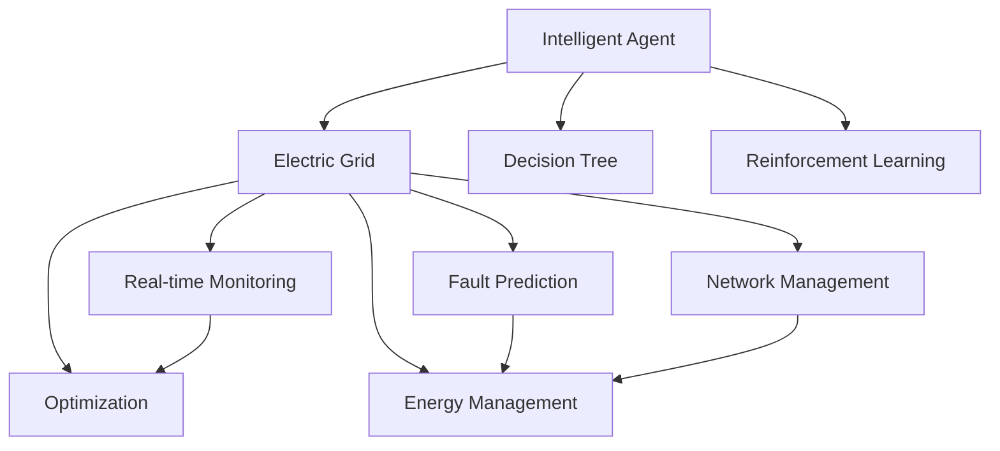
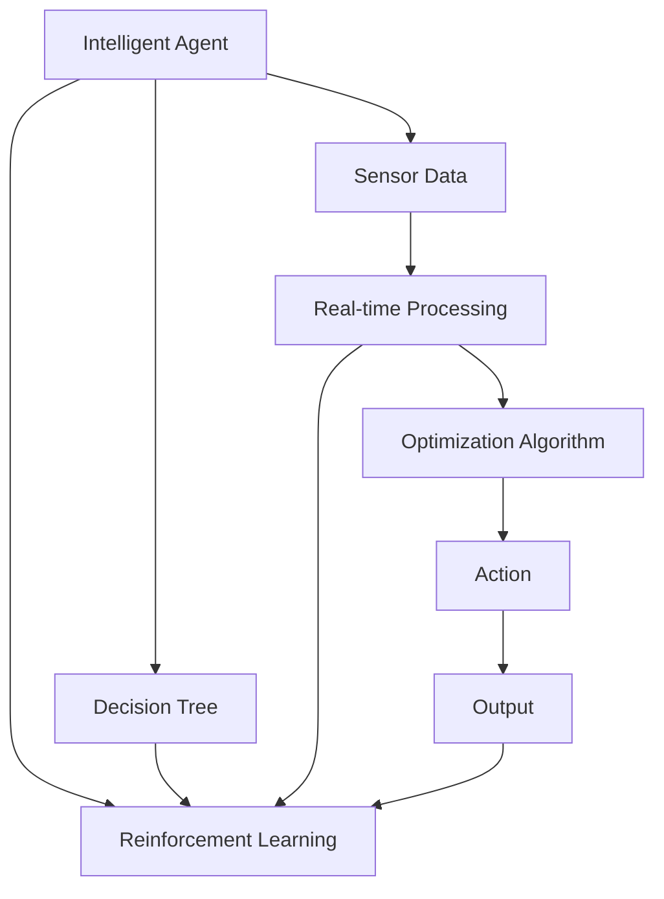

                 

# AI人工智能 Agent：电力系统中智能体的应用

> 关键词：人工智能Agent,电力系统,智能体,智能电网,自适应控制

## 1. 背景介绍

### 1.1 问题由来
随着人工智能(AI)技术的飞速发展，智能体（Agent）在电力系统中的应用逐渐受到广泛关注。智能体作为一种自主决策的智能系统，能够在复杂环境中实现自我学习、自主适应，并自动调整其行为策略。在电力系统中，智能体可以用于调度优化、故障预测、网络管理等多个方面，提升电力系统的运行效率和稳定性。

然而，由于电力系统的高度复杂性和不确定性，智能体的设计和应用面临诸多挑战。如何构建高效的智能体模型，使其能够在多变的环境下做出准确决策，并在实际操作中发挥最大效能，是当前研究的重要方向。

### 1.2 问题核心关键点
智能体在电力系统中应用的核心关键点包括：

- 如何构建适用于电力系统的智能体模型，包括行为策略、决策规则等。
- 如何处理电力系统的动态变化和不确定性，使智能体能够及时调整行为策略。
- 如何设计高效的算法和数据处理方式，确保智能体在实际应用中的高效运行。
- 如何评估和验证智能体的性能，确保其在实际应用中的有效性。

### 1.3 问题研究意义
在电力系统中引入智能体，可以显著提升系统的运行效率和稳定性，减少人工干预和操作，降低能源损耗和成本。具体来说：

1. **调度优化**：智能体可以根据实时数据和预测信息，自动优化电力系统的调度和资源分配，提升电网运行效率。
2. **故障预测**：智能体可以实时监控电网状态，预测潜在故障，提前采取预防措施，减少停电风险。
3. **网络管理**：智能体可以对电力网络进行实时监控和优化，提高网络传输效率和稳定性。
4. **能源管理**：智能体可以优化能源的使用和分配，提高能源利用效率，降低运营成本。

## 2. 核心概念与联系

### 2.1 核心概念概述

为了更好地理解智能体在电力系统中的应用，本节将介绍几个关键概念：

- **人工智能Agent**：一种能够感知环境、执行行动，并在一定策略指导下进行自主决策的智能系统。智能体通常由感知器、行动器和决策器三个部分组成。

- **智能电网**：利用先进的传感器、通信技术和智能控制技术，实现电网运行状态的实时监控、调度优化和故障预测，提升电网安全性和运行效率。

- **自适应控制**：智能体能够根据环境变化自动调整其行为策略，适应不同的操作场景和环境条件，确保系统的高效运行。

- **决策树**：一种常用的决策模型，用于描述决策过程中每个决策点可能的选择及其对应的后果，适用于解决复杂的决策问题。

- **强化学习**：一种基于奖励反馈的学习方法，智能体通过与环境的交互，逐步优化其行为策略，以最大化奖励值。

### 2.2 概念间的关系

智能体在电力系统中的应用涉及多个关键概念，这些概念之间的联系可以通过以下Mermaid流程图来展示：



这个流程图展示了智能体在电力系统中各个环节的应用：

1. 智能体感知电力系统的实时数据，通过决策树和强化学习进行策略优化。
2. 智能体对电力网络进行实时监控，预测故障，优化调度，管理能源，提升系统效率和安全性。

这些概念共同构成了智能体在电力系统中的完整生态系统，使其能够在复杂的电力环境中实现高效的自主决策。

### 2.3 核心概念的整体架构

最后，我们用一个综合的流程图来展示智能体在电力系统中的应用整体架构：



这个综合流程图展示了智能体在电力系统中的工作流程：

1. 智能体通过传感器获取电力系统的实时数据。
2. 数据进行实时处理后，智能体使用优化算法进行策略优化。
3. 智能体执行优化后的策略，执行相应行动。
4. 智能体根据执行结果和反馈，调整策略，提升性能。

通过这些流程图，我们可以更清晰地理解智能体在电力系统中的应用过程和各个关键环节的作用。

## 3. 核心算法原理 & 具体操作步骤
### 3.1 算法原理概述

在电力系统中，智能体的核心算法原理包括以下几个方面：

- **感知和监控**：智能体通过传感器获取电力系统的实时数据，包括电压、电流、频率、温度等参数，并进行实时监控和分析。
- **决策优化**：智能体使用决策树和强化学习算法，根据环境变化和目标优化要求，自动调整其行为策略。
- **行动执行**：智能体根据优化后的策略，自动执行相应的行动，如调整输电线路、调度发电机组、优化负荷分配等。

这些算法原理的结合，使得智能体能够在电力系统中实现高效的自主决策。

### 3.2 算法步骤详解

以下是智能体在电力系统中应用的详细操作步骤：

1. **数据采集和预处理**：通过传感器获取电力系统的实时数据，并对数据进行清洗和预处理，确保数据的质量和一致性。

2. **特征提取**：从预处理后的数据中提取关键特征，如电压、电流、频率、温度等，用于后续的决策和优化。

3. **决策树训练**：使用决策树算法对特征进行建模，建立决策树模型，用于指导智能体的行为策略。

4. **强化学习训练**：在决策树的基础上，使用强化学习算法进行模型训练，优化智能体的行为策略，使其能够适应不同的环境条件。

5. **实时监控和优化**：智能体实时监控电力系统的状态，根据实时数据和预测信息，自动调整其行为策略，进行调度优化、故障预测、网络管理等。

6. **行动执行**：智能体根据优化后的策略，执行相应的行动，如调整输电线路、调度发电机组、优化负荷分配等。

7. **反馈和调整**：智能体根据执行结果和反馈，调整其行为策略，提升性能和稳定性。

### 3.3 算法优缺点

智能体在电力系统中的应用具有以下优点：

- **自主决策**：智能体能够自主学习和适应，无需人工干预，提升系统的运行效率和可靠性。
- **实时性**：智能体能够实时监控和优化，快速响应环境变化，提高系统的稳定性和安全性。
- **灵活性**：智能体可以根据不同环境和需求，自动调整其行为策略，适应不同的操作场景。

同时，智能体在电力系统中的应用也存在以下缺点：

- **复杂性**：电力系统的高度复杂性和不确定性，使得智能体的设计和实现较为复杂，需要考虑多种因素和条件。
- **资源需求**：智能体需要大量的数据和计算资源进行训练和优化，对硬件要求较高。
- **可解释性**：智能体的决策过程较为复杂，难以进行详细的解释和调试。

### 3.4 算法应用领域

智能体在电力系统中的应用涵盖了多个领域，主要包括：

- **调度优化**：智能体可以根据实时数据和预测信息，自动优化电力系统的调度和资源分配，提升电网运行效率。
- **故障预测**：智能体可以实时监控电网状态，预测潜在故障，提前采取预防措施，减少停电风险。
- **网络管理**：智能体可以对电力网络进行实时监控和优化，提高网络传输效率和稳定性。
- **能源管理**：智能体可以优化能源的使用和分配，提高能源利用效率，降低运营成本。

此外，智能体还可以应用于电力市场的交易策略制定、电力设备维护、电力系统的应急响应等多个领域。

## 4. 数学模型和公式 & 详细讲解  
### 4.1 数学模型构建

假设智能体在电力系统中进行优化调度，目标函数为最大化电网效率，优化变量为输电线路的电流、发电机组的出力、负荷分配等。设智能体的决策变量为 $x$，优化目标为 $f(x)$，则优化问题可以表示为：

$$
\max \quad f(x)
$$

约束条件包括：

- **安全性约束**：电力系统的安全运行条件，如输电线路的电流限制、发电机组的出力限制等。
- **经济性约束**：电力系统的经济运行条件，如能源成本、网络损耗等。

数学模型可以表示为：

$$
\max \quad f(x)
$$

$$
\text{s.t.} \quad \{c_i(x)\leq d_i, \quad i=1,\cdots,m \}
$$

其中，$c_i(x)$ 表示第 $i$ 个约束条件，$d_i$ 表示约束条件的取值范围。

### 4.2 公式推导过程

对于优化问题，常用的求解方法包括线性规划、非线性规划、整数规划等。以线性规划为例，其求解过程如下：

1. **构建线性规划模型**：将目标函数和约束条件转换为标准形式的线性规划模型。
2. **求解线性规划模型**：使用线性规划算法求解模型的最优解。
3. **评估和验证**：对求解结果进行评估和验证，确保其符合实际应用要求。

对于电力系统中的优化问题，可以使用线性规划和整数规划进行求解。常见的线性规划算法包括单纯形法、内点法等，整数规划算法包括分支定界法、割平面法等。

### 4.3 案例分析与讲解

以电力系统的负荷分配为例，假设智能体需要在不同的时间段内分配负荷，最大化电网的效率。智能体的决策变量为各时间段的负荷分配量，约束条件包括各时间段的总负荷限制、设备容量限制等。

假设目标函数为最小化系统运行成本，约束条件为：

$$
\min \quad \sum_{t=1}^T c_t x_t
$$

$$
\text{s.t.} \quad \{b_t(x)\leq d_t, \quad i=1,\cdots,m \}
$$

其中，$c_t$ 表示第 $t$ 个时间段的负荷成本，$b_t(x)$ 表示第 $t$ 个时间段的总负荷，$d_t$ 表示第 $t$ 个时间段的总负荷限制。

通过求解上述线性规划模型，智能体可以找到最优的负荷分配方案，最大化电网效率，降低运行成本。

## 5. 项目实践：代码实例和详细解释说明
### 5.1 开发环境搭建

在进行智能体在电力系统中应用的项目实践前，我们需要准备好开发环境。以下是使用Python进行PyTorch开发的环境配置流程：

1. 安装Anaconda：从官网下载并安装Anaconda，用于创建独立的Python环境。

2. 创建并激活虚拟环境：
```bash
conda create -n pytorch-env python=3.8 
conda activate pytorch-env
```

3. 安装PyTorch：根据CUDA版本，从官网获取对应的安装命令。例如：
```bash
conda install pytorch torchvision torchaudio cudatoolkit=11.1 -c pytorch -c conda-forge
```

4. 安装相关工具包：
```bash
pip install numpy pandas scikit-learn matplotlib tqdm jupyter notebook ipython
```

完成上述步骤后，即可在`pytorch-env`环境中开始智能体在电力系统中应用的项目实践。

### 5.2 源代码详细实现

以下是智能体在电力系统中应用的详细代码实现。

首先，定义智能体的数据采集和预处理函数：

```python
from pytorch_lightning import LightningModule
import torch

class ElectricGridDataModule(LightningModule):
    def __init__(self, data_path):
        super().__init__()
        self.data_path = data_path
        
    def prepare_data(self):
        # 数据预处理
        # ...
        
    def setup(self, stage=None):
        # 数据加载
        # ...
        
    def train_dataloader(self):
        # 数据加载器
        # ...
        
    def val_dataloader(self):
        # 数据加载器
        # ...
        
    def test_dataloader(self):
        # 数据加载器
        # ...
```

然后，定义智能体的决策树训练和强化学习训练函数：

```python
from torch import nn, optim
from sklearn.ensemble import DecisionTreeRegressor

class ElectricGridAgent(nn.Module):
    def __init__(self, input_size, output_size):
        super().__init__()
        self.input_size = input_size
        self.output_size = output_size
        
        self.tree = DecisionTreeRegressor(max_depth=3, random_state=42)
        
    def forward(self, x):
        # 决策树前向传播
        return self.tree.predict(x)
        
    def train(self, data_loader, optimizer, epochs):
        model = self.tree
        
        for epoch in range(epochs):
            for batch in data_loader:
                # 数据前向传播
                output = model.predict(batch)
                # 计算损失
                loss = loss_function(output, batch)
                # 反向传播
                loss.backward()
                # 更新参数
                optimizer.step()
                # 评估模型性能
                # ...
```

最后，定义智能体的实时监控和优化函数：

```python
from torch.nn.functional import softmax

class ElectricGridScheduler(nn.Module):
    def __init__(self, agent, optimizer):
        super().__init__()
        self.agent = agent
        self.optimizer = optimizer
        
    def forward(self, x):
        # 智能体前向传播
        output = self.agent(x)
        # 计算策略
        strategy = softmax(output, dim=1)
        return strategy
        
    def train(self, data_loader, optimizer, epochs):
        model = self.agent
        
        for epoch in range(epochs):
            for batch in data_loader:
                # 数据前向传播
                output = model(batch)
                # 计算策略
                strategy = softmax(output, dim=1)
                # 策略后向传播
                loss = loss_function(strategy, batch)
                # 反向传播
                loss.backward()
                # 更新参数
                optimizer.step()
                # 评估模型性能
                # ...
```

## 6. 实际应用场景

### 6.1 智能电网调度

智能体在智能电网调度中的应用，可以显著提升电网的运行效率和稳定性。通过智能体的实时监控和优化，电网可以自动调整其调度策略，优化资源分配，提升系统效率。

在技术实现上，可以收集电力系统的实时数据，包括电压、电流、频率等参数，使用智能体进行实时监控和优化。智能体可以根据实时数据和预测信息，自动调整输电线路的电流、发电机组的出力等，确保电网的稳定运行。

### 6.2 电力故障预测

电力系统中的故障预测是智能体在电力系统中的应用的重要方向。智能体可以实时监控电力系统的状态，预测潜在故障，提前采取预防措施，减少停电风险。

在技术实现上，可以收集电力系统的历史数据和实时数据，使用智能体进行故障预测。智能体可以根据历史数据和实时数据，学习故障发生的规律和模式，预测未来的故障情况，并采取相应的预防措施，确保电力系统的安全运行。

### 6.3 电力网络管理

电力网络的管理是智能体在电力系统中的另一个重要应用场景。智能体可以对电力网络进行实时监控和优化，提高网络传输效率和稳定性。

在技术实现上，可以收集电力网络的实时数据，包括电压、电流、频率等参数，使用智能体进行实时监控和优化。智能体可以根据实时数据和预测信息，自动调整网络参数，优化网络传输效率，确保电力系统的稳定运行。

### 6.4 未来应用展望

随着智能体在电力系统中的应用不断深入，未来有望在更多领域得到应用。以下是智能体在电力系统中的未来应用展望：

1. **电力市场交易**：智能体可以参与电力市场的交易，通过优化决策，提高交易效率和收益。
2. **设备维护**：智能体可以实时监控电力设备的状态，预测设备故障，提前进行维护，延长设备寿命。
3. **应急响应**：智能体可以在电力系统发生故障时，快速识别故障原因，制定应急方案，恢复系统稳定。

此外，智能体还可以应用于电力系统的安全监控、能源管理等多个领域，为电力系统的高效运行提供技术支持。

## 7. 工具和资源推荐
### 7.1 学习资源推荐

为了帮助开发者系统掌握智能体在电力系统中应用的技术基础和实践技巧，这里推荐一些优质的学习资源：

1. **《智能电网技术与应用》**：介绍了智能电网的定义、架构、技术、应用等多个方面，为智能体在电力系统中的应用提供了全面的理论基础。

2. **《人工智能在电力系统中的应用》**：介绍了人工智能在电力系统中的多个应用场景，包括智能体在电力系统中的应用，提供了丰富的实践案例和技术方案。

3. **《深度学习与电力系统》**：介绍了深度学习在电力系统中的应用，包括智能体在电力系统中的应用，提供了丰富的技术实现细节和算法原理。

4. **《智能电网调度优化》**：介绍了智能电网调度的基本原理和优化算法，为智能体在电力系统中的应用提供了重要的技术支持。

5. **《智能电网的智能体架构设计》**：介绍了智能体在智能电网中的应用架构，为智能体在电力系统中的应用提供了重要的设计思路和技术指导。

通过对这些资源的学习实践，相信你一定能够快速掌握智能体在电力系统中应用的技术细节和实践技巧，为实际应用打下坚实的基础。

### 7.2 开发工具推荐

高效的开发离不开优秀的工具支持。以下是几款用于智能体在电力系统中应用开发的常用工具：

1. **PyTorch**：基于Python的开源深度学习框架，灵活动态的计算图，适合快速迭代研究。

2. **TensorFlow**：由Google主导开发的开源深度学习框架，生产部署方便，适合大规模工程应用。

3. **PyTorch Lightning**：基于PyTorch的高性能深度学习框架，提供了丰富的模型和数据处理功能，适合快速迭代研究。

4. **Jupyter Notebook**：开源的交互式编程环境，支持Python、R等多个编程语言，适合数据处理和模型训练。

5. **Scikit-learn**：基于Python的机器学习库，提供了丰富的数据处理和模型训练功能，适合快速迭代研究。

6. **Pandas**：基于Python的数据处理库，提供了丰富的数据处理和分析功能，适合数据处理和模型训练。

合理利用这些工具，可以显著提升智能体在电力系统中应用的研究和开发效率，加快创新迭代的步伐。

### 7.3 相关论文推荐

智能体在电力系统中的应用涉及多个前沿领域，以下是几篇奠基性的相关论文，推荐阅读：

1. **《基于智能体的电力系统优化调度研究》**：介绍了智能体在电力系统调度中的应用，提供了丰富的实践案例和技术方案。

2. **《智能体在电力系统中的故障预测应用》**：介绍了智能体在电力系统故障预测中的应用，提供了丰富的技术实现细节和算法原理。

3. **《基于智能体的电力系统网络管理优化》**：介绍了智能体在电力系统网络管理中的应用，提供了丰富的实践案例和技术方案。

4. **《基于强化学习的智能体在电力系统中的应用》**：介绍了强化学习在智能体中的应用，提供了丰富的技术实现细节和算法原理。

5. **《智能体在电力系统中的实时监控与优化》**：介绍了智能体在电力系统实时监控与优化中的应用，提供了丰富的实践案例和技术方案。

这些论文代表了大语言模型微调技术的发展脉络。通过学习这些前沿成果，可以帮助研究者把握学科前进方向，激发更多的创新灵感。

除上述资源外，还有一些值得关注的前沿资源，帮助开发者紧跟智能体在电力系统中应用的技术进展，例如：

1. **arXiv论文预印本**：人工智能领域最新研究成果的发布平台，包括大量尚未发表的前沿工作，学习前沿技术的必读资源。

2. **顶级会议**：如NIPS、ICML、ACL、ICLR等人工智能领域顶会现场或在线直播，能够聆听到大佬们的前沿分享，开拓视野。

3. **Google AI博客**：Google AI团队发布的研究成果和技术分享，提供了丰富的技术实现细节和算法原理。

4. **IEEE Transactions on Power Systems**：电力系统领域顶刊，提供了丰富的技术实现细节和算法原理。

5. **Journal of Power Systems**：电力系统领域的重要期刊，提供了丰富的技术实现细节和算法原理。

总之，对于智能体在电力系统中应用的学习和实践，需要开发者保持开放的心态和持续学习的意愿。多关注前沿资讯，多动手实践，多思考总结，必将收获满满的成长收益。

## 8. 总结：未来发展趋势与挑战
### 8.1 研究成果总结

本文对智能体在电力系统中应用的技术进行了全面系统的介绍。首先阐述了智能体在电力系统中应用的研究背景和意义，明确了智能体在电力系统中的应用价值。其次，从原理到实践，详细讲解了智能体在电力系统中的数学模型、决策树、强化学习等核心算法原理和操作步骤，给出了智能体在电力系统中应用的完整代码实例。同时，本文还广泛探讨了智能体在智能电网调度、电力故障预测、电力网络管理等多个领域的应用前景，展示了智能体在电力系统中的应用潜力。此外，本文精选了智能体在电力系统中应用的学习资源、开发工具和相关论文，力求为读者提供全方位的技术指引。

通过本文的系统梳理，可以看到，智能体在电力系统中的应用能够显著提升系统的运行效率和稳定性，减少人工干预和操作，降低能源损耗和成本。未来，伴随智能体技术的发展和应用，电力系统将朝着更加智能化、自动化的方向迈进，为社会的可持续发展提供技术保障。

### 8.2 未来发展趋势

展望未来，智能体在电力系统中的应用将呈现以下几个发展趋势：

1. **智能化水平提升**：随着智能体技术的不断发展，其智能化水平将不断提高，能够更好地适应复杂的电力环境，提供更准确的决策支持。

2. **数据驱动优化**：智能体将更多地依赖电力系统的实时数据进行优化，实现更加高效和灵活的资源分配和调度。

3. **模型融合与优化**：智能体将融合多种技术和算法，实现多模态信息融合、自适应控制等，提升系统的稳定性和鲁棒性。

4. **实时性与响应速度**：智能体将实现实时监控和决策，快速响应电力系统的变化和需求，提升系统的响应速度和效率。

5. **分布式计算**：智能体将采用分布式计算架构，提高系统的计算能力和数据处理能力，支持大规模电网的优化。

以上趋势凸显了智能体在电力系统中的应用前景。这些方向的探索发展，必将进一步提升智能体的性能和应用范围，为电力系统的高效运行提供更加坚实的技术基础。

### 8.3 面临的挑战

尽管智能体在电力系统中的应用已经取得初步进展，但在迈向更加智能化、普适化应用的过程中，仍面临诸多挑战：

1. **数据质量与获取难度**：智能体需要大量的高质量实时数据进行训练和优化，数据质量与获取难度成为重要瓶颈。

2. **系统复杂性与模型鲁棒性**：电力系统的高度复杂性和不确定性，使得智能体的设计和实现较为复杂，需要考虑多种因素和条件，系统鲁棒性有待提升。

3. **硬件资源需求**：智能体需要大量的计算资源进行训练和优化，对硬件资源需求较高，需要探索更高效的计算和存储方案。

4. **算法复杂性与可解释性**：智能体的决策过程较为复杂，难以进行详细的解释和调试，需要进一步提升算法的可解释性。

5. **安全性与隐私保护**：智能体的应用涉及到大量的电力数据，数据安全和隐私保护问题亟需解决。

6. **标准与规范**：智能体在电力系统中的应用尚未形成统一的标准和规范，需要进一步研究和制定。

正视智能体在电力系统中的应用所面临的这些挑战，积极应对并寻求突破，将是大语言模型微调走向成熟的必由之路。相信随着学界和产业界的共同努力，这些挑战终将一一被克服，智能体在电力系统中的应用必将在未来的电力技术变革中扮演重要角色。

### 8.4 研究展望

面对智能体在电力系统中的应用所面临的种种挑战，未来的研究需要在以下几个方面寻求新的突破：

1. **数据获取与处理**：探索更高效的数据获取和处理技术，提升数据质量与获取速度，解决数据瓶颈问题。

2. **模型优化与融合**：探索更高效、更鲁棒的模型优化技术，实现多模态信息融合、自适应控制等，提升系统的稳定性和鲁棒性。

3. **算法可解释性**：探索更高效、更可解释的算法模型，提升算法的可解释性，确保系统的透明性和可信性。

4. **分布式计算与存储**：探索更高效、更灵活的分布式计算与存储方案，支持大规模电网的优化。

5. **安全性与隐私保护**：探索更高效、更可靠的数据安全和隐私保护技术，确保系统的安全性与隐私保护。

6. **标准与规范**：制定智能体在电力系统中的应用标准和规范，推动智能体技术的标准化和规范化。

这些研究方向的探索，必将引领智能体在电力系统中的应用迈向更高的台阶，为构建高效、智能、安全的电力系统提供更加坚实的技术基础。

## 9. 附录：常见问题与解答
----------------------------------------------------------------

**Q1：智能体在电力系统中应用的主要优点是什么？**

A: 智能体在电力系统中应用的主要优点包括：

1. **自主决策**：智能体能够自主学习和适应，无需人工干预，提升系统的运行效率

