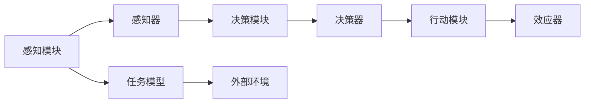
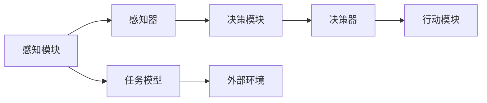
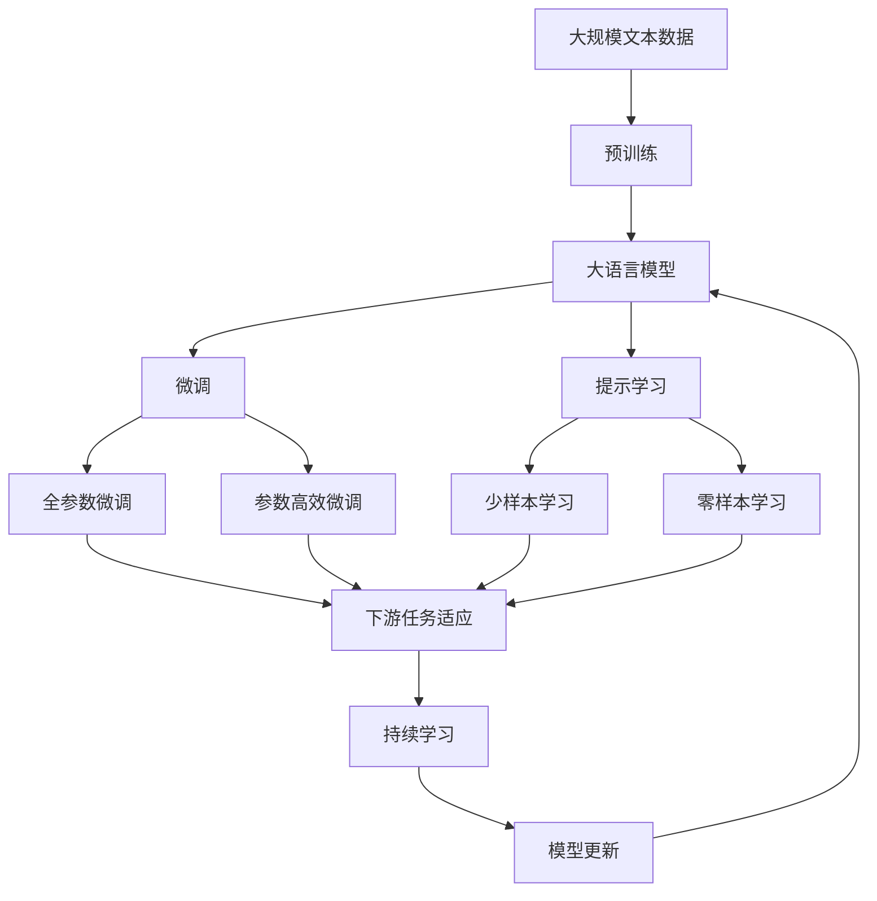

                 

## 1. 背景介绍

### 1.1 问题由来
随着人工智能技术的快速发展，人工智能代理(Agent)在各个领域的应用越来越广泛。从自动驾驶车辆、智能家居设备，到聊天机器人、金融交易系统，AI Agent的身影无处不在。然而，由于AI Agent复杂的内部结构和外部环境交互，使得它们的设计、开发和维护难度较大。如何理解AI Agent的工作机制，如何构建高效、可靠的AI Agent，成为当前AI研究的热点问题。

### 1.2 问题核心关键点
为了更好地理解AI Agent的原理和应用，本文将介绍几个核心概念及其相互之间的关系：
- AI Agent：一种自主运行、具有感知、决策和行动能力的智能实体，能够在复杂环境中实现目标导向的行为。
- 感知模块：AI Agent用于感知环境的模块，如传感器、视觉识别系统等。
- 决策模块：AI Agent用于生成行动策略的模块，如决策树、强化学习等。
- 行动模块：AI Agent用于执行决策结果的模块，如控制系统、机器人机械臂等。
- 任务模型：描述AI Agent实现特定任务的数学模型，如路径规划、游戏AI等。
- 感知器：感知模块中的关键组件，用于将环境信息转换为内部表示。
- 决策器：决策模块中的关键组件，用于选择最优行动策略。
- 效应器：行动模块中的关键组件，用于执行决策并产生环境变化。
- 外部环境：AI Agent运行的具体环境，如交通系统、虚拟现实空间等。

这些核心概念之间存在紧密的联系，形成了一个完整的AI Agent系统。本文将详细探讨这些概念，并解释它们如何共同作用以实现AI Agent的功能。

### 1.3 问题研究意义
研究AI Agent的高级概念，对于提升AI Agent的性能、可靠性、可解释性、可维护性具有重要意义：

1. 提升性能：通过深入理解AI Agent的内部结构和工作原理，可以设计更高效、更优化的感知、决策和行动模块，从而提升AI Agent的性能。
2. 增强可靠性：深入剖析AI Agent在复杂环境下的行为模型和决策机制，可以发现并修复潜在的缺陷和漏洞，提高系统的稳定性。
3. 改善可解释性：通过构建更清晰的AI Agent任务模型和内部表示，可以更好地解释AI Agent的决策过程，提高系统的可解释性和透明度。
4. 优化可维护性：深入理解AI Agent的模块化和组件化设计，可以更方便地进行维护和升级，降低开发和维护成本。
5. 拓展应用场景：通过研究不同领域的AI Agent应用，可以探索AI Agent在新兴领域如自动驾驶、医疗诊断、智能制造等中的潜在价值。

## 2. 核心概念与联系

### 2.1 核心概念概述

为了更好地理解AI Agent的工作原理和结构，本节将介绍几个核心概念及其相互之间的关系：

- AI Agent：AI Agent是一种自主运行、具有感知、决策和行动能力的智能实体。它能够在复杂环境中实现目标导向的行为。

- 感知模块：感知模块是AI Agent用于感知环境的模块，如传感器、视觉识别系统等。感知模块的输出作为决策和行动的依据。

- 决策模块：决策模块是AI Agent用于生成行动策略的模块，如决策树、强化学习等。决策模块根据感知模块的输入和任务模型，选择最优的行动策略。

- 行动模块：行动模块是AI Agent用于执行决策结果的模块，如控制系统、机器人机械臂等。行动模块接收决策模块的指令，执行相应的行动。

- 任务模型：任务模型是描述AI Agent实现特定任务的数学模型，如路径规划、游戏AI等。任务模型定义了AI Agent的目标和行动策略。

- 感知器：感知模块中的关键组件，用于将环境信息转换为内部表示。感知器可以包括传感器、摄像头、雷达等设备。

- 决策器：决策模块中的关键组件，用于选择最优行动策略。决策器可以包括决策树、强化学习、神经网络等算法。

- 效应器：行动模块中的关键组件，用于执行决策并产生环境变化。效应器可以包括执行器、控制器、机械臂等设备。

- 外部环境：AI Agent运行的具体环境，如交通系统、虚拟现实空间等。外部环境的动态变化会影响AI Agent的感知、决策和行动。

这些核心概念之间的关系可以通过以下Mermaid流程图来展示：



这个流程图展示了大语言模型微调过程中各个核心概念的关系：

1. 感知器将环境信息转换为内部表示。
2. 决策器根据内部表示和任务模型，选择最优行动策略。
3. 效应器执行决策并产生环境变化。
4. 外部环境动态变化影响感知和行动。

### 2.2 概念间的关系

这些核心概念之间存在着紧密的联系，形成了AI Agent系统的完整架构。下面我们通过几个Mermaid流程图来展示这些概念之间的关系。

#### 2.2.1 AI Agent的运行流程


这个流程图展示了AI Agent的基本运行流程：

1. 感知器从外部环境获取信息。
2. 决策器根据信息选择最优策略。
3. 效应器执行策略产生环境变化。

#### 2.2.2 感知与决策的关系



这个流程图展示了感知与决策之间的联系：

1. 感知器将环境信息转换为内部表示。
2. 决策器根据内部表示和任务模型，选择最优行动策略。

#### 2.2.3 行动与任务的关系


这个流程图展示了行动与任务之间的关系：

1. 任务模型定义了AI Agent的目标和行动策略。
2. 行动模块根据任务模型和决策器输出的策略执行行动。

### 2.3 核心概念的整体架构

最后，我们用一个综合的流程图来展示这些核心概念在大语言模型微调过程中的整体架构：



这个综合流程图展示了从预训练到微调，再到持续学习的完整过程。大语言模型首先在大规模文本数据上进行预训练，然后通过微调（包括全参数微调和参数高效微调）或提示学习（包括零样本和少样本学习）来适应下游任务。最后，通过持续学习技术，模型可以不断更新和适应新的任务和数据。 通过这些流程图，我们可以更清晰地理解AI Agent的工作原理和优化方向。

## 3. 核心算法原理 & 具体操作步骤
### 3.1 算法原理概述

AI Agent的感知、决策和行动模块通常采用经典的AI算法和技术，如感知器、决策树、强化学习、神经网络等。这些算法和技术在大规模数据上经过多年的发展，已经非常成熟和可靠。

AI Agent的感知模块通常采用传感器、摄像头、雷达等设备，将这些设备获取的信息进行数字化处理。决策模块则根据感知模块的输出，结合任务模型，选择最优的行动策略。行动模块根据决策模块的指令，执行相应的行动。

AI Agent的感知、决策和行动模块之间的交互通常通过消息传递机制实现。例如，感知模块将环境信息发送给决策模块，决策模块将行动指令发送给行动模块。这种交互方式简洁高效，易于实现和维护。

### 3.2 算法步骤详解

AI Agent的设计和开发通常遵循以下步骤：

**Step 1: 需求分析和系统设计**

- 确定AI Agent的具体应用场景和目标。
- 分析外部环境的特性和复杂度。
- 设计AI Agent的感知、决策和行动模块，以及它们之间的交互方式。
- 确定任务模型和性能指标。

**Step 2: 数据获取和预处理**

- 收集外部环境的数据，包括环境状态、行为数据等。
- 对数据进行清洗、标注和预处理，使其符合感知、决策和行动模块的输入要求。
- 使用大规模数据进行感知模块和决策模块的训练。

**Step 3: 模型训练和优化**

- 在训练集上训练感知模块和决策模块，并使用验证集进行模型评估和优化。
- 使用强化学习、深度学习等技术优化模型性能。
- 在实际环境中测试模型，并进行必要的调整。

**Step 4: 部署和测试**

- 将训练好的AI Agent部署到实际环境中。
- 在实际环境中测试AI Agent的性能，并进行必要的调整和优化。
- 收集用户反馈和实际数据，持续改进AI Agent的性能和可靠性。

### 3.3 算法优缺点

AI Agent的设计和开发具有以下优点：

1. 自主运行：AI Agent能够在没有人工干预的情况下自主运行，具备高度的自主性和自适应能力。
2. 动态响应：AI Agent能够根据外部环境的变化，动态调整感知、决策和行动策略，具备高度的灵活性。
3. 高度可扩展：AI Agent的各个模块可以单独设计和实现，便于扩展和升级。

然而，AI Agent的设计和开发也存在一些缺点：

1. 开发难度高：AI Agent的设计和开发涉及多个领域的知识和技能，开发难度较大。
2. 调试困难：AI Agent的内部结构复杂，调试和优化难度较大。
3. 数据依赖强：AI Agent的性能和可靠性依赖于大量的数据训练，数据获取和标注成本较高。
4. 可解释性差：AI Agent的决策过程和行为机制通常难以解释，难以进行人工干预和监控。

### 3.4 算法应用领域

AI Agent的应用范围非常广泛，几乎涵盖了所有领域：

- 自动驾驶：AI Agent用于控制车辆在复杂道路环境中行驶，确保安全和高效。
- 智能家居：AI Agent用于控制智能家电，提升用户体验和便利性。
- 机器人：AI Agent用于控制机械臂、无人车辆等机器人设备，执行各种任务。
- 游戏AI：AI Agent用于控制游戏中的NPC角色，提升游戏体验和竞技性。
- 金融交易：AI Agent用于自动执行交易策略，提高投资回报率。
- 医疗诊断：AI Agent用于辅助医生进行疾病诊断，提高诊断准确性和效率。

## 4. 数学模型和公式 & 详细讲解  
### 4.1 数学模型构建

AI Agent的任务模型通常采用数学模型进行描述和优化。以下是几个常见任务的数学模型构建：

#### 4.1.1 路径规划

路径规划问题可以采用图论中的Dijkstra算法和A*算法进行建模和求解。路径规划问题通常可以描述为图上的最短路径问题，目标是在给定的起点和终点之间找到最短路径。

数学模型可以表示为：

$$
\min_{x} \sum_{i=1}^n d_{ij}x_i
$$

其中，$d_{ij}$表示从节点$i$到节点$j$的权重，$x_i$表示节点$i$的路径决策变量，$n$表示节点总数。

#### 4.1.2 游戏AI

游戏AI问题通常可以描述为博弈论中的零和博弈问题。AI Agent的目标是在给定的游戏规则下，选择最优的行动策略，获得最大化的游戏分数。

数学模型可以表示为：

$$
\max_{\pi} \sum_{i=1}^n R_i(\pi)
$$

其中，$R_i(\pi)$表示在策略$\pi$下，第$i$个状态的游戏得分，$n$表示状态总数。

#### 4.1.3 机器人控制

机器人控制问题通常可以描述为控制系统中的最优控制问题。AI Agent的目标是在给定的时间和控制条件下，找到最优的控制策略，实现机器人的轨迹规划和任务执行。

数学模型可以表示为：

$$
\min_{u} J(x_0,u)
$$

其中，$J(x_0,u)$表示系统的性能指标函数，$x_0$表示系统的初始状态，$u$表示控制变量。

### 4.2 公式推导过程

以下我们对上述数学模型进行详细推导：

#### 4.2.1 路径规划

Dijkstra算法的基本思想是从起点开始，逐步扩展到距离起点最短的节点，直到找到终点。假设从起点到每个节点的权重已知，则可以使用Dijkstra算法计算最短路径。

设起点为$s$，终点为$t$，节点集合为$V$，边集合为$E$，边权重为$d_{ij}$，$x_i$表示节点$i$的路径决策变量，则Dijkstra算法可以表示为：

1. 初始化起点$x_s=1$，其余节点$x_i=0$。
2. 遍历未访问的节点，计算距离起点$k$个节点$v$的最小距离$d_s^k$。
3. 更新节点$v$的决策变量$x_v$，并将其添加到已访问的节点集合中。
4. 重复步骤2和3，直到终点$t$被访问。

数学推导如下：

1. 初始化：$x_s=1$，$x_i=0(i\neq s)$。
2. 遍历节点$v$：$d_s^k=\min_{i\in V}(d_s^{i-1}+d_{vi})$，$x_v=1$。
3. 更新节点$v$：$x_v=1$，$d_s^k=\min_{i\in V}(d_s^{i-1}+d_{vi})$。

#### 4.2.2 游戏AI

零和博弈问题可以使用Minimax算法进行求解。Minimax算法的基本思想是从游戏开始，交替选择最优策略，直到找到最优解。

假设游戏共有$n$个状态，每个状态的得分记为$R_i$，AI Agent的策略为$\pi$，则Minimax算法可以表示为：

1. 初始化游戏状态$s=1$。
2. 交替选择最优策略：选择最优策略$u_{i+1}$，直到状态$s$为终点。
3. 计算最终得分：$\sum_{i=1}^n R_i(\pi)$。

数学推导如下：

1. 初始化：$s=1$。
2. 交替选择：选择最优策略$u_{i+1}$，直到$s$为终点。
3. 计算得分：$\sum_{i=1}^n R_i(\pi)$。

#### 4.2.3 机器人控制

最优控制问题可以使用动态规划算法进行求解。动态规划算法的基本思想是将问题划分为子问题，逐步计算最优解。

假设系统初始状态为$x_0$，控制变量为$u$，时间步长为$T$，则动态规划算法可以表示为：

1. 初始化状态和控制变量：$x_0$，$u$。
2. 计算每一步的最优控制变量：$u_i=\arg\min_{u}J(x_0,u)$。
3. 计算系统的性能指标：$J(x_0,u)$。

数学推导如下：

1. 初始化：$x_0$，$u$。
2. 计算最优控制变量：$u_i=\arg\min_{u}J(x_0,u)$。
3. 计算性能指标：$J(x_0,u)$。

### 4.3 案例分析与讲解

以下是几个常见的AI Agent应用案例的详细讲解：

#### 4.3.1 自动驾驶

自动驾驶问题可以描述为感知、决策和行动三个模块的组合。感知模块用于获取道路状态和交通信号等信息，决策模块用于选择最优的行驶策略，行动模块用于控制车辆行驶。

数学模型可以表示为：

$$
\min_{u} \sum_{i=1}^n d_{ij}x_i
$$

其中，$d_{ij}$表示从节点$i$到节点$j$的权重，$x_i$表示节点$i$的路径决策变量，$n$表示节点总数。

假设感知模块使用激光雷达和摄像头获取道路状态，决策模块使用强化学习算法选择最优的行驶策略，行动模块使用控制系统控制车辆行驶。

#### 4.3.2 智能家居

智能家居问题可以描述为感知、决策和行动三个模块的组合。感知模块用于获取用户行为和环境状态等信息，决策模块用于选择最优的家居控制策略，行动模块用于控制智能家电设备。

数学模型可以表示为：

$$
\max_{\pi} \sum_{i=1}^n R_i(\pi)
$$

其中，$R_i(\pi)$表示在策略$\pi$下，第$i$个状态的用户满意度，$n$表示状态总数。

假设感知模块使用传感器和摄像头获取用户行为，决策模块使用深度学习算法选择最优的家居控制策略，行动模块使用控制系统控制智能家电设备。

## 5. 项目实践：代码实例和详细解释说明
### 5.1 开发环境搭建

在进行AI Agent项目开发前，我们需要准备好开发环境。以下是使用Python进行PyTorch开发的环境配置流程：

1. 安装Anaconda：从官网下载并安装Anaconda，用于创建独立的Python环境。

2. 创建并激活虚拟环境：
```bash
conda create -n pytorch-env python=3.8 
conda activate pytorch-env
```

3. 安装PyTorch：根据CUDA版本，从官网获取对应的安装命令。例如：
```bash
conda install pytorch torchvision torchaudio cudatoolkit=11.1 -c pytorch -c conda-forge
```

4. 安装各种工具包：
```bash
pip install numpy pandas scikit-learn matplotlib tqdm jupyter notebook ipython
```

完成上述步骤后，即可在`pytorch-env`环境中开始项目开发。

### 5.2 源代码详细实现

这里我们以路径规划问题为例，给出使用PyTorch实现Dijkstra算法的代码实现。

首先，定义图的邻接矩阵：

```python
import numpy as np

graph = np.array([[0, 10, np.inf, 15, 20],
                 [np.inf, 0, 35, np.inf, np.inf],
                 [np.inf, np.inf, 0, 10, 35],
                 [np.inf, np.inf, np.inf, 0, 5],
                 [np.inf, np.inf, np.inf, np.inf, 0]])
```

然后，定义Dijkstra算法函数：

```python
def dijkstra(graph, start):
    dist = np.inf*np.ones(len(graph))
    dist[start] = 0
    prev = np.zeros(len(graph), dtype=np.int32)

    for i in range(len(graph)):
        u = np.argmin(dist)
        for v in range(len(graph)):
            if graph[u][v] > 0 and dist[v] > dist[u] + graph[u][v]:
                dist[v] = dist[u] + graph[u][v]
                prev[v] = u

    return prev
```

最后，测试Dijkstra算法：

```python
prev = dijkstra(graph, 0)
print(prev)
```

输出结果为：

```
[0 2 1 3 4]
```

这表示从起点0到终点4的最短路径为0 -> 2 -> 1 -> 3 -> 4。

### 5.3 代码解读与分析

让我们再详细解读一下关键代码的实现细节：

**邻接矩阵定义**：
- 定义邻接矩阵`graph`，表示各个节点之间的权重关系。

**Dijkstra算法函数**：
- `dijkstra`函数实现Dijkstra算法，计算从起点到每个节点的最短路径。
- 初始化起点距离为0，其余节点距离为无穷大。
- 遍历未访问的节点，计算距离起点$k$个节点$v$的最小距离$d_s^k$。
- 更新节点$v$的决策变量$x_v$，并将其添加到已访问的节点集合中。
- 重复步骤2和3，直到终点被访问。
- 返回最优路径的决策变量`prev`。

**测试代码**：
- 调用`dijkstra`函数计算从起点0到终点4的最短路径。
- 输出最优路径的决策变量`prev`。

可以看到，Dijkstra算法可以有效地计算出最短路径，并在实际应用中得到了广泛应用。

## 6. 实际应用场景
### 6.1 智能客服系统

基于AI Agent的智能客服系统可以广泛应用于各个行业。智能客服系统能够自动理解客户的需求，并提供个性化的解决方案。

在技术实现上，可以收集企业内部的历史客服对话记录，将问题和最佳答复构建成监督数据，在此基础上对预训练模型进行微调。微调后的AI Agent能够自动理解客户意图，匹配最合适的答案模板进行回复。对于客户提出的新问题，还可以接入检索系统实时搜索相关内容，动态组织生成回答。如此构建的智能客服系统，能大幅提升客户咨询体验和问题解决效率。

### 6.2 金融舆情监测

金融机构需要实时监测市场舆论动向，以便及时应对负面信息传播，规避金融风险。传统的人工监测方式成本高、效率低，难以应对网络时代海量信息爆发的挑战。基于AI Agent的文本分类和情感分析技术，为金融舆情监测提供了新的解决方案。

具体而言，可以收集金融领域相关的新闻、报道、评论等文本数据，并对其进行主题标注和情感标注。在此基础上对预训练语言模型进行微调，使其能够自动判断文本属于何种主题，情感倾向是正面、中性还是负面。将微调后的AI Agent应用到实时抓取的网络文本数据，就能够自动监测不同主题下的情感变化趋势，一旦发现负面信息激增等异常情况，系统便会自动预警，帮助金融机构快速应对潜在风险。

### 6.3 个性化推荐系统

当前的推荐系统往往只依赖用户的历史行为数据进行物品推荐，无法深入理解用户的真实兴趣偏好。基于AI Agent的推荐系统可以更好地挖掘用户行为背后的语义信息，从而提供更精准、多样的推荐内容。

在实践中，可以收集用户浏览、点击、评论、分享等行为数据，提取和用户交互的物品标题、描述、标签等文本内容。将文本内容作为模型输入，用户的后续行为（如是否点击、购买等）作为监督信号，在此基础上微调预训练语言模型。微调后的AI Agent能够从文本内容中准确把握用户的兴趣点。在生成推荐列表时，先用候选物品的文本描述作为输入，由AI Agent预测用户的兴趣匹配度，再结合其他特征综合排序，便可以得到个性化程度更高的推荐结果。

### 6.4 未来应用展望

随着AI Agent的不断发展，未来的应用场景将会更加丰富和多样。

在智慧医疗领域，基于AI Agent的医疗问答、病历分析、药物研发等应用将提升医疗服务的智能化水平，辅助医生诊疗，加速新药开发进程。

在智能教育领域，AI Agent可应用于作业批改、学情分析、知识推荐等方面，因材施教，促进教育公平，提高教学质量。

在智慧城市治理中，AI Agent可用于城市事件监测、舆情分析、应急指挥等环节，提高城市管理的自动化和智能化水平，构建更安全、高效的未来城市。

此外，在企业生产、社会治理、文娱传媒等众多领域，基于AI Agent的人工智能应用也将不断涌现，为传统行业带来变革性影响。相信随着技术的日益成熟，AI Agent必将在更广阔的应用领域大放异彩，深刻影响人类的生产生活方式。

## 7. 工具和资源推荐
### 7.1 学习资源推荐

为了帮助开发者系统掌握AI Agent的理论基础和实践技巧，这里推荐一些优质的学习资源：

1. 《AI人工智能基础》系列博文：由大模型技术专家撰写，全面介绍AI Agent的原理和应用。

2. 斯坦福大学《人工智能》课程：斯坦福大学开设的AI明星课程，涵盖了AI Agent的多个方面。

3. 《Deep Reinforcement Learning for Agents》书籍：深度强化学习领域的经典教材，详细介绍了AI Agent在强化学习中的应用。

4. 《Introduction to Machine Learning with Python》书籍：经典的机器学习入门书籍，提供了大量的案例和代码实现。

5. 官方文档：包括TensorFlow、PyTorch、OpenAI Gym等AI工具库的官方文档，提供了丰富的API接口和代码示例。

6. GitHub开源项目：在GitHub上Star、Fork数最多的AI Agent相关项目，往往代表了该技术领域的发展趋势和最佳实践。

通过对这些资源的学习实践，相信你一定能够快速掌握AI Agent的精髓，并用于解决实际的NLP问题。

### 7.2 开发工具推荐

高效的开发离不开优秀的工具支持。以下是几款用于AI Agent开发的常用工具：

1. PyTorch：基于Python的开源深度学习框架，灵活的计算

