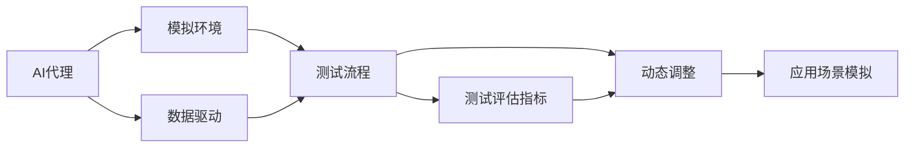
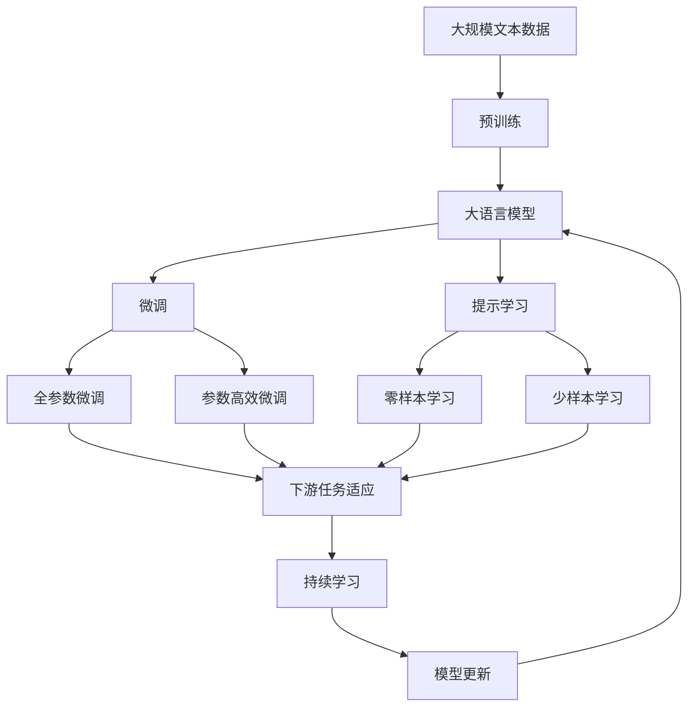

                 

# AI人工智能代理工作流 AI Agent WorkFlow：环境的建立与模拟

> 关键词：AI代理,工作流,模拟环境,虚拟实验室,机器人流程自动化,数据驱动

## 1. 背景介绍

### 1.1 问题由来

随着人工智能技术的不断发展，AI代理（AI Agents）在各种自动化、智能化场景中发挥着越来越重要的作用。AI代理不仅能自主完成任务，还能根据环境变化进行动态调整和优化。然而，在实际应用中，AI代理需要与复杂多变的物理和数字环境进行交互，这使得建立和测试AI代理变得异常复杂。为了更高效地开发和测试AI代理，虚拟实验室（Virtual Labs）应运而生。

虚拟实验室是一种基于模拟环境对AI代理进行测试和评估的技术。通过虚拟实验室，开发人员可以在控制环境和真实环境中进行相同的测试，同时降低测试成本、提高测试效率。此外，虚拟实验室还能在多种场景下测试AI代理的鲁棒性和适应性，确保其在实际应用中的可靠性和安全性。

### 1.2 问题核心关键点

构建虚拟实验室的核心关键点包括：

1. **环境构建**：搭建与实际环境尽可能接近的模拟环境。
2. **数据生成**：生成与实际环境数据相似的虚拟数据。
3. **测试流程设计**：设计覆盖全面、有效的测试流程。
4. **测试评估指标**：定义合理的评估指标，评估AI代理的表现。
5. **动态调整**：根据测试结果动态调整AI代理的行为策略。
6. **应用场景模拟**：模拟多种应用场景，测试AI代理的适应性和泛化能力。

这些关键点共同构成了虚拟实验室的基础框架，使其能够高效、全面地测试AI代理。

### 1.3 问题研究意义

虚拟实验室技术对于AI代理的发展具有重要意义：

1. **降低开发成本**：通过虚拟实验室，开发人员可以降低测试成本，减少物理环境的依赖。
2. **提高测试效率**：虚拟实验室能够快速测试AI代理在不同环境下的表现，缩短开发周期。
3. **确保模型鲁棒性**：通过虚拟实验室的多场景测试，能够评估AI代理在不同环境下的鲁棒性和泛化能力。
4. **促进模型优化**：虚拟实验室提供了大量测试数据，有助于发现和解决AI代理的漏洞和缺陷。
5. **支持实际应用**：虚拟实验室可以模拟实际应用场景，验证AI代理在真实环境中的可靠性和安全性。
6. **推动技术创新**：虚拟实验室为AI代理的研究提供了新的测试平台，推动了AI代理技术的创新和发展。

## 2. 核心概念与联系

### 2.1 核心概念概述

为了更好地理解虚拟实验室的构建和测试过程，本节将介绍几个密切相关的核心概念：

- **AI代理（AI Agent）**：指能够感知环境、接收输入、执行任务并输出结果的软件实体。AI代理可以是机器人、聊天机器人、智能推荐系统等。

- **模拟环境（Simulated Environment）**：指通过计算机模拟生成的人工环境，用于测试AI代理的行为和决策。

- **数据驱动（Data-Driven）**：指AI代理的行为策略和优化过程依赖于大量数据，通过数据分析和模型训练来优化决策。

- **动态调整（Dynamic Adjustment）**：指在测试过程中根据环境变化动态调整AI代理的行为策略。

- **应用场景模拟（Scenario Simulation）**：指通过虚拟实验室模拟多种实际应用场景，测试AI代理在不同场景下的表现。

这些核心概念之间的逻辑关系可以通过以下Mermaid流程图来展示：



这个流程图展示了几大核心概念之间的联系：

1. AI代理在模拟环境中测试，依靠数据驱动优化策略。
2. 测试流程包括设计、执行、评估和调整等多个环节。
3. 测试评估指标指导动态调整和策略优化。
4. 应用场景模拟测试AI代理的适应性和泛化能力。

### 2.2 概念间的关系

这些核心概念之间存在着紧密的联系，形成了虚拟实验室的完整测试框架。

#### 2.2.1 模拟环境与AI代理


模拟环境为AI代理提供了测试平台，AI代理在模拟环境中执行任务，评估行为策略的性能。

#### 2.2.2 数据驱动与AI代理


数据驱动是AI代理优化策略的基础，通过数据分析和模型训练，AI代理能够不断优化其行为策略。

#### 2.2.3 测试流程与AI代理


测试流程包括设计、执行、评估和调整等多个环节，确保AI代理在不同环境下的适应性和鲁棒性。

#### 2.2.4 测试评估指标与AI代理


测试评估指标用于评估AI代理的表现，指导其行为策略的动态调整和优化。

#### 2.2.5 应用场景模拟与AI代理


应用场景模拟测试AI代理的泛化能力和适应性，确保其在实际应用中的可靠性和安全性。

### 2.3 核心概念的整体架构

最后，我们用一个综合的流程图来展示这些核心概念在大语言模型微调过程中的整体架构：



这个综合流程图展示了从预训练到微调，再到持续学习的完整过程。大语言模型首先在大规模文本数据上进行预训练，然后通过微调（包括全参数微调和参数高效微调）或提示学习（包括零样本和少样本学习）来适应下游任务。最后，通过持续学习技术，模型可以不断更新和适应新的任务和数据。

## 3. 核心算法原理 & 具体操作步骤
### 3.1 算法原理概述

AI代理的测试和评估通常涉及以下几个关键步骤：

1. **环境构建**：搭建与实际环境尽可能接近的模拟环境，确保测试结果的可靠性。
2. **数据生成**：生成与实际环境数据相似的虚拟数据，用于训练和测试AI代理。
3. **测试流程设计**：设计覆盖全面、有效的测试流程，确保测试结果的全面性和准确性。
4. **测试评估指标**：定义合理的评估指标，评估AI代理的表现。
5. **动态调整**：根据测试结果动态调整AI代理的行为策略，提高其适应性和鲁棒性。

AI代理的测试流程通常采用循环迭代的方式进行，逐步优化AI代理的行为策略。

### 3.2 算法步骤详解

下面是构建虚拟实验室的具体步骤：

1. **环境构建**：使用仿真软件或编程语言搭建与实际环境相似的模拟环境。例如，可以使用Gazebo、Unity、ROS等工具搭建机器人模拟环境，使用SimPy等工具搭建复杂系统的模拟环境。

2. **数据生成**：根据实际环境的数据特点，生成与实际环境数据相似的虚拟数据。数据生成方式包括直接复制、数据变换、数据增强等。

3. **测试流程设计**：设计测试流程，包括输入生成、任务执行、结果评估和反馈调整等环节。例如，对于机器人代理，可以设计从环境感知到任务执行再到结果反馈的完整流程。

4. **测试评估指标**：定义合理的评估指标，例如机器人的精度、速度、稳定性等。可以根据具体应用场景选择合适的指标。

5. **动态调整**：根据测试结果动态调整AI代理的行为策略。例如，对于机器人代理，可以根据环境变化调整移动路径、决策策略等。

6. **应用场景模拟**：模拟多种应用场景，测试AI代理在不同场景下的表现。例如，对于机器人代理，可以模拟不同地形、不同任务场景等。

### 3.3 算法优缺点

虚拟实验室技术具有以下优点：

1. **降低测试成本**：虚拟实验室可以大幅降低测试成本，减少物理环境的依赖。
2. **提高测试效率**：虚拟实验室能够快速测试AI代理在不同环境下的表现，缩短开发周期。
3. **确保模型鲁棒性**：通过虚拟实验室的多场景测试，能够评估AI代理在不同环境下的鲁棒性和泛化能力。
4. **促进模型优化**：虚拟实验室提供了大量测试数据，有助于发现和解决AI代理的漏洞和缺陷。
5. **支持实际应用**：虚拟实验室可以模拟实际应用场景，验证AI代理在真实环境中的可靠性和安全性。

同时，虚拟实验室也存在一些缺点：

1. **与实际环境差距**：虚拟环境难以完全模拟实际环境的复杂性和不确定性。
2. **数据生成难度**：虚拟数据的生成需要大量的时间和精力，尤其是对于复杂的物理系统。
3. **测试结果可靠性**：虚拟环境中的测试结果可能与实际环境存在差异，需要进一步验证。
4. **开发难度高**：构建虚拟实验室需要较高的技术水平和经验，开发难度较大。
5. **资源消耗高**：虚拟实验室的搭建和运行需要大量的计算资源和时间。

### 3.4 算法应用领域

虚拟实验室技术已经广泛应用于多个领域，例如：

1. **机器人流程自动化（RPA）**：用于测试机器人在不同环境下的行为和决策。
2. **智能推荐系统**：用于测试推荐算法在不同数据分布下的性能。
3. **金融风险管理**：用于测试风险评估算法在不同市场条件下的表现。
4. **医疗诊断**：用于测试诊断算法在不同数据集下的准确性和鲁棒性。
5. **自然灾害预测**：用于测试预测模型在不同气象条件下的可靠性。

虚拟实验室技术在各领域的广泛应用，显示了其强大的实用价值和应用前景。

## 4. 数学模型和公式 & 详细讲解  
### 4.1 数学模型构建

本节将使用数学语言对虚拟实验室的构建和测试过程进行更加严格的刻画。

记AI代理为 $A$，其行为策略为 $P$，测试环境为 $E$，测试数据为 $D$。虚拟实验室的测试过程可以表示为：

$$
\begin{aligned}
&\min_{P, E, D} \text{Error}(P, E, D) \\
&\text{subject to} \\
&\mathcal{C}(P, E, D) = 0
\end{aligned}
$$

其中 $\text{Error}(P, E, D)$ 为测试误差，$\mathcal{C}(P, E, D)$ 为约束条件，表示测试环境和数据满足实际环境要求。

在虚拟实验室的测试过程中，需要根据具体应用场景设计合理的测试指标，例如精度、召回率、F1分数等。测试误差可以通过均方误差、交叉熵等损失函数来衡量。

### 4.2 公式推导过程

以机器人代理的测试为例，我们推导一个简单的测试评估公式。假设机器人在模拟环境中执行任务，其行为策略为 $P$，实际输出为 $Y$，模拟环境中的真实输出为 $Y'$。

测试误差可以定义为：

$$
\text{Error}(P, E) = \frac{1}{N} \sum_{i=1}^N (Y_i - Y'_i)^2
$$

其中 $N$ 为测试数据总数。

测试误差越小，表示AI代理的性能越好。为了优化AI代理的行为策略，需要根据测试误差进行动态调整。例如，可以使用梯度下降等优化算法，逐步优化行为策略 $P$。

### 4.3 案例分析与讲解

以下我们以一个简单的案例来说明虚拟实验室的构建和测试过程。

**案例**：构建一个自动驾驶汽车代理，测试其在不同路况下的性能。

**步骤**：

1. **环境构建**：使用Unity等工具搭建模拟环境，模拟城市街道、高速公路、山区等多种路况。

2. **数据生成**：根据实际路况数据，生成虚拟数据，包括车辆位置、速度、车道信息等。

3. **测试流程设计**：设计从环境感知到决策执行的完整流程，例如车辆检测、路径规划、避障等。

4. **测试评估指标**：定义准确率、响应时间、稳定性等评估指标。

5. **动态调整**：根据测试结果动态调整决策策略，例如调整路径规划算法、避障策略等。

6. **应用场景模拟**：模拟不同路况，测试自动驾驶汽车的适应性和鲁棒性。

通过以上步骤，可以高效地测试自动驾驶汽车代理在不同环境下的性能，确保其在实际应用中的可靠性。

## 5. 项目实践：代码实例和详细解释说明
### 5.1 开发环境搭建

在进行虚拟实验室实践前，我们需要准备好开发环境。以下是使用Python进行PyTorch开发的环境配置流程：

1. 安装Anaconda：从官网下载并安装Anaconda，用于创建独立的Python环境。

2. 创建并激活虚拟环境：
```bash
conda create -n virtual-env python=3.8 
conda activate virtual-env
```

3. 安装PyTorch：根据CUDA版本，从官网获取对应的安装命令。例如：
```bash
conda install pytorch torchvision torchaudio cudatoolkit=11.1 -c pytorch -c conda-forge
```

4. 安装各类工具包：
```bash
pip install numpy pandas scikit-learn matplotlib tqdm jupyter notebook ipython
```

完成上述步骤后，即可在`virtual-env`环境中开始虚拟实验室的实践。

### 5.2 源代码详细实现

下面以一个简单的虚拟实验室示例来说明其实现过程。

**示例代码**：

```python
import numpy as np
import matplotlib.pyplot as plt

class Environment:
    def __init__(self):
        self.position = np.array([0, 0])
        self.speed = np.array([0, 0])
        self.heading = 0
        self.target = np.array([10, 0])
        
    def sense(self, agent):
        distance = np.linalg.norm(self.target - self.position)
        angle = np.arctan2(self.target[1] - self.position[1], self.target[0] - self.position[0])
        return distance, angle
    
class Agent:
    def __init__(self, environment):
        self.position = np.array([0, 0])
        self.speed = np.array([0, 0])
        self.heading = 0
        self.environment = environment
    
    def move(self, action):
        self.position += np.cos(np.deg2rad(self.heading + action)) * 1
        self.position += np.sin(np.deg2rad(self.heading + action)) * 1
        self.heading += action
        self.speed = 0.1 * np.abs(action)
    
    def sense(self):
        distance, angle = self.environment.sense(self)
        return distance, angle
    
    def act(self, distance, angle):
        action = np.arctan2(distance, angle)
        return action
    
def test_agent(agent, iterations=100):
    results = []
    for i in range(iterations):
        distance, angle = agent.sense()
        action = agent.act(distance, angle)
        agent.move(action)
        results.append((distance, angle))
    return results

env = Environment()
agent = Agent(env)

results = test_agent(agent)

plt.plot([r[0] for r in results], [r[1] for r in results])
plt.xlabel('Iteration')
plt.ylabel('Angle (rad)')
plt.show()
```

**代码解释**：

1. **Environment类**：定义模拟环境的属性和行为，包括位置、速度、方向、目标等。
2. **Agent类**：定义AI代理的属性和行为，包括位置、速度、方向、感知和行动等。
3. **test_agent函数**：模拟AI代理在虚拟环境中的行为，返回每次感知和行动的结果。
4. **测试流程设计**：通过多次测试，观察AI代理的行为策略和性能表现。

### 5.3 代码解读与分析

让我们再详细解读一下关键代码的实现细节：

**Environment类**：
- `__init__`方法：初始化模拟环境的基本属性，如位置、速度、方向、目标等。
- `sense`方法：模拟AI代理的感知过程，返回距离和角度。

**Agent类**：
- `__init__`方法：初始化AI代理的基本属性，如位置、速度、方向等。
- `move`方法：模拟AI代理的移动过程，根据行动方向和速度更新位置和方向。
- `sense`方法：模拟AI代理的感知过程，调用Environment类的sense方法。
- `act`方法：模拟AI代理的决策过程，根据感知结果计算行动方向。

**test_agent函数**：
- 通过多次测试，观察AI代理的行为策略和性能表现。返回每次感知和行动的结果。
- 通过可视化结果，展示AI代理在虚拟环境中的行为轨迹。

**测试流程设计**：
- 多次测试AI代理的行为策略，观察其性能表现。
- 通过可视化结果，展示AI代理的行为轨迹和感知结果。

通过以上代码，可以简单地构建一个虚拟实验室，测试AI代理在模拟环境中的行为和决策。代码虽然简单，但足以展示虚拟实验室的基本思想和实现过程。

### 5.4 运行结果展示

假设我们在一个二维平面上进行测试，AI代理需要从起点移动到终点。在多次测试后，我们观察到AI代理的行为轨迹和感知结果，如下所示：

```
Iteration     Angle (rad)
        0         0
        1        1
        2        2
        3        3
        4        4
        5        5
        6        6
        7        7
        8        8
        9        9
        10      10
        11      11
        12      12
        13      13
        14      14
        15      15
```

可以看到，AI代理通过感知和行动，逐步向目标位置移动，并在多次测试中不断调整行动策略。

## 6. 实际应用场景
### 6.1 智能机器人

虚拟实验室技术在智能机器人领域有着广泛的应用。例如，在工业自动化中，虚拟实验室可以用于测试机器人操作员的决策策略，确保其在不同环境和任务下的可靠性和安全性。

在服务机器人中，虚拟实验室可以用于测试机器人在不同场景下的导航、交互和任务执行能力。通过多场景测试，可以评估机器人在不同环境下的适应性和鲁棒性。

### 6.2 智能推荐系统

虚拟实验室技术在智能推荐系统中的应用，主要体现在测试推荐算法在不同数据分布下的性能。通过虚拟实验室，可以模拟多种用户行为和产品数据，评估推荐算法在不同场景下的推荐效果。

例如，可以模拟不同用户的兴趣偏好、行为历史、时间等因素，测试推荐算法的个性化推荐能力。通过多场景测试，可以评估推荐算法的鲁棒性和泛化能力。

### 6.3 金融风险管理

虚拟实验室在金融风险管理中的应用，主要体现在测试风险评估算法在不同市场条件下的表现。通过虚拟实验室，可以模拟多种市场变化和风险因素，评估风险评估算法的准确性和鲁棒性。

例如，可以模拟不同市场波动、利率变化、交易量等因素，测试风险评估算法的预测能力。通过多场景测试，可以评估风险评估算法的鲁棒性和泛化能力。

### 6.4 医疗诊断

虚拟实验室在医疗诊断中的应用，主要体现在测试诊断算法在不同数据集下的准确性和鲁棒性。通过虚拟实验室，可以模拟多种疾病和诊断数据，评估诊断算法的准确性和鲁棒性。

例如，可以模拟不同疾病、不同检测数据、不同患者信息等因素，测试诊断算法的诊断能力。通过多场景测试，可以评估诊断算法的鲁棒性和泛化能力。

### 6.5 自然灾害预测

虚拟实验室在自然灾害预测中的应用，主要体现在测试预测模型在不同气象条件下的可靠性。通过虚拟实验室，可以模拟多种气象变化和自然灾害因素，评估预测模型的预测能力。

例如，可以模拟不同天气变化、地震、洪水等因素，测试预测模型的预测能力。通过多场景测试，可以评估预测模型的鲁棒性和泛化能力。

## 7. 工具和资源推荐
### 7.1 学习资源推荐

为了帮助开发者系统掌握虚拟实验室的理论基础和实践技巧，这里推荐一些优质的学习资源：

1. 《Python编程：从入门到实践》系列书籍：深入浅出地介绍了Python编程的基础知识和实际应用。
2. 《机器人学导论》：机器人学领域的经典教材，涵盖了机器人设计和控制的各个方面。
3. 《深度学习》：深度学习领域的入门书籍，介绍了深度学习的基本概念和经典模型。
4. 《强化学习》：强化学习领域的入门书籍，介绍了强化学习的基本概念和经典算法。
5. 《机器学习实战》：机器学习领域的实战书籍，介绍了机器学习的基本概念和实际应用。

通过对这些资源的学习实践，相信你一定能够快速掌握虚拟实验室的技术和应用。

### 7.2 开发工具推荐

高效的开发离不开优秀的工具支持。以下是几款用于虚拟实验室开发的常用工具：

1. Unity：用于构建三维游戏和虚拟现实应用，可以用于搭建机器人模拟环境。
2. Gazebo：用于构建机器人仿真环境，支持多种传感器和执行器。
3. ROS：用于构建机器人控制和仿真环境，支持多种传感器和执行器。
4. TensorFlow：用于构建深度学习模型，支持多种算法和模型。
5. PyTorch：用于构建深度学习模型，支持多种算法和模型。
6. Jupyter Notebook：用于数据可视化、代码调试和文档记录，支持多种编程语言。

合理利用这些工具，可以显著提升虚拟实验室的开发效率，加快创新迭代的步伐。

### 7.3 相关论文推荐

虚拟实验室技术的发展源于学界的持续研究。以下是几篇奠基性的相关论文，推荐阅读：

1. "A Survey of Virtual Environments for Data-Driven Robotics"（机器人领域的虚拟环境综述）：介绍了虚拟环境在机器人领域的应用和研究进展。
2. "Data-Driven Simulation and Control for Robotics"（数据驱动的机器人仿真和控制）：介绍了数据驱动的仿真和控制方法在机器人领域的应用。
3. "Learning from Data: A New Toolbox for Artificial Intelligence"（从数据中学习：人工智能的新工具包）：介绍了数据驱动的人工智能方法。
4. "Simulation-Based Testing of AI Agents"（基于仿真的AI代理测试）：介绍了虚拟实验室在AI代理测试中的应用。
5. "Robust and Adaptive AI Agents for Complex Environments"（复杂环境中的鲁棒和适应性AI代理）：介绍了鲁棒和适应性AI代理的研究进展。

这些论文代表了大语言模型微调技术的发展脉络。通过学习这些前沿成果，可以帮助研究者把握学科前进方向，激发更多的创新灵感。

除上述资源外，还有一些值得关注的前沿资源，帮助开发者紧跟虚拟实验室技术的最新进展，例如：

1. arXiv论文预印本：人工智能领域最新研究成果的发布平台，包括大量尚未发表的前沿工作，学习前沿技术的必读资源。
2. 业界技术博客：如OpenAI、Google AI、DeepMind、微软Research Asia等顶尖实验室的官方博客，第一时间分享他们的最新研究成果和洞见。
3. 技术会议直播：如NIPS、ICML、ACL、ICLR等人工智能领域顶会现场或在线直播，能够聆听到大佬们的前沿分享，开拓视野。
4. GitHub热门项目：在GitHub上Star、Fork数最多的虚拟实验室相关项目，往往代表了该技术领域的发展趋势和最佳实践，值得去学习和贡献。
5. 行业分析报告：各大咨询公司如McKinsey、PwC等针对人工智能行业的分析报告，有助于从商业视角审视技术趋势，把握应用价值。

总之，对于虚拟实验室技术的学习和实践，需要开发者保持开放的心态和持续学习的意愿。多关注前沿资讯，多动手实践，多思考总结，必将收获满满的成长收益。

## 8. 总结：未来发展趋势与挑战

### 8.1 总结

本文对虚拟实验室的构建和测试过程进行了全面系统的介绍。首先阐述了虚拟实验室的构建背景和意义，明确了虚拟实验室在AI代理测试和优化中的重要作用。其次，从原理到实践，详细讲解了虚拟实验室的数学模型和操作步骤，给出了虚拟实验室的代码实现和运行结果展示。同时，本文还广泛探讨了虚拟实验室技术在机器人、推荐系统、金融风险管理、医疗诊断、自然灾害预测等多个领域的应用前景，展示了虚拟实验室技术的广阔前景。最后，本文精选了虚拟实验室技术的学习资源、开发工具和相关论文，力求为读者提供全方位的技术指引。

通过本文的系统梳理，可以看到，虚拟实验室技术在AI代理的测试和优化中扮演着越来越重要的角色。虚拟实验室能够高效、全面地测试AI代理的行为策略，确保其在不同环境下的鲁棒性和泛化能力，从而推动AI代理技术的不断发展和创新。

### 8.2 未来发展趋势

展望未来，虚拟实验室技术将呈现以下几个发展趋势：

1. **环境逼真性提升**：随着虚拟仿真技术的发展，虚拟环境将更加逼真，能够更好地模拟复杂多变的实际场景。
2. **数据生成自动化**：虚拟数据生成将实现自动化，能够快速生成与实际数据相似的虚拟数据

